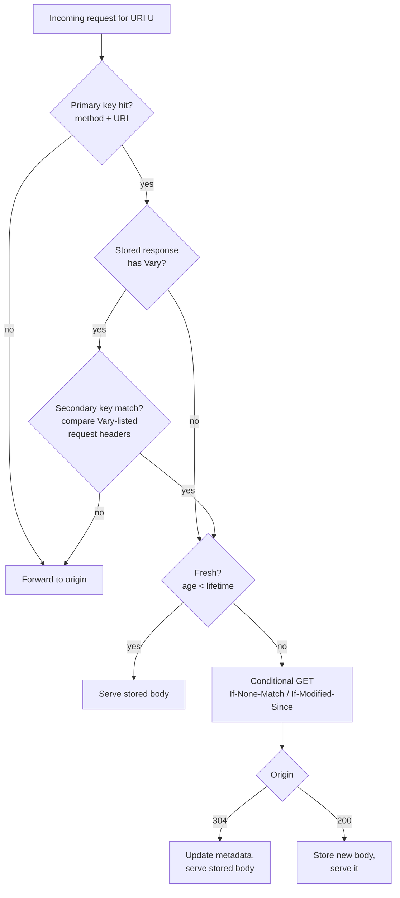
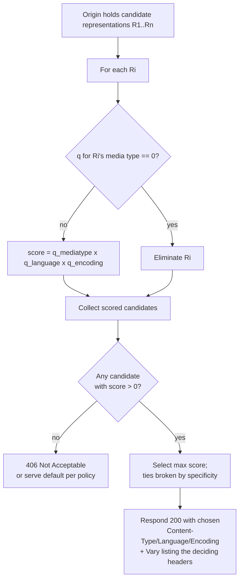
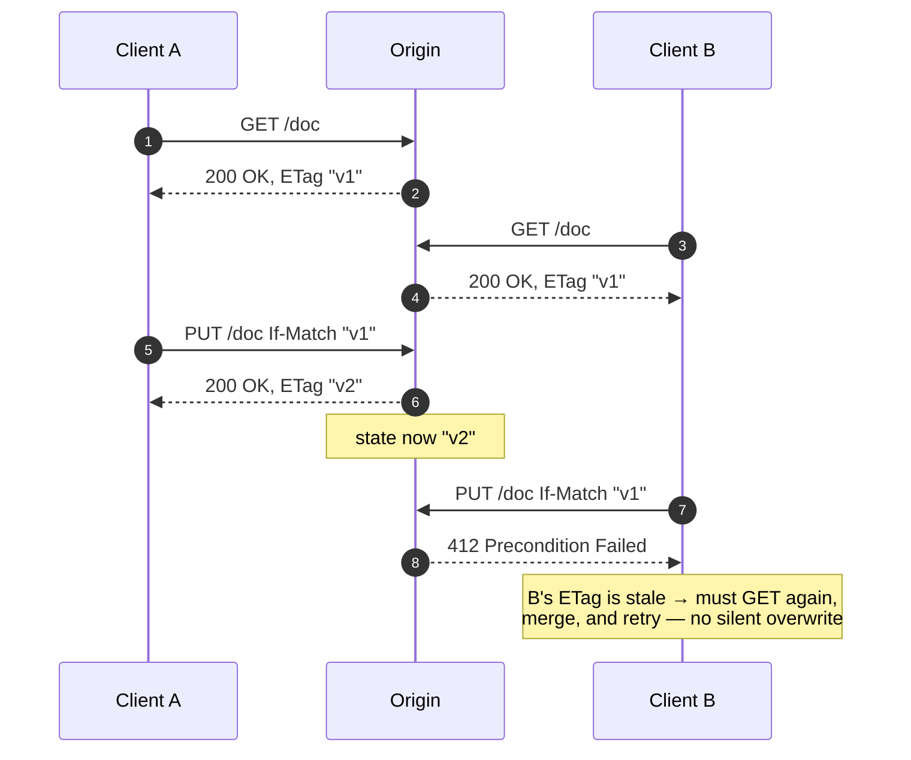
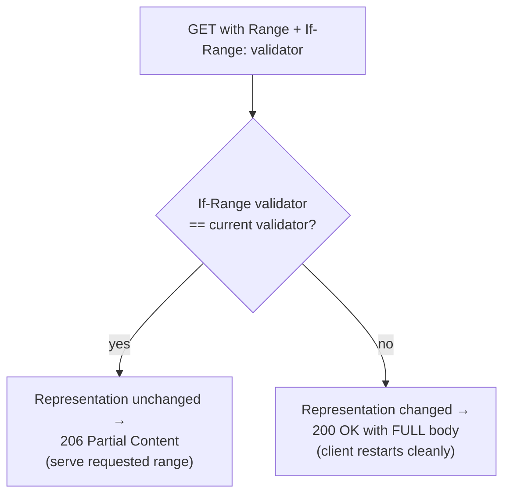
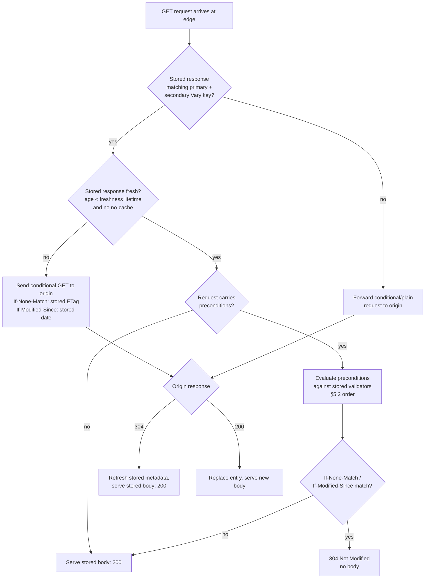

# HTTP — Professional

<!-- level-focus -->
At professional level, focus on this question:

> How should teams adopt and operate **HTTP** with measurable outcomes and limited coordination?

Use the smallest realistic scenario that exposes the decision and its failure behavior.
## 1. The Semantic Model: Resources and Representations

RFC 9110 builds HTTP on three primitive nouns. Getting these exactly right is the whole game;
almost every caching, negotiation, and conditional-request rule is a consequence of them.

- **Resource** — the target of a request, identified by a URI. A resource is an *abstract*
  concept: "the current weather in Tashkent", "user 42's profile", "the invoice PDF". Crucially,
  a resource is **not** a file and **not** a byte string. It is whatever the URI names.

- **Representation** — a concrete, transferable snapshot of a resource's state at a point in
  time, consisting of **representation metadata** (header fields describing it) plus a
  **representation data** stream (the body). One resource can have *many* representations
  simultaneously: `application/json` vs `text/html`, `en` vs `uz`, `gzip`-encoded vs identity,
  the full body vs a byte range. The server's job on a `GET` is to *select* one representation.

- **Selected representation** — the specific representation whose metadata and data the response
  describes. This is the pivotal term: `ETag`, `Last-Modified`, `Content-Length`, and all the
  precondition rules in §5 are defined against **the selected representation**, not against "the
  resource" in the abstract.

```text
                        one Resource (URI)
                              │
        ┌─────────────────────┼─────────────────────┐
        ▼                     ▼                     ▼
  representation A      representation B      representation C
  text/html, en         application/json      application/json
  ETag "v7-html"        ETag "v7-json"        gzip, ETag "v7-json-gz"
```

**Why this matters for correctness.** Because a resource may have multiple representations,
identity (`ETag`) is a property of a **representation**, not of the resource. Two responses for
the same URI with different `Content-Type` values are entitled to different `ETag` values — and
must, if a cache is to store both without confusing them (this is exactly what `Vary` solves, §3).

**Idempotency ≠ representation identity.** A resource's state can change between two `GET`s that
are individually safe; safety says the *client* did not request a change, not that the state is
frozen. Formal reasoning about "the same response" is always about the *selected representation at
the time the response was generated*.

---

## 2. Methods and Their Properties: Safe, Idempotent, Cacheable

RFC 9110 §9 defines three **orthogonal** method properties with precise meanings. Engineers
routinely conflate them; the definitions are worth memorizing verbatim.

- **Safe** (§9.2.1) — the method is *read-only* in intent: the client does not request, and does
  not expect, any state change on the origin server. Safety is a **promise about client
  semantics**, not a guarantee the server does nothing (a `GET` may write a log line or increment
  a counter). Safe methods are what crawlers and prefetchers may invoke freely. Every safe method
  is also idempotent.

- **Idempotent** (§9.2.2) — the *intended effect on the server of N > 0 identical requests is the
  same as the effect of a single request*. This licenses **automatic retry**: a client (or proxy)
  that does not receive a response may resend the request without fear of compounding side effects.
  Idempotency is about the **server-side effect**, not about the response body being byte-identical
  (two `PUT`s may return different `Date` headers; still idempotent).

- **Cacheable** (§9.2.3) — a response to the method is *allowed* to be stored and reused. This is a
  property of the *method* gating whether caching is even permitted; whether a *particular* response
  is actually stored depends on the caching model in §3.

The classic subtlety: **`POST` is neither safe nor idempotent, yet `POST` responses are cacheable**
when explicit freshness information is present (RFC 9110 §9.3.3, RFC 9111 §3). Conversely, `PUT`
and `DELETE` are idempotent but their responses are **not** cacheable.

### 2.1 Method Properties Matrix

| Method  | Safe | Idempotent | Response cacheable | Request body typical | Notes |
|---------|:----:|:----------:|:------------------:|:--------------------:|-------|
| GET     | ✔    | ✔          | ✔                  | no                   | The canonical retrieval; drives the whole cache model |
| HEAD    | ✔    | ✔          | ✔                  | no                   | Identical semantics to GET but no body; validators still apply |
| OPTIONS | ✔    | ✔          | ✘ (by default)     | no                   | Capabilities/CORS preflight |
| TRACE   | ✔    | ✔          | ✘                  | no                   | Loopback diagnostic |
| PUT     | ✘    | ✔          | ✘                  | yes                  | Replace representation; idempotent → safely retryable |
| DELETE  | ✘    | ✔          | ✘                  | no                   | Idempotent: deleting twice = deleted once |
| POST    | ✘    | ✘          | ✔ *(only with explicit freshness)* | yes | Non-idempotent → **not** blindly retryable |
| PATCH   | ✘    | ✘ *(not required)* | ✘          | yes                  | RFC 5789; idempotency depends on the patch format |

**Retry reasoning (load-balancer / proxy relevance).** Because `POST` and `PATCH` are not
idempotent, an intermediary that retries them on a timeout risks duplicate side effects (double
charge, double order). The standard remedy is an application-level **idempotency key** carried in a
request header, letting the server deduplicate — HTTP semantics alone do not make `POST` retryable.

---

## 3. The Caching Model: Freshness, Validation, Keys, and Vary

RFC 9111 defines a **shared** model used by browser caches, forward proxies, reverse proxies, and
CDNs alike. A cache is any component that stores responses and reuses them. The model has two
independent axes: **is this stored response fresh enough to reuse?** and, if not, **can I
revalidate it cheaply instead of refetching the whole body?**

### 3.1 Cache Keys

A cache stores responses under a **primary cache key** — by default the request **method + target
URI** (RFC 9111 §2). This is why `GET /a` and `GET /b` are distinct entries, and why a `POST`
response, even when cacheable, is keyed by the `POST` request. When content negotiation is in play,
the primary key is **not sufficient**, and `Vary` introduces a **secondary cache key** (§3.4).

### 3.2 Freshness

A stored response is **fresh** while its **age** is below its **freshness lifetime**; otherwise it
is **stale** (RFC 9111 §4.2). The freshness lifetime is computed, in priority order:

```text
1. Cache-Control: s-maxage=N   → applies to SHARED caches only (CDN/proxy), overrides below
2. Cache-Control: max-age=N    → seconds from the time the response was generated
3. Expires: <HTTP-date>        → absolute expiry (legacy; superseded by max-age if both present)
4. Heuristic (e.g. from Last-Modified, RFC 9111 §4.2.2) — allowed only when no explicit signal
```

**Age** is computed from the `Date` header, the `Age` header inserted by upstream caches, and the
time the response has resided locally (RFC 9111 §4.2.3). A response is usable **without contacting
the origin** iff `current_age < freshness_lifetime` and no request directive (`no-cache`,
`max-age=0`) forbids reuse.

Key directives that change the rules:

- `no-store` — must not be persisted anywhere. The nuclear option.
- `no-cache` — *may* be stored but **must be revalidated** before every reuse. It does **not** mean
  "don't cache"; it means "cache, but always check first."
- `private` vs `public` — `private` forbids **shared** caches from storing (per-user data);
  `public` explicitly permits storage even in cases normally disallowed.
- `must-revalidate` — once stale, the cache **must not** serve the response without successful
  revalidation (forbids serving stale on origin failure).

### 3.3 Validation

When a stored response goes stale, a cache should **revalidate** rather than refetch. It sends a
**conditional request** (§5) carrying the stored **validators** — `ETag` via `If-None-Match`, and/or
`Last-Modified` via `If-Modified-Since`. Two outcomes:

- **304 Not Modified** — the stored representation is still current. The cache updates stored
  metadata (freshness, new `Date`) and reuses the stored body. **No body is transferred** — this is
  the entire economic point of validation.
- **200 OK** — the representation changed; the origin returns the new body, which replaces the entry.

**Strong vs weak validators (RFC 9110 §8.8).** A **strong** `ETag` (`"abc"`) changes on *any* octet
change and is usable for **byte-range** revalidation. A **weak** `ETag` (`W/"abc"`) only promises
*semantic* equivalence, so it may be used for full-representation caching but **not** to validate a
`Range` request (§6). `Last-Modified` is treated as a **weak** validator unless the origin can
guarantee sub-second modification resolution relative to the `Date`.

### 3.4 Vary — the Secondary Cache Key

Content negotiation (§4) means the *same URI* can yield *different representations* depending on
request headers. Without protection, a cache could store the French HTML and then serve it to a
client that asked for JSON. `Vary` (RFC 9110 §12.5.5) is the origin's declaration of **which request
headers were inputs to representation selection**, forming a **secondary cache key**.

```text
Response:
    Content-Type: application/json
    Content-Language: en
    Vary: Accept, Accept-Language

→ The cache may reuse this entry ONLY for a subsequent request whose
  (Accept, Accept-Language) values select-match the original request's.
```

- `Vary: *` — the response is essentially **uncacheable** for reuse (selection depends on factors
  outside the request headers).
- Omitting a header from `Vary` that *actually* influenced selection is a **correctness bug**: the
  cache will serve the wrong representation. This is the single most common real-world CDN incident
  around negotiation.



---

## 4. Content Negotiation: Accept, Content-Type, and Quality Values

**Content negotiation** (RFC 9110 §12) is the mechanism by which client and server agree on *which*
representation of a resource to transfer. The most common form is **proactive** (server-driven)
negotiation: the client expresses preferences via `Accept*` request headers, and the origin selects.

### 4.1 The Negotiation Dimensions and Headers

| Dimension        | Request header    | Response header      | Selects on |
|------------------|-------------------|----------------------|-----------|
| Media type       | `Accept`          | `Content-Type`       | `application/json` vs `text/html` |
| Language         | `Accept-Language` | `Content-Language`   | `en`, `uz`, `fr-CA` |
| Content coding   | `Accept-Encoding` | `Content-Encoding`   | `gzip`, `br`, `identity` |
| Character set    | `Accept-Charset`  | (charset in `Content-Type`) | mostly historical; UTF-8 assumed |

`Content-Type` on a **request** describes the body the client is *sending* (e.g., what `POST` data
is); `Content-Type` on a **response** describes the selected representation. These are not the same
role and must not be conflated.

### 4.2 Quality Values (q)

Preferences are ranked with **quality values**: a `q` parameter in the range `0.000`–`1.000`
(RFC 9110 §12.4.2). Higher `q` = more preferred; `q=0` means **"not acceptable"** — an explicit veto.
Absence of `q` implies `q=1`. Specificity acts as a tie-breaker (a more specific media range wins
over a wildcard at equal `q`).

```text
Accept: text/html, application/json;q=0.9, */*;q=0.1

Ranked preference:
    text/html            q = 1.0   (implicit)   ← most preferred
    application/json     q = 0.9
    everything else      q = 0.1

Accept-Encoding: gzip, br;q=1.0, identity;q=0
    → br and gzip acceptable; identity (uncompressed) FORBIDDEN.
      If the server cannot compress, it must return 406 (or ignore, per policy).
```

### 4.3 Resolution Algorithm

For each candidate representation the origin holds, the server computes a match score against the
`Accept*` headers and picks the highest, subject to any `q=0` vetoes.



**Failure mode.** If no candidate is acceptable, the origin **may** return `406 Not Acceptable`, but
in practice many servers instead serve a sensible default representation (RFC 9110 permits this;
`406` is discouraged when a usable default exists). Any negotiated response **must** emit a `Vary`
header naming exactly the headers that influenced the choice (§3.4) or caches will misbehave.

---

## 5. Conditional Requests: Preconditions, Validators, and 304/412

A **conditional request** (RFC 9110 §13) carries one or more **preconditions** — header fields whose
evaluation against the **selected representation's** current validators decides whether the origin
performs the requested action. Two distinct uses:

1. **Cache revalidation** (`GET` + `If-None-Match`/`If-Modified-Since`) → save bandwidth via `304`.
2. **Lost-update prevention** (`PUT`/`PATCH`/`DELETE` + `If-Match`/`If-Unmodified-Since`) → reject a
   write that would clobber a concurrent change, via `412`.

### 5.1 The Precondition Headers

| Header                 | Validator | Passes when …                                              | On failure |
|------------------------|-----------|------------------------------------------------------------|------------|
| `If-Match`             | ETag      | current ETag matches one listed (or `*` = resource exists) | **412** Precondition Failed |
| `If-None-Match`        | ETag      | current ETag matches **none** listed (or `*` = must not exist) | GET/HEAD → **304**; other methods → **412** |
| `If-Modified-Since`    | date      | representation modified after the given date               | GET/HEAD → **304** |
| `If-Unmodified-Since`  | date      | representation **not** modified since the given date        | **412** Precondition Failed |
| `If-Range`             | ETag/date | validator still matches → serve requested range (`206`)     | serve full `200` instead |

### 5.2 Evaluation Precedence (RFC 9110 §13.2.2)

The order is **normative and load-bearing** — a server must evaluate preconditions in this exact
sequence, and stop at the first that determines the outcome:

```text
1. If-Match            present? → evaluate. Fail → 412 (stop).
2. If-Unmodified-Since present AND If-Match absent? → evaluate. Fail → 412 (stop).
3. If-None-Match       present? → evaluate. Fail → (304 for GET/HEAD, else 412) (stop).
4. If-Modified-Since   present AND If-None-Match absent, method is GET/HEAD?
                       → evaluate. Fail → 304 (stop).
5. If-Range            present AND a Range header present? → evaluate → 206 or 200 (§6).
```

Note the **subsumption rules**: `If-None-Match` takes precedence over `If-Modified-Since`
(ETag validation is stronger than date validation), and `If-Match` over `If-Unmodified-Since`.
A client that sends both an ETag and a date precondition is telling the server to prefer the ETag.

### 5.3 Optimistic Concurrency (the `If-Match` / `412` pattern)

This is how HTTP prevents the **lost-update problem** without server-side locks:



Without `If-Match`, B's blind `PUT` would silently overwrite A's change. The precondition converts a
**silent data loss** into an **explicit, recoverable `412`**. This is the canonical answer to "how do
you do concurrency control over a stateless protocol."

### 5.4 The Two Failure Codes, Precisely

- **304 Not Modified** — a **success-ish** response for *safe conditional GET/HEAD*: "your cached copy
  is still valid." Carries **no body**; carries updated metadata (`ETag`, `Cache-Control`, `Date`,
  `Vary`) so the cache can refresh freshness. Only emitted when the precondition *would have allowed*
  a `200`.
- **412 Precondition Failed** — a **client-error** response for *unsafe* methods (or `If-Match`
  failures): "the state you assumed no longer holds; I refused to act." The requested action was
  **not** performed. The client must re-read and retry.

---

## 6. Range Requests and 206 Partial Content

**Range requests** (RFC 9110 §14) let a client retrieve *part* of a representation — essential for
resumable downloads, video seeking, and parallel segmented fetching.

### 6.1 Mechanics

```text
Request:
    GET /video.mp4
    Range: bytes=0-1023          ← first 1024 bytes
    (or:  bytes=1024-           ← from 1024 to end
     or:  bytes=-500            ← last 500 bytes)

Success response:
    206 Partial Content
    Content-Range: bytes 0-1023/1048576    ← offset/total
    Content-Length: 1024                    ← length of THIS part
    Accept-Ranges: bytes                    ← advertises range support
    ETag: "v7"
    <1024 bytes of body>
```

- **`Accept-Ranges: bytes`** (or `none`) advertises whether the server honors ranges. A server that
  ignores `Range` simply returns a normal `200 OK` with the full body — a legal fallback.
- An **unsatisfiable** range (start beyond the representation length) → **416 Range Not Satisfiable**,
  with a `Content-Range: bytes */<total>` header stating the true size.
- Multiple ranges → a `multipart/byteranges` body, each part carrying its own `Content-Range`.

### 6.2 `If-Range` — Atomic Resume

The danger with resumable downloads: the representation may **change** between the client's first
partial fetch and its resume request. Naively stitching an old prefix to a new suffix yields a
corrupt file. `If-Range` (RFC 9110 §13.1.5) makes the resume **atomic**:



`If-Range` **must** use a **strong** validator (a strong `ETag`, or a `Last-Modified` date the origin
can vouch is strong). A weak validator cannot guarantee byte-for-byte identity, so it is invalid for
range validation — this is precisely why the strong/weak distinction from §3.3 exists.

### 6.3 Range + Conditional Composition

A single request can combine `If-Match`/`If-None-Match` (precedence rules of §5.2) with `Range` and
`If-Range`. The evaluation order is: **general preconditions first** (they can produce `412`/`304`),
and **only if they pass**, the `If-Range`/`Range` pair is evaluated to decide between `206` and `200`.

---

## 7. How They Compose: A Unified Precondition + Cache Evaluation

The individual mechanisms are not independent features bolted together — they form one coherent
decision procedure. A production reverse proxy / CDN edge, on a `GET`, executes essentially the
following pipeline. This is the single most useful mental model for reasoning about any HTTP
cache-and-conditional interaction.



**Worked composition — CDN serving a versioned JSON API.**

```text
State: origin holds user 42 profile, current ETag "p-99", max-age=60, Vary: Accept.

t=0   Client (Accept: application/json) → GET /users/42
      Edge miss → origin 200 { ...json... } ETag "p-99" Cache-Control: max-age=60 Vary: Accept
      Edge stores under key (GET /users/42, Accept=application/json).

t=10  Same client → GET /users/42  (If-None-Match: "p-99")
      Edge hit, fresh (age 10 < 60), precondition present.
      Stored ETag "p-99" matches If-None-Match → 304 Not Modified, no body.  ✅ bandwidth saved

t=70  Different client (Accept: text/html) → GET /users/42
      Secondary key mismatch (Accept differs) → treated as miss →
      origin selects HTML representation, returns 200 ETag "p-99-html" Vary: Accept.
      Now the edge holds TWO entries for one URI, correctly separated by Vary.  ✅ no cross-serve

t=80  First client → GET /users/42 (If-None-Match: "p-99")
      Stored JSON entry now stale (age 80 > 60). Edge revalidates upstream.
      Origin: profile unchanged → 304. Edge refreshes freshness, serves stored JSON body: 200. ✅

t=90  A writer → PUT /users/42  If-Match "p-99"   (concurrent editor still holds "p-99")
      Origin already advanced to "p-100" from another write → 412 Precondition Failed.
      Writer must re-read, merge, retry.  ✅ lost update prevented
```

Every arrow above is a direct consequence of §§2–6: method properties gate cacheability, freshness
gates reuse, `Vary` separates negotiated representations, validators drive `304`, and `If-Match`
drives `412`.

---

## 8. Formal Summary and Pitfalls

### 8.1 The Invariants Worth Memorizing

- Semantics are defined over the **selected representation**, not the abstract resource.
- **Safe ⟹ idempotent**, but not conversely (`PUT`/`DELETE` are idempotent, not safe).
- **Cacheable** is a method property *permitting* storage; actual storage is decided by RFC 9111.
- `no-cache` means *revalidate*, not *don't store*; `no-store` means *don't store*.
- `304` is for **safe** conditional reads (bandwidth); `412` is for **unsafe** writes (concurrency).
- **Strong** validators are required for `Range`/`If-Range`; weak validators suffice for whole-body
  caching but never for byte ranges.
- `Vary` must name **every** request header that influenced representation selection — no more, no
  fewer.
- Precondition evaluation order is normative: `If-Match` → `If-Unmodified-Since` → `If-None-Match`
  → `If-Modified-Since` → `If-Range`.

### 8.2 Common Correctness Bugs

| Pitfall | Consequence | Correct behavior |
|---------|-------------|------------------|
| Omitting `Vary` on a negotiated response | Cache serves French page to English client | List every deciding `Accept*` header in `Vary` |
| Weak `ETag` used to validate a `Range` | Corrupt stitched download | Use a strong `ETag` for `If-Range` |
| Treating `no-cache` as `no-store` | Cache never stores, extra origin load | `no-cache` = store + always revalidate |
| Blindly retrying a `POST` on timeout | Duplicate side effect (double charge) | `POST` isn't idempotent → use an idempotency key |
| Blind `PUT` without `If-Match` | Silent lost update | Send `If-Match`; handle `412` by re-read + retry |
| Same `ETag` for JSON and HTML representations | Cache confuses representations | Distinct `ETag` per representation + `Vary` |
| Returning `200` for a failed `If-Match` write | Client believes write succeeded | Return `412`; do **not** perform the action |

These rules are not stylistic preferences — each is a direct requirement of RFC 9110 or RFC 9111, and
each maps to a real production incident class. Mastery at this tier means being able to derive the
correct response code (`200`/`206`/`304`/`412`/`416`) from first principles given any combination of
method, validators, negotiation headers, and cache state.


---

## Apply it

1. Define the user or business outcome that **HTTP** should improve.
2. Assign one owner for code, contracts, operations, and incidents.
3. Split delivery into reversible increments that produce evidence early.
4. Publish responsibilities, escalation paths, and compatibility windows.
5. Stop or expand only when the agreed measures support that decision.

## Verify your work

- Each increment has an owner, rollback path, and observable exit condition.
- Adoption, reliability, delivery time, and coordination cost are measured.
- Incident and migration exercises prove that responsibility is executable.
- The old path is removed only after telemetry proves it is unused.

## Review questions

- Which measurable outcome justifies investing in HTTP?
- Which team owns the full lifecycle and incident response?
- What reversible increment produces the earliest useful evidence?
- Which exit condition proves that migration or adoption is complete?
