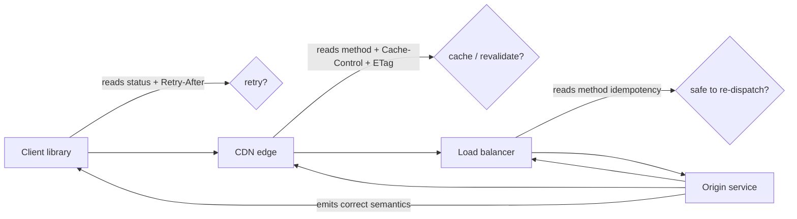
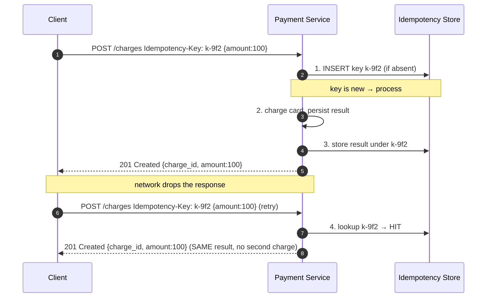
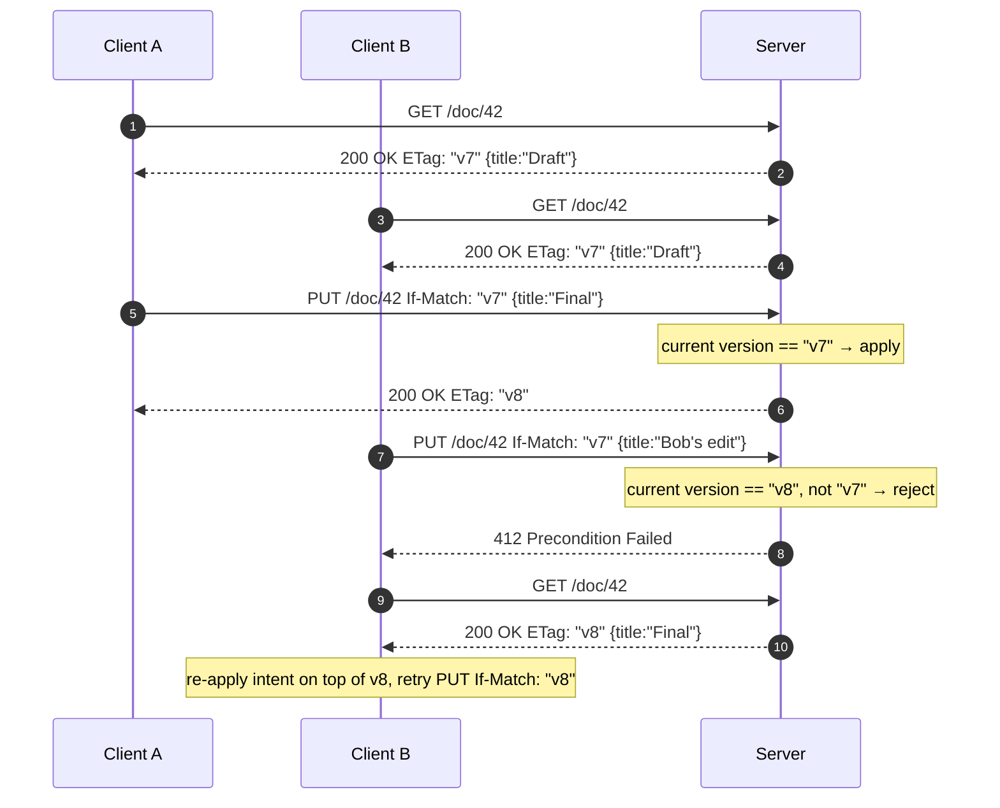
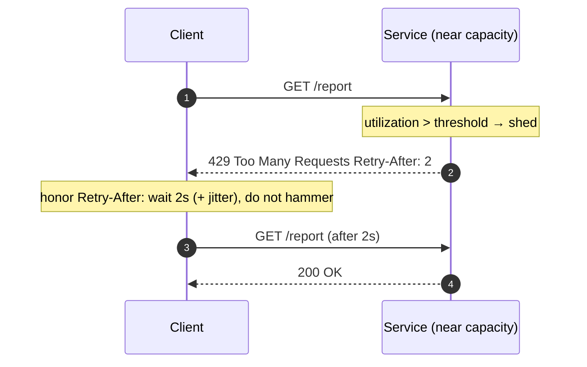

# HTTP — Senior

<!-- level-focus -->
At senior level, focus on this question:

> Which system invariant is affected by **HTTP** under failure, load, and change?

Use the smallest realistic scenario that exposes the decision and its failure behavior.
## 1. Why HTTP Semantics Are a System Contract

At junior level HTTP is "how the browser talks to the server." At senior level HTTP is the
**machine-readable contract** that lets components you did not write behave correctly around your
service. A CDN decides whether to cache a response by reading the method, status code, and
`Cache-Control`. A load balancer decides whether a failed request is safe to retry on another
backend by reading the method. A client library decides whether a timeout is retryable by reading
the status code and `Retry-After`. Every one of these decisions is made **without calling your
team**. They are made purely from the wire semantics.

This is the leverage HTTP gives you: correct semantics turn generic infrastructure into your
system's reliability layer. Incorrect semantics — a `200 OK` wrapping an error, a `GET` that
mutates state, a `POST` that is silently non-idempotent — quietly disable that layer. The bug does
not show up in a unit test; it shows up as a double-charged customer during a network blip, or a
stale page served to a million users by a CDN that trusted your (wrong) cache headers.

The senior mindset: **design the response so that a proxy that knows nothing about your domain
still makes the right decision.** If you find yourself writing a documentation paragraph that says
"clients should not retry this even though it returned 500," you have already lost — the status code
should have carried that meaning.

Each intermediary makes a correctness-critical decision from wire semantics alone. Your job is to
emit semantics that make those decisions come out right.

---

## 2. Method Semantics: Safe, Idempotent, Cacheable

RFC 9110 §9.2 defines three orthogonal method properties. Confusing them is the root of most
HTTP-correctness bugs.

- **Safe** (§9.2.1): the request is *read-only* — it has no intended side effect on server state.
  `GET`, `HEAD`, `OPTIONS`, `TRACE`. Safe methods can be prefetched, followed by link-crawlers, and
  speculatively re-issued by browsers. If your `GET` mutates data, a search-engine crawler or a
  browser prefetcher will mutate it for you.
- **Idempotent** (§9.2.2): issuing the request N times has the same server effect as issuing it
  once. `GET`, `HEAD`, `OPTIONS`, `TRACE`, **`PUT`**, **`DELETE`**. Note `PUT`/`DELETE` are
  idempotent but *not* safe. Idempotency is what lets an intermediary retry a request after a
  network failure without asking permission.
- **Cacheable** (§9.2.3): the response *may* be stored and reused. Depends on method + status +
  cache directives. `GET` and `HEAD` are cacheable by default; `POST` responses are cacheable only
  with explicit freshness information.

| Method | Safe | Idempotent | Cacheable (default) | Typical use |
|--------|------|-----------|---------------------|-------------|
| `GET` | ✅ | ✅ | ✅ | Read a resource |
| `HEAD` | ✅ | ✅ | ✅ | Read metadata / validators only |
| `OPTIONS` | ✅ | ✅ | ❌ | Capabilities / CORS preflight |
| `PUT` | ❌ | ✅ | ❌ | Full replace at a client-chosen URI |
| `DELETE` | ❌ | ✅ | ❌ | Remove a resource |
| `POST` | ❌ | ❌ | Only if explicit | Create / process / non-idempotent action |
| `PATCH` | ❌ | ❌ (unless designed so) | ❌ | Partial update |

The single most useful design consequence: **`PUT` and `DELETE` are your idempotent write verbs.**
When a write can be expressed as "make the resource at this URI equal to X" (`PUT`) rather than
"append a new thing" (`POST`), you get retry-safety for free — a `PUT` replayed after a timeout
lands the same state. Reserve `POST` for genuinely non-idempotent operations (append to a
collection, trigger a side-effecting process), and make *those* safe via an explicit idempotency
key (§4).

`PATCH` is a trap: it is not idempotent by default. `PATCH {"balance": "+10"}` applied twice
adds 20. If you need retry-safety on a partial update, either make the patch absolute
(`{"balance": 110}`) or gate it with a conditional (§5) so a replay is rejected.

---

## 3. Status Codes That Mean Something to Clients and Proxies

A status code is an *instruction to the caller*, not decoration. The class digit (RFC 9110 §15)
carries the primary meaning; a generic client that has never heard of your API still knows what to
do from the class alone.

- **2xx Success** — request understood and acted upon.
- **3xx Redirection** — further action needed; `304 Not Modified` is a caching signal, not an error.
- **4xx Client error** — the request is wrong; retrying *the same request* will fail the same way.
  Do not retry blindly.
- **5xx Server error** — the server failed; the request may be valid, so retrying (with backoff,
  and only if idempotent) may succeed.

The 4xx/5xx split is a retry contract. A client library's retry policy keys off it: retry 5xx and
timeouts, do not retry 4xx (except 429). If you return `500` for "email already registered," every
client retries a request that can never succeed, amplifying load during exactly the wrong moment.
If you return `400` for a transient database blip, clients give up on a request that would have
succeeded on retry.

| Situation | ❌ Wrong (breaks callers/proxies) | ✅ Correct | Why it matters |
|-----------|-----------------------------------|-----------|----------------|
| Validation failure | `200 OK {"error":"bad email"}` | `400 Bad Request` | 200 tells clients + caches "success" → error is cached/ignored |
| Resource not found | `200 OK {"data":null}` | `404 Not Found` | Monitoring, retries, and caches can't distinguish empty vs error |
| Auth missing/invalid | `403` for missing credentials | `401 Unauthorized` (+ `WWW-Authenticate`) | 401 = "authenticate"; 403 = "authenticated but forbidden" |
| Concurrency conflict | `500 Internal Server Error` | `409 Conflict` / `412 Precondition Failed` | 5xx triggers retries that re-conflict; 4xx tells client to re-read |
| Rate limited | `503` or `500` | `429 Too Many Requests` (+ `Retry-After`) | 429 is the standard backpressure signal clients honor |
| Created a resource | `200 OK` | `201 Created` (+ `Location`) | 201 + Location lets clients find the new URI without guessing |
| Accepted async work | `200 OK` (pretends it's done) | `202 Accepted` (+ status URL) | 202 says "not finished"; 200 lies about completion |
| Transient DB error | `400 Bad Request` | `503 Service Unavailable` (+ `Retry-After`) | 4xx says "don't retry"; the request was actually fine |

Two frequently-botched distinctions:

- **401 vs 403.** `401 Unauthorized` means *not authenticated* — the client should supply or refresh
  credentials, and you SHOULD send `WWW-Authenticate`. `403 Forbidden` means *authenticated but not
  allowed* — refreshing the token will not help. Returning 403 for a missing token sends clients
  into pointless credential churn.
- **409 vs 412.** `409 Conflict` is a semantic conflict the client can potentially resolve by
  re-reading and retrying. `412 Precondition Failed` is specifically "your conditional precondition
  (`If-Match`/`If-Unmodified-Since`) did not hold" — the vocabulary of optimistic concurrency (§5).

For structured error bodies, prefer a standard shape ([RFC 9457 Problem Details](https://www.rfc-editor.org/rfc/rfc9457))
so clients parse errors uniformly — but the *status code* must still carry the machine-actionable
meaning. The body explains; the status code instructs.

---

## 4. Idempotency and Retries: The Correctness Backbone

Networks fail *after* the server acts but *before* the client sees the response. The client cannot
tell "request lost" from "response lost," so a correct client retries. The question every write
endpoint must answer: **is a retry safe?**

- **Idempotent by method** (`PUT`, `DELETE`): a replay is inherently safe. `PUT /accounts/123
  {balance: 100}` twice ends at 100. Design writes as replacements where you can.
- **Idempotent by key** (`POST` with an idempotency key): the client generates a unique key (a
  UUID) per logical operation and sends it in a header (commonly `Idempotency-Key`). The server
  records the key with the result; a replay returns the *original* recorded result instead of
  acting again. This is how payment APIs make "charge $100" retry-safe.

Design rules for keyed idempotency:

- The key is **client-generated and stable across retries** of the same logical operation, and
  **new for genuinely new operations**. A server-generated key defeats the purpose.
- Store `(key → response, status)` transactionally with the side effect, so a crash between "did the
  work" and "recorded the key" cannot double-apply. Use a uniqueness constraint on the key column;
  a concurrent duplicate then fails the insert and you serve the in-flight/stored result.
- Give keys a TTL that comfortably exceeds the client's maximum retry window.
- Guard against key reuse with a *different* payload — return `422`/`409` rather than silently
  serving a mismatched cached result.

Retry policy on the client side must respect method semantics: retry only idempotent methods (or
keyed POSTs), only on 5xx / timeout / 429, with exponential backoff **and jitter** to avoid
synchronized retry storms, honoring `Retry-After` when present (§6).

---

## 5. Conditional Requests: ETags, Optimistic Concurrency, Lost-Update Prevention

The **lost update** problem: two clients read version 1, both edit, both write; the second write
silently clobbers the first. Pessimistic locking (hold a lock across the read-modify-write) does not
scale for stateless HTTP and couples availability to lock holders. HTTP's answer is **optimistic
concurrency via conditional requests** (RFC 9110 §8.8, §13).

The server returns a **validator** with each representation:

- `ETag` — an opaque version tag for the representation (e.g. `ETag: "v7"` or a content hash).
  Strong ETags mean byte-for-byte identical; weak ETags (`W/"v7"`) mean semantically equivalent.
- `Last-Modified` — a timestamp, coarser (1-second granularity) and thus weaker than an ETag.

Clients then make writes **conditional**:

- `If-Match: "v7"` — "only apply this write if the current version is still v7." If it changed, the
  server returns **`412 Precondition Failed`** and the client re-reads, re-applies, retries.
- `If-None-Match: *` — "only create if it does not already exist" — safe create without clobbering.
- `If-None-Match: "v7"` / `If-Modified-Since` — read-side revalidation: server returns
  `304 Not Modified` (empty body) if unchanged, saving bandwidth.

Client B's overwrite is prevented — no lost update — and no server-side lock was held between B's
read and write. The concurrency control lives entirely in the two round-trips and one header.

| Approach | Mechanism | Blocks lost update? | Scales statelessly? | Cost |
|----------|-----------|---------------------|---------------------|------|
| No control | last write wins | ❌ | ✅ | Silent data loss |
| Pessimistic lock | server holds lock across read+write | ✅ | ❌ (lock holder = SPOF/contention) | Latency, deadlocks, lock lifetime |
| Optimistic (`If-Match` + ETag) | version check at write time | ✅ | ✅ | Occasional 412 + retry (client re-reads) |
| Version column in body | app compares `expected_version` | ✅ | ✅ | Reinvents ETag inside payload; opaque to caches |

Prefer the ETag form: it is standard, intermediaries understand it, and the same validator powers
both write-side concurrency (`If-Match`) and read-side caching (`If-None-Match`/`304`). The version
number lives in a header where infrastructure can see it, not buried in your JSON where only your
own code can.

---

## 6. Backpressure: 429, 503, and Retry-After

When a service is overloaded it must **shed load in a way clients understand**, or clients retry
aggressively and turn a brownout into an outage (retry amplification). HTTP has a precise vocabulary
for this.

- **`429 Too Many Requests`** (RFC 6585, referenced by 9110's registry) — *this client* has exceeded
  a rate limit. It is a 4xx (client should slow down) but it is the one 4xx that is retryable.
- **`503 Service Unavailable`** — the *server* is temporarily unable to handle the request (overload,
  maintenance, dependency down). Transient by definition.
- **`Retry-After`** (RFC 9110 §10.2.3) — pairs with 429/503/3xx. Either a delay in seconds
  (`Retry-After: 30`) or an HTTP-date. It converts a guess into an instruction: the server tells the
  client exactly how long to wait, letting the server *schedule its own recovery*.

Design guidance:

- Return `429` for per-client quota exhaustion; return `503` for global overload / dependency
  failure. The two let a client tell "I'm being throttled" from "the whole service is down."
- **Always** send `Retry-After` with 429/503. Without it, well-behaved clients fall back to their own
  backoff and misbehaving clients busy-loop; with it, the server controls the retry schedule.
- Add rate-limit visibility headers (commonly `RateLimit-Limit`, `RateLimit-Remaining`,
  `RateLimit-Reset`, per the draft IETF rate-limit headers) so clients self-throttle *before*
  hitting 429.
- Combine with client-side jitter. If 10,000 clients all get `Retry-After: 30`, they retry in the
  same second — add randomized jitter so the recovery is spread out.

The failure this prevents: a service under load returning `500`s with no `Retry-After`. Clients read
5xx as "retry immediately," pile on, and the service never recovers. `429`/`503` + `Retry-After` is
how HTTP lets an overloaded service *push back* on its callers.

---

## 7. Content Negotiation and Versioning

**Content negotiation** (RFC 9110 §12) lets one URI serve multiple representations, selected by
request headers, so the *resource* (a stable concept) is decoupled from its *representation* (format,
language, encoding, version).

- `Accept: application/json` / `application/xml` — media type.
- `Accept-Language: en`, `Accept-Encoding: gzip, br` — language, compression.
- The server SHOULD send **`Vary`** listing which request headers the response depends on
  (`Vary: Accept, Accept-Encoding`). This is not optional politeness: it is what tells a cache
  *which requests may reuse this stored response*. Omit `Vary` and a cache may serve the gzip'd
  variant to a client that cannot decompress, or the English page to a French speaker (§8).

**Versioning** is where content negotiation meets API evolution. The options and their trade-offs:

| Strategy | Example | Pros | Cons |
|----------|---------|------|------|
| URI path | `/v2/orders` | Visible, trivial to route/cache, easy to test in a browser | Not RESTful (same resource, two URIs); duplicates URL space |
| Custom media type | `Accept: application/vnd.acme.order.v2+json` | Same URI per resource; version is a representation; caches `Vary` on it | Harder to explore; must be documented well |
| Query / header param | `?version=2`, `X-API-Version: 2` | Simple to add | Easy for caches/proxies to ignore → wrong-version cache hits unless `Vary` set |

There is no universally correct answer, but the senior lens is *cache and proxy behavior*: whatever
carries the version must be something intermediaries key on. Path versioning is cache-safe because
the version is in the URL (the cache key). Media-type versioning is cache-safe **only if** you emit
`Vary: Accept`. A version smuggled in a header that is not in `Vary` will cause a cache to serve v1
responses to v2 requests.

Independent of the scheme, **evolve additively** first: add fields and endpoints without breaking
existing clients (tolerant reader / Postel's law), and reserve version bumps for genuinely breaking
changes. A version number is a migration cost you impose on every client; spend it deliberately.

---

## 8. How Intermediaries Depend on Correct Semantics

The payoff of correct semantics is that *infrastructure you did not build* does correct work on your
behalf. Enumerating who reads what makes the stakes concrete.

**Caches (CDN, reverse proxy, browser)** — RFC 9111. A cache stores a response and reuses it based
purely on wire semantics:

- Method + status: only cacheable combinations are stored (`GET`/`HEAD` + a cacheable status).
- `Cache-Control`: `max-age`, `no-store`, `private` vs `public`, `must-revalidate`,
  `stale-while-revalidate`. This directive *is* the cache policy — the cache trusts it literally.
- `ETag` / `Last-Modified`: enable revalidation. A fresh-but-expired entry is revalidated with a
  conditional `GET`; a `304 Not Modified` refreshes it without transferring the body.
- `Vary`: defines the cache key beyond the URL. Missing/wrong `Vary` = serving the wrong variant.

The classic disaster: an endpoint that returns per-user data but no `Cache-Control: private`. A
shared CDN caches user A's account page and serves it to user B. The bug is a *missing header*, and
it leaks data across users.

**Reverse proxies / load balancers** read the **method** to decide retry-safety. Many proxies will
transparently re-dispatch an idempotent request (`GET`, `PUT`, `DELETE`) to a healthy backend on a
connection error. They will *not* retry a `POST`, because `POST` is non-idempotent and a retry could
double-apply. If you hide a non-idempotent operation behind `GET`, a proxy retry duplicates it.

**Clients / SDKs** read status class + `Retry-After` for retry decisions, `ETag` for caching and
concurrency, `WWW-Authenticate` for auth challenges, `Location` for created-resource discovery and
redirects. Every one of these is a behavior you get for free from a generic client *if* you emit the
right semantics.

The through-line: **semantics are the API between your service and everything that sits in front of
or beside it.** Correctness there is worth more than any amount of documentation, because
documentation is read by humans occasionally and semantics are read by machines on every request.

---

## 9. Failure Modes and Anti-Patterns

The recurring senior-level failures, each a case of *lying to the protocol*:

1. **`200 OK` for errors** ("`200 {"success": false}`"). Disables the entire 4xx/5xx machinery:
   monitoring counts errors as successes, caches store error bodies as valid responses, clients never
   retry recoverable failures, and alerting stays silent through an outage. The status code is the
   error signal; the body only elaborates.

2. **Non-idempotent `GET`.** A `GET /users/42/delete` or a `GET` that increments a counter will be
   triggered by browser prefetch, link crawlers, "open in new tab," antivirus URL scanners, and
   proxy prefetchers — none of which intend a side effect. Safe methods *must* be read-only.

3. **`POST` for everything ("HTTP tunneling").** Wrapping reads and idempotent writes in `POST`
   forfeits caching (POST isn't cached by default) and forfeits proxy/LB retry-safety (POST won't be
   retried). You end up rebuilding idempotency and caching by hand that the protocol offered free.

4. **Ignoring caching semantics.** No `Cache-Control` at all → each cache guesses (some heuristically
   cache, some don't) and behavior becomes non-deterministic across CDNs. Per-user data without
   `private` → cross-user leaks. No `ETag` → no cheap revalidation, so every refresh transfers the
   full body.

5. **`5xx` for client mistakes / `4xx` for transient faults.** Returning `500` for "already exists"
   makes clients retry-storm an unwinnable request during load; returning `400` for a transient DB
   error makes clients abandon a request that would have succeeded. The 4xx/5xx split is a retry
   contract — honor it.

6. **Overload without `429`/`503` + `Retry-After`.** Shedding load with `500` (or by simply hanging)
   tells clients "retry now," amplifying the overload into an outage. Backpressure must be spoken in
   the protocol's own words.

7. **Concurrency conflicts as `500`.** Modeling a lost-update/version conflict as an internal error
   invites retries that immediately re-conflict. Use `409`/`412` so the client knows to re-read and
   re-apply.

8. **Versioning in an un-`Vary`'d header.** A cache keyed only on URL serves the wrong version's
   response. If the version lives in a header, it must be in `Vary`.

The unifying rule: **never make the caller read your documentation to recover from a failure the
status code and headers could have described.** When semantics and behavior disagree,
infrastructure believes the semantics — so the semantics had better be true.

---

## 10. Senior Checklist

- [ ] Every write endpoint answers "is a retry safe?" — idempotent by method (`PUT`/`DELETE`) or by
      client-supplied idempotency key; keys stored transactionally with the side effect.
- [ ] Status codes carry machine-actionable meaning: 4xx = don't retry (except 429), 5xx = maybe
      retry; `201`+`Location` on create, `202` for async, `409`/`412` for conflicts.
- [ ] No `200 OK` wrapping an error body anywhere; no `GET` with a side effect anywhere.
- [ ] Mutable resources return `ETag`; concurrent writes use `If-Match` → `412` on conflict
      (optimistic concurrency), preventing lost updates without server-held locks.
- [ ] Overload/rate-limit paths return `429`/`503` **with** `Retry-After`; clients honor it and add
      jitter; rate-limit headers let clients self-throttle before hitting the limit.
- [ ] Caching is explicit: `Cache-Control` on every response, `private` on per-user data, `Vary`
      lists every request header the representation depends on (`Accept`, `Accept-Encoding`, version).
- [ ] Versioning scheme is cache-safe: version lives in the URL or in a `Vary`'d header, never
      smuggled where a proxy will ignore it; evolve additively before bumping the version.
- [ ] A generic proxy/CDN/client that knows nothing about the domain makes the *right* decision from
      the response alone — validated by testing behind a real reverse proxy and CDN, not just docs.

*Next step:* [HTTP — Professional](professional.md)

---

## Apply it

1. State the system invariant that **HTTP** must protect.
2. Mark ownership, state, and failure propagation at each boundary.
3. Compare two designs under load, dependency failure, and future change.
4. Define recovery and compatibility behavior before implementation.
5. Test the riskiest assumption with a focused experiment.

## Verify your work

- The experiment supports the design with evidence, not preference.
- Failure injection shows the blast radius and recovery path.
- Compatibility checks cover old and new callers or data.
- Operational signals reveal invariant violations and recovery progress.

## Review questions

- Which invariant must remain true when HTTP fails?
- Where should recovery responsibility live, and why?
- Which assumption deserves an experiment before implementation?
- How can the design evolve without changing every consumer at once?
