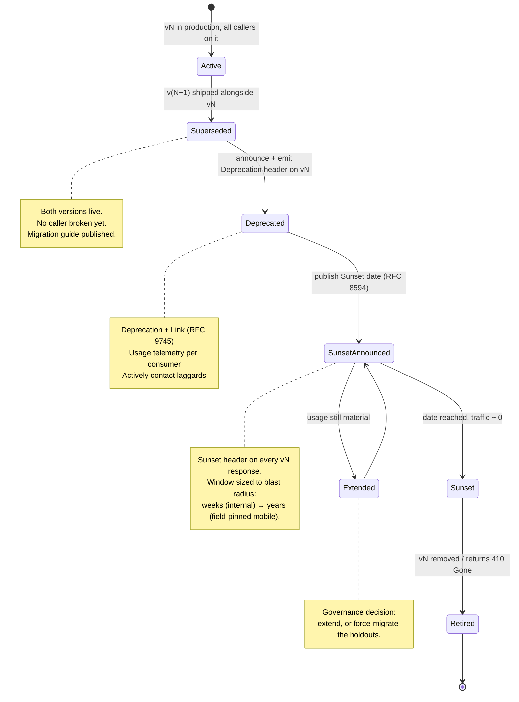
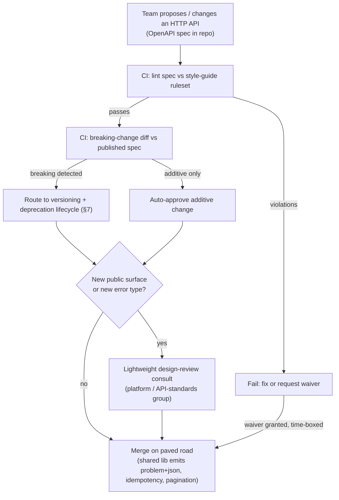

# HTTP — Staff

At Staff/Principal level, HTTP stops being "the protocol my service speaks" and becomes **an organizational interface standard**. The wire format is settled; the real problem is that 100 teams, each free to invent its own status-code taxonomy, error shape, pagination scheme, and versioning story, will produce 100 subtly incompatible APIs — and every client, gateway, SDK, and on-call engineer pays the integration tax forever. This document is about **judgment over mechanism**: how you make an organization speak HTTP the *same* way, what inconsistency actually costs, how you govern breaking changes and deprecations without stalling delivery, and when the honest answer is "don't use HTTP/REST for this at all."

## Table of contents

1. [The reframe: HTTP conventions are an org interface, not a service detail](#1-the-reframe-http-conventions-are-an-org-interface-not-a-service-detail)
2. [The cost of inconsistency across teams](#2-the-cost-of-inconsistency-across-teams)
3. [What a company HTTP API style guide must standardize](#3-what-a-company-http-api-style-guide-must-standardize)
4. [Standardizing error bodies on RFC 9457 problem+json](#4-standardizing-error-bodies-on-rfc-9457-problemjson)
5. [Pagination, idempotency, and versioning as org-wide contracts](#5-pagination-idempotency-and-versioning-as-org-wide-contracts)
6. [Governing breaking changes and deprecation](#6-governing-breaking-changes-and-deprecation)
7. [The deprecation lifecycle (staged)](#7-the-deprecation-lifecycle-staged)
8. [Governance mechanism: how you get 100 teams to comply without a gate war](#8-governance-mechanism-how-you-get-100-teams-to-comply-without-a-gate-war)
9. [Choosing HTTP/REST vs alternatives at the org level](#9-choosing-httprest-vs-alternatives-at-the-org-level)
10. [When NOT to standardize](#10-when-not-to-standardize)
11. [Staff-level takeaways](#11-staff-level-takeaways)

---

## 1. The reframe: HTTP conventions are an org interface, not a service detail

Every HTTP API is a promise made to callers you will never meet: other teams, partner integrations, mobile apps pinned in the field for years, and your own future SDK generators. A single team choosing `200 OK` with `{"error": "..."}` in the body instead of a real `4xx` is a local decision with **global blast radius** — every generic client, every gateway retry policy, every dashboard that counts 5xx now behaves wrong against that one service.

The Staff insight is that **HTTP's flexibility is a liability at organizational scale.** The spec permits enormous latitude: you *may* return any status code, shape errors however you like, page with cursors or offsets or `Link` headers, version in the path or a header or a media type. Each of those is a defensible local choice. The problem is not that any one is wrong — it's that **variety itself is the cost.** A caller integrating with ten of your services should learn the conventions *once*, not ten times.

So the artifact a Staff engineer produces here is not a service. It is a **style guide with teeth**: a written, versioned, linter-enforced standard for how every HTTP API in the org handles status codes, errors, pagination, idempotency, versioning, and deprecation. The engineering question shifts from "what's the best error format?" to "what error format can I get *everyone* to adopt, enforce automatically, and evolve over a decade?" Consistency that is *good enough and universal* beats a locally *optimal* design that only one team uses.

## 2. The cost of inconsistency across teams

Inconsistency rarely shows up as an outage. It shows up as a slow, compounding tax that never appears on a single team's dashboard — which is exactly why it needs someone with org-wide scope to see it.

- **Integration cost is O(teams × consumers).** If each of N services invents its own error shape and pagination, every consumer writes bespoke handling per service. With standard conventions, a consumer writes it **once** and reuses it against all N. This is the single largest hidden cost.
- **Generic tooling breaks.** Shared retry middleware, circuit breakers, SDK generators, API gateways, and observability pipelines all rely on conventions. A service that signals "retry me" with `200` + a body field instead of `429`/`503` is invisible to every generic retry policy in the fleet.
- **Client fragility.** A mobile client that must special-case "team A returns errors like *this*, team B like *that*" accumulates conditional code that rots. Field-pinned apps make this permanent — you cannot patch the client, so the inconsistency is load-bearing forever.
- **Onboarding and cognitive load.** Every new engineer and every partner integrator re-learns local dialects. Multiply by turnover and partner count.
- **Incident response degrades.** During an incident, an on-call engineer reasoning across services must hold multiple mental models of "what does an error look like here." Standard `problem+json` means one mental model.
- **Security and correctness gaps.** Ad-hoc error bodies leak stack traces and internal identifiers inconsistently; a standard, reviewed error shape closes that uniformly.

| Dimension | Ad-hoc per-team conventions | Org-wide standardized conventions |
|-----------|-----------------------------|-----------------------------------|
| Consumer integration effort | O(N) — per-service handling | O(1) — learn once, reuse everywhere |
| Shared retry / circuit-breaker middleware | Breaks; each service special-cased | Works uniformly on status codes |
| SDK / client generation | Manual, drifts per service | Generated from one spec profile |
| Error observability (dashboards, alerts) | Inconsistent fields, unreliable 5xx counts | Uniform `problem+json`, reliable signals |
| Onboarding a new integrator | Re-learn each service's dialect | One style guide |
| Breaking-change coordination | Ad-hoc, surprise breakages | Governed lifecycle, `Deprecation`/`Sunset` headers |
| Cost trend as org grows | Superlinear (variety compounds) | Sublinear (marginal service is cheap) |

The trap is that inconsistency's cost is **diffuse and deferred** while consistency's cost (writing and enforcing a standard) is **concentrated and immediate.** That asymmetry is why it takes deliberate org-level investment; no single team is incentivized to fix it alone.

## 3. What a company HTTP API style guide must standardize

The style guide is the deliverable. It must be **prescriptive** (pick one option and mandate it — a menu of options defeats the purpose), **machine-checkable** wherever possible, and **versioned** like code. The high-value surface to standardize:

- **Status code semantics.** A fixed mapping: what returns `400` vs `422`, when `409` vs `412`, `401` vs `403`, `429` for rate limits, `503` with `Retry-After` for shedding. Ban the `200`-with-error-in-body anti-pattern outright.
- **Error body format.** One shape for every error, everywhere — this is RFC 9457 `application/problem+json` (see §4).
- **Pagination.** One default scheme (cursor-based for large/mutable collections; the guide states the reason) with a mandated parameter and response envelope.
- **Versioning.** One strategy (path vs header vs media-type — pick one; §5) and the rules for what a "version" means.
- **Idempotency.** A standard `Idempotency-Key` request header contract for unsafe operations, with defined server semantics.
- **Naming and resource conventions.** Plural nouns, casing (`snake_case` vs `camelCase` — pick one), date/time format (RFC 3339 UTC), money representation (minor units + currency, never floats).
- **Filtering, sorting, sparse fieldsets.** A common query-parameter grammar.
- **Compatibility rules.** What counts as additive (safe) vs breaking (governed) — codified so it's not a judgment call per PR.
- **Deprecation signaling.** Standard `Deprecation` and `Sunset` response headers and a `Link` to migration docs.

A crucial Staff discipline: **the standard is the shared vocabulary, not a mandate to reinvent everything.** Prefer citing existing IETF standards (RFC 9457 for errors, RFC 3339 for time, RFC 8594 `Sunset`, RFC 9110 for the HTTP semantics themselves) over inventing house formats. Citing a standard means off-the-shelf tools, libraries, and hires already understand it — you inherit an ecosystem instead of maintaining a dialect.

## 4. Standardizing error bodies on RFC 9457 problem+json

Error format is the highest-leverage thing to standardize because errors are where ad-hoc APIs diverge the most and where inconsistency hurts clients the most. The org standard should be **RFC 9457 (Problem Details for HTTP APIs)**, media type `application/problem+json`, which supersedes RFC 7807.

A `problem+json` body has a small, defined core:

```json
{
  "type": "https://errors.example.com/insufficient-funds",
  "title": "Insufficient funds",
  "status": 402,
  "detail": "Account acc_123 has balance 30.00 USD; charge requires 100.00 USD.",
  "instance": "/accounts/acc_123/charges/ch_789",
  "balance": "30.00",
  "currency": "USD"
}
```

- `type` — a stable URI identifying the *kind* of problem; this is the machine-readable discriminator clients switch on. It must be stable across releases.
- `title` — a short human-readable summary, constant per `type`.
- `status` — the HTTP status, duplicated for convenience.
- `detail` — human-readable, specific to *this* occurrence (safe to vary).
- `instance` — a URI for this specific occurrence.
- **Extension members** (`balance`, `currency` above) — RFC 9457 explicitly allows problem-specific fields, so structured, typed error data travels alongside the standard envelope.

Why mandate this specifically:

| Error format option | Machine-parseable | Extensible with typed data | Ecosystem / tooling | Verdict |
|---------------------|-------------------|----------------------------|---------------------|---------|
| `200 OK` + `{"error": "..."}` | No — breaks status-based tooling | No | None (anti-pattern) | **Ban** |
| Bespoke JSON per team | Only if you learn each dialect | Ad-hoc | None shared | Reject |
| Bare status code, empty body | Coarse only | No | Some | Insufficient |
| **RFC 9457 `problem+json`** | Yes (`type` discriminator) | Yes (extension members) | Standard, wide library support | **Adopt** |

Standardizing on `problem+json` gives every client one parser, one switch-on-`type` pattern, and one observability schema across the whole fleet. The `type` URI namespace becomes a governed org asset (a registry of error types), and reviewers can enforce "no stack traces in `detail`, no internal IDs leaked" against a single known shape.

## 5. Pagination, idempotency, and versioning as org-wide contracts

These three are chosen together because they are the conventions clients most often get wrong when each service invents its own.

**Pagination.** Mandate **cursor-based pagination** as the default for large, mutable collections. Offset/limit is simpler but breaks under concurrent inserts (items shift, callers skip or duplicate rows) and is expensive deep in a collection. The standard fixes the request parameter (e.g., `?cursor=...&limit=...`), caps `limit`, and fixes the response envelope (items plus an opaque `next_cursor`). The opacity of the cursor is deliberate: it lets each service change its internal keyset strategy without breaking clients.

**Idempotency.** Mandate a standard `Idempotency-Key` request header for all unsafe, non-idempotent operations (notably `POST` that creates or charges). The server contract: on first sight, process and store the response keyed by the key; on replay of the same key, return the *stored* response without re-executing. This turns "the network timed out, do I retry?" from a per-service guessing game into a fleet-wide guarantee, and it lets generic retry middleware retry `POST`s safely.

**Versioning.** Pick **one** strategy and mandate it; the common org-scale choice is **URI path versioning** (`/v1/...`, `/v2/...`) because it is the most visible, cacheable, and routable at the gateway, even though header/media-type versioning is theoretically cleaner. What matters more than *which* you pick is that it is **uniform** and that the guide defines what a version *means*: a new major version is only for **breaking** changes; additive changes (new optional fields, new endpoints) ship within the current version and never break existing clients.

| Convention | Mandated default | Why this one | The failure it prevents |
|------------|------------------|--------------|-------------------------|
| Pagination | Cursor-based, capped `limit` | Stable under concurrent writes; cheap at depth | Skipped/duplicated rows; slow deep pages |
| Idempotency | `Idempotency-Key` header on unsafe ops | Makes retries safe fleet-wide | Double charges / duplicate creates on retry |
| Versioning | URI path (`/vN`), majors = breaking only | Visible, routable, cacheable at the edge | Silent breakage; version chaos across teams |

The unifying principle: each of these is a **contract the client codes against once.** Uniformity is worth more than the marginal elegance of any single alternative.

## 6. Governing breaking changes and deprecation

The hardest org-scale HTTP problem is not designing an API — it's **evolving one that thousands of callers already depend on** without breaking them and without freezing forever. Two rules anchor the governance:

1. **Additive is free; breaking is governed.** The compatibility contract, written into the style guide, defines the line precisely: adding an optional field, a new endpoint, or a new enum value your clients tolerate is **additive** and ships anytime. Removing a field, renaming one, tightening validation, changing a type, changing pagination semantics, or repurposing a status code is **breaking** and cannot ship in place — it requires a new major version and the deprecation lifecycle.
2. **You never break silently, and you never break instantly.** A breaking change means: introduce `v(N+1)` alongside `vN`, announce, signal deprecation on `vN` in-band, give a **published sunset window** proportional to who's affected (weeks for internal-only, many months to years for public/partner/field-pinned mobile), and only then remove.

Signaling must be **in-band**, so callers discover deprecation without reading a changelog:

- `Deprecation` response header (RFC 9745) marks a response as coming from a deprecated resource/version.
- `Sunset` response header (RFC 8594) carries the date after which the endpoint may stop working.
- A `Link` header (`rel="deprecation"` / `rel="sunset"`) points to migration docs.

The load-bearing governance asset is **usage telemetry**: you cannot retire a version you can't measure. Per-version, per-consumer request metrics turn "is anyone still on v1?" from a hope into a dashboard, let you contact the specific laggard teams, and let you set the sunset date on evidence rather than optimism.

## 7. The deprecation lifecycle (staged)

The lifecycle below is the standard path every breaking change follows. It is deliberately staged so that at no point is a caller surprised.



Two branches encode the judgment. The **Extended** loop is the honest acknowledgment that sunset dates slip when real usage remains — the Staff move is to make "extend vs force-migrate the holdouts" an explicit governance decision backed by telemetry, not a default drift. Reaching **Retired** returns `410 Gone` (not `404`), which tells clients "this genuinely existed and is intentionally gone," a small consistency that helps integrators debug.

## 8. Governance mechanism: how you get 100 teams to comply without a gate war

A style guide nobody follows is worse than none — it advertises that standards are optional. The Staff problem is **compliance at scale without becoming a bottleneck or a bureaucracy everyone routes around.** The mechanism, in order of leverage:

- **Make the paved road the path of least resistance.** The single most effective lever is a shared library / service template / gateway that emits `problem+json`, wires the `Idempotency-Key` middleware, and handles pagination *by default*. If doing it the standard way is *easier* than doing it wrong, compliance is nearly free. Mandates without a paved road just generate resentment and shadow implementations.
- **Automate enforcement in CI, not in review meetings.** Lint every API's OpenAPI spec against the style guide (e.g., a spectral-style ruleset) as a required check. Machine-checkable rules — "errors must be `problem+json`", "no `200` with error body", "breaking diff against the published spec fails the build" — belong in the pipeline, so humans review judgment, not conformance.
- **Automated breaking-change detection.** A spec-diff gate that fails CI when a change is breaking against the currently published version forces the change through the versioning/deprecation path instead of shipping in place. This is where the compatibility contract (§6) becomes enforced rather than aspirational.
- **A lightweight design-review forum for the genuinely novel.** Not a gate on every endpoint — a consult for new public surfaces, new error `type` namespaces, and requests to deviate. Its output is often *amendments to the guide*, so the standard learns.
- **A waiver path with an expiry.** Deviation must be *possible* (some legacy or third-party constraint is real) but *visible and time-boxed*, never silent. A permanent exception that no one revisits is how standards die.
- **Governance owned by a platform/API-standards group**, not by every product team. Product teams consume the paved road; the platform team owns the guide, the linter rules, the shared library, and the error-type registry.



The philosophy: **enforce the mechanical 95% automatically; reserve human attention for the judgment 5%.** That is what lets a standard scale to 100 teams without a central team becoming the bottleneck everyone hates.

## 9. Choosing HTTP/REST vs alternatives at the org level

Standardizing HTTP conventions presumes HTTP/REST is the right tool. At the org level, the Staff engineer also owns the *upstream* decision: for a given class of interface, is REST-over-HTTP the default, or is another paradigm the paved road? This is decided by **class of use**, and the org should mandate a default per class rather than let each team relitigate it.

| Style | Best fit at org scale | Strengths | Costs / when it's wrong |
|-------|-----------------------|-----------|-------------------------|
| **REST / JSON over HTTP** | Public & partner APIs, resource-oriented CRUD, broad interop | Universal client support, cacheable, browsable, standard tooling; lowest common denominator | Chatty for graph-shaped reads; over/under-fetching; weak typing without added schema |
| **gRPC (HTTP/2)** | Internal east-west service-to-service, high-throughput, strong contracts | Binary, fast, streaming, code-gen from `.proto`, strong typing | Poor browser story, harder to debug on the wire, not for public APIs |
| **GraphQL** | Aggregation for varied clients (mobile + web) needing tailored graph reads | Client picks fields, one round trip for graphs, strong schema | Caching is hard, N+1 risk, server complexity; overkill for simple CRUD |
| **Async messaging / events** | Fan-out, decoupling, workflows, eventual-consistency processes | Loose coupling, buffering, resilience | Not request/response; eventual consistency; harder to reason about |

The org-level policy that flows from this:

- **REST/JSON over HTTP is the default for public, partner, and browser-facing APIs** — its ubiquity and cacheability are worth more than any efficiency an alternative buys, and it is the standard *this whole document* is about making consistent.
- **gRPC is the default for internal east-west** where throughput and strong contracts matter and the clients are your own services (see the mesh discussion in the HTTP evolution material).
- **GraphQL is a considered choice**, not a default — justified when many client shapes need tailored aggregation, and governed carefully because its caching and complexity costs are real.
- **Async/eventing** is chosen when the interaction genuinely isn't request/response.

The judgment is to **not let this fragment per team.** The point of a default-per-class is the same as the point of a style guide: consumers and platform tooling learn a small number of paradigms, not a bespoke choice per service.

## 10. When NOT to standardize

Standardization is a cost, and over-applied it becomes its own failure mode. A Staff engineer must name where the standard should *not* reach:

- **Third-party and inherited APIs.** You do not control a partner's or vendor's error shape. Wrap and translate at your boundary; do not pretend you can enforce `problem+json` on APIs you don't own.
- **Truly experimental / short-lived internal endpoints.** A prototype behind a flag, expiring in a month, does not need the full versioning ceremony. Reserve governance for surfaces that will accrue callers.
- **Over-specifying the body schema.** The style guide should mandate the *conventions* (error shape, pagination, versioning, status semantics) — the cross-cutting concerns — not dictate every field of every domain model. That is the owning team's business logic; standardizing it centralizes decisions that shouldn't be central and slows everyone.
- **Chasing the "perfect" standard.** A good standard shipped and adopted beats a perfect one debated for a year. Version the guide, expect it to evolve (the design-review forum feeds amendments back in), and resist the urge to boil the ocean before v1.
- **Standards without a paved road.** If you can only mandate but can't provide the shared library/template that makes compliance easy, you will get shadow implementations and cynicism. Sometimes "not yet" is the right call until the paved road exists.

The meta-judgment: standardize the **cross-cutting conventions that every consumer must relearn otherwise**, and leave everything else to the teams. Over-standardization imposes the same superlinear cognitive cost as under-standardization, just relocated to a central bottleneck.

## 11. Staff-level takeaways

- **HTTP conventions are an organizational interface.** The deliverable is a prescriptive, versioned, linter-enforced **style guide**, not a service. Consistency that is universal beats local optimality that is isolated.
- **Inconsistency's cost is diffuse, deferred, and superlinear** — O(teams × consumers) integration tax, broken generic tooling, fragile field-pinned clients. Only someone with org-wide scope is positioned to see and fund the fix.
- **Standardize the high-leverage cross-cutting conventions:** status-code semantics, **RFC 9457 `problem+json`** errors, cursor pagination, `Idempotency-Key`, one versioning strategy, and deprecation signaling — and prefer citing IETF standards over inventing house dialects so you inherit an ecosystem.
- **Evolve safely: additive is free, breaking is governed.** Never break silently or instantly — ship `v(N+1)` alongside, signal with `Deprecation`/`Sunset` headers, size the window to blast radius, and drive retirement with **per-consumer usage telemetry**, not optimism.
- **Compliance scales through the paved road and CI, not meetings.** Make the standard the easiest path (shared library/gateway defaults), enforce the mechanical 95% with spec-linting and breaking-change diffs, and reserve human review for the judgment 5%, with time-boxed waivers.
- **Own the upstream choice too:** REST/JSON for public and browser-facing APIs, gRPC for internal east-west, GraphQL as a justified exception, async for non-request/response — mandated per *class of use* so paradigms don't fragment per team.
- **Know when not to standardize:** third-party APIs you don't own, throwaway experiments, domain schemas, and anything without a paved road to make compliance cheap.

*Next step:* [HTTP — Interview](interview.md)
