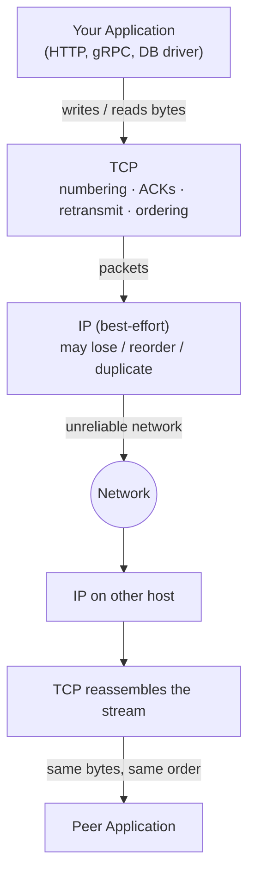
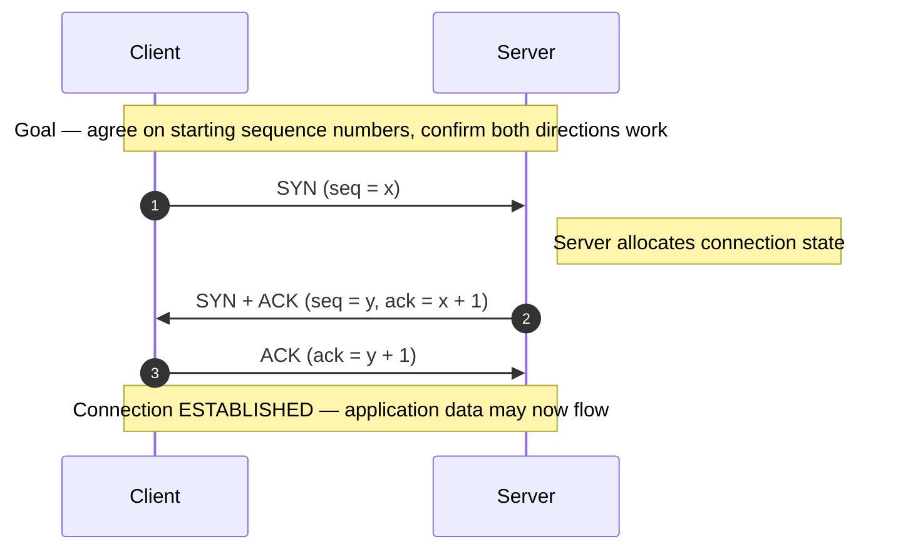

# TCP — Junior

<!-- level-focus -->
At junior level, focus on this question:

> How can I apply **TCP** in one small example and prove the result?

Use the smallest realistic scenario that exposes the decision and its failure behavior.
## 1. The problem TCP solves

Underneath TCP sits **IP** (the Internet Protocol), and IP makes only a single, weak promise: it will *try* to deliver a small chunk of data — a **packet** — from one machine to another. That's it. IP is often described as "best-effort," which is a polite way of saying it offers no guarantees at all. On a real network, a packet can:

- **be lost** — a router's queue is full, so it silently drops your packet;
- **arrive out of order** — two packets take different routes; the second one overtakes the first;
- **be duplicated** — a retransmission mechanism somewhere sends the same packet twice;
- **be corrupted** — a bit flips in transit (though a checksum usually catches this).

If your application had to talk directly over IP, *you* would have to handle every one of these cases yourself. Every program that sends data would re-implement the same tedious, error-prone bookkeeping. TCP exists so that you never have to. It sits between your application and IP, and it converts "best-effort packets" into "a reliable ordered stream of bytes." Your code writes bytes and reads bytes; TCP does the worrying.



The key insight: **TCP is a piece of software running inside the operating system on both machines.** It is not magic in the network. The two TCP endpoints cooperate — they keep matching notes about the conversation — and it is that cooperation that manufactures reliability out of an unreliable middle.

---

## 2. The core idea: a byte stream, not messages

The single most important thing to internalize about TCP is this: **TCP is a byte stream, not a message stream.**

When your application does the equivalent of `conn.Write("HELLO")` followed by `conn.Write("WORLD")`, TCP does **not** guarantee the receiver reads back two separate chunks. TCP does not know or care about your "messages." All it promises is that the receiver will see the bytes `H E L L O W O R L D` in exactly that order. The receiver might read them as:

- `HELLO` then `WORLD`, or
- `HELLOWORLD` in one read, or
- `HEL` then `LOWOR` then `LD`.

TCP is free to split and merge your writes however the network makes convenient. It preserves **order** and **completeness**, but not your **boundaries**. Think of it like water poured into a hose: you can pour in two cupfuls, but what comes out the far end is just a continuous flow of water — the "two cups" boundary is gone.

This has a concrete, practical consequence you will hit as soon as you write networking code: **if your application needs message boundaries, you must add them yourself**, on top of TCP. That is exactly what higher-level protocols do:

- **HTTP** uses the `Content-Length` header (or chunked encoding) to say "the body is exactly N bytes."
- Many binary protocols prefix each message with its length: `[4-byte length][payload]`.
- Some text protocols use a delimiter, like a newline, to mark where one message ends.

So when you read "TCP gives you a reliable ordered *byte stream*," the word **stream** is doing heavy lifting: it means a continuous flow of bytes with no built-in notion of where one message stops and the next begins.

---

## 3. How reliability works: numbering, ACKs, retransmission

How does TCP turn lossy, out-of-order packets into a perfect ordered stream? Three mechanisms, and they are simpler than they sound.

### (a) Number every byte — *sequence numbers*

TCP assigns a **sequence number** to every single byte it sends. Conceptually, if this connection's data started at byte number 1000, then the first byte you write is 1000, the next is 1001, the next 1002, and so on. When TCP chops your stream into packets ("**segments**"), each segment header carries the sequence number of its *first* byte, and the segment length tells the receiver how many bytes follow. This lets the receiver reconstruct the exact original order **regardless of the order packets actually arrive in.** If segment `[3000..3499]` arrives before segment `[2500..2999]`, the receiver simply holds the later one in a buffer and slots it into place once the earlier bytes show up. Ordering is *solved by numbering*.

### (b) Confirm what arrived — *acknowledgements (ACKs)*

The receiver tells the sender what it has successfully received by sending back an **acknowledgement**, or **ACK**. TCP uses *cumulative* ACKs: the ACK number means "I have received every byte up to (but not including) this number — send me that one next." If the receiver has cleanly received bytes up through 2999, it sends `ACK 3000`, which is shorthand for "everything before 3000 is safely here." This is efficient: a single ACK confirms a whole run of bytes, and a later ACK implicitly re-confirms all the earlier ones.

### (c) Resend what got lost — *retransmission*

The sender keeps a copy of the bytes it has sent but not yet seen ACKed, along with a timer. If an ACK for those bytes does not come back within a timeout (the **retransmission timeout**), the sender assumes the data was lost and **sends it again.** Because bytes are numbered, a duplicate is harmless — if the original *did* arrive and only the ACK was lost, the receiver just recognizes the repeated sequence numbers and discards the copy. Loss is *solved by resending*; duplicates are *solved by numbering*.

Put together: **numbering gives order and dedup, ACKs give confirmation, timeouts + retransmission give loss recovery.** That is the entire reliability engine, and everything else in TCP (flow control, congestion control, fast retransmit) is an optimization layered on top of these three primitives.

---

## 4. Setting up a connection: the 3-way handshake

TCP is **connection-oriented**: before any application data flows, the two endpoints perform a short ritual called the **3-way handshake**. Its purpose is to make both sides agree on a starting point — specifically, each side chooses its own **initial sequence number (ISN)** and tells the other about it — and to confirm that both directions of the pipe actually work.

Three segments, named after the control flags in the TCP header:

1. **SYN** — the client picks an initial sequence number `x` and sends a segment with the SYN ("synchronize") flag set: "I want to talk; my byte numbering starts around `x`."
2. **SYN-ACK** — the server picks *its own* initial sequence number `y`, and replies with both SYN and ACK flags: "I'm ready; my numbering starts around `y`, and I acknowledge your `x`."
3. **ACK** — the client acknowledges the server's `y`. Now both sides know both starting numbers, and the connection is **established**.



Why three messages and not two? Because the pipe is *bidirectional*, and each direction must be independently confirmed. The client's SYN + the server's ACK proves the **client → server** path works. The server's SYN + the client's ACK proves the **server → client** path works. Two of these confirmations can piggyback into a single middle segment (the combined SYN-ACK), which is why the minimum is three, not four.

There is a real cost hiding here that matters for system design: the handshake takes **one full network round-trip** before you can send a single byte of useful data. Over a link with 80 ms of round-trip latency, that's 80 ms of pure setup overhead per new connection — which is a large part of *why* systems reuse connections (HTTP keep-alive, connection pools) instead of opening a fresh one for every request.

---

## 5. Sending data: the send/ACK/retransmit loop

Once established, data flows using the numbering/ACK/retransmit machinery from Section 3. The clearest way to see it is to watch a small transfer, including a lost packet, step by step.

```mermaid
sequenceDiagram
    autonumber
    participant A as Sender
    participant B as Receiver
    Note over A,B: Sender streams data; receiver ACKs the next byte it expects
    A->>B: seq=1000, 500 bytes  (1000..1499)
    B->>A: ACK 1500  ("got everything < 1500")
    A->>B: seq=1500, 500 bytes  (1500..1999)
    A-xB: seq=2000, 500 bytes  (2000..2499)  — LOST
    Note right of B: never received 2000..2499
    B->>A: ACK 2000  ("still waiting for 2000")
    Note left of A: retransmission timer for 2000.. expires
    A->>B: RETRANSMIT seq=2000, 500 bytes
    B->>A: ACK 2500  ("now I have everything < 2500")
    Note over A,B: Stream delivered in order, with zero gaps, despite the loss
```

Walk through what happened:

- The sender pushes bytes labeled with sequence numbers. The receiver confirms each safely arrived run with a cumulative ACK naming the *next* byte it wants.
- One segment (`2000..2499`) is dropped by the network. The receiver never sees it, so it cannot advance — it keeps replying `ACK 2000`, meaning "I'm stuck, still need byte 2000."
- The sender's timer for the unacknowledged bytes expires. It **retransmits** exactly those bytes.
- The receiver finally gets the missing chunk, fills the gap, and jumps its ACK forward to `2500`.

From the *application's* point of view on both ends, none of this drama is visible. The receiving program just reads a clean, gap-free byte stream. The loss, the stall, the resend — all handled inside TCP. That invisibility is the whole point: **your application code gets "a pipe that doesn't lose or reorder data," and never has to think about how.**

(Two related mechanisms you'll meet later but should know exist: **flow control** stops a fast sender from overwhelming a slow receiver's buffer, and **congestion control** slows the sender down when the *network* is overloaded. Both build on ACKs and are covered at Middle level.)

---

## 6. Tearing down a connection

A connection that was politely set up is also politely torn down. Because each direction of the pipe is independent, each side closes its own half. The classic teardown uses **FIN** ("finish") segments:

1. One side finishes sending and sends **FIN** — "I have no more data to send."
2. The other side **ACK**s that FIN.
3. When *it* is also done sending, it sends its own **FIN**.
4. The first side ACKs, and after a short safety wait (`TIME_WAIT`, which guards against stray delayed packets from this connection confusing a future one) the connection is fully closed.

The takeaway at this level: closing is **graceful and two-sided**. Each direction is shut down separately, so it's entirely possible for one side to keep sending after the other has stopped — a "half-open" state that some protocols deliberately use. The details matter more at higher tiers; for now, just hold that a TCP connection has a clean *start* (SYN handshake) and a clean *end* (FIN teardown), and lives as explicit, tracked state on both machines in between.

---

## 7. What TCP guarantees vs what it does not

A precise mental model means knowing the boundary of the promise. TCP guarantees a great deal — and, importantly, deliberately does **not** guarantee some things people assume it does.

| Property | TCP guarantees it? | What it actually means |
|---|---|---|
| **Ordered delivery** | ✅ Yes | Bytes are read in the exact order they were written — reordering by the network is repaired. |
| **No loss** | ✅ Yes | Any byte the network drops is retransmitted until acknowledged (or the connection fails). |
| **No duplicates** | ✅ Yes | Duplicated packets are detected by sequence number and discarded. |
| **Integrity (basic)** | ✅ Yes | A checksum detects corrupted segments so they are dropped and resent (weak, not cryptographic). |
| **Connection state** | ✅ Yes | Both ends track an explicit connection with a clean setup and teardown. |
| **Message boundaries** | ❌ No | It's a *byte stream*; your writes may be split or merged. You must frame messages yourself. |
| **Security / encryption** | ❌ No | TCP is plaintext. Confidentiality comes from **TLS layered on top** (that's what the "S" in HTTPS adds). |
| **Low / bounded latency** | ❌ No | Reliability can *cost* latency: a lost packet stalls the whole stream until it's resent ("head-of-line blocking"). |
| **Authentication of peer** | ❌ No | TCP confirms a path works, not *who* is on the other end. That's TLS's job. |
| **Delivery to the application** | ⚠️ Almost | TCP delivers to the receiver's OS; a crash before your app reads/persists the bytes can still lose them. |

Two rows deserve emphasis for a junior building real systems:

- **No message boundaries** (Section 2) is the one that bites first in practice — always know how your protocol frames messages.
- **Reliability is not free latency-wise.** Because bytes must be delivered *in order*, a single lost packet holds up every byte behind it, even bytes that already arrived. This "head-of-line blocking" is precisely why latency-sensitive workloads (live video, gaming, and newer protocols like QUIC/HTTP/3) sometimes prefer UDP-based transports where a lost packet doesn't stall everything else.

---

## 8. The mental model to keep

If you remember one paragraph, remember this:

> **TCP is a piece of OS software on both machines that turns an unreliable packet network into a reliable, ordered stream of bytes. It does this by numbering every byte, having the receiver acknowledge what arrived, and having the sender resend anything that isn't acknowledged in time. A connection is explicitly opened (SYN → SYN-ACK → ACK) and explicitly closed (FIN handshake). Your application just writes bytes and reads bytes — but they are a *stream*, so message boundaries are yours to add.**

Everything else — flow control, congestion control, windows, fast retransmit, TIME_WAIT — is refinement layered on those primitives. Get the primitives, and the rest has somewhere to attach.

A useful analogy: TCP is like sending a long letter as a stack of numbered index cards through unreliable mail, where the recipient mails back a receipt saying "I have cards up through #42, send #43 next." You keep copies until you get the receipt; if none comes, you mail that card again. The recipient can always reassemble the letter perfectly, in order, no matter what order the cards arrive in — because they're numbered.

---

## 9. Common misconceptions

- **"TCP delivers my messages."** No — TCP delivers *bytes*. It has no concept of your messages and may split or merge your writes. Framing is your responsibility (length prefixes, delimiters, or a protocol like HTTP that defines it).
- **"If TCP says it's delivered, my app definitely got it."** TCP delivers into the *operating system's* receive buffer. If the receiving process crashes before it reads and acts on those bytes, they can still be lost from the application's perspective. Reliable *processing* is a higher-level concern.
- **"A connection is a real, dedicated line through the network."** No — it's shared state (sequence numbers, buffers, window sizes) held in the OS on the two endpoints. The network in between is stateless and just forwards packets; the "connection" exists only in the endpoints' memory.
- **"TCP is secure because it's connection-oriented."** No — TCP is plaintext and unauthenticated. Security comes from **TLS** running on top of TCP.
- **"TCP guarantees fast delivery."** It guarantees *eventual, in-order, complete* delivery. A single lost packet can stall the whole stream while it's retransmitted, so TCP can actually be *worse* for latency-critical traffic than an unreliable transport.
- **"The 3-way handshake is wasted overhead."** It's essential: it synchronizes sequence numbers and proves both directions work. It does cost a round-trip, which is exactly why real systems reuse connections instead of reopening them per request.

---

## 10. Key takeaways

1. **TCP's job** is to convert IP's best-effort, lossy, reorder-prone packets into a **reliable, ordered byte stream** — so your application can just write and read bytes.
2. **Three primitives** power reliability: **number every byte** (order + dedup), **acknowledge received bytes** (ACKs), **retransmit unacknowledged bytes** on a timeout (loss recovery).
3. **It's a stream, not messages.** Order and completeness are guaranteed; your write boundaries are *not*. Add framing (length prefixes, delimiters) if you need message boundaries.
4. **A connection is explicit state** on both endpoints, opened with the **SYN → SYN-ACK → ACK** handshake (costs one round-trip) and closed with a **FIN** teardown.
5. **Know the promise's edges:** TCP does not give you message boundaries, encryption, peer authentication, or bounded latency. TLS adds security on top; head-of-line blocking is the price of in-order reliability.
6. This is why nearly all reliable application protocols — HTTP, gRPC, database drivers — are **built on TCP**: they inherit "a pipe that doesn't lose or reorder data" for free.

*Next step:* [TCP — Middle](middle.md)

---

## Apply it

1. Choose one small, known input for **TCP**.
2. Predict the output or observable behavior.
3. Run the smallest example or probe that exercises the concept.
4. Change one input to trigger a failure or boundary case.
5. Explain the evidence using the guide's vocabulary.

## Verify your work

- Record the exact input, command or code path, and output.
- Repeat the probe and confirm the result is consistent.
- Show one expected success and one expected failure.
- Resolve any difference between the prediction and the evidence.

## Review questions

- What problem does TCP solve in the example?
- Which input changes the observed result, and why?
- What is the smallest useful success check?
- Which beginner mistake would your evidence catch?
