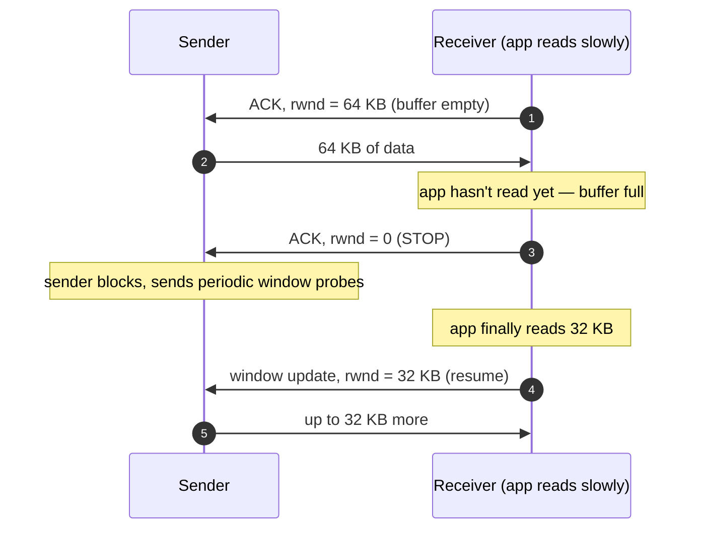
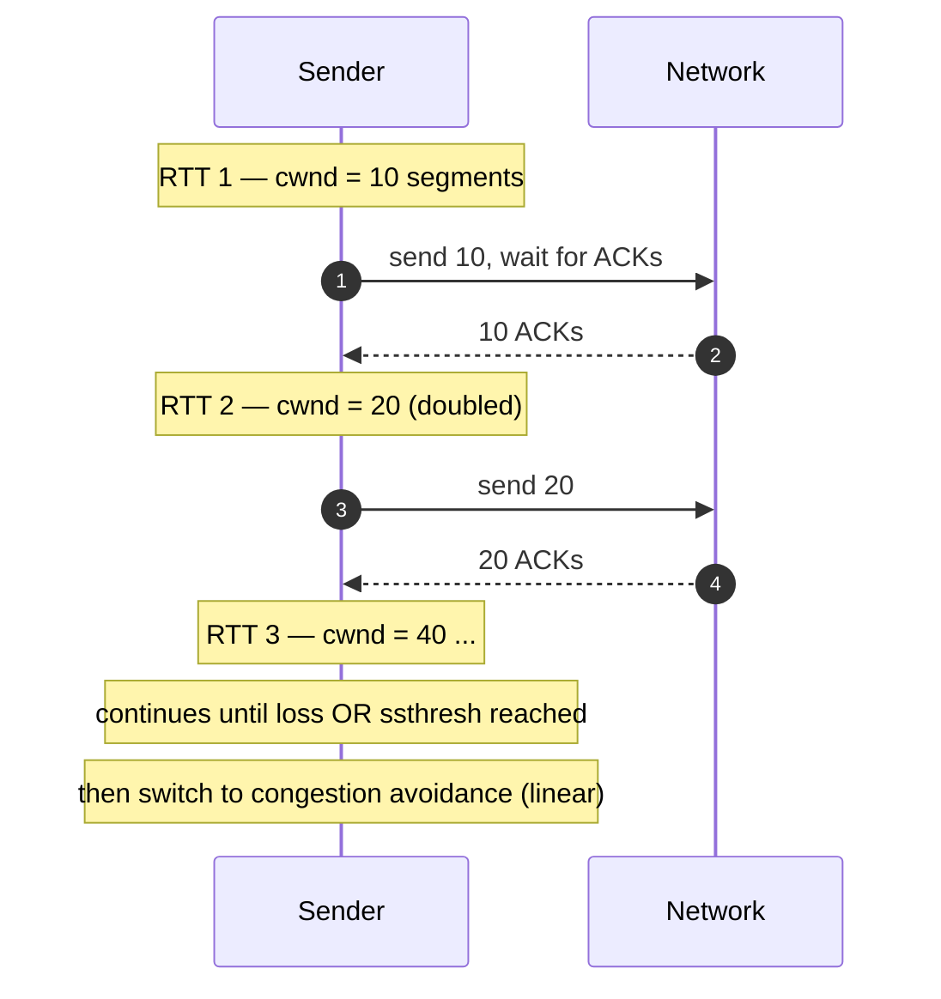
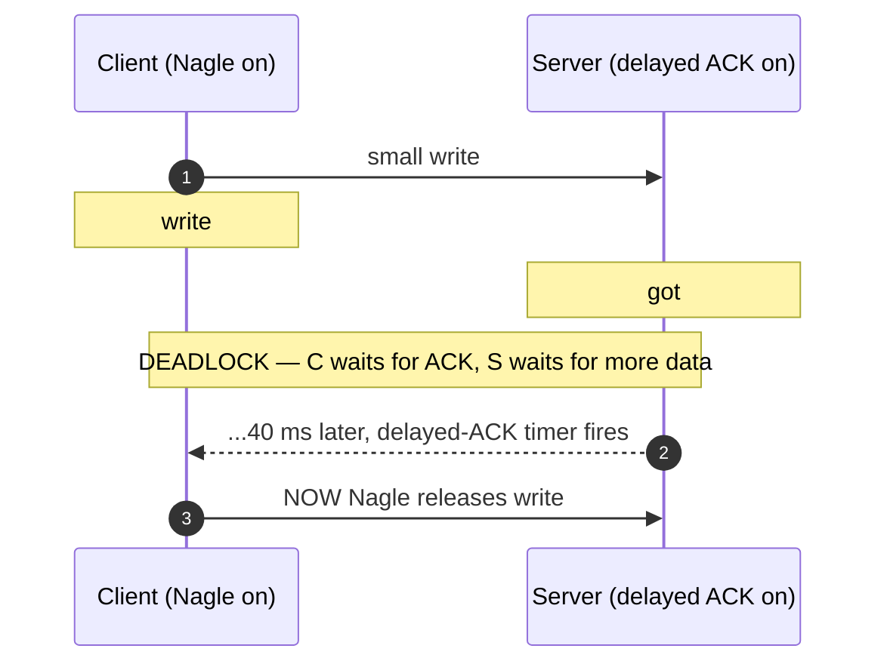
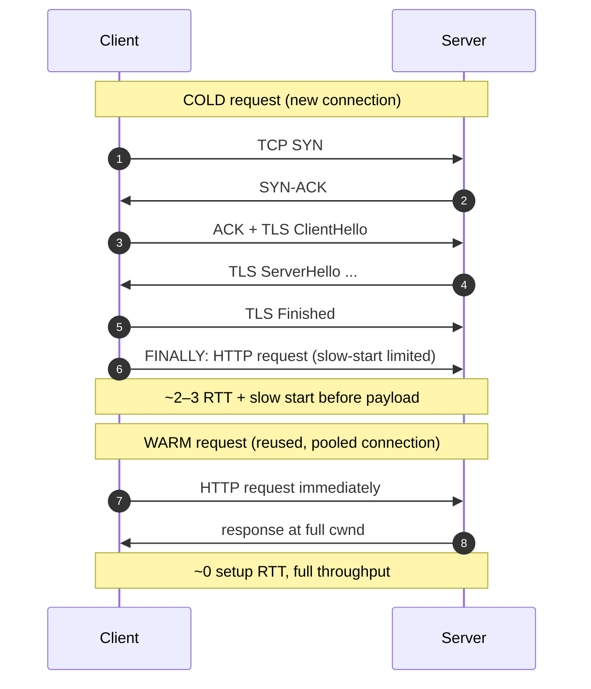

# TCP — Middle

<!-- level-focus -->
At middle level, focus on this question:

> Where does **TCP** belong in a maintainable component, and which trade-off selects the design?

Use the smallest realistic scenario that exposes the decision and its failure behavior.
## 1. The connection lifecycle: three-way handshake to teardown

A TCP connection is a shared agreement between two endpoints on a set of sequence numbers, window sizes, and options. It is established with a **three-way handshake** and closed with a **four-way** (or three-segment) exchange. Every byte of data lives strictly between those two events. Per RFC 9293, the connection is uniquely identified by the 4-tuple `(src IP, src port, dst IP, dst port)`.

Read the diagram top to bottom. The handshake costs **one full round-trip (1 RTT)** before the client can send its first byte of application data — this is the tax you pay for reliability, and the number-one reason connection reuse matters (§9).

```mermaid
sequenceDiagram
    autonumber
    participant C as Client
    participant S as Server

    Note over C,S: Stage 1 — open (3-way handshake, ~1 RTT)
    C->>S: SYN (seq=x)
    Note over C: state: SYN-SENT
    S->>C: SYN-ACK (seq=y, ack=x+1)
    Note over S: state: SYN-RECEIVED
    C->>S: ACK (ack=y+1)
    Note over C,S: both ESTABLISHED — data may flow

    Note over C,S: Stage 2 — data transfer
    C->>S: request bytes
    S->>C: response bytes

    Note over C,S: Stage 3 — active close initiated by C
    C->>S: FIN (seq=m)
    Note over C: state: FIN-WAIT-1
    S->>C: ACK (ack=m+1)
    Note over C: FIN-WAIT-2 &nbsp;·&nbsp; Note over S: CLOSE-WAIT
    S->>C: FIN (seq=n)
    Note over S: state: LAST-ACK
    C->>S: ACK (ack=n+1)
    Note over C: state: TIME_WAIT (holds ~2·MSL)
    Note over S: state: CLOSED
```

Key observations that matter for app code:

- **You cannot send data until the handshake completes.** The `connect()` call blocks (or the async equivalent stays pending) for at least 1 RTT. Over a 80 ms transcontinental link that is 80 ms of pure setup latency, before TLS even begins.
- **Close is asymmetric.** The side that calls `close()` first (the *active closer*) is the side that pays the TIME_WAIT cost. Design your protocol so the *server* is usually the active closer under high fan-in, or so connections are long-lived and rarely closed at all.
- **Half-close is legal.** After a FIN, that direction is done but the peer may keep sending (CLOSE-WAIT → it can still write). `shutdown(SHUT_WR)` uses this deliberately.

## 2. The state machine and what each state costs you

TCP is a formally specified finite state machine. You rarely name these states in application code, but you will see every one of them in `ss -tan` / `netstat` output when you debug a production incident, and each carries an operational meaning.

| State | Who | What it means operationally |
|-------|-----|-----------------------------|
| `LISTEN` | server | Socket bound and accepting. Backlog fills here if `accept()` is too slow → new SYNs dropped. |
| `SYN-SENT` | client | `connect()` in flight. Many of these = server slow/unreachable or SYN flood. |
| `SYN-RECEIVED` | server | Half-open. A flood of these is the classic **SYN-flood** signature (mitigated by SYN cookies). |
| `ESTABLISHED` | both | Healthy, data can flow. This is where you want connections to *stay*. |
| `FIN-WAIT-1/2` | active closer | We sent FIN, draining. Piling up = peer not ACKing our close. |
| `CLOSE-WAIT` | passive closer | **Peer closed; our app hasn't called `close()` yet.** Growing count = a *file-descriptor leak in your code* — you forgot to close sockets. |
| `LAST-ACK` | passive closer | We sent our FIN, awaiting final ACK. |
| `TIME_WAIT` | active closer | Waiting out stray packets. Large counts are usually normal for a busy client (see §3). |

The two states that indicate **your bug**, not TCP's, are `CLOSE-WAIT` (you leaked a socket) and a backlog-overflowing `LISTEN` (you're not accepting fast enough).

## 3. TIME_WAIT: the most misunderstood state

When the active closer sends the final ACK, it enters `TIME_WAIT` and stays there for **2×MSL** (Maximum Segment Lifetime; typically 2×60 s = up to a few minutes, though Linux fixes it at 60 s total via `TCP_TIMEWAIT_LEN`). Two reasons, both from RFC 9293:

1. **Absorb the peer's retransmitted FIN.** If our final ACK is lost, the peer resends its FIN; we must still be around to re-ACK it. If we had vanished, the peer would get a RST and log an error.
2. **Prevent old duplicate segments** from a just-closed connection being misdelivered into a *new* connection that happens to reuse the same 4-tuple. Waiting 2×MSL guarantees all stragglers have died in the network.

The practical failure this causes: a busy client (or a proxy) that opens and closes many short-lived connections to the *same* destination exhausts its **ephemeral port range** (~28k ports by default), because each closed connection parks a `(local_port)` in TIME_WAIT for a minute. New `connect()` calls fail with `EADDRNOTAVAIL`.

The correct fix is almost never "make TIME_WAIT shorter." It is:

- **Reuse connections** (§9/§10) so you stop churning 4-tuples in the first place — this eliminates the problem instead of tuning around it.
- Set `net.ipv4.tcp_tw_reuse=1` on the *client*, which lets the kernel safely reuse a TIME_WAIT slot for a new *outbound* connection when timestamps prove it's safe.
- Widen the ephemeral range (`net.ipv4.ip_local_port_range`) as a stopgap.
- **Never** enable the old `tcp_tw_recycle` (removed in modern kernels) — it broke connections behind NAT.

> Rule of thumb: if you're tuning TIME_WAIT, you probably have a connection-reuse problem masquerading as a kernel problem.

## 4. Flow control: the receive window

Flow control answers one question: *"How fast can the sender push without overrunning the receiver's buffer?"* The mechanism is the **receive window (rwnd)** — a field in every TCP header advertising how many more bytes the receiver has room for *right now*.



Consequences for applications:

- **A slow reader throttles the writer automatically.** If your consumer does heavy per-message work and reads slowly, `write()` on the sender eventually blocks (or returns `EWOULDBLOCK`). This is a *feature* — it's backpressure for free — but it means a slow downstream silently caps your throughput.
- **The bandwidth-delay product (BDP) sets the ceiling.** Max in-flight data = `throughput × RTT`. To saturate a 1 Gbps link at 80 ms RTT you need `1e9/8 × 0.08 ≈ 10 MB` of window. A default 64 KB window would cap you at `64KB / 0.08s ≈ 800 KB/s` — 0.6% of the link. **Window scaling** (a SYN option) is what allows windows beyond 64 KB; it must be negotiated at handshake time, so it's another reason not to renegotiate connections constantly.
- **`rwnd=0` is normal, not an error** — it's the receiver saying "pause," and the sender resumes on the window update.

## 5. Congestion control: slow start, cwnd, and AIMD

Flow control protects the *receiver*. **Congestion control** protects the *network in between* — the routers and links shared with everyone else's traffic. The sender maintains a second, hidden limit called the **congestion window (cwnd)**, and the amount it may have in flight is `min(rwnd, cwnd)`. Per RFC 5681, this is governed by a few interlocking algorithms.

**Slow start.** A new connection has no idea how much bandwidth is available, so it starts conservatively — `cwnd` begins at roughly 10 segments (IW10) and **doubles every RTT**. Despite the name, this is exponential *growth*, which is why bandwidth ramps up over several round-trips rather than instantly.



**Congestion avoidance (AIMD).** Once `cwnd` reaches a threshold (`ssthresh`), growth switches from exponential to **linear** — add roughly one segment per RTT. This is the *Additive Increase* half of **AIMD** (Additive Increase, Multiplicative Decrease): probe for more bandwidth gently.

**Multiplicative decrease.** When loss is detected, TCP interprets it as congestion and backs off *hard*:
- On **three duplicate ACKs** (fast retransmit): cut `cwnd` roughly in half and continue (fast recovery).
- On a **retransmission timeout (RTO)**: collapse `cwnd` back to 1 and re-enter slow start — the expensive, throughput-crushing case.

The AIMD sawtooth (linear climb, halving on loss) is what makes many TCP flows converge to a *fair* share of a bottleneck link.

The application-visible truth hidden in all this: **new connections are slow.** A fresh connection is stuck in slow start, so a large response transferred over a brand-new connection is bottlenecked not by bandwidth but by the number of RTTs it takes `cwnd` to ramp up. A *warm*, already-ramped connection sends the same payload far faster. This is the throughput half of the reuse argument.

## 6. Flow control vs congestion control

These two are constantly confused. They solve different problems, live in different places, and use different signals — but combine multiplicatively (`in-flight ≤ min(rwnd, cwnd)`).

| Dimension | Flow control | Congestion control |
|-----------|--------------|--------------------|
| **Protects** | The *receiver's* buffer | The *network path* (shared routers/links) |
| **Limit variable** | `rwnd` (receive window) | `cwnd` (congestion window) |
| **Who sets it** | Receiver advertises it explicitly in ACKs | Sender computes it locally; nobody advertises it |
| **Signal used** | Explicit window field | Inferred from loss / duplicate ACKs / RTT (implicit) |
| **Governing algorithm** | Sliding window, zero-window probes | Slow start, congestion avoidance (AIMD), fast recovery |
| **Spec** | RFC 9293 | RFC 5681 |
| **App symptom when it bites** | Slow consumer stalls the producer | New/lossy connections are slow to ramp; throughput sawtooths |
| **Effective send limit** | `min(rwnd, cwnd)` — whichever is smaller wins | same |

Mnemonic: **flow control is a conversation with your peer; congestion control is a guess about the world in between.**

## 7. Nagle's algorithm and delayed ACK: the 40 ms trap

TCP includes two optimizations that were each individually sensible in 1984 and that, *when combined*, produce one of the most infamous latency bugs in networking.

**Nagle's algorithm** reduces the overflow of tiny packets ("tinygrams"). Rule: if there is already unacknowledged data in flight, buffer any new small writes and don't send them until either (a) the outstanding data is ACKed, or (b) enough data accumulates to fill a full segment (MSS).

**Delayed ACK** reduces ACK traffic: the receiver waits up to ~40 ms (Linux) / 200 ms (some stacks) before ACKing, hoping to piggyback the ACK onto a response or batch several ACKs together.

Now combine them on a request/response protocol that writes a small header then a small body:



The result is a **periodic ~40 ms stall** on small back-to-back writes — devastating for latency-sensitive RPC. The fixes:

- Set **`TCP_NODELAY`** to disable Nagle on latency-sensitive sockets (nearly every RPC framework — gRPC, most HTTP clients, Redis clients — does this by default). This is the standard fix.
- Or avoid multiple small writes: **coalesce** header + body into a single `write()` / use writev, so Nagle never has a reason to buffer.
- Understand the interaction rather than blindly flipping flags: Nagle is *good* for chatty, bandwidth-bound, tolerant traffic (bulk logging); `TCP_NODELAY` is for interactive request/response.

## 8. Keep-alive: detecting dead peers

An idle, established TCP connection sends **nothing** on the wire. If the peer crashes, its power is pulled, or a stateful firewall/NAT silently drops the flow, *your side may never find out* — the socket sits in `ESTABLISHED` forever, and the next `write()` might hang or fail much later.

**TCP keep-alive** (`SO_KEEPALIVE`) makes the kernel send an empty probe after a connection has been idle for `tcp_keepalive_time` (Linux default: **2 hours** — far too long for most apps). If several probes go unanswered (`tcp_keepalive_probes`, spaced `tcp_keepalive_intvl`), the connection is declared dead and errors out.

Practical guidance:

- The 2-hour default is useless for detecting dead peers promptly. Tune per-socket (`TCP_KEEPIDLE`, `TCP_KEEPINTVL`, `TCP_KEEPCNT`) to something like 30–60 s idle if you rely on it.
- Keep-alive also **keeps NAT/firewall mappings warm.** Idle connections through a load balancer or NAT can be reaped after 60–350 s; a periodic probe prevents the mapping from being torn out from under you (which otherwise surfaces as a mysterious `connection reset`).
- Many application protocols implement their **own** application-level heartbeat/ping (HTTP/2 PING, WebSocket ping, gRPC keepalive) instead of relying on kernel keep-alive, because it's more portable and can carry liveness semantics the app cares about.

## 9. The cost of connection setup — and why reuse wins

Tally the price of *not* reusing a connection for a single request:

1. **DNS lookup** (sometimes) — variable, can be tens of ms.
2. **TCP 3-way handshake** — **1 RTT** before any byte of data.
3. **TLS handshake** (if HTTPS) — **1–2 additional RTTs** for the crypto negotiation.
4. **Slow start** — even after setup, the connection's `cwnd` is small, so the response trickles out over several RTTs before hitting full speed.

On an 80 ms-RTT path, a *cold* HTTPS request can spend **200–300 ms in overhead** before the first useful byte, then be throughput-limited by slow start. A *warm* connection skips steps 1–3 entirely and starts with an already-ramped `cwnd`.



This is why **connection reuse is the single highest-leverage TCP optimization** an application engineer controls:

- It amortizes the 2–3 RTT setup across many requests.
- It preserves the warmed-up `cwnd`, so every subsequent request runs at full throughput.
- It stops the TIME_WAIT / ephemeral-port churn from §3.
- HTTP/1.1 keep-alive, HTTP/2 multiplexing over one connection, and every database driver's pool all exist for exactly this reason.

## 10. Connection pooling in practice

A **connection pool** keeps a set of warm, established connections open and hands them to callers on demand, returning them afterward instead of closing them. It converts the per-request setup cost into a one-time (or rare) cost.

Design points that matter under real load:

- **Pool size.** Too small → requests queue waiting for a free connection (latency spikes under concurrency). Too large → you exhaust the *server's* connection limit or the database's `max_connections`. Size it to the concurrency you actually need, not "bigger is better" — a database is often happiest with a *modest* pool plus queuing (Little's Law: `connections ≈ throughput × service_time`).
- **Idle eviction / max-lifetime.** Pooled connections must be recycled periodically. A load balancer or the server may drop an idle connection; a stale pooled connection then fails on first use. Set a `max-idle-time` shorter than the infra's idle timeout, and a `max-lifetime` to force gradual rotation (also lets DNS/routing changes take effect).
- **Health / validation.** Validate a connection before handing it out (a lightweight ping) or use keep-alive, so callers don't get a half-dead socket.
- **Per-host pools.** Pool per destination 4-tuple target; a pool to host A is useless for host B.
- **HTTP/2 & gRPC** need *fewer* connections because they multiplex many concurrent streams over one connection — but watch for head-of-line blocking and per-connection stream limits (`SETTINGS_MAX_CONCURRENT_STREAMS`), which is why clients sometimes maintain a small pool of HTTP/2 connections rather than exactly one.

| Anti-pattern | Symptom | Fix |
|--------------|---------|-----|
| New connection per request | High p50 latency, port exhaustion, TIME_WAIT flood | Enable keep-alive / use a pool |
| Pool too small | Latency cliff at high concurrency; requests queue | Size to peak concurrency (Little's Law) |
| Pool too large | Server/DB connection-limit errors, memory pressure | Cap pool; add server-side queue |
| No idle timeout | Random `connection reset` after quiet periods | `max-idle-time` < infra idle timeout |
| No max-lifetime | Traffic won't rebalance after a deploy/scale event | Set finite `max-lifetime` |

## 11. Key takeaways

- A TCP connection costs **1 RTT to open** (plus 1–2 more for TLS) and is identified by the 4-tuple; you can send *nothing* until the handshake completes.
- The state machine is your debugging map: **`CLOSE-WAIT` growth = your socket leak**, backlog-overflowing `LISTEN` = you're not `accept()`ing fast enough, `TIME_WAIT` piles are usually normal churn.
- **TIME_WAIT** protects correctness (stray-packet absorption, 4-tuple safety). Don't shorten it — **reuse connections** so you stop churning 4-tuples; on clients use `tcp_tw_reuse`.
- **Flow control (`rwnd`)** protects the receiver and gives you free backpressure; **congestion control (`cwnd`, slow start, AIMD)** protects the network. The sender is limited by `min(rwnd, cwnd)`. Saturating a fat/long link needs window scaling to beat the BDP.
- **New connections are slow** because of slow start; warm connections run at full `cwnd`.
- The **Nagle + delayed-ACK** interaction causes ~40 ms stalls on small request/response writes — set `TCP_NODELAY` (or coalesce writes) for interactive traffic.
- Tune **keep-alive** (defaults are 2 h) to detect dead peers and keep NAT mappings warm.
- **Connection reuse / pooling is the highest-leverage TCP optimization you control** — it amortizes setup RTTs, preserves warmed `cwnd`, and eliminates port/TIME_WAIT churn. Size pools to real concurrency and recycle them before the infrastructure does.

*Next step:* [TCP — Senior](senior.md)

---

## Apply it

1. Find a real component where **TCP** affects an interface or dependency.
2. Write two plausible choices and the constraint that favors each one.
3. Make the smallest reversible change at that boundary.
4. Exercise the component alone, then exercise the integrated flow.
5. Keep the decision note with the evidence that selected the option.

## Verify your work

- A focused check proves the local behavior.
- An integrated check proves callers and dependencies still agree.
- Logs, traces, compiler output, or benchmarks expose the boundary.
- Reverting the change restores the previous behavior without unrelated edits.

## Review questions

- Which boundary is most affected by TCP?
- What constraint would make you choose the alternative design?
- How would you isolate a local defect from an integration defect?
- What evidence shows that the change remains maintainable?
