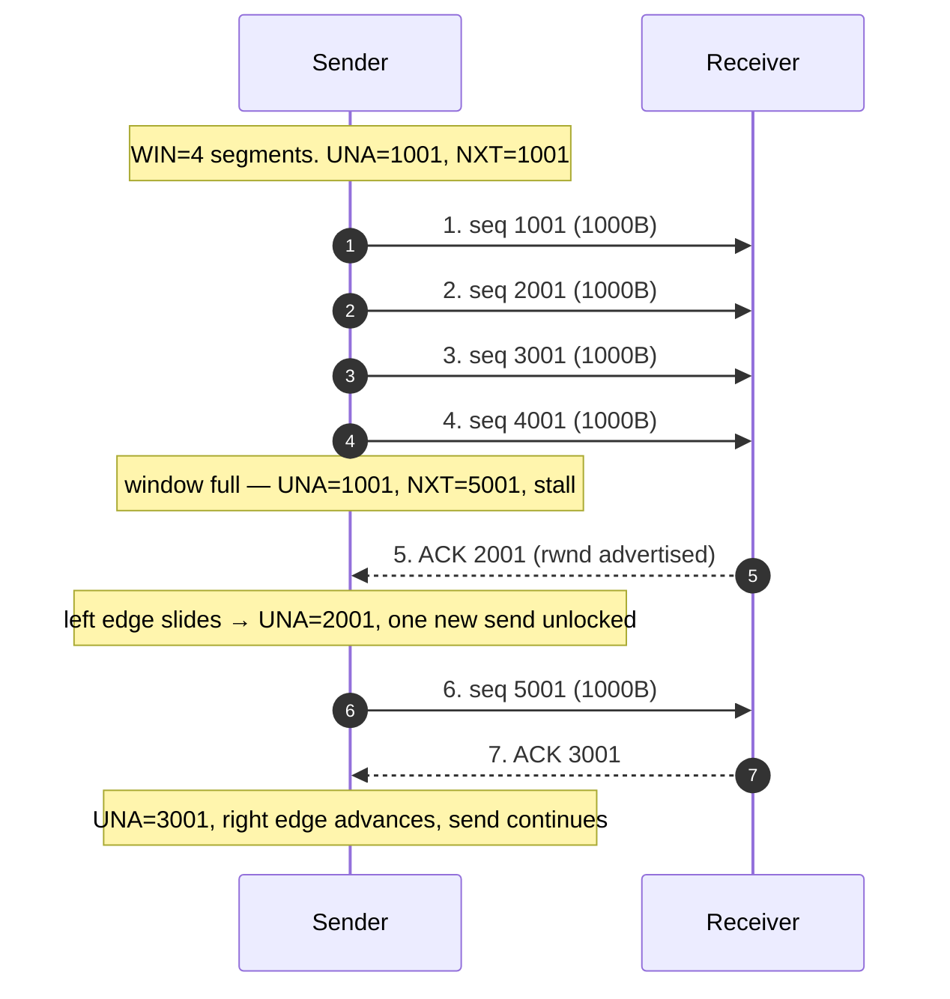
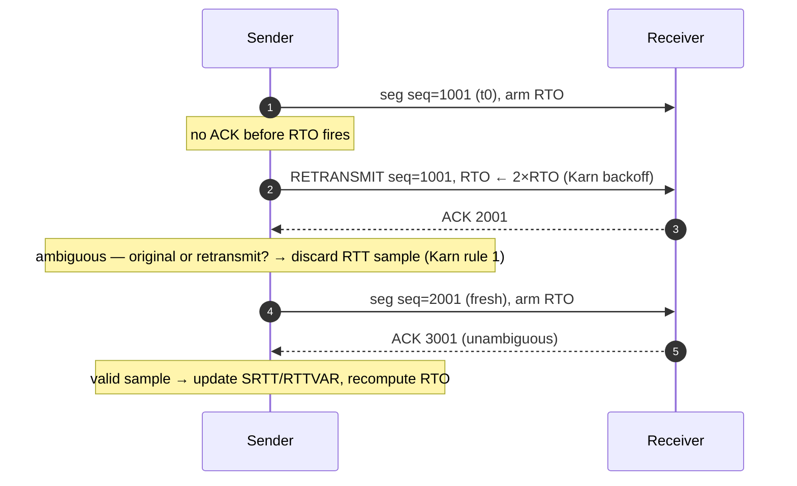
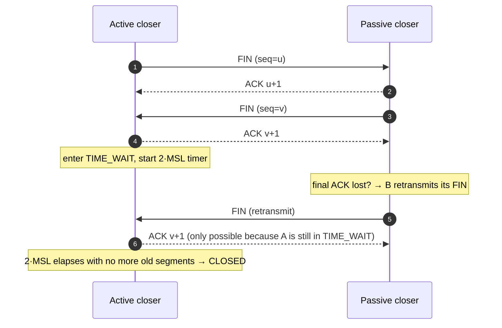

# TCP — Professional

<!-- level-focus -->
At professional level, focus on this question:

> How should teams adopt and operate **TCP** with measurable outcomes and limited coordination?

Use the smallest realistic scenario that exposes the decision and its failure behavior.
## 1. The Reliability Contract as State Machine

TCP (RFC 9293, which obsoletes the classic RFC 793) presents applications with a single
abstraction: an **ordered, reliable, bidirectional byte stream** over an unreliable,
reordering, duplicating, packet-losing IP substrate. It delivers this with four mechanisms
composed together:

| Guarantee | Mechanism |
|-----------|-----------|
| Ordering | Every byte carries a sequence number; the receiver reassembles by sequence. |
| Reliability | Cumulative ACKs + retransmission of un-acked data (timeout or fast retransmit). |
| Flow control | The receiver advertises a *receive window* (`rwnd`); sender never overruns the receiver's buffer. |
| Congestion control | The sender maintains a *congestion window* (`cwnd`); it never overruns the **network**. |

The critical mental model for this tier: the sender's in-flight data is bounded by

```
FlightSize ≤ min(cwnd, rwnd)
```

`rwnd` protects the **receiver's memory**; `cwnd` protects the **network's buffers and links**.
Flow control is a two-party contract; congestion control is a distributed estimate of a shared
resource that no node observes directly. Everything technically interesting about TCP lives in
`cwnd` — because the network never tells you its capacity; you must *infer* it from ACKs and loss.

The connection state machine underpins all of this:

`TIME_WAIT` (§10) is the state most misunderstood by engineers, and the one whose duration is
justified by an explicit correctness argument rather than a heuristic.

---

## 2. Sequence and Acknowledgement Number Mechanics

TCP numbers **bytes, not segments**. The 32-bit sequence-number field names the position of the
*first byte* of a segment's payload within the stream. This byte-granularity is why TCP can
re-segment freely (coalesce, split) without breaking the abstraction.

**Establishment picks a random ISN.** Each side chooses an Initial Sequence Number (ISN) —
randomized per RFC 6528 to prevent off-path sequence-guessing and stale-segment confusion. The
SYN and FIN flags each consume one sequence number (they are "phantom bytes"), which is why a
pure SYN with seq `X` is acknowledged with ack `X+1`.

**ACKs are cumulative.** `ack = N` means "I have received every byte up to but not including `N`;
send me `N` next." A single ACK can therefore acknowledge many segments, and a lost ACK is
harmless if a later ACK covers the same range.

Worked arithmetic — a 3 KB write split into three 1000-byte segments after ISN `c = 1000`:

```
Send  SEG1  seq=1001  len=1000   (bytes 1001..2000)
Send  SEG2  seq=2001  len=1000   (bytes 2001..3000)
Send  SEG3  seq=3001  len=1000   (bytes 3001..4000)

Suppose SEG2 is lost. The receiver gets SEG1, then SEG3 (out of order).
  On SEG1:  ACK 2001                 (contiguous through 2000)
  On SEG3:  ACK 2001  (DUP)          (2001..3000 still missing — hole)
The receiver buffers SEG3 but cannot advance the cumulative ACK past the hole.
Duplicate ACKs for 2001 are the sender's loss signal (see fast retransmit, §6).
```

**Selective ACK (SACK, RFC 2018)** repairs the blindness of pure cumulative ACKs. With SACK, the
receiver reports the *non-contiguous* blocks it holds (e.g. "cumulative 2001, SACK 3001–4001"),
so the sender retransmits **only** the hole (`2001..3000`) instead of everything after it.
Without SACK, a Reno sender under multiple losses in one window often falls back to a
timeout — the difference between a 10 ms and a 200 ms recovery.

**Wraparound and PAWS.** The sequence space is 32 bits (~4 GB). On a fast link, sequence numbers
wrap in seconds, and a delayed old segment could alias a new one. **PAWS** (Protection Against
Wrapped Sequences, RFC 7323) uses the TCP timestamp option as a 32-bit logical extension of the
sequence number to reject such ambiguous old segments.

---

## 3. The Sliding-Window Protocol

The sender's byte stream is divided into four regions by two pointers — `SND.UNA` (oldest
unacknowledged byte) and `SND.NXT` (next byte to send) — and one advertised limit, the window
`SND.UNA + WIN`:

```
| ... acknowledged ... | in-flight (sent, un-acked) | usable (may send) | not yet sendable |
                       ^SND.UNA                      ^SND.NXT            ^SND.UNA + WIN
                       |------------ WIN = min(cwnd, rwnd) ------------|
```

An arriving ACK does two things: it **advances `SND.UNA`** (freeing the left edge) and, combined
with the freshly advertised `rwnd` and the updated `cwnd`, **advances the right edge**. This is
"self-clocking": the window slides forward at exactly the rate ACKs return, which is exactly the
rate the bottleneck link can absorb. TCP is fundamentally an ACK-clocked pacing loop.



**Two pathologies the professional must know:**

- **Silly Window Syndrome (SWS).** If the receiver advertises tiny window openings (a few bytes)
  as its application slowly drains the buffer, the sender emits tiny segments — enormous
  header-to-payload overhead. Fixes: the receiver withholds window updates until it can open a
  significant fraction (an MSS or half the buffer); the sender uses **Nagle's algorithm** to
  coalesce small writes until the prior small segment is ACKed.
- **Nagle vs delayed-ACK deadlock.** Nagle holds a small segment awaiting an ACK; the receiver's
  **delayed-ACK** timer holds the ACK (up to ~40–200 ms) awaiting more data. The two wait on each
  other, injecting a latency spike into request/response protocols. This is why latency-sensitive
  RPC layers set `TCP_NODELAY`.

---

## 4. Bandwidth-Delay Product and Window Scaling

To keep a pipe full, the sender must have enough data *in flight* to cover one full round trip —
otherwise it sends a window, then idles waiting for ACKs, and utilization collapses. The required
in-flight quantity is the **bandwidth-delay product (BDP)**:

```
BDP (bytes) = Bandwidth (bytes/s) × RTT (s)
```

BDP is the number of bytes "resident in the wire" at full throughput. If `WIN < BDP`, throughput
is window-limited to `WIN / RTT`, *regardless of link speed*.

**Worked BDP.** Consider a 10 Gbps transcontinental link with 80 ms RTT:

```
Bandwidth = 10 Gbps = 10 × 10⁹ / 8 = 1.25 × 10⁹ bytes/s
RTT       = 80 ms  = 0.080 s
BDP       = 1.25 × 10⁹ × 0.080 = 1.0 × 10⁸ bytes = 100 MB
```

You must hold **100 MB** unacknowledged to saturate this path. But the classic TCP window field is
**16 bits → max 65,535 bytes ≈ 64 KB**. With a 64 KB window on this link:

```
Throughput = WIN / RTT = 65,535 / 0.080 = 819,187 bytes/s ≈ 6.5 Mbps
```

A 10 Gbps link delivers **6.5 Mbps** — 0.065% utilization — because of the window ceiling, not
the link. This is the "long fat network" (LFN) problem.

**Window scaling (RFC 7323)** fixes it. A one-time option negotiated in the SYN handshake supplies
a shift count `s` (0–14); the effective window becomes `advertised_window << s`. With `s = 14`,
the window ranges up to `65,535 × 2¹⁴ ≈ 1 GB` — enough to cover the 100 MB BDP above. In practice
the OS auto-tunes socket buffers toward the measured BDP; if kernel buffers are capped below BDP,
you leave throughput on the table no matter how fast the NIC is. **Sizing rule:** set
`max socket buffer ≥ BDP`, with headroom for RTT and rate variance.

---

## 5. RTT Estimation: SRTT, RTTVAR, RTO, and Karn's Algorithm

The retransmission timeout (RTO) is TCP's fallback loss detector. Set it too low and you
retransmit healthy data (spurious retransmits, congestion); too high and you stall for hundreds
of milliseconds on real loss. RTO must therefore track the *distribution* of RTT, not just its
mean — Jacobson's 1988 estimator (RFC 6298) does exactly this with an EWMA of both the smoothed
mean and the mean deviation:

```
On first RTT sample R:
    SRTT   = R
    RTTVAR = R / 2

On each subsequent sample R' (α = 1/8, β = 1/4):
    RTTVAR = (1 − β) · RTTVAR + β · |SRTT − R'|
    SRTT   = (1 − α) · SRTT   + α · R'

    RTO    = SRTT + max(G, K · RTTVAR)      where K = 4, G = clock granularity
    RTO    = clamp(RTO, 1 s, 60 s)          (RFC 6298 lower bound = 1 s)
```

Including `4 · RTTVAR` means RTO tracks the *tail*: on a jittery path RTTVAR grows and RTO widens,
avoiding spurious timeouts; on a stable path RTTVAR shrinks and RTO tightens toward SRTT.

**Karn's algorithm** resolves the *retransmission ambiguity*. If a segment is retransmitted and an
ACK arrives, you cannot tell whether it acknowledges the original or the retransmission — so the
measured RTT is unusable. Karn's rules:

1. **Do not** take an RTT sample from any segment that was retransmitted.
2. On timeout, **exponentially back off** the RTO (double it) for the retransmitted segment, and
   keep the backed-off RTO until a *fresh, unambiguous* ACK re-clocks the estimator.

Exponential backoff is what makes TCP degrade gracefully into a heavily congested or partitioned
network instead of amplifying the storm. RFC 7323 timestamps sidestep the ambiguity entirely: the
echoed timestamp identifies which transmission an ACK corresponds to, letting the sender take RTT
samples even on retransmitted segments.



---

## 6. Congestion Control I — Reno and the AIMD Control Law

Congestion control governs `cwnd` — the sender's estimate of how much the *network* can absorb.
TCP Reno (RFC 5681) has two regimes plus two recovery mechanisms.

**Slow start (exponential probe).** Begins with `cwnd = IW` (Initial Window, ~10 MSS per
RFC 6928). For every ACK, `cwnd += MSS`, which **doubles `cwnd` every RTT** — geometric growth to
find the operating point quickly. Slow start runs while `cwnd < ssthresh`.

**Congestion avoidance (linear probe).** Once `cwnd ≥ ssthresh`, growth becomes linear:
`cwnd += MSS × MSS / cwnd` per ACK, i.e. `+1 MSS per RTT`. This is the **Additive Increase** of
AIMD — gently probe for spare capacity.

**Reaction to loss** distinguishes two signals:

- **Triple duplicate ACK → fast retransmit + fast recovery** (mild congestion). Retransmit the
  missing segment immediately without waiting for RTO, and **halve** the window:
  `ssthresh = cwnd / 2`, `cwnd = ssthresh`. This is the **Multiplicative Decrease**.
- **RTO timeout → severe congestion.** `ssthresh = cwnd / 2`, but `cwnd` collapses to `1 MSS` and
  slow start restarts. A timeout is far more punishing than a fast retransmit — hence SACK's value
  in turning multi-loss events into fast retransmits rather than timeouts.

The **Additive-Increase / Multiplicative-Decrease (AIMD)** control law — `+α` per RTT when healthy,
`×β` (β = ½) on loss — is what produces the characteristic sawtooth and, provably, drives competing
flows toward a **fair** and **stable** equilibrium (Chiu & Jain, 1989):

---

## 7. The Mathis Throughput-vs-Loss Law

The AIMD sawtooth admits a closed-form steady-state throughput as a function of loss rate — the
**Mathis equation** (Mathis, Semke, Mahdavi & Ott, 1997):

```
            MSS       C
BW  ≈  ────────── · ─────
            RTT       √p

  BW  = achievable throughput (bytes/s)
  MSS = maximum segment size (bytes)
  RTT = round-trip time (s)
  p   = packet loss probability (fraction of segments lost)
  C   = a constant near 1 (√(3/2) ≈ 1.22 for the basic AIMD derivation)
```

**Where it comes from (sketch).** Between losses, AIMD grows `cwnd` linearly from `W/2` to `W`
(one loss per `~1/p` packets sets the ceiling `W`). Averaging the sawtooth window over a cycle and
dividing by RTT yields `BW ∝ MSS/(RTT·√p)`. The two consequences that shape real designs:

- **Throughput scales as `1/RTT`.** A flow at 20 ms RTT gets ~4× the throughput of a flow at
  80 ms over the *same* bottleneck — Reno is systematically unfair to long-RTT flows (RTT bias).
- **Throughput scales as `1/√p`.** Halving the loss rate only gives `√2 ≈ 1.41×` throughput.
  Conversely, on long fat networks tiny loss is devastating.

**Worked number.** A flow with `MSS = 1460 B`, `RTT = 80 ms`, and a modest loss rate `p = 0.0001`
(0.01%), using `C ≈ 1.22`:

```
BW ≈ (1460 / 0.080) × (1.22 / √0.0001)
   = 18,250 × (1.22 / 0.01)
   = 18,250 × 122
   ≈ 2.23 × 10⁶ bytes/s ≈ 17.8 Mbps
```

Reno tops out near **~18 Mbps** on this path — nowhere near a 10 Gbps link, and it is the
*loss-based control law*, not the hardware, that imposes the ceiling. Raise loss to `p = 0.01`
(1%) and the same formula gives ≈ 1.78 Mbps — a 10× throughput collapse for a 100× loss increase
(the `1/√p` relationship). This single formula is why loss-based control is unsuitable for modern
high-BDP paths and why CUBIC and BBR were designed.

---

## 8. Congestion Control II — CUBIC and BBR

**CUBIC (RFC 8312)** — Linux's default — keeps loss as its congestion signal but replaces Reno's
linear additive increase with a **cubic function of time since the last loss**:

```
W(t) = C · (t − K)³ + W_max
    W_max = window at the last loss event
    K     = ∛(W_max · β / C)   (time to climb back to W_max)
    β     ≈ 0.7 (CUBIC's multiplicative decrease, gentler than Reno's 0.5)
```

The cubic curve rises steeply, **flattens (plateaus) around the previous `W_max`** — cautiously
probing near the last known ceiling — then, if no loss occurs, accelerates again to explore higher.
Crucially, CUBIC's growth is a function of *wall-clock time*, not of ACK arrivals, so it is
**RTT-fair** (it decouples growth from RTT) and it fills high-BDP pipes far faster than Reno's
`+1 MSS/RTT`. On the 100 MB-BDP link of §4, Reno would need thousands of RTTs to grow into the
window; CUBIC gets there in a handful.

**BBR (Bottleneck Bandwidth and RTT; Cardwell et al., Google; specified in an IETF draft, not yet
a numbered RFC)** abandons loss as the primary signal entirely. It **models the path** by
continuously estimating two quantities:

- `BtlBw` — the bottleneck bandwidth (max delivery rate observed over a recent window).
- `RTprop` — the round-trip propagation delay (min RTT observed, i.e. RTT with empty queues).

Their product is the BDP; BBR paces sending at `BtlBw` and caps in-flight data near
`BtlBw × RTprop`, deliberately keeping the bottleneck queue *near empty*. It cycles through phases:
`PROBE_BW` (gently probe for more bandwidth by pacing at ~1.25× then draining at ~0.75×),
`PROBE_RTT` (periodically drain in-flight to re-measure `RTprop`), plus `STARTUP`/`DRAIN`.

Because BBR ignores loss, it thrives on lossy paths (cellular, transcontinental) where Reno/CUBIC
would repeatedly back off on non-congestive loss. Its trade-offs: BBRv1 could be aggressive toward
loss-based flows and, when its model was stale, could under-estimate queues; BBRv2/v3 add loss and
ECN responsiveness to improve coexistence.

The distinction that matters: **Reno and CUBIC are loss-based** (they treat a dropped packet as
*the* congestion signal, so they must fill and overflow a queue to learn capacity), whereas **BBR
is model-based** (it estimates rate and delay directly and tries to sit at the "knee" of the
throughput/latency curve — full bandwidth, empty queue).

---

## 9. Reno vs CUBIC vs BBR — Comparison

| Dimension | **Reno (RFC 5681)** | **CUBIC (RFC 8312)** | **BBR (IETF draft)** |
|-----------|---------------------|----------------------|----------------------|
| Congestion signal | Packet loss | Packet loss | Model: `BtlBw` + `RTprop` (rate/delay) |
| Class | Loss-based | Loss-based | Model-based (rate-based) |
| Increase law | Linear, `+1 MSS/RTT` (AIMD) | Cubic in time since last loss | Pace at estimated `BtlBw`; probe ±25% |
| Decrease on loss | ×0.5 (halve) | ×0.7 (gentler) | Loss not primary; adjusts model (v2+ reacts to loss/ECN) |
| RTT fairness | Poor — throughput ∝ 1/RTT | Good — growth is time-based | Good — paces to measured rate |
| High-BDP (LFN) fill | Very slow (Mathis-limited) | Fast (cubic ramp) | Fast (targets BDP directly) |
| Behavior on non-congestive loss | Backs off unnecessarily | Backs off unnecessarily | Ignores it — big win on lossy links |
| Queue occupancy | Fills buffers → bufferbloat | Fills buffers → bufferbloat | Keeps bottleneck queue ~empty (low latency) |
| Coexistence risk | Baseline (fair among Renos) | Fair with CUBIC; competes OK | Can starve loss-based flows (v1); improved in v2/v3 |
| Where it fits | Reference model; teaching; low-BDP | General-purpose default (Linux, Windows) | Long-fat / lossy paths; Google, YouTube, QUIC |

**Choosing:** CUBIC is the safe default for mixed traffic. BBR wins on high-BDP or lossy paths and
where **latency under load** (avoiding bufferbloat) matters — but validate coexistence with the
loss-based flows sharing your bottleneck before switching a fleet, and prefer BBRv2/v3 for fairness.

---

## 10. TIME_WAIT and the 2·MSL Rationale

When the side that sends the final ACK of the four-way close (the *active closer*) finishes, it
does **not** drop straight to `CLOSED`. It sits in **`TIME_WAIT` for 2·MSL**, where MSL is the
Maximum Segment Lifetime — the longest a segment can linger in the network (RFC 793 nominally
2 minutes; Linux typically uses ~30 s, so `TIME_WAIT ≈ 60 s`). Two independent correctness
arguments require this wait:

**1. Reliable connection teardown.** The active closer's final ACK may be lost. If so, the peer
retransmits its FIN. The closer must remain around long enough to receive that retransmitted FIN
and re-ACK it — otherwise the peer's `LAST_ACK` state never completes and it emits an RST. One MSL
for the lost ACK to (not) arrive, plus one MSL for the peer's retransmitted FIN to arrive → **2·MSL**.

**2. Preventing stale-segment corruption of a new incarnation.** After close, a new connection
could reuse the same 4-tuple (`srcIP:srcPort` ↔ `dstIP:dstPort`). A delayed duplicate segment from
the *old* connection, still wandering the network, could arrive with a sequence number that happens
to fall inside the *new* connection's window and be silently accepted as valid data — corrupting
the stream. Waiting 2·MSL guarantees every segment from the old incarnation has expired before the
4-tuple is reusable.



**Operational reality.** A busy server that *initiates* closes accumulates thousands of `TIME_WAIT`
sockets, exhausting ephemeral ports or socket memory. The correct mitigations preserve the
guarantee rather than defeating it:

- Design so the **client**, not the server, is the active closer where possible (HTTP keep-alive,
  connection pooling) — push `TIME_WAIT` cost onto many clients instead of one server.
- Enable `tcp_tw_reuse` (Linux) — the *timestamp-guarded* reuse of `TIME_WAIT` slots for new
  **outbound** connections; PAWS (§2) protects against the stale-segment case, so this is safe.
- **Never** set `SO_LINGER` to 0 to skip `TIME_WAIT` — it sends an RST and reintroduces exactly the
  data-corruption and lost-teardown risks 2·MSL exists to prevent.
- Avoid the long-obsolete `tcp_tw_recycle`, which broke behind NAT and was removed from Linux.

---

## 11. Professional Checklist

- [ ] Can compute BDP for a given path and set socket buffers ≥ BDP; know that window scaling
      (RFC 7323) is mandatory above 64 KB windows.
- [ ] Can explain why `FlightSize ≤ min(cwnd, rwnd)` and distinguish flow control from congestion
      control by *what resource each protects*.
- [ ] Can trace sequence/ack arithmetic through a loss + out-of-order delivery, and explain how
      SACK narrows retransmission to the hole.
- [ ] Can write the Jacobson SRTT/RTTVAR/RTO recurrence and state both of Karn's rules.
- [ ] Can draw the Reno AIMD sawtooth and name each transition (slow start, congestion avoidance,
      fast recovery, RTO collapse).
- [ ] Can state the Mathis law `BW ≈ MSS·C/(RTT·√p)` and derive both the `1/RTT` and `1/√p`
      scaling consequences with a worked number.
- [ ] Can classify Reno/CUBIC/BBR as loss-based vs model-based and pick the right one for a
      high-BDP or lossy path — including the coexistence caveat.
- [ ] Can give both correctness arguments for 2·MSL `TIME_WAIT` and the safe ways to reduce its
      operational cost (client-side close, `tcp_tw_reuse` + PAWS) without breaking the guarantee.

**Primary sources:** RFC 9293 (TCP, obsoletes 793) · RFC 5681 (TCP Congestion Control, Reno) ·
RFC 6298 (Computing TCP's RTO, Jacobson estimator) · RFC 2018 (SACK) · RFC 7323 (Window Scaling,
Timestamps, PAWS) · RFC 6528 (randomized ISN) · RFC 6928 (Increasing the Initial Window) ·
RFC 8312 (CUBIC) · BBR IETF draft (Cardwell, Cheng, Gunn, Yeganeh, Jacobson) ·
Mathis, Semke, Mahdavi & Ott, "The Macroscopic Behavior of the TCP Congestion Avoidance
Algorithm" (1997) · Chiu & Jain, "Analysis of the Increase and Decrease Algorithms for Congestion
Avoidance in Computer Networks" (1989).


---

## Apply it

1. Define the user or business outcome that **TCP** should improve.
2. Assign one owner for code, contracts, operations, and incidents.
3. Split delivery into reversible increments that produce evidence early.
4. Publish responsibilities, escalation paths, and compatibility windows.
5. Stop or expand only when the agreed measures support that decision.

## Verify your work

- Each increment has an owner, rollback path, and observable exit condition.
- Adoption, reliability, delivery time, and coordination cost are measured.
- Incident and migration exercises prove that responsibility is executable.
- The old path is removed only after telemetry proves it is unused.

## Review questions

- Which measurable outcome justifies investing in TCP?
- Which team owns the full lifecycle and incident response?
- What reversible increment produces the earliest useful evidence?
- Which exit condition proves that migration or adoption is complete?
