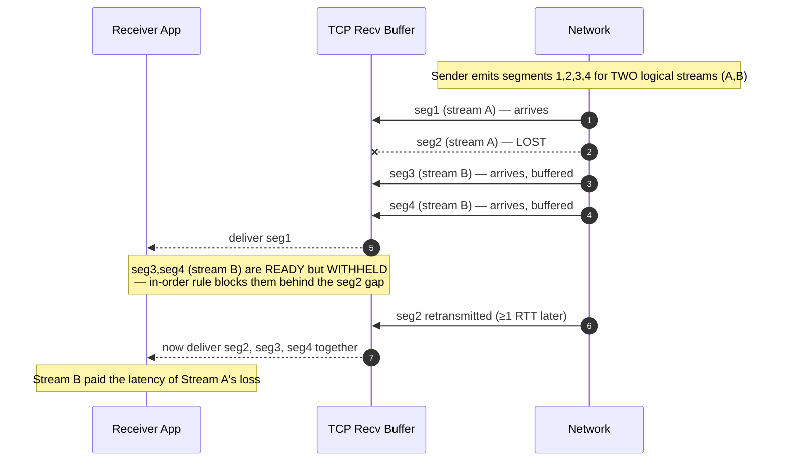
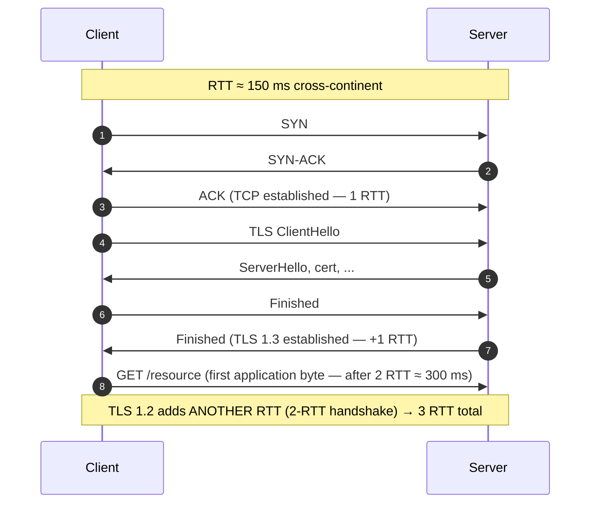

# TCP — Senior

<!-- level-focus -->
At senior level, focus on this question:

> Which system invariant is affected by **TCP** under failure, load, and change?

Use the smallest realistic scenario that exposes the decision and its failure behavior.
## 1. Responsibilities at This Level

- Own the transport layer for services handling millions of connections: choose
  connection reuse strategy, keep-alive policy, and pool sizing per hop.
- Diagnose tail-latency regressions that live *below* the application — HOL stalls,
  retransmit timeouts, bufferbloat — not just slow queries.
- Set and defend transport-level SLOs (connection setup p99, retransmit rate,
  socket-exhaustion headroom) and write the runbooks for connection storms.
- Make the QUIC/HTTP-3-vs-TCP call with quantified trade-offs, not hype: know
  precisely *which* problem QUIC fixes (transport HOL, handshake RTTs) and which it
  does not (congestion, bufferbloat at the bottleneck).
- Tune kernel and socket parameters (window scaling, `SO_REUSEADDR`, ephemeral port
  range, `tcp_tw_reuse`) and justify every change against a measured symptom.

---

## 2. What the Byte-Stream Abstraction Actually Guarantees

TCP gives the application a **reliable, in-order, bidirectional byte stream** over an
unreliable packet network. That is exactly three promises and no more:

1. **Reliable** — every byte you `write()` is eventually delivered or the connection
   fails. Loss is masked by retransmission (fast retransmit on 3 duplicate ACKs, or
   an RTO timer).
2. **In-order** — bytes arrive in send order. The receiver **buffers out-of-order
   segments and does not deliver them to the application until the gap is filled.**
   This one line is the root of transport head-of-line blocking (§3).
3. **Byte-oriented, not message-oriented** — TCP has no concept of your messages. A
   single `write()` may be split across segments; two `write()`s may be coalesced
   (Nagle's algorithm). The application must frame its own messages.

What TCP does **not** give you: message boundaries, security (that is TLS on top),
bounded latency, or fairness under loss. Every senior-level failure below is a
consequence of confusing one of TCP's three promises with a promise it never made.

---

## 3. Head-of-Line Blocking Within a Stream (and Why HTTP/2 Still Suffers)

**Transport HOL blocking** is a direct consequence of promise #2 (in-order delivery).
If segment `N` is lost, segments `N+1, N+2, …` may have already arrived and be sitting
in the receiver's buffer — but the kernel **cannot** hand them to the application,
because doing so would violate in-order delivery. Everything stalls until `N` is
retransmitted (one RTT minimum, an RTO if the loss was tail-end).



**Why HTTP/2 over TCP still suffers.** HTTP/2 multiplexes many logical streams over a
*single* TCP connection to eliminate the *application*-layer HOL blocking that HTTP/1.1
had (where one slow response blocked the whole pipelined connection). But all those
streams share **one byte-stream**. When a single TCP segment carrying stream A's data
is lost, TCP withholds *every subsequent byte* — including bytes belonging to the
unrelated streams B, C, D — until the retransmission fills the gap. HTTP/2 solved
application HOL and re-exposed transport HOL. Under loss, an HTTP/2 connection with 100
multiplexed streams can be worse than HTTP/1.1 with 6 parallel connections, because the
6 connections have 6 independent byte-streams and a loss on one does not stall the
other five.

**Why QUIC fixes it.** QUIC runs over UDP and implements independent, per-stream
reliability and ordering. A loss on stream A's packets only stalls stream A; streams
B, C, D keep flowing. QUIC also folds the TLS handshake into the transport handshake
(§4). The abstraction changes from "one ordered byte-stream" to "many independent
ordered byte-streams," which is precisely the semantic HTTP/2 wanted all along.

| Dimension | HTTP/1.1 (multiple TCP conns) | HTTP/2 over TCP | HTTP/3 over QUIC |
|-----------|-------------------------------|-----------------|------------------|
| App-layer HOL (one response blocks others) | Yes (per connection) | No (multiplexed) | No |
| Transport HOL (one loss blocks all streams) | Isolated per connection | **Yes — shared byte-stream** | No (per-stream reliability) |
| Connections needed for concurrency | ~6 per origin | 1 | 1 |
| Handshake RTTs (cold) | TCP(1) + TLS(1–2) per conn | TCP(1) + TLS(1–2) | 1 (combined), 0-RTT on resume |
| Connection migration (IP change) | Breaks | Breaks | Survives (connection ID) |
| Behavior under packet loss | Degrades per connection | **Degrades globally** | Degrades per stream |

The senior takeaway: multiplexing on a single TCP stream trades many byte-streams for
one, and **loss cost is proportional to how much you multiplexed onto that one stream.**
That is why lossy/mobile networks were the strongest motivation for QUIC.

---

## 4. The Latency Cost of Handshakes — and How to Pay Less

Establishing a secure connection costs round trips *before any application byte moves*.
On a cross-continent path (~150 ms RTT), these are your dominant first-byte latency.



**Round-trip budget (cold connection):**

- TCP three-way handshake: **1 RTT** before you can send data.
- TLS 1.3 handshake: **1 RTT** (down from 2 RTT in TLS 1.2).
- So a cold HTTPS request pays **2 RTT** (TLS 1.3) or **3 RTT** (TLS 1.2) of pure
  setup latency before the first request byte. At 150 ms RTT that is 300–450 ms of
  dead time.

**Mitigations, in order of impact:**

| Mitigation | What it removes | RTT saved | Caveat |
|-----------|-----------------|-----------|--------|
| **Connection reuse (keep-alive / pooling)** | The entire handshake on all but the first request | 2–3 RTT per reused request | Idle conns cost memory + FDs; tune pool size and idle timeout |
| **TLS session resumption (1.3 PSK)** | Full asymmetric TLS handshake | ~1 RTT | Requires ticket/PSK; rotate keys for forward secrecy |
| **TLS 1.3 0-RTT** | The remaining TLS RTT on resumption | Down to 0-RTT for early data | **Replayable** — only for idempotent requests |
| **TCP Fast Open (TFO)** | The TCP handshake RTT (data rides on SYN) | 1 RTT | Needs a prior TFO cookie; middlebox breakage; also replay-exposed |
| **QUIC 0-RTT** | Combined transport+TLS handshake on resume | Down to 0-RTT | Same replay caveat; not idempotent-safe |
| **Terminate TLS at a nearby edge/CDN** | Long-RTT handshake (moves it to short-RTT edge) | Most of the 2–3 RTT | Edge-to-origin still needs a (reused) connection |

**The 0-RTT / TFO replay trap.** Both TCP Fast Open and TLS 1.3 0-RTT let the client
send application data in the very first flight — before the server has proven the
client is not replaying a captured packet. An attacker can replay that early data.
**Rule:** only ever carry *idempotent* requests (GET, or writes protected by an
idempotency key) in 0-RTT/TFO early data. Never a `POST /transfer-money` in the first
flight. This is a design constraint you own, not a knob you flip blindly.

**The dominant real-world win is connection reuse.** Most latency wins come not from
exotic 0-RTT but from *not tearing connections down*: HTTP keep-alive, warm connection
pools (§7), and long-lived connections to backends. A handshake you never perform costs
zero RTT and zero replay risk.

---

## 5. Throughput Tuning: BDP, Window Scaling, and Congestion Control

TCP throughput on a single stream is bounded by how many bytes can be *in flight*
(unacknowledged) at once, divided by the RTT. The limiting window is the smaller of the
**receive window** (flow control, receiver-advertised) and the **congestion window**
(`cwnd`, sender-computed).

```text
Bandwidth-Delay Product (BDP) — the amount of data that must be in flight
to keep a pipe full:

    BDP (bytes) = bandwidth (bytes/s) × RTT (s)

Max single-stream throughput:

    throughput ≈ window_size / RTT

Example — a 1 Gbps link with 100 ms RTT:
    BDP = (10^9 / 8) bytes/s × 0.1 s = 12.5 MB

    To saturate this pipe, ~12.5 MB must be unacknowledged in flight.
    But the classic TCP window field is 16 bits → max 65,535 bytes without scaling.

    Without window scaling: throughput ≤ 65,535 B / 0.1 s ≈ 655 KB/s ≈ 5.2 Mbps.
    That is 0.5% of the 1 Gbps link — the connection is RTT-starved, not
    bandwidth-starved.

Fix: TCP Window Scaling (RFC 7323) — a handshake option that scales the window up to
~1 GB. It MUST be negotiated in the SYN; you cannot enable it mid-connection.
```

**Levers that raise throughput:**

- **Window scaling** on (default on modern kernels) so `cwnd`/rwnd can exceed 64 KB.
- **Socket buffers ≥ BDP.** If `SO_SNDBUF`/`SO_RCVBUF` are smaller than the BDP, the
  window can never open to fill the pipe. Autotuning (`tcp_moderate_rcvbuf`) handles
  most cases; long-fat networks (LFNs — high bandwidth × high RTT) may need larger caps.
- **Congestion control choice.** Loss-based (CUBIC, the Linux default) treats packet
  loss as congestion and backs off — brutal on lossy wireless links and behind bloated
  buffers. **BBR** models bottleneck bandwidth and RTT directly, so it sustains high
  throughput on paths with random (non-congestive) loss and avoids filling buffers.
- **Parallel streams** as a blunt instrument: N connections get ~N× the aggregate
  window, working around a single stream's `cwnd` ramp — at the cost of N× handshakes,
  N× sockets, and being *less* fair to other traffic.

**The tension:** the same big buffers and aggressive windows that maximize throughput
are exactly what create bufferbloat and hurt latency (§6). You cannot blindly maximize
both; you tune for the workload (§9).

---

## 6. Bufferbloat: Latency Under Load

**Bufferbloat** is high, variable latency caused by oversized buffers in the path
(home routers, NICs, cloud virtual switches) that fill up under load. Loss-based
congestion control keeps pushing until it sees a *drop*; if a router has a huge buffer,
it absorbs a large backlog before dropping, so the sender never gets the "slow down"
signal. The buffer now holds seconds of queued data, and **every packet waits behind
that queue** — a `ping` that was 20 ms idle becomes 800 ms under a concurrent upload.

```text
Idle path:        RTT = 20 ms
Saturated path
(bloated buffer): RTT = 20 ms base + queueing delay

    queueing_delay = buffer_bytes / bottleneck_bandwidth

    A 1 MB buffer on a 10 Mbps uplink:
        1 MB / (10 Mbps / 8) = 1,048,576 / 1,250,000 = 0.84 s of standing queue.

    Result: interactive traffic (voice, gaming, DB RPC) sees ~840 ms latency
    while a bulk transfer runs — even though nothing was "lost."
```

**Why a senior cares:** a system that looks healthy on throughput dashboards can have
catastrophic p99 latency for small requests that share a path with a bulk transfer
(a backup, a replication catch-up, a large export). The symptom is *latency that
scales with load, not with request size.*

**Mitigations you own:**

- **AQM (Active Queue Management):** FQ-CoDel / CAKE keep the queue short by dropping or
  ECN-marking early, signaling congestion *before* the buffer bloats. Deploy on egress
  where you control the box.
- **BBR** congestion control, which paces to the estimated bottleneck bandwidth and
  keeps the standing queue near-empty by design.
- **ECN (Explicit Congestion Notification):** routers mark instead of drop, so senders
  back off without loss + retransmit.
- **Separate the interactive path from the bulk path** — do not run replication/backup
  bulk transfers over the same queue as latency-sensitive RPC without AQM or traffic
  shaping.

---

## 7. TIME_WAIT, Connection Churn, and Port/Socket Exhaustion

When a connection closes, the side that sends the final `FIN` first (the **active
closer**) parks the socket in **`TIME_WAIT`** for `2 × MSL` (Maximum Segment Lifetime,
commonly ~60 s total on Linux). This is correct and necessary — it ensures delayed
duplicate segments from the old connection cannot be misinterpreted by a new connection
reusing the same 4-tuple, and that the final ACK is retransmittable. But at **high
connection churn** it becomes a resource problem.

**The exhaustion math.** A client (or a proxy acting as a client to a backend) picks a
**ephemeral source port** per outbound connection. The usable range is finite
(Linux default ~`32768–60999`, ≈ 28,000 ports). Each connection to the *same*
`(dst_ip, dst_port)` needs a distinct source port, and that port is unavailable while
its socket sits in `TIME_WAIT`.

```text
Ephemeral ports available (per dst tuple):  ~28,000
TIME_WAIT hold time:                        ~60 s

Max sustainable NEW-connection rate to one backend:
    28,000 / 60 s ≈ 466 connections/second

Exceed that with fresh connections and you hit EADDRNOTAVAIL / "cannot assign
requested address" — port exhaustion — even though CPU, RAM, and the backend are fine.
```

This is a classic "the backend is healthy but new connections fail" incident. It bites
proxies, connection-per-request clients, and load tests hardest.

**Mitigations (roughly in order of preference):**

| Mitigation | Mechanism | When to use | Risk |
|-----------|-----------|-------------|------|
| **Connection reuse / keep-alive / pooling** | Stop opening a connection per request | Almost always — the real fix | Idle FDs, pool sizing |
| **HTTP keep-alive to backends** | One conn serves many requests | Any request/response backend | Sticky load imbalance |
| Widen ephemeral port range | `ip_local_port_range` → more ports | Buys ~2× headroom, not a fix | Delays, doesn't prevent |
| `net.ipv4.tcp_tw_reuse=1` | Reuse `TIME_WAIT` sockets for new *outbound* conns when safe (timestamps) | High outbound churn | Outbound only; needs timestamps |
| Make the **server** the active closer | Server holds `TIME_WAIT`, not the client | Shift the cost to the less port-constrained side | Server FD load |
| Multiple backend IPs/ports | Expands the 4-tuple space | Sharded/fanned backends | Complexity |

> **Do not** blindly enable `tcp_tw_recycle` — it was removed from modern Linux because
> it broke connections from clients behind NAT (shared, non-monotonic timestamps). If
> you find it in an old runbook, delete that line. `tcp_tw_reuse` is the safe knob.

**The senior insight:** `TIME_WAIT` accumulation is almost never solved by fighting
`TIME_WAIT`. It is solved by **not churning connections** — reuse them. Every
mitigation below "connection reuse" is a workaround for a design that opens too many
short-lived connections.

---

## 8. Failure Modes: Connection Storms, Port Exhaustion, HOL Stalls

**Connection storm (thundering herd of setups).** After a backend restart, a network
blip, or a coordinated client reconnect (e.g., all clients dropped and reconnect at
once), thousands of clients slam `SYN`s simultaneously. The `accept()` backlog
(`SOMAXCONN` / `tcp_max_syn_backlog`) overflows, `SYN`s are dropped, clients RTO and
retry, amplifying the storm. Symptoms: soaring `SYN_RECV` counts, `ListenOverflows`,
setup latency spikes.
- **Mitigations:** connection reuse (fewer setups to begin with), reconnect with
  **exponential backoff + jitter** (never a fixed reconnect delay — that re-synchronizes
  the herd), raise the accept backlog, enable SYN cookies to survive backlog overflow,
  and use load-shedding at the LB so a struggling backend isn't buried.

**Port / socket exhaustion.** Covered in §7. The tell is `EADDRNOTAVAIL` on the client
side or FD exhaustion (`EMFILE` / "too many open files") on the server side while
backend health metrics are green. Guard with pooling, `ulimit -n` sizing, and alerting
on `TIME_WAIT` socket counts and ephemeral-port utilization *before* they hit the wall.

**HOL stalls.** Covered in §3. On a shared multiplexed TCP connection (HTTP/2, or your
own framed protocol), a single lost segment stalls *all* logical streams for at least
one RTT. The tell is correlated tail-latency across unrelated requests on the same
connection, worsening with the connection's packet-loss rate.
- **Mitigations:** spread critical streams across multiple connections (accepting more
  handshakes), move loss-sensitive/mobile traffic to QUIC/HTTP-3, and keep per-connection
  concurrency modest on lossy paths.

**Silent connection death (half-open).** A NAT or firewall silently drops idle
connection state; neither side knows the peer is gone until a write fails or an
application timeout fires. **Mitigation:** TCP keep-alive probes and, better,
application-level heartbeats with bounded timeouts so you detect the dead peer fast
rather than blocking on a stale socket.

---

## 9. Throughput-Tuning vs Latency-Tuning: A Decision Table

The single most important senior insight about TCP tuning: **the knobs that maximize
throughput and the knobs that minimize latency pull in opposite directions.** You tune
for one axis based on the workload; there is no universal "fast" setting.

| Concern | Throughput-optimized (bulk: backups, replication, video) | Latency-optimized (interactive: RPC, trading, gaming) |
|--------|-----------------------------------------------------------|-------------------------------------------------------|
| Socket buffers / window | Large (≥ BDP), window scaling maxed | Modest — just enough; big buffers add queueing |
| Nagle's algorithm (`TCP_NODELAY`) | Leave Nagle on (coalesce small writes) | **`TCP_NODELAY` on** — send small packets now, don't wait |
| Congestion control | CUBIC (throughput on clean paths) | BBR (keeps queue empty, low latency under load) |
| Queue management | Deep buffers tolerable | **AQM (FQ-CoDel/CAKE)** to kill standing queue |
| Delayed ACK | Fine | Consider disabling / tuning to avoid ACK-wait stalls |
| Connections | Few fat streams (or parallel for aggregate BW) | Reuse warm conns; avoid handshake per request |
| Multiplexing on one stream | Fine (loss cost amortized over a long transfer) | Risky — HOL stalls hit interactive p99 hard |
| What you optimize for | Bytes/second, link utilization | First-byte and p99 latency, jitter |
| Primary failure mode | RTT-starved window (fix: scaling + buffers) | Bufferbloat + HOL stalls (fix: AQM, BBR, `TCP_NODELAY`) |

Concrete example of the trade collision: **Nagle's algorithm + delayed ACK** together
can inject ~40 ms stalls into a request/response protocol (Nagle waits to coalesce a
small write until the prior segment is ACKed; delayed ACK waits up to ~40 ms before
ACKing). Great for throughput, terrible for a chatty RPC. For interactive traffic you
set `TCP_NODELAY` and accept slightly more packets to reclaim that latency.

---

## 10. When the Byte-Stream Abstraction Leaks — Senior Judgment

TCP's "reliable ordered stream" abstraction is excellent right up until it isn't. Recognize
the leaks, because each one is a design decision you own:

1. **In-order delivery leaks as HOL blocking (§3).** The moment you multiplex
   independent logical streams onto one connection, one stream's loss taxes all of them.
   *Judgment:* if streams are truly independent and the path is lossy, you want
   independent transports — multiple TCP connections or QUIC — not one shared stream.

2. **"Reliable" leaks as unbounded latency.** Reliability is achieved by retransmission,
   which costs at least one RTT (an RTO on tail loss). For a real-time stream (voice,
   live video, telemetry) a *late* packet is as useless as a lost one — TCP will still
   dutifully retransmit and stall the whole stream. *Judgment:* real-time media belongs
   on UDP/QUIC where you can drop-and-continue, not on TCP.

3. **"Just a stream" leaks as message-framing bugs.** TCP does not preserve your
   `write()` boundaries. Assuming one `read()` returns exactly one message is the single
   most common junior transport bug. *Judgment:* always frame explicitly
   (length-prefix, delimiter, or a framed protocol like HTTP/2 / gRPC).

4. **"A connection" leaks as resource cost at scale (§7).** Each connection is an
   ephemeral port, a socket, kernel memory, and (with TLS) a session. At high churn the
   abstraction's *cost* dominates. *Judgment:* connection lifecycle (reuse, pooling,
   who-closes) is a first-class design concern, not an afterthought.

5. **"The network is fast" leaks as bufferbloat (§6).** Throughput looks fine while
   interactive latency collapses under load. *Judgment:* separate bulk and interactive
   paths, deploy AQM, prefer BBR.

The unifying principle: **the byte-stream is a shared, ordered, reliable resource, and
every one of those adjectives is a coupling.** Senior transport design is mostly about
deciding *when to accept that coupling* (reuse a stream, multiplex, retransmit) and
*when to break it* (separate connections, QUIC's per-stream reliability, UDP for
real-time). That decision — not any single sysctl — is what you own.

---

## 11. Senior Checklist

- [ ] Connection reuse (keep-alive / pooling) is the default; connection-per-request is
      treated as a defect, and pool sizes are justified against BDP and backend limits.
- [ ] Handshake cost is measured (cold vs warm first-byte latency); TLS 1.3 + session
      resumption in place; 0-RTT/TFO restricted to idempotent requests only.
- [ ] Window scaling on; socket buffers sized ≥ BDP for high-BDP paths; congestion
      control (CUBIC vs BBR) chosen deliberately per workload.
- [ ] Bufferbloat guarded: AQM on egress you control; bulk and interactive traffic do
      not share an unmanaged queue; latency-under-load is monitored, not just throughput.
- [ ] `TIME_WAIT` / ephemeral-port utilization and FD counts are alerted on with
      headroom; port-exhaustion incident has a runbook; `tcp_tw_recycle` is *not* set.
- [ ] Reconnect logic uses exponential backoff **with jitter**; accept backlog and SYN
      cookies sized to survive a connection storm.
- [ ] For lossy/mobile or highly-multiplexed traffic, the QUIC/HTTP-3 vs HTTP/2-over-TCP
      trade-off is evaluated with the transport-HOL cost quantified, not assumed.
- [ ] Every framed protocol on top of TCP does explicit message framing; nothing assumes
      one `read()` equals one message.

---

*Next step:* [TCP — Professional](professional.md)

---

## Apply it

1. State the system invariant that **TCP** must protect.
2. Mark ownership, state, and failure propagation at each boundary.
3. Compare two designs under load, dependency failure, and future change.
4. Define recovery and compatibility behavior before implementation.
5. Test the riskiest assumption with a focused experiment.

## Verify your work

- The experiment supports the design with evidence, not preference.
- Failure injection shows the blast radius and recovery path.
- Compatibility checks cover old and new callers or data.
- Operational signals reveal invariant violations and recovery progress.

## Review questions

- Which invariant must remain true when TCP fails?
- Where should recovery responsibility live, and why?
- Which assumption deserves an experiment before implementation?
- How can the design evolve without changing every consumer at once?
