# TCP — Staff

> **Axis:** organizational scope & judgment — NOT deeper protocol mechanics (that is `professional.md`).
> This file answers a different question: across a fleet of services and many teams, *when is TCP
> worth spending engineering budget on*, when is the byte-stream the actual bottleneck versus a
> red herring, and when does the org commit to moving off TCP entirely (QUIC/HTTP-3)?
>
> The Staff-level truth about TCP is uncomfortable: **most of the time the correct decision is to
> leave it alone.** The kernel, the load balancer, and the CDN have absorbed decades of tuning that
> your team cannot out-engineer in a sprint. The judgment is knowing the small number of cases where
> that is false, and spending the org's attention only there.

---

## Table of Contents

1. [Scope of Influence — Why TCP Is a Fleet Concern](#1-scope-of-influence--why-tcp-is-a-fleet-concern)
2. [The Default-First Doctrine — When Tuning Is Worth It](#2-the-default-first-doctrine--when-tuning-is-worth-it)
3. [Diagnosing the Real Bottleneck — Byte-Stream vs Red Herring](#3-diagnosing-the-real-bottleneck--byte-stream-vs-red-herring)
4. [Connection Budgets as a Shared Resource](#4-connection-budgets-as-a-shared-resource)
5. [Keep-Alive & Pool Sizing Policy Across the Fleet](#5-keep-alive--pool-sizing-policy-across-the-fleet)
6. [The QUIC / HTTP-3 Adoption Decision](#6-the-quic--http-3-adoption-decision)
7. [Cost, ROI & Second-Order Consequences](#7-cost-roi--second-order-consequences)
8. [When NOT to Touch TCP](#8-when-not-to-touch-tcp)
9. [Staff Checklist](#9-staff-checklist)

---

## 1. Scope of Influence — Why TCP Is a Fleet Concern

TCP looks like a per-connection, kernel-owned detail — the kind of thing an application engineer
never thinks about. At Staff scope the framing inverts: **TCP is a shared, fleet-wide budget that
no single team owns, yet every team can exhaust.** A single service that opens unbounded
connections, disables keep-alive, or picks a pathological pool size does not degrade only itself —
it burns ephemeral ports on shared NAT gateways, saturates conntrack tables on shared firewalls,
and holds file descriptors that starve co-located processes.

```mermaid
graph TD
    subgraph "What one team controls"
        A[Client pool size] --> B[Keep-alive on/off]
        B --> C[Connect/idle timeouts]
    end
    subgraph "Shared resources they silently consume"
        D[Ephemeral ports on NAT/egress GW]
        E[conntrack table entries on firewall]
        F[File descriptors on shared hosts]
        G[Backend accept queue + memory]
        H[LB connection slots]
    end
    A --> D
    A --> E
    A --> F
    A --> G
    A --> H
    style D fill:#3a2a2a
    style E fill:#3a2a2a
    style F fill:#3a2a2a
    style G fill:#3a2a2a
    style H fill:#3a2a2a
```



The Staff engineer's job is not to hand-tune any one of these. It is to (a) make the shared budget
**visible** (dashboards for port exhaustion, conntrack utilization, LB active connections), (b)
establish **defaults and guardrails** that keep any single service from consuming the shared pool,
and (c) decide the small number of cases where deviating from platform defaults earns its keep.
Influence here is exercised through **platform defaults, linters, and golden client libraries**, not
through reviewing every service's socket options — that does not scale across dozens of teams.

---

## 2. The Default-First Doctrine — When Tuning Is Worth It

The single most valuable judgment a Staff engineer contributes about TCP is a bias: **defaults win
unless you have a measured reason and the reason is on the byte-stream, not above it.** Modern Linux
autotunes receive/send buffers, negotiates window scaling, and (on current kernels) ships sane
congestion control. CDNs and cloud load balancers terminate TCP with configurations tuned by teams
whose entire job is that termination. Your application team will not beat them by editing sysctls in
a sprint, and every knob you turn is a knob someone must understand during the next incident.

| Layer | Who tuned it | Should app teams touch it? |
|-------|--------------|----------------------------|
| Kernel buffer autotuning (`tcp_rmem`/`tcp_wmem`) | Kernel maintainers + distro defaults | Almost never — autotuning is good |
| Congestion control algorithm | Kernel; platform sets fleet-wide | Fleet decision (§7), not per-service |
| TLS session resumption / 0-RTT | Platform / LB / CDN team | Consume via platform; don't reimplement |
| TCP termination at edge | CDN / edge team | No — this is their core competency |
| **Connection pool size** | **The app team** | **Yes — this is genuinely yours (§4–5)** |
| **Keep-alive & idle timeouts** | **The app team** | **Yes — a real shared-impact decision** |
| **Retry/timeout budgets** | **The app team** | **Yes — drives connection churn** |

Notice the pattern: the knobs worth an app team's attention are the ones **above** the socket — pool
size, keep-alive policy, timeout/retry budgets. These control how many connections exist and how
long they live. The knobs **inside** the socket (buffers, window, congestion algorithm) are almost
always better left to the platform. A useful heuristic for the org: *if the tuning lives in a sysctl,
it is probably a platform decision made once for the fleet; if it lives in your HTTP-client
configuration, it is probably yours.*

**Worth the engineering effort when, and only when, all three hold:**
1. You have a **measurement** showing the byte-stream itself is the constraint (§3), not a proxy for
   a slow backend or an undersized pool.
2. The workload is **large enough** that the win pays back the added operational surface — the
   canonical cases are long-fat networks (high bandwidth × high RTT, e.g. cross-region bulk
   replication) and very-high-connection-count edge tiers.
3. The change can be **owned and documented** — an ADR, a dashboard, and a named owner — so the next
   on-call does not find a mystery sysctl during an outage.

If any one fails, the correct Staff answer is "leave the defaults; spend the effort elsewhere."

---

## 3. Diagnosing the Real Bottleneck — Byte-Stream vs Red Herring

The most expensive Staff mistake around TCP is **misattribution**: a team spends a quarter tuning
sockets because a graph *looked* like a TCP problem, when the real cause was a slow query, an
undersized pool, or head-of-line blocking they could have sidestepped at the application layer. TCP
symptoms are notoriously good at impersonating other problems.

```mermaid
flowchart TD
    A[Symptom: high tail latency / stalls] --> B{What does the evidence show?}
    B -->|Latency scales with response size on high-RTT links| C[Genuine: bandwidth-delay product / buffer limit]
    B -->|"connect: cannot assign requested address"| D[Genuine: ephemeral port exhaustion]
    B -->|One slow response blocks others on same conn| E[Genuine: HOL blocking - consider HTTP/2 or QUIC]
    B -->|Latency flat vs size, backend p99 high| F[Red herring: slow backend / query]
    B -->|Errors spike only at pool ceiling| G[Red herring: undersized pool, not TCP]
    B -->|TIME_WAIT count high but ports free| H[Red herring: cosmetic, usually harmless]
    C --> I[Tuning may pay - proceed with ADR]
    D --> I
    E --> J[App-layer or protocol change, not sysctl]
    F --> K[Fix the backend; leave TCP alone]
    G --> K
    H --> K
    style C fill:#2a3a2a
    style D fill:#2a3a2a
    style E fill:#2a3a2a
    style F fill:#3a2a2a
    style G fill:#3a2a2a
    style H fill:#3a2a2a
```



Three genuine byte-stream bottlenecks worth acting on, and their tell-tale signatures:

- **Bandwidth-delay product limits.** On a long-fat network (say, cross-region replication at high
  throughput and 80–150 ms RTT), throughput is capped by `window / RTT`. If throughput plateaus well
  below link capacity and *scales with configured buffer size*, this is real. The fix is a platform
  decision (buffer ceilings, congestion control) applied narrowly to that path, not the whole fleet.
- **Ephemeral port / connection exhaustion.** Signature: `EADDRNOTAVAIL` ("cannot assign requested
  address"), or connection setup failures that correlate with a single high-fan-out client behind a
  shared NAT. This is real and urgent — but the fix is almost always **fewer, longer-lived
  connections** (keep-alive, pooling — §4–5), not socket tuning. Reaching for `tcp_tw_reuse` or
  shrinking `TIME_WAIT` is treating a symptom; the disease is connection churn.
- **Head-of-line blocking.** One slow or lost segment stalls everything multiplexed behind it on the
  same TCP connection. This is intrinsic to TCP's ordered byte-stream and **cannot be tuned away** —
  it is the single strongest technical argument for QUIC/HTTP-3 (§6).

The three most common **red herrings** — the ones that eat quarters — are: (1) a slow backend whose
latency is flat with response size (TCP is innocent); (2) an undersized connection pool that errors
only at its ceiling (raise the pool, not the kernel); and (3) alarming-looking `TIME_WAIT` counts
that are, on a client with plenty of free ports, cosmetically scary but operationally harmless. The
discipline: **demand a measurement that isolates the byte-stream before authorizing byte-stream
work.**

---

## 4. Connection Budgets as a Shared Resource

Treat connections like any other capacity: **finite, shared, and budgeted.** Every tier in the path
has a ceiling — ephemeral ports (~28k per source IP:dest tuple by default), conntrack table size,
backend `accept()` queue depth, LB connection slots, and per-process file descriptors. A pool sized
in isolation by each team, multiplied across a fleet, silently oversubscribes these shared ceilings.
The failure mode is not gradual; it is a cliff, and it usually appears first as unexplained connect
failures on an unrelated service.

The core arithmetic every team should be able to reproduce:

```text
Connections a single service needs (steady state):
  concurrent_conns ≈ QPS × avg_latency_seconds            (Little's Law)
  Example: 5,000 QPS × 0.04 s = 200 concurrent connections per backend.

Fleet-level ceiling check (the number Staff actually cares about):
  Σ (pool_size × client_replicas)   must stay below
  min( backend_accept_capacity, conntrack_limit, ephemeral_port_supply )

  If 40 client pods each hold a pool of 100 to one backend =
  4,000 connections into a backend whose accept queue + memory
  was sized for 1,500 → the backend tips over, and it looks like
  *the backend's* fault, not the clients' pool math.
```

The Staff move is to make this budget **explicit and monitored** rather than emergent:

- Expose fleet-wide dashboards for the shared ceilings: ephemeral-port utilization on egress
  gateways, conntrack table usage on firewalls, LB active connections, backend accept-queue overflow
  counters.
- Set **alerting thresholds on utilization, not on failure** — you want to know at 70% of the port
  supply, not when connects start failing.
- Provide a **golden client library** with a sane default pool size and mandatory keep-alive, so the
  common case is correct without every team re-deriving the arithmetic. Defaults in the library beat
  guidance in a wiki, every time, at fleet scale.

---

## 5. Keep-Alive & Pool Sizing Policy Across the Fleet

Keep-alive (connection reuse) is the highest-leverage TCP-adjacent decision an org makes, because it
is the difference between paying the setup cost (TCP handshake + TLS) on every request versus
amortizing it across thousands. It is also a **shared-concern policy**, not a per-service preference:
one service disabling keep-alive raises connection churn on gateways everyone shares. Yet keep-alive
also has a failure mode — idle connections consume backend memory and can outlive backend restarts,
producing stale-connection errors — so "always on, infinitely" is wrong too.

The policy Staff should establish (as defaults in the golden library, overridable with justification):

| Dimension | Fleet default | Rationale / when to override |
|-----------|---------------|------------------------------|
| Keep-alive | **On** | Amortizes handshake+TLS; the default for nearly all RPC/HTTP |
| Pool size (per client→backend) | **≈ Little's-Law estimate + headroom** | Oversizing wastes backend memory; undersizing serializes and errors at ceiling |
| Idle timeout (client) | **Shorter than backend/LB idle timeout** | Prevents client reusing a socket the backend already closed → stale-conn errors |
| Max connection lifetime | **Bounded (e.g. minutes)** | Forces periodic rebalancing so pools follow backend scale-out; avoids pinning to old replicas |
| Timeout & retry budget | **Bounded, with jitter** | Aggressive retries multiply connection churn — a retry storm is a connection storm |

Two failure modes that repeatedly bite fleets and belong in the policy:

- **The idle-timeout mismatch.** If the client's idle timeout is *longer* than the backend's or LB's,
  the client will happily reuse a socket the other side has already reaped, yielding intermittent
  connection-reset errors that are maddening to trace. The invariant is simple and should be a lint:
  **client idle timeout < server/LB idle timeout.**
- **Keep-alive that never rebalances.** Long-lived pooled connections pin a client to the specific
  backend replicas alive at pool-creation time. When the backend scales out, new replicas get no
  traffic because everyone's connections are already established elsewhere. Bounding **max connection
  lifetime** forces periodic re-resolution so load actually follows capacity — this is why "keep-alive
  forever" is a subtle availability bug at scale.

The Staff deliverable is not a per-service tuning; it is a **default policy encoded in shared
tooling** plus the two lint rules above, so the fleet is correct-by-default and deviations are
conscious and reviewed.

---

## 6. The QUIC / HTTP-3 Adoption Decision

The one org-level decision where TCP itself is on the table is **moving off it** to QUIC (the
transport underneath HTTP-3). QUIC runs over UDP and solves the one thing TCP tuning cannot: **TCP's
head-of-line blocking across multiplexed streams.** In HTTP/2 over TCP, a single lost packet stalls
every stream on that connection because TCP must deliver the byte-stream in order; QUIC gives each
stream independent delivery, so loss on one stream does not block the others. It also folds the
transport and TLS handshakes together (fewer round trips, and 0-RTT resumption) and enables
**connection migration** — a session survives a client IP change (Wi-Fi → cellular) because identity
is a connection ID, not the 4-tuple.

This is a genuine two-way-door-ish decision with real costs, so it warrants a staged evaluation, not
a hype-driven adoption.

```mermaid
flowchart TD
    A[Considering QUIC / HTTP-3?] --> B{Where does it apply?}
    B -->|Public internet edge, lossy/mobile clients| C{Do you own or control the edge/CDN?}
    B -->|Internal service-to-service in one DC| D[Stop: TCP HOL rarely bites low-loss LANs]
    C -->|CDN supports HTTP-3, flip a flag| E[Low-risk pilot: enable at edge, keep TCP fallback]
    C -->|Must run QUIC yourself on origin| F{Is UDP reliably passable + CPU budget OK?}
    F -->|Middleboxes block/throttle UDP for some users| G[Require TCP fallback + Alt-Svc; measure fallback rate]
    F -->|CPU cost of userspace QUIC acceptable| H[Staged rollout with per-cohort metrics]
    E --> I[Measure: tail latency on lossy paths, fallback %, CPU]
    H --> I
    G --> I
    D --> J[Leave on TCP]
    I --> K{Net win on real user metrics?}
    K -->|Yes, mainly mobile/lossy| L[Expand; keep TCP fallback indefinitely]
    K -->|No / marginal| J
    style D fill:#3a2a2a
    style J fill:#3a2a2a
    style E fill:#2a3a2a
    style L fill:#2a3a2a
```



| Dimension | TCP (+ TLS, HTTP/1.1 or HTTP/2) | QUIC / HTTP-3 |
|-----------|----------------------------------|---------------|
| HOL blocking across streams | Yes — one loss stalls all multiplexed streams | No — independent per-stream delivery |
| Handshake round trips | TCP + TLS (fewer with resumption) | Combined transport+TLS; 0-RTT resumption |
| Connection migration (IP change) | No — tied to 4-tuple, session breaks | Yes — connection ID survives IP change |
| Middlebox / firewall traversal | Universally passable | UDP is blocked/throttled by *some* networks → needs fallback |
| CPU cost | Kernel TCP is highly optimized, offloaded | Userspace stack (today) — higher CPU/watt per byte |
| Operational maturity | Decades of tooling, expertise, offload | Newer; less tribal knowledge, evolving tooling |
| Best fit | LAN, low-loss paths, internal RPC | Lossy/mobile public-internet clients at the edge |

**Staff judgment on QUIC:**

- **Adopt at the edge for lossy, mobile-heavy, public-internet traffic — and let the CDN carry it.**
  If your CDN or edge already speaks HTTP-3, adoption can be as cheap as a config flag with
  automatic TCP fallback via `Alt-Svc`. This is where QUIC's HOL-blocking and connection-migration
  wins actually show up in real user tail latency. Let someone else's edge team own the userspace
  QUIC stack.
- **Do not chase QUIC for internal, single-datacenter service-to-service traffic.** On a low-loss
  LAN, TCP's HOL blocking barely manifests, kernel TCP is faster and cheaper per watt, and you would
  be trading mature, offloaded, well-understood transport for a higher-CPU userspace stack to solve a
  problem you do not have.
- **Always keep TCP fallback and measure the fallback rate.** A non-trivial slice of networks block
  or throttle UDP; without graceful `Alt-Svc` fallback, QUIC adoption becomes an availability
  regression for exactly the users on constrained networks. The fallback rate is the metric that
  tells you whether QUIC is helping or quietly hurting a cohort.
- **Budget the CPU cost explicitly.** Today's QUIC stacks run largely in userspace and cost more
  CPU per byte than kernel TCP with offload. At high throughput that is a real bill; include it in
  the ROI (§7), not as an afterthought.

---

## 7. Cost, ROI & Second-Order Consequences

Every TCP-or-transport decision has costs that do not appear on the transport itself. The Staff lens
is total cost of ownership and second-order effects, not micro-benchmarks.

- **Cost of tuning is mostly operational, not compute.** A tuned sysctl or a custom congestion
  setting adds near-zero compute cost but real **cognitive load**: every value is something the next
  on-call must understand mid-incident, and something that can drift out of sync with a kernel
  upgrade. The break-even is rarely "does it improve throughput?" and usually "does the improvement
  exceed the ongoing carrying cost of a non-default knob?" For most services it does not.
- **Congestion-control choice is a fleet decision with a real ROI.** Moving the fleet's congestion
  control algorithm (a common modernization) can meaningfully improve throughput on lossy/high-RTT
  paths — but it interacts with everything on the wire, so it is a platform-owned, staged, measured
  change, never a per-service edit. Model it once, roll it out per-cohort, watch retransmit and tail
  latency.
- **QUIC's ROI is CPU-cost vs tail-latency win, and it is workload-specific.** The gain (better
  mobile/lossy tail latency, connection migration) accrues mostly to public edge traffic; the cost
  (higher CPU per byte today) scales with throughput. Compute the break-even for *your* traffic mix;
  the answer that is right for a consumer mobile app is wrong for an internal batch pipeline.
- **The metric that tells you a transport decision is going wrong:** watch **connection churn rate**
  (new connections/sec relative to requests/sec), **egress port/conntrack utilization**, and — for
  QUIC — the **TCP-fallback rate**. A rising churn rate or fallback rate is the early signal that a
  keep-alive, pool, or QUIC decision is silently degrading a cohort before it becomes a page.

---

## 8. When NOT to Touch TCP

The most senior instinct here is restraint. The wrong answer, over-chosen by engineers eager to
demonstrate depth, is to reach into the transport when the problem lives elsewhere.

- **Do not tune sysctls to fix a slow backend.** If tail latency is flat with response size and
  backend p99 is high, TCP is innocent. Fix the query, the pool, or the backend; leave the kernel
  alone.
- **Do not shrink `TIME_WAIT` / enable aggressive reuse to fix "too many connections."** The real fix
  is fewer, longer-lived connections via keep-alive and pooling (§5). Socket-level workarounds for
  connection churn treat the symptom and can introduce correctness hazards on NAT'd paths.
- **Do not adopt QUIC for internal LAN RPC** to chase a HOL-blocking problem that low-loss networks
  do not exhibit — you would pay CPU and operational immaturity for no real user benefit.
- **Do not hand-set buffer sizes** when kernel autotuning is available and the path is not a
  measured long-fat network. Static buffers are usually worse than autotuning and become stale.
- **Do not let one team's custom TCP tuning become fleet folklore.** A knob that helped one service's
  one path should not be copy-pasted across services — it is precisely the kind of cargo-culting the
  "when NOT" section exists to prevent.

The recurring theme: TCP is a mature, kernel- and platform-owned commodity for the overwhelming
majority of workloads. The scarce resource is engineering attention; spend it on the pool/keep-alive
policy you actually own and on the QUIC-at-the-edge decision that actually moves user metrics — not
on out-tuning the kernel.

---

## 9. Staff Checklist

- [ ] **Default-first stance documented:** platform defaults are the baseline; any non-default TCP
      knob has an ADR, an owner, and a dashboard, or it does not ship.
- [ ] **Byte-stream isolated before byte-stream work:** no socket/sysctl tuning is authorized without
      a measurement distinguishing the transport from a slow backend or undersized pool (§3).
- [ ] **Connection budget is visible:** fleet dashboards + utilization alerts for ephemeral ports,
      conntrack, LB slots, backend accept queues (§4), alerting at ~70% not at failure.
- [ ] **Keep-alive & pool policy encoded in a golden client library:** keep-alive on by default,
      pool sized to Little's Law + headroom, bounded connection lifetime, `client idle timeout <
      server idle timeout` enforced as a lint (§5).
- [ ] **QUIC decision made on evidence, not hype:** adopted at the edge for lossy/mobile public
      traffic with mandatory TCP fallback and a monitored fallback rate; explicitly declined for
      low-loss internal RPC; CPU cost budgeted (§6).
- [ ] **Congestion-control / fleet-wide transport changes are platform-owned and staged**, never
      per-service edits (§7).
- [ ] **"When NOT to touch TCP" is written down** so teams stop cargo-culting one path's tuning
      across the fleet (§8).
- [ ] **Failing-signal metrics watched:** connection churn rate, egress port/conntrack utilization,
      and QUIC fallback rate are on a dashboard someone reads before it pages (§7).

*Next step:* [TCP — Interview](interview.md)
