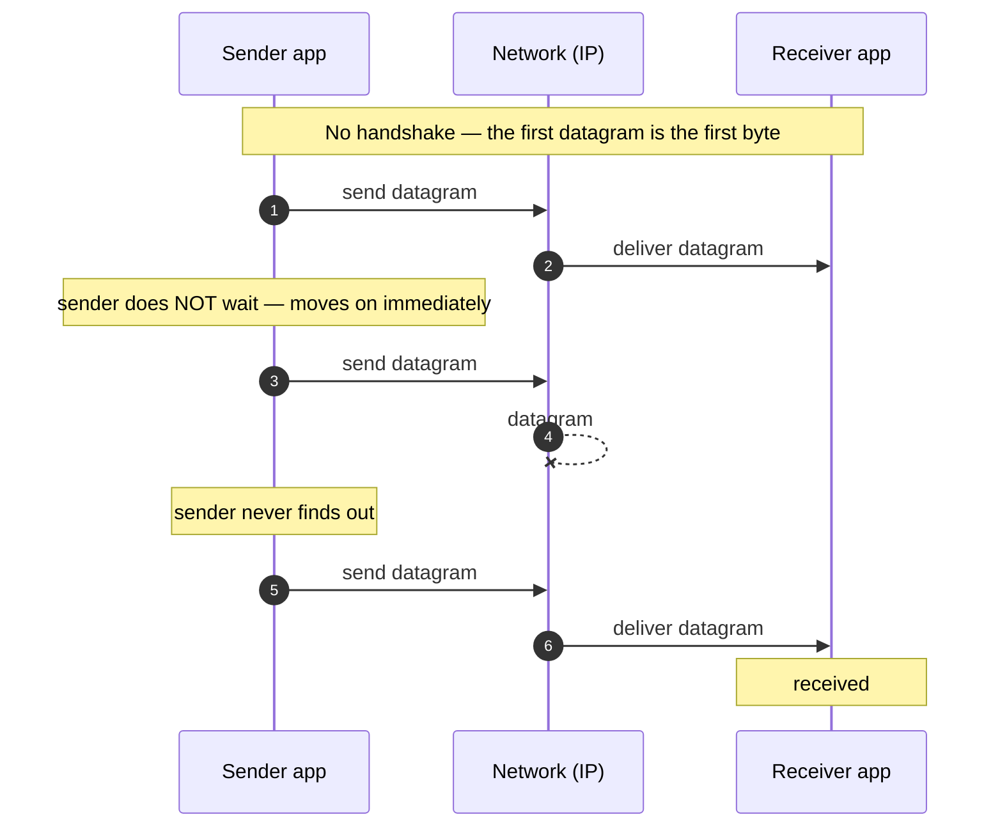

# UDP — Junior

<!-- level-focus -->
At junior level, focus on this question:

> How can I apply **UDP** in one small example and prove the result?

Use the smallest realistic scenario that exposes the decision and its failure behavior.
## 1. The one-sentence model

**UDP sends independent packets — called *datagrams* — from one host/port to another, with no setup and no promises: each packet is on its own.**

That single sentence has a lot packed into it, so pull it apart:

- **Independent.** Every datagram is a self-contained shipment. UDP does not know that the packet you sent a millisecond ago is "related" to this one. There is no stream, no session, no connection state — just discrete messages, each standing alone.
- **No setup.** TCP starts every conversation with a three-way handshake (SYN / SYN-ACK / ACK) before any data moves. UDP skips this entirely. Your very first datagram *is* the first byte of communication. There's nothing to open and nothing to close.
- **No promises.** UDP will *try* to deliver, but it makes no guarantee that the datagram arrives, arrives once, arrives intact, or arrives in the order you sent it. It is a *best-effort* service — the same best-effort promise the underlying IP layer makes.

A useful analogy: **TCP is a phone call** — you dial, the other side picks up, you both confirm you can hear each other, and you talk in a continuous ordered stream until someone hangs up. **UDP is dropping postcards in a mailbox** — you write the address on each one and let it go. Most arrive. Some don't. Two mailed on Monday and Tuesday might arrive Wednesday and Tuesday. You never find out which postcards were lost unless the *recipient* tells you.

Hold onto "independent packets, no setup, no promises." Everything below is detail on that shape.

## 2. What a datagram is

A **datagram** is the unit UDP works in: one message, sent in one shot, delivered (or not) as a whole. This is the word that distinguishes UDP's model from TCP's.

- **TCP is a *stream*.** You write bytes; TCP decides how to chop them into packets and hands the receiver a continuous flow. Message boundaries disappear — if you send `"HELLO"` then `"WORLD"`, the receiver might `read()` back `"HELLOWOR"` then `"LD"`. The app has to re-frame the stream itself.
- **UDP is a *datagram*.** You hand UDP one chunk; it sends exactly one packet; the receiver gets that exact chunk back in one `recvfrom()` — or gets nothing at all. **Message boundaries are preserved.** Send `"HELLO"` and `"WORLD"` as two datagrams and the receiver reads `"HELLO"` and `"WORLD"` as two distinct messages. It never sees a half-message or two glued together.

This "all-or-nothing, boundaries preserved" property is one of the genuinely nice things about UDP, and it's easy to miss when people focus only on "UDP is unreliable." A datagram either shows up complete or doesn't show up — it never shows up *partial*.

One practical consequence: a datagram has a **size** you choose, and there are limits. Small datagrams (a few hundred bytes, like a DNS query or a game update) travel as a single IP packet and are the sweet spot. Very large datagrams get fragmented by IP and are more fragile — if any one fragment is lost, the whole datagram is discarded — which is why apps usually keep UDP payloads small.

## 3. Anatomy of a UDP packet

The reason UDP can do so little is that its header is tiny — just **8 bytes**, four 16-bit fields. Compare that to TCP's 20-byte minimum header full of sequence numbers, acknowledgement numbers, window sizes, and flags. UDP's header is deliberately almost empty:

```
 0      15 16     31   ← bit positions
+--------+--------+
| Source | Dest.  |    ← the two ports (who sent it / who it's for)
| Port   | Port   |
+--------+--------+
| Length | Check- |    ← total length (header + data); optional checksum
|        | sum    |
+--------+--------+
|      data ...    |   ← your payload
```

| Field | Size | What it's for |
|-------|------|---------------|
| **Source port** | 2 bytes | Which port the sender is using (so a reply can come back). May be 0 if no reply is expected. |
| **Destination port** | 2 bytes | Which application/service on the target host should receive this (e.g. `53` for DNS). |
| **Length** | 2 bytes | Total bytes in header + data. |
| **Checksum** | 2 bytes | A basic integrity check over the header and data. Optional in IPv4, mandatory in IPv6. Catches corruption — but only *drops* a bad datagram, it does not repair or resend it. |

Notice what is **not** here: no sequence number (so no ordering), no acknowledgement number (so no delivery tracking), no window (so no flow control), no connection ID. The header carries only *addressing* (the two ports) plus *length* and an *integrity check*. That minimalism is the whole point — the fields TCP uses to guarantee reliability simply don't exist in UDP, which is why UDP can't guarantee it.

The authoritative definition of all of this is short enough to read in one sitting: [RFC 768 — User Datagram Protocol](https://www.rfc-editor.org/rfc/rfc768).

## 4. Fire-and-forget: the send/receive flow

The defining behavior of UDP is **fire-and-forget**: the sender transmits a datagram and immediately moves on. It does *not* wait for confirmation, it does *not* keep a copy to resend, and it never learns whether the datagram arrived. Here is the full lifecycle of two datagrams — one that makes it, one that's lost — with no handshake and no acknowledgement anywhere:



Read the key moments:

- **Step 1–2:** No `SYN`/`SYN-ACK` precedes the data. The sender just emits datagram #1 and the network delivers it.
- **Step 3:** Critically, the sender does *not* pause to wait for an ACK. It fires the next datagram right away. This is why UDP has near-zero latency overhead — there is no round trip spent confirming anything.
- **Step 4–6:** Datagram #2 is dropped somewhere in the network. **Nobody tells the sender.** There is no retransmission and no error signal. From the sender's point of view, sending #2 looked identical to sending #1.
- **Step 7–8:** Life goes on. Datagram #3 arrives fine. The receiver now holds #1 and #3, with a silent gap where #2 should be — and it's up to the *application* to decide whether that gap matters.

That silent gap is the essence of UDP. It's not a bug; it's the contract.

## 5. The four things UDP does *not* guarantee

Every "UDP is unreliable" statement really means these four specific things. Know them precisely — this is exactly what a junior is expected to explain:

| # | UDP does NOT guarantee | What that means in practice |
|---|------------------------|-----------------------------|
| 1 | **Delivery** | A datagram may be dropped (congestion, a full buffer, a bad link) and never arrive. The sender is not notified. |
| 2 | **Ordering** | Datagram #3 can arrive before #2 (they may take different paths). There are no sequence numbers, so UDP can't reorder them. |
| 3 | **No duplication** | A datagram can be delivered more than once (e.g. a lower-layer retransmit). The receiver may see the same message twice. |
| 4 | **Congestion / flow control** | UDP won't slow down if the network or receiver is overwhelmed. It sends as fast as the app asks. Sending too fast just causes *more* loss. |

There is a fifth "half-guarantee" worth noting: **integrity** *is* partially covered. The checksum lets the receiver detect a corrupted datagram — but its only response is to silently discard it. So corruption is *detected*, not *repaired*, which collapses back into case #1 (delivery): a corrupted datagram is simply a lost datagram.

## 6. What UDP *does* give you

It's easy to define UDP purely by absence. But it does provide a real, deliberately minimal service — and these positives are *why* you'd pick it:

| UDP guarantee | Detail |
|---------------|--------|
| **Best-effort delivery** | It will genuinely try — if the network is healthy, the datagram almost always arrives. |
| **Message boundaries** | One `send` = one `recv`. The receiver gets exactly the chunk you sent, whole, never merged or split (see §2). |
| **Corruption detection** | The checksum flags bit-errors and drops the bad datagram (it won't hand you garbage). |
| **Addressing** | Source and destination *ports* let many apps on one host share the same IP — DNS on 53, your game on 27015, all distinct. |
| **Low overhead** | 8-byte header, no handshake, no per-connection state on the receiver — so one server can field datagrams from huge numbers of clients cheaply. |
| **Multicast / broadcast** | UDP can send one datagram to *many* recipients at once — impossible with TCP's point-to-point stream. Useful for service discovery and streaming to many clients. |

The trade is stark and worth internalizing: **UDP gives up reliability to buy speed, simplicity, and scale.** When you don't need the guarantees — or you can rebuild just the ones you need, cheaper — UDP wins.

## 7. Worked example: a DNS query

DNS — turning `example.com` into an IP address — is the textbook UDP use case, and it shows *why* the fire-and-forget model fits so well.

1. Your machine needs the IP for `example.com`. It builds a small DNS query (a few dozen bytes) and sends it as **one UDP datagram** to the resolver's IP on **port 53**.
2. No handshake happens. There's nothing to set up — the query datagram goes straight out.
3. The resolver receives the datagram, looks up the name, and sends back **one UDP datagram** containing the answer.
4. Done. Two packets total — one question, one answer.

Now consider why UDP is the *right* choice here:

- **It's a single tiny request/response.** Opening a TCP connection would cost a three-way handshake (a full extra round trip) *before* the query could even be sent — doubling the latency for a message this small.
- **Loss is cheap to handle.** If the answer doesn't come back within a short timeout, the client simply **re-sends the query**. The app owns the retry; UDP doesn't need to. (This is §10 in action.)
- **A DNS server handles enormous request volume.** With no per-connection state to keep, one resolver can answer millions of independent datagrams without tracking a connection for each client.

So DNS gets its answer in **one round trip** instead of two, and the "unreliability" is handled by a trivial "no reply? ask again" loop. (For rare large answers, DNS can fall back to TCP — but the common small query stays on UDP.)

## 8. Worked example: a game position update

A multiplayer game constantly tells the server where each player is — many times per second. This is the opposite kind of workload from DNS, and UDP fits it for a *different* reason.

1. The client sends a datagram: `"player 7 at x=100, y=42, t=1050"`.
2. 30 milliseconds later it sends a fresher one: `"player 7 at x=104, y=45, t=1080"`.
3. And again, and again — dozens of updates per second.

Suppose the datagram from step 1 is lost. What should happen?

**Nothing.** By the time you'd notice it's missing and could re-send it, the *next* update has already arrived with a newer position. Re-transmitting the lost one would deliver **stale data** — telling the game where the player *was* 30ms ago, which is worse than useless. This is the deep insight:

> For real-time data, **the latest datagram matters more than every datagram**. A retransmission of old state arrives too late to help and just wastes bandwidth. UDP's "let it go, send the next one" model is exactly the right behavior — and TCP's insistence on redelivering that lost packet *in order* would actually stall every newer update behind it (head-of-line blocking).

The same logic drives voice and video calls: if one 20ms audio frame is lost, you want to play the *next* frame on time, not pause the call to recover a fragment of sound the listener has already moved past. Real-time media, games, and live telemetry all pick UDP for this reason — freshness beats completeness.

## 9. When apps choose UDP

Putting it together, here's the decision at a glance — the situations that push you toward UDP versus back toward TCP:

| Choose UDP when… | Choose TCP when… |
|------------------|------------------|
| Latency matters more than completeness (voice, video, games) | Every byte must arrive, in order (files, web pages, payments) |
| Data becomes stale fast — old is worse than missing | Data stays valuable — a late byte is still needed |
| The exchange is one small request/response (DNS) | The exchange is a long stream of bytes |
| You need multicast/broadcast to many receivers | You have a single point-to-point conversation |
| You'll build your *own* reliability, tuned to your needs (QUIC) | You want the OS to handle reliability for you |
| Huge numbers of clients, minimal per-client state | Fewer, longer-lived, stateful connections |

Concrete landmark users of UDP: **DNS** (small query/response), **real-time media** — VoIP, video conferencing, live streaming (freshness over completeness), **online games** (fast position/state updates), **network services** like DHCP and NTP (time sync), and — importantly — **QUIC**, the transport underneath HTTP/3. QUIC runs *on top of* UDP and rebuilds reliability, ordering, and encryption *in the application*, precisely so it isn't locked into TCP's fixed behavior. That last one is the modern headline: UDP is increasingly the *foundation* that smarter, custom transports are built on.

## 10. If loss matters, the *app* handles it

A common beginner worry: "If UDP can lose data, how does anything important ever use it?" The answer is that UDP gives you a blank slate, and the **application builds back exactly the guarantees it needs — and nothing more.**

If your UDP app cares about a lost datagram, it adds its own machinery on top:

- **Timeout + retry** — send, wait a bit; if no response, send again. (This is all DNS does.)
- **Sequence numbers** — put your own counter in the payload so the receiver can detect gaps (`...5, 6, 8...` → "7 is missing") and reorder out-of-order arrivals.
- **Acknowledgements** — have the receiver confirm what it got, so the sender knows what to resend.
- **Duplicate suppression** — track which sequence numbers you've already processed and ignore repeats.

If you add *all* of those, you've essentially rebuilt TCP — and at that point you should probably just use TCP. The reason to stay on UDP is that you can add **only the pieces you need** and skip the rest. A game might add duplicate-detection and sequence numbers (to ignore stale updates) but deliberately *skip* retransmission (because resending old positions is pointless). That selective, à-la-carte reliability — impossible with TCP's fixed all-or-nothing guarantees — is exactly what QUIC does at large scale, and it's the reason UDP remains foundational rather than obsolete.

## 11. Common misconceptions

- **"UDP is unreliable, so it's rarely used."** False. UDP is enormous — DNS, video calls, games, DHCP, NTP, and all of HTTP/3 (via QUIC) ride on it. "Best-effort" is a *feature* for the right workload, not a flaw.
- **"UDP means data always gets lost."** No. On a healthy network, UDP datagrams almost always arrive. UDP just doesn't *promise* it or *recover* when it doesn't.
- **"UDP is faster than TCP for everything."** No. UDP avoids handshake and ordering overhead, so it has lower latency for small/real-time messages. But for bulk transfer, a well-tuned TCP with proper congestion control can be faster and far safer than a naive UDP loop that floods the network and causes loss.
- **"There's no way to know a UDP datagram was lost."** Not at the UDP layer — but the *application* can absolutely know, by adding sequence numbers or acknowledgements (see §10). UDP just doesn't do it *for* you.
- **"UDP has no connection, so you can't have a 'session'."** UDP itself is connectionless, but apps build session concepts on top (QUIC connection IDs, a game's player session). The *transport* is stateless; the *application* need not be.

---

## Apply it

1. Choose one small, known input for **UDP**.
2. Predict the output or observable behavior.
3. Run the smallest example or probe that exercises the concept.
4. Change one input to trigger a failure or boundary case.
5. Explain the evidence using the guide's vocabulary.

## Verify your work

- Record the exact input, command or code path, and output.
- Repeat the probe and confirm the result is consistent.
- Show one expected success and one expected failure.
- Resolve any difference between the prediction and the evidence.

## Review questions

- What problem does UDP solve in the example?
- Which input changes the observed result, and why?
- What is the smallest useful success check?
- Which beginner mistake would your evidence catch?
