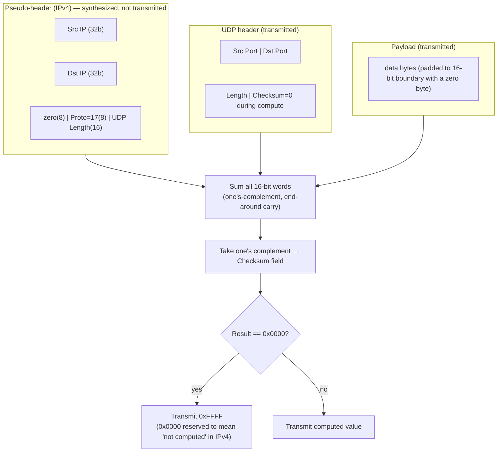
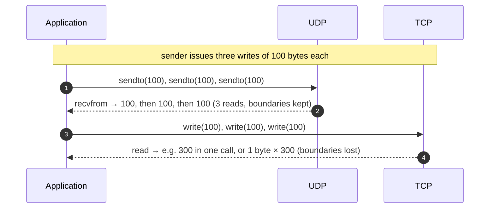
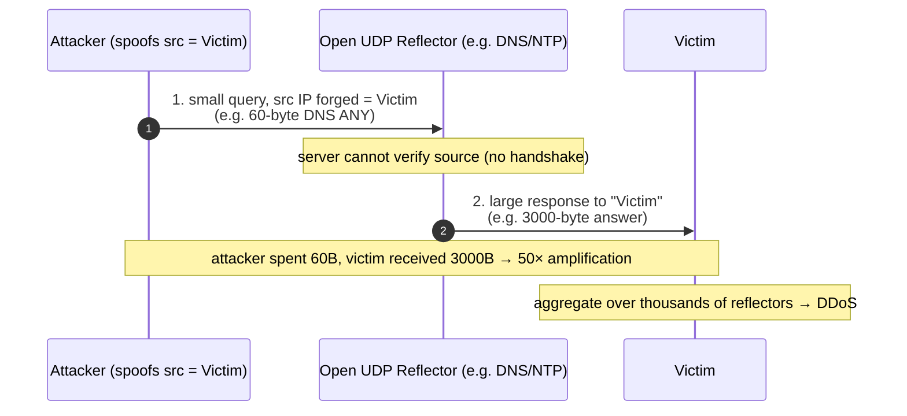
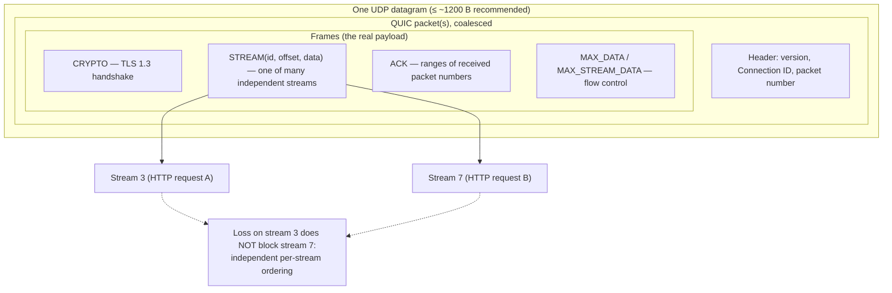

# UDP — Professional

<!-- level-focus -->
At professional level, focus on this question:

> How should teams adopt and operate **UDP** with measurable outcomes and limited coordination?

Use the smallest realistic scenario that exposes the decision and its failure behavior.
## 1. The 8-byte header, bit by bit

A UDP datagram is a header of exactly four 16-bit fields followed by an opaque payload. There are no options, no flags, no variable-length regions — the header size is a compile-time constant. This fixed 8-byte cost is the entire per-message overhead UDP imposes, versus TCP's 20-byte minimum (40+ with common options).

```
 0                   1                   2                   3
 0 1 2 3 4 5 6 7 8 9 0 1 2 3 4 5 6 7 8 9 0 1 2 3 4 5 6 7 8 9 0 1
+-+-+-+-+-+-+-+-+-+-+-+-+-+-+-+-+-+-+-+-+-+-+-+-+-+-+-+-+-+-+-+-+
|          Source Port          |       Destination Port        |
+-+-+-+-+-+-+-+-+-+-+-+-+-+-+-+-+-+-+-+-+-+-+-+-+-+-+-+-+-+-+-+-+
|            Length             |           Checksum            |
+-+-+-+-+-+-+-+-+-+-+-+-+-+-+-+-+-+-+-+-+-+-+-+-+-+-+-+-+-+-+-+-+
|                                                               |
:                            Payload                            :
|                                                               |
+-+-+-+-+-+-+-+-+-+-+-+-+-+-+-+-+-+-+-+-+-+-+-+-+-+-+-+-+-+-+-+-+
```

Each field, precisely:

| Field | Bits | Semantics |
|-------|------|-----------|
| **Source Port** | 16 | Sender's port. **Optional in IPv4** — a value of 0 means "no reply expected / no source port," and the checksum must then be computed as if it were present. Ephemeral senders usually fill it so replies can be demultiplexed. |
| **Destination Port** | 16 | Receiver's port; the kernel uses `(dst_ip, dst_port)` (and for connected sockets the 4-tuple) to demultiplex to a socket. |
| **Length** | 16 | Length **in bytes of header + payload**. Minimum legal value is 8 (header only, empty payload). The 16-bit field caps a single UDP datagram's declared length at 65,535 bytes, so the maximum payload is 65,535 − 8 = **65,527 bytes**. |
| **Checksum** | 16 | One's-complement checksum over the pseudo-header, the UDP header, and the payload (see §2). |

Two subtleties matter at this level. First, the **Length field is redundant with the IP layer**: the IP total-length field already implies the UDP length (IP payload length minus IP header length). This redundancy is a consistency check, not new information — a receiver can and should reject a datagram whose UDP Length disagrees with what IP delivered. Second, because the checksum's algorithm is *end-around-carry one's-complement addition of 16-bit words*, the byte ordering and word boundaries are load-bearing: an implementation that sums bytes rather than 16-bit words computes a different, wrong value.

---

## 2. The checksum and the pseudo-header

The UDP checksum does not cover only the UDP header and payload. It covers a **pseudo-header** synthesized from IP-layer fields. The purpose is *misdelivery detection*: a datagram whose IP destination was corrupted in flight but whose UDP header survived should still fail the check, because the pseudo-header binds the transport checksum to the addresses the datagram was actually addressed to.

For IPv4 (RFC 768) the pseudo-header is:

```
+--------+--------+--------+--------+
|          Source IP Address        |   (32 bits)
+--------+--------+--------+--------+
|        Destination IP Address     |   (32 bits)
+--------+--------+--------+--------+
|  zero  |Protocol|   UDP Length    |   (8 + 8 + 16 bits, Protocol = 17)
+--------+--------+--------+--------+
```

The coverage of the one's-complement sum is staged as follows:



The computation, precisely:

1. Set the Checksum field to zero.
2. Prepend the pseudo-header; if the payload has an odd byte count, pad with one zero byte (padding is for the sum only, not transmitted).
3. Sum every 16-bit word using one's-complement arithmetic (any carry out of bit 15 is added back into bit 0 — "end-around carry").
4. Take the one's complement of the sum. That is the checksum.

**IPv4 vs IPv6 — optional vs mandatory.** In IPv4 the UDP checksum is **optional**: a sender may transmit `0x0000` to signal "checksum not computed," and receivers accept such datagrams unverified. If the real computed checksum happens to be zero, it is transmitted as the equivalent `0xFFFF` so that `0x0000` remains unambiguously "no checksum." In **IPv6 the checksum is mandatory** (RFC 8200): IPv6 removed the IP-layer header checksum entirely, so the transport checksum is the *only* end-to-end integrity check on the addressing, and a received UDP datagram with a zero checksum must be discarded (with the narrow exception of UDP-Lite / specific tunneling profiles in RFC 6935/6936). The IPv6 pseudo-header uses the 128-bit source and destination addresses and a 32-bit upper-layer length, but the summation algorithm is identical.

Worked micro-example of end-around carry: summing the two 16-bit words `0xF000` and `0x2000` gives `0x11000`; the carry `0x1` out of bit 15 is added back → `0x1001`. One's complement → `0xEFFE`. This wrap-around is why the checksum has the useful property that byte-swapping the whole message does not change it, and why partial checksums can be incrementally updated (RFC 1624) when a NAT rewrites a port or address.

---

## 3. Datagram boundaries: message-oriented vs byte-stream

The single most consequential semantic difference between UDP and TCP is not reliability — it is **framing**. UDP is *message-oriented*: one `sendto()` produces exactly one datagram, and one `recvfrom()` returns exactly one datagram. Boundaries are preserved end to end. TCP is a *byte-stream*: the sequence of bytes is delivered intact, but the segmentation is invisible and non-preserving — three `write()` calls of 100 bytes may arrive as one `read()` of 300, or as 300 `read()`s of one byte.



Formally: UDP is a **partial function from send events to receive events that is order- and boundary-preserving per-datagram but lossy** — a datagram either arrives whole or not at all (IP fragmentation reassembly is all-or-nothing; a single lost fragment discards the entire datagram). TCP is a **total, order-preserving function over a byte sequence with no intrinsic message boundaries**.

The design consequence: any UDP application that needs multi-message structure gets framing *for free* and never has to implement a length-prefix or delimiter to re-split a stream. But it must handle the dual problem — a datagram larger than the path can carry is either fragmented (fragile, see §4) or dropped. This is why protocols like DNS historically capped messages at 512 bytes and why QUIC treats each UDP datagram as a self-describing container of one or more QUIC packets, never assuming boundaries survive coalescing.

---

## 4. Path MTU and fragmentation math

The **Maximum Transmission Unit (MTU)** is the largest IP packet a link will carry. Ethernet's classic MTU is **1500 bytes**. The **path MTU (PMTU)** is the minimum MTU across every link on the route. If an IP packet exceeds a link's MTU, one of two things happens: IPv4 routers *may* fragment it (unless the Don't-Fragment bit is set), while IPv6 routers *never* fragment in transit — they drop it and return an ICMPv6 "Packet Too Big."

The arithmetic that dictates safe UDP payload size, worked for the common case:

```
Ethernet MTU ................................. 1500 bytes
  − IPv4 header (no options) ..................  20 bytes
  − UDP header ................................   8 bytes
  = max UDP payload over plain IPv4 Ethernet .. 1472 bytes

Ethernet MTU ................................. 1500 bytes
  − IPv6 header (fixed) ........................ 40 bytes
  − UDP header ................................   8 bytes
  = max UDP payload over plain IPv6 Ethernet .. 1452 bytes
```

But the path is rarely plain Ethernet end to end. Tunnels stack their own headers, each shrinking the usable payload:

```
Start from 1500 MTU, IPv4:
  − IPv4 outer + GRE (24) .....................  effective MTU 1476
  − IPGRE + IPsec/ESP transport (~50–73) ......  effective MTU ~1400
  − PPPoE (8) on top of that ..................  effective MTU 1492 → 1392 with the above
```

This is why QUIC and other modern UDP protocols conservatively target payloads **≤ ~1200 bytes**. RFC 9000 sets QUIC's minimum required datagram size and its default `max_udp_payload_size` so that a QUIC packet plus IP/UDP headers stays under **1280 bytes** — which is not arbitrary: **1280 is the mandatory minimum MTU that every IPv6 link must support** (RFC 8200). Concretely:

```
IPv6 minimum link MTU ........................ 1280 bytes
  − IPv6 header ................................ 40 bytes
  − UDP header .................................  8 bytes
  = guaranteed-deliverable UDP payload ........ 1232 bytes
```

Rounding down to a round ~1200 leaves headroom for occasional extra encapsulation (a tunnel, a VXLAN header) without triggering fragmentation or PMTU black-holing. The 1200-byte convention buys a strong guarantee: **a datagram of this size traverses any conforming Internet path without fragmentation.**

Why avoid fragmentation so aggressively? Two failure modes. First, **fragment loss amplifies loss**: if a 4000-byte datagram fragments into three IP fragments and any one is dropped, the *entire* datagram is lost, so a per-fragment loss probability *p* yields an effective datagram-loss probability of `1 − (1 − p)³` — for p = 2%, that is 5.9%, nearly tripling the loss rate. Second, **PMTU black holes**: when a router drops an oversized DF-set packet but the ICMP "too big" message is filtered by a misconfigured firewall, the sender never learns and the connection silently stalls. RFC 8085 therefore instructs UDP applications either to keep payloads small enough to never fragment or to implement Packetization Layer PMTU Discovery (PLPMTUD, RFC 4821) — which is exactly what QUIC's DPLPMTUD (RFC 8899) machinery does: it probes upward from 1200 by sending progressively larger padded packets and only raises its send size when a probe is acknowledged.

---

## 5. Amplification factor theory

Because UDP is connectionless and stateless, a server cannot verify that the source address on an incoming datagram is genuine before responding. An attacker can therefore forge the source address to be the **victim's** address; the server's reply is sent to the victim. This is *reflection*. When the reply is larger than the request, it is also *amplification*, and the ratio is what makes it dangerous.

Define the **amplification factor**:

```
                 bytes in server's response
Amplification =  ---------------------------
                 bytes in attacker's request
```

The attacker spends *B* bytes of their own uplink; the victim receives `B × Amplification` bytes. With a factor of 50 and a 1 Gbps attacker uplink, the victim absorbs 50 Gbps. The number of exploitable open reflectors multiplies this further.



Amplification factors are protocol-specific; the worst offenders pair a tiny request with a huge response:

| Protocol | Port | Trigger request | Typical amplification factor |
|----------|------|-----------------|------------------------------|
| DNS (ANY / large zone) | 53 | small query | ~28–54× |
| NTP (`monlist`) | 123 | 8-byte command | up to ~556× |
| SSDP | 1900 | M-SEARCH | ~30× |
| SNMP (GetBulk) | 161 | small get | ~6–8× (higher with bulk) |
| Memcached (unauth UDP) | 11211 | tiny `stats`/`get` | up to ~10,000–51,000× |
| CLDAP | 389 | small query | ~46–70× |
| QUIC (compliant) | 443 | initial | **≤ 3×** (bounded by spec) |

Worked example — the memcached case, why it is catastrophic: a **15-byte** request (`get` of a key that returns a large stored value) can elicit a response on the order of **hundreds of kilobytes to a megabyte**. Taking a 1 MB response against a 15-byte request:

```
Amplification = 1,000,000 / 15 ≈ 66,000×
```

An attacker with a modest **1 Mbps** of spoofing uplink can, in principle, direct `1 Mbps × 66,000 ≈ 66 Gbps` at a victim — which is precisely how the 1.35 Tbps GitHub attack of 2018 was assembled from open memcached servers.

The two structural defenses fall directly out of the theory. First, **response ≤ request** eliminates amplification entirely — this is why RFC 9000 mandates that a QUIC server, before it has validated the client's address, must not send more than **three times** the bytes it has received (the *3× anti-amplification limit*). A client's Initial packet is padded to at least 1200 bytes precisely so the server has enough validated budget to complete the handshake without exceeding 3×. Second, **source-address validation at the network edge** (BCP 38 / RFC 2827 ingress filtering) prevents spoofing at the source, removing reflection's precondition. Operationally: never expose stateless UDP services (memcached, NTP `monlist`, open recursive DNS) to the public Internet, and require a return-routability check (a token echoed by the client) before sending a large response.

---

## 6. How QUIC layers a transport over UDP

QUIC (RFC 9000) rebuilds everything TCP provides — connection establishment, reliable ordered delivery, flow control, congestion control, loss recovery — *inside* UDP datagrams, in user space, with TLS 1.3 encryption fused in. The motivation is to escape TCP's ossification (middleboxes that mangle unknown TCP options) and its head-of-line blocking, while keeping the deployability of "it's just UDP to the network."



The layering maps concept-for-concept onto what UDP omits:

- **Connection.** UDP has no connection; QUIC introduces a **Connection ID** carried in the packet header. Because the identity is the Connection ID, not the 4-tuple, a QUIC connection *survives* a change of client IP/port — this is **connection migration** (a phone switching Wi-Fi → cellular keeps the same QUIC connection, impossible with TCP whose connection *is* the 4-tuple).

- **Reliability & loss recovery.** UDP never retransmits. QUIC assigns each packet a **monotonically increasing packet number** (never reused, unlike TCP sequence numbers), acknowledges ranges via ACK frames, and retransmits lost *frames* in new packets. Decoupling "packet number" from "stream data offset" removes the retransmission ambiguity that plagues TCP.

- **Streams & head-of-line blocking.** UDP's message boundaries let QUIC pack multiple independent **streams** into one connection. A lost packet only stalls the stream(s) whose bytes it carried; other streams proceed. This is the concrete cure for HTTP/1.1 and HTTP/2-over-TCP head-of-line blocking.

- **Flow & congestion control.** UDP has neither. QUIC carries `MAX_DATA` / `MAX_STREAM_DATA` frames for flow control and runs a TCP-family congestion controller (the RFC 9002 recommendation is a CUBIC/Reno-equivalent) entirely in user space, so it can be upgraded without kernel changes.

- **Amplification & framing constraints.** As §4 and §5 established, QUIC caps its datagrams near 1200 bytes to avoid fragmentation and enforces the 3× anti-amplification limit before address validation. Both are direct consequences of building on a stateless, connectionless datagram service.

The net picture: UDP contributes exactly *port multiplexing and message framing*, and QUIC supplies every guarantee above that. This is why RFC 8085 explicitly blesses "protocols that implement their own congestion control over UDP" — QUIC is the canonical, spec-compliant instance of doing everything UDP leaves undone.

---

## 7. UDP vs TCP: the formal ledger

The choice between UDP and TCP is a choice of *which guarantees are bought from the transport and which are built by the application*. UDP hands the application a blank check and a bill for correctness.

| Property | UDP (RFC 768) | TCP (RFC 9293) |
|----------|---------------|----------------|
| Header size (minimum) | **8 bytes** | 20 bytes (40+ with options) |
| Connection state | Connectionless | Connection (4-tuple = identity) |
| Delivery guarantee | Best-effort, may drop | Reliable (retransmit) |
| Ordering | None | In-order byte stream |
| Framing | **Message-oriented (boundaries preserved)** | Byte-stream (boundaries lost) |
| Flow control | None | Sliding window |
| Congestion control | None (app must add — RFC 8085) | Built in (Reno/CUBIC/BBR) |
| Checksum | Optional (IPv4) / **mandatory (IPv6)** | Mandatory |
| Max single-datagram payload | 65,527 B (Length field); ~1200 B safe | Bounded by MSS, segmented transparently |
| Amplification risk | **High** if server response > request | Low (handshake proves source) |
| Head-of-line blocking | None (independent datagrams) | Yes (single ordered stream) |
| Typical uses | DNS, QUIC/HTTP-3, RTP/media, gaming, VPN | HTTP/1-2, databases, anything needing a stream |

The through-line of this chapter: UDP's minimalism is not a deficiency to be worked around but a *substrate to be built upon*. Its eight bytes give you multiplexing and framing; its checksum (pseudo-header and all) gives you end-to-end corruption detection; and its statelessness — the same property that makes it a reflection hazard — is what lets QUIC migrate connections and iterate its transport logic in user space faster than TCP ever could in the kernel. Master the header, the MTU arithmetic, and the amplification algebra, and every higher UDP protocol becomes legible as a specific set of choices about what to rebuild on top.


---

## Apply it

1. Define the user or business outcome that **UDP** should improve.
2. Assign one owner for code, contracts, operations, and incidents.
3. Split delivery into reversible increments that produce evidence early.
4. Publish responsibilities, escalation paths, and compatibility windows.
5. Stop or expand only when the agreed measures support that decision.

## Verify your work

- Each increment has an owner, rollback path, and observable exit condition.
- Adoption, reliability, delivery time, and coordination cost are measured.
- Incident and migration exercises prove that responsibility is executable.
- The old path is removed only after telemetry proves it is unused.

## Review questions

- Which measurable outcome justifies investing in UDP?
- Which team owns the full lifecycle and incident response?
- What reversible increment produces the earliest useful evidence?
- Which exit condition proves that migration or adoption is complete?
