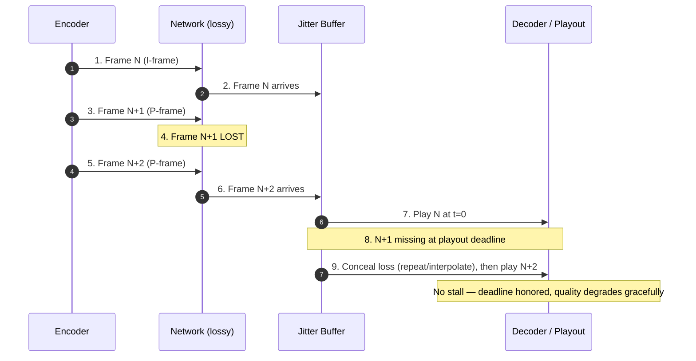
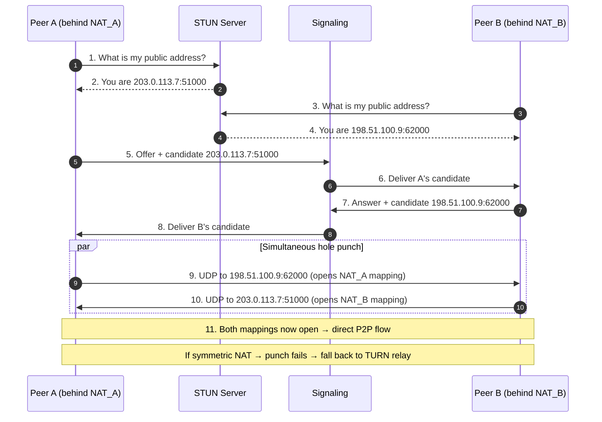

# UDP — Senior

<!-- level-focus -->
At senior level, focus on this question:

> Which system invariant is affected by **UDP** under failure, load, and change?

Use the smallest realistic scenario that exposes the decision and its failure behavior.
## 1. The Senior Question: Why Datagrams At All?

TCP hands you a reliable, ordered, congestion-controlled byte stream. That is almost everything most
services need, which is why "just use TCP" is the correct default and the answer a senior engineer
should be able to *defend against*, not merely repeat. Choosing UDP means voluntarily giving up
those guarantees, and the only justification is that **at least one of TCP's guarantees is actively
harmful to your workload**, and you are prepared to reimplement the ones you still need.

The guarantees TCP couples together are separable, and UDP lets you unbundle them:

| TCP guarantee | What it costs you | When it hurts |
|---|---|---|
| In-order delivery | Head-of-line blocking: one lost segment stalls *all* later data until retransmit | Multiplexed streams; independent media frames |
| Reliable delivery (retransmit) | Retransmitted data arrives late | Real-time media where late data is worthless |
| Connection/handshake | 1 RTT (3 with TLS 1.2) before first byte | Short one-shot exchanges (DNS query) |
| Kernel-owned state machine | You cannot change congestion control or add features without an OS/kernel upgrade | Rapidly evolving transports (HTTP/3) |

The senior framing: **UDP is not "TCP without reliability." It is a raw datagram substrate on which
you build exactly the transport your workload needs.** The two legitimate motivations are (a) *late
data is useless, so I want to drop it, not wait for it*, and (b) *I want to own the transport logic
in userspace so I can evolve it faster than the kernel ships*. Everything else — DNS, NTP, small
one-shot queries — is a narrower case where the datagram model simply fits the message shape and the
one-RTT-cheaper handshake is a bonus, not the point.

If you cannot articulate which specific guarantee is harmful, you have not justified UDP, and you
are about to reimplement TCP badly.

---

## 2. When Late Data Is Useless: Real-Time Media

The canonical justification for UDP is **interactive real-time media** — voice, video conferencing,
live game state, cloud gaming input. The defining property is that data has a **deadline**: a video
frame or audio packet that arrives after its playout instant is not "late but useful," it is
*garbage*. Playing it would push everything after it later, so the correct action is to **drop it and
move on**. TCP does the opposite: it stalls the whole stream to retransmit the lost segment, so by
the time the retransmit lands, that packet *and everything queued behind it* is already past its
deadline. TCP's reliability actively makes latency-sensitive media worse — this is head-of-line
blocking manifesting as visible stutter.



A senior design here does not "reimplement reliability." It reimplements **selective, deadline-aware
recovery**, which is a fundamentally different thing:

- **Loss concealment.** The application hides the missing packet — repeat the last audio frame,
  interpolate, or let the video codec show a slightly stale region until the next I-frame.
- **Forward error correction (FEC).** Send redundant parity packets so *some* loss is recoverable
  *without a round trip*. FEC trades bandwidth for latency — the opposite trade from retransmission.
- **Selective retransmission with a deadline.** Retransmit *only* if the packet can still arrive
  before its playout time (e.g., WebRTC NACK for a packet whose deadline is far enough out). Past
  the deadline, do not bother.
- **Adaptive bitrate / congestion response.** Because you dropped TCP's congestion control (§4), you
  must add your own — reduce encoding bitrate when loss/RTT signals congestion.

This is exactly what **RTP over UDP** (RFC 3550) plus RTCP feedback gives you, and what WebRTC layers
on top. The lesson: UDP is chosen not to *avoid* handling loss but to **move loss handling into the
application, where it can make the deadline-aware decision the kernel cannot**.

> 🎞️ **See it animated:** [How NAT traversal / WebRTC works (WebRTC.org)](https://webrtc.org/getting-started/peer-connections)

---

## 3. Reimplementing Reliability in Userspace: QUIC

The second legitimate motivation — *own the transport in userspace* — is embodied by **QUIC**
(RFC 9000). QUIC runs over UDP and rebuilds reliability, ordered streams, flow control, and
congestion control **in userspace**, then adds capabilities TCP structurally cannot. Understanding
*why a reliable transport chose UDP as its substrate* is the sharpest test of the senior model.

QUIC does not use UDP because it dislikes reliability. It uses UDP because UDP is the only widely
deployable substrate that gives userspace raw packets while remaining routable through the internet's
NATs and firewalls. On that substrate QUIC solves problems TCP cannot:

| Problem with TCP | How QUIC (over UDP) fixes it |
|---|---|
| **Head-of-line blocking across streams** — one lost segment stalls unrelated HTTP/2 streams multiplexed on one connection | Independent streams; loss on stream A does not block stream B (loss still blocks *within* a stream) |
| **Ossification** — middleboxes inspect/rewrite TCP headers, so new features cannot deploy | QUIC encrypts almost the entire transport header; middleboxes see only opaque UDP payload |
| **Slow evolution** — congestion control lives in the kernel; a new algorithm needs OS upgrades on billions of devices | Transport logic ships in the *application* (browser, library); update by updating the app |
| **Connection death on IP change** — TCP connection = 4-tuple; changing network breaks it | Connection ID survives IP/port changes → seamless Wi-Fi↔cellular handoff |
| **Handshake latency** — TCP+TLS 1.2 = 2–3 RTT to first byte | Combined transport+crypto handshake = 1 RTT; 0-RTT for resumed connections |

The senior takeaways:

1. **"Reliable" and "over UDP" are not contradictory.** QUIC proves that UDP is a *transport
   substrate*, not a synonym for "unreliable." When you build reliability on UDP you are joining a
   respectable tradition — but you are also accepting that you now own retransmission, flow control,
   and congestion control correctness.
2. **The kernel-bypass argument is real and strategic.** The reason a company invests in a
   userspace transport is *velocity*: they can deploy congestion-control experiments and security
   fixes at application-release cadence instead of waiting years for OS adoption. That is an
   organizational advantage, not merely a technical one (see §8 staff-tier for the cost side).
3. **You almost never write your own QUIC.** The correct senior decision, 99% of the time, is to
   *adopt* an existing QUIC/HTTP/3 or WebRTC/RTP stack, not to hand-roll a reliability layer. Rolling
   your own is justified only when no library fits an extreme constraint — and then you budget for
   years of subtle correctness work.

---

## 4. The Danger of UDP Without Congestion Control

TCP's congestion control is not a feature *for you* — it is a feature *for the internet*. Every TCP
sender continuously probes for available bandwidth and **backs off when it detects loss or delay**,
which is what prevents shared links from collapsing. When you send raw UDP, you get none of this.
A naive UDP sender blasts packets at a fixed or application-driven rate regardless of network
conditions. At small scale this is invisible; at scale it is catastrophic.

Two distinct hazards, both of which a senior owner must design against:

- **Congestion collapse.** If many uncontrolled senders overload a bottleneck link, queues fill,
  loss climbs, and — for any senders that *do* retransmit — retransmissions add *more* load, driving
  goodput toward zero while the link stays saturated with packets that will be dropped. This is the
  failure mode that congestion control was invented to prevent (Jacobson, 1988). A fleet of
  congestion-oblivious UDP clients can recreate it.
- **Unfairness / starvation.** An uncontrolled UDP flow sharing a link with well-behaved TCP flows
  will crowd them out: TCP backs off on loss, UDP does not, so UDP steals an ever-larger share. Your
  "high-performance" UDP service can degrade every other tenant on the network — including your own
  TCP services.

The design obligation is explicit and non-negotiable: **if you send UDP at volume, you must
implement congestion control.** Do not invent your own naively; adopt a studied algorithm:

- **GCC (Google Congestion Control)** for real-time media in WebRTC — delay-gradient based.
- **BBR / CUBIC-style** controllers inside QUIC libraries.
- **DCCP** (RFC 4340) if you want datagram semantics *with* built-in congestion control from the OS.

A useful shorthand for reviews: any proposal to "use UDP for speed" that does not name its congestion
controller is incomplete. Speed without backoff is not a feature; it is a pending outage — yours or
someone else's.

---

## 5. Amplification and Reflection: UDP as a DDoS Weapon

UDP has **no handshake**, so the source address in a datagram is unverified — the server has no proof
the sender is who it claims to be before it replies. This enables **reflection/amplification
attacks**, one of the most important security consequences of the datagram model and something you
own the moment you expose a UDP service.

The mechanism:

```mermaid
sequenceDiagram
    autonumber
    participant Att as Attacker
    participant Refl as Open UDP Server (DNS/NTP/memcached)
    participant Vic as Victim
    Att->>Refl: 1. Small query, SPOOFED src = Victim IP
    Note over Refl: 2. No handshake → source not verified
    Refl->>Vic: 3. LARGE response sent to Victim
    Note over Att,Vic: 4. Attacker spends few bytes; Victim receives many
    Note over Vic: 5. Repeat across thousands of reflectors → volumetric DDoS
```

The **amplification factor** is response size ÷ request size. It is brutal for some protocols:

| Reflector protocol | Approx. amplification factor |
|---|---|
| DNS (open resolver) | ~28–54× |
| NTP (`monlist`) | ~556× |
| memcached (UDP, pre-2018) | ~10,000–51,000× |
| SSDP / CLDAP | ~30–70× |

The 2018 memcached-based attacks reached the terabit-per-second range precisely because of the
enormous amplification factor and unverified source addresses. Senior obligations:

- **Never expose an amplifiable UDP service to the open internet unauthenticated.** memcached over
  UDP is now disabled by default for this reason; if you run DNS/NTP, ensure they are not open
  resolvers/servers.
- **Verify the peer before sending a large response.** DNS added a stateless retry cookie; QUIC uses
  a **Retry** token / address-validation handshake so a server will not send more than a small
  multiple of received bytes to an unvalidated address. RFC 9000 mandates an **anti-amplification
  limit** (a server must not send more than 3× the bytes it has received from an unvalidated
  address). If you build on UDP, replicate this discipline.
- **Assume you can also be the *reflector*.** Your service becomes a weapon against third parties
  even if you are never the target. Egress rate-limiting and response-size caps to unvalidated peers
  protect the wider internet and your reputation (and IP block from being null-routed).

---

## 6. NAT Traversal: No Connection State, No Free Path

Because UDP has no connection, a NAT/firewall has nothing durable to key on. A NAT device translates
`(internal IP:port) ↔ (public IP:port)` and, for UDP, must *infer* the mapping from outbound traffic
and *guess* how long to keep it. This makes **peer-to-peer UDP fundamentally harder than TCP-through-a-
server**, because two peers behind separate NATs cannot simply "connect" — neither has a publicly
reachable address, and neither NAT has a mapping for the other yet.

The standard solution stack (used by WebRTC via the **ICE** framework, RFC 8445):

- **STUN** (RFC 8489) — a peer sends a request to a public STUN server, which replies with the
  peer's *public* IP:port as seen from outside. Now each peer learns its own externally visible
  mapping (its "server-reflexive candidate").
- **Hole punching** — both peers, having exchanged their public mappings via a signaling channel,
  send packets *toward each other simultaneously*. The first outbound packet from peer A opens a NAT
  mapping that then *accepts* peer B's inbound packet (and vice versa), because the NAT now believes
  the flow was initiated internally. Timing and NAT behavior determine success.
- **TURN** (RFC 8656) — the fallback when hole punching fails (symmetric NATs, restrictive
  firewalls). A public **relay** server forwards all traffic between the peers. This *always* works
  but costs bandwidth and latency and re-centralizes a "peer-to-peer" system.



Senior lessons:

1. **UDP's lack of connection state pushes work up the stack.** You need STUN + a signaling channel
   just to *discover* addresses, and a TURN relay budget for the fraction of users behind
   uncooperative NATs (commonly 10–20%). "Serverless P2P" is a myth: you still run signaling, STUN,
   and TURN infrastructure.
- **NAT mappings expire.** With no connection to observe, NATs time out idle UDP mappings (often
   30–120 s). You must send **keepalive** packets to hold the mapping open, or the path silently dies
   (§7). This is a direct consequence of "no connection state."
3. **Symmetric NATs and CGNAT break naive punching.** Plan for TURN from day one; measure your
   relay-fallback rate as an SLO input, because it drives egress cost.

---

## 7. Failure Modes You Own: Silent Loss, MTU Black Holes

With TCP, the kernel surfaces most transport failures for you — a reset, a timeout, a stalled
`send()`. With UDP, **the failure is usually silent**: the datagram simply does not arrive and
nobody is notified. Owning a UDP service means owning detection, because the transport will not tell
you.

- **Silent packet loss.** `sendto()` returning success means "handed to the kernel," not "delivered."
  There is no ACK, no retransmission, no error. If you need to *know* a datagram arrived, you must
  build application-level acknowledgement and timeout logic. The common bug is treating a successful
  `sendto()` as delivery confirmation. Instrument loss with sequence numbers and receiver-side gap
  detection; you cannot manage what the transport hides.

- **Reordering and duplication.** UDP makes no ordering promise, and packets can be duplicated by the
  network. Application logic must tolerate out-of-order and duplicate datagrams — sequence numbers +
  a small reorder window, and idempotent handling of duplicates.

- **MTU black holes.** This one bites hard and is worth internalizing. IPv4 routers may fragment
  oversized datagrams, but fragmentation is fragile: if *any* fragment is lost, the whole datagram is
  lost, and many networks drop fragments outright. The modern approach is **Don't-Fragment (DF) +
  Path MTU Discovery (PMTUD)**: the sender marks packets DF, and a router that must fragment instead
  returns an ICMP "Fragmentation Needed" message telling the sender the smaller MTU. The **black
  hole** occurs when a misconfigured firewall **drops that ICMP message**. Now: packets larger than
  the path MTU are silently discarded, *and* the sender never learns why. Small datagrams (handshake)
  succeed; large ones (data) vanish. The symptom — "connection works, then hangs on large payloads" —
  is a classic, maddening incident.

The senior fixes:
- **DPLPMTUD (RFC 8899)** — *Datagram* Packetization Layer PMTUD probes the path MTU using the
  transport's own packets and does **not** depend on ICMP arriving. QUIC uses this. It is the
  robust answer to the black-hole problem.
- **Conservative floor.** When in doubt, clamp datagram payloads to a size that survives almost any
  path (QUIC assumes a minimum of ~1200 bytes of usable payload). You lose a little efficiency and
  gain reliability.

---

## 8. When NOT to Use UDP

The most valuable senior skill here is saying *no*. UDP is the wrong answer for the overwhelming
majority of application traffic, and choosing it there is a classic over-engineering trap.

- **General request/response app traffic.** Web APIs, RPC to internal services, admin operations,
  form submissions — these want reliable, ordered, congestion-controlled delivery. TCP (or QUIC via
  HTTP/3, which gives you those guarantees *without* you writing them) is correct. Building
  reliability on raw UDP for a CRUD API is reimplementing TCP, poorly, for no benefit.
- **Bulk transfer / file uploads.** Throughput-oriented, loss-sensitive, latency-tolerant — the exact
  opposite of the media profile. TCP's congestion control and reliability are precisely what you
  want. (Specialized high-BDP transfer tools exist, but they are studied exceptions, not defaults.)
- **Anything where correctness depends on every byte arriving.** Payments, database writes,
  messaging with delivery guarantees. Loss must be recovered; ordering usually matters. Use a
  reliable transport and layer idempotency (§9.8) on top.
- **When you cannot afford to own a transport.** UDP means you own congestion control, loss recovery,
  retransmission, PMTUD, NAT keepalives, and security (anti-amplification). If your team cannot fund
  that ongoing complexity, adopting TCP/QUIC libraries is the responsible choice.

The decision rule, compressed: **use UDP only when late data is useless (real-time media) or when
you are adopting a userspace transport (QUIC/WebRTC) that has already solved the hard parts.** Absent
one of those, prefer a reliable transport and spend your complexity budget elsewhere.

---

## 9. Comparison: Reliability-on-UDP Designs

When UDP *is* justified, you rarely start from bare `sendto()`. Choose the layer that matches your
deadline model rather than rebuilding TCP:

| Design | What it adds over raw UDP | Best fit | What it does NOT give you |
|---|---|---|---|
| **Raw UDP + app ACKs** | Hand-rolled sequence numbers, ACKs, retransmit | Tiny, controlled deployments; specialized needs | Congestion control, PMTUD, NAT traversal — you own all of it |
| **RTP/RTCP (RFC 3550)** | Media framing, sequence numbers, timing, RTCP feedback | Real-time audio/video with deadline-aware loss handling | Reliability (by design) — loss is concealed, not recovered |
| **WebRTC (ICE+DTLS+SRTP+RTP)** | NAT traversal, encryption, congestion control (GCC), media | Browser/native P2P real-time media and data channels | Simplicity — large stack; needs signaling+STUN+TURN |
| **QUIC / HTTP/3 (RFC 9000)** | Reliable ordered streams, flow + congestion control, 0-RTT, connection migration, header encryption | Reliable transport wanting kernel-bypass and no HoL blocking across streams | Simplicity of TCP; some middlebox/UDP-blocking edge cases |
| **DCCP (RFC 4340)** | Unreliable datagrams *with* built-in congestion control | Media-like flows wanting OS-provided backoff | Wide deployment/NAT support (poorly supported in practice) |
| **TCP (the baseline)** | Everything, for free, in the kernel | Nearly all request/response and bulk traffic | Ability to drop late data; freedom from head-of-line blocking |

The pattern to internalize: **you climb this table only as far as your deadline model forces you.**
Real-time media stops at RTP/WebRTC (drop late data). A reliable-but-fast transport stops at QUIC
(recover loss, but in userspace, without cross-stream HoL blocking). Everything else stays on TCP.

---

## 10. Senior Checklist

- [ ] The choice of UDP names the *specific* TCP guarantee that is harmful (late data, HoL blocking,
      or kernel-owned evolution) — not "it's faster."
- [ ] For media: loss is handled by concealment / FEC / deadline-aware selective retransmit, and late
      data is *dropped*, not retransmitted unconditionally.
- [ ] A named congestion-control algorithm is specified for any at-volume UDP sender (GCC, BBR/CUBIC
      in QUIC, or DCCP) — no congestion-oblivious blasting.
- [ ] Anti-amplification is enforced: the service is not an open reflector, and responses to
      unvalidated peers are capped (QUIC's 3× rule or equivalent).
- [ ] NAT traversal is designed end-to-end: STUN + signaling for discovery, TURN budgeted for the
      symmetric-NAT/CGNAT fallback, keepalives sized under NAT mapping timeouts.
- [ ] Silent-loss detection exists: sequence numbers, receiver gap detection, and loss metrics —
      `sendto()` success is never treated as delivery.
- [ ] MTU is handled with DPLPMTUD (RFC 8899) or a conservative ~1200-byte floor; the design does not
      rely on ICMP surviving.
- [ ] Reordering and duplication are tolerated (reorder window + idempotent handling).
- [ ] The "when NOT to use UDP" case was considered and documented so the team does not cargo-cult
      datagrams onto plain request/response traffic.
- [ ] Where possible, an existing stack (QUIC/HTTP/3, WebRTC/RTP) is *adopted* rather than a
      reliability layer hand-rolled from scratch.

*Next step:* [UDP — Professional](professional.md)

---

## Apply it

1. State the system invariant that **UDP** must protect.
2. Mark ownership, state, and failure propagation at each boundary.
3. Compare two designs under load, dependency failure, and future change.
4. Define recovery and compatibility behavior before implementation.
5. Test the riskiest assumption with a focused experiment.

## Verify your work

- The experiment supports the design with evidence, not preference.
- Failure injection shows the blast radius and recovery path.
- Compatibility checks cover old and new callers or data.
- Operational signals reveal invariant violations and recovery progress.

## Review questions

- Which invariant must remain true when UDP fails?
- Where should recovery responsibility live, and why?
- Which assumption deserves an experiment before implementation?
- How can the design evolve without changing every consumer at once?
