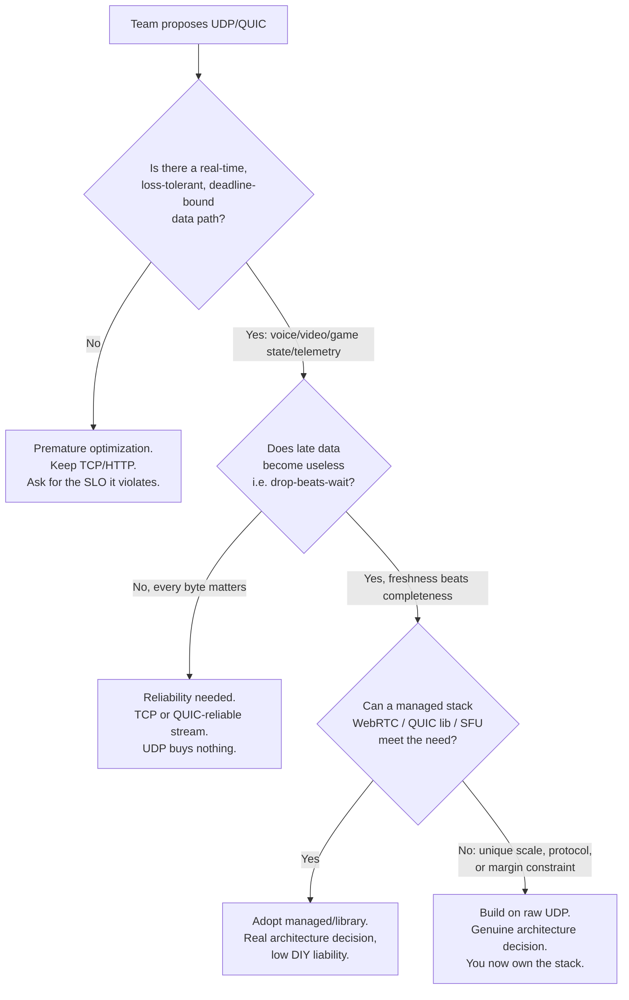
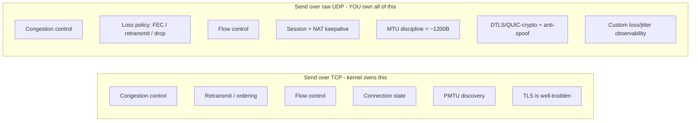
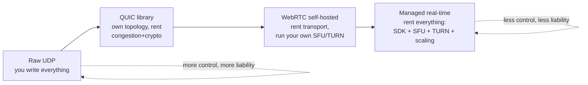

# UDP — Staff

> **Axis:** organizational scope & judgment — NOT the wire mechanics of datagrams (that is `professional.md`).
> This file answers the question a Staff/Principal engineer actually gets asked: *should this
> product speak UDP (or QUIC) at all, who pays for the transport stack you now own, and what is
> the multi-year, multi-team liability of that choice?* Choosing UDP is choosing to inherit the
> jobs TCP does for free — congestion control, loss recovery, ordering, security, connection
> lifecycle — and to defend them across firewalls, abuse teams, and on-call rotations for years.

## Table of Contents
1. [The Staff-Level Framing: UDP Is a Liability Transfer, Not a Speedup](#1-the-staff-level-framing-udp-is-a-liability-transfer-not-a-speedup)
2. [When UDP/QUIC Is an Architecture Decision vs Premature Optimization](#2-when-udpquic-is-an-architecture-decision-vs-premature-optimization)
3. [The Decision: Should This Product Speak UDP?](#3-the-decision-should-this-product-speak-udp)
4. [What You Now Own: The Operational Cost of a UDP Service](#4-what-you-now-own-the-operational-cost-of-a-udp-service)
5. [Firewall & Middlebox Reality: The Deployment Tax](#5-firewall--middlebox-reality-the-deployment-tax)
6. [Abuse & Amplification Liability: Don't Run an Open Reflector](#6-abuse--amplification-liability-dont-run-an-open-reflector)
7. [Build vs Buy for Real-Time Transport](#7-build-vs-buy-for-real-time-transport)
8. [Comparison: TCP / QUIC / WebRTC / Managed for a Real-Time Need](#8-comparison-tcp--quic--webrtc--managed-for-a-real-time-need)
9. [Cost & ROI Lens](#9-cost--roi-lens)
10. [Evolution, Migration & Reversibility](#10-evolution-migration--reversibility)
11. [Sociotechnical Impact (Conway's Law)](#11-sociotechnical-impact-conways-law)
12. [When NOT to Use UDP](#12-when-not-to-use-udp)
13. [Second-Order Consequences](#13-second-order-consequences)
14. [Staff Checklist](#14-staff-checklist)

---

## 1. The Staff-Level Framing: UDP Is a Liability Transfer, Not a Speedup

Junior framing: "UDP is faster because there's no handshake and no ACKs." That is true on the
wire and almost never the decision that matters. At Staff level the framing is different:

> **TCP is a fully staffed, battle-tested transport team that ships inside every kernel for free.
> Choosing UDP fires that team and hires yourself to redo their work — congestion control, loss
> recovery, reordering, flow control, connection state, path MTU discovery, and (post-datagram)
> encryption and authentication — under your own on-call, forever.**

The wire savings (one RTT of handshake, a few bytes of header) are real but bounded and one-time.
The costs you take on are recurring, staffing-shaped, and compounding. So the Staff question is
never "is UDP faster?" It is: **does the product have a real-time requirement whose value exceeds
the multi-year cost of owning a transport stack, and if so, do we build that stack or rent it?**

A useful test: if you cannot name the **specific product SLO that TCP's head-of-line blocking or
retransmit-until-delivered behavior violates**, you do not yet have a reason to leave TCP. "Lower
latency" in the abstract is not that reason — TCP with tuned `TCP_NODELAY`, BBR, and connection
reuse is extremely good, and QUIC (which *is* UDP underneath, but with a real congestion-control
and loss-recovery implementation you didn't write) captures most of the wins with almost none of
the DIY liability.

---

## 2. When UDP/QUIC Is an Architecture Decision vs Premature Optimization

The line runs through **product requirements**, not through benchmarks.

**Signals it is a real architecture decision (leave TCP deliberately):**
- Interactive **voice/video** where a 200 ms late packet is worthless — you want to skip it, not wait for it.
- **Game state / positional updates** where only the latest snapshot matters (drop the stale one).
- **High-frequency telemetry / metrics** where 0.1% loss is acceptable and you're pushing millions of small messages.
- **DNS-style request/response** at scale where one datagram out and one back beats a connection setup.
- You need **your own congestion or FEC behavior** the kernel TCP stack cannot express, and you have the staffing to own it.

**Signals it is premature optimization (a junior reaching for UDP):**
- "It'll be faster" with no named SLO, no measured TCP problem, no loss-tolerance in the payload.
- The data is a **file, a form, a payment, an order** — anything where loss is a correctness bug.
- The team has **no transport expertise** and no plan to staff on-call for congestion collapse.
- They're re-implementing retransmission and ordering on top of UDP — i.e., **rebuilding TCP, worse**.

The last bullet is the classic trap: teams pick UDP for "control," then re-add ACKs, sequence
numbers, retransmit timers, and windows until they have an unaudited, untuned, under-tested TCP
that fails in ways the kernel's TCP solved in the 1990s. If you need reliability, **QUIC is almost
always the correct answer**: it rides UDP (so it traverses NAT and can multiplex), but the loss
recovery and congestion control are implemented by people whose full-time job is that code.

---

## 3. The Decision: Should This Product Speak UDP?

Frame the decision as a short, defensible ADR (see §35.1). The load-bearing questions:

| Question | If "yes" leans toward | If "no" leans toward |
|----------|----------------------|---------------------|
| Is late data useless (drop-beats-wait)? | UDP / QUIC-datagram | TCP / QUIC-stream |
| Is small loss acceptable at the app layer? | UDP | Reliable transport |
| Do we need to reach clients behind arbitrary NAT/firewalls? | QUIC or WebRTC (443/UDP + ICE), **not** raw UDP | TCP:443 always works |
| Do we have transport/on-call expertise to own congestion control? | build on UDP | buy/adopt |
| Is real-time media the core product (not a feature)? | invest in transport | don't |
| Would TCP+BBR+keepalive already meet the SLO if measured? | (re-measure first) | **stay on TCP** |

**The default answer is TCP (or QUIC where you want its multiplexing/0-RTT).** UDP is the exception
you justify, not the baseline. Staff engineers are the ones who make teams *prove the requirement*
before granting the complexity budget. A one-line reversal criterion belongs in the ADR: *"Revert
to TCP/QUIC-reliable if p99 message-completion under our loss model is worse than TCP, or if
on-call load for the transport exceeds X pages/quarter."*

---

## 4. What You Now Own: The Operational Cost of a UDP Service

When you send raw UDP, the kernel gives you exactly one thing: best-effort datagram delivery with a
checksum. **Everything else that made TCP safe is now your product's responsibility**, and each item
is a service you operate:

- **Congestion control.** Without it you are a bad network citizen and, under load, you cause (and
  suffer) **congestion collapse**. You must implement or adopt an algorithm (e.g., the logic behind
  BBR/CUBIC), test it across RTTs and loss rates, and prove it's fair to co-existing TCP. This is
  the single most underestimated cost. Regulators and peers increasingly expect UDP apps to be
  "TCP-friendly."
- **Loss detection & recovery strategy.** Retransmit? Forward Error Correction? Just drop? This is a
  per-message policy you design, and getting it wrong shows up as glitchy calls or corrupt state.
- **Ordering & reassembly.** UDP reorders and does not fragment safely across the modern internet;
  you own sequence numbers and must keep datagrams under the **path MTU** (~1200 bytes is the safe
  QUIC-era default) or implement your own PMTU discovery.
- **Flow control.** A fast sender can bury a slow receiver; TCP handled this, you don't get it free.
- **Connection lifecycle & NAT keepalive.** UDP is connectionless, so *you* invent sessions, detect
  dead peers, and send keepalives before NAT bindings expire (often 30–120 s).
- **Security.** There is no "UDP TLS" you get by default. You must adopt **DTLS or QUIC's built-in
  TLS 1.3**; a hand-rolled unauthenticated UDP protocol is a spoofing and injection magnet.
- **Observability.** TCP metrics (retransmits, RTT, cwnd) are exposed by the kernel and every tool.
  For your UDP protocol, *you* must emit loss, jitter, RTT, and reorder metrics, or you fly blind.

The honest budget line: a serious raw-UDP transport is **the ongoing cost of a small specialist
team** — not a two-week feature. If you can't fund that, you cannot own raw UDP; adopt QUIC/WebRTC.

---

## 5. Firewall & Middlebox Reality: The Deployment Tax

A protocol that works in the lab and is dropped in the field has negative value. UDP's biggest
*organizational* risk is that large swaths of the real internet treat it as second-class:

- **Enterprise and hotel/airport networks routinely block or rate-limit UDP** on non-DNS ports.
  Many allow only 53 (DNS), 443 (increasingly for QUIC), and a handful of VPN ports.
- **Middleboxes deprioritize UDP.** Under congestion, carrier and enterprise gear often shed UDP
  before TCP, so your "faster" transport degrades *first* exactly when the network is stressed.
- **NAT timeouts are shorter and more aggressive for UDP**, killing idle sessions unless you
  keepalive — an ongoing bandwidth and battery cost on mobile.
- **Stateful firewalls have no UDP connection concept**, so return-path rules are flakier.

The mature response is not "hope UDP gets through." It is **a fallback ladder** that any production
real-time system needs, and that Staff engineers insist on in the design review:

1. Try the preferred UDP/QUIC path (443/UDP).
2. If blocked, fall back to **TCP** (QUIC has no TCP fallback by itself — you must design one, which
   is a reason WebRTC/managed stacks that ship ICE+TURN+TCP-relay are attractive).
3. As last resort, relay over **TCP/TLS on 443** through a TURN-style server you operate.

This fallback machinery — connectivity checks, candidate gathering (ICE), relay servers (TURN),
and the ops to run them — is *most of the actual work* of shipping real-time media, and it is
precisely what managed WebRTC platforms sell. Under-budgeting it is the single most common way
UDP projects miss their launch date.

---

## 6. Abuse & Amplification Liability: Don't Run an Open Reflector

This is where a UDP decision stops being an engineering trade-off and becomes a **legal, security,
and reputational liability** the whole company owns. Staff engineers must raise it explicitly.

Because UDP has **no handshake, source addresses are trivially spoofable**. If your UDP service
returns a response **larger than the request** to an unauthenticated sender, you have built a
**DDoS amplifier**: an attacker spoofs a victim's IP, sends you a tiny request, and you blast a big
response *at the victim*. This is how DNS, NTP, memcached, and SSDP reflection attacks reach
terabit scale — and the amplifying servers are the ones that get blocklisted and subpoenaed.

**Rules that are non-negotiable for any UDP service you expose:**
- **Never respond larger than you receive to an unverified source.** Keep the amplification factor
  ≤ 1 until the peer proves it owns its address.
- **Require an address-validation / return-routability check before sending big responses.** QUIC
  builds this in with its Retry token / anti-amplification limit (a server may not send more than
  ~3× the bytes it has received from an unvalidated client). If you roll your own, replicate that.
- **Never expose an open, unauthenticated UDP endpoint on the public internet.** Rate-limit per
  source, require a token, and monitor for spoofed-source patterns.
- **Assume you are a target.** A public UDP port *will* be probed for reflection potential within
  hours. Your abuse team and upstream provider will hold *you* responsible for traffic you emit.

The buy-vs-build calculus tilts hard here: managed stacks and mature libraries (QUIC
implementations, WebRTC) have already solved anti-amplification correctly. Rolling your own means
**you** are one config mistake away from being an internet-scale weapon — and from being the entry
in a threat report with your company's name on it.

---

## 7. Build vs Buy for Real-Time Transport

The real Staff decision is rarely "UDP vs TCP" in isolation — it's **how much of the transport do
we own**. Four rungs, from most-owned to least-owned:

| Option | When it wins | Hidden cost / risk |
|--------|-------------|--------------------|
| **Build on raw UDP** | Transport *is* the product (a game netcode engine, a novel congestion algorithm, extreme margin at huge scale) | You own congestion control, security, NAT traversal, and on-call for all of it — a standing specialist team; amplification liability is yours |
| **Adopt a QUIC library** | You want reliable-or-datagram streams, multiplexing, 0-RTT, NAT-friendliness, but not to write loss recovery | Newer op-tooling than TCP; UDP still blocked on some networks (need TCP fallback); library upgrade treadmill |
| **Self-host WebRTC (SFU/TURN)** | Interactive audio/video; you want data-plane control and cost at scale but not to invent ICE/DTLS/SRTP | Running TURN relays and an SFU is a real service — capacity, geo-distribution, DDoS exposure, on-call |
| **Buy managed real-time** | Real-time is a *feature*, not the core business; speed-to-market matters | Per-minute/participant pricing that dominates COGS at scale; vendor lock-in; less control over quality knobs |

**Default guidance:** if real-time media/data is a **feature**, buy managed or adopt WebRTC — the
NAT-traversal, fallback, and abuse-hardening you'd otherwise reinvent is exactly what they sell. If
real-time transport **is your differentiator** and you have (or will hire) transport specialists,
building down the stack can be justified — but write down the break-even and the exit path first.

---

## 8. Comparison: TCP / QUIC / WebRTC / Managed for a Real-Time Need

For a concrete need — *"deliver interactive voice + a live data channel to consumer clients on
mobile and behind corporate firewalls"* — the options line up like this:

| Dimension | TCP (WebSocket) | QUIC (self-run) | WebRTC (self-host SFU/TURN) | Managed real-time (buy) |
|-----------|-----------------|-----------------|-----------------------------|-------------------------|
| Underlying transport | TCP | **UDP** + QUIC | **UDP** (+ TCP/TURN fallback) | UDP/WebRTC (theirs) |
| Loss tolerance for media | Poor (HOL blocking) | Good (datagram or per-stream) | Excellent (built for media) | Excellent |
| You implement congestion control | No (kernel) | No (library) | No (library) | No |
| NAT traversal built in | N/A (client→server) | Partial (you design fallback) | **Yes (ICE/STUN/TURN)** | **Yes** |
| Firewall traversal (443) | Best (TCP:443 always) | Good (UDP:443, needs fallback) | Good (falls back to TCP relay) | Good |
| Anti-amplification handled | N/A | Yes (built into QUIC) | Yes | Yes |
| Encryption default | TLS | **TLS 1.3 mandatory** | DTLS/SRTP mandatory | Mandatory |
| Ops burden **you** carry | Low | Medium | **High (run TURN + SFU)** | **Lowest** |
| Cost shape | Your infra | Your infra | Your infra (TURN egress heavy) | Per-minute/participant vendor bill |
| Time to ship | Fast | Medium | Slow | **Fastest** |
| Best when | Late data still matters; simplicity | You want control, have transport skill | Media is core, want data-plane control | Media is a feature, speed matters |

Reading the table like a Staff engineer:
- **Never reach past TCP without a loss-tolerant, deadline-bound payload.** If HOL blocking isn't
  hurting a real SLO, columns 2–4 are pure added liability.
- **QUIC is the "UDP done right" middle** — you get UDP's benefits (multiplexing, 0-RTT, NAT-ready,
  no HOL) while renting the two hardest parts (congestion control, crypto/anti-amplification).
- **WebRTC vs managed is a classic build-vs-buy**, and the deciding variable is usually **TURN
  egress cost at scale vs vendor per-minute cost** — model both before committing.

---

## 9. Cost & ROI Lens

- **TCO is dominated by people, not packets.** The cloud bill for UDP vs TCP is nearly identical.
  The cost delta is **engineer-years**: congestion-control tuning, NAT-traversal debugging, abuse
  hardening, and a transport on-call rotation. Model the fully-loaded cost of that team against the
  product value of the latency win.
- **TURN egress is the sneaky line item.** Self-hosted WebRTC looks cheap until you price relayed
  traffic — a meaningful fraction of sessions can't use direct UDP and must go through TURN, and
  that is pure egress bandwidth you pay for. This is often the number that flips build → buy.
- **Managed pricing is per-minute/per-participant** and scales with usage, so it's cheap to start
  and can dominate COGS at scale — the mirror image of self-hosting. **Find the crossover volume**
  and put it in the ADR: *"buy until N concurrent minutes/month, revisit build above that."*
- **The amplification/DDoS tail is a cost too** — incident response, blocklist recovery, and upstream
  scrubbing are real expenses if you get the anti-reflection design wrong.

Unit economics to track: **cost per real-time minute** (or per concurrent stream), split into
transport egress, relay egress, and vendor fees. That single metric drives the build-vs-buy flip.

---

## 10. Evolution, Migration & Reversibility

- **Two-way vs one-way door.** Adopting QUIC or a managed SDK behind a transport abstraction is a
  **two-way door** — you can swap it. Hand-rolling a wire protocol on raw UDP that clients bake into
  their apps is a **one-way door**: once shipped to millions of clients, the protocol is frozen for
  years and every change is a coordinated client migration. Prefer versioned, negotiable protocols.
- **Design for fallback from day one, not as a v2.** Retrofitting a TCP fallback ladder into a
  UDP-only product after launch is painful; the connectivity abstraction must exist before the
  first customer hits a UDP-hostile network.
- **Where it bottlenecks at 10×.** Self-hosted TURN/SFU capacity and geo-coverage are the usual
  ceilings; the migration OUT is typically "move to a managed provider or add regional relays"
  (see §36 Large-Scale Migrations). Keep the transport behind an interface so this swap is possible.
- **QUIC as a migration bridge.** Moving from TCP/HTTP to UDP-based transport is far safer *via QUIC*
  (HTTP/3), because you get UDP's benefits with an automatic ecosystem, TLS 1.3, and mature libraries
  — rather than jumping straight to a bespoke UDP protocol.

---

## 11. Sociotechnical Impact (Conway's Law)

- **A raw-UDP transport implies a transport-owning team.** If no team owns "the wire," a hand-rolled
  UDP protocol becomes orphaned code that no one can safely change — a classic Conway's-Law failure
  (see §37). Assign ownership *before* building, or the protocol calcifies.
- **Cognitive load is high and specialized.** Congestion control, NAT traversal, and DTLS are deep
  topics; spreading a bespoke UDP stack across generalist product teams raises their cognitive load
  and slows every feature that touches the network path. Managed/library options keep that load off
  product teams.
- **Cross-team blast radius.** The transport sits under many features; a regression in loss recovery
  or a new amplification vector affects every product using it and pulls in security and abuse teams.
  This argues for a single owning team and a stable, well-tested (ideally rented) core.

---

## 12. When NOT to Use UDP

- **The payload is data whose loss is a correctness bug** — files, forms, payments, orders, config.
  Use TCP or a reliable QUIC stream. UDP buys nothing and costs correctness.
- **You'd re-implement retransmission + ordering + windows on top of UDP.** You are rebuilding TCP,
  worse and unaudited. Use TCP, or QUIC if you also want multiplexing/0-RTT.
- **No transport expertise and no plan to staff it.** Owning congestion control and anti-amplification
  without specialists is how you cause congestion collapse or become a DDoS reflector.
- **You have not measured a TCP problem.** "UDP is faster" with no named SLO is premature
  optimization; measure TCP+BBR+keepalive first — it is often already good enough.
- **Clients live behind hostile firewalls and you have no fallback.** A UDP-only product that can't
  reach corporate/hotel networks is a support and churn problem; if you can't build the fallback
  ladder, buy a stack that includes it.
- **Real-time is a small feature, not the core.** Reaching for raw UDP to save a few ms on a
  non-critical path is over-engineering; adopt a managed SDK or stay on TCP/WebSocket.

Cheaper things a less experienced engineer over-engineers past: **tuned TCP** (`TCP_NODELAY`, BBR,
connection reuse), **HTTP/2 or HTTP/3 (QUIC)** out of the box, **WebSockets** for bidirectional
streams, and **Server-Sent Events** for one-way updates — all of which are the right answer far more
often than raw UDP.

---

## 13. Second-Order Consequences

- **6–12 months later, the transport becomes the debugging bottleneck.** When quality complaints
  arrive, "is it the network, our congestion control, or NAT?" is unanswerable without the custom
  loss/jitter/RTT observability you must build up front. Ship the metrics with v1 or regret it.
- **Firewall drift.** Networks that allowed your UDP port can start blocking it; a UDP-only product
  silently loses reachability, showing up as regional churn, not a clean alert. Watch **fallback
  activation rate** as your canary.
- **Amplification exposure grows with reach.** As you scale, your public UDP surface is probed harder;
  an anti-amplification bug that was dormant becomes an incident. Track **response/request byte ratio
  per source** and alert on any endpoint that can amplify.
- **Vendor cost surprise (managed path).** Per-minute pricing that was trivial at launch can dominate
  COGS after growth; the metric to watch is **cost per real-time minute vs the modeled build
  crossover** — cross it and the build-vs-buy decision should be re-opened.
- **The metric that says the decision is going wrong:** p99 message-completion (or media MOS) under
  your real loss/NAT mix trending *below* what tuned TCP/QUIC would give — that means you took on the
  UDP liability and didn't earn the latency win. That is the signal to revert per your ADR criterion.

---

## 14. Staff Checklist

- [ ] The **specific product SLO** that TCP/QUIC-reliable violates is named — not "it'll be faster."
- [ ] Decision captured as an **ADR** (§35.1) with the loss-tolerance justification and a written **revert criterion**.
- [ ] **Build-vs-buy** modeled across raw-UDP / QUIC-lib / self-host-WebRTC / managed, with the **cost crossover** identified (TURN egress vs vendor per-minute).
- [ ] Default is **TCP/QUIC**; UDP is justified as the exception, and **QUIC considered before any bespoke UDP protocol**.
- [ ] **Anti-amplification** is designed in: no larger-than-request responses to unvalidated sources; address validation before big responses; per-source rate limits — reviewed by security.
- [ ] A **firewall fallback ladder** (UDP → TCP → TURN/443) exists in v1, not deferred to v2.
- [ ] The **transport is owned by a named team** with an on-call rotation; custom **loss/jitter/RTT observability** ships with v1.
- [ ] Protocol is **versioned/negotiable** (two-way door), and the **migration/exit path** to a managed stack is documented before adoption.
- [ ] "**When NOT to use UDP**" written down so others don't cargo-cult raw datagrams onto correctness-critical paths.

*Next step:* [UDP — Interview](interview.md)
