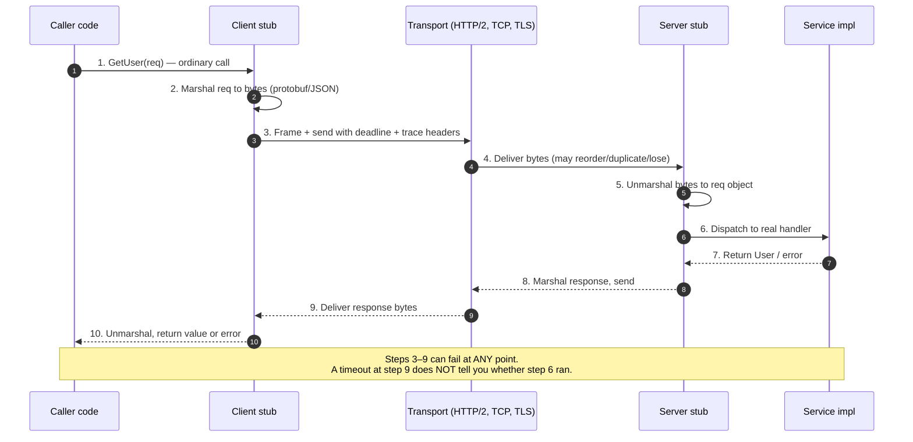
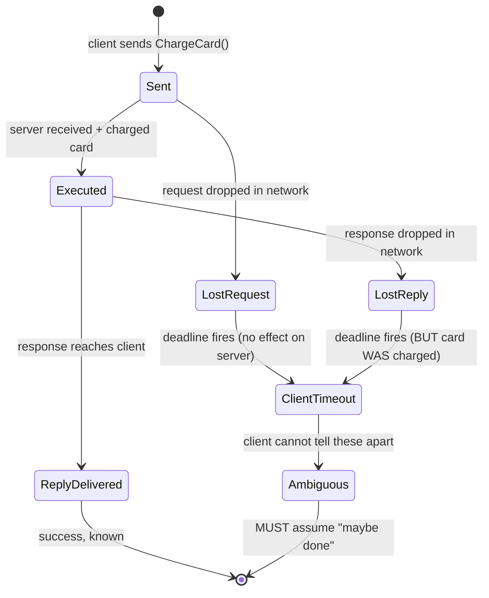
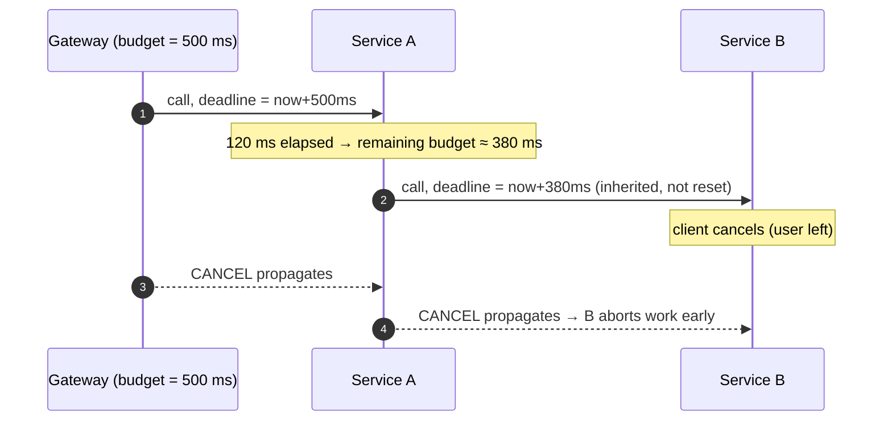
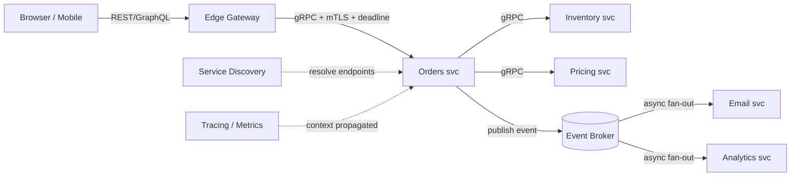

# RPC — Interview

Remote Procedure Call is the abstraction that lets a program invoke a function that
executes in another address space — usually another machine — as if it were a local
call. This file is a flat bank of interview questions with tight, senior-grade answers.
The through-line: **RPC's promise of "call remote like local" is exactly where the danger
lives.** The network is not the heap; a remote call can time out ambiguously, fail
partially, or arrive twice. Strong candidates treat RPC as *distributed systems in
disguise*, not as a syntax convenience.

## Table of Contents
1. [Q1: What is RPC, in one sentence?](#q1-what-is-rpc-in-one-sentence)
2. [Q2: Walk through what happens when I call a remote method.](#q2-walk-through-what-happens-when-i-call-a-remote-method)
3. [Q3: What are stubs, marshalling, and an IDL?](#q3-what-are-stubs-marshalling-and-an-idl)
4. [Q4: RPC vs REST — when do you reach for each?](#q4-rpc-vs-rest--when-do-you-reach-for-each)
5. [Q5: Why is "transparent remoting" a fallacy?](#q5-why-is-transparent-remoting-a-fallacy)
6. [Q6: What are the fallacies of distributed computing, and how do they hit RPC?](#q6-what-are-the-fallacies-of-distributed-computing-and-how-do-they-hit-rpc)
7. [Q7: Explain partial failure and the ambiguous-timeout problem.](#q7-explain-partial-failure-and-the-ambiguous-timeout-problem)
8. [Q8: What delivery semantics can RPC give, and how do you get "effectively-once"?](#q8-what-delivery-semantics-can-rpc-give-and-how-do-you-get-effectively-once)
9. [Q9: How do deadlines, timeouts, and cancellation work — and how do deadlines propagate?](#q9-how-do-deadlines-timeouts-and-cancellation-work--and-how-do-deadlines-propagate)
10. [Q10: How do you evolve an RPC schema without breaking callers?](#q10-how-do-you-evolve-an-rpc-schema-without-breaking-callers)
11. [Q11: What kinds of streaming does RPC support, and when do you use them?](#q11-what-kinds-of-streaming-does-rpc-support-and-when-do-you-use-them)
12. [Q12: What is the "distributed monolith" risk with RPC?](#q12-what-is-the-distributed-monolith-risk-with-rpc)
13. [Q13: Which errors are safe to retry, and how do you retry safely?](#q13-which-errors-are-safe-to-retry-and-how-do-you-retry-safely)
14. [Q14: How do RPC and asynchronous messaging differ, and when would you not use RPC?](#q14-how-do-rpc-and-asynchronous-messaging-differ-and-when-would-you-not-use-rpc)
15. [Q15: Scenario — design service-to-service comms for internal microservices.](#q15-scenario--design-service-to-service-comms-for-internal-microservices)
16. [Q16: Rapid-fire follow-ups](#q16-rapid-fire-follow-ups)

---

## Q1: What is RPC, in one sentence?

> RPC is a protocol and code-generation pattern that lets a client invoke a procedure
> in a remote address space using the same call syntax as a local function, hiding the
> network round-trip, serialization, and transport behind a generated *stub*.
>
> The keyword is *hiding* — and the senior insight is that the network can be hidden
> **syntactically** but never **semantically**. A local call cannot time out, cannot be
> lost, and cannot execute twice; a remote call can do all three. RPC makes the call
> *look* local so you can express intent cleanly, but the failure model underneath is
> irreducibly distributed. The original idea is Birrell & Nelson (1984), "Implementing
> Remote Procedure Calls," which already flagged these exact limits.

---

## Q2: Walk through what happens when I call a remote method.

> You call `result := client.GetUser(ctx, req)`. It looks like one function call; it is
> actually eight-plus stages across two machines.



> The value the candidate should surface: **the caller cannot distinguish "request never
> arrived" from "request executed but the reply was lost."** That ambiguity is the entire
> reason RPC is hard, and it drives the answers to almost every question below.

---

## Q3: What are stubs, marshalling, and an IDL?

> - **IDL (Interface Definition Language):** a language-neutral contract describing
>   services, methods, and message shapes — e.g., a `.proto` file for gRPC, a Thrift
>   `.thrift` file, or an OpenAPI/JSON-Schema doc for JSON-RPC. It is the *single source
>   of truth* for the wire contract, decoupled from any one language.
> - **Stub / skeleton:** code generated *from* the IDL. The **client stub** exposes the
>   method as a local function and handles marshalling + transport; the **server
>   skeleton** (or stub) receives bytes, unmarshals, and dispatches to your handler.
>   Generation is what makes RPC ergonomic — you write neither serialization nor routing.
> - **Marshalling / serialization:** turning in-memory objects into a byte stream for the
>   wire (and unmarshalling back). Binary formats (protobuf, Thrift, Avro) are compact and
>   fast with schema-driven encoding; text formats (JSON) are human-readable but larger and
>   slower. Marshalling is also where *schema evolution rules* live (Q10).
>
> Mental model: **IDL is the contract, the stub is the generated adapter, marshalling is the
> translation layer.** Change the IDL, regenerate stubs, and both sides speak the new shape.

---

## Q4: RPC vs REST — when do you reach for each?

> Both move data over the network; they optimize for different things. REST models
> **resources and their state transitions** over uniform HTTP verbs; RPC models
> **actions/verbs** — you call a named procedure. The honest framing: REST is
> resource-centric and web-native; RPC is action-centric and integration-native.

| Dimension | RPC (e.g., gRPC/Thrift) | REST (resource-oriented HTTP) |
|---|---|---|
| Mental model | Call an action: `CreateOrder(req)` | Manipulate a resource: `POST /orders` |
| Contract | Explicit IDL (`.proto`), codegen stubs | Convention + optional OpenAPI |
| Payload | Usually binary (protobuf) — compact, fast | Usually JSON/text — human-readable |
| Transport | Often HTTP/2 (multiplexed, streaming) | Typically HTTP/1.1 request/response |
| Coupling | Tighter (shared IDL, generated types) | Looser (self-describing, hypermedia) |
| Streaming | First-class (client/server/bidi) | Awkward (SSE, chunked, WebSocket bolt-on) |
| Browser reach | Needs a proxy/gRPC-Web | Native — any HTTP client |
| Cacheability | Weak (opaque bodies, non-idempotent verbs) | Strong (HTTP caching for GET) |
| Best fit | **Internal** service-to-service, low-latency, high-QPS | **Public/edge** APIs, browser clients, broad interop |

> Rule of thumb I give: **REST at the edge, RPC in the mesh.** Public-facing and
> browser-facing surfaces benefit from REST's ubiquity, cacheability, and human
> debuggability. Internal east-west traffic between services benefits from RPC's typed
> contracts, binary efficiency, and streaming. Many mature systems run both: a REST/GraphQL
> gateway that fans out to internal gRPC services.

---

## Q5: Why is "transparent remoting" a fallacy?

> Because transparency is a **leaky abstraction**. Making a remote call *look* identical
> to a local call hides four things that a local call never has to face:
>
> 1. **Latency that is orders of magnitude larger** — a local call is nanoseconds; a
>    cross-datacenter RPC is milliseconds. Code written as if calls are free (e.g., a loop
>    of N remote calls) becomes an N×RTT disaster — an N+1 problem over the network.
> 2. **Partial failure** — a local function either runs or doesn't; a remote one can
>    execute on the server while the *response* is lost, leaving the caller unsure (Q7).
> 3. **New failure classes** — timeouts, connection resets, serialization mismatches,
>    server overload, load-balancer drops — none of which exist for local calls.
> 4. **Independent lifecycles** — the remote side can be redeployed, be on an old schema,
>    be rate-limited, or simply be gone.
>
> This is the thesis of Waldo et al., **"A Note on Distributed Computing" (1994)**: you
> *cannot* paper over local vs remote, because the difference is not performance — it is
> **partial failure and concurrency**. Systems that pretend otherwise (classic
> DCOM/CORBA/RMI "location transparency") push the failure handling to the worst possible
> place: nowhere. The pragmatic stance is **explicit remoting** — the API surface should
> make it obvious a call crosses the network (deadlines, contexts, typed errors), so
> engineers design for failure at the call site.

---

## Q6: What are the fallacies of distributed computing, and how do they hit RPC?

> The eight fallacies (Deutsch & Gosling, Sun Microsystems) are false assumptions people
> make when writing distributed code. RPC is where each one bites concretely:

| Fallacy | How it breaks an RPC | Countermeasure |
|---|---|---|
| The network is reliable | Requests silently dropped mid-flight | Timeouts, retries with idempotency, circuit breakers |
| Latency is zero | Chatty call-per-item loops (N+1) | Batch APIs, streaming, coarse-grained methods |
| Bandwidth is infinite | Fat payloads saturate links | Binary encoding, field masks, pagination, compression |
| The network is secure | Plaintext RPC sniffed/spoofed | mTLS, authn/authz on every call |
| Topology doesn't change | Hard-coded hosts break on scale/redeploy | Service discovery, client-side LB |
| There is one administrator | Version skew across teams | Backward/forward-compatible schemas (Q10) |
| Transport cost is zero | Serialization/GC/CPU overhead ignored | Efficient codecs, connection pooling, HTTP/2 reuse |
| The network is homogeneous | Cross-language/format mismatches | Language-neutral IDL as the single contract |

> The point for the interviewer: RPC's ergonomics *tempt* you into every one of these
> assumptions. A senior engineer names the fallacy and shows the specific guardrail.

---

## Q7: Explain partial failure and the ambiguous-timeout problem.

> **Partial failure** means one part of a distributed interaction can fail while another
> succeeds — impossible for a local call, unavoidable for a remote one. The sharpest form
> is the **ambiguous timeout**: your client's deadline fires, but you *do not know which
> side of the request failed*.



> On a timeout the client sees the same thing whether the server did nothing or did
> everything — so a blind retry can double-charge the card. The resolution is **not** to
> eliminate the ambiguity (you cannot) but to make retries safe: design operations to be
> **idempotent** (Q8) so "maybe executed, retry anyway" is always correct. This is the
> single most important RPC design lesson, and it is why every serious RPC action carries
> a request/idempotency key.

---

## Q8: What delivery semantics can RPC give, and how do you get "effectively-once"?

> Three classic guarantees, and one that is engineered rather than free:
>
> - **At-most-once:** never retry. Each request runs 0 or 1 times. Simple; loses work on
>   failure. Fine for best-effort telemetry, wrong for payments.
> - **At-least-once:** retry until acknowledged. Runs 1+ times — **duplicates possible.**
>   Safe against message loss, dangerous for non-idempotent side effects.
> - **Exactly-once (on the wire):** a theoretical ideal that is **impossible** to
>   guarantee end-to-end in the presence of partial failure and crashes — you can't
>   atomically "do the work AND record that you did it" across an unreliable boundary.
> - **Effectively-once (a.k.a. exactly-once *semantics*):** the practical target.
>   `at-least-once delivery + idempotent processing ≈ exactly-once effect.` You accept
>   duplicate *delivery* but deduplicate so the observable *effect* happens once.
>
> Recipe for effectively-once:
> 1. Client generates a stable **idempotency key** per logical operation (a UUID), reused
>    across retries of the *same* operation.
> 2. Server records processed keys (in Redis/DB) with a TTL and stores the response.
> 3. On a duplicate key: skip the side effect and return the *stored* original response.
> 4. Combine with a natural unique constraint where possible (e.g., `orders.request_id`
>    UNIQUE) so the database itself rejects the second write.
>
> Say plainly in the interview: **"I don't chase exactly-once delivery; I make the handler
> idempotent and use at-least-once."** That sentence signals maturity.

---

## Q9: How do deadlines, timeouts, and cancellation work — and how do deadlines propagate?

> - **Timeout:** a *duration* the client waits ("fail after 300 ms"). Simple but does not
>   compose — each hop restarts its own clock, so a chain of 5 services each with a 300 ms
>   timeout can legally take 1.5 s.
> - **Deadline:** an *absolute point in time* ("fail at 12:00:00.300") carried in request
>   metadata. Deadlines **propagate**: each downstream call inherits the *remaining* budget,
>   so the whole call tree respects one global limit. This is why gRPC and context-based
>   APIs prefer deadlines over raw timeouts.
> - **Cancellation:** when the client gives up (deadline exceeded, user navigated away,
>   parent request failed), that signal propagates downstream so servers **stop wasting
>   work** on a result nobody will read. In Go this is `context.Context`; in gRPC it is
>   built into the call.



> Key senior points: **(1)** always set a deadline — an unbounded RPC is a latent outage
> waiting for a slow dependency; **(2)** propagate the *remaining* budget, don't reset it,
> or a deep call tree blows past the user-facing SLO; **(3)** honor cancellation server-side
> to shed load during incidents; **(4)** a deadline that has already expired should
> **fail fast without even sending** the request.

---

## Q10: How do you evolve an RPC schema without breaking callers?

> The IDL is a shared contract between independently deployed teams — so it changes on a
> rolling basis, with old and new clients/servers live at the same time. You need both:
>
> - **Backward compatibility:** new server code can read messages from old clients.
> - **Forward compatibility:** old server code can read messages from new clients
>   (it must *ignore* fields it doesn't understand rather than crash).
>
> Protobuf makes this concrete with **field numbers** as the identity of a field:
>
> **Safe changes** — add a new field with a *new* number (unknown fields are skipped by
> old readers); add a new RPC method; add a new enum value (with a default/`UNKNOWN=0`
> fallback); rename a field *if the wire uses numbers, not names*.
>
> **Breaking changes** — reuse or change a field's number; change a field's type; change
> its semantic meaning while keeping the number; make an `optional` field suddenly
> `required`; remove a field *and later* recycle its number. **Never reuse a retired field
> number** — reserve it (`reserved 5;`) so it can't be accidentally repurposed.
>
> Rules I enforce: reserve deleted field numbers and enum values; keep enum `0` a safe
> default; treat unknown-field pass-through as a feature (proxies must not drop them);
> version at the *package* level for genuinely incompatible v2 shapes rather than mutating
> v1 in place. This is also *why* binary, number-keyed encodings beat positional formats:
> they make additive evolution the default.

---

## Q11: What kinds of streaming does RPC support, and when do you use them?

> HTTP/2-based RPC (gRPC) offers four call shapes because a single request/response is not
> always the right unit of interaction:

| Pattern | Shape | Use it for |
|---|---|---|
| **Unary** | 1 request → 1 response | Ordinary calls: `GetUser`, `CreateOrder` |
| **Server streaming** | 1 request → N responses | Large result sets, live feeds, progress/log tailing |
| **Client streaming** | N requests → 1 response | Uploads, batch ingestion, metric aggregation |
| **Bidirectional streaming** | N ↔ N over one connection | Chat, real-time sync, long-lived control channels |

> Streaming wins when you want to (a) start processing before the whole payload exists,
> (b) avoid buffering huge results in memory, or (c) keep a long-lived channel with low
> per-message overhead (no per-call connection setup). Caveats to raise: streams are
> **stateful**, so they complicate load balancing (a stream pins to one backend) and
> retries (you can't blindly replay a half-consumed stream); apply **flow control** and
> **per-message deadlines/heartbeats** so a stuck peer doesn't leak resources. For
> fan-out event distribution across many consumers, a message broker often beats a
> long-lived RPC stream (Q14).

---

## Q12: What is the "distributed monolith" risk with RPC?

> A distributed monolith is a system that is *physically* split into services but
> *logically* still one tangled unit: services are so tightly coupled through synchronous
> RPCs that they must be deployed together, fail together, and can't evolve independently.
> You paid the full operational tax of microservices (network hops, serialization, ops,
> observability) and got none of the autonomy benefit.
>
> RPC makes this easy to fall into precisely *because* it feels like a local call —
> teams add another synchronous dependency without noticing they've built a fragile chain:
>
> ```text
> User request → A --RPC--> B --RPC--> C --RPC--> D
>   Availability of the chain ≈ Aᵥ × Bᵥ × Cᵥ × Dᵥ
>   Four services at 99.9% each → 0.999⁴ ≈ 99.6%  (worse than any single service)
>   Latency ≈ sum of every hop's latency, tail-amplified
> ```
>
> Symptoms: a lockstep release train; one slow service stalling the whole request tree;
> cascading failures when a leaf dies; a shared "common" library that every service
> imports. Antidotes: draw service boundaries around **business capabilities** and data
> ownership (not layers); prefer **asynchronous events** for cross-boundary workflows so
> services decouple in time; add **timeouts, circuit breakers, and bulkheads** so failures
> don't cascade; and be honest that **synchronous RPC couples availability** — every added
> hop multiplies the failure surface.

---

## Q13: Which errors are safe to retry, and how do you retry safely?

> Retrying blindly turns one problem into two (retry storms) and can duplicate side
> effects. Two questions gate every retry: **is the error transient?** and **is the
> operation safe to repeat?**
>
> - **Retry:** `UNAVAILABLE` (server down / connection dropped), `RESOURCE_EXHAUSTED` /
>   429, `DEADLINE_EXCEEDED` *only if idempotent*, connection resets. These are typically
>   transient and worth another attempt.
> - **Do not retry:** `INVALID_ARGUMENT`, `NOT_FOUND`, `PERMISSION_DENIED`,
>   `UNAUTHENTICATED`, `FAILED_PRECONDITION` — the request is *wrong*, so repeating it just
>   wastes capacity and won't succeed.
> - **Retry only if idempotent:** anything with a side effect (charge, create). Attach an
>   idempotency key (Q8) so a retry can't double-apply.
>
> Safe-retry mechanics: **exponential backoff + jitter** (never a tight retry loop — it
> synchronizes clients into a thundering herd); a **bounded retry budget** (e.g., cap
> retries to ~10% of traffic) so retries can't amplify an overload into a meltdown; a
> **circuit breaker** to stop hammering a clearly-dead dependency; and **hedged requests**
> (fire a second attempt after P95) only for idempotent, latency-critical reads. The
> failure mode to warn about: naïve retries on every layer of a call tree multiply load
> geometrically and are a classic cause of retry-storm outages.

---

## Q14: How do RPC and asynchronous messaging differ, and when would you not use RPC?

> RPC is **synchronous request/response**: the caller blocks (logically) and expects a
> reply now; it couples the two services **temporally** (both must be up) and gives an
> immediate answer. Messaging (queues, pub/sub, event streams) is **asynchronous**: the
> producer hands off a message to a broker and moves on; consumers process later,
> decoupled in time and often fanned out to many consumers.

| Aspect | RPC (sync) | Messaging (async) |
|---|---|---|
| Coupling | Temporal — both up at once | Decoupled — broker buffers |
| Response | Immediate, in-band | Deferred / none (fire-and-forget) |
| Backpressure | Caller absorbs / times out | Queue absorbs, smooths spikes |
| Failure blast radius | Cascades along call chain | Contained; retries from queue |
| Best for | Read-my-result, low-latency queries | Workflows, fan-out, load leveling, integration events |

> **Don't reach for RPC when:** the work is long-running or can be deferred (video
> encoding, emails); you need to **fan out** one event to many independent consumers; you
> need the producer and consumer to scale and deploy independently; or you want a durable
> buffer to absorb spikes and survive a consumer outage. In those cases, a broker (Kafka,
> SQS, RabbitMQ) beats synchronous RPC. A common healthy pattern is **RPC for queries,
> events for state-change notifications** — synchronous where the caller genuinely needs the
> answer, asynchronous everywhere else to keep services autonomous.

---

## Q15: Scenario — design service-to-service comms for internal microservices.

> **Prompt:** "You have ~40 internal microservices in a Kubernetes cluster. Design how
> they talk to each other."
>
> I'd reason through it in layers, calling out trade-offs at each:
>
> **1. Protocol.** Default to **gRPC over HTTP/2** for east-west traffic: typed IDL
> contracts, binary protobuf (compact, fast), multiplexed streams, and first-class
> deadlines/cancellation. Keep a thin **REST/GraphQL gateway** at the north-south edge for
> browser and public clients (translating to internal gRPC). Rationale: RPC in the mesh,
> REST at the edge (Q4).
>
> **2. Contracts & evolution.** `.proto` files in a shared, reviewed repo as the single
> source of truth; generate stubs per language in CI. Enforce backward/forward
> compatibility with a schema-lint/breaking-change check on every PR; reserve retired field
> numbers (Q10). This lets teams deploy on independent schedules.
>
> **3. Discovery & load balancing.** Services register via the platform (Kubernetes DNS /
> service registry); use **client-side or mesh load balancing** so a service finds healthy
> instances without hard-coded hosts (kills the "topology never changes" fallacy).
>
> **4. Reliability at every call.** Mandatory **deadlines with budget propagation**;
> **retries with exponential backoff + jitter**, gated on idempotency and a retry budget;
> **circuit breakers + bulkheads** to stop cascades; **idempotency keys** on every
> state-changing RPC so at-least-once retries are effectively-once (Q8, Q13).
>
> **5. Sync vs async split.** Synchronous gRPC for queries and read-my-result flows;
> **asynchronous events on a broker** for cross-service workflows and fan-out — explicitly
> to avoid a distributed monolith where 40 services must deploy in lockstep (Q12, Q14).
>
> **6. Security.** **mTLS** for all service-to-service traffic; per-call authn/authz;
> secrets and identity from the platform — never trust the network (Q6).
>
> **7. Observability.** Propagate **trace context** through RPC metadata for distributed
> tracing; standard RED metrics (rate/errors/duration) per method; structured logs keyed by
> request ID. Without this, debugging a 40-service call graph is impossible.
>
> **8. Where a service mesh helps.** For 40 services, a **service mesh** (e.g., sidecar
> proxies) can centralize mTLS, retries, timeouts, and telemetry out of app code — at the
> cost of extra operational complexity and per-hop latency, so I'd adopt it only once the
> per-team boilerplate justifies it.



> The interviewer is checking whether you: default to typed RPC internally, keep REST at
> the edge, put deadlines/retries/idempotency on every call, split sync vs async
> deliberately, and secure + observe the whole graph — while *not* over-engineering (mesh
> only when it pays).

---

## Q16: Rapid-fire follow-ups

> **Is RPC always over HTTP/2?** No. gRPC uses HTTP/2; JSON-RPC and XML-RPC run over plain
> HTTP/1.1; Thrift and older systems can run directly over TCP. HTTP/2 buys multiplexing
> and streaming.
>
> **Why binary protobuf over JSON internally?** Smaller payloads, faster
> marshalling, schema-enforced evolution, and codegen'd types — meaningful at high QPS.
> JSON wins on human-readability and browser reach, hence its use at the edge.
>
> **Can RPC be stateless?** The *service* should be stateless (any instance handles any
> call) so it load-balances and scales horizontally. Streams and long-lived channels are
> the exception — they pin to a backend and complicate LB.
>
> **How do you version an incompatible v2?** New package/namespace (`myapi.v2`) running
> alongside v1, migrate callers, then retire v1 — never mutate v1 in place.
>
> **What single guarantee do you never assume?** That a successful-looking timeout means
> the work didn't happen. Assume "maybe executed," and make retries idempotent.
>
> **One-line summary of RPC maturity?** "Call it like local, but design it like it's
> across an unreliable network — because it is."

*Next step:* [gRPC — Junior](../05-grpc/junior.md)
