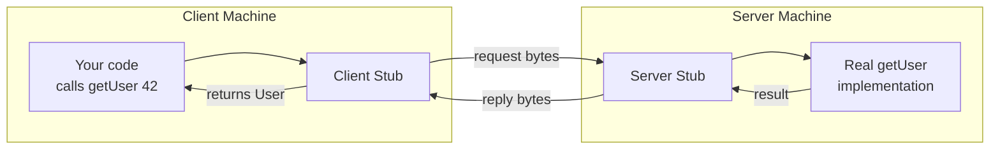
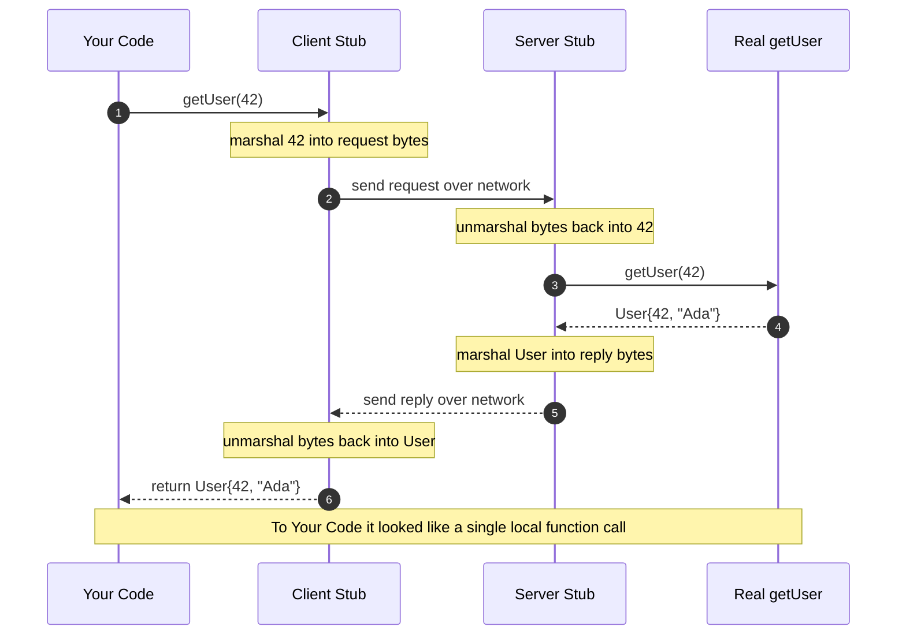
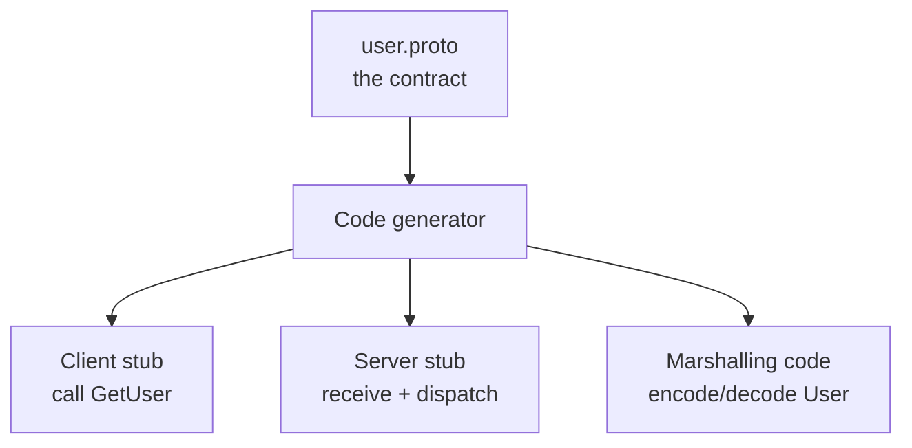

# RPC — Junior

<!-- level-focus -->
At junior level, focus on this question:

> How can I apply **RPC** in one small example and prove the result?

Use the smallest realistic scenario that exposes the decision and its failure behavior.
---

## 1. The one-sentence idea

> **RPC lets a program call a procedure (a function) that lives in another address space — usually on another machine — as if it were a local procedure call.**

"Another address space" is the important part. A normal function call reaches code that lives in *your* process's memory. An RPC reaches code that lives somewhere else entirely: another process, another container, another server in another datacenter. RPC's promise is that you don't have to *think* about that difference while writing your code. You call a function; you get a result.

The term dates to a 1984 paper by Andrew Birrell and Bruce Nelson, *"Implementing Remote Procedure Calls"* (ACM Transactions on Computer Systems). Their goal was stated almost exactly as above: make distributed programming feel like ordinary programming so that engineers can reuse the mental machinery — parameters, return values, and control flow — they already have.

---

## 2. Why we wanted this: the local call we already trust

Think about what happens when you call a plain function inside one program:

```text
result := add(2, 3)
```

1. You push the arguments `2` and `3` somewhere the callee can find them (registers or the stack).
2. Control jumps to the code of `add`.
3. `add` runs, computes `5`, puts it where the caller expects a return value.
4. Control jumps back. You now hold `5`.

This is comfortable. You do not think about registers or stacks — the compiler handles it. The call is **synchronous** (you wait for the answer), it either **succeeds or throws** (no third outcome), and it is **fast** (nanoseconds).

Now suppose `add` lives on a different machine. Everything above still needs to happen conceptually — arguments go in, code runs, a result comes back — but the "push arguments where the callee can find them" step can no longer be a memory write, because the callee has no access to your memory. The arguments have to *travel*. RPC is the machinery that makes that travel invisible so the call still *reads* like `add(2, 3)`.

---

## 3. The stub: the piece that does the hiding

The magic word is **stub**. A stub is a small piece of generated code that stands in for the real function.

- On the **client** side, the stub has the *same signature* as the remote function — `getUser(id)`. But its body doesn't compute anything. Instead it packages the arguments, sends them over the network, waits, receives the reply, unpacks it, and returns it. To your code, it is indistinguishable from the real thing.
- On the **server** side, a matching stub (often called the **skeleton** or **server stub**) does the reverse: it receives the bytes, unpacks the arguments, calls the *real* `getUser` implementation, takes the return value, packs it, and sends it back.



The two stubs are the seam between "looks local" and "is actually remote." You write against the client stub; the framework generates both stubs for you from a shared contract (more on that in §10).

---

## 4. Marshalling: turning arguments into bytes

The client stub cannot send a live `int` or a live object over a wire — a wire only carries bytes. So it must **marshal** (also called **serialize**) the arguments: convert the in-memory value into a flat sequence of bytes that can travel and be reconstructed on the other end.

Consider marshalling the number `42` and the string `"hello"`:

```text
In memory (client):   42  ->  a 4-byte integer in the CPU's register/stack
                      "hello" -> 5 characters somewhere on the heap

Marshalled (on wire): a defined byte layout, e.g.
                      [00 00 00 2A]            (42 as 4 bytes, big-endian)
                      [00 00 00 05][h e l l o] (length-prefixed string)
```

On the server, the reverse happens — **unmarshalling** (deserialization) — turning those bytes back into a real `int` and a real `string` that the server's code can use.

Why is marshalling not trivial? Because the two machines may disagree on details:
- **Byte order** — some CPUs store `42` as `00 00 00 2A`, others as `2A 00 00 00` (big-endian vs little-endian).
- **Type sizes** — an `int` might be 32 bits on one side and 64 on the other.
- **Language** — the client might be Go, the server Python. They must agree on a *wire format* that neither language dictates.

This is exactly why RPC frameworks define a neutral encoding (Protocol Buffers for gRPC, XML for old SOAP, JSON for JSON-RPC). Both sides agree on the format so `42` always means `42`. As a junior, hold onto one sentence: **marshalling is the translation of a value between "how my program holds it in memory" and "how it looks as bytes on the wire."**

---

## 5. One RPC, step by step

Let's trace a single call — `user := getUser(42)` — all the way through, with nothing skipped.

1. **You call the client stub.** Your code runs `getUser(42)`. This looks like a function call and *is* one — but it lands in the stub, not the real implementation.
2. **The stub marshals the arguments.** It converts `42` into the agreed byte layout and assembles a request message: "call method `getUser`, argument = `42`."
3. **The stub sends the request.** It hands the bytes to the network layer, which opens (or reuses) a connection to the server and transmits them. Your calling code is now **blocked**, waiting.
4. **The server receives the bytes.** The server's networking layer reads the incoming message and passes it to the matching server stub.
5. **The server stub unmarshals.** It turns the bytes back into the integer `42`.
6. **The server stub calls the real function.** It invokes the actual `getUser(42)` implementation — which might read a database, apply logic, and build a `User` object.
7. **The real function returns.** It hands back a `User { id: 42, name: "Ada" }` to the server stub.
8. **The server stub marshals the result** into bytes and sends the reply back over the connection.
9. **The client stub receives the reply**, unmarshals the bytes into a real `User` object.
10. **The client stub returns.** Your original `getUser(42)` call finally completes and hands you the `User`. From your code's point of view, a function was called and returned a value — exactly like a local call.

Every step exists to preserve one illusion: *you called a function and got a result.* Steps 2–3 and 8–9 (marshalling and transport) are the tax RPC pays to make a remote call wear the costume of a local one.

---

## 6. The staged diagram

The sequence diagram below shows the same ten steps as an ordered exchange between four participants. Read the `autonumber` steps top to bottom — that ordering *is* the RPC.



Notice steps 1 and 10 involve only `Your Code` and the `Client Stub` — that is the entire surface *you* see. Everything between is the machinery the stub hides.

---

## 7. Local call vs remote call: what really differs

The illusion is good but not perfect. Under the hood, a remote call differs from a local one in ways that eventually matter. Here is the honest comparison.

| Aspect | Local function call | Remote procedure call |
|--------|--------------------|-----------------------|
| Where the code runs | Same process, same memory | Different process, usually different machine |
| How arguments are passed | Directly (registers / stack / shared memory) | Marshalled into bytes, sent over network |
| Typical time to complete | Nanoseconds | Sub-millisecond (same datacenter) to hundreds of ms (cross-continent) |
| Can it "half-happen"? | No — it runs or it doesn't | Yes — request may be lost, or reply lost after the work was done |
| Failure modes | Exception / panic | All of the above *plus* timeout, network down, server crash |
| Pass by reference? | Yes (pointers work) | No — you send *copies* of data, not references to memory |
| Cost of adding an argument | Free | Costs bytes on the wire and marshalling time |

The single most important row is **"Can it half-happen?"** A local call cannot leave you unsure whether it ran. A remote call can: the request might reach the server, the server might do the work, and then the *reply* might get lost. Your code sees only "no answer" — it cannot tell "never ran" apart from "ran, but I didn't hear back." You don't need to solve that at the junior level, but you must *know it exists*, because it is the reason RPC is never truly identical to a local call.

---

## 8. RPC vs REST: two different mental models

You have probably called a REST API. RPC and REST are two ways to talk to a remote service, and they organize your thinking differently.

- **RPC thinks in *actions* (verbs).** The unit is a *procedure*: `getUser`, `createOrder`, `sendEmail`, `transferFunds`. You call the action you want. The API surface is a list of functions.
- **REST thinks in *resources* (nouns).** The unit is a *thing* with a URL: `/users/42`, `/orders/17`. You act on it with a small fixed set of HTTP verbs — `GET` to read, `POST` to create, `PUT`/`PATCH` to update, `DELETE` to remove. The API surface is a set of resources plus standard operations on them.

The same intent looks different in each:

| What you want | RPC style | REST style |
|---------------|-----------|------------|
| Read user 42 | `getUser(42)` | `GET /users/42` |
| Create a user | `createUser({name})` | `POST /users` with body |
| Delete user 42 | `deleteUser(42)` | `DELETE /users/42` |
| Rename user 42 | `renameUser(42, "Ada")` | `PATCH /users/42` with `{name}` |
| Ban user 42 | `banUser(42)` — a natural verb | `POST /users/42/bans` — must invent a "ban" resource |

Neither is universally "better." A rough first intuition:

- **REST shines** for public, resource-shaped web APIs where standard HTTP verbs, caching, and human-readable URLs are valuable, and where many unknown clients (browsers, third parties) consume it.
- **RPC shines** for internal service-to-service calls where you control both ends, want the calling code to *read like function calls*, and care about speed and a tightly-defined contract. Actions that don't map cleanly to "a noun and a verb" (like `banUser` or `transferFunds`) feel more natural as procedures.

The mental shift to remember: **REST asks "which thing, and what standard operation?" RPC asks "which function do I want to run?"** That is the essence, and it is enough for now.

---

## 9. The leaky abstraction: where the illusion cracks

RPC tries to make remote calls *look* local. The famous warning — from the paper *"A Note on Distributed Computing"* (Waldo, Wyant, Wollrath, Kendall, 1994) — is that you must never *forget* they are remote. The abstraction leaks in four places, and knowing them keeps you out of trouble:

1. **Latency.** A local call is nanoseconds; a remote call is thousands to millions of times slower. Code that calls a local function in a tight loop is fine. The same loop over an RPC — one call per iteration, a thousand iterations — can turn a 1 ms operation into a 1-second stall. This is the classic "N+1" trap: prefer one `getUsers([1,2,3])` over three separate `getUser` calls.
2. **Partial failure.** As in §7 — the call can half-happen. Networks drop packets; servers crash mid-request. Your code must be prepared for "I got no answer," which never happens with a local call.
3. **No shared memory.** You cannot pass a pointer and have the other side follow it. Everything is copied. A giant object passed to a local function is nearly free; passed to an RPC it must be fully marshalled and shipped.
4. **Concurrency and ordering.** Many clients call the same server at once; the server sees interleaved calls, not the neat single-threaded order your code implies.

You don't have to *handle* all of these yet. The junior-level takeaway is: **RPC hides the network, but the network is still there.** Treat every remote call as something that can be slow and can fail, even though it is written to look like it can't.

---

## 10. A concrete IDL walk-through

Where do the stubs come from? You don't write them by hand. You describe the contract once in an **IDL** — an *Interface Definition Language* — and a code generator produces both stubs for you. This is how modern frameworks like **gRPC** work, using **Protocol Buffers** as the IDL.

A tiny gRPC/protobuf contract for our example looks like this:

```proto
// user.proto — the shared contract, agreed by client and server
syntax = "proto3";

message GetUserRequest {
  int64 id = 1;
}

message User {
  int64 id = 1;
  string name = 2;
}

service UserService {
  // one procedure: takes a request, returns a User
  rpc GetUser(GetUserRequest) returns (User);
}
```

From this one file, the tooling generates:

- a **client stub** exposing a `GetUser` method you call like a normal function;
- a **server stub** that receives the request and hands it to the `GetUser` implementation *you* write;
- the **marshalling code** for `GetUserRequest` and `User`, so `42` and `"Ada"` are encoded identically on both sides regardless of language.



This is why the client and server "agree" on everything: they were both grown from the same `.proto` file. Change the contract, regenerate, and both sides update together. As a junior, you mostly *use* the generated client stub and *implement* the server function — the framework handles the bytes.

---

## 11. Where you have already used RPC

RPC is not exotic; it has been under products you use for decades:

- **gRPC** — Google's modern RPC framework (Protocol Buffers over HTTP/2), used heavily for internal microservice communication.
- **JSON-RPC / XML-RPC** — lightweight RPC over HTTP using JSON or XML payloads; still common in blockchains and older APIs.
- **SOAP** — an older, heavyweight XML-based RPC style that dominated enterprise systems in the 2000s.
- **Language-native RPC** — Java's RMI (Remote Method Invocation), Go's `net/rpc` package, .NET remoting.
- **The database driver you already use** — when your app runs a SQL query, a client library marshals the query, sends it to the database server, and unmarshals the result set. That is RPC in spirit.

Every time two programs on different machines cooperate as if they were one, some form of RPC (or its resource-shaped cousin, REST) is doing the work.

---

## 12. Common mistakes at this level

1. **Believing the illusion completely** — writing remote calls as if they were free and infallible, then being surprised by slowness and timeouts. The abstraction is a *convenience*, not a *guarantee*.
2. **Chatty designs (the N+1 trap)** — making many small RPCs in a loop instead of one batched call. Each call pays the full network round-trip tax.
3. **Sending huge payloads casually** — forgetting that every argument is marshalled and copied over the wire; a giant list that was free to pass locally is expensive to pass remotely.
4. **Ignoring partial failure** — assuming a call that returns no answer simply "didn't happen," when it may have fully executed on the server.
5. **Confusing RPC style with REST style** — trying to force actions like `banUser` into `POST /users/42/bans` without understanding you're choosing a *resource* model, or vice versa.

---

## 13. Key terms

| Term | Definition |
|------|-----------|
| RPC | Calling a procedure in another address space (usually another machine) as if it were local |
| Stub (client stub) | Generated code with the remote function's signature that marshals, sends, and returns the reply |
| Skeleton (server stub) | Generated code on the server that receives, unmarshals, and dispatches to the real implementation |
| Marshalling / serialization | Converting an in-memory value into a byte sequence for transport |
| Unmarshalling / deserialization | Reconstructing an in-memory value from received bytes |
| Wire format | The agreed byte encoding both sides use (e.g., Protocol Buffers, JSON, XML) |
| IDL | Interface Definition Language — a contract file from which stubs and marshalling code are generated |
| Synchronous call | The caller blocks and waits until the result comes back |
| Partial failure | A remote call that may have executed while the caller received no confirmation |
| Round-trip | One request out plus one reply back — the unit of latency you pay per RPC |

---

## 14. Hands-on exercise

Take the function below, which today runs locally, and reason about turning it into an RPC. **Do not write code** — write prose answers.

```text
func placeOrder(userId int, items []Item) OrderConfirmation
```

Answer these on paper:

1. **Marshalling.** List every argument and the return value. For each, describe what has to be converted into bytes to travel over the wire. Which one is the largest / most expensive to marshal, and why?
2. **The two stubs.** Describe, in one sentence each, what the client stub and the server stub do for *this specific function*.
3. **Latency.** If `placeOrder` is called once per checkout, is the round-trip cost acceptable? Now imagine a caller that loops and calls `placeOrder` 500 times to bulk-import an order history. What goes wrong, and how would you redesign the interface to fix it?
4. **Partial failure.** The user clicks "Place Order," the request reaches the server, the order is created, but the reply is lost and the client times out. What does the *user* see? What could happen if they click again? (You don't need to solve it — just describe the danger. This is the door into *idempotency*, which you'll meet at the next level.)
5. **RPC vs REST.** Rewrite `placeOrder` as a REST interaction. What resource is created, which HTTP verb fits, and what does the URL look like? Which framing — RPC or REST — reads more naturally for "place an order," and why?

Getting all five right means you understand RPC as a *mental model*, not just a piece of syntax — which is exactly the goal of this level.

---

*Next step:* [RPC — Middle](middle.md)

---

## Apply it

1. Choose one small, known input for **RPC**.
2. Predict the output or observable behavior.
3. Run the smallest example or probe that exercises the concept.
4. Change one input to trigger a failure or boundary case.
5. Explain the evidence using the guide's vocabulary.

## Verify your work

- Record the exact input, command or code path, and output.
- Repeat the probe and confirm the result is consistent.
- Show one expected success and one expected failure.
- Resolve any difference between the prediction and the evidence.

## Review questions

- What problem does RPC solve in the example?
- Which input changes the observed result, and why?
- What is the smallest useful success check?
- Which beginner mistake would your evidence catch?
