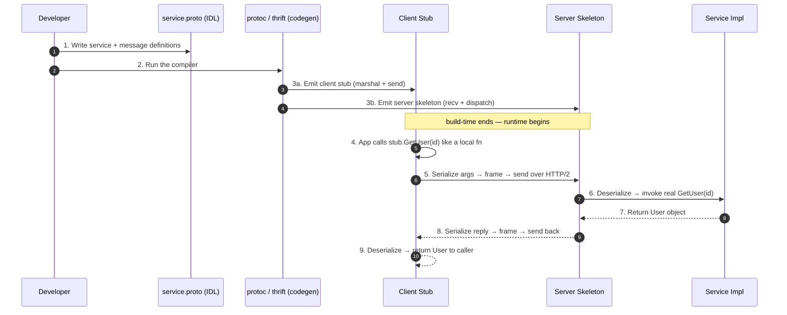
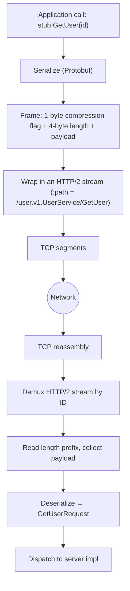
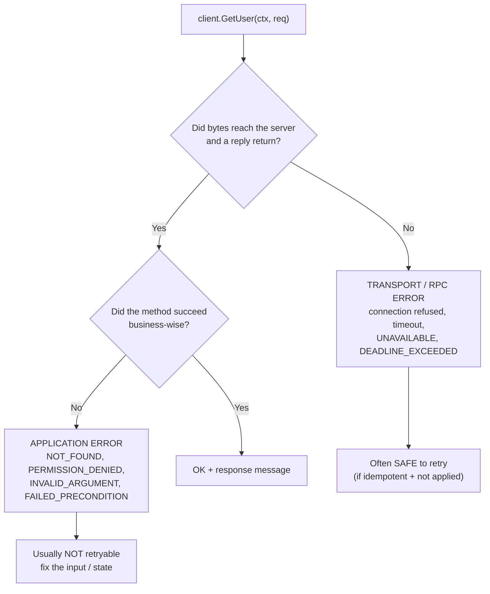
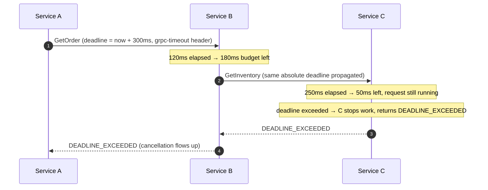

# RPC — Middle

<!-- level-focus -->
At middle level, focus on this question:

> Where does **RPC** belong in a maintainable component, and which trade-off selects the design?

Use the smallest realistic scenario that exposes the decision and its failure behavior.
## 2. The RPC Pipeline: IDL → Codegen → Stub → Wire

An RPC framework is a **contract-first toolchain**. You write one file describing the
service; a compiler generates matched client and server code; at runtime that
generated code marshals arguments, sends them, and unmarshals the reply. Here is the
whole pipeline, staged from authoring to a live call:



The two build-time artifacts have names worth knowing:

- **Client stub** (a.k.a. *proxy*) — a generated object with the same method
  signatures as the service. Calling a method **marshals** the arguments, sends the
  request, blocks (or returns a future/stream), and **unmarshals** the reply.
- **Server skeleton** (a.k.a. *stub* on the server side, or *dispatcher*) — generated
  code that receives a request, decodes it, routes to the right method of your
  implementation, and marshals the return value back.

Your job as an engineer is to write the IDL and the *implementation*. The stub and
skeleton are generated — you never hand-write serialization. That is the entire value
proposition of RPC over hand-rolled socket code.

---

## 3. The IDL: Defining the Contract

The **IDL (Interface Definition Language)** is a language-neutral schema for your
service. It declares two things: the **messages** (data shapes) and the **service**
(the callable methods). It is deliberately *not* a general-purpose language — no
logic, just structure — so it can be compiled into any target language.

### A Protobuf service definition (gRPC)

```protobuf
syntax = "proto3";

package user.v1;

option go_package = "example.com/gen/user/v1;userv1";

// A message = a typed, versioned record. Field NUMBERS (not names) are the
// wire identity; they must never be reused or renumbered once released.
message GetUserRequest {
  string user_id = 1;
}

message User {
  string user_id      = 1;
  string display_name = 2;
  string email        = 3;
  int64  created_at   = 4;   // unix epoch seconds
  repeated string roles = 5; // repeated = a list
}

message GetUserResponse {
  User user = 1;
}

// A service = a named collection of RPC methods. Each method takes exactly
// one request message and returns exactly one response message.
service UserService {
  rpc GetUser (GetUserRequest) returns (GetUserResponse);

  // stream keyword marks a method as streaming (see §7).
  rpc ListUsers (ListUsersRequest) returns (stream User);
}
```

### The same idea in Thrift IDL

```thrift
namespace go user.v1

struct User {
  1: string userId
  2: string displayName
  3: string email
  4: i64    createdAt
  5: list<string> roles
}

exception NotFound {
  1: string message
}

service UserService {
  // Thrift declares thrown exceptions in the IDL itself.
  User getUser(1: string userId) throws (1: NotFound nf)
}
```

### Why field numbers, not field names, are the contract

This is the single most important thing to internalize at this tier. In Protobuf and
Thrift, **the wire format identifies each field by an integer tag, not by its name.**
This makes the schema *evolvable*:

- **Adding a field** (a new, unused number) is backward-compatible — old readers skip
  the unknown tag; new readers get a default when it is absent.
- **Renaming a field** is free on the wire (the number is unchanged) but may break
  source that referenced the old name.
- **Reusing or renumbering a field** is catastrophic — a reader decodes bytes for
  field 3 as if they were field 3's *old* type, silently corrupting data.

The rule that falls out of this: **numbers are forever.** Reserve retired numbers
(`reserved 4;`) so no one recycles them. This is the foundation of the versioning
discipline you will own at Senior tier.

---

## 4. Code Generation: Stubs and Skeletons

You run the IDL compiler to emit language-specific code. For Protobuf/gRPC that is
`protoc` (often driven by `buf`); for Thrift it is the `thrift` compiler.

```bash
# gRPC (Go): generate message types AND the service stub/skeleton
protoc \
  --go_out=. --go_opt=paths=source_relative \
  --go-grpc_out=. --go-grpc_opt=paths=source_relative \
  user/v1/user.proto

# Thrift (Go): the -gen flag chooses the target language
thrift -r --gen go user.thrift
```

### What comes out

For each message, you get a **native struct/class** with typed fields plus
`Marshal`/`Unmarshal` (or serialize/deserialize) methods. For each service you get:

- a **client stub** — an object whose methods look local but talk to the wire;
- a **server interface** — the contract *you* implement with real business logic;
- a **registration** hook that wires your implementation into the server's dispatch
  table.

### Using the generated client stub

```go
// The stub was generated from UserService. Calling GetUser LOOKS local,
// but underneath it serializes, sends over HTTP/2, waits, and decodes.
conn, err := grpc.NewClient("user-svc:50051",
    grpc.WithTransportCredentials(insecure.NewCredentials()))
if err != nil { /* handle */ }
defer conn.Close()

client := userv1.NewUserServiceClient(conn) // <-- the generated stub

ctx, cancel := context.WithTimeout(context.Background(), 300*time.Millisecond)
defer cancel()

resp, err := client.GetUser(ctx, &userv1.GetUserRequest{UserId: "u_123"})
if err != nil {
    // This err is either a TRANSPORT/RPC error or an application error
    // encoded as a status — see §8.
    st, _ := status.FromError(err)
    log.Printf("RPC failed: code=%s msg=%s", st.Code(), st.Message())
    return
}
fmt.Println(resp.User.DisplayName)
```

### Implementing the server skeleton

```go
// You implement the generated UserServiceServer interface.
type server struct {
    userv1.UnimplementedUserServiceServer // forward-compat: new methods default here
    repo UserRepo
}

func (s *server) GetUser(ctx context.Context, req *userv1.GetUserRequest) (*userv1.GetUserResponse, error) {
    u, err := s.repo.Find(ctx, req.UserId)
    if errors.Is(err, ErrNotFound) {
        // Return a typed application error as a gRPC status (see §8).
        return nil, status.Errorf(codes.NotFound, "user %q not found", req.UserId)
    }
    if err != nil {
        return nil, status.Error(codes.Internal, "lookup failed")
    }
    return &userv1.GetUserResponse{User: toProto(u)}, nil
}
```

Notice the symmetry: the client stub and the server skeleton were generated from the
*same* IDL, so their message types and method signatures are guaranteed to match.
That guarantee is what makes RPC safer than two teams independently agreeing on a JSON
shape by hand.

---

## 5. Serialization Formats: Protobuf vs Thrift vs JSON

The **serialization format** (a.k.a. the *encoding* or *wire format*) decides how a
message struct becomes bytes. It is independent of the transport — you can run
Protobuf over HTTP/2 (gRPC), or Protobuf over a raw socket, or JSON over HTTP/2. The
choice trades human-readability against size and speed.

| Property | Protobuf | Thrift (binary) | JSON |
|---|---|---|---|
| Schema required | Yes (`.proto`) | Yes (`.thrift`) | No (self-describing) |
| Encoding | Binary, tag-length-value | Binary (compact/binary) | Text (UTF-8) |
| Wire identity | Field number | Field number | Field name |
| Typical size | Smallest (varint-packed) | Small | Largest (2–10×) |
| Parse speed | Fast | Fast | Slow (string parsing) |
| Human-readable | No | No | Yes |
| Schema evolution | Excellent (numbers) | Excellent (numbers) | Ad hoc / by convention |
| Cross-language | Excellent | Excellent | Universal |
| Debuggability | Needs tooling | Needs tooling | `curl`-friendly |

### The same message on the wire

```text
Logical value: { user_id: "u_123", roles: ["admin"] }

JSON (37 bytes, self-describing):
  {"user_id":"u_123","roles":["admin"]}

Protobuf (≈16 bytes, field numbers + varint lengths):
  0A 05 75 5F 31 32 33   2A 05 61 64 6D 69 6E
  │  │  └─"u_123"────┘   │  │  └─"admin"───┘
  │  └len=5              │  └len=5
  └field 1, type 2       └field 5, type 2
```

The binary formats win on size and CPU because they carry **no field names** and pack
integers as **varints** (small numbers take one byte). JSON wins on
*operability*: you can read it in a log, hand-craft it in `curl`, and no compiler
step is needed. The classic sweet spots:

- **Protobuf / Thrift** — internal service-to-service traffic, high call volume, where
  bytes and CPU matter and both sides own the schema.
- **JSON** — public/partner APIs, browser clients, low-volume or human-debugged paths,
  and anywhere a schema compiler is friction. This is why **JSON-RPC** exists: RPC
  semantics with a text body you can read.

---

## 6. Transport: TCP, HTTP/2, and Framing

Serialization produces bytes; the **transport** moves them. Two questions define a
transport: (1) what carries the bytes, and (2) how the receiver knows where one
message ends and the next begins (**framing**).

- **Raw TCP** — Thrift's `TSocket` and Cap'n Proto can run directly on TCP. Framing is
  the framework's job (Thrift's `TFramedTransport` prefixes each message with a
  4-byte length).
- **HTTP/2** — gRPC's transport. HTTP/2 gives **multiplexed streams** over one TCP
  connection: many concurrent RPCs share a socket without head-of-line blocking at the
  HTTP layer, plus header compression (HPACK) and native support for streaming. Each
  RPC is one HTTP/2 stream; the message is length-prefixed inside DATA frames.



### Why HTTP/2 matters for RPC specifically

- **Multiplexing** — hundreds of in-flight RPCs on one connection means you amortize
  the TCP + TLS handshake once, not per call. This is a large latency win versus
  HTTP/1.1's one-request-per-connection (or fragile pipelining).
- **Bidirectional streams** — HTTP/2's full-duplex streams are what make gRPC's
  streaming call types (§7) possible without hacks like long-polling.
- **Trailers** — HTTP/2 lets the server send status *after* the body, which is exactly
  how gRPC delivers the final status code of a streaming call.

The framing detail is not academic: getting framing wrong (reading past a message
boundary, or under-reading) is the classic bug in hand-rolled RPC on raw TCP, and the
reason you let the framework own it.

---

## 7. The Four Call Types

An RPC method has a **cardinality** on each side of the wire: does the message flow
one-shot, or as a stream? gRPC names all four; other frameworks support a subset.

1. **Unary (sync request/response)** — the default. One request, one response, the
   caller blocks (or awaits a future). This is the mental model most people have of
   "an RPC." `rpc GetUser(Req) returns (Resp)`.

2. **Server streaming** — one request, a *stream* of responses. The server pushes
   messages until it is done. Good for large result sets, tailing logs, or progress
   updates. `rpc ListUsers(Req) returns (stream User)`.

3. **Client streaming** — a stream of requests, one response. The client pushes many
   messages, then the server replies once. Good for bulk ingest or uploading a file in
   chunks. `rpc UploadMetrics(stream Sample) returns (Ack)`.

4. **Bidirectional streaming** — both sides stream independently over one connection.
   Good for chat, collaborative editing, or a live feed with acks. `rpc Chat(stream
   Msg) returns (stream Msg)`.

### Async vs sync at the API level

Independently of streaming, the *stub* may be **synchronous** (blocks the caller) or
**asynchronous** (returns a future/promise/callback so the caller keeps working). gRPC
generates both a blocking stub and a future/async stub in most languages. The wire
behavior is identical; the difference is whether your thread parks or not. Prefer
async stubs when a single caller fans out to many downstreams — otherwise you burn a
thread per in-flight call.

---

## 8. Error Handling: Transport Errors vs Application Errors

This is the boundary that separates engineers who *use* RPC from engineers who
*understand* it. There are **two distinct failure planes**, and conflating them causes
real bugs (retrying a business rejection, or treating a network blip as a validation
error).



- **Transport / RPC error** — the *call machinery* failed: connection refused, TLS
  handshake failure, request timed out, server overloaded, stream reset. The remote
  method may have **run, partially run, or never run** — you often cannot tell. These
  map to gRPC status codes like `UNAVAILABLE`, `DEADLINE_EXCEEDED`, `RESOURCE_EXHAUSTED`.
  Many are *retryable*, but only if the operation is idempotent (§9.08).

- **Application error** — the call reached the server, the method ran to completion,
  and it *deliberately returned a failure*: user not found, permission denied,
  validation failed. These are part of the contract, not a machinery fault. Retrying
  them is pointless (or harmful).

### How frameworks encode each plane

| Framework | Transport error | Application error |
|---|---|---|
| gRPC | Status code (`UNAVAILABLE`, `DEADLINE_EXCEEDED`) | Status code (`NOT_FOUND`, `INVALID_ARGUMENT`) + optional `google.rpc.Status` details |
| Thrift | Transport exception (`TTransportException`) | IDL-declared `exception` types in `throws` |
| JSON-RPC | HTTP/socket error, or malformed response | `error` object with `code` + `message` in the JSON body |

gRPC uses **one status-code space** for both planes, which is convenient but means you
must read the *code* to know the plane: `UNAVAILABLE` is transport, `NOT_FOUND` is
application. Thrift and JSON-RPC separate them more explicitly — Thrift puts
business errors in the IDL as typed `exception`s; JSON-RPC returns a structured
`error` object with reserved codes (e.g., `-32600` invalid request) versus your own
application codes.

**The rule to carry forward:** design your service so that *expected* business
outcomes (not-found, forbidden, quota-exceeded) are **application errors** with stable
codes, and reserve transport failures for genuine machinery faults. Only then can a
caller write correct retry logic.

---

## 9. Timeouts, Deadlines, and Cancellation

A remote call can hang forever if the server is slow or the network stalls. Without a
bound, one slow dependency exhausts the caller's threads/connections and the failure
cascades. Every RPC must be bounded.

### Timeout vs deadline

- A **timeout** is a *duration* ("fail after 300 ms").
- A **deadline** is an *absolute point in time* ("fail at 12:00:00.300").

Deadlines are strictly better for RPC because they **propagate correctly across hops.**
If service A sets a 300 ms deadline and calls B, which calls C, the *same absolute
deadline* travels down the chain. Each hop knows the real time budget left, instead of
each independently resetting a fresh 300 ms timeout (which would let a 3-hop chain run
900 ms). gRPC transmits the deadline on the wire (the `grpc-timeout` header) so the
server can stop working when there is no point finishing.



### Cancellation

When the deadline fires (or the caller aborts), the framework **cancels** the call:
the client stops waiting *and* signals the server to stop working. In gRPC/Go this is
the `context.Context` — a cancelled context aborts downstream DB queries and further
RPCs, freeing resources instead of doing work whose result no one will read. Always
thread the incoming request's context through to every downstream call; never call
`context.Background()` inside a handler for a downstream RPC, or you sever the deadline
chain.

```go
// Deadline set on the CLIENT; propagated automatically to the server.
ctx, cancel := context.WithTimeout(ctx, 300*time.Millisecond)
defer cancel() // always cancel to release resources, even on the happy path
resp, err := client.GetUser(ctx, req)
```

**Practical rules:**
- Set a deadline on *every* outbound RPC; a missing deadline is a latent outage.
- Make deadlines *tighter* the deeper you go — leave slack for retries and the return
  trip.
- Treat `DEADLINE_EXCEEDED` as a transport error: retry only if idempotent, and only
  if there is budget left (there usually is not).

---

## 10. Framework Landscape

You do not build the pipeline in §2 yourself — you pick a framework that ships it.
The common ones, and where each fits:

| Framework | IDL | Default encoding | Transport | Streaming | Sweet spot |
|---|---|---|---|---|---|
| **gRPC** | Protobuf | Protobuf (binary) | HTTP/2 | All 4 types | Polyglot microservices, high volume, streaming |
| **Apache Thrift** | Thrift IDL | Binary / compact | TCP (pluggable) | Limited | Legacy/polyglot systems, pluggable transports |
| **Cap'n Proto** | Cap'n Proto schema | Zero-copy layout | TCP / pluggable | Promise pipelining | Ultra-low-latency; read without parsing |
| **JSON-RPC** | None (convention) | JSON (text) | HTTP / WS / TCP | No | Simple, human-debuggable, browser-friendly RPC |

Notes that matter at this tier:

- **gRPC** is the default choice for new internal service meshes: Protobuf + HTTP/2 +
  first-class streaming + broad language support. Its cost is that it is not
  natively browser-friendly (needs a proxy like gRPC-Web) and the binary wire is
  harder to eyeball.
- **Thrift** predates gRPC and shines where you need pluggable transports/protocols
  and already run Facebook-lineage infrastructure.
- **Cap'n Proto** avoids a parse step entirely — its wire format *is* its in-memory
  layout, so you read fields with zero deserialization, and it supports **promise
  pipelining** (chaining dependent calls in one round trip). Choose it when the
  serialization CPU or an extra round trip is your bottleneck.
- **JSON-RPC** is the minimalist: no compiler, no schema, a tiny spec. It is ideal for
  developer tooling, wallet/RPC endpoints, and cases where `curl`-ability beats raw
  performance.

---

## 11. A Complete Worked Example

Putting the whole pipeline together — from IDL to a call that returns a value and one
that fails cleanly.

**1. The contract** (`user/v1/user.proto`), already shown in §3, declares
`UserService.GetUser`.

**2. Codegen** produces `NewUserServiceClient` (stub) and `UserServiceServer`
(interface to implement), as shown in §4.

**3. A successful call:**

```go
ctx, cancel := context.WithTimeout(context.Background(), 250*time.Millisecond)
defer cancel()

resp, err := client.GetUser(ctx, &userv1.GetUserRequest{UserId: "u_123"})
// On the wire: HPACK headers (:path=/user.v1.UserService/GetUser, grpc-timeout=250m),
// then a length-prefixed Protobuf DATA frame carrying {user_id:"u_123"}.
if err == nil {
    fmt.Println(resp.User.DisplayName) // "Ada Lovelace"
}
```

**4. The three failure shapes a caller must distinguish:**

```go
resp, err := client.GetUser(ctx, &userv1.GetUserRequest{UserId: "u_999"})
if err != nil {
    st, _ := status.FromError(err)
    switch st.Code() {
    case codes.NotFound:
        // APPLICATION error — the method ran and said "no such user".
        // Do NOT retry; surface a 404 to the caller.
    case codes.DeadlineExceeded, codes.Unavailable:
        // TRANSPORT error — machinery failed. Retry IF idempotent and budget remains.
    case codes.InvalidArgument:
        // APPLICATION error — bad input. Fix the request; retrying is pointless.
    default:
        // Unknown/Internal — log with the status details and alert.
    }
}
```

The same call, expressed as **JSON-RPC** to show the contrast — semantics identical,
encoding readable:

```text
--> {"jsonrpc":"2.0","method":"getUser","params":{"userId":"u_999"},"id":7}
<-- {"jsonrpc":"2.0","error":{"code":404,"message":"user not found"},"id":7}
```

Both express the *same* application error; gRPC packs it as a status code on an HTTP/2
trailer, JSON-RPC as an `error` object in a text body. Knowing they are the same thing
in different clothes is the point of this tier.

---

## 12. Middle Checklist

- [ ] I can read a `.proto`/`.thrift` file and predict the generated stub and skeleton
      signatures.
- [ ] I know that **field numbers, not names**, are the wire contract — and that
      numbers are forever (reserve retired ones).
- [ ] I can choose a serialization format (Protobuf/Thrift for internal volume, JSON
      for public/debuggable) with a stated reason.
- [ ] I know why gRPC uses HTTP/2 (multiplexing, streaming, trailers) and what framing
      is.
- [ ] I can name the four call types and pick the right one for a given data flow.
- [ ] I always distinguish **transport errors** (retryable if idempotent) from
      **application errors** (fix the input/state), and encode business outcomes as
      stable application error codes.
- [ ] Every outbound RPC has a **deadline**, and I propagate the request context so the
      deadline flows across hops and cancellation frees downstream work.
- [ ] I can name gRPC, Thrift, Cap'n Proto, and JSON-RPC and say where each fits.

*Next step:* [RPC — Senior](senior.md)

---

## Apply it

1. Find a real component where **RPC** affects an interface or dependency.
2. Write two plausible choices and the constraint that favors each one.
3. Make the smallest reversible change at that boundary.
4. Exercise the component alone, then exercise the integrated flow.
5. Keep the decision note with the evidence that selected the option.

## Verify your work

- A focused check proves the local behavior.
- An integrated check proves callers and dependencies still agree.
- Logs, traces, compiler output, or benchmarks expose the boundary.
- Reverting the change restores the previous behavior without unrelated edits.

## Review questions

- Which boundary is most affected by RPC?
- What constraint would make you choose the alternative design?
- How would you isolate a local defect from an integration defect?
- What evidence shows that the change remains maintainable?
