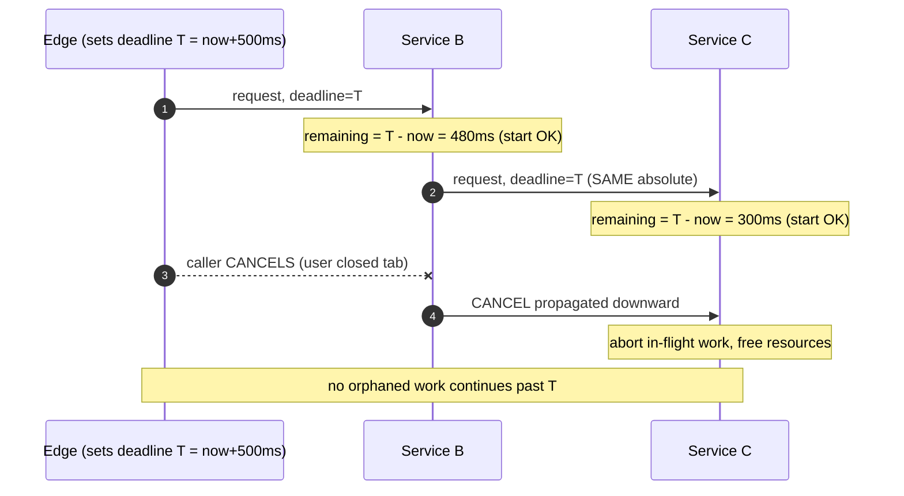

# RPC — Professional

<!-- level-focus -->
At professional level, focus on this question:

> How should teams adopt and operate **RPC** with measurable outcomes and limited coordination?

Use the smallest realistic scenario that exposes the decision and its failure behavior.
## Theory and Formal Foundations

An RPC makes a call to a remote procedure *look* like a local one. That illusion is
useful right up to the moment it fails — and then the differences that RPC hid become
the entire problem. This tier treats RPC as a distributed-systems primitive and reasons
about it formally: what delivery semantics a call graph can actually guarantee, why
"exactly-once *delivery*" is provably unreachable, how the wire format governs schema
evolution, and how deadlines and cancellation propagate (or fail to propagate) across a
call tree. The recurring theme is that an RPC is not a function call — it is a message
exchange over a lossy, partially-synchronous network, and every guarantee you want must
be *engineered on top of that*, never assumed.

---

## 1. Why "Local Call" Is a Leaky Abstraction

A local procedure call has three properties an RPC cannot inherit:

- **It always returns** (barring a crash of the whole process), and if the process
  crashes, the caller crashes with it — there is no observer left to be confused.
- **It has one, unambiguous outcome**: either it ran and returned, or it did not run.
- **Its arguments and results share an address space** — no serialization, no
  version skew, no partial reads.

Cross a network and each of these breaks:

- The call may not return — the callee, the network, or the reply can vanish
  independently while the caller keeps running.
- The outcome becomes a *four-valued* logic, not two: the request may have (a) never
  arrived, (b) arrived and been processed but the reply was lost, (c) arrived and
  *not yet* been processed when you gave up, or (d) been fully processed with a reply
  you did receive. Only (d) is unambiguous.
- Arguments must be marshalled into a byte stream by a caller and unmarshalled by a
  callee that may be running a *different version* of the code.

The 1994 note *"A Note on Distributed Computing"* (Waldo, Wyant, Wollrath, Kendall)
is the canonical statement of why: latency, memory access, partial failure, and
concurrency cannot be papered over by making a remote call syntactically identical to a
local one. Everything below is a consequence of taking that seriously.

Note the terminal states: exactly one of them (`Replied`) is unambiguous. A timeout
collapses three genuinely different physical situations into one indistinguishable
signal. Section 5 develops the consequences.

---

## 2. Delivery Semantics: At-Most-Once, At-Least-Once, Exactly-Once

A delivery semantic is a *guarantee about how many times the callee's side effect can
occur* as observed across retries. Three are commonly named. The choice is a function of
one design decision: **does the client retry, and does the server deduplicate?**

| | At-most-once | At-least-once | Exactly-once (effectively-once) |
|---|---|---|---|
| **Client on timeout** | Does **not** retry | **Retries** until success | Retries |
| **Server dedup** | None needed | None | **Yes** — idempotency key / dedup store |
| **Effect count** | 0 or 1 | 1 or more | 1 (observed) |
| **Failure mode** | Silent loss (0 effects) | Duplicates (2+ effects) | Neither, if dedup is correct |
| **Cost** | Cheapest; no retry, no dedup | Retry traffic; duplicate side effects | Retry traffic + dedup storage + dedup lookups |
| **Correctness burden** | Accept lost calls | Make handler idempotent, or tolerate dups | Correct dedup key + atomic store |
| **When to use** | Fire-and-forget metrics, best-effort cache invalidation | Almost everything with an idempotent handler | Money movement, order placement, non-idempotent effects |

Two orthogonal knobs generate this table:

```text
                 server deduplicates?
                     NO            YES
client   NO   at-most-once     at-most-once*
retries? YES  at-least-once    effectively-once
```

\* Dedup without retry is pointless: there is nothing to deduplicate. The only two
useful configurations are **at-most-once** (no retry) and **at-least-once** (retry),
with **effectively-once** being at-least-once *plus* a dedup layer.

The critical mental correction for this tier: **"at-most-once" and "at-least-once" are
about the client's retry policy; "exactly-once" as usually sold is about the server's
deduplication.** They are not three points on one dial — they are two independent
switches. There is no configuration that gives you exactly-once *delivery* of the
network message; you only ever get exactly-once *effect*.

---

## 3. Why True Exactly-Once Delivery Is Impossible

"Exactly-once delivery" means: the message crosses the network and is processed
**exactly one time**, with zero duplicates and zero losses, guaranteed by the transport.
This is impossible in an asynchronous network with crashes. The argument is short and
worth internalizing.

```text
Claim: No protocol can guarantee a message is delivered and processed
       exactly once over an unreliable network with process crashes.

Setup: Sender S wants receiver R to process message m once. The network
       may drop or delay any message arbitrarily; either party may crash
       and recover.

Argument:
  1. If S never retransmits, then any single drop of m loses it forever
     => zero deliveries possible => NOT "at least once" => NOT "exactly once".

  2. Therefore S must retransmit m until it has PROOF that R processed it.
     Proof can only arrive as an acknowledgement message a from R.

  3. But a traverses the same unreliable network. a can be dropped.
     If a is dropped, S (having no proof) retransmits m.
     R now sees m a SECOND time => a duplicate is possible => NOT "exactly once".

  4. To avoid the duplicate, R must recognize the retransmit as already-seen
     and suppress it. But that is DEDUPLICATION at the receiver — it is no
     longer the transport delivering once; it is the application making a
     repeated delivery IDEMPOTENT.

Conclusion: The network can offer AT-MOST-ONCE (never retransmit, may lose) or
  AT-LEAST-ONCE (retransmit until acked, may duplicate). "Exactly once" requires
  BOTH no-loss AND no-duplicate, which forces retransmission (for no-loss) AND
  deduplication (for no-duplicate). Deduplication lives in the receiver's state,
  not in delivery. Hence "exactly-once DELIVERY" is unattainable; only
  "exactly-once EFFECT" (a.k.a. effectively-once) is. ∎
```

This is the FLP/Two-Generals family of impossibility: you cannot distinguish "message
lost" from "acknowledgement lost" from "peer slow" using messages alone, because the
diagnostic itself is a message subject to the same failures. Any vendor claim of
"exactly-once" is, on inspection, always **at-least-once transport + receiver-side
deduplication** — i.e., effectively-once. Kafka's "exactly-once semantics," for
instance, is producer idempotence (sequence numbers deduplicated by the broker) plus
transactional atomic writes — dedup and atomicity, not a magic once-delivering wire.

---

## 4. Effectively-Once: At-Least-Once + Idempotency

Since delivery cannot be once, we engineer the *effect* to be once. The recipe:

1. **Client retries** on timeout/failure (at-least-once).
2. **Client attaches a stable idempotency key** to the logical operation — the *same*
   key on every retry of the *same* intent (not a fresh key per network attempt).
3. **Server records the key's outcome atomically with the side effect**, and on seeing
   a key it has already completed, **returns the stored result instead of re-executing**.

```mermaid
sequenceDiagram
    autonumber
    participant C as Client
    participant S as Server
    participant D as Dedup Store + Effect (atomic)

    C->>S: charge(key=K, $10)  [attempt 1]
    S->>D: has K?  → no; execute + record(K, result)
    D-->>S: committed atomically
    S--xC: reply LOST in network
    Note over C,S: caller sees timeout, outcome ambiguous
    C->>S: charge(key=K, $10)  [attempt 2, SAME key]
    S->>D: has K? → YES, return stored result
    D-->>S: result(K) (no second charge)
    S-->>C: 200 OK, charged once
    Note over C,D: two deliveries, ONE effect = effectively-once
```

Three properties make this correct, and each is a place implementations go wrong:

- **Key stability.** The key identifies the *intent*, not the *attempt*. If the client
  mints a new UUID on each retry, the server sees distinct operations and the guarantee
  evaporates. The key is generated once, before the first send, and reused verbatim.
- **Atomicity of "record key" and "apply effect."** These must commit in the *same*
  transaction (or via a technique that yields the same atomic outcome). If the effect
  commits but the key record does not, a retry re-executes; if the key records but the
  effect does not, the operation is falsely reported done. Same-database transactions,
  or an outbox, close this gap.
- **Dedup-store retention ≥ maximum retry horizon.** If the store forgets K before the
  client's last retry, a late duplicate slips through. Retention must exceed the client's
  total retry window (including its own crash-and-resume time).

Effectively-once is therefore not a transport feature you switch on — it is a *contract*
between a retrying client and a deduplicating, atomic server. Break any of the three
properties and you silently fall back to at-least-once (duplicates) or worse.

---

## 5. The Two-Generals Ambiguity of a Timed-Out Call

When a client's deadline fires with no reply, it faces the classic epistemic problem:
**it cannot know whether the callee ran the operation.** From the client's vantage the
observable evidence is identical for these physically distinct cases:

```text
Timeout observed. Which world am I in?

  World A — request never arrived      → effect count 0
  World B — request arrived, ran, reply lost → effect count 1
  World C — request arrived, NOT yet run when I gave up → effect count 0 (for now),
             possibly 1 later if the callee still processes it
  World D — callee crashed mid-effect  → effect count 0, 1, or partial

  The client's sensor (received bytes) returns the SAME reading in all four.
```

This is the Two Generals Problem wearing an RPC costume: no finite exchange of messages
lets both sides reach *common knowledge* of the outcome, because the last message is
always unacknowledged and might have been lost. The practical rules that follow:

- **A timeout is not a failure verdict — it is an "unknown" verdict.** Treating a
  timeout as "it definitely didn't happen" and retrying a *non-idempotent* op is how
  double-charges are born.
- **Blind retry is only safe if the operation is idempotent** (Section 4). If it is not,
  the client must either (a) make it idempotent via a key, (b) read back state to
  discover what actually happened before retrying, or (c) escalate to a human/compensation
  workflow.
- **Reconciliation replaces certainty.** Since the ambiguity is unresolvable in the
  moment, correct systems *reconcile after the fact*: the client queries the callee's
  authoritative state ("did operation K complete?") and converges. The idempotency key is
  exactly the handle that makes this query answerable.

The deep point: RPC does not — and provably cannot — hand you the outcome of every call.
It hands you *one bit that is sometimes ambiguous*. Correctness comes from designing
around the ambiguity, not from wishing it away with a longer timeout.

---

## 6. Marshalling and Wire-Format Theory

Marshalling (serialization) turns in-memory typed values into a byte stream; unmarshalling
reverses it on a peer that may run a different code version. The format's *self-description
strategy* determines both its size/speed and its evolution rules.

| Property | Schema-driven binary (Protobuf, Thrift, Avro, Cap'n Proto) | Self-describing (JSON, XML, MessagePack) |
|---|---|---|
| **Field identity on wire** | Numeric **tag** (Protobuf/Thrift) or ordered schema (Avro) | Field **name** string |
| **Type info on wire** | Minimal (a wire-type nibble); full types live in the schema | Carried inline or inferred |
| **Reader needs schema?** | Yes (or an embedded/registry-fetched schema, as in Avro) | No — payload is self-contained |
| **Size** | Compact — tags + varints, no field names | Larger — names repeated every message |
| **Encode/decode cost** | Low — no text parsing | Higher — string/number parsing |
| **Unknown fields** | Preserved (Protobuf keeps unknown tags) or must be defined (Avro needs writer schema) | Naturally ignorable |
| **Human-readable** | No | Yes |
| **Evolution model** | Governed by tag stability | Governed by name stability + tolerant readers |

The theory that matters:

- **Tag-based binary formats encode *position/identity as a number*, decoupled from the
  field's name and source-code position.** This is why you can rename a field freely
  (the name never travels) but must **never reuse or renumber a tag** — the tag *is* the
  field's identity on the wire. A reader decodes by tag; a reused tag silently reinterprets
  old bytes as a new field.
- **Self-describing formats encode identity as a *name string*.** Renaming is a breaking
  change; adding a field is cheap; readers survive by being *tolerant* (ignore unknown
  keys). Cost: the name is paid for on every message, and there is no compiler-enforced
  contract.
- **Avro is a third point**: schema-driven but *not* tag-based. The reader must possess
  the *writer's* schema (typically via a schema registry) to interpret the ordered,
  untagged binary. Compatibility is checked by *resolving* reader-vs-writer schemas, which
  is why Avro's evolution rules hinge on default values and schema-registry compatibility
  modes rather than tag numbers.

The **forward-compatibility mechanism** in tag-based formats is that a reader **skips
unknown tags** using the wire-type nibble to know how many bytes to consume — so a new
field a producer added is transparently jumped over by an old consumer. This single
mechanism is what makes independent, rolling deployment of producers and consumers
possible.

---

## 7. Schema Compatibility: Forward, Backward, Full

Compatibility is defined by *who is newer* — the reader or the writer — and whether they
can still communicate. Precise definitions:

- **Backward compatible:** a **new reader** can read data written by an **old writer**.
  (New code understands old messages.)
- **Forward compatible:** an **old reader** can read data written by a **new writer**.
  (Old code tolerates new messages — by skipping what it does not know.)
- **Full compatible:** both directions hold — you can deploy readers and writers in any
  order.

In a rolling deployment both directions matter, because for a window of time old and new
instances of *both* the caller and callee coexist and call each other in every
combination.

| Change | Backward (new reads old) | Forward (old reads new) | Rule |
|---|---|---|---|
| **Add an optional field / new tag** | ✅ (missing → default) | ✅ (unknown tag skipped) | Safe; the workhorse of evolution |
| **Add a required field** | ❌ (old data lacks it) | ❌ | Never add required; there is no "required" in proto3 for this reason |
| **Remove an optional field** | ✅ | ✅ (readers must not depend on it) | Safe if no reader relies on presence |
| **Remove a required field** | ❌ | ❌ | Forbidden |
| **Rename a field (tag-based)** | ✅ (name not on wire) | ✅ | Safe — name is source-only |
| **Rename a field (name-based JSON)** | ❌ | ❌ | Breaking — name *is* the identity |
| **Reuse an old tag number for a new field** | ❌ | ❌ | **Forbidden** — reserve retired tags |
| **Renumber an existing field's tag** | ❌ | ❌ | Forbidden — it is a new field |
| **Change a field's type** | ⚠️ only within wire-compatible types | ⚠️ | Only e.g. `int32↔int64` where varint-compatible; most changes break |
| **Change field from optional→repeated** | ⚠️ | ⚠️ | Format-specific; treat as breaking unless proven safe |

The two invariant rules that prevent nearly all wire-format outages:

1. **Only ever add *optional* fields with *new* tag numbers; never make a field required.**
   New fields are invisible to old readers (forward-compat) and default-filled for new
   readers of old data (backward-compat).
2. **Never reuse or renumber a tag. `reserved` retired tag numbers *and* names.** A reused
   tag makes a new reader interpret an old writer's bytes as the wrong field — a silent
   data-corruption bug, not a loud parse error. Protobuf's `reserved 3, 7 to 9;` and
   `reserved "old_name";` exist precisely to make this a compile-time error.

Both rules are corollaries of one principle: **the wire identity of a field (its tag, or
its name) must be immutable for the life of the schema.** Everything you may safely change
is something the wire does not carry.

---

## 8. Deadline and Cancellation Propagation

A call is rarely a leaf: service A calls B, which calls C and D. A **deadline** must
propagate *down* this tree so that no descendant does work whose result can no longer be
used, and a **cancellation** must propagate *down* when a caller gives up. The formal goal
is to eliminate **wasted and orphaned work**.

The correct model is an **absolute deadline (a wall-clock instant), not a relative
timeout (a duration)**. Reason: a relative timeout of "500 ms" restarts the clock at every
hop, so a 4-deep chain could legitimately run for 2 s. An absolute deadline
(`now + 500 ms` computed once at the edge) is passed down verbatim; each hop computes its
*remaining* budget as `deadline − now` and must (a) refuse to start if the remaining budget
is non-positive, and (b) pass the *same* absolute deadline to its own callees.



Precise semantics that this tier must state exactly:

- **Deadlines propagate down and are absolute.** Each hop passes the *same* instant `T`,
  never a fresh duration. This makes the total end-to-end time bounded by `T` regardless
  of tree depth.
- **Remaining-budget check gates work.** Before dispatching a downstream call — or even
  before starting local work — a server checks `T − now > 0`. If not, it **fails fast**
  (`DEADLINE_EXCEEDED`) rather than starting doomed work. This is *admission control*: it
  prevents load amplification where every layer times out in turn.
- **Cancellation propagates down as a signal, and it is best-effort.** When the caller
  cancels (or its own deadline fires), it must actively cancel outstanding downstream
  calls. But cancellation is itself a message — a callee may have already committed a side
  effect before the cancel arrives. **Cancellation does not undo committed effects;** it
  only stops *future* and *in-flight interruptible* work. Rollback of committed effects is
  a *compensation* concern, not a cancellation one.
- **Deadline exceeded is a Section-5 ambiguous outcome.** When B abandons a call to C on
  deadline, B does not know whether C completed — the same four-worlds ambiguity applies.
  A deadline is a *cancellation of waiting*, not a guarantee that the work did not happen.

gRPC formalizes exactly this: a `context.Context` carrying an absolute deadline is threaded
through every call, cancellation flows down the context tree, and servers are expected to
check `ctx.Err()`/`ctx.Done()` and return `DEADLINE_EXCEEDED` / `CANCELLED`. The important
insight is architectural, not library-specific: **the deadline is part of the request
contract, computed once at the trust boundary and honored transitively**, so that the whole
call tree shares a single, non-renewable time budget.

---

## 9. Putting It Together: A Correct RPC

Composing the pieces, a non-idempotent RPC (say, "place order") that is actually correct
under partial failure looks like this:

```text
Client (edge):
  key      = stable idempotency key, minted ONCE per intent
  deadline = now + budget            (absolute instant T)
  loop with bounded retries + backoff + jitter:
     send place_order(key, ..., deadline=T)
     on reply(success) -> done
     on reply(duplicate/stored-result) -> done   (server dedup fired)
     on TIMEOUT/transient error and (T - now) > 0 -> retry SAME key
     on (T - now) <= 0 -> stop; RECONCILE by querying state of key

Server:
  on receive(place_order, key, deadline=T):
     if (T - now) <= 0: return DEADLINE_EXCEEDED         (admission control)
     BEGIN atomic:
        if seen(key): return stored_result(key)          (effectively-once)
        result = apply_effect(...)                        (the real side effect)
        record(key, result)                               (same transaction)
     COMMIT
     propagate deadline=T (absolute) and cancellation to any downstream call
     return result
```

Every clause maps to a theorem or rule above: the stable key + atomic dedup gives
effectively-once (§3–4); the timeout-then-reconcile handles the two-generals ambiguity
(§5); the absolute deadline with an admission check gives bounded end-to-end time and no
orphaned work (§8); and — implicitly — the request/response schema follows the add-only,
never-reuse-tags rules (§6–7) so this contract can evolve without a lockstep deploy.

---

## Apply it

1. Define the user or business outcome that **RPC** should improve.
2. Assign one owner for code, contracts, operations, and incidents.
3. Split delivery into reversible increments that produce evidence early.
4. Publish responsibilities, escalation paths, and compatibility windows.
5. Stop or expand only when the agreed measures support that decision.

## Verify your work

- Each increment has an owner, rollback path, and observable exit condition.
- Adoption, reliability, delivery time, and coordination cost are measured.
- Incident and migration exercises prove that responsibility is executable.
- The old path is removed only after telemetry proves it is unused.

## Review questions

- Which measurable outcome justifies investing in RPC?
- Which team owns the full lifecycle and incident response?
- What reversible increment produces the earliest useful evidence?
- Which exit condition proves that migration or adoption is complete?
