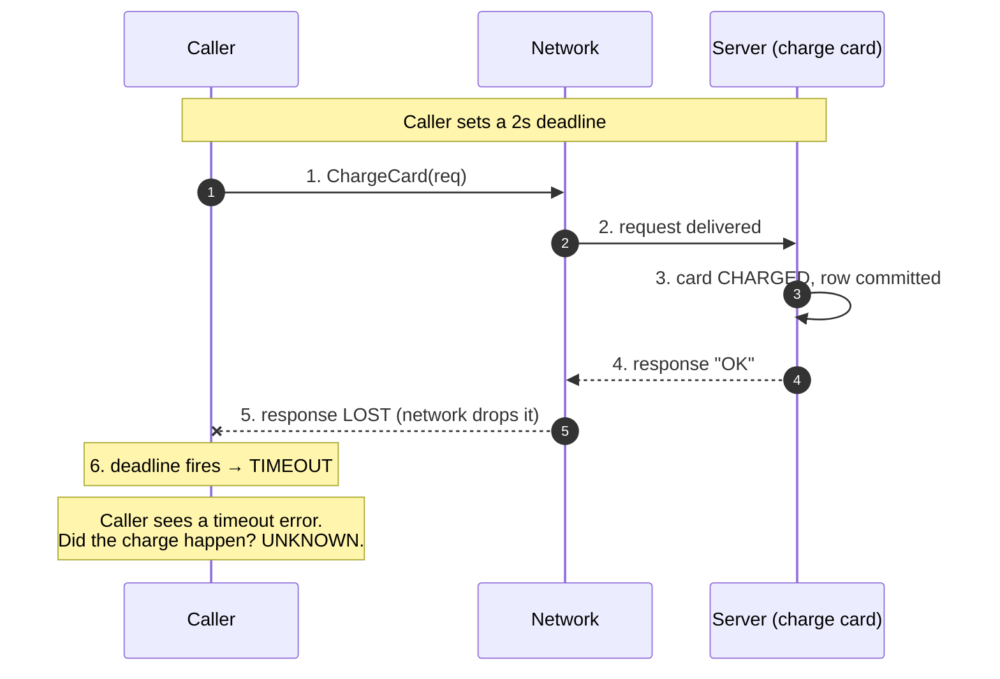

# RPC — Senior

<!-- level-focus -->
At senior level, focus on this question:

> Which system invariant is affected by **RPC** under failure, load, and change?

Use the smallest realistic scenario that exposes the decision and its failure behavior.
## 1. The Leaky Abstraction: Why "Remote Looks Local" Is Dangerous

The founding sin of RPC is that it makes a network call syntactically indistinguishable from a local one. `user := client.GetUser(ctx, id)` looks exactly like a method call. But the two are not the same category of operation, and pretending otherwise leaks in exactly the places that hurt.

A local call and a remote call differ on four axes that no amount of stub generation can hide:

| Property | Local call | Remote call |
|---|---|---|
| Latency | Nanoseconds; predictable | Milliseconds to seconds; long-tailed, variable |
| Failure modes | Process crash, panic (total, observable) | Timeout, partial failure, network partition — **outcome may be unknown** |
| Memory model | Shared address space; pass by reference | Serialize/copy across a boundary; no shared pointers |
| Concurrency & security | Single trust domain, in-process | Untrusted network, auth, replay, resource exhaustion |

The canonical statement of this argument is Jim Waldo, Geoff Wyant, Ann Wollrath, and Sam Kendall's *A Note on Distributed Computing* (Sun Microsystems, 1994). Its thesis: **you cannot paper over the difference between local and remote objects**. The differences in latency, memory access, partial failure, and concurrency are not implementation details to be optimized away later — they are fundamental, and a design that ignores them until "tuning phase" is already wrong. Unifying local and remote under one API produces systems that are either unacceptably fragile (remote objects treated as local) or needlessly slow (local objects paying remote taxes).

The senior takeaway is not "don't use RPC." Modern RPC (gRPC, Thrift, Connect) is an excellent transport for internal service-to-service communication. The takeaway is: **the abstraction is a convenience for the wire format and stub generation, not a promise that remote behaves like local.** Every RPC call site must be written by an engineer who is actively aware that this call can hang, can partially succeed, and can fail in a way that leaves them not knowing what happened.

---

## 2. The Fallacies of Distributed Computing Applied to RPC

The *Fallacies of Distributed Computing* — assumptions first collected by L. Peter Deutsch and colleagues at Sun in the 1990s — are false beliefs that new distributed systems repeatedly encode. RPC frameworks make each fallacy easy to believe because the stub hides the network.

| # | Fallacy | How a naive RPC caller assumes it | What actually bites you |
|---|---|---|---|
| 1 | The network is reliable | No error handling around the call; treat return as guaranteed | Dropped connections, resets; call fails or hangs |
| 2 | Latency is zero | Chatty designs: N sequential calls in a loop | N × RTT dominates; the N+1 problem over the wire |
| 3 | Bandwidth is infinite | Return whole objects, unbounded lists | Large payloads saturate links, blow up tail latency |
| 4 | The network is secure | Plaintext, no authn/authz between services | Lateral movement, spoofed callers, replay |
| 5 | Topology doesn't change | Hardcoded hosts; long-lived pinned connections | Deploys, autoscaling, failover break routing |
| 6 | There is one administrator | Assume uniform config/versions everywhere | Skewed versions during rollout; mismatched contracts |
| 7 | Transport cost is zero | Ignore serialization/marshalling CPU | CPU spent on encode/decode; GC pressure |
| 8 | The network is homogeneous | Assume same MTU, protocols, latency everywhere | Cross-region, cross-cloud paths behave differently |

The two fallacies that most directly poison RPC design are **#1 (reliability)** and **#2 (zero latency)**. Fallacy #1 is why every call needs a timeout, a retry policy, and an idempotency story. Fallacy #2 is why chatty designs — a service that makes one RPC per item in a list — are a scaling trap: what is a cheap loop locally becomes an unbounded latency amplifier remotely.

**Chatty RPC / the N+1 over the network.** A page renders 50 items; the code calls `GetItemDetails(id)` once per item. Locally this is 50 fast function calls. Remotely it is 50 round trips, each subject to tail latency; the page's latency becomes the *slowest* of 50 correlated calls, plus connection and serialization overhead each time. The fix is a batch or streaming API — `GetItemDetailsBatch(ids []ID)` — collapsing 50 round trips into one. Recognizing chatty patterns in a design review is a core senior responsibility.

---

## 3. Partial Failure and the Ambiguous Timeout

Local calls fail *totally and observably*: the function returns, throws, or the process dies. Remote calls introduce a third state that has no local analog: **the call may fail in a way where you do not know whether the work happened.** This is *partial failure*, and it is the defining hazard of RPC.

Consider a payment RPC that times out. Five distinct things could have happened on the wire:



From the caller's side, an error is returned. But that single error conflates outcomes that demand opposite responses:

| What actually happened server-side | Safe to retry? | Wrong response causes |
|---|---|---|
| Request never arrived | Yes | — |
| Request arrived, rejected before side effect | Yes | — |
| Request arrived, **committed**, response lost | **No** | Double charge on retry |
| Request arrived, still processing (slow) | Depends | Duplicate concurrent work |
| Server crashed mid-write | Unknown | Data corruption / duplicate |

**The caller cannot distinguish these from the outside.** A timeout, a connection reset, or a 5xx after the deadline all look the same. This is why "just retry on error" is a dangerous default: retrying case 3 double-charges the customer.

The two properties you must reason about explicitly:

- **Committed-but-unacknowledged.** The server did the work; the caller doesn't know. Any state-changing RPC has this failure mode. Design assuming it *will* happen.
- **Retry safety is not a property of the error — it is a property of the operation.** You cannot decide whether to retry by inspecting the error alone. You decide by knowing whether the operation is idempotent (§4).

The senior discipline: for every state-changing RPC, answer "what happens if the caller times out after we committed?" *before* writing the handler. If the answer isn't "the retry is a no-op," you have a correctness bug waiting for a bad network day.

---

## 4. Idempotency: The Only Safe Way to Retry

Because a timeout is ambiguous (§3), the only way to retry a state-changing RPC safely is to make the operation **idempotent**: executing it once and executing it N times produce the same result and the same side effects.

Reads are naturally idempotent. Some writes are naturally idempotent (`SET balance = 100`, `DELETE user 42`). But the dangerous ones — "charge the card," "increment the counter," "append to the ledger," "send the email" — are not. For these, idempotency must be engineered, almost always with an **idempotency key**.

**Idempotency-key protocol:**

```mermaid
sequenceDiagram
    autonumber
    participant C as Caller
    participant S as Server
    participant K as Idempotency store
    C->>S: 1. Charge(key=uuid-abc, amount=100)
    S->>K: 2. INSERT key uuid-abc if absent
    alt key is new
        K-->>S: 3a. inserted (first time)
        S->>S: 4a. perform charge, store result under key
        S-->>C: 5a. 200 OK (result)
    else key already seen
        K-->>S: 3b. exists → fetch stored result
        S-->>C: 5b. 200 OK (same result, NO re-charge)
    end
    Note over C,S: Caller may retry uuid-abc freely; charge happens at most once
```

Design rules that separate a correct implementation from a broken one:

- **The client generates the key**, once per logical operation, *before* the first attempt — and reuses the *same* key on every retry of that operation. If the server generates it, retries look like new operations and the protocol is useless.
- **Key insertion and the side effect must be atomic** (same transaction) or the side effect must be safely resumable. Otherwise a crash between "charge" and "record key" reopens the double-execution window.
- **Store and return the original response.** A retry must return what the first call returned, not just "already done" — the caller may have lost the first response and still needs the result (e.g., the charge ID).
- **Bound retention with a TTL** aligned to the maximum realistic retry window (hours to a day), and document that keys expire.
- **Idempotency is not deduplication of intent.** Two genuinely different charges must use different keys; reusing a key to mean "same operation" is the caller's contract to uphold.

At the framework level, some RPC systems also need idempotency at the *transport* layer: gRPC will not automatically retry a call unless it is marked idempotent/safe, precisely because auto-retrying non-idempotent methods is unsafe. Marking a method idempotent in the service definition is a *promise* the implementation must actually keep.

---

## 5. Deadlines and Their Propagation Across a Call Chain

A timeout is not just a local safety valve; in a multi-hop call graph it is a shared budget that must be propagated. The correct primitive is a **deadline** (an absolute point in time — "finish by 12:00:03.500") rather than a **timeout** (a relative duration — "give up after 2s"). Deadlines compose across hops; relative timeouts do not.

Why absolute deadlines win: if service A gives B a 2s *timeout*, and B spends 800ms before calling C, B must remember to hand C only the remaining ~1.2s. Everyone re-deriving the remainder is error-prone. With an absolute *deadline* stamped once at the edge and passed down (gRPC does this via the deadline propagated in call context), every hop simply checks "is now past the deadline?" and passes the same value onward.

```mermaid
sequenceDiagram
    autonumber
    participant U as User edge (deadline = now+3s)
    participant A as Service A
    participant B as Service B
    participant C as Service C (slow DB)
    U->>A: 1. request, deadline T = now+3000ms
    A->>B: 2. call, propagate deadline T (t+50ms)
    B->>C: 3. call, propagate deadline T (t+900ms)
    Note over C: 4. DB slow; clock passes T
    C--xB: 5. DEADLINE_EXCEEDED (stop work)
    B--xA: 6. propagate DEADLINE_EXCEEDED
    A--xU: 7. return error before wasting more work
    Note over U,C: One deadline governs the whole chain;<br/>C stops instead of computing a result nobody will read
```

Senior-level rules for deadlines:

- **Set the deadline at the edge**, derived from the user-facing SLO, and propagate it inward. Internal services should honor the incoming deadline, not invent generous local ones.
- **Every hop shrinks the effective budget.** By the time a request reaches a deep leaf, little time may remain — leaf services must check the deadline *before* starting expensive work, not just when returning.
- **Deadline exceeded should cancel downstream work.** Propagating cancellation (gRPC cancels the context on deadline) prevents *work amplification*: a leaf grinding on a query for a response the caller already abandoned. Abandoned-but-still-running work is a classic cause of overload spirals.
- **Never use unbounded / infinite deadlines** on internal RPCs. A call with no deadline is a call that can hang forever, pinning a connection and a goroutine/thread; enough of them and the service exhausts its concurrency and falls over. "No deadline" is a resource leak with extra steps.
- **Budget for retries inside the deadline.** If you allow one retry, the retry must also fit under the original deadline, or you must shrink per-attempt timeouts so total ≤ deadline.

---

## 6. Retries Done Right: Budgets, Backoff, and Hedging

Retries are the natural response to fallacy #1, and the natural way to turn a localized blip into a self-inflicted outage. The failure mode is the **retry storm / cascading failure**: a dependency slows down, every caller retries, retries multiply the load 2–3×, the dependency slows further, more retries — a positive feedback loop that keeps the system down long after the original trigger cleared.

Rules that keep retries from becoming the incident:

- **Retry only idempotent operations** (§4). For non-idempotent ones, either make them idempotent or do not retry — surface the ambiguous error to a human/compensation flow.
- **Retry only retryable errors.** `UNAVAILABLE`, `DEADLINE_EXCEEDED` (on a safe op), connection reset — retry. `INVALID_ARGUMENT`, `NOT_FOUND`, `PERMISSION_DENIED` — retrying just repeats a guaranteed failure and wastes budget.
- **Exponential backoff with jitter.** Fixed-interval retries synchronize callers into thundering herds. Full jitter (`sleep = random(0, base·2^attempt)`) spreads retries out and is the single most effective anti-storm measure.
- **Retry budgets, not fixed counts.** Cap retries as a *fraction* of total requests (e.g., allow retries to add at most 10–20% traffic). When a dependency is broadly failing, a global budget stops the amplification that per-call "retry 3 times" cannot.
- **Circuit breakers.** After a threshold of failures, trip open and fail fast for a cooldown, giving the dependency room to recover instead of hammering it.
- **Bound total attempts by the deadline** (§5), never by count alone.

**Hedging** (a related but distinct technique): for read-only, idempotent calls with a long tail, send a second request after a short delay (e.g., p95 latency) and take whichever returns first, cancelling the loser. This trades a little extra load for dramatically better tail latency — but it is only safe for idempotent operations and must respect the retry budget, or it becomes a self-inflicted load multiplier.

---

## 7. Schema Evolution and Versioning of RPC Contracts

An RPC contract is a *shared, versioned interface* between independently deployed services. Because caller and callee deploy at different times, **you never control both ends at once** — during any rollout, old and new versions coexist (fallacy #6: there is not one administrator). Every contract change must therefore preserve wire compatibility across a rolling window.

**Backward compatibility** (new server, old clients still work) and **forward compatibility** (old server tolerates new clients) are both required for zero-downtime rollout. Schema-based systems like Protocol Buffers are engineered for this, but only if you follow the rules:

- **Never reuse or renumber field tags.** In protobuf the field *number* is the wire identity. Deleting a field means *reserving* its number (`reserved 5;`) so it is never reused — a reused tag makes an old client misread a new field as the old one, silently corrupting data.
- **Only add optional fields.** New fields must be optional with sensible defaults; unknown fields are ignored by old readers (forward compat) and absent fields read as defaults by new readers (backward compat).
- **Never change a field's type or semantics under the same tag.** Changing `int32` to `string`, or repurposing "status" from an enum to a bitmask, breaks every peer that hasn't redeployed. Add a new field instead and deprecate the old.
- **Additive-only enums.** Adding an enum value can break old code that assumes exhaustive matching; handle an `UNKNOWN`/default case from day one, and never renumber existing values.
- **Removing an RPC method or a required parameter is a breaking change** — it requires a versioned service (`v2`) and a deprecation window where both run in parallel.

**Breaking vs non-breaking, at a glance:**

| Change | Safe (non-breaking) | Breaking — needs new version + migration |
|---|---|---|
| Add optional field | ✅ | |
| Remove field (with `reserved` tag) | ✅ | |
| Add new RPC method | ✅ | |
| Add enum value (with unknown handling) | ✅ | |
| Rename field (wire uses tags, not names) | ✅ (proto) | ⚠️ if using name-based (JSON) |
| Change field type / tag number | | ✅ |
| Make optional field required | | ✅ |
| Remove or rename an RPC method | | ✅ |
| Tighten validation (reject previously valid input) | | ✅ |

Versioning strategy at scale: prefer **additive evolution within a single service version** for as long as possible; reserve major version bumps (`FooService/v2`) for genuinely incompatible redesigns, run v1 and v2 in parallel, migrate callers, then decommission v1. Enforce all of this in CI with a **schema compatibility check** (e.g., Buf breaking-change detection) so a breaking edit fails the build rather than the production rollout.

---

## 8. Coupling: RPC vs REST vs Messaging

RPC's ergonomics come at a cost: it is the **tightest coupling** of the mainstream inter-service styles. The caller knows the callee's identity, must reach it *right now*, blocks on the response, and shares a compiled contract. That is great for latency and clarity and bad for autonomy and resilience. Choosing between RPC, REST, and asynchronous messaging is fundamentally a choice about *how tightly you want services bound together*.

| Dimension | RPC (gRPC/Thrift) | REST (HTTP/JSON) | Messaging (queue / event bus) |
|---|---|---|---|
| Coupling | Tight (action-oriented, shared IDL) | Medium (resource-oriented, self-describing) | Loose (fire-and-forget, broker between) |
| Temporal coupling | High — callee must be up now | High — callee must be up now | Low — broker buffers; callee can be down |
| Interaction | Synchronous request/response | Synchronous request/response | Asynchronous, often one-to-many |
| Contract | Compiled schema (proto), method-based | URL + verbs + media type, resource-based | Message/event schema; producer ≠ consumer aware |
| Failure semantics | Caller sees the failure directly | Caller sees the failure directly | Failure decoupled; retries/DLQ at broker |
| Latency | Lowest (binary, HTTP/2, streaming) | Medium (text, HTTP/1.1 or 2) | Higher end-to-end, but non-blocking |
| Best for | Internal service-to-service, high volume | Public/external APIs, browser clients | Decoupling, fan-out, load leveling, events |
| Backpressure | Flow control (HTTP/2), streaming | Limited | Natural — queue depth absorbs bursts |

Decision guidance a senior applies:

- **Use RPC for internal, high-volume, low-latency, request/response** between services you control and version together — where the tight coupling is acceptable and the performance and codegen pay off.
- **Use REST for external and browser-facing APIs**, where self-describing resources, cacheability, ubiquitous tooling, and loose client coupling matter more than raw throughput.
- **Use messaging when you need temporal decoupling** — the producer must not block on the consumer, the consumer may be down, you need fan-out to many consumers, or you need load leveling to absorb bursts. Events also invert the dependency: the producer need not even know who consumes.

A recurring senior anti-pattern is **using synchronous RPC where an event belongs**: service A calls B, B calls C, C calls D, all synchronously, so the user request's availability is the *product* of every hop's availability and its latency is the *sum*. Replacing a deep synchronous RPC chain with asynchronous events (or at least isolating non-critical hops behind a queue) breaks the temporal coupling and the availability-multiplication trap. RPC is not free of coupling just because it is fast.

---

## 9. Streaming and Backpressure

Modern RPC (gRPC over HTTP/2) supports **streaming**: server-streaming (one request, many responses), client-streaming (many requests, one response), and bidirectional streaming. Streaming is the right tool for large or open-ended data — a live feed, a large result set, a chat channel — where a single unary call would either buffer an unbounded payload or force the chatty N-round-trip pattern (§2).

But streaming reintroduces a hazard unary calls mostly avoid: a **fast producer overwhelming a slow consumer**. Without control, the server pushes messages faster than the client can process, and buffers grow until memory is exhausted — an OOM crash or a latency collapse. The mechanism that prevents this is **backpressure**: the consumer signals how much it can accept, and the producer slows to match.

- **HTTP/2 flow control** provides transport-level backpressure: per-stream and per-connection windows mean the server cannot send more than the client has advertised it can buffer. gRPC surfaces this — if the client stops reading, the write side of the stream blocks rather than infinitely buffering.
- **Do not defeat it with your own unbounded buffer.** Reading messages off the stream into an in-memory queue "to process later" reintroduces the exact OOM you were protected from. Process (or bound the queue and block) at the pace the consumer can sustain.
- **Bound concurrency, not just buffers.** Streaming a million rows and spawning a goroutine/task per row is unbounded fan-out; use a worker pool sized to the downstream's capacity.
- **Deadlines still apply to streams** — a long-lived stream needs a keepalive and a maximum lifetime, or a stuck consumer pins the stream forever (the §5 resource-leak problem, extended in time).

Streaming is a scaling tool *only* when backpressure is honored end-to-end; without it, it is a memory bomb with good latency numbers until it isn't.

---

## 10. Failure Catalog and Senior Checklist

**Failure catalog — the incidents RPC causes when the abstraction is trusted too much:**

| Failure mode | Root cause | Mitigation |
|---|---|---|
| Double charge / duplicate side effect | Retried a non-idempotent call after ambiguous timeout (§3) | Idempotency keys; retry only idempotent ops (§4) |
| Retry storm → cascading outage | Fixed-count retries + no jitter under a dependency blip (§6) | Backoff+jitter, retry budgets, circuit breakers |
| Request hangs forever | No deadline; unbounded call pins resources (§5) | Mandatory deadlines, propagated from the edge |
| Chatty RPC / N+1 over the wire | One call per item; fallacy of zero latency (§2) | Batch/streaming APIs |
| Availability multiplication | Deep synchronous RPC chain; product of uptimes (§8) | Async events for non-critical hops; shorten chains |
| Rollout breaks callers | Breaking schema change (renumber/type change) (§7) | Additive evolution, reserved tags, CI compat check |
| OOM under streaming | Fast producer, slow consumer, no backpressure (§9) | HTTP/2 flow control; bounded buffers and concurrency |
| Work amplification | Deadline-exceeded work not cancelled downstream (§5) | Propagate cancellation on deadline |

**Senior checklist — apply at every state-changing RPC call site and in every design review:**

- [ ] Every RPC has an explicit, bounded deadline, propagated from the edge — no infinite calls.
- [ ] For each state-changing method, "what if the caller times out after we committed?" is answered, and the answer is idempotent-safe.
- [ ] Idempotency keys are client-generated, reused across retries, and stored atomically with the side effect.
- [ ] Retries are limited to idempotent ops and retryable errors, use backoff+jitter, and are bounded by a budget and the deadline — not a raw count.
- [ ] Circuit breakers guard downstream dependencies; a slow dependency fails fast, not everywhere at once.
- [ ] No chatty N+1 patterns; list-shaped access uses batch or streaming APIs.
- [ ] Schema changes are additive-only or gated behind a version bump; a CI breaking-change check enforces it.
- [ ] Synchronous RPC chains are shallow; non-critical or fan-out hops are moved to asynchronous messaging.
- [ ] Streaming paths honor backpressure end-to-end; no unbounded in-memory buffering.
- [ ] Every call site is written by someone who knows this is a *remote* call — timeout, partial failure, and ambiguous outcome are handled, not assumed away (Waldo, 1994).

*Next step:* [RPC — Professional](professional.md)

---

## Apply it

1. State the system invariant that **RPC** must protect.
2. Mark ownership, state, and failure propagation at each boundary.
3. Compare two designs under load, dependency failure, and future change.
4. Define recovery and compatibility behavior before implementation.
5. Test the riskiest assumption with a focused experiment.

## Verify your work

- The experiment supports the design with evidence, not preference.
- Failure injection shows the blast radius and recovery path.
- Compatibility checks cover old and new callers or data.
- Operational signals reveal invariant violations and recovery progress.

## Review questions

- Which invariant must remain true when RPC fails?
- Where should recovery responsibility live, and why?
- Which assumption deserves an experiment before implementation?
- How can the design evolve without changing every consumer at once?
