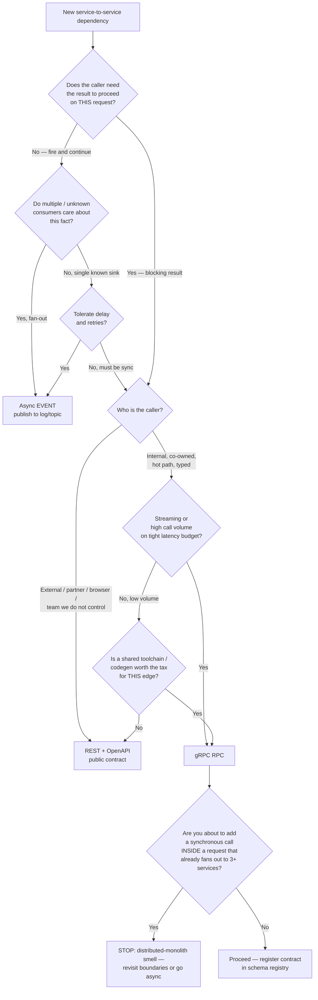
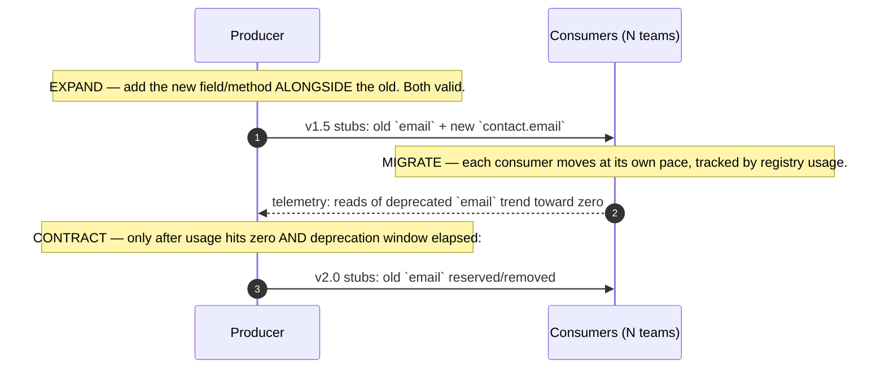
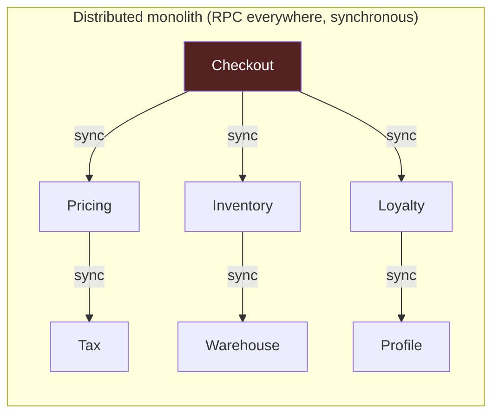
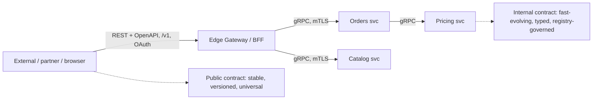

# RPC — Staff

> **Axis:** organizational scope & judgment — NOT deeper mechanism (that is `professional.md`).
> This file answers: how does a Staff/Principal engineer decide *whether the organization
> should default to RPC at all*, govern the shared contracts that make RPC scale (or rot),
> and recognize the moment "just call the service" has quietly rebuilt the monolith over the
> network? The mechanism (stubs, marshalling, transports) is settled by senior. The question
> here is which failure mode you are trading into, across dozens of teams, over years.

---

## Table of Contents

1. [The Real Decision Is a Coupling Decision](#1-the-real-decision-is-a-coupling-decision)
2. [Three Interaction Styles as an Org Default](#2-three-interaction-styles-as-an-org-default)
3. [The Style-Selection Decision Tree](#3-the-style-selection-decision-tree)
4. [Governing the Shared IDL / Schema Registry](#4-governing-the-shared-idl--schema-registry)
5. [A Breaking-Change Policy That Scales Across Teams](#5-a-breaking-change-policy-that-scales-across-teams)
6. [The Versioning & Coupling Tax of RPC at Org Scale](#6-the-versioning--coupling-tax-of-rpc-at-org-scale)
7. [The Distributed Monolith: RPC's Failure Mode](#7-the-distributed-monolith-rpcs-failure-mode)
8. [Internal RPC vs Public REST — Two Different Contracts](#8-internal-rpc-vs-public-rest--two-different-contracts)
9. [Cost, ROI, and the Total Coupling Ledger](#9-cost-roi-and-the-total-coupling-ledger)
10. [Rollout, Migration, and Reversibility](#10-rollout-migration-and-reversibility)
11. [When NOT to Reach for RPC](#11-when-not-to-reach-for-rpc)
12. [Second-Order Consequences & Signals to Watch](#12-second-order-consequences--signals-to-watch)
13. [Staff Checklist](#13-staff-checklist)

---

## 1. The Real Decision Is a Coupling Decision

At junior/middle levels, "RPC vs REST vs messaging" reads as a performance-and-ergonomics
question: gRPC is faster, has codegen, streams, HTTP/2 multiplexing; REST is universal; queues
are async. All true, and all nearly irrelevant to the Staff decision.

The Staff-level reframing: **each interaction style is a different default posture on temporal
and schema coupling between two teams.** You are not picking a wire format. You are picking
*who has to be online when*, *who breaks whom on a schema change*, and *how tightly two org
units are bound to ship in lockstep*.

```text
Temporal coupling  — must the callee be up, right now, for the caller to make progress?
Schema  coupling   — does the caller encode knowledge of the callee's data shape at build time?
Flow    coupling    — does the caller know WHICH callee to invoke (point-to-point) vs. emitting
                       a fact and not caring who consumes it?

RPC (gRPC):   HIGH temporal, HIGH schema, HIGH flow  → tight, fast, request/response
REST:         HIGH temporal, MED  schema, HIGH flow  → tight, evolvable, universal reach
Async events: LOW  temporal, MED  schema, LOW  flow  → loose, resilient, eventually consistent
```

The performance win of RPC is real but it is the *smallest* of the axes. A Staff engineer who
sells gRPC to the org on "it's faster than JSON" has mis-stated the decision and will be
surprised in eighteen months when the org cannot ship a field without a four-team migration.
The right sentence is: *"We are choosing to accept high temporal and schema coupling here
because these two services are on the same request's critical path and share an ownership
boundary; we are refusing it there because those two teams must ship independently."*

The Fallacies of Distributed Computing (Deutsch/Gosling) are the underwater half of this:
RPC's syntactic transparency — a remote call *looks* like a local one — actively hides latency,
partial failure, and bandwidth. That transparency is the ergonomic selling point and the
architectural trap in the same breath.

---

## 2. Three Interaction Styles as an Org Default

Setting an org *default* is different from making one call site's decision. A default is the
thing that happens when a team doesn't think hard — the path of least resistance encoded into
templates, service scaffolds, the platform team's golden path, and code review reflexes.
Whatever you make cheapest is what you will get thousands of times.

| Dimension | Internal RPC (gRPC) | Public / Partner REST | Async Events (log/queue) |
|---|---|---|---|
| Primary use | Typed, high-perf service-to-service on the hot path | External/partner/public API, browser-reachable | Decoupling, fan-out, integration, buffering |
| Temporal coupling | High — callee must be up, on the request | High — same | Low — producer & consumer never co-online |
| Schema coupling | High — generated stubs, compile-time contract | Medium — negotiable via media types, tolerant readers | Medium — schema on the event, tolerant consumers |
| Flow coupling | High — caller names the callee & method | High — caller names the resource | Low — producer emits a fact, N unknown consumers |
| Evolvability | Low without discipline; codegen tempts breaking changes | High — REST/HTTP evolved to be extended by strangers | High — consumers opt in per field; add-only easy |
| Failure blast radius | Cascades along the call graph (sync) | Cascades, but caller is often a human client | Isolated — consumer lag, not caller failure |
| Latency (p50 hot path) | Best — binary, HTTP/2, no re-parse | Higher — JSON parse, text framing, connection churn | N/A on hot path — async by construction |
| Discoverability by strangers | Poor — need the .proto and toolchain | Excellent — curl, browser, universal tooling | Medium — need the schema registry + topic catalog |
| Right default for | Same-domain, co-owned services, mesh interior | The org's edge / anything a non-owning team consumes | Cross-domain integration, workflows, audit, ETL |

The Staff move is to make these **three defaults explicit** rather than let one style win by
inertia. A common healthy posture in a large Go/JVM backend org:

- **gRPC** is the default *inside a bounded context* / between co-owned services on the hot path.
- **REST (+ OpenAPI)** is the *mandatory* style at any boundary a team you don't control will
  consume — public, partner, and often cross-team-internal too, because it degrades gracefully
  and needs no shared toolchain.
- **Events** are the default for anything that can tolerate eventual consistency, especially
  cross-domain integration, because they are the only style that structurally *reduces*
  coupling instead of managing it.

---

## 3. The Style-Selection Decision Tree



The two most valuable nodes are the ones people skip. The `B → No` branch (does the caller
*actually* need the result now?) reclaims an enormous amount of accidental synchronous coupling:
most "call the service" instincts are really "notify that something happened," which is an event.
The `K` node is the distributed-monolith tripwire — a call graph that already fans out synchronously
to several services is a design that has chosen to multiply its unavailability, and one more RPC
edge makes it worse (see §7).

---

## 4. Governing the Shared IDL / Schema Registry

Once RPC is an org default, the `.proto` files (or Avro/Thrift IDL) become **the most
consequential shared artifact in the company** — more than any single service's code. They are
the org's API surface, distributed across every consumer's build. Ungoverned, they become the
tightest, most brittle coupling you own. This is the Staff engineer's actual leverage point.

**Where the contracts live is an org decision, not a tooling one:**

```text
Anti-pattern: each team keeps its .proto next to its service, copy-pasted into consumers.
  → No single source of truth. Skewed copies. "Which version does prod actually run?"
  → Breaking changes discovered at runtime, in someone else's service, at 3am.

Better: a central schema registry / contract repo as the authority.
  Options in practice:
    - A mono-repo `proto/` (or `schemas/`) directory, single owner, PR-reviewed,
      publishing generated stubs as versioned packages per language.
    - A dedicated schema registry (Confluent Schema Registry for Avro/Protobuf events;
      Buf Schema Registry for gRPC protos) enforcing compatibility on push.
  The non-negotiable: ONE authoritative copy, machine-checked compatibility, and
  generated artifacts consumers depend on — never hand-copied IDL.
```

```mermaid
sequenceDiagram
    autonumber
    participant Dev as Producer team
    participant CI as CI / Registry gate
    participant Reg as Schema Registry
    participant Con as Consumer teams
    Dev->>CI: 1. PR changes payments.proto (add field 7)
    CI->>Reg: 2. buf breaking / compat check vs published version
    Reg-->>CI: 3. COMPATIBLE (field added, not renumbered)
    CI-->>Dev: 4. green — merge allowed
    Reg->>Con: 5. publish stubs v1.4 (additive)
    Note over Con: consumers upgrade on their own schedule; old stubs still valid
    Dev->>CI: 6. PR renumbers field 3 → field 8 (BREAKING)
    CI->>Reg: 7. compat check
    Reg-->>CI: 8. INCOMPATIBLE — blocked
    CI-->>Dev: 9. red — requires new package version + deprecation plan (see §5)
```

**Registry governance the Staff engineer must define (not the platform team alone):**

- **Compatibility mode is a policy, not a default.** For gRPC, enforce *backward compatibility*
  by machine (e.g. `buf breaking`) on every push. Field numbers are immutable; deletions become
  `reserved`; the wire is only ever extended. This is the single rule that lets thousands of
  deploys proceed without lockstep.
- **Ownership is explicit.** Every message/service has an owning team in `CODEOWNERS`. A change
  to a widely-consumed contract cannot merge on the producer team's approval alone.
- **The registry is the source of truth for who-consumes-what.** Consumer registration (or
  build-graph analysis) turns "who breaks if I touch this field?" from a Slack archaeology
  exercise into a query — this is the prerequisite for *any* safe evolution.
- **Golden path integration.** The service scaffold pulls generated stubs from the registry;
  hand-writing message types or copying protos fails CI. Governance only holds if the compliant
  path is the *easiest* path.

---

## 5. A Breaking-Change Policy That Scales Across Teams

The core insight: **at org scale you cannot coordinate a synchronous flag-day across N teams.**
Any policy that requires "all consumers upgrade at once" does not scale past a handful of
services. The only workable regime is *always additive, expand-then-contract, deprecate-with-a-clock.*

```text
NON-BREAKING (always allowed, machine-verified):
  - Add a new field (new field number).            - Add a new RPC method.
  - Add a new enum value (if consumers handle UNKNOWN — design for it from day 1).
  - Add a new message / service.

BREAKING (blocked by CI; only via the expand/contract dance below):
  - Change/reuse a field number.                   - Change a field type or cardinality.
  - Rename a field in a way clients depend on.     - Remove a field / method / enum value.
  - Tighten a semantic contract (e.g. a field that was optional becomes required).
```

**Expand → Migrate → Contract (the only safe way to make a "breaking" change):**



**The policy a Staff engineer writes down and enforces:**

- **Deprecation has a clock, not a vibe.** A deprecated field carries a documented removal date
  (e.g. two release trains / 90 days) and a `deprecated = true` marker. No clock → it never dies,
  and the contract accretes forever.
- **Removal requires evidence of zero use**, sourced from registry/telemetry, not from asking.
  "I think nobody uses it" is how you page four teams.
- **Never coordinate a flag-day.** If a change *cannot* be made additive, that is a signal the
  boundary is wrong (see §7), not a reason to schedule an all-hands migration.
- **The producer owns the migration cost, not the consumers.** Whoever forces the breaking
  change runs the expand/contract, writes the migration guide, and watches the telemetry. Pushing
  that cost onto N consumer teams is how RPC coupling becomes an org-wide tax nobody signed up for.

This is why REST/HTTP is often the *safer* default at boundaries you don't control: HTTP media
types, tolerant readers, and "ignore unknown fields" were designed for evolution-by-strangers.
gRPC *can* achieve the same discipline, but only because the registry *forces* it; left to
codegen ergonomics, teams will happily renumber a field and break prod.

---

## 6. The Versioning & Coupling Tax of RPC at Org Scale

Every interaction style has a running cost. RPC's is **paid continuously in coordination**, and
it grows super-linearly with the number of teams sharing contracts.

```text
The tax line-items:
  - Stub distribution: every consumer rebuilds & redeploys to pick up a new contract package.
    A 200-service org means a "trivial" field addition is a 200-build ripple if not additive.
  - Cross-language codegen: proto → Go, Java, Python, TS. Each language's generator has quirks
    (nullability, zero-values, enum handling). A single IDL, five subtly different runtime shapes.
  - Version-skew windows: during any rollout, producer vN and consumer vN-1 coexist. The wire
    MUST tolerate this — which is exactly why additive-only is non-negotiable.
  - The transparency tax: because a remote call looks local, engineers forget to budget for
    timeouts, retries (with idempotency! — see 08-idempotent-operations), circuit breakers,
    and backpressure on EVERY edge. Missing these is invisible until a partial failure.
  - Toolchain lock-in: the org now depends on the proto compiler, the registry, the codegen
    plugins, and their upgrade cadence. This is real, ongoing platform-team headcount.
```

The tax is *worth paying* when the coupling is real anyway — two co-owned services on the same
request's hot path are already tightly bound; RPC just makes that binding typed and fast. The tax
is *pure waste* when it's imposed on relationships that didn't need to be synchronous or shared:
that's where a Staff engineer earns their title by saying "this should be an event, and then
there is no contract to version across teams at all."

A useful heuristic: **the cost of a shared RPC contract scales with the number of teams that must
agree on it, not the number of calls that flow across it.** High call volume between two teams is
cheap to govern; a low-volume contract touched by twelve teams is a governance nightmare. Optimize
your contract topology for *few owners per contract*, not for call throughput.

---

## 7. The Distributed Monolith: RPC's Failure Mode

RPC's ergonomics — "just call the other service, it's a typed function" — are precisely what
produce a distributed monolith: a system that has all the *coupling* of a monolith (lockstep
deploys, shared-fate availability, cascading failures) but *none* of its benefits (in-process
calls, single transaction, one deploy, a stack trace that crosses the whole call). You paid the
network's cost and kept the monolith's constraints. It is the worst quadrant.



```text
Availability math that kills you:
  A single checkout request now depends synchronously on 6 services.
  If each is independently 99.9% available, the request's success ceiling is
  0.999^6 ≈ 99.4%  → 5.9x more downtime than any single service, before you add
  latency (sum of the critical path) and retry storms (which amplify load during the
  very incident you're trying to survive). RPC made adding each edge feel free — so
  teams added them — and the aggregate is a system less available than the monolith
  it replaced.
```

**Staff-level tells that RPC has built a distributed monolith:**

- A single user action fans out synchronously to a deep call graph (the §3 `K` tripwire).
- Services cannot be deployed independently — a change requires coordinating releases across
  teams because the contracts are effectively shared internal function signatures.
- A shared `.proto` (or "common types" package) is imported by nearly everyone; touching it
  rebuilds the org.
- Every incident's blast radius spans many teams because failure propagates along sync edges.
- "Add a field" is a multi-team ticket.

**The remedies are boundary work, not RPC tuning:**

- **Re-draw service boundaries around business capabilities**, so most interactions are *within*
  a bounded context (RPC fine there) and *between* contexts they become async events.
- **Convert non-blocking calls to events.** Most "call service X" is "tell the org that Y
  happened" — an event that decouples temporally, removes the sync failure edge, and deletes a
  cross-team contract.
- **Introduce asynchrony at the seams** (queues, outbox, sagas — see event-driven sections),
  trading strong consistency for availability where the business actually tolerates it.
- **Break up god-contracts** into per-boundary contracts with single owners.

The judgment: RPC is not the villain — *synchronous RPC as the reflexive default across domain
boundaries* is. Keep it dense inside a bounded context; make it rare and deliberate across them.

---

## 8. Internal RPC vs Public REST — Two Different Contracts

A recurring Staff error is treating "our API" as one thing. There are two contracts with opposite
optimization targets, and conflating them causes real damage in both directions.

| | Internal RPC contract (gRPC) | Public / partner contract (REST) |
|---|---|---|
| Audience | Teams you influence, shared toolchain | Strangers, browsers, third parties |
| Optimize for | Throughput, typed ergonomics, evolution *with cooperation* | Stability, universality, evolution *without cooperation* |
| Breaking changes | Possible via coordinated expand/contract (§5) | Effectively forbidden — you can't coordinate strangers |
| Versioning | Registry compat checks; additive; deprecation clock | Explicit `/v1 /v2`, long-lived, sunset with headers/policy |
| Discoverability | .proto + codegen; poor for outsiders | curl-able, OpenAPI, self-descriptive |
| Auth model | mTLS / mesh identity, internal trust | OAuth/API keys, rate limits, quotas, abuse defense |
| Change cadence | Fast, continuous | Slow, deliberate, contractually constrained |

**The pattern that resolves it: an explicit edge.** Do *not* expose internal gRPC services
directly to the outside. Put a translation layer (an API gateway / BFF / edge REST façade) at the
boundary. Inside the wall: typed gRPC, fast evolution, mesh identity. Outside: a curated,
versioned, stable REST/HTTP surface designed to be consumed by people who will never read your
proto and can never be asked to redeploy.



This is why "gRPC vs REST" is a false dichotomy at the org level: mature orgs run **both, on
purpose, separated by an edge** — REST *is* the public contract, gRPC *is* the internal one, and
the gateway is where they meet. (gRPC-Web/transcoding can bridge browser clients, but that's a
tactic, not a substitute for a deliberate public REST surface.)

---

## 9. Cost, ROI, and the Total Coupling Ledger

The bill for an org RPC strategy is not the wire's CPU savings; it's dominated by coordination.

```text
Total cost of an RPC-default posture =
    platform cost   (registry, codegen, proto toolchain, upgrades — real headcount)
  + per-edge cost   (timeouts/retries/circuit-breakers/observability on every sync call)
  + coordination    (expand/contract migrations, cross-team deprecations, version-skew mgmt)
  + failure cost    (blast-radius incidents from synchronous coupling)
  MINUS
    latency/CPU savings on the hot path (real, but the smallest term for most orgs)
    typed-contract savings (fewer integration bugs, codegen'd clients — genuinely valuable)

Break-even reasoning:
  RPC pays off where the coupling is INHERENT — co-owned services, hot path, high volume,
  shared release cadence. There, typing + perf are pure upside and coordination is cheap
  (few owners).
  RPC LOSES where you imposed coupling that didn't exist — cross-domain, low-volume,
  many owners. There the coordination + failure terms dominate and an event would have
  cost near zero to evolve.
```

The unit-economics lens most Staff engineers miss: **measure cost per contract-change, not cost
per request.** A design where a field addition ships in one build is cheap regardless of QPS; a
design where it triggers a twelve-team migration is expensive regardless of how blazing the wire
is. The ROI of good contract topology (few owners, additive-only, edge-separated) shows up as
*change velocity that doesn't degrade as the org grows* — the metric that actually correlates
with engineering throughput at scale.

---

## 10. Rollout, Migration, and Reversibility

Adopting (or retreating from) an RPC default is itself a multi-team, multi-quarter migration —
apply the org's migration discipline, not a big-bang rewrite.

- **Reversibility / doors.** Choosing gRPC *for one internal edge* is a two-way door — cheap to
  undo. Choosing gRPC *as the org default*, standing up a registry, and generating clients into
  200 services is a one-way door: the coupling and toolchain become load-bearing. Fund the
  registry and governance *before* the default spreads, or you'll retrofit governance onto sprawl.
- **Strangler at the edge.** To introduce a public REST surface over existing internal RPC,
  stand up the gateway and migrate endpoints incrementally behind it; never flip everything.
- **Contract-first, always.** New edges start from the IDL in the registry with compat checks
  wired into CII from commit one. Retrofitting a registry after protos have sprawled is the
  single most common and painful cleanup.
- **Exit path from a distributed monolith** is boundary-and-async work (§7), executed
  service-by-service: pick the worst sync fan-out edge, convert it to an event, watch availability
  improve, repeat. It is slow and it is the highest-leverage reliability work you will do.

---

## 11. When NOT to Reach for RPC

- **Across bounded-context / domain boundaries by default.** This is the road to the distributed
  monolith (§7). Prefer events; use sync RPC across a boundary only when the business genuinely
  needs an immediate answer and you accept the availability multiplication.
- **When the caller doesn't need the result now.** If it's really a notification, it's an event.
  Synchronous RPC here buys you coupling and a failure edge for nothing.
- **At any boundary consumed by teams/parties you can't coordinate** — public, partner, or even
  distant internal teams. REST's evolvability-by-strangers wins; a shared proto becomes a lockstep
  liability (§8).
- **When you cannot fund the registry + governance.** Ungoverned RPC is *worse* than REST: it has
  higher coupling and none of the discipline that makes coupling survivable. No registry, no gRPC
  default.
- **For low-volume, many-owner integrations.** The coordination tax dwarfs any perf win (§6/§9).
- **When teams lack the operational maturity for partial failure** — if timeouts, retries with
  idempotency, and circuit breakers aren't reflexive, RPC's transparency will hide the failure
  modes until an incident. Fix the discipline before spreading the default.
- **As a synchronous substitute for a transaction across services.** RPC does not give you
  atomicity; it gives you a distributed failure to reason about. Use sagas / outbox / eventual
  consistency.

---

## 12. Second-Order Consequences & Signals to Watch

**Downstream effects, 6–18 months out:**

- **Conway's Law feedback.** The RPC call graph *becomes* the org chart, and vice versa. A dense
  internal RPC mesh calcifies team boundaries: teams that call each other synchronously start
  shipping together. If team structure is wrong, RPC will faithfully encode and harden the mistake.
- **Contract gravity.** Widely-consumed contracts stop being able to change; the registry fills
  with `reserved` fields and deprecated methods that never die because no clock was set (§5). The
  IDL becomes a fossil record of every past decision.
- **Cognitive load migration.** Codegen makes *writing* a client trivial and makes *operating*
  the edge (retries, timeouts, backpressure, skew) invisible — so load silently moves from build
  time to 3am. Teams adopt more sync edges than they can operationally afford.
- **Observability debt.** A deep sync call graph is undebuggable without distributed tracing;
  orgs that adopt RPC-default without tracing discover this during their first cross-service
  latency incident.

**The signal that the decision is going wrong** — the single metric a Staff engineer watches:
**"cost to add a field" and "cost to deploy one service independently."** If adding a field to a
common contract requires coordinating multiple teams, or if services can no longer be released on
their own cadence, the RPC default has produced a distributed monolith and it's time for boundary
work (§7) — regardless of how good the p99 looks.

---

## 13. Staff Checklist

- [ ] The org has **three explicit interaction defaults** (internal RPC / public REST / events),
      each with a written "use when," not one style winning by inertia.
- [ ] The style decision at each edge is justified as a **coupling choice** (temporal/schema/flow),
      not a performance choice, and captured in an ADR.
- [ ] A **single authoritative schema registry / IDL repo** exists, with machine-enforced
      backward-compatibility checks gating every push — no hand-copied protos.
- [ ] A written **breaking-change policy**: additive-only, expand/migrate/contract, deprecation
      with a *clock* and *zero-use evidence*; producer owns the migration cost.
- [ ] Every contract has an **explicit owning team**; god-contracts consumed by many teams are
      broken up (few owners per contract).
- [ ] Public/partner surfaces are **REST behind an edge gateway**; internal gRPC is never exposed
      directly to parties who can't be coordinated.
- [ ] The **distributed-monolith tripwire** is designed in: sync fan-out depth is watched, and
      non-blocking calls are events, not RPCs.
- [ ] Every sync RPC edge has **timeouts, idempotent retries, circuit breakers, and tracing** as
      table stakes — governed by the golden path, not left to each team.
- [ ] The decision is **reversible-aware**: registry + governance funded *before* the default
      spreads; exit path from over-coupling is documented as boundary/async work.
- [ ] The org watches **"cost to add a field" and "independent-deploy-ability"** as the leading
      indicators that RPC coupling has gone wrong.

*Next step:* [RPC — Interview](interview.md)
