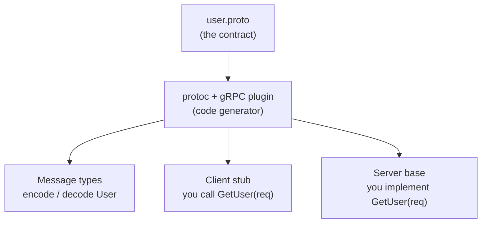
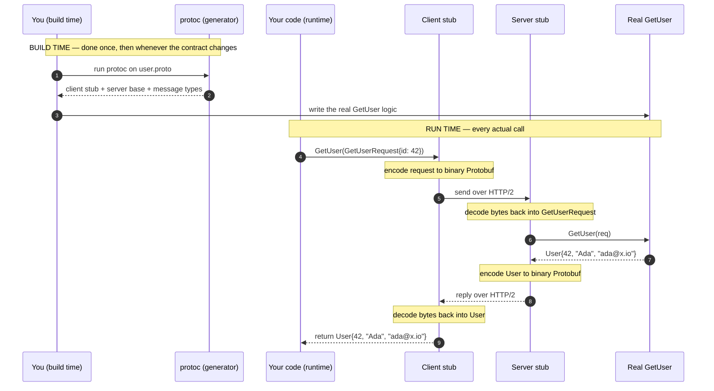

# gRPC — Junior

<!-- level-focus -->
At junior level, focus on this question:

> How can I apply **gRPC** in one small example and prove the result?

Use the smallest realistic scenario that exposes the decision and its failure behavior.
---

## 1. What gRPC actually is

gRPC is an open-source RPC framework originally built at Google and released in 2015 (see [grpc.io](https://grpc.io)). The "g" is often read as "gRPC Remote Procedure Calls" — a recursive joke — but the name is not the point. The point is what it does: it lets a program on one machine call a method on a program on another machine, in *any* supported language, with the call written to look like an ordinary local method call.

Three properties make gRPC distinct from "RPC in general":

- **It uses Protocol Buffers as the contract and wire format.** You describe your service in a `.proto` file, and the same file both generates your code *and* defines the exact bytes that travel. (See the [Protocol Buffers documentation](https://protobuf.dev).)
- **It generates the client and server stubs for you.** You never hand-write the marshalling or the network code. A compiler reads the `.proto` and emits it in your language.
- **It runs over HTTP/2.** Not plain sockets, not HTTP/1.1 — HTTP/2, which gives it multiplexed connections and native support for *streaming* (sending a sequence of messages, not just one request and one reply).

Hold this sentence: **gRPC = Protocol Buffers (describe + encode) + generated stubs (the plumbing) + HTTP/2 (the transport).** Everything else in this file expands one of those three.

---

## 2. The three pieces, and how they fit

It helps to see the three pieces as answers to three questions every remote call must resolve:

| Question the call must answer | gRPC's answer | The piece |
|-------------------------------|---------------|-----------|
| *What* methods exist, and what data do they take and return? | A `.proto` file written in Protocol Buffers | The **contract (IDL)** |
| *Who* writes the code that packs bytes, sends them, and dispatches to the real function? | A code generator (`protoc`) that reads the `.proto` | The **generated stubs** |
| *How* do the bytes physically travel between machines? | Compact binary Protobuf messages carried over HTTP/2 | The **transport** |

You, the engineer, write only two small things by hand: the `.proto` file, and the *real* implementation of each method on the server. gRPC generates and runs the rest. That division of labor is the whole ergonomic promise: describe once, implement the logic, and never touch the networking.

---

## 3. Piece one: the `.proto` file (the contract)

Everything starts with a single file that both the client and the server agree on. It is written in **Protocol Buffers** (Protobuf) syntax and describes two things: the **messages** (the shapes of data) and the **service** (the list of callable methods).

```proto
// user.proto — the shared contract, agreed by client and server
syntax = "proto3";

package userpb;

// A message is a typed record. Each field has a name, a type, and a
// unique number (the "field tag") used to identify it on the wire.
message GetUserRequest {
  int64 id = 1;
}

message User {
  int64  id    = 1;
  string name  = 2;
  string email = 3;
}

// A service is a named group of callable methods (RPCs).
service UserService {
  // One unary method: takes a GetUserRequest, returns a User.
  rpc GetUser(GetUserRequest) returns (User);
}
```

Read it slowly, because three ideas here are the foundation of gRPC:

- **A `message` is a typed data shape.** `User` has an `id`, a `name`, and an `email`. This is the equivalent of a struct or class — but language-neutral, so a Go client and a Python server describe it identically.
- **The field numbers (`= 1`, `= 2`, `= 3`) are the real identity of each field on the wire.** Protobuf does *not* send the field *name* over the network; it sends the *number*. `name = 2` means "field number 2 is the name." This is why Protobuf messages are so compact (more on that in §10), and why you must never reuse or renumber a field once it is in use.
- **A `service` lists the callable methods.** `rpc GetUser(GetUserRequest) returns (User)` declares one method: give it a request, get back a `User`. The word `rpc` is literally in the syntax — each line is one remote procedure.

This file is the *single source of truth*. Change it, and both sides regenerate together. Nothing else in gRPC exists until this file does.

---

## 4. Piece two: code generation (the stubs)

You never write the code that turns `42` into bytes, opens a connection, or receives a reply. Instead you run the Protocol Buffers compiler, **`protoc`** (with the gRPC plugin for your language), over `user.proto`. It reads the contract and emits source code in your target language.

From the one `user.proto` above, the tooling generates:

- **The message types** — a real `GetUserRequest` and `User` class/struct in your language, with the marshalling code (encode to bytes, decode from bytes) already written.
- **The client stub** — an object exposing a `GetUser(request)` method. You call it like a normal method; its generated body marshals the request, sends it over HTTP/2, waits, and returns the decoded `User`.
- **The server stub (base/skeleton)** — an abstract server that receives incoming requests, decodes them, and calls a `GetUser` method that *you* implement with the real business logic (read the database, build the `User`, return it).



The mental picture: **`protoc` is a factory. You feed it one `.proto`; it hands back the client's calling code and the server's receiving code, guaranteed to speak the same bytes because they came from the same contract.** Your job shrinks to (a) calling the client stub, and (b) filling in the server method's real logic.

---

## 5. Piece three: the transport (Protobuf over HTTP/2)

Once you call the client stub, the request has to physically reach the server. gRPC carries it as **binary Protobuf bytes inside HTTP/2 frames**.

Two words matter here — *binary* and *HTTP/2* — and each buys something:

- **Binary Protobuf** is the encoding of the message. Instead of a human-readable text like `{"id": 42}` (as JSON would send), Protobuf sends a small sequence of bytes keyed by field *number*. It is smaller and faster to encode/decode than text. (§10 shows *why*.)
- **HTTP/2** is the connection protocol underneath. It matters for gRPC because HTTP/2 supports **multiplexing** (many calls share one connection at the same time, without one blocking another) and **long-lived streams** (a call can send or receive a *sequence* of messages, not just one). This second property is exactly what makes gRPC's streaming call types possible.

You do not configure any of this by hand. When you make a call, the generated stub speaks Protobuf-over-HTTP/2 for you. The takeaway at this level: **gRPC is fast and streaming-capable because it pairs a compact binary encoding with HTTP/2, rather than text over HTTP/1.1.**

---

## 6. The staged pipeline: from `.proto` to a running call

The three pieces connect into a pipeline. The sequence diagram below stages it in order: first you *build* (write the contract, generate code, implement the server), then at *runtime* a single call flows through the generated stubs and the HTTP/2 transport. Read the `autonumber` steps top to bottom.



Notice the split: steps 1–3 happen *once at build time* and produce code. Steps 4–13 happen *on every call at runtime*. The entire surface *you* see at runtime is steps 4 and 13 — a method called, a value returned. Everything between is the machinery generated from the contract.

---

## 7. A unary call, step by step

A **unary** call is the simplest gRPC call: one request in, one response out — exactly like a normal function call. Let's trace `user := client.GetUser(GetUserRequest{id: 42})` end to end.

1. **You call the client stub.** Your code invokes `GetUser` on the generated client object, passing a `GetUserRequest` with `id = 42`. This looks and behaves like a local method call.
2. **The stub encodes (serializes) the request.** It converts the `GetUserRequest` into compact binary Protobuf — a few bytes keyed by field number, not a text string.
3. **The stub sends over HTTP/2.** It hands the bytes to the HTTP/2 layer, which uses an existing connection to the server (gRPC keeps connections open and reuses them). Your calling code is now **blocked**, waiting for the reply.
4. **The server's gRPC runtime receives the frame** and routes it to the right method of the right service — `UserService.GetUser` — using the method name carried in the request.
5. **The server stub decodes (deserializes)** the bytes back into a real `GetUserRequest` with `id = 42`.
6. **The server stub calls your real implementation.** It invokes the `GetUser` method *you* wrote, which might query a database, apply logic, and build a `User { id: 42, name: "Ada", email: "ada@x.io" }`.
7. **Your implementation returns the `User`** to the server stub.
8. **The server stub encodes the `User`** into binary Protobuf and sends it back over the same HTTP/2 connection as the response.
9. **The client stub receives the reply** and decodes the bytes into a real `User` object.
10. **The client stub returns.** Your original `GetUser(...)` call finally completes and hands you the `User`. From your code's viewpoint, a method was called and returned a value — the network was invisible.

Steps 2–3 and 8–9 (encoding and transport) are the tax gRPC pays to make a remote call wear the costume of a local one — the same tax any RPC pays, but here it is fast because the encoding is compact binary and the connection is a reused HTTP/2 stream.

---

## 8. The four call types

gRPC supports **four** kinds of methods. The difference is simple: whether the *client* sends one message or a stream of messages, and whether the *server* replies with one message or a stream of messages. HTTP/2's long-lived streams are what make the three streaming variants possible.

| Call type | Client sends | Server sends | `.proto` signature shape | Everyday example |
|-----------|--------------|--------------|--------------------------|------------------|
| **Unary** | one message | one message | `rpc GetUser(Req) returns (Resp)` | Fetch one user by id |
| **Server streaming** | one message | a stream of messages | `rpc ListUpdates(Req) returns (stream Resp)` | Subscribe to a live feed of price updates |
| **Client streaming** | a stream of messages | one message | `rpc UploadLogs(stream Req) returns (Resp)` | Upload many log lines, get one summary back |
| **Bidirectional streaming** | a stream of messages | a stream of messages | `rpc Chat(stream Req) returns (stream Resp)` | A two-way chat where both sides send freely |

The single keyword that changes the type is **`stream`**, placed before the request type, the response type, or both:

```proto
service Feed {
  rpc GetSnapshot(Query)        returns (Snapshot);           // unary
  rpc Subscribe(Query)          returns (stream Update);       // server streaming
  rpc UploadBatch(stream Event) returns (BatchResult);         // client streaming
  rpc LiveSession(stream Msg)   returns (stream Msg);          // bidirectional
}
```

As a junior, focus on **unary** — it is the workhorse and behaves like a plain function call. Just *know the other three exist* and that the `stream` keyword is what distinguishes them, because REST over HTTP/1.1 cannot express server-push or bidirectional flows this cleanly. Streaming is a headline reason teams choose gRPC.

---

## 9. gRPC vs REST/JSON at a basic level

You have likely called a REST API that returns JSON. gRPC and REST/JSON are two ways to build a remote service, and they differ on several axes. Neither is universally "better"; they optimize for different things.

| Aspect | gRPC | REST + JSON |
|--------|------|-------------|
| Contract | Formal `.proto` file; code generated for both sides | Often informal (docs, OpenAPI); hand-written clients common |
| Wire format | Compact **binary** Protobuf | Human-readable **text** JSON |
| Transport | HTTP/2 (multiplexed, streaming) | Usually HTTP/1.1 (also HTTP/2) |
| How you call it | Generated stub: `client.GetUser(req)` | HTTP request to a URL: `GET /users/42` |
| Streaming | First-class (server / client / bidi) | Awkward; needs SSE, WebSockets, or polling |
| Human-readable on the wire | No (binary — needs tooling to inspect) | Yes (open it in a browser or `curl`) |
| Browser support | Limited (needs a proxy like gRPC-Web) | Native everywhere |
| Typical best fit | Internal service-to-service calls; low latency; many languages | Public web APIs; browser clients; broad reach |

The intuition to carry away:

- **gRPC shines for internal, service-to-service traffic** where you control both ends, want strict contracts and generated code, care about speed and small payloads, and might need streaming. Its binary format and HTTP/2 transport make it efficient, but you cannot just open the URL in a browser.
- **REST/JSON shines for public-facing web APIs** where clients are browsers or unknown third parties, human-readability and standard HTTP verbs matter, and you want the widest possible reach with the least setup.

Many real systems use both: gRPC *behind* the wall between microservices, and REST/JSON at the *edge* where browsers and outside clients connect.

---

## 10. Why binary Protobuf is smaller and faster

A concrete comparison makes the "compact binary" claim real. Suppose we send a `User` with `id = 42` and `name = "Ada"`.

As **JSON**, the payload is text, and it repeats the field *names* every time:

```json
{"id":42,"name":"Ada"}
```

That is 22 characters — 22 bytes — and most of them are the punctuation and the field names (`id`, `name`, quotes, braces, colons), not the actual data.

As **Protobuf**, the message is a short binary sequence. It sends, for each field, a tiny *key* (built from the field *number* and its type) followed by the value — and it never sends the field name at all:

```text
field 1 (id, varint):    08 2A            -> key for field 1, then 42
field 2 (name, string):  12 03 41 64 61   -> key for field 2, length 3, then "Ada"
```

That is 7 bytes versus JSON's 22 — roughly a third of the size for this tiny message, and the gap widens as messages grow. Two reasons Protobuf wins:

- **No field names on the wire.** JSON must spell out `"name"` in every message; Protobuf sends the number `2` instead, because both sides already know from the `.proto` that field 2 *is* the name. This is exactly why field numbers are the true identity of a field.
- **Compact binary numbers.** `42` is one byte in Protobuf's varint encoding; in JSON the text `"42"` is two characters, and larger numbers cost even more as text.

Smaller bytes mean less to transmit and less to parse. Combined with HTTP/2's connection reuse, this is why gRPC calls are typically faster and lighter than the equivalent REST/JSON calls — a real advantage for high-volume internal traffic. The trade-off, as §9 noted, is that you cannot read the bytes with your eyes; you need tooling (the `.proto`) to decode them.

---

## 11. Common mistakes at this level

1. **Thinking gRPC is a totally new concept.** It is not — it is *RPC* (the idea from the previous topic) with specific choices: Protobuf as the contract/encoding, generated stubs, and HTTP/2 as transport. Everything you learned about stubs, marshalling, and partial failure still applies.
2. **Editing generated code.** The files `protoc` produces are output, not source. Change the `.proto` and regenerate; never hand-edit the generated stubs — your changes vanish on the next generation.
3. **Reusing or renumbering field tags.** The field number (`= 2`) is the field's identity on the wire. Change a field's number, or reuse an old number for a new meaning, and old and new clients silently misread each other's data. Add new fields with new numbers; never recycle.
4. **Assuming a browser can call gRPC directly.** Standard gRPC needs HTTP/2 features browsers don't fully expose; browser clients require gRPC-Web (a proxy). Reaching for gRPC as a public browser-facing API is a common mis-fit.
5. **Believing the remote call is free and infallible.** Because a unary call *looks* like a local method, it is easy to forget it crosses a network — it can be slow, and it can fail or half-happen. gRPC hides the network; it does not remove it.

---

## 12. Key terms

| Term | Definition |
|------|-----------|
| gRPC | Google's open-source RPC framework: Protocol Buffers + generated stubs + HTTP/2 |
| Protocol Buffers (Protobuf) | The IDL and binary wire format gRPC uses to describe and encode messages |
| `.proto` file | The contract: defines messages and services; the single source of truth for both sides |
| Message | A typed data shape (like a struct) defined in a `.proto` |
| Field number / tag | The unique number identifying a field on the wire; sent instead of the field name |
| Service | A named group of callable RPC methods in a `.proto` |
| `protoc` | The Protocol Buffers compiler that generates code from a `.proto` |
| Stub | Generated client code you call like a local method (and the matching server base you implement) |
| Unary call | One request, one response — the simplest gRPC call type |
| Streaming call | A call where the client, the server, or both send a *sequence* of messages (via the `stream` keyword) |
| HTTP/2 | The transport protocol under gRPC; enables multiplexing and long-lived streams |

---

## 13. Hands-on exercise

Work from this small contract. **Do not write application code** — write prose answers on paper.

```proto
syntax = "proto3";
package shoppb;

message Product {
  int64  id    = 1;
  string name  = 2;
  int32  price = 3;
}

message GetProductRequest { int64 id = 1; }
message SearchRequest     { string query = 1; }

service Catalog {
  rpc GetProduct(GetProductRequest) returns (Product);
  rpc Search(SearchRequest) returns (stream Product);
}
```

1. **The three pieces.** Point at the part of this file that is *the contract*, name the tool that turns it into code, and name the transport that will carry a call. Which of these do you write by hand, and which does gRPC generate?
2. **Field numbers.** Field `price` is number 3. Explain what "number 3" travels as on the wire, and why the *name* `price` is not sent. What would break if a teammate changed `price = 3` to `price = 5` while old clients still ran?
3. **Call types.** `GetProduct` and `Search` are different call types. Name each one, and explain which line of the `.proto` tells you the difference. Why does `Search` returning a `stream` make sense for a search feature, and why is that awkward to do with plain REST over HTTP/1.1?
4. **Unary trace.** Trace `GetProduct(GetProductRequest{id: 7})` in your own words through the client stub, the HTTP/2 transport, the server stub, and your real implementation, and back. At which two steps does encoding/decoding happen?
5. **gRPC vs REST.** Suppose the mobile app and internal services both need this catalog. Argue whether you'd expose it as gRPC, REST/JSON, or both — and *why* — using at least two rows from the comparison table in §9 (e.g. wire format, browser support, streaming).

Getting all five right means you understand gRPC as *RPC made concrete* — a contract, a generator, and a fast transport — rather than a bag of syntax. That is exactly the goal of this level.

---

*Next step:* [gRPC — Middle](middle.md)

---

## Apply it

1. Choose one small, known input for **gRPC**.
2. Predict the output or observable behavior.
3. Run the smallest example or probe that exercises the concept.
4. Change one input to trigger a failure or boundary case.
5. Explain the evidence using the guide's vocabulary.

## Verify your work

- Record the exact input, command or code path, and output.
- Repeat the probe and confirm the result is consistent.
- Show one expected success and one expected failure.
- Resolve any difference between the prediction and the evidence.

## Review questions

- What problem does gRPC solve in the example?
- Which input changes the observed result, and why?
- What is the smallest useful success check?
- Which beginner mistake would your evidence catch?
