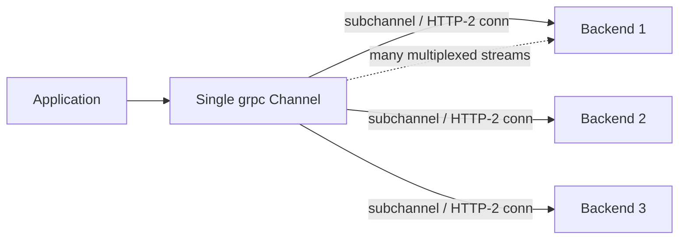

# gRPC — Middle

<!-- level-focus -->
At middle level, focus on this question:

> Where does **gRPC** belong in a maintainable component, and which trade-off selects the design?

Use the smallest realistic scenario that exposes the decision and its failure behavior.
## 2. The Four RPC Types

gRPC method signatures are declared by whether the request and/or response is marked
`stream`. That single keyword produces four distinct call shapes with different lifecycle
and back-pressure semantics.

```protobuf
syntax = "proto3";
package chat.v1;

service ChatService {
  // 1. Unary: one request, one response.
  rpc GetUser(GetUserRequest) returns (User);

  // 2. Server streaming: one request, a stream of responses.
  rpc ListEvents(ListEventsRequest) returns (stream Event);

  // 3. Client streaming: a stream of requests, one response.
  rpc UploadChunks(stream Chunk) returns (UploadSummary);

  // 4. Bidirectional streaming: two independent streams.
  rpc Chat(stream ChatMessage) returns (stream ChatMessage);
}
```

| Call type | Request | Response | Typical use | Ordering / notes |
|-----------|---------|----------|-------------|------------------|
| **Unary** | 1 | 1 | Standard request/response (fetch, mutate) | Simplest; maps cleanly to REST-style calls |
| **Server streaming** | 1 | many | Feeds, large result sets, progress/tailing logs | Server pushes until it half-closes; client reads until EOF |
| **Client streaming** | many | 1 | Uploads, batched ingest, aggregation | Client sends N messages then half-closes; one aggregate reply |
| **Bidirectional** | many | many | Chat, live sync, interactive protocols | Both streams independent; interleaving is app-defined |

Key semantics that trip people up:

- **A stream is not a mailbox.** Both directions share one HTTP/2 stream and honor
  HTTP/2 flow control, so a slow reader applies **back-pressure** to the writer. If your
  server produces faster than the client consumes, the server's `Send` blocks — this is a
  feature, not a bug.
- **Half-close.** In client and bidi streaming, the client signals "no more messages" by
  half-closing (in Go, `stream.CloseAndRecv()` / `stream.CloseSend()`). The server detects
  this as an EOF on its receive loop.
- **Bidi ordering is your responsibility.** gRPC guarantees message order *within each
  direction*, not any correlation between the two. If a response must be matched to a
  request, put a correlation ID in the message.

```mermaid
sequenceDiagram
    autonumber
    participant C as Client
    participant S as Server
    Note over C,S: Bidirectional streaming (rpc Chat)
    C->>S: HEADERS /chat.v1.ChatService/Chat
    C->>S: 1. ChatMessage{id:1, "hi"}
    S-->>C: 2. ChatMessage{ack:1}
    C->>S: 3. ChatMessage{id:2, "how are you"}
    S-->>C: 4. ChatMessage{id:9, "server push"}
    S-->>C: 5. ChatMessage{ack:2}
    Note over C,S: streams are independent; correlate via ids
    C->>S: 6. CloseSend (half-close)
    S-->>C: 7. remaining messages, then TRAILERS grpc-status:0
```

A minimal server-streaming handler (Go-shaped) shows the loop and back-pressure point:

```go
func (s *server) ListEvents(req *pb.ListEventsRequest, stream pb.ChatService_ListEventsServer) error {
    for _, ev := range s.query(req.GetSince()) {
        if err := stream.Context().Err(); err != nil {
            return status.FromContextError(err).Err() // client cancelled / deadline
        }
        if err := stream.Send(ev); err != nil { // blocks under flow control
            return err
        }
    }
    return nil // returning nil = OK trailer; the stream half-closes
}
```

---

## 3. Protobuf: Field Numbers, Wire Types, and the Encoding

Protobuf does **not** serialize field names — it serializes **field numbers**. Each
encoded field is a *tag* (`field_number << 3 | wire_type`) followed by the value. This is
the entire basis of forward/backward compatibility: rename a field freely, but never
reuse a number for a different meaning.

```protobuf
message User {
  int64  id    = 1;   // tag byte = (1<<3)|0 = 0x08  (varint)
  string name  = 2;   // tag byte = (2<<3)|2 = 0x12  (length-delimited)
  bool   active = 3;  // tag byte = (3<<3)|0 = 0x18  (varint)
}
```

The wire type (the low 3 bits of the tag) tells the decoder how to read the value without
knowing the schema:

| Wire type | ID | Encoding | proto3 field types |
|-----------|----|----------|--------------------|
| VARINT | 0 | Base-128 varint | `int32/64`, `uint32/64`, `sint*` (zigzag), `bool`, `enum` |
| I64 | 1 | Fixed 8 bytes | `fixed64`, `sfixed64`, `double` |
| LEN | 2 | Length prefix + bytes | `string`, `bytes`, embedded messages, `repeated` (packed) |
| I32 | 5 | Fixed 4 bytes | `fixed32`, `sfixed32`, `float` |

Practical consequences you should internalize:

- **Field numbers 1–15 cost one tag byte; 16–2047 cost two.** Assign the single-byte range
  to your hottest, most-repeated fields (elements of large `repeated` lists) for smaller
  payloads.
- **Varints are variable width.** Small non-negative integers are cheap. Negative `int32`
  values encode as 10 bytes — use `sint32`/`sint64` (zigzag) for values that are often
  negative.
- **Unknown fields are preserved (or skipped) by wire type.** A decoder that meets a tag it
  doesn't recognize uses the wire type to skip exactly the right number of bytes — which is
  precisely why adding fields is non-breaking.
- **proto3 semantics:** scalar fields have no on-wire presence by default; a field equal to
  its zero value (`0`, `""`, `false`) is simply **not emitted**. You cannot distinguish
  "absent" from "zero" for a plain scalar — see `optional` in §4.

---

## 4. Schema Evolution: reserved, optional, and Safe Changes

The contract survives independent client/server deploys only if you follow a small set of
rules. The `.proto` is the source of truth; treat it like a database schema.

```protobuf
message User {
  reserved 4, 7, 10 to 12;         // numbers of removed fields — never reuse
  reserved "email", "phone";        // removed field names — never reuse

  int64  id     = 1;
  string name   = 2;
  bool   active = 3;

  optional string nickname = 5;     // explicit presence: distinguishes unset from ""
  repeated string roles    = 6;     // adding a repeated field is safe
}
```

**Safe (compatible) changes:**

- Add a new field with a **new** number. Old readers skip it; old writers omit it (readers
  see the zero value / unset).
- Rename a field (the number is the identity, not the name).
- Delete a field — **and immediately `reserved` its number and name** so no future edit
  reuses them.
- Add a new enum value — but old clients that don't know it will see the raw number; design
  handlers to tolerate an unknown enum value (proto3 keeps it rather than rejecting).

**Unsafe (breaking) changes:**

- Reusing a field number for a different type or meaning — old peers will misinterpret bytes.
- Changing a field's type across incompatible wire types (e.g., `string` ↔ `int32`).
- Renumbering existing fields.
- Changing a field between `singular` and `repeated`, or moving it into/out of a `oneof`,
  in ways that change wire layout.

**`optional` (explicit presence):** in proto3, `optional` re-adds a has-bit so you can tell
"the client did not set this field" apart from "the client set it to the zero value." Use it
for partial-update (PATCH-style) requests and for booleans/counters where `false`/`0` is a
meaningful value distinct from absence. It is wire-compatible with a non-`optional` field of
the same number and type, so you can add it later.

> Tooling note: adopt `buf breaking` (or `protolock`) in CI to mechanically reject
> incompatible edits. Field-number discipline enforced by a human alone eventually fails.

---

## 5. Deadlines and Timeouts (and Propagation)

gRPC's model is **deadlines**, not per-hop timeouts. The client sets an absolute point in
time by which the whole call must finish; that deadline travels with the request as the
`grpc-timeout` header and is enforced at every hop.

```go
// Client: always set a deadline. A call without one can hang forever.
ctx, cancel := context.WithTimeout(context.Background(), 300*time.Millisecond)
defer cancel()

resp, err := client.GetUser(ctx, &pb.GetUserRequest{Id: 42})
if err != nil {
    if status.Code(err) == codes.DeadlineExceeded {
        // budget consumed — retry only if the operation is idempotent
    }
}
```

Why deadlines beat timeouts in a call chain:

- **They propagate.** Service A calls B with a 300 ms deadline; B forwards the *remaining*
  budget to C (say 210 ms after A→B network + processing). No hop can accidentally wait
  longer than the caller is willing to. This prevents work continuing on a request whose
  originator has already given up.
- **They enable early cancellation.** When the deadline fires (or the client cancels),
  the server's `ctx.Done()` closes; well-written handlers stop work — abandon the DB query,
  release the connection — instead of computing a response nobody will read.

```mermaid
sequenceDiagram
    autonumber
    participant Client
    participant A as Service A
    participant B as Service B
    participant DB
    Client->>A: GetOrder(deadline = now + 300ms)
    Note over A: budget 300ms; used 40ms so far
    A->>B: GetInventory(grpc-timeout = 240ms)
    Note over B: forwards remaining budget downward
    B->>DB: query(ctx deadline 210ms)
    Note over DB: at t=210ms nothing returned
    DB--xB: ctx cancelled
    B-->>A: DEADLINE_EXCEEDED
    A-->>Client: DEADLINE_EXCEEDED (whole call ≤ 300ms)
```

Rules of thumb: set a deadline on **every** client call; make the deadline shrink as you go
deeper (leave headroom for the caller's own processing); and treat `DEADLINE_EXCEEDED` as a
possibly-partial outcome — the server may have completed the work even though the client
timed out, so retry only idempotent operations.

---

## 6. Metadata: Headers and Trailers

Metadata is the gRPC equivalent of HTTP headers: key/value pairs (ASCII keys; values are
strings, or binary when the key ends in `-bin`) carried alongside the message payload. It
splits into two phases on an HTTP/2 stream:

- **Headers** — sent *before* the first message, in both directions. Carries auth tokens,
  request IDs, tracing context (`traceparent`), tenant IDs. The `grpc-timeout` deadline
  header lives here.
- **Trailers** — sent *after* the last message. Carries the outcome (`grpc-status`,
  `grpc-message`, `grpc-status-details-bin`) plus any post-call server metadata (e.g.,
  final metrics). Trailers are why gRPC can report an error *after* streaming partial data.

```go
// Client attaches request metadata.
ctx := metadata.AppendToOutgoingContext(ctx,
    "authorization", "Bearer "+token,
    "x-request-id", reqID,
)

// Server reads headers, and can send response headers + trailers.
func (s *server) GetUser(ctx context.Context, r *pb.GetUserRequest) (*pb.User, error) {
    md, _ := metadata.FromIncomingContext(ctx)
    ids := md.Get("x-request-id")                       // read header
    grpc.SetHeader(ctx, metadata.Pairs("x-cache", "miss")) // sent before message
    grpc.SetTrailer(ctx, metadata.Pairs("x-rows", "1"))    // sent after message
    return s.load(ids)
}
```

Practical guidance:

- **Reserved prefix:** keys beginning with `grpc-` are reserved for the protocol. Do not
  invent your own `grpc-*` keys.
- **Binary values:** use a `-bin` suffix (e.g., `grpc-status-details-bin`) so infrastructure
  base64-handles them correctly.
- **Size limits:** metadata rides in HTTP/2 HEADERS frames and is subject to header-size
  limits; keep it small — it is not a place for payloads.
- Metadata is the correct channel for **cross-cutting context** (auth, tracing, tenancy),
  never for business data that belongs in the Protobuf message.

---

## 7. Status Codes and Error Model

Every gRPC call ends with a `grpc-status` code in the trailers. There are 17 canonical
codes (a closed set — do not invent your own). `OK` (0) means success; everything else is an
error carrying a code and a human-readable `message`. Richer, structured error details ride
in `grpc-status-details-bin` via `google.rpc.Status`.

| Code | # | Meaning | Retry safe? |
|------|---|---------|-------------|
| `OK` | 0 | Success | — |
| `INVALID_ARGUMENT` | 3 | Client sent malformed/invalid input | No — fix the request |
| `NOT_FOUND` | 5 | Entity does not exist | No |
| `ALREADY_EXISTS` | 6 | Create conflicted with existing entity | No |
| `PERMISSION_DENIED` | 7 | Authenticated but not authorized | No |
| `UNAUTHENTICATED` | 16 | Missing/invalid credentials | No (re-auth first) |
| `RESOURCE_EXHAUSTED` | 8 | Quota/rate limit hit | Yes, with backoff |
| `FAILED_PRECONDITION` | 9 | System state forbids the op right now | Usually no |
| `ABORTED` | 10 | Concurrency conflict (e.g., txn abort) | Yes, at a higher level |
| `UNIMPLEMENTED` | 12 | Method not supported by server | No |
| `INTERNAL` | 13 | Server-side invariant broken | Maybe |
| `UNAVAILABLE` | 14 | Server down / connection lost / overloaded | **Yes**, with backoff |
| `DEADLINE_EXCEEDED` | 4 | Budget consumed before completion | Yes if idempotent |
| `CANCELLED` | 1 | Caller cancelled the RPC | No |

Two distinctions that matter most in practice:

- **`INVALID_ARGUMENT` vs `FAILED_PRECONDITION`:** the former means the request itself is
  wrong regardless of state (a client bug); the latter means the request is well-formed but
  the system isn't in a state to serve it (e.g., "delete a non-empty bucket"). Retrying
  `INVALID_ARGUMENT` unchanged is always futile.
- **`UNAVAILABLE` is the retryable code.** It signals a transient transport-level failure.
  Combined with idempotent methods, it is the workhorse for automatic retries.

```go
// Returning a rich, typed error from a handler.
st := status.New(codes.InvalidArgument, "id must be positive")
st, _ = st.WithDetails(&errdetails.BadRequest{
    FieldViolations: []*errdetails.BadRequest_FieldViolation{
        {Field: "id", Description: "must be > 0"},
    },
})
return nil, st.Err()
```

> Map application errors to the *nearest canonical code* rather than defaulting everything to
> `INTERNAL` — the code is what callers, retry policies, and dashboards key off.

---

## 8. Interceptors

Interceptors are gRPC's middleware: a single choke point to apply cross-cutting concerns
(auth, logging, tracing, metrics, retries, panic recovery) without touching every handler.
They come in unary and streaming variants, on both client and server side, and chain in
order.

```go
// Server unary interceptor: authenticate, then time the call, then delegate.
func AuthUnary(ctx context.Context, req interface{},
    info *grpc.UnaryServerInfo, handler grpc.UnaryHandler) (interface{}, error) {

    md, _ := metadata.FromIncomingContext(ctx)
    if !validToken(md.Get("authorization")) {
        return nil, status.Error(codes.Unauthenticated, "missing/invalid token")
    }
    start := time.Now()
    resp, err := handler(ctx, req) // call the next interceptor / the handler
    metrics.Observe(info.FullMethod, status.Code(err), time.Since(start))
    return resp, err
}

srv := grpc.NewServer(
    grpc.ChainUnaryInterceptor(RecoverUnary, AuthUnary, LoggingUnary),
    grpc.ChainStreamInterceptor(RecoverStream, AuthStream),
)
```

What belongs in an interceptor:

- **Server side:** authentication/authorization, panic recovery, request logging, metrics,
  tracing-span creation, rate limiting, deadline enforcement.
- **Client side:** attaching auth/tracing metadata, retry with backoff, per-call timeouts,
  client-side metrics.

Design notes: keep interceptors ordered deliberately (recovery outermost so it catches
panics from everything inside; auth before anything expensive). Streaming interceptors wrap
the `ServerStream`/`ClientStream` object, so to observe individual messages you return a
wrapper whose `SendMsg`/`RecvMsg` you override — the interceptor runs once per stream, not
once per message.

---

## 9. Channels, Connections, and Reuse

A **channel** (`grpc.ClientConn` in Go, `ManagedChannel` in Java) is a long-lived,
concurrency-safe abstraction over one or more HTTP/2 connections to a service. It is the
single most important performance object to get right.

```go
// Create ONCE at startup; reuse for the lifetime of the process.
conn, err := grpc.NewClient(
    "dns:///user-service.internal:8080",
    grpc.WithTransportCredentials(creds),
    grpc.WithDefaultServiceConfig(`{"loadBalancingConfig":[{"round_robin":{}}]}`),
)
defer conn.Close()

client := pb.NewUserServiceClient(conn) // stub is cheap; share it freely
```

The rules:

- **Reuse the channel; never create one per request.** Building a channel means DNS
  resolution, TCP + TLS handshakes, and HTTP/2 setup — tens of milliseconds. Because HTTP/2
  multiplexes many concurrent streams over one connection, a single shared channel serves
  thousands of concurrent RPCs. Per-request channels are the classic gRPC performance bug.
- **The stub is a thin wrapper** over the channel and is safe to share across goroutines/
  threads; you don't need one stub per call.
- **Load balancing is client-side and per-channel.** With `round_robin`, the channel opens a
  subchannel to *each* resolved backend address and spreads streams across them. A single
  channel talking to a single L4 proxy address, by contrast, pins all traffic to one backend
  — because HTTP/2 keeps one connection alive, L4 load balancing does not rebalance. Use a
  name resolver that returns all backends (headless DNS / xDS) or an L7-aware proxy.
- **Concurrency ceiling:** HTTP/2 caps concurrent streams per connection
  (`MAX_CONCURRENT_STREAMS`, commonly 100). At very high concurrency you may need multiple
  subchannels or connection-per-endpoint fan-out to avoid queuing behind that cap.
- **Keepalive:** configure keepalive pings so idle connections through NAT/load balancers
  aren't silently dropped, and so half-open connections are detected quickly.



---

## 10. Middle Checklist

- [ ] Chosen the right RPC shape per method (unary vs the three streaming forms) and
      documented back-pressure/half-close behavior for any streaming call.
- [ ] Field numbers assigned deliberately (hot fields in 1–15); `reserved` applied for every
      deleted field number and name.
- [ ] `optional` used where "unset" must be distinguished from the zero value.
- [ ] Every client call sets a **deadline**; downstream calls forward the remaining budget.
- [ ] Cross-cutting context (auth, request-id, tracing) carried in **metadata**, never in
      the message body.
- [ ] Handlers return the **nearest canonical status code**, not blanket `INTERNAL`; retries
      target `UNAVAILABLE`/`RESOURCE_EXHAUSTED`/`DEADLINE_EXCEEDED` on idempotent methods.
- [ ] Interceptors ordered intentionally (recovery outermost, auth early) for both unary and
      streaming.
- [ ] Channels created once and reused; client-side load balancing verified to spread across
      all backends (not pinned to one connection).
- [ ] `buf breaking` (or equivalent) wired into CI to reject incompatible `.proto` changes.

> Canonical references: [gRPC docs](https://grpc.io/docs/) · [gRPC status codes](https://grpc.io/docs/guides/status-codes/) · [Protocol Buffers docs](https://protobuf.dev/) · [proto3 language guide](https://protobuf.dev/programming-guides/proto3/) · [Protobuf encoding](https://protobuf.dev/programming-guides/encoding/)

*Next step:* [gRPC — Senior](senior.md)

---

## Apply it

1. Find a real component where **gRPC** affects an interface or dependency.
2. Write two plausible choices and the constraint that favors each one.
3. Make the smallest reversible change at that boundary.
4. Exercise the component alone, then exercise the integrated flow.
5. Keep the decision note with the evidence that selected the option.

## Verify your work

- A focused check proves the local behavior.
- An integrated check proves callers and dependencies still agree.
- Logs, traces, compiler output, or benchmarks expose the boundary.
- Reverting the change restores the previous behavior without unrelated edits.

## Review questions

- Which boundary is most affected by gRPC?
- What constraint would make you choose the alternative design?
- How would you isolate a local defect from an integration defect?
- What evidence shows that the change remains maintainable?
