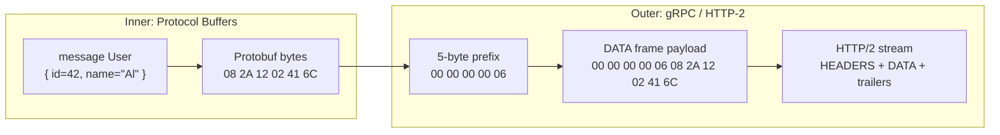
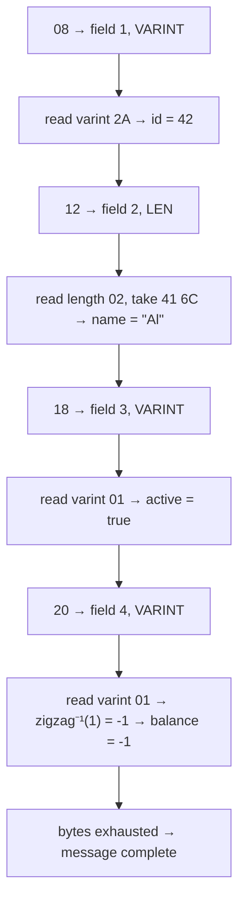
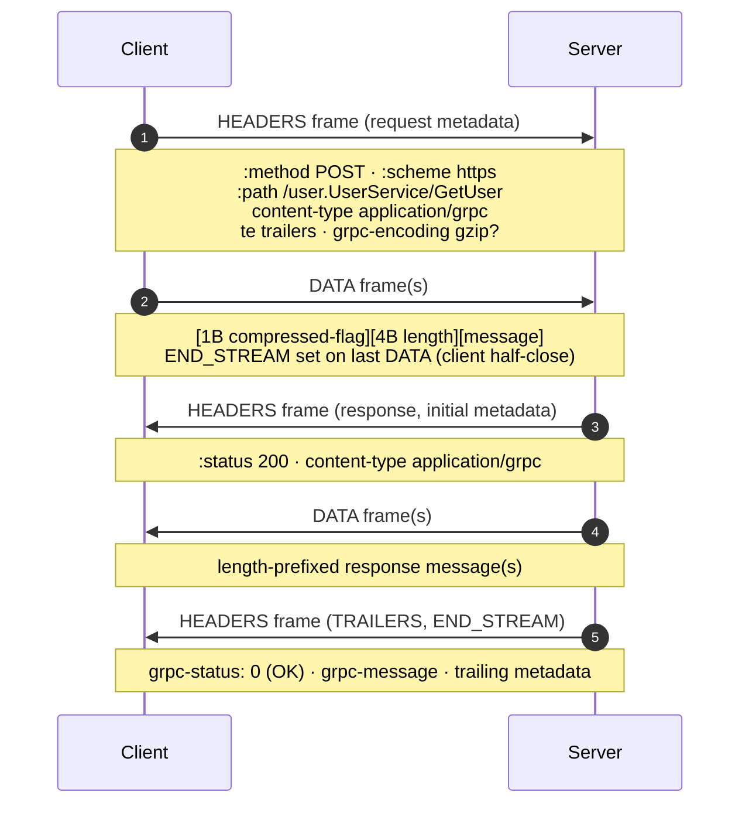

# gRPC — Professional

<!-- level-focus -->
At professional level, focus on this question:

> How should teams adopt and operate **gRPC** with measurable outcomes and limited coordination?

Use the smallest realistic scenario that exposes the decision and its failure behavior.
## 1. Two Wire Formats, One Call

A single gRPC unary call is the composition of **two independent, layered wire formats**, and confusing them is the root of most gRPC misunderstandings.

- The **inner format** is Protocol Buffers: a self-describing-enough byte string that encodes the *message* — the request or response object. It knows nothing about networks, methods, or status.
- The **outer format** is gRPC-over-HTTP/2: it takes each Protobuf message, wraps it in a 5-byte length prefix, places it in HTTP/2 `DATA` frames, routes it with a `:path` pseudo-header, and terminates the call with a `grpc-status` code carried in HTTP/2 **trailers**.

Neither layer knows the other's schema. Protobuf does not know the RPC method name; HTTP/2 does not know a message contains an `int32`. This clean separation is why the same `.proto` types serialize identically whether sent over gRPC, written to disk, or stored in a queue — the Protobuf bytes are the invariant, and the transport is interchangeable.



The professional-tier skill is to reason about *each layer's bytes independently*. We build the inner format first (§2–§7), then the outer (§8–§9), then show how the two together guarantee schema evolution (§10).

---

## 2. The Protobuf Record: Tag, Wire Type, Value

A Protobuf message is not a container with a header. It is simply a **concatenation of records**, each a `(tag, value)` pair, laid end to end. There is no framing between records, no field count, no message length embedded in the message itself — the parser reads records until the bytes run out.

Every record begins with a **tag**, itself a varint (§3). The tag packs two pieces of information into one integer:

```
tag = (field_number << 3) | wire_type
```

The low 3 bits are the **wire type**; the remaining high bits are the **field number** declared in the `.proto`. Three bits allow eight wire types, of which six are used:

| Wire type | ID | Meaning | Used for |
|-----------|----|---------|----------|
| VARINT | 0 | Variable-length integer | `int32`, `int64`, `uint32`, `uint64`, `bool`, `enum`, `sint*` |
| I64 | 1 | Fixed 8 bytes, little-endian | `fixed64`, `sfixed64`, `double` |
| LEN | 2 | Length-delimited (varint length, then bytes) | `string`, `bytes`, embedded messages, packed repeated |
| SGROUP | 3 | Start group (**deprecated**) | legacy groups |
| EGROUP | 4 | End group (**deprecated**) | legacy groups |
| I32 | 5 | Fixed 4 bytes, little-endian | `fixed32`, `sfixed32`, `float` |

The wire type is what lets a parser skip an *unknown* field correctly: it tells the reader how to measure the value's length (fixed 4/8 bytes, or a leading length prefix, or read-a-varint) without knowing the field's meaning. That single property is the foundation of forward compatibility (§10).

Given a tag byte, recover the field number and wire type by inverting the pack:

```
field_number = tag >> 3
wire_type    = tag & 0x07
```

For the tag byte `0x08`: `0x08 = 0b0000_1000`. Wire type = `0b000` = 0 (VARINT); field number = `0b0001` = 1. So `0x08` means "field 1, varint" — the most common tag byte you will ever see in a Protobuf dump.

---

## 3. Varint Encoding

Varints encode unsigned integers in **one to ten bytes**, using fewer bytes for smaller values. The scheme is base-128 with a continuation bit:

- Each byte carries **7 bits of payload** in its low 7 bits.
- The **high bit (MSB, `0x80`) is the continuation flag**: `1` means "another byte follows," `0` means "this is the last byte."
- Bytes are emitted **least-significant group first** (little-endian groups).

To encode `300`:

```
300  = 0b1_0010_1100                    (9 bits)
group into 7-bit chunks, low first:
  low 7 bits : 010_1100  = 0x2C
  next bits  : 000_0010  = 0x02
set continuation bit on all but the last (highest) group:
  byte 0 : 1_0101100 = 0xAC   (MSB=1, more follows)
  byte 1 : 0_0000010 = 0x02   (MSB=0, last)
→ 300 encodes as  AC 02
```

To decode: strip each byte's MSB, take the low 7 bits, and reassemble **in reverse byte order** — `0x02` becomes the high group, `0x2C` the low: `(0b0000010 << 7) | 0b0101100 = 256 + 44 = 300`. ✓

Two consequences drive real capacity math:

- Values `0–127` fit in **one byte**. This is why `bool`, small `enum`s, and small counters are essentially free.
- Because there is no minimum-length rule, a maximally negative `int64` (encoded as an unsigned 64-bit two's-complement value) needs the full **10 bytes**. This is the notorious trap: `int32` with a *negative* value is sign-extended to 64 bits and always costs 10 bytes on the wire. If a field is routinely negative, `sint32` (§4) is dramatically cheaper.

---

## 4. ZigZag for Signed Integers

The `int32`/`int64` types encode negatives as their two's-complement 64-bit representation, so `-1` is `0xFFFF_FFFF_FFFF_FFFF` — all ten varint bytes. Protobuf offers `sint32`/`sint64` to fix this, using **ZigZag encoding**, which maps signed integers to unsigned so that small-magnitude numbers (of either sign) stay small:

```
sint32:  zigzag(n) = (n << 1) ^ (n >> 31)      (arithmetic shift for the sign)
sint64:  zigzag(n) = (n << 1) ^ (n >> 63)
```

The map interleaves the sign, so encoded values order as `0, -1, 1, -2, 2, …`:

| Signed value `n` | ZigZag(n) | Varint bytes |
|------------------|-----------|--------------|
| 0 | 0 | `00` |
| -1 | 1 | `01` |
| 1 | 2 | `02` |
| -2 | 3 | `03` |
| 2147483647 | 4294967294 | `FE FF FF FF 0F` |
| -2147483648 | 4294967295 | `FF FF FF FF 0F` |

Now `-1` costs **one byte** (`01`) instead of ten. The decode inverts the map:

```
n = (zigzag >> 1) ^ -(zigzag & 1)
```

The rule for a professional making a schema decision: use `sint*` when the field can be negative and clusters near zero; use plain `int*` only when negatives are rare or impossible; use `sfixed*` when values are large and uniformly distributed (fixed width beats a long varint). This is a wire-cost decision, invisible in the API but material at scale.

---

## 5. Length-Delimited Fields

Wire type 2 (LEN) covers everything that is not a scalar number: `string`, `bytes`, embedded messages, and packed repeated scalars. The encoding is:

```
[ tag varint ] [ length varint ] [ length bytes of payload ]
```

The length is the payload's byte count as a varint, followed by exactly that many raw bytes. For a `string`, the payload is the UTF-8 bytes. For an **embedded message**, the payload is *another complete Protobuf message* — the format is recursive, and the length prefix is what lets a parser skip an entire sub-message it does not understand.

Encoding the string `"Al"` in field 2:

```
tag    = (2 << 3) | 2 = 0b0001_0010 = 0x12    (field 2, LEN)
length = 2                            = 0x02
bytes  = 'A' 'l'                      = 0x41 0x6C
→  12 02 41 6C
```

Note the crucial asymmetry versus scalars: a LEN field is **self-delimiting** because its length is explicit, whereas a VARINT field is self-delimiting because the continuation bit marks its end. Both let the parser find the next tag without a schema — but by different mechanisms. Packed repeated fields exploit LEN too: instead of re-emitting the tag per element, `repeated int32 [packed]` writes one tag, one length, then the varints concatenated, saving one tag byte per element.

---

## 6. Why Field Numbers 1–15 Cost One Byte

The tag is a varint holding `(field_number << 3) | wire_type`. A single varint byte carries 7 payload bits. Three of those bits are consumed by the wire type, leaving **4 bits for the field number** before a second tag byte is required:

| Field number range | Tag varint bytes | Bits available |
|--------------------|------------------|----------------|
| 1 – 15 | 1 | 4 bits (`1..15`) |
| 16 – 2047 | 2 | 11 bits |
| 2048 – 262143 | 3 | 18 bits |
| … | … | … |
| 536870911 (max, 2²⁹−1) | 5 | 29 bits |

Field numbers `19000–19999` are **reserved** by Protobuf for internal use and are rejected by the compiler.

The design guidance follows directly from the table: **assign field numbers 1–15 to the fields that appear most frequently** — the ones present in nearly every message, or repeated many times. A field carried a billion times a day saves a billion bytes per unit by living at tag 1–15 instead of 16+. This is a permanent, wire-visible decision: once a field number is deployed, it can never be changed without breaking every peer (§10), so the 1–15 budget must be spent deliberately at design time, not first-come-first-served.

---

## 7. A Worked Byte-Level Encode

Take a concrete schema and encode a value end to end, byte by byte.

```proto
message User {
  int32  id      = 1;   // field 1, VARINT
  string name    = 2;   // field 2, LEN
  bool   active  = 3;   // field 3, VARINT
  sint32 balance = 4;   // field 4, VARINT (zigzag)
}
```

Encode `User{ id: 42, name: "Al", active: true, balance: -1 }`.

**Field 1 — `id = 42`** (int32, VARINT):

```
tag   = (1 << 3) | 0 = 0x08
value = 42            = 0x2A           (42 < 128, one byte)
→ 08 2A
```

**Field 2 — `name = "Al"`** (string, LEN):

```
tag    = (2 << 3) | 2 = 0x12
length = 2            = 0x02
bytes  = 'A'=0x41 'l'=0x6C
→ 12 02 41 6C
```

**Field 3 — `active = true`** (bool, VARINT):

```
tag   = (3 << 3) | 0 = 0x18
value = true         = 0x01
→ 18 01
```

**Field 4 — `balance = -1`** (sint32, VARINT + zigzag):

```
tag       = (4 << 3) | 0 = 0x20
zigzag(-1)= (-1 << 1) ^ (-1 >> 31) = 1
value     = 1            = 0x01
→ 20 01
```

**Concatenate** — records laid end to end, no separators, no length header:

```
08 2A 12 02 41 6C 18 01 20 01
```

Ten bytes for the whole message. Reading it back proves the format is self-delimiting:



Had `balance` been a plain `int32` instead of `sint32`, field 4 would have been `20 FF FF FF FF FF FF FF FF FF 01` — **11 bytes** (tag + 10-byte varint) — turning a 10-byte message into a 20-byte one. That is the entire practical argument for ZigZag, made visible.

---

## 8. gRPC Over HTTP/2: The Framing

The Protobuf bytes from §7 are now the *payload* of a gRPC call. gRPC maps one RPC onto **one HTTP/2 stream**, and the call proceeds as a sequence of HTTP/2 frames on that stream.

A unary call's frame sequence:



The load-bearing details for a professional:

- **The method is a path.** gRPC routes on the HTTP/2 `:path` pseudo-header, which is always `/{package}.{Service}/{Method}` (leading slash, dotted service name). There is no verb dispatch; every gRPC request is `POST`.
- **`content-type: application/grpc`** (optionally `+proto`) is mandatory and is how a shared HTTP/2 endpoint distinguishes gRPC from ordinary HTTP traffic.
- **`te: trailers`** is required on the request. It advertises that the client will read HTTP/2 trailers, which is where the *real* result status arrives (§9). A proxy that strips trailers breaks gRPC entirely.
- The HTTP `:status` is `200` for **any** call that reached the gRPC layer — including application errors. The HTTP status describes only whether HTTP itself worked; the gRPC outcome is a separate axis carried in `grpc-status`.

---

## 9. The Length-Prefixed Message and Trailers

Inside the `DATA` frames, gRPC does not place raw Protobuf. It places **Length-Prefixed-Messages**, each with a fixed 5-byte header:

```
+--------+----------------+=======================+
| 1 byte | 4 bytes        | length bytes          |
| flag   | length (BE u32)| message               |
+--------+----------------+=======================+
```

- **Byte 0 — compressed flag.** `0x00` = the message is not compressed; `0x01` = compressed using the algorithm named in the `grpc-encoding` request/response header (e.g. `gzip`). The flag is per-message, so a stream can mix compressed and uncompressed frames.
- **Bytes 1–4 — length.** The message length as a **big-endian** unsigned 32-bit integer. (Note the byte order contrast: this outer length is big-endian, while Protobuf's own varints and I32/I64 scalars are little-endian.)
- **Message.** Exactly `length` bytes of Protobuf.

Wrapping the §7 message (10 bytes, uncompressed) yields the exact `DATA` payload:

```
00 00 00 00 0A 08 2A 12 02 41 6C 18 01 20 01
└┬┘ └────┬────┘ └──────────────┬──────────────┘
 │   length=10        the 10-byte Protobuf message
 └ flag=0 (uncompressed)
```

The 5-byte prefix is what lets a single `DATA` frame — or a stream of them — carry **multiple** messages (essential for server/client/bidi streaming): the reader consumes 5 bytes, reads that many message bytes, and repeats. HTTP/2 flow control and framing operate on `DATA` frame boundaries, which are *independent* of message boundaries; one message may span several `DATA` frames and one `DATA` frame may contain several messages.

**Trailers carry the verdict.** After the last response `DATA` frame, the server sends a final `HEADERS` frame flagged as trailers, containing:

```
grpc-status: 0            # 0 = OK; non-zero = a gRPC status code (e.g. 5 NOT_FOUND, 14 UNAVAILABLE)
grpc-message: ...         # optional, percent-encoded human-readable detail
grpc-status-details-bin   # optional, base64 google.rpc.Status with rich error details
```

Delivering status *after* the body is deliberate: a streaming server can emit hundreds of messages and only decide the final status once the stream ends (e.g. a mid-stream failure). This is precisely why HTTP/2 trailers — not response headers — are structurally required, and why any intermediary that cannot forward trailers cannot proxy gRPC. If a server returns HTTP `200` with **no** `grpc-status` trailer (the "trailers-only" edge case is instead a single HEADERS frame carrying both `:status` and `grpc-status`), a compliant client synthesizes an error rather than reporting success.

---

## 10. Schema Evolution at the Wire Level

Every compatibility guarantee gRPC advertises is a direct consequence of the wire format, not of tooling politeness. Three properties do all the work.

**1. Unknown fields are skippable, not fatal.** Because each record's tag encodes a wire type (§2), a parser encountering a field number it has never heard of still knows *how many bytes to consume*: read-a-varint for type 0, 8 bytes for type 1, a length-prefix for type 2, 4 bytes for type 5. It skips the field and continues. This is why an **old binary can parse a message from a new schema** (backward compat) — new fields it does not recognize are simply skipped. In proto3, such unknown fields are, by default, *retained* and re-emitted on re-serialization, so a middle-tier that deserializes and re-serializes does not silently drop a field it did not know about.

**2. Field number is the only identity that matters.** Field *names* exist purely for source code; they are absent from the wire. Renaming a field is therefore a **wire-compatible** change and a source-breaking one. Conversely, **changing a field's number is always breaking**, because the number *is* the identity — old and new peers would read the same bytes as different fields. The invariant: field numbers are permanent, names are free.

**3. Tag stability and reservation.** Deleting a field is safe *only if its number is never reused*. Reuse would cause a new field to inherit stale bytes from old producers, silently mis-decoding data. Protobuf enforces this with `reserved`:

```proto
message User {
  reserved 4;                 // balance was removed; never reuse 4
  reserved "balance";         // and never reuse the name
  int32  id   = 1;
  string name = 2;
  bool   active = 3;
}
```

A compatibility matrix of common schema edits, judged at the wire level:

| Change | Backward compat (new reads old) | Forward compat (old reads new) | Why |
|--------|:---:|:---:|:---:|
| Add field (new number) | ✓ | ✓ | old skips unknown field; new sees default for absent field |
| Remove field (+ `reserved`) | ✓ | ✓ | new skips unknown bytes; number never reused |
| Rename field | ✓ | ✓ | names are not on the wire |
| Change field number | ✗ | ✗ | number is the field identity |
| `int32` ↔ `int64`/`uint32`/`bool` | ✓ | ✓ | all share VARINT wire type; truncation on narrowing |
| `int32` ↔ `sint32` | ✗ | ✗ | same wire type but different value encoding (zigzag) |
| `int32` ↔ `fixed32` | ✗ | ✗ | different wire types (0 vs 5) |
| scalar ↔ `repeated` (same type) | ✓* | ✓* | packed/unpacked parse compatibly for numeric scalars |
| Change `optional` singular ↔ `oneof` member | ✗ | ✗ | oneof enforces mutual exclusion at parse |

The compatible integer swaps (`int32 ↔ int64 ↔ uint32 ↔ bool ↔ enum`) all work because they **share wire type 0** and the varint value is simply reinterpreted — but beware truncation (a value that overflows the narrower type wraps) and the `sint*`/`fixed*` cliffs, where the wire type or value transform differs and the change silently corrupts data rather than failing loudly. The professional discipline is to treat the *wire type* — not the source type — as the compatibility unit.

> 🎞️ **See it animated:** [Protobuf encoding, byte by byte (protobuf.dev)](https://protobuf.dev/programming-guides/encoding/)

---

## Apply it

1. Define the user or business outcome that **gRPC** should improve.
2. Assign one owner for code, contracts, operations, and incidents.
3. Split delivery into reversible increments that produce evidence early.
4. Publish responsibilities, escalation paths, and compatibility windows.
5. Stop or expand only when the agreed measures support that decision.

## Verify your work

- Each increment has an owner, rollback path, and observable exit condition.
- Adoption, reliability, delivery time, and coordination cost are measured.
- Incident and migration exercises prove that responsibility is executable.
- The old path is removed only after telemetry proves it is unused.

## Review questions

- Which measurable outcome justifies investing in gRPC?
- Which team owns the full lifecycle and incident response?
- What reversible increment produces the earliest useful evidence?
- Which exit condition proves that migration or adoption is complete?
