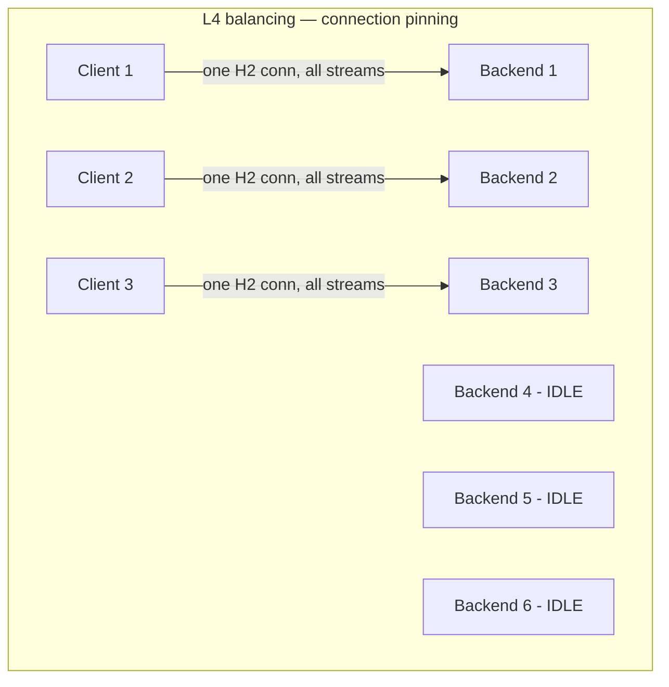
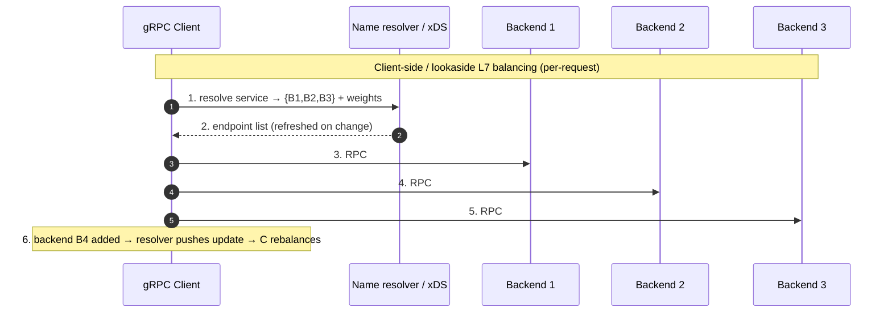

# gRPC — Senior

<!-- level-focus -->
At senior level, focus on this question:

> Which system invariant is affected by **gRPC** under failure, load, and change?

Use the smallest realistic scenario that exposes the decision and its failure behavior.
## 1. What gRPC Actually Is: The HTTP/2 + Protobuf Model

gRPC is not a wire protocol invented from scratch; it is a set of conventions layered on two existing standards. Understanding the layering is what lets you reason about its failure modes.

- **Transport: HTTP/2.** Every gRPC call is an HTTP/2 request. The method is `POST`, the `:path` is `/package.Service/Method`, and the body is a sequence of length-prefixed protobuf messages. Crucially, HTTP/2 **multiplexes many concurrent streams (calls) over a single TCP connection** — this is the source of both gRPC's efficiency and its load-balancing problem (§2).
- **Serialization: Protocol Buffers.** Messages are encoded as compact binary using field *numbers* (tags) as wire identity. This is why protobuf is fast and small, and why schema evolution must reserve tags rather than reuse them — but it is also why you cannot read a gRPC frame in a browser Network tab the way you read JSON (§8).
- **Semantics: a status model, not HTTP status codes.** gRPC carries its own status codes (`OK`, `UNAVAILABLE`, `DEADLINE_EXCEEDED`, `RESOURCE_EXHAUSTED`, `FAILED_PRECONDITION`, …) in HTTP/2 trailers — the `grpc-status` header sent *after* the body. The HTTP response is almost always `200 OK` even when the RPC failed; the real outcome is in the trailer. Proxies and tools that only inspect HTTP status will misreport gRPC health.
- **Deadlines and cancellation are first-class.** The call context carries an absolute deadline that propagates and, on expiry or client cancellation, cancels server-side work. This is the single most valuable operational feature gRPC gives you for free (§4).

The senior mental model: **gRPC = HTTP/2 streams + protobuf frames + a trailer-based status model + built-in deadline/cancel propagation.** Almost every operational surprise (LB pinning, invisible payloads, `200 OK` masking failure, proxy incompatibility) follows directly from one of these four facts.

---

## 2. The Load-Balancing Problem: Why Long-Lived HTTP/2 Connections Pin to One Backend

This is the defining operational hazard of gRPC and the one that most often surprises teams migrating from REST.

With HTTP/1.1, a client opens a connection per request (or a small pool), and a connection-level (L4) load balancer distributes those connections across backends. Load spreads naturally because there are *many short connections*. gRPC breaks this assumption in two ways:

1. **Connections are long-lived.** A gRPC channel establishes one HTTP/2 connection and keeps it open, reusing it for the life of the client.
2. **All calls multiplex over that one connection.** HTTP/2 sends every RPC — thousands of them — as concurrent streams over the *same* TCP connection.

The consequence: an **L4 load balancer picks a backend once, at connection time, and every subsequent request rides that same connection to that same backend.** Requests are never re-balanced. If you have 3 clients and 6 backends, at most 3 backends receive traffic; the other 3 sit idle. Worse, when you add a new backend (scale-out) or roll a deploy, existing connections keep pointing at the old set — the new backend gets *zero* traffic until connections happen to reconnect.





The core rule: **connection-level load balancing does not work for gRPC.** You must balance at the *request* level, which means either an L7 proxy that understands HTTP/2 streams, or a client that knows all the backends and picks per call. The next section lays out the strategies.

---

## 3. Load-Balancing Strategies for gRPC: L4 vs L7 vs Client-Side vs xDS

There are three families of solution to the pinning problem, each with a distinct cost/complexity trade-off.

| Strategy | How it works | Rebalances per request? | Handles scale-out/deploys | Cost / complexity |
|---|---|---|---|---|
| **L4 (connection) LB** | TCP LB picks backend once at connect | ❌ No — pins connection | ❌ Poor; new backends starved | Simplest, but **wrong for gRPC** |
| **L7 proxy LB** | HTTP/2-aware proxy (Envoy, nginx, Linkerd, cloud L7 LB) terminates and re-distributes each stream | ✅ Yes | ✅ Good | Extra hop/latency; proxy is a tier to run |
| **Client-side (thick client)** | Client resolves all endpoints and picks per RPC (round-robin, etc.) | ✅ Yes | ✅ Good (on resolver refresh) | No proxy hop; logic embedded in every client/language |
| **Lookaside / one-arm LB** | A dedicated balancer *tells* the client which backend to use; client connects directly | ✅ Yes | ✅ Good | Central policy + direct data path; needs a balancer service |
| **xDS (Envoy/proxyless mesh)** | A control plane streams endpoints, weights, and policy to Envoy sidecars **or** directly to xDS-capable gRPC clients | ✅ Yes | ✅ Excellent (push-based) | Most powerful; requires a control plane (service mesh) |

**How to choose:**

- **L7 proxy** is the pragmatic default for most teams. Put an HTTP/2-aware proxy (Envoy, Linkerd, a cloud L7 LB) in front of the backends; it re-balances every stream and handles scale-out automatically. The cost is an extra network hop and a proxy tier to operate.
- **Client-side balancing** eliminates the proxy hop and its latency — the client holds subchannels to every backend and applies a `round_robin` (or custom) policy per call. The cost is that the balancing logic and endpoint discovery live in every client library, in every language, and must be kept consistent. Fine for a homogeneous internal fleet; painful across many stacks.
- **Lookaside** splits the difference: a central balancer owns policy and health, but the data path stays direct client→backend. Good when you want centralized control without a data-plane proxy.
- **xDS** is the modern, general answer at scale — a control plane (the same protocol Envoy uses) pushes endpoint lists, weights, health, and routing rules to either sidecar proxies or **proxyless gRPC** clients that speak xDS natively. This is the service-mesh path: maximum flexibility (weighted routing, canaries, locality-aware balancing) at the cost of running a control plane.

Whatever you choose, the resolver must **refresh on topology change** and the balancer must **honor health checks and drain gracefully** — otherwise you have re-created pinning at a higher layer. See the gRPC load balancing guide at grpc.io.

---

## 4. Deadline Propagation Across a Call Graph

gRPC's deadline model is one of its strongest features, and using it correctly is a senior responsibility. A **deadline** is an absolute point in time ("finish by 12:00:03.500"), not a relative timeout — and gRPC propagates it through the call context automatically.

The client sets a deadline; gRPC serializes the *remaining* time into the `grpc-timeout` header on each hop. Every downstream service sees the deadline, and if it makes further gRPC calls with the same context, the deadline flows onward. When the deadline passes, the call fails with `DEADLINE_EXCEEDED` and — critically — **the context is cancelled, so downstream servers stop working on a result nobody will read.**

```mermaid
sequenceDiagram
    autonumber
    participant U as Edge (deadline = now+3s)
    participant A as Service A
    participant B as Service B
    participant C as Service C (slow DB)
    U->>A: 1. request, deadline T = now+3000ms
    A->>B: 2. gRPC call, grpc-timeout = remaining (~2950ms)
    B->>C: 3. gRPC call, grpc-timeout = remaining (~2100ms)
    Note over C: 4. DB slow; clock passes T
    C--xB: 5. DEADLINE_EXCEEDED; context cancelled
    B--xA: 6. propagate; B stops its own work
    A--xU: 7. return before wasting more compute
    Note over U,C: One deadline governs the whole chain; C stops instead of computing a dead result
```

Senior rules:

- **Set the deadline at the edge**, derived from the user-facing SLO, and let it propagate inward. Internal services should honor the incoming deadline, not invent generous local ones that outlive the request.
- **Never call without a deadline.** A gRPC call with no deadline can hang forever, pinning an HTTP/2 stream, a goroutine/thread, and buffer memory. Enough hung calls exhaust the server's stream/concurrency limits and it stops accepting work. "No deadline" is a resource leak.
- **Check the deadline before expensive work.** By the time a request reaches a deep leaf, little budget may remain. A leaf that starts a 5-second query with 200ms left is wasting capacity; check `ctx` first.
- **Deadline exceeded must cancel downstream.** gRPC does this via context cancellation — honor it. Abandoned-but-still-running work is a classic cause of overload spirals (work amplification).
- **Budget retries inside the deadline** (§5): the retry must fit under the original deadline, or per-attempt timeouts must shrink so the total stays within budget.

---

## 5. Retries, Hedging, and Circuit Breaking — Safely

gRPC supports declarative **retry policies** and **hedging** via service config, and integrates with circuit breaking through proxies/mesh. All three are dangerous if applied without an idempotency story.

**The prerequisite: idempotency.** A gRPC call that times out is *ambiguous* — the server may have committed the side effect before the response was lost. Retrying a non-idempotent method (charge card, increment counter, send email) after such a timeout double-executes it. gRPC will not blindly retry unless the policy says to, precisely because auto-retrying non-idempotent methods is unsafe. **Retry only idempotent operations, or make them idempotent first** (client-generated idempotency key, stored atomically with the side effect, returning the original response on replay).

**Retries done right:**

- **Retry only retryable statuses.** `UNAVAILABLE`, `DEADLINE_EXCEEDED` (on a safe op), `RESOURCE_EXHAUSTED` (with backoff) — retryable. `INVALID_ARGUMENT`, `NOT_FOUND`, `PERMISSION_DENIED`, `FAILED_PRECONDITION` — retrying just repeats a guaranteed failure.
- **Exponential backoff with jitter.** Fixed-interval retries synchronize clients into a thundering herd. gRPC retry config supports `initialBackoff`, `maxBackoff`, and `backoffMultiplier`; combine with jitter.
- **Retry budgets / throttling, not raw counts.** The killer failure is the **retry storm**: a dependency slows, every client retries, retries multiply load 2–3×, the dependency slows further — a feedback loop that outlives the original blip. gRPC's retry throttling caps retries as a *fraction* of traffic; enable it. Per-call "retry 3 times" cannot stop fleet-wide amplification.
- **Bound total attempts by the deadline** (§4), never by count alone.

**Hedging** is a distinct technique for tail latency: for idempotent reads, gRPC can send a second (and third) request after a delay and take whichever returns first, cancelling the losers. It trades extra load for dramatically better p99 — but it is **only safe for idempotent calls** and must respect the retry budget, or it *is* the load multiplier.

**Circuit breaking** (typically at the proxy/mesh layer, e.g. Envoy) trips open after a failure threshold and fails fast for a cooldown, giving the dependency room to recover instead of being hammered. It is the complement to retries: retries handle transient blips; circuit breakers handle sustained failure.

---

## 6. The Four Call Types and Streaming Backpressure

gRPC offers four call shapes, and choosing correctly is a design decision with resource implications.

| Call type | Shape | Use for | Main hazard |
|---|---|---|---|
| **Unary** | 1 req → 1 resp | Most RPCs; request/response | None specific; the default |
| **Server streaming** | 1 req → N resp | Large result sets, live feeds | Fast server, slow client → buffer growth |
| **Client streaming** | N req → 1 resp | Uploads, telemetry ingest | Fast client, slow server; incomplete-stream handling |
| **Bidirectional** | N req ↔ N resp | Chat, interactive protocols | Both directions need flow control; leaked streams |

**Backpressure and flow control.** Streaming reintroduces a hazard unary calls avoid: a fast producer overwhelming a slow consumer. Without control, the sender pushes faster than the receiver drains, buffers grow, and the process OOMs or its latency collapses. gRPC gets protection from **HTTP/2 flow control**: per-stream and per-connection windows mean the sender cannot transmit more than the receiver has advertised it can buffer. If the consumer stops reading, the producer's write blocks rather than buffering infinitely.

Senior rules for streaming:

- **Do not defeat flow control with your own unbounded buffer.** Reading messages off a stream into an in-memory queue "to process later" re-creates the exact OOM HTTP/2 protected you from. Process — or bound and block — at the pace the consumer sustains.
- **Bound concurrency, not just buffers.** Streaming a million rows and spawning a task per row is unbounded fan-out; use a worker pool sized to the downstream's capacity.
- **Deadlines and keepalives still apply.** A long-lived stream needs a max lifetime and keepalive pings, or a stuck consumer pins the stream — its memory, its goroutine/thread, its HTTP/2 stream slot — forever. **Leaked streams are the streaming-shaped version of the "no deadline" resource leak**, and they accumulate silently.
- **Always drain or close streams on the error path.** An early `return` that abandons a stream without cancelling it leaks the connection resources.

Streaming is a scaling tool *only* when backpressure is honored end-to-end. Without it, it is a memory bomb with good latency numbers — until it isn't.

---

## 7. gRPC Through Proxies and Browsers: grpc-web

gRPC assumes full HTTP/2 with trailers and control over framing. That assumption breaks at two boundaries.

- **Browsers cannot speak gRPC directly.** Browser fetch APIs do not expose HTTP/2 trailers or the low-level frame control gRPC requires. So a browser cannot call a gRPC service directly. The answer is **grpc-web**: a variant protocol that a browser client can speak (over HTTP/1.1 or HTTP/2), plus a **translating proxy** (Envoy's gRPC-Web filter, or an in-process handler) that converts grpc-web ↔ native gRPC on the way to the backend. grpc-web also has **limited streaming**: server-streaming works, but client-streaming and bidirectional streaming are generally **not supported** in the browser. Design front-end contracts accordingly.
- **Not every proxy understands gRPC.** Because status lives in HTTP/2 *trailers* and the payload is binary, a proxy or L7 LB that only understands HTTP/1.1, buffers whole responses, or ignores trailers will break gRPC — it may report `200 OK` for a failed RPC (§1), or fail to stream. Use HTTP/2-and-trailer-aware infrastructure (Envoy, modern nginx builds, Linkerd) end-to-end, and confirm TLS/ALPN negotiates `h2`.

```mermaid
sequenceDiagram
    autonumber
    participant BR as Browser (grpc-web JS)
    participant PX as Translating proxy (Envoy grpc-web filter)
    participant SV as gRPC Backend (native HTTP/2 + protobuf)
    BR->>PX: 1. grpc-web request (HTTP/1.1 or H2, base64/binary framing)
    PX->>SV: 2. native gRPC over HTTP/2
    SV-->>PX: 3. protobuf response + grpc-status trailer
    PX-->>BR: 4. grpc-web response (trailers folded into body)
    Note over BR,SV: Browser never speaks native gRPC; proxy translates. Client/bidi streaming unsupported.
```

The senior takeaway: **gRPC is an internal, infrastructure-controlled protocol.** The moment a browser or a non-gRPC-aware proxy is in the path, you need a translation tier — and you lose some streaming shapes. If a public browser API is the primary consumer, that is a strong signal REST (or gRPC-web with a proxy) is the right edge (§9).

---

## 8. Observability: Debugging a Binary Protocol

REST's underrated superpower is that a human can read it: `curl` a URL, see JSON, read HTTP status codes in any log. gRPC gives up almost all of that in exchange for performance, so observability must be *engineered in* rather than assumed.

- **The payload is opaque.** Protobuf on the wire is binary keyed by field number. You cannot eyeball it in a packet capture or a browser Network tab. Tooling closes the gap: `grpcurl` invokes methods from the command line (using **server reflection** to discover the schema), and reflection lets tools introspect a running server's services and messages. Enable reflection in non-prod, and keep the `.proto` files as the source of truth.
- **Status lives in trailers, and the HTTP status lies.** Because the HTTP response is `200 OK` even for failed RPCs (§1), any dashboard built on HTTP status codes will report 100% success while RPCs fail. **Monitor `grpc-status`, not HTTP status** — instrument the gRPC status code, per method, as your success/error signal.
- **Golden signals per method.** Track rate, errors (by gRPC status), and duration (latency histogram) *per RPC method*, not per host. This is what surfaces a single slow method or a specific `RESOURCE_EXHAUSTED` spike.
- **Distributed tracing is essential, not optional.** Because gRPC call graphs are deep and synchronous, a single user request fans out across many hops. Propagate trace context (OpenTelemetry) across gRPC metadata so a slow leaf is attributable. Without tracing, a deep gRPC chain is a black box.
- **Interceptors are the instrumentation seam.** gRPC's client/server interceptors are the clean place to add logging, metrics, tracing, and auth uniformly across every method — use them instead of hand-instrumenting handlers.

The senior discipline: treat "I can't `curl` it" as a *design constraint*, and pay down the observability cost up front with reflection, per-method golden signals keyed on `grpc-status`, and end-to-end tracing.

---

## 9. When gRPC Fits vs REST

Choosing gRPC over REST for internal services is a genuine trade-off, not a fashion. gRPC wins on performance and contract rigor; REST wins on ubiquity, debuggability, and edge/browser reach.

| Dimension | gRPC | REST (HTTP/JSON) |
|---|---|---|
| Encoding | Binary protobuf — compact, fast | Text JSON — larger, human-readable |
| Transport | HTTP/2 (multiplexed, streaming) | Usually HTTP/1.1 or HTTP/2 |
| Contract | Strong, codegen'd from `.proto` | Convention (OpenAPI optional) |
| Streaming | First-class (server/client/bidi) | Limited (SSE/chunked/WebSocket bolt-ons) |
| Browser support | Needs grpc-web + proxy | Native everywhere |
| Debuggability | Binary; needs grpcurl/reflection | `curl`, browser tools, any log |
| Load balancing | **Needs L7/client-side/xDS** (§2) | Works with L4 out of the box |
| Deadlines/cancel | Built-in, propagated | Manual (timeouts, no standard cancel) |
| Best fit | Internal, high-volume, low-latency, polyglot, streaming | Public/external APIs, browser clients, simple CRUD |

**Choose gRPC when:**

- The consumer is another **internal service you control and version together**, and you want strong contracts plus codegen across multiple languages.
- **Throughput and latency matter** — high call volume, large fan-out — where binary encoding and HTTP/2 multiplexing pay off.
- You need **streaming** semantics (live feeds, bidirectional channels) as a first-class citizen.
- You are willing to run **L7 / client-side / xDS load balancing** (§3) and the observability tooling (§8).

**Choose REST when:**

- The consumer is a **browser or an external/public client**, where native support, cacheability, and ubiquitous tooling matter more than raw throughput.
- The API is **simple CRUD** where JSON's readability and zero-tooling debuggability outweigh gRPC's performance.
- Your infrastructure (proxies, gateways, LBs) is not HTTP/2-and-trailer-aware, and adding a gRPC-capable tier is not justified.

A common mature architecture is **REST at the edge, gRPC internally**: a gateway exposes REST/JSON (or gRPC-web) to the outside world and translates to gRPC for the internal service mesh — combining REST's reach with gRPC's internal efficiency.

---

## 10. Failure Catalog and Senior Checklist

**Failure catalog — the incidents gRPC causes when its model is not respected:**

| Failure mode | Root cause | Mitigation |
|---|---|---|
| Connection imbalance / starved backends | L4 balancing pins long-lived H2 connections (§2) | L7 proxy, client-side, or xDS request-level LB (§3) |
| New backends get no traffic after scale-out | Resolver doesn't refresh; connections pinned (§2) | Refresh endpoints; drain/rebalance on topology change |
| Retry storm → cascading outage | Fixed retries + no jitter/budget under a blip (§5) | Backoff+jitter, retry throttling, circuit breakers |
| Double execution / duplicate side effect | Retried a non-idempotent call after ambiguous timeout (§5) | Idempotency keys; retry only idempotent ops |
| Request hangs forever | No deadline; stream + goroutine pinned (§4) | Mandatory propagated deadlines; keepalives |
| Streaming OOM | Fast producer, slow consumer, buffer defeats flow control (§6) | Honor HTTP/2 flow control; bound buffers & concurrency |
| Leaked streams | Long-lived stream never closed/cancelled (§6) | Max lifetime, keepalive, drain on error path |
| Dashboards show 100% success while failing | Monitoring HTTP status, not `grpc-status` (§1, §8) | Instrument gRPC status per method |
| Browser can't call the service | gRPC needs H2 trailers browsers lack (§7) | grpc-web + translating proxy; expect no client/bidi streaming |
| Proxy breaks gRPC | Non-H2/trailer-aware infra in the path (§7) | HTTP/2-and-trailer-aware proxies end-to-end |

**Senior checklist — apply in every gRPC design review:**

- [ ] Request-level load balancing (L7 proxy, client-side, or xDS) is in place — no L4 connection pinning; resolver refreshes on topology change.
- [ ] Every call has an explicit, bounded deadline propagated from the edge; no infinite calls; deadlines cancel downstream work.
- [ ] Retries are limited to idempotent ops and retryable statuses, use backoff+jitter, and are bounded by a *throttle/budget* and the deadline — not a raw count.
- [ ] State-changing methods have an idempotency story so a retry after an ambiguous timeout is a no-op.
- [ ] Hedging is used only for idempotent reads and respects the retry budget.
- [ ] Circuit breakers guard downstream dependencies; sustained failure fails fast, not everywhere.
- [ ] Streaming paths honor HTTP/2 flow control end-to-end; buffers and concurrency are bounded; streams have max lifetime + keepalive and are drained on error.
- [ ] Browser/external consumers go through grpc-web + a translating proxy; client/bidi streaming limits are designed around.
- [ ] All proxies/LBs in the path are HTTP/2-and-trailer-aware; ALPN negotiates `h2`.
- [ ] Observability is engineered: per-method golden signals keyed on `grpc-status` (not HTTP status), server reflection in non-prod, and OpenTelemetry trace context propagated across the call graph.
- [ ] The gRPC-vs-REST choice is deliberate: gRPC for internal high-volume/streaming/polyglot; REST for browser/external/simple-CRUD edges.

*Next step:* [gRPC — Professional](professional.md)

---

## Apply it

1. State the system invariant that **gRPC** must protect.
2. Mark ownership, state, and failure propagation at each boundary.
3. Compare two designs under load, dependency failure, and future change.
4. Define recovery and compatibility behavior before implementation.
5. Test the riskiest assumption with a focused experiment.

## Verify your work

- The experiment supports the design with evidence, not preference.
- Failure injection shows the blast radius and recovery path.
- Compatibility checks cover old and new callers or data.
- Operational signals reveal invariant violations and recovery progress.

## Review questions

- Which invariant must remain true when gRPC fails?
- Where should recovery responsibility live, and why?
- Which assumption deserves an experiment before implementation?
- How can the design evolve without changing every consumer at once?
