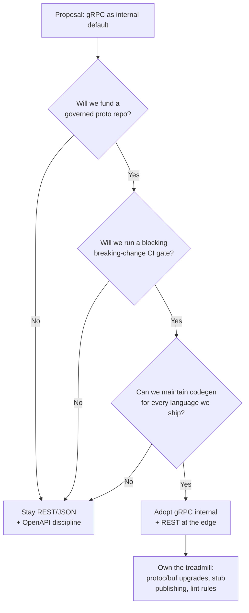
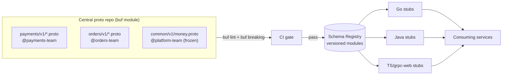
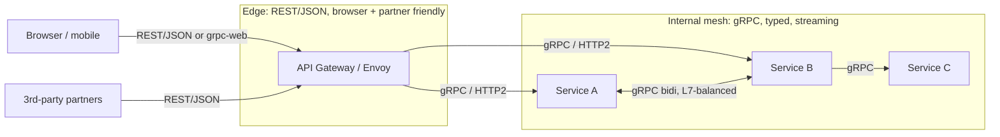

# gRPC — Staff

> **Axis:** organizational scope & judgment — NOT deeper protocol theory (that is `professional.md`).
> This file answers a Staff/Principal question: should gRPC become the *organization's* default
> internal service-to-service contract, and if so, who governs the proto repo, how do you pay for
> the tooling debt, and where do you deliberately keep REST/JSON instead? gRPC is not primarily a
> latency decision at org scale — it is a **contract-governance** decision. The wire format is the
> easy part; the schema repo, the breaking-change gate, and the polyglot codegen pipeline are the
> parts that make or break the adoption over five years.

---

## Table of Contents
1. [The Staff Framing: gRPC Is a Contract-Governance Decision](#1-the-staff-framing-grpc-is-a-contract-governance-decision)
2. [gRPC vs REST as the Org Default](#2-grpc-vs-rest-as-the-org-default)
3. [The Shared Proto Repo — Own It or Regret It](#3-the-shared-proto-repo--own-it-or-regret-it)
4. [Breaking-Change CI: buf, lint, and the Compatibility Gate](#4-breaking-change-ci-buf-lint-and-the-compatibility-gate)
5. [Polyglot Codegen Governance](#5-polyglot-codegen-governance)
6. [The Debuggability & Tooling Tax](#6-the-debuggability--tooling-tax)
7. [The Edge Problem: grpc-web, Proxies, and LBs](#7-the-edge-problem-grpc-web-proxies-and-lbs)
8. [Cost, ROI, and the Break-Even Point](#8-cost-roi-and-the-break-even-point)
9. [When NOT to Standardize on gRPC](#9-when-not-to-standardize-on-grpc)
10. [Migration & Adoption Path](#10-migration--adoption-path)
11. [Sociotechnical Impact (Conway's Law)](#11-sociotechnical-impact-conways-law)
12. [Second-Order Consequences](#12-second-order-consequences)
13. [Staff Checklist](#13-staff-checklist)

---

## 1. The Staff Framing: gRPC Is a Contract-Governance Decision

A senior engineer picks gRPC for one service because it is faster and typed. A Staff engineer
decides whether *every* new internal service defaults to gRPC — and that decision is not really
about the wire. HTTP/2 framing, Protobuf compactness, and streaming are genuine benefits, but at
25 req/s they are invisible; they matter only in the aggregate, at fleet scale, and even there the
p99 win over well-tuned HTTP/1.1 + JSON is often single-digit milliseconds.

What actually changes at org scale is where the **source of truth for every API contract** lives.
With REST/JSON the contract is de facto the running server plus a wiki page; with gRPC the contract
is a `.proto` file that is compiled, versioned, and enforced. That is a feature and a liability at
once. The feature: a machine-checkable interface that catches "you renamed a field" at CI time
instead of at 3 a.m. The liability: you now *own a schema registry and a code-generation supply
chain* that every team depends on, and if it is unowned it rots into the worst kind of shared
mutable state — one where a careless merge breaks fifty downstream services.

So the Staff decision decomposes into three commitments you must be willing to fund:

1. **A governed shared proto repo** (§3) — with clear ownership, review, and directory structure.
2. **A breaking-change CI gate** (§4) — buf breaking + lint, blocking merges, no exceptions culture.
3. **A polyglot codegen pipeline** (§5) — reproducible stubs for every language your org ships.

If you cannot commit to all three, do not make gRPC the org default. A half-governed gRPC estate is
strictly worse than disciplined REST, because it has all the tooling cost and none of the safety.

---

## 2. gRPC vs REST as the Org Default

The comparison must be made on the axes that dominate at organizational scale, not the microbenchmark
axes that dominate a blog post. Raw latency is real but rarely the deciding factor.

| Axis | gRPC (Protobuf/HTTP2) | REST/JSON (HTTP1.1/2) | Staff verdict |
|------|----------------------|----------------------|---------------|
| **Contract enforcement** | Compiler-checked `.proto`; wrong type won't build | Convention + OpenAPI (optional, often stale) | gRPC wins — this is the main reason to adopt |
| **Perf (payload/CPU)** | Compact binary, ~2–5× smaller, faster (de)serialization | Verbose text, heavier parse | gRPC wins, but matters only at high fan-out/QPS |
| **Latency** | HTTP/2 multiplexing, no head-of-line at app layer | Fine when tuned; keep-alive + HTTP/2 closes most of the gap | Marginal at typical internal QPS |
| **Streaming** | First-class bidi/server/client streaming | SSE or WebSocket bolt-ons | gRPC wins for streaming-heavy domains |
| **Debuggability** | No `curl`; need `grpcurl`/`buf curl`/reflection | `curl`, browser, Postman, any HTTP tool | REST wins decisively |
| **Browser support** | Needs grpc-web + a proxy (Envoy) | Native `fetch` | REST wins for anything a browser touches |
| **LB / proxy support** | Needs L7 HTTP/2-aware LB (long-lived conns skew L4) | Works with every LB, every CDN | REST wins on infra ubiquity |
| **Polyglot codegen** | Strong, official + community, but a pipeline to run | Any client can hand-roll JSON | gRPC wins on consistency, at a tooling cost |
| **Onboarding cost** | Learn protoc/buf, streaming semantics, status codes | Universally known | REST wins |

The honest reading: **gRPC's decisive advantages are typed contracts and streaming; REST's decisive
advantages are debuggability, browser reach, and infra ubiquity.** Everything else (perf, latency) is
a tie-breaker, not a headline. The right org default therefore depends on the *shape of your traffic*:
a high-fan-out internal mesh with many polyglot services and streaming leans gRPC; a CRUD-heavy estate
with heavy browser/partner traffic leans REST. Most mature orgs land on **gRPC internal, REST at the
edge** — and that hybrid is itself a governed decision, not an accident.

---

## 3. The Shared Proto Repo — Own It or Regret It

The single highest-leverage Staff artifact in a gRPC org is the proto repository. Get its structure
and ownership right and gRPC pays off; get it wrong and it becomes a coupling machine.

Two topologies, and you must choose deliberately:

- **Central mono-proto repo** (`buf`-style): all `.proto` in one repo, one lint config, one
  breaking-change gate, published as versioned modules. Pro: uniform governance, atomic cross-service
  review, one place to enforce style. Con: a merge chokepoint; needs `CODEOWNERS` so a team can't be
  blocked reviewing another team's schema.
- **Distributed protos** (each service owns its `.proto`, published to a registry like the Buf Schema
  Registry): local ownership, but you must enforce lint/breaking rules per-repo via a shared CI
  template, or governance drifts.

Non-negotiable structural rules regardless of topology:

- **Ownership by directory** — `CODEOWNERS` maps every proto package to a team. A schema with no owner
  is a future outage.
- **Package = versioned namespace** — `acme.payments.v1`. The `vN` suffix is your only clean path to a
  breaking change: you publish `v2` alongside `v1` and migrate consumers, you never mutate `v1`.
- **No shared "common.proto" god-file** — a `common` package imported everywhere becomes the tightest
  coupling in the org; every change forces a fleet-wide recompile. Keep shared types tiny and stable.
- **Generated code is not checked in** (or is checked in only as a convenience mirror) — the `.proto`
  is the source of truth; stubs are build artifacts.

---

## 4. Breaking-Change CI: buf, lint, and the Compatibility Gate

The reason to buy into gRPC's ceremony is this gate. Without it you have paid the tooling tax and
kept the REST failure mode (silent contract drift). The gate has three enforced layers, all blocking:

- **`buf lint`** — style and correctness: enforce package naming, `vN` versioning, that RPCs use
  request/response wrapper messages (so you can add fields later without changing the signature), no
  required fields in proto3 semantics abuse. This is where you encode org conventions once.
- **`buf breaking`** — compares the PR against the published baseline (git ref or the registry) and
  fails on wire- or source-incompatible changes: deleting a field, changing a field's type or number,
  renaming an enum value, removing an RPC. This is the safety that justifies the whole program.
- **Generated-stub build check** — regenerate stubs for every target language in CI so a proto that
  compiles but breaks a specific language's codegen is caught before publish.

The governance principle that separates a healthy estate from a broken one: **wire compatibility is
the contract, not source compatibility of the generated code.** Protobuf's compatibility rules (never
reuse a field number, only add fields, prefer `optional`/wrappers over bare scalars for nullability)
are what let a `v1` service and a `v1`-plus-three-fields client interoperate without lockstep deploys.
The `buf breaking` gate exists to make those rules unbreakable-by-accident. Reference: Protocol Buffers
language guide and the Buf documentation (`buf.build/docs`) are the canonical sources for these rules —
do not invent your own compatibility policy.

Culture matters more than the tool here. If teams learn they can bypass the gate with an
`--allow-breaking` flag "just this once," the gate is dead within a quarter. The only escape hatch is
publishing a new `vN` package — which is a feature, not a bypass.

---

## 5. Polyglot Codegen Governance

gRPC's promise is one contract, consistent clients in Go, Java, Python, TypeScript, Kotlin, C++,
Rust, etc. That promise is only real if you *own the codegen pipeline*. Ungoverned, each team runs a
different `protoc` version with different plugins and you get subtly incompatible stubs and
irreproducible builds.

What Staff must standardize:

- **A pinned toolchain** — one `protoc`/`buf` version, pinned plugin versions, defined centrally (a
  `buf.gen.yaml` and remote plugins, or a container image). Everyone generates the same way.
- **Published, versioned stub artifacts** — generate stubs once in CI and publish to your language
  registries (Go module proxy, Maven, npm, PyPI internal). Consuming teams import a stub package;
  they do not run `protoc` themselves. This eliminates "works on my machine" codegen drift and makes
  the dependency graph auditable.
- **A language-support policy** — you cannot support every language forever. Declare tier-1 languages
  (fully supported, CI-verified, first-class plugins) and tier-2 (community plugins, best-effort). A
  team that wants gRPC in a tier-3 language is signing up to own that codegen path themselves.
- **Reproducibility** — same `.proto` + same toolchain ⇒ byte-identical stubs. This is what makes the
  supply chain trustworthy and lets you bump a plugin fleet-wide with confidence.

The hidden treadmill: `protoc`/`buf`/plugin upgrades are perpetual, and a plugin that changes its
generated API surface (e.g., a new Go gRPC codegen module) forces a coordinated migration across every
consumer. Budget for this as ongoing platform work, not a one-time setup.

---

## 6. The Debuggability & Tooling Tax

This is the cost most teams underestimate and the one that generates the most day-to-day friction.
With REST, every engineer already knows how to reproduce a request: `curl`, browser devtools, Postman,
a shared HAR file. With gRPC, none of that works out of the box, and the muscle memory of the entire
org must be retrained.

The concrete taxes:

- **No `curl`** — you need `grpcurl` or `buf curl`, and they need either server reflection enabled or a
  copy of the `.proto`. Turning on reflection everywhere is itself a decision (it exposes your schema).
- **Binary on the wire** — you cannot eyeball a payload in a packet capture or a proxy log; you need
  tooling that understands Protobuf to decode it. Access logs show opaque bytes.
- **Errors are gRPC status codes**, not HTTP semantics your dashboards already parse — you must map
  gRPC status → observability, retry policy, and alerting, and teach everyone the code table.
- **Streaming is genuinely harder to debug** — a hung bidi stream has no simple "resend the request"
  reproduction, and standard L7 tooling doesn't reason about it well.

The Staff move is to *pay this tax centrally* so individual teams don't each reinvent it: provide a
standard `grpcurl`/reflection setup, a Protobuf-aware log decoder, an interceptor library that emits
consistent traces/metrics/logs with status-code mapping, and a golden-path template repo that wires
all of it up. If you make teams solve debuggability themselves, gRPC adoption stalls on frustration
regardless of its perf merits.

---

## 7. The Edge Problem: grpc-web, Proxies, and LBs

gRPC does not reach a browser. Browsers cannot speak raw gRPC (no access to HTTP/2 trailers and framing
from `fetch`), so anything a browser touches needs **grpc-web** plus a translating proxy (typically
Envoy, or Connect which speaks grpc-web/gRPC/HTTP+JSON from one handler). That means every browser-facing
gRPC service carries an extra hop and an extra piece of infra to operate.

Beyond the browser, gRPC stresses your L4 load balancing. gRPC connections are long-lived and multiplexed,
so a naive L4 (connection-level) load balancer pins many requests to one backend and load skews badly —
you need **L7, HTTP/2-aware balancing** (client-side LB with a resolver, a service mesh like Envoy/Istio,
or an xDS-based scheme) to distribute requests, not connections. CDNs and many managed L7 products have
uneven gRPC support. This is real, ongoing infra burden that a REST estate simply does not incur.

The pragmatic org topology that most large teams converge on:

**gRPC internal, REST at the edge** is not a compromise — it is the correct assignment of each protocol
to the domain where its advantages dominate. The gateway is where you translate; keeping it thin and
generated (from the same protos, via transcoding/Connect) avoids a hand-maintained second contract.

---

## 8. Cost, ROI, and the Break-Even Point

Total cost of ownership is dominated by people and platform, not the wire savings.

**Costs (mostly fixed / ongoing):**
- Platform team to own the proto repo, buf CI, codegen pipeline, and stub publishing — a standing cost.
- Debuggability tooling and interceptor libraries (§6) — build once, maintain forever.
- Edge proxy/mesh operation for grpc-web and L7 balancing (§7).
- Retraining and onboarding drag across every team.
- The upgrade treadmill (protoc/buf/plugins).

**Benefits (scale with fleet size and traffic):**
- Fewer integration outages from contract drift — the compounding win, hard to measure but large.
- Bandwidth and CPU savings from Protobuf — real only at high fan-out / high QPS.
- Faster, safer cross-service changes because the compiler catches mismatches.
- Consistent polyglot clients — less bespoke per-language client code.

**Break-even:** the fixed platform cost is only justified past a threshold of service count and
inter-service traffic. A handful of services with modest QPS will never recover the governance
investment — REST + OpenAPI is cheaper and good enough. The decision flips toward gRPC when you have
**many services, many languages, high internal fan-out, and integration bugs from schema drift are
already hurting you.** Model this explicitly: estimate the platform headcount cost per year against the
count of contract-drift incidents you expect gRPC's gate to prevent. If you can't articulate the
break-even, you are adopting on hype.

---

## 9. When NOT to Standardize on gRPC

The Staff signal is knowing where gRPC is the *wrong* default so juniors don't cargo-cult it:

- **Public / partner-facing APIs.** External developers expect REST/JSON they can `curl` and read.
  Forcing gRPC on partners is an adoption tax you will lose. Expose REST (transcoded from your protos if
  you like), keep gRPC internal.
- **Browser-first products.** If most traffic originates in a browser, the grpc-web + proxy overhead
  buys you little; native `fetch` + JSON is simpler and everyone already knows it.
- **Simple CRUD with low fan-out.** A small estate of a few services trading modest JSON will never
  recover the governance cost. REST + OpenAPI is the right default.
- **Orgs unwilling to fund governance.** Per §1, an ungoverned gRPC estate is worse than disciplined
  REST. If you can't staff the proto repo and CI gate, don't adopt.
- **Heavily heterogeneous / rapidly-prototyping teams** where the contract is still churning weekly —
  the `vN`/breaking-change discipline adds friction before the interfaces have stabilized.
- **Where existing infra can't do L7 HTTP/2 balancing** and you can't change it soon — you'll fight
  load skew and it will look like a gRPC problem when it is an infra gap.

---

## 10. Migration & Adoption Path

Never big-bang. gRPC adoption is a multi-year program, and it must be reversible at each step.

1. **Establish governance before the first service.** Stand up the proto repo, buf lint/breaking CI, and
   the codegen pipeline *first*. Adopting gRPC before the gate exists guarantees drift.
2. **Pick a beachhead** — one high-fan-out or streaming-heavy internal path where gRPC's advantages are
   real and measurable. Prove the p99/CPU/bandwidth win with numbers, not assertions.
3. **Publish the golden path** — a template service with interceptors, tracing, status-code mapping,
   `grpcurl` recipes, and generated REST transcoding. Make the right way the easy way.
4. **Dual-stack at the edge** — front new gRPC services with a REST/grpc-web gateway from day one so
   browsers and partners are never blocked. Reversibility: if adoption stalls, the edge still works.
5. **Expand by traffic value, not by mandate.** Migrate the paths where contract drift or perf actually
   hurts. Leave stable, low-value CRUD on REST — mixed is fine and correct.
6. **Version, never mutate.** All schema change flows through `vN` + the breaking gate. This is the
   permanent operating model, not a migration phase.

Reversibility check: because the edge stays REST and stubs are versioned artifacts, backing out a single
service from gRPC is a two-way door. Backing out the *governance program* after fleet-wide adoption is a
one-way door — which is exactly why §1's funding commitment must be made up front. Cross-reference the
Large-Scale Migrations section for the general expand/contract playbook.

---

## 11. Sociotechnical Impact (Conway's Law)

The proto repo *is* an org chart in disguise. Its directory structure, its `CODEOWNERS`, and its review
policy encode which teams can change what, and therefore how tightly coupled your teams become.

- A **central mono-proto repo** creates a shared surface every team touches — powerful for consistency,
  but it can become a coordination bottleneck and a political battleground over shared types. It nudges
  the org toward a strong central platform team.
- **Per-team proto ownership** mirrors autonomous service teams and reduces cross-team blocking, at the
  cost of governance uniformity you must re-impose via shared CI templates.
- A **shared `common.proto`** silently couples every team that imports it: a change there is a fleet-wide
  event. This is Conway's Law biting — an unowned shared type becomes the tightest inter-team dependency
  in the company. Keep shared types minimal, frozen, and explicitly platform-owned.

Cognitive load is the other axis. gRPC imposes a learning tax (protoc/buf, streaming semantics, status
codes, edge proxies) on every team that adopts it. A Staff engineer's job is to *absorb that load into
the platform* (golden paths, generated stubs, interceptor libraries) so product teams see a simple
"import the stub, implement the interface" experience — not the full complexity underneath.

---

## 12. Second-Order Consequences

- **The gate becomes load-bearing.** Once teams trust `buf breaking`, they stop manually reasoning about
  compatibility. If the gate is ever weakened or bypassed culturally, breaking changes flood back in and
  the org has *lost* the manual discipline it used to have. Protect the gate zealously.
- **Reflection and schema exposure.** Enabling server reflection for debuggability exposes your full API
  surface; in a zero-trust or multi-tenant boundary that is a security consideration, not a convenience.
- **Observability rework.** Metrics, tracing, and access logs built for HTTP semantics need rebuilding
  for gRPC status codes and streaming. Under-budgeting this leaves you flying blind on the new estate.
- **Vendor/registry dependence.** Standardizing on a schema registry (e.g., BSR) creates a dependency;
  weigh self-hosting vs managed and keep an export path so it stays a two-way door.
- **The metric to watch:** rate of contract-drift / integration incidents over time. If gRPC + the gate
  is working, this trends toward zero. If it isn't dropping, either the gate is being bypassed or you
  adopted gRPC where drift was never the real problem — and the governance cost is not paying back.

---

## 13. Staff Checklist
- [ ] Decision captured as an ADR with explicit "gRPC internal, REST at the edge" boundary and reversal criteria.
- [ ] Proto repo topology chosen (central vs distributed) with `CODEOWNERS` on every package.
- [ ] `buf lint` + `buf breaking` run as a **blocking** CI gate; `vN` versioning is the only breaking-change path.
- [ ] Codegen pipeline pins one toolchain; stubs published as versioned artifacts, not hand-generated per team.
- [ ] Language-support tiers declared; teams on unsupported languages own their own codegen.
- [ ] Debuggability tax paid centrally: reflection/grpcurl setup, Protobuf log decoding, interceptor library.
- [ ] Edge strategy defined: grpc-web/REST gateway and L7 HTTP/2-aware load balancing in place.
- [ ] Break-even modeled — platform cost vs drift incidents prevented; "when NOT to use gRPC" written down.
- [ ] Cross-team ownership and on-call for the proto repo, codegen pipeline, and edge proxies assigned.

*Next step:* [gRPC — Interview](interview.md)
