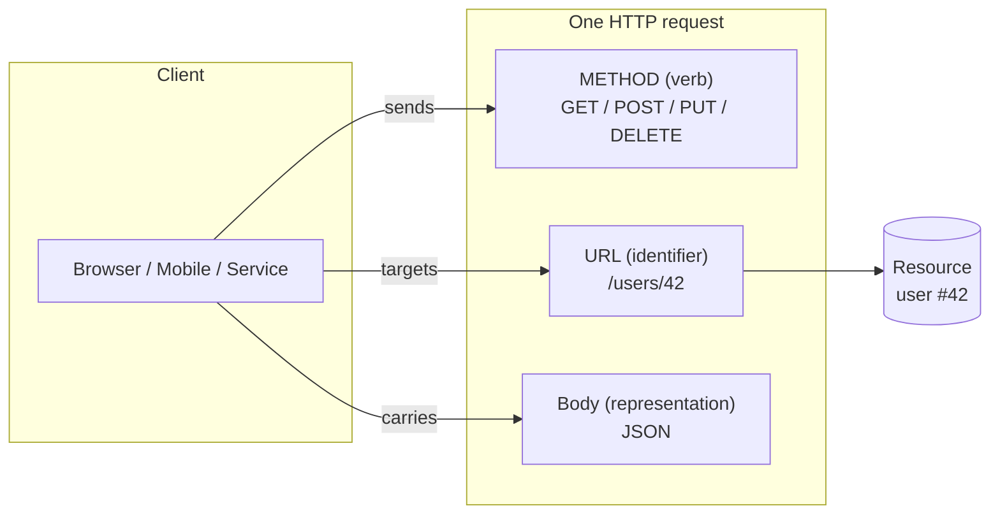
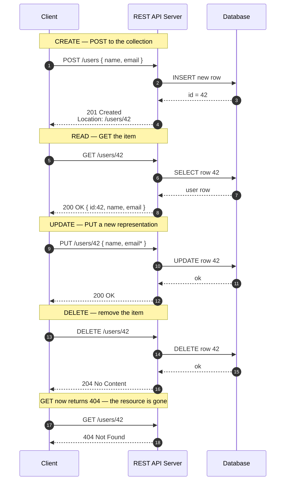
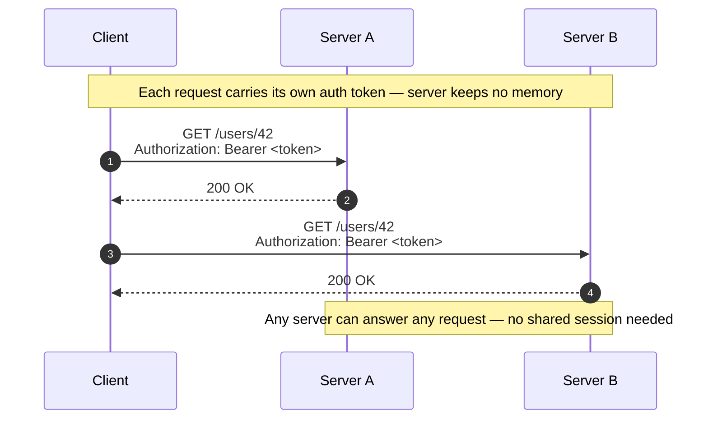

# REST — Junior

<!-- level-focus -->
At junior level, focus on this question:

> How can I apply **REST** in one small example and prove the result?

Use the smallest realistic scenario that exposes the decision and its failure behavior.
---

## 1. What REST Is (and Isn't)

REST stands for **RE**presentational **S**tate **T**ransfer. The name was coined by Roy Fielding in his 2000 PhD dissertation, describing the design principles behind the web itself. The three words are worth unpacking, because they *are* the mental model:

- **Representational** — the client never touches the "real" thing on the server (a database row, an object in memory). It exchanges a **representation** of it: a snapshot, usually as JSON.
- **State** — a resource has state (a user's name, email, whether they're active).
- **Transfer** — you move that state back and forth over HTTP: read a copy, send an updated copy.

So a REST API is a way of exposing your application's data as a set of **resources** that clients read and modify by transferring representations over HTTP.

What REST is **not**:

- It is **not** a protocol or a standard — there is no "REST spec" you can validate against. It is a set of constraints (a *style*).
- It is **not** the same as "any API that returns JSON over HTTP." Many APIs called "REST" only follow *some* of the constraints. That is fine for a junior to know; the point is the ideal you're aiming at.
- It is **not** tied to a language or framework. You can build a REST API in Go, Python, Java, Node — the style is about the *interface*, not the implementation.

The single biggest idea: **model your domain as nouns (resources), not verbs (actions).** A beginner instinctively designs endpoints like `/createUser`, `/getUser`, `/deleteUser` — that is verbs. REST says: there is one noun, `/users`, and HTTP already gives you the verbs (`POST`, `GET`, `DELETE`). You stop inventing verbs.

---

## 2. The Four Pillars: Resources, URLs, Methods, Representations

Everything in REST rests on four ideas. Learn these and the rest is detail.

| Pillar | One-line definition | Example |
|--------|---------------------|---------|
| **Resource** | Any "thing" worth naming — an entity or concept in your domain | a user, an order, a comment, a photo |
| **URL (identifier)** | The unique address that names one resource or a collection of them | `/users` (collection), `/users/42` (one item) |
| **HTTP method (verb)** | The standardized action you apply to a resource | `GET`, `POST`, `PUT`, `PATCH`, `DELETE` |
| **Representation** | The concrete format of the resource's state in a request/response body | a JSON object describing the user |

The elegance is in the **separation**: the *what* (resource, named by URL) is decoupled from the *how* (action, named by method). A small, fixed set of methods works on an unlimited number of resources. You never have to teach a client a new verb — it already knows `GET` and `DELETE`. To support a new kind of thing, you just add a new URL.



Read that diagram as one sentence: *the client sends a **method** to a **URL**, optionally carrying a **representation** in the body, to act on a **resource**.*

---

## 3. A Concrete Example: the `/users/42` Resource

Abstractions click once you see them on one real resource. Let's take a `User` and follow its whole life through a REST API.

Assume the API base is `https://api.example.com`. There are two kinds of URL here:

- **Collection URL** — `/users` — names the whole set of users.
- **Item URL** — `/users/42` — names exactly one user, the one whose id is `42`.

That `42` is the resource's identity, baked right into the address. This is the heart of REST: the URL *is* the name of the thing.

**Create** — add a new user. You `POST` a representation (without an id; the server assigns it) to the *collection*:

```http
POST /users
Content-Type: application/json

{ "name": "Ada Lovelace", "email": "ada@example.com" }
```

```http
201 Created
Location: /users/42
Content-Type: application/json

{ "id": 42, "name": "Ada Lovelace", "email": "ada@example.com", "active": true }
```

The server created the resource, gave it id `42`, and told you where it now lives via the `Location` header.

**Read** — fetch that user. `GET` the *item* URL, no body needed:

```http
GET /users/42
```

```http
200 OK
Content-Type: application/json

{ "id": 42, "name": "Ada Lovelace", "email": "ada@example.com", "active": true }
```

**Update** — change the user. `PUT` a full new representation to the item URL (it replaces the resource's state):

```http
PUT /users/42
Content-Type: application/json

{ "name": "Ada Lovelace", "email": "ada@newmail.com", "active": true }
```

```http
200 OK
```

**Delete** — remove the user. `DELETE` the item URL:

```http
DELETE /users/42
```

```http
204 No Content
```

Notice what *didn't* happen: we never created an endpoint named `/updateUserEmail` or `/deactivateUser`. One noun (`/users`), one item address (`/users/42`), and HTTP's built-in verbs did all four operations. That is REST working as intended.

---

## 4. HTTP Methods → CRUD Actions

The four database operations every application performs — **C**reate, **R**ead, **U**pdate, **D**elete — map almost directly onto HTTP methods. This mapping is the practical core of REST.

| HTTP Method | CRUD Action | Typical target | Body? | Success code | Notes |
|-------------|-------------|----------------|-------|--------------|-------|
| `POST` | **Create** | collection (`/users`) | yes (new state, no id) | `201 Created` | server assigns the id; returns `Location` |
| `GET` | **Read** | item or collection (`/users/42`, `/users`) | no | `200 OK` | must not change server state |
| `PUT` | **Update / replace** | item (`/users/42`) | yes (full new state) | `200 OK` / `204 No Content` | replaces the *whole* resource |
| `PATCH` | **Update / partial** | item (`/users/42`) | yes (only changed fields) | `200 OK` | changes *part* of the resource |
| `DELETE` | **Delete** | item (`/users/42`) | no | `204 No Content` | removes the resource |

Two properties of these methods matter even at junior level, because they shape correct behavior:

- **Safe** — the method does not change server state. `GET` is safe; you can call it a thousand times and nothing is created or destroyed. This is why a browser can prefetch and a proxy can cache `GET` responses. Never hide a state change behind a `GET` (e.g., `GET /users/42/delete` is an anti-pattern precisely because `GET` is supposed to be safe).
- **Idempotent** — calling it once or many times leaves the *same* end state. `GET`, `PUT`, and `DELETE` are idempotent; `DELETE /users/42` twice still ends with user 42 gone. `POST` is **not** idempotent — `POST /users` twice creates *two* users. This is why retrying a timed-out `POST` is risky, and why retrying a `PUT` or `DELETE` is safe.

`PUT` vs `PATCH` is the one subtlety here: `PUT` sends the **entire** resource and replaces it (omit a field and you may blank it out); `PATCH` sends **only the fields you want to change**. When in doubt as a beginner, `PUT` with the full object is the simplest correct choice.

> Reference for exact method semantics: [MDN — HTTP request methods](https://developer.mozilla.org/en-US/docs/Web/HTTP/Methods) and the authoritative [RFC 9110 §9 — Methods](https://www.rfc-editor.org/rfc/rfc9110#section-9).

---

## 5. A CRUD Lifecycle on One Resource (staged diagram)

Here is the full life of user `42` as an ordered sequence — create, read, update, then delete — showing what the client sends and what the server returns at each step. Read the numbers top to bottom.



The final two steps make the model tangible: once you `DELETE` the resource, its URL no longer names anything, so a later `GET` on that same URL correctly returns `404 Not Found`. The URL is a name; delete the thing and the name points at nothing.

---

## 6. Statelessness: Why Every Request Stands Alone

**Stateless** is a defining REST constraint, and it trips up beginners because it sounds like "the app can't remember anything." It doesn't mean that. It means:

> The **server keeps no client session state between requests.** Every request must carry *all* the information the server needs to understand and process it, entirely on its own.

Concretely: the server does not remember that "this is the same client who logged in two requests ago." If a request needs to prove who the caller is, that proof (e.g., an auth token in a header) must ride along **on every single request**. The server processes each request in isolation, as if it had never seen the client before.



Why the constraint is worth the trouble:

- **Scalability.** Because no server stores per-client memory, *any* server behind a load balancer can handle *any* request. You can add ten more servers and the load balancer sprays requests across all of them freely. This is the single biggest reason REST scales horizontally — statelessness is what makes servers interchangeable.
- **Reliability.** If a server crashes mid-traffic, no session is lost — there was no session on the server to lose. The client just retries against another server.
- **Simplicity.** Each request is understandable on its own. You can read one request in a log and know exactly what it does, without reconstructing a session history.

The trade-off: every request is a little "heavier," because it re-sends context (like the auth token) that a stateful design might have stored once. In practice that cost is small and the scaling win is enormous. Note that *client* state (like being logged in) still exists — it just lives **on the client** (which holds the token), not as session memory on the server.

---

## 7. Designing Resource URLs

Good REST URLs are readable, predictable, and made of **nouns**. A newcomer's URLs leak verbs and internals; a clean REST design reads almost like English.

| Intent | ❌ Verb-in-URL (avoid) | ✅ RESTful (nouns + methods) |
|--------|------------------------|------------------------------|
| Create a user | `POST /createUser` | `POST /users` |
| Get one user | `GET /getUser?id=42` | `GET /users/42` |
| Update a user | `POST /updateUser/42` | `PUT /users/42` |
| Delete a user | `GET /deleteUser/42` | `DELETE /users/42` |
| List a user's orders | `GET /getOrdersForUser?u=42` | `GET /users/42/orders` |
| Get one order | `GET /order?id=7` | `GET /orders/7` |

The rules a junior can apply immediately:

1. **Nouns, not verbs.** The verb is the HTTP method. The URL names a thing. `POST /users`, not `POST /createUser`.
2. **Plural collections.** Use `/users`, not `/user`, for the set. Then `/users/42` reads naturally as "user 42 within the users collection."
3. **Hierarchy shows relationships.** A user's orders live *under* the user: `/users/42/orders`. This nesting expresses "orders belonging to user 42."
4. **Identify with path segments, filter with the query string.** The path names *what* (`/users/42`); the query string (`?`) is for search, filtering, sorting, and pagination of collections (`/users?active=true&page=2`). Don't use the query string to name a single resource.
5. **Consistency over cleverness.** Pick a convention (lowercase, hyphens for multi-word: `/order-items`) and use it everywhere. Predictability is the whole point — a client should be able to *guess* the URL for orders once it has seen the URL for users.

---

## 8. Status Codes You Actually Need

The HTTP status code is how the server tells the client, in one number, what happened. You don't need all of them yet — this handful covers the vast majority of REST responses.

| Code | Meaning | When you send it |
|------|---------|------------------|
| `200 OK` | Success, response has a body | successful `GET`, `PUT`, `PATCH` |
| `201 Created` | A new resource was created | successful `POST`; include a `Location` header |
| `204 No Content` | Success, no body to return | successful `DELETE`, or a `PUT` with nothing to send back |
| `400 Bad Request` | The client's request was malformed | invalid JSON, missing required field |
| `401 Unauthorized` | No/invalid credentials | missing or bad auth token |
| `403 Forbidden` | Authenticated, but not allowed | logged in, but lacks permission for this resource |
| `404 Not Found` | The resource doesn't exist | `GET /users/999` where no user 999 exists |
| `409 Conflict` | Request conflicts with current state | creating a user with an email that already exists |
| `500 Internal Server Error` | The server broke | an unhandled exception on the server side |

The families are the mental shortcut, and they map cleanly onto responsibility:

- **2xx — success.** It worked.
- **4xx — the client made a mistake.** Bad input, missing auth, asking for something that isn't there. The client should fix the request and can retry.
- **5xx — the server made a mistake.** The client's request was fine; something failed on the server. Retrying later may work.

Getting these right is a hallmark of a real REST API. Returning `200 OK` with a body that says `{"error": "not found"}` is a classic beginner mistake — the *status code* is the primary signal, and it should be `404`.

> Full catalog with precise semantics: [MDN — HTTP response status codes](https://developer.mozilla.org/en-US/docs/Web/HTTP/Status) and [RFC 9110 §15 — Status Codes](https://www.rfc-editor.org/rfc/rfc9110#section-15).

---

## 9. Common Beginner Mistakes

1. **Verbs in URLs.** `POST /createUser`, `GET /getUser`, `POST /users/42/delete`. The URL names a resource; the *method* is the verb. This is the mistake to unlearn first.
2. **Using `GET` to change state.** `GET /users/42/deactivate` looks convenient but violates the "safe" property of `GET` — proxies and browsers may prefetch it and silently trigger the change. State changes belong in `POST`/`PUT`/`PATCH`/`DELETE`.
3. **Always returning `200 OK`.** Signalling errors in the body while the status stays `200` defeats HTTP's whole error mechanism. Let the status code carry the outcome; use `4xx`/`5xx` for failures.
4. **Storing session state on the server.** Relying on the server to "remember" the client between requests breaks statelessness and prevents you from adding more servers. Carry the needed context (e.g., the auth token) on each request.
5. **Confusing `PUT` and `POST`.** `POST /users` creates (server assigns id, not idempotent). `PUT /users/42` replaces a *known* resource (idempotent). Using `POST` to update or `PUT` to create-with-a-guessed-id leads to surprises on retries.
6. **Singular/plural and casing chaos.** Mixing `/user/42` and `/users` and `/Users` in the same API destroys the predictability that makes REST pleasant. Pick one convention and hold it.

---

## 10. Hands-On Exercise

Design (on paper, no code) a small REST API for a **blog** with two resources: **posts** and, nested under each post, its **comments**. Produce:

1. **The URL table.** Write the collection and item URLs for both resources, including the nested comments (e.g., where does "all comments on post 5" live?).
2. **The method → action mapping.** For each of create / read-one / read-all / update / delete on a post, write the exact `METHOD /url` line and the success status code it returns.
3. **One full lifecycle.** Pick a single comment and walk it from `POST` (create) through `GET` (read) and `PUT` (update) to `DELETE`, writing the request line and expected status code at each step — then note what a `GET` on that comment's URL returns *after* the delete.
4. **A statelessness check.** The blog requires login to create a post. Explain, in two sentences, what the client must include on the `POST /posts` request and why the server can't just "remember" that the client logged in earlier.

**Self-check:** every URL you wrote should be a noun, every action should be an HTTP method (not a word in the URL), and every response should carry a status code that matches its HTTP family (2xx success, 4xx client error, 5xx server error).

---

*Next step:* [REST — Middle](middle.md)

---

## Apply it

1. Choose one small, known input for **REST**.
2. Predict the output or observable behavior.
3. Run the smallest example or probe that exercises the concept.
4. Change one input to trigger a failure or boundary case.
5. Explain the evidence using the guide's vocabulary.

## Verify your work

- Record the exact input, command or code path, and output.
- Repeat the probe and confirm the result is consistent.
- Show one expected success and one expected failure.
- Resolve any difference between the prediction and the evidence.

## Review questions

- What problem does REST solve in the example?
- Which input changes the observed result, and why?
- What is the smallest useful success check?
- Which beginner mistake would your evidence catch?
