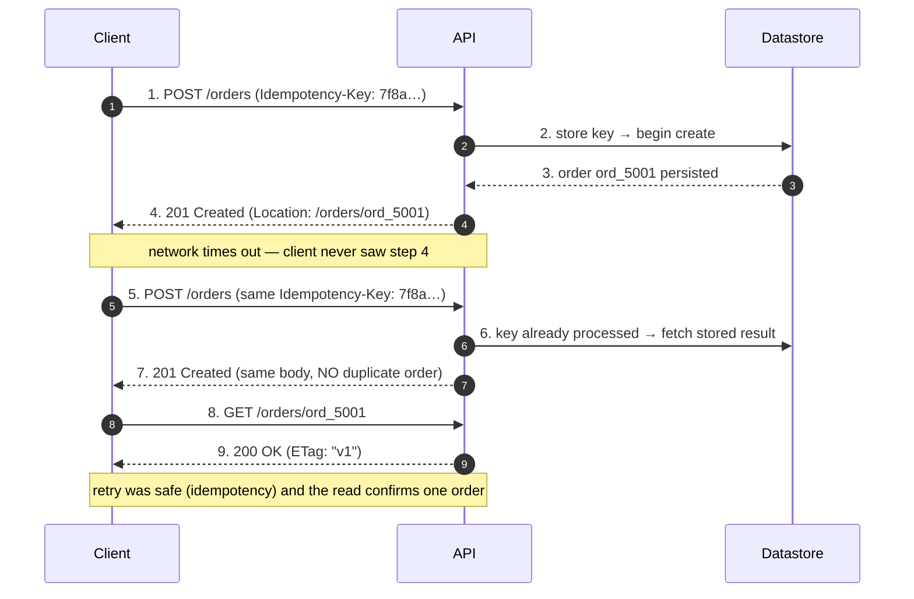

# REST — Middle

<!-- level-focus -->
At middle level, focus on this question:

> Where does **REST** belong in a maintainable component, and which trade-off selects the design?

Use the smallest realistic scenario that exposes the decision and its failure behavior.
## 1. Resource Modeling — Nouns, Not Verbs

REST models a system as a set of **resources** — the *nouns* a client cares about (an order, a user, a
payment) — each addressable by a URL and manipulated through the uniform set of HTTP methods. The single
most common mistake at this level is smuggling the *verb* into the path:

```text
BAD (RPC-over-HTTP masquerading as REST):
  POST /createOrder
  POST /getOrderById?id=42
  POST /order/42/cancel
  GET  /listActiveUsers

GOOD (resources + methods):
  POST   /orders                 → create an order
  GET    /orders/42              → read one order
  GET    /orders                 → read a collection (filtered/paginated)
  DELETE /orders/42             → delete an order
```

The verb is already carried by the **method**; encoding it again in the path defeats caching,
proxies, and every tool that reasons about HTTP semantics. The discipline: *pick the noun, then let
`GET/POST/PUT/PATCH/DELETE` express what you do to it.*

Two resource shapes cover almost everything:

- **Collection** — a plural noun that holds many items: `/orders`, `/users`. `POST` to a collection
  creates a member; `GET` reads the (paginated) list.
- **Item** (singleton member) — one element of a collection, keyed by a stable identifier:
  `/orders/42`. `GET/PUT/PATCH/DELETE` operate on the single item.

**Actions that aren't CRUD.** Some operations genuinely don't map to create/read/update/delete —
"cancel this order", "publish this article", "refund this payment". Two acceptable patterns:

1. **Model the action as a sub-resource** whose *existence* is the state change:
   `POST /orders/42/cancellation` creates a cancellation record. This stays RESTful and gives you a
   place to store *who cancelled and why*.
2. **Change a state field via PATCH:** `PATCH /orders/42` with `{"status": "cancelled"}`. Simpler,
   but the transition rules live in the server (you must reject illegal transitions).

Prefer (1) when the action has its own data or audit trail; prefer (2) for a plain status flip. Avoid
the third temptation — a verb path like `POST /orders/42/cancel` — unless the operation is a true
non-idempotent command with no natural noun (a documented, deliberate exception, not the default).

---

## 2. URL Design — Collections, Items, Nesting

A URL identifies a resource; it is not a place to encode behavior or serialize your database schema.
Rules that hold up in practice:

| Rule | Do | Don't |
|------|----|-------|
| Plural collection names | `/orders`, `/users` | `/order`, `/getUsers` |
| Lowercase, hyphenated segments | `/shipping-addresses` | `/ShippingAddresses`, `/shipping_addresses` |
| Stable identifiers in the path | `/orders/42` | `/orders?id=42` |
| Filters/options in the query string | `/orders?status=paid&limit=20` | `/orders/status/paid/limit/20` |
| No trailing slash inconsistency | pick one, canonicalize | `/orders` **and** `/orders/` differing |
| No file extensions for format | `Accept: application/json` | `/orders/42.json` |

**Nesting expresses containment / ownership.** When an item only makes sense inside a parent, nest it:

```text
GET /users/7/orders            → orders belonging to user 7
GET /orders/42/line-items      → line items of order 42
GET /orders/42/line-items/3    → one line item
```

But **stop nesting at one, occasionally two levels.** Deep nesting (`/users/7/orders/42/line-items/3/
taxes/1`) is brittle: it forces callers to know the full ancestry to reach a leaf, and it breaks the
moment a leaf can be reached by more than one path. Once an item has a globally unique id, expose it at
the top level too: `GET /line-items/3`. Nesting is a *convenience for scoping and listing*, not the
only way to address a resource.

**Identifiers.** Prefer opaque, stable ids that don't leak internals. Sequential integers reveal your
row count and enable enumeration attacks; UUIDs or prefixed public ids (`ord_9f8a…`) are safer and
survive re-sharding. Whatever you choose, the id must never change for the life of the resource —
clients bookmark and cache URLs.

---

## 3. Methods → Semantics → Status Codes

Each method carries semantics (from RFC 9110) that clients, caches, and proxies rely on. Getting the
method *and* the status code right is what separates a usable API from one that surprises every caller.

| Method | Safe | Idempotent | Typical use | Success status |
|--------|:----:|:----------:|-------------|----------------|
| `GET` | ✓ | ✓ | Read item or collection | `200 OK` |
| `POST` | ✗ | ✗ | Create in a collection; non-idempotent action | `201 Created` (+ `Location`) / `200`/`202` |
| `PUT` | ✗ | ✓ | Full replace of an item at a known URL | `200 OK` / `204 No Content` |
| `PATCH` | ✗ | ✗* | Partial update of an item | `200 OK` / `204 No Content` |
| `DELETE` | ✗ | ✓ | Remove an item | `204 No Content` / `200 OK` |
| `HEAD` | ✓ | ✓ | Headers only (existence, size, ETag) | `200 OK` |
| `OPTIONS` | ✓ | ✓ | Advertise allowed methods / CORS preflight | `200 OK` / `204` |

\* `PATCH` is *not* required to be idempotent, though a well-designed merge patch usually is (§7).

**Status codes you actually send** — the small, correct vocabulary:

```text
2xx — success
  200 OK              read succeeded; update returned a body
  201 Created         POST created a resource → include Location: /orders/42
  202 Accepted        accepted for async processing; not done yet
  204 No Content      success, nothing to return (DELETE, PUT/PATCH w/o body)

3xx — redirection / caching
  304 Not Modified    conditional GET; client's cached copy is still fresh (see §9.1)

4xx — client error (do NOT retry unchanged; the request is the problem)
  400 Bad Request     malformed syntax / invalid body you can't parse
  401 Unauthorized    missing/invalid credentials (authentication)
  403 Forbidden       authenticated but not allowed (authorization)
  404 Not Found       resource does not exist (or is hidden by policy)
  409 Conflict        state conflict: duplicate, version mismatch, illegal transition
  422 Unprocessable   syntactically valid but semantically invalid (validation failed)
  429 Too Many Reqs   rate limited → include Retry-After

5xx — server error (safe to retry idempotent methods with backoff)
  500 Internal        unexpected server fault
  503 Service Unavail overloaded / maintenance → include Retry-After
```

Two distinctions people get wrong at the middle level:

- **`401` vs `403`.** `401` = "I don't know who you are" (authentication failed / absent). `403` = "I
  know who you are and you still can't." A `401` invites the client to (re)authenticate; a `403` does
  not.
- **`400` vs `422`.** `400` for a body you can't even parse as valid JSON/format. `422` for a body that
  parsed fine but violates business rules (e.g., `quantity: -1`). Some teams collapse both into `400` —
  fine, but be consistent and describe the error in the body.

**Always return a machine-readable error body**, not just a status. RFC 9457 *Problem Details*
(`application/problem+json`) is the standard shape:

```json
{
  "type": "https://example.com/probs/out-of-stock",
  "title": "Out of stock",
  "status": 422,
  "detail": "Product prod_88 has 0 units available; requested 3.",
  "instance": "/orders",
  "errors": [{ "field": "line_items[0].quantity", "message": "exceeds available stock" }]
}
```

---

## 4. A Well-Designed Endpoint, End to End

Concrete beats abstract. Here is a create-then-read flow for an orders API, showing method, status,
`Location`, and the read that follows.

**Create (`POST` to the collection):**

```http
POST /orders HTTP/1.1
Host: api.example.com
Content-Type: application/json
Idempotency-Key: 7f8a9b12-4c3d-4e5f-8d2e-1a2b3c4d5e6f

{ "customer_id": "cus_31", "line_items": [ { "product_id": "prod_9", "quantity": 2 } ] }
```

```http
HTTP/1.1 201 Created
Location: /orders/ord_5001
Content-Type: application/json

{
  "id": "ord_5001",
  "status": "pending",
  "customer_id": "cus_31",
  "total": "39.98",
  "line_items": [ { "product_id": "prod_9", "quantity": 2, "unit_price": "19.99" } ],
  "created_at": "2026-07-02T10:15:00Z",
  "_links": {
    "self":   { "href": "/orders/ord_5001" },
    "cancel": { "href": "/orders/ord_5001/cancellation", "method": "POST" }
  }
}
```

**Read the item back (follow the `Location`):**

```http
GET /orders/ord_5001 HTTP/1.1
Host: api.example.com
Accept: application/json
```

```http
HTTP/1.1 200 OK
ETag: "v1"
Cache-Control: private, max-age=0

{ "id": "ord_5001", "status": "pending", ... }
```

The staged flow, including the idempotent-retry and the conditional read:



Notice: `POST` created the resource and returned `201` **with a `Location` header** — the client never
has to guess the new URL. The retry (step 5) is safe because of the idempotency key (§8). The `GET`
returns `200` with an `ETag` the client can use for later conditional requests (§9.1).

---

## 5. Pagination — Offset vs Cursor

Never return an unbounded collection. `GET /orders` on a 50-million-row table is a self-inflicted
outage. The two mainstream strategies:

**Offset / limit** — "skip N, take M":

```http
GET /orders?limit=20&offset=40      →  rows 41–60
```

Simple and allows jumping to an arbitrary page. But it has two real problems: (1) the database still
*scans and discards* the first `offset` rows, so deep pages (`offset=1000000`) get progressively slower;
(2) it is unstable under concurrent writes — if a row is inserted while a user pages, rows shift and
items are duplicated or skipped across pages.

**Cursor / keyset** — "give me the items after this opaque marker":

```http
GET /orders?limit=20                          → first page
GET /orders?limit=20&cursor=eyJpZCI6Ijk4NyJ9  → items after cursor
```

The cursor encodes the sort key of the last item seen (e.g., `(created_at, id)`), so the query becomes
`WHERE (created_at, id) < (:c_ts, :c_id) ORDER BY created_at DESC, id DESC LIMIT 20` — index-friendly and
**constant time regardless of depth**. It is stable under inserts because it anchors on a value, not a
position. The trade-off: you cannot jump to "page 500" — only forward/back from where you are.

| Dimension | Offset / Limit | Cursor / Keyset |
|-----------|----------------|-----------------|
| Deep-page performance | Degrades (scans + discards) | Constant (index seek) |
| Stability under writes | Poor (rows shift → dup/skip) | Strong (anchored on a key) |
| Jump to arbitrary page | Yes | No (sequential only) |
| Total count available | Easy (`COUNT`) | Hard / expensive |
| Implementation cost | Trivial | Needs a stable, unique sort key |
| Best for | Small/admin datasets, page numbers | Large, live, infinite-scroll feeds |

**Return pagination metadata**, so clients don't parse URLs by hand:

```json
{
  "data": [ /* ...20 orders... */ ],
  "page": {
    "limit": 20,
    "next_cursor": "eyJpZCI6Ijk4NyJ9",
    "has_more": true
  },
  "_links": {
    "self": { "href": "/orders?limit=20" },
    "next": { "href": "/orders?limit=20&cursor=eyJpZCI6Ijk4NyJ9" }
  }
}
```

Cap `limit` server-side (e.g., max 100) even if the client asks for more — the client does not get to
choose your worst case.

---

## 6. Filtering, Sorting, Sparse Fields

Filtering, sorting, and field selection are *modifiers on a read* and belong in the **query string**,
never in the path:

```http
GET /orders?status=paid&created_after=2026-06-01&sort=-created_at&fields=id,status,total&limit=50
```

Conventions that scale:

- **Filtering:** one query parameter per filterable field — `?status=paid&customer_id=cus_31`. Multiple
  values via repetition or comma list — `?status=paid,shipped`. For ranges, adopt a documented suffix
  scheme (`?price_gte=10&price_lte=100`) rather than inventing an ad-hoc mini-language.
- **Sorting:** a single `sort` parameter with a sign convention — `sort=-created_at,name` means
  "created_at descending, then name ascending". Whitelist sortable fields; an arbitrary
  `ORDER BY user_input` is both a performance and injection hazard.
- **Sparse fieldsets:** `?fields=id,status,total` lets the client trim the payload. This cuts bandwidth
  on mobile and is cheap to implement (project the columns / prune the serialized map).
- **Search vs filter:** exact-match filters (`status=paid`) differ from full-text search
  (`q=blue+shirt`). Keep them separate parameters so the server can route search to a different engine.

Every one of these is optional and must have a sane default (no filter = everything up to the page
limit; no sort = a deterministic default like `-created_at, id` so pagination is stable).

---

## 7. PUT vs PATCH — Partial Updates Done Right

Both update an existing item, but they mean different things:

- **`PUT`** = "make the resource *equal to* this representation." It is a **full replacement**. Any
  field omitted from the body is (semantically) set to its default/absent value. `PUT` is **idempotent**:
  sending the same body twice leaves the resource in the same state.
- **`PATCH`** = "apply this *partial change* to the resource." You send only the fields that change.
  `PATCH` is not required by HTTP to be idempotent, though a merge-style patch usually is.

```http
PUT /orders/ord_5001            PATCH /orders/ord_5001
Content-Type: application/json  Content-Type: application/merge-patch+json

{                               {
  "customer_id": "cus_31",        "status": "paid"
  "status": "paid",             }
  "line_items": [ ... ]         → only status changes; everything else untouched
}
→ replaces the WHOLE order
```

The dangerous middle-level bug: using `PUT` to change one field but sending a *partial* body. Because
`PUT` means "replace," a strict server will wipe every omitted field. If you want partial semantics,
use `PATCH`.

Two standard `PATCH` formats — pick one and document it:

- **JSON Merge Patch (RFC 7386, `application/merge-patch+json`):** the body is a sparse object; present
  keys are set, and a key with value `null` **deletes** that field. Intuitive, but it *cannot* express
  "set this field to literal null" and cannot patch array elements individually.
- **JSON Patch (RFC 6902, `application/json-patch+json`):** an ordered list of operations
  (`add`/`remove`/`replace`/`move`/`test`). More powerful (array edits, conditional `test` ops) but
  verbose and harder for casual clients.

| | PUT | PATCH (merge) | PATCH (json-patch) |
|---|-----|---------------|--------------------|
| Body content | Full representation | Only changed fields | List of operations |
| Missing field means | Reset / remove | Leave unchanged | N/A (explicit ops) |
| Idempotent | Yes (required) | Usually | Depends on ops (`add` to array isn't) |
| Delete a field | Omit it | Set it to `null` | `{"op":"remove","path":"/x"}` |
| Media type | `application/json` | `application/merge-patch+json` | `application/json-patch+json` |
| Best for | Small, fully-known resources | Everyday partial edits | Complex/array-precise edits |

Pair updates with **optimistic concurrency** to avoid lost updates: require `If-Match: "v1"` (the
`ETag` the client last read). If another writer changed the resource, its `ETag` moved and the server
returns `412 Precondition Failed` — the client re-reads and retries instead of silently clobbering
someone else's change (see §9.1 for conditional requests).

---

## 8. Idempotency for Safe Retries

Networks fail *after* the server did the work but *before* the client saw the response. The client,
seeing a timeout, retries. For `GET/PUT/DELETE` this is fine — they are idempotent by definition. For
**`POST`** (create a payment, place an order) a naive retry **charges the customer twice**.

The fix is an **idempotency key**: a unique token the *client* generates per logical operation and
sends in a header:

```http
POST /payments HTTP/1.1
Idempotency-Key: 7f8a9b12-4c3d-4e5f-8d2e-1a2b3c4d5e6f
Content-Type: application/json

{ "amount": "100.00", "currency": "USD", "account_id": "acc_123" }
```

Server-side algorithm:

```text
1. Read Idempotency-Key from the header.
2. Look it up in a fast store (Redis / a dedicated table), keyed by (key, endpoint).
   → FOUND, completed  : return the stored status + body verbatim. Do NOT re-execute.
   → FOUND, in-flight  : return 409 Conflict (a retry arrived while the first runs).
   → NOT FOUND         : atomically insert the key as "in-flight", then process.
3. On completion, store the response (status + body) against the key with a TTL (e.g. 24h).
```

Rules that make it correct:

- The key is **client-generated** (a UUIDv4) — the client controls what "the same operation" means.
- Scope the key to the endpoint and, ideally, hash the request body: a *different* body under the *same*
  key should be rejected (`422`) rather than silently returning the old result.
- Give stored keys a **TTL** — you're deduplicating retries (seconds to hours), not storing history
  forever.
- This is how Stripe, and most payment APIs, make `POST` safe to retry. It complements — does not
  replace — server-side uniqueness constraints (a unique index on `(account, order_ref)` is your last
  line of defense).

Return `Retry-After` on `429`/`503` so clients back off intelligently rather than hammering you.

---

## 9. Versioning — URL vs Header

An API is a contract. The moment external clients depend on it, *breaking* changes (removing a field,
renaming, tightening validation, changing a status code) need a versioning strategy. *Additive* changes
(new optional field, new endpoint) should **not** need a new version if clients are built to ignore
unknown fields — design them to.

Three mainstream approaches:

| Approach | Example | Pros | Cons |
|----------|---------|------|------|
| **URL path** | `GET /v2/orders/42` | Obvious, cache/proxy-friendly, trivial to route and to `curl` | Version leaks into every URL; strictly not "one resource, one URI"; encourages copy-paste v1→v2 |
| **Custom header** | `Accept-Version: 2` | Keeps URLs clean and stable | Invisible in a browser/log; easy to forget; harder to cache by version |
| **Media type (content negotiation)** | `Accept: application/vnd.example.v2+json` | Purest REST; versions the *representation*, not the resource | Verbose; poor tooling; steep learning curve for clients |

**Pragmatic default: URL path versioning** (`/v1/...`). It is unambiguous, routes cleanly at the
gateway, is visible in logs and dashboards, and every client library and CDN handles it without special
config. Its theoretical impurity (the same order now has two URIs) rarely matters against how much
operational friction it removes. Reserve header/media-type versioning for APIs where a very clean URL
space is a hard requirement.

Whatever you choose:

- **Keep old versions running** until clients migrate; announce deprecation with dates and use the
  `Deprecation` / `Sunset` response headers to signal timelines programmatically.
- **Version at a coarse grain** (v1, v2) — not per endpoint, and never `v1.3.7` in the URL. Semantic
  micro-versions belong in your changelog, not your routes.
- **Default to additive, non-breaking evolution** so you bump the major version rarely. Most well-run
  public APIs live on `v1` for years.

---

## 10. HATEOAS / Links in Practice

HATEOAS (Hypermedia As The Engine Of Application State) is Fielding's constraint that responses should
carry the **links** telling a client what it can do next, so the client follows links instead of
hard-coding URL templates. In practice full HATEOAS is rare, but a *pragmatic* subset pays off:

```json
{
  "id": "ord_5001",
  "status": "pending",
  "total": "39.98",
  "_links": {
    "self":     { "href": "/orders/ord_5001" },
    "customer": { "href": "/customers/cus_31" },
    "cancel":   { "href": "/orders/ord_5001/cancellation", "method": "POST" },
    "pay":      { "href": "/orders/ord_5001/payment",      "method": "POST" }
  }
}
```

The value: the *server* decides which transitions are legal for the current state. When `status`
becomes `paid`, the response simply stops emitting the `pay` link and stops offering `cancel` — the
client renders whatever links it receives and never hard-codes "an order can be paid." This decouples
clients from your state machine and lets you evolve URLs and workflows without a client release.

Where it earns its keep concretely:

- **Pagination links** (`next`/`prev`) — clients follow them blindly; you can change the cursor scheme
  freely (§5).
- **State-dependent actions** — surfacing exactly the valid next operations per resource state.
- **Discoverability** — a client that starts at the root can crawl the API.

Where it usually isn't worth full purity: internal service-to-service calls with a shared, versioned
contract, and high-throughput mobile clients that pre-generate URLs for speed. The middle-level takeaway
is *include `self` and next-action links* — it costs little and removes a whole class of client-side URL
construction bugs — without pretending your clients will discover the entire API at runtime.

---

## 11. Middle Checklist
- [ ] URLs are plural nouns; verbs live in methods, not paths. No `/getOrder`, no `/order/42/cancel`.
- [ ] Nesting stops at one (occasionally two) levels; top-level ids exist for globally addressable items.
- [ ] Every method returns the *correct* status code; `401` vs `403` and `400` vs `422` are distinguished.
- [ ] `201 Created` responses include a `Location` header pointing at the new resource.
- [ ] Errors return a machine-readable body (`application/problem+json` or an equivalent documented shape).
- [ ] Collections are always paginated with a server-enforced max `limit`; cursor pagination for large/live sets.
- [ ] Filtering/sorting/field-selection live in the query string with whitelisted, defaulted parameters.
- [ ] `PUT` is a full replace; partial edits use `PATCH` with a chosen, documented patch format.
- [ ] Optimistic concurrency (`ETag` + `If-Match` → `412`) protects updates against lost writes.
- [ ] `POST`s that create money/orders accept a client `Idempotency-Key`; retries never duplicate.
- [ ] A versioning strategy (default: `/v1` URL path) exists, with `Deprecation`/`Sunset` for retirement.
- [ ] Responses carry at least `self` and next-action `_links`; pagination exposes `next`/`prev`.

*Next step:* [REST — Senior](senior.md)

---

## Apply it

1. Find a real component where **REST** affects an interface or dependency.
2. Write two plausible choices and the constraint that favors each one.
3. Make the smallest reversible change at that boundary.
4. Exercise the component alone, then exercise the integrated flow.
5. Keep the decision note with the evidence that selected the option.

## Verify your work

- A focused check proves the local behavior.
- An integrated check proves callers and dependencies still agree.
- Logs, traces, compiler output, or benchmarks expose the boundary.
- Reverting the change restores the previous behavior without unrelated edits.

## Review questions

- Which boundary is most affected by REST?
- What constraint would make you choose the alternative design?
- How would you isolate a local defect from an integration defect?
- What evidence shows that the change remains maintainable?
