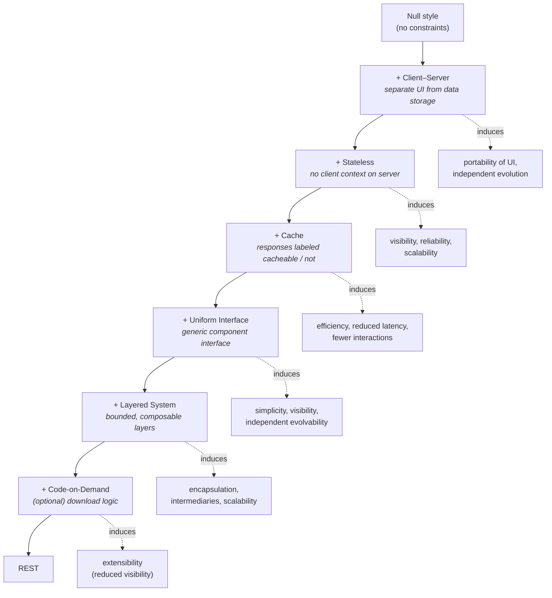
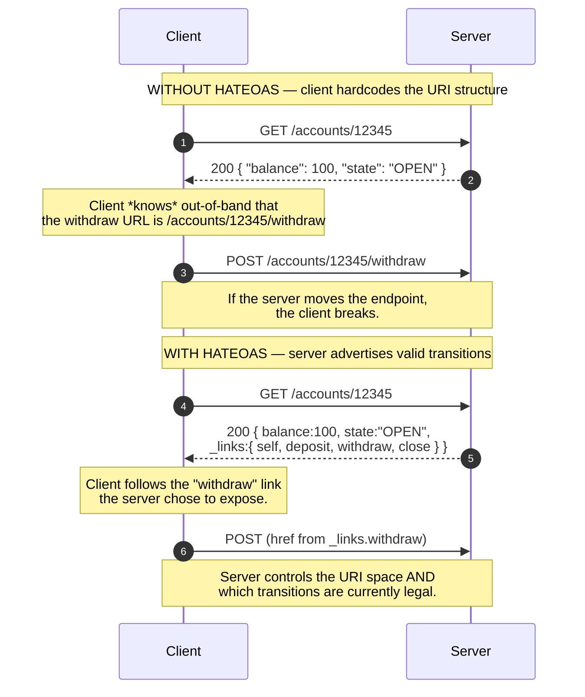
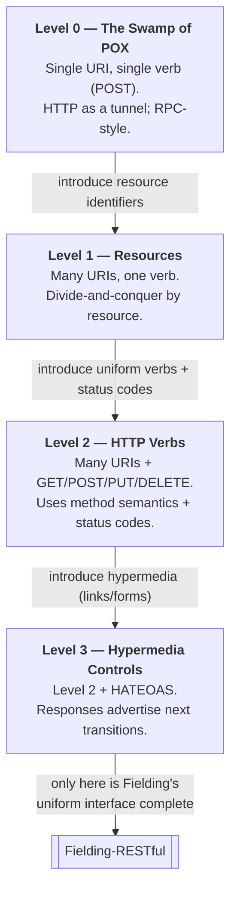

# REST — Professional

<!-- level-focus -->
At professional level, focus on this question:

> How should teams adopt and operate **REST** with measurable outcomes and limited coordination?

Use the smallest realistic scenario that exposes the decision and its failure behavior.
## 1. What "Architectural Style" Means

Fielding defines a **software architecture** as a configuration of *architectural elements* —
components, connectors, and data — constrained in their relationships to achieve a set of desired
properties (Fielding 2000, Ch. 1). An **architectural style** is then a *named, coordinated set of
architectural constraints* that restricts the roles of those elements and the allowed relationships
among them within any architecture that conforms to the style.

The crucial move — and the reason the dissertation reads like a derivation rather than a
description — is methodological:

> A style is a **coordinated set of constraints**. Each constraint is applied deliberately because
> it *induces* a property that the designer wants, usually at the cost of some other property.

So REST is not a specification, not a protocol, and not a wire format. It is a set of six
constraints. HTTP is *one* protocol designed to be a good realization of the REST style; REST is
the style and can, in principle, be realized over other substrates. Confusing "REST" with "HTTP+JSON"
is the single most common category error in the industry, and every later section here exists to
undo it.

The key vocabulary Fielding uses:

| Term | Meaning in the dissertation |
|------|-----------------------------|
| **Constraint** | A restriction applied to the architecture to induce a property. |
| **Property** | An architecturally desirable quality (scalability, visibility, etc.) that a constraint produces. |
| **Induce** | The relationship "constraint C causes property P" — the whole style is a graph of these. |
| **Element** | Component, connector, or datum — the things constraints restrict. |
| **Style** | A named bundle of constraints, applied together. |

---

## 2. The Derivation: Null Style → REST

Fielding builds REST incrementally. He starts from the **null style** — an empty set of constraints,
a system with no distinguished boundaries where components are free to do anything — and adds one
constraint at a time (Fielding 2000, §5.1). The order matters: each step is justified by the property
it buys and the trade-off it accepts. This staged derivation is the heart of the professional-level
understanding.

Read the diagram top-down as the derivation and the dashed edges as the *induced properties*. Two
things stand out:

- The **order is not arbitrary**: statelessness is only meaningful once you have a client–server
  split; cache constraints refine the stateless request/response semantics; the uniform interface
  is what makes layering and caching *generic* rather than per-application.
- **Code-on-demand is explicitly optional.** Fielding marks it as the only optional constraint
  because it *reduces* visibility (an intermediary can no longer fully understand a message whose
  processing depends on downloaded code). A system can be RESTful without it; it cannot drop any of
  the other five and still claim the name.

---

## 3. The Six Constraints and Their Induced Properties

Each constraint is a design decision that trades one property for another. The professional skill is
being able to name, for any constraint, *both* the property gained and the property sacrificed.

### 3.1 Client–Server

Separate concerns: the client owns the user interface; the server owns data storage and business
logic. They communicate through a well-defined interface.

- **Induces:** portability of the UI across platforms; simpler server components; **independent
  evolution** of client and server as long as the interface is stable.
- **Sacrifices:** nothing structural — this is the foundational separation.

### 3.2 Stateless

Each request from client to server must contain *all* information necessary to understand and process
it. The server holds **no client session state** between requests; session state lives entirely on
the client.

- **Induces:** **visibility** (a monitor can understand a request by looking at that request alone),
  **reliability** (partial failures are easier to recover from — no orphaned server session), and
  **scalability** (the server can free resources immediately after each request and any server can
  handle any request → trivial load balancing).
- **Sacrifices:** network efficiency (repeated data must be re-sent on every request) and server
  control over consistent application behavior (state is now the client's responsibility).

### 3.3 Cacheable

Responses must, implicitly or explicitly, label themselves as cacheable or non-cacheable. A cacheable
response may be reused by the client (or an intermediary) for later, equivalent requests.

- **Induces:** **efficiency** — the best interaction is the one that is eliminated. Caching reduces
  latency for the user and load on the server; some interactions are avoided entirely.
- **Sacrifices:** consistency — a cache can serve stale data, so cache semantics (freshness,
  validation) must be part of the protocol.

### 3.4 Uniform Interface

A single, generic interface between components. This is the **central distinguishing feature** of
REST and is itself decomposed into four sub-constraints (Section 4).

- **Induces:** **simplicity**, **visibility** (interactions are self-descriptive), and — most
  importantly — **independent evolvability** of components, because implementations are decoupled
  from the services they provide.
- **Sacrifices:** efficiency, because information is transferred in a standardized form rather than
  one tuned to the application's specific needs.

### 3.5 Layered System

The architecture is composed of hierarchical layers; each component can "see" only the immediate
layer it interacts with, not beyond it. This permits proxies, gateways, and load balancers to be
inserted transparently.

- **Induces:** **encapsulation** of legacy services, ability to place **intermediaries**
  (shared caches, security enforcement, load balancing) anywhere in the path, and thereby further
  **scalability**.
- **Sacrifices:** latency (each layer adds processing overhead), partially offset by shared caching
  at the intermediaries.

### 3.6 Code-on-Demand (optional)

Servers may extend client functionality by shipping executable code (scripts, applets) that the
client runs.

- **Induces:** **extensibility** — clients can be simplified and features deployed after the client
  ships.
- **Sacrifices:** **visibility** — this is why it is the *only optional* constraint; an intermediary
  can no longer necessarily interpret a message whose meaning depends on downloaded code.

### 3.7 Summary Table — Constraint → Property → Trade-off

| # | Constraint | Property Induced | Trade-off Accepted | Optional? |
|---|-----------|------------------|--------------------|-----------|
| 1 | Client–Server | UI portability, independent evolution, separation of concerns | — | No |
| 2 | Stateless | Visibility, reliability, scalability | Network efficiency (repeated data); server loses behavioral control | No |
| 3 | Cacheable | Efficiency, reduced latency, fewer interactions | Potential staleness → needs freshness/validation semantics | No |
| 4 | Uniform Interface | Simplicity, visibility, independent evolvability | Efficiency (standardized, not tuned, form) | No |
| 5 | Layered System | Encapsulation, intermediaries, scalability, security enforcement points | Added latency per layer | No |
| 6 | Code-on-Demand | Client extensibility | **Reduced visibility** | **Yes** |

The distilled system-level properties REST is engineered for are **scalability** (statelessness +
caching + layering), **visibility** (statelessness + uniform interface), and **evolvability /
independent deployability** (client–server + uniform interface). These three are the payoff of the
whole derivation and are why the Web scaled to planetary size on a style, not a spec.

---

## 4. The Uniform Interface — Four Sub-Constraints

The uniform interface is what makes REST *REST* rather than any other client–server style. Fielding
decomposes it into four interface constraints (Fielding 2000, §5.1.5):

### 4.1 Identification of Resources

Every concept worth talking about is a **resource**, and each resource is named by a stable
identifier (a URI in the HTTP realization). A resource is not a document or a database row — it is a
*membership function over time*: the mapping "the current weather in Boston" points to different
representations on different days, but the identifier and the concept are constant.

> A resource R is a temporally varying membership function `M_R(t)`, mapping a time `t` to a set of
> entities (values) that are equivalent for the purposes of that resource. This abstraction lets an
> identifier remain stable while the underlying value changes.

### 4.2 Manipulation of Resources Through Representations

Clients never touch resources directly. They exchange **representations** — a chosen encoding of a
resource's current (or intended) state, carrying data plus metadata (e.g., a media type). A client
holding a representation, together with any attached metadata, has enough to modify or delete the
resource on the server (subject to permission). This is the indirection that makes content
negotiation, versioning of formats, and multiple encodings of the same resource possible.

### 4.3 Self-Descriptive Messages

Each message contains enough information to describe **how to process it**: the method semantics,
the media type of the representation, cache-control metadata, and so on. Nothing about interpreting a
message should require out-of-band knowledge specific to the application. Self-description is what
lets a *generic* intermediary — a cache, a proxy — participate correctly without understanding the
application's domain.

### 4.4 Hypermedia as the Engine of Application State (HATEOAS)

The client transitions from one application state to the next by selecting from **links and forms
embedded in the representations** it receives, rather than from any fixed, out-of-band knowledge of
the server's URI structure. The server drives the interaction by advertising, in each response, the
next set of valid transitions. This is the constraint almost universally omitted in practice, and it
is the subject of the next section.

### 4.5 Sub-Constraint Table

| Sub-constraint | What it fixes | HTTP realization | Property it protects |
|----------------|---------------|------------------|----------------------|
| Identification of resources | Every concept has a stable name | URI | Addressability, bookmarkability |
| Manipulation through representations | Clients act on copies of state, not internals | Representation + media type; PUT/PATCH/DELETE | Format independence, content negotiation |
| Self-descriptive messages | Messages carry their own processing rules | Method + `Content-Type` + cache headers + status codes | Visibility, generic intermediaries |
| Hypermedia / HATEOAS | Server advertises valid next transitions | Links/forms in the body (e.g., HAL, Siren, `Link` header) | Evolvability, loose coupling |

---

## 5. HATEOAS: Hypermedia as the Engine of Application State

HATEOAS is the constraint that most distinguishes a truly RESTful system, and the one whose absence
Fielding has publicly and repeatedly flagged (Fielding, "REST APIs must be hypertext-driven," 2008).

**The core idea:** *application state* — where the client is in a multi-step interaction — is driven
by the hypermedia the server sends, not by a client-side model of the API's URI space. The client
should begin at a single well-known entry point and discover every subsequent action from the links
and forms in the responses it receives. The server is thereby free to change its URI structure,
because clients follow links rather than construct URLs from templates baked into their code.

Contrast the two coupling models:

Two properties this induces that nothing else does:

1. **Server-controlled affordances.** If the account is `FROZEN`, the server simply omits the
   `withdraw` link. The set of *legal* transitions is now part of the resource's representation, not
   duplicated as business logic in every client. Application state and the rules governing its
   evolution live in one place.
2. **Independent evolvability.** The server can restructure its URI space, split endpoints, or move
   to new hosts, and a link-following client keeps working. This is the ultimate expression of the
   uniform interface's promise of decoupling implementation from interface.

The engineering cost — clients must be written to *follow* links rather than *template* them, and
must understand media types rich enough to express affordances (HAL, Siren, JSON:API, Collection+JSON,
or Atom) — is why RMM Level 3 is rare in practice. That does not make lower levels "wrong"; it makes
them **less than fully RESTful by Fielding's definition**, which is exactly what the maturity model
lets us say precisely.

---

## 6. The Richardson Maturity Model as a Formalization

Leonard Richardson's maturity model (presented 2008; popularized by Martin Fowler, "Richardson
Maturity Model," 2010) decomposes "how RESTful is this API?" into three orthogonal technology
adoptions, giving four levels. It is not part of Fielding's dissertation, but it is the most useful
*ruler* the industry has for measuring how much of the uniform interface an API actually implements.

Each ascending level adopts one more piece of the uniform interface:

| Level | Name | URIs | HTTP methods | Hypermedia | Maps to which sub-constraints |
|-------|------|------|--------------|------------|-------------------------------|
| **0** | The Swamp of POX | One endpoint | One verb (usually POST) | None | None — HTTP is just a transport tunnel (SOAP/XML-RPC live here) |
| **1** | Resources | Many, one per resource | Still effectively one verb | None | *Identification of resources* |
| **2** | HTTP Verbs | Many | Full method semantics + status codes | None | + *Self-descriptive messages*, *manipulation through representations* |
| **3** | Hypermedia Controls | Many | Full | Links/forms in responses | + *HATEOAS* → uniform interface complete |

**The precise claim to internalize:** the vast majority of production "REST APIs" sit at **Level 2** —
resource URIs, correct verbs, correct status codes, but no hypermedia. By Fielding's definition,
Level 2 is a well-designed HTTP API but **not yet REST**, because the uniform interface is incomplete:
its fourth sub-constraint (HATEOAS) is missing. Only **Level 3** satisfies the full uniform interface.
Fowler is careful to frame Levels 0–2 as valuable, incremental "steps toward the glory of REST," not
as failures — and that framing is the pragmatic reconciliation between the dissertation and everyday
engineering.

Worked reading of the levels on one operation — "get a doctor's open slots and book one":

- **Level 0:** `POST /appointmentService` with an XML body describing the request; a second
  `POST /appointmentService` to book. One URI, one verb, meaning encoded in the payload.
- **Level 1:** `POST /doctors/mjones` returns slots; `POST /slots/1234` books. Distinct resource URIs
  now, but POST still does everything.
- **Level 2:** `GET /doctors/mjones/slots?date=...` (safe, cacheable) returns slots; `POST /slots/1234`
  creates the booking and returns `201 Created`. Verbs and status codes now carry meaning.
- **Level 3:** the slots response *embeds a link* for booking each slot; the booking response embeds
  links to `addTest`, `cancel`, etc. The client discovers what it can do next from the response.

---

## 7. Architectural Elements: Resources, Representations, Connectors

Fielding's data and connector view (Fielding 2000, §5.2) names the concrete elements the constraints
operate on. Precision here separates professional from surface understanding.

**Data elements** — REST's defining choice is *where* processing happens relative to *where* data
lives. Rather than move raw data to the client's processor (client–server database style) or move the
processor to the data (mobile-code style), REST **moves representations of resource state** across the
network in a standardized form. The data elements are:

| Element | Example | Role |
|---------|---------|------|
| Resource | "the users collection" | The conceptual target of any reference; the unit of identification. |
| Resource identifier | URI | The stable name of a resource. |
| Representation | JSON/HTML/XML byte sequence | A capture of the resource's current or intended state. |
| Representation metadata | media type, `Last-Modified` | Describes the representation. |
| Resource metadata | source link, alternates, vary | Describes the resource beyond a single representation. |
| Control data | cache-control, method, status | Governs how the message is processed (self-description). |

**Connectors** — the abstract interfaces for component communication: **client** (initiates
requests), **server** (listens and responds), **cache** (stores reusable responses), **resolver**
(translates identifiers to network addresses, e.g., DNS), and **tunnel** (relays bytes across a
boundary). Statelessness applies to these connectors: a connector need not retain state between
requests, which is precisely what makes any server interchangeable and any intermediary insertable.

**Components** by role: **origin server** (authority for a resource's representations), **gateway**
(intermediary imposed by the network/origin, e.g., a reverse proxy), **proxy** (intermediary chosen
by the client), and **user agent** (initiates the request, e.g., a browser). The layered-system
constraint is what lets gateways and proxies exist transparently.

---

## 8. Why the Constraints Compose: Property Interactions

The constraints are not independent bullet points; their *interactions* are where the style's power
comes from. Three interactions are worth stating explicitly:

1. **Stateless + Layered + Cacheable → horizontal scalability.** Because no request depends on
   server-held session state (stateless), any node can serve any request; because responses are
   self-labeled cacheable, an intermediary layer can absorb load without understanding the
   application (cache + layered). The combination is what let the Web put shared caches and load
   balancers anywhere in the path. Remove statelessness and the cache/layer benefits collapse,
   because intermediaries can no longer reason about a request in isolation.

2. **Uniform interface + Self-descriptive messages → generic intermediaries.** A cache or proxy can
   correctly handle a message it has never seen for an application it knows nothing about, *because*
   the method semantics, cacheability, and media type are all in the message. This is why one HTTP
   cache implementation works for every website on Earth. Break self-description (e.g., stuff meaning
   into a POST body that only the origin understands) and every intermediary is blinded — which is
   exactly what happens at RMM Level 0.

3. **Client–Server + Uniform interface + HATEOAS → independent evolvability.** The client is coupled
   only to a *media type* and an *entry point*, not to a URI layout or a fixed set of endpoints. The
   server can evolve its internal structure freely. This is the property REST optimizes above all,
   and it is the one most often sacrificed by Level-2 APIs that hardcode URI templates in clients.

The professional insight: **when a team says "we don't need HATEOAS," they are making an
evolvability-for-simplicity trade** — a legitimate engineering decision, but one they should be able
to name in Fielding's own terms, not one made by accident.

---

## 9. Precise Reasoning and Common Misreadings

A checklist of the distinctions that separate a rigorous account from folklore:

- **REST ≠ HTTP ≠ JSON.** REST is a style; HTTP is a protocol that realizes it well; JSON is a
  representation format. A CRUD-over-HTTP JSON API is (at best) RMM Level 2, which is *not* REST by
  Fielding's own criterion because it lacks HATEOAS.
- **"Stateless" means no *client session* state on the server — not "no state anywhere."** Resource
  state absolutely lives on the server; that is the whole point. What must not persist across
  requests is *application/session* state; that belongs on the client.
- **Code-on-demand is the only optional constraint, and it *lowers* visibility.** If someone claims
  a design "isn't REST because it has no downloadable code," they have it backwards.
- **A "resource" is not a row or a document.** It is a time-varying membership function; the same URI
  can map to different representations over time, and one resource can have many representations
  (content negotiation).
- **Level 2 is not a failure.** Fowler explicitly frames the RMM levels as incremental value.
  The professional stance is to know *what* you gave up (evolvability, self-navigation) by stopping
  at Level 2, and to make that choice deliberately.
- **HATEOAS is about coupling, not about pretty JSON with a `_links` key.** The test is whether a
  client can operate by *following* server-advertised transitions from a single entry point, or
  whether it must *know the URI structure in advance*. Only the former decouples client from server.

Holding these six distinctions cleanly is what "professional-level REST" means: the ability to place
any real API on the constraint graph, name the properties it enjoys and the ones it forfeited, and
justify the trade in the dissertation's own vocabulary.

---

## 10. Sources

- **Roy T. Fielding, *Architectural Styles and the Design of Network-based Software Architectures*,
  Ph.D. Dissertation, University of California, Irvine, 2000** — especially Chapter 5 ("Representational
  State Transfer"): §5.1 (deriving REST from the null style), §5.1.5 (the uniform interface
  sub-constraints), and §5.2 (data and connector elements). The primary and authoritative source.
- **Roy T. Fielding, "REST APIs must be hypertext-driven," 2008** — Fielding's own clarification that
  APIs lacking HATEOAS should not be called REST.
- **Leonard Richardson, "Justice Will Take Us Millions Of Intricate Moves" (QCon, 2008)** — original
  presentation of the maturity model.
- **Martin Fowler, "Richardson Maturity Model," 2010** — the widely cited written treatment framing
  Levels 0–3 as steps toward REST.
- **RFC 9110, *HTTP Semantics* (IETF, 2022)** — the current normative definition of HTTP methods,
  status codes, caching, and representation metadata that realize REST's constraints over HTTP;
  supersedes RFC 7231 and RFC 2616.

---

## Apply it

1. Define the user or business outcome that **REST** should improve.
2. Assign one owner for code, contracts, operations, and incidents.
3. Split delivery into reversible increments that produce evidence early.
4. Publish responsibilities, escalation paths, and compatibility windows.
5. Stop or expand only when the agreed measures support that decision.

## Verify your work

- Each increment has an owner, rollback path, and observable exit condition.
- Adoption, reliability, delivery time, and coordination cost are measured.
- Incident and migration exercises prove that responsibility is executable.
- The old path is removed only after telemetry proves it is unused.

## Review questions

- Which measurable outcome justifies investing in REST?
- Which team owns the full lifecycle and incident response?
- What reversible increment produces the earliest useful evidence?
- Which exit condition proves that migration or adoption is complete?
