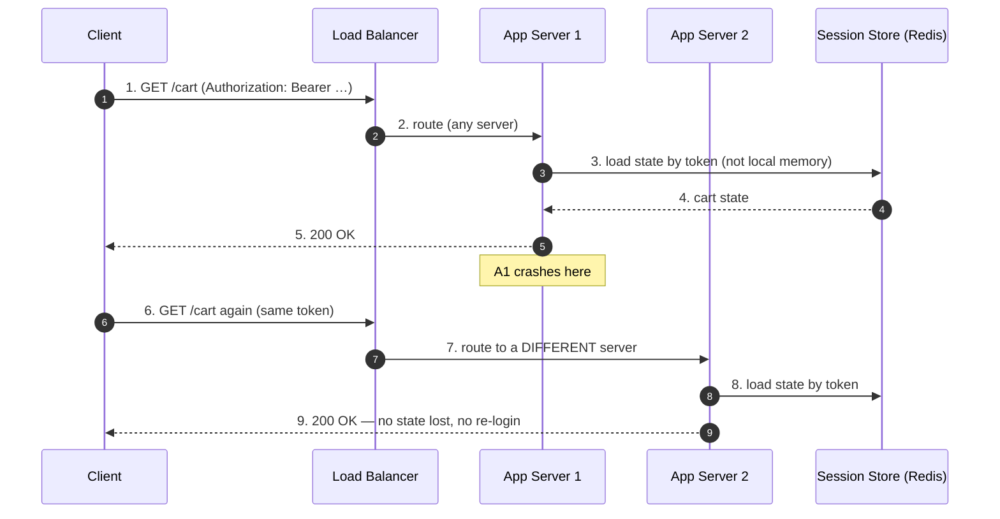
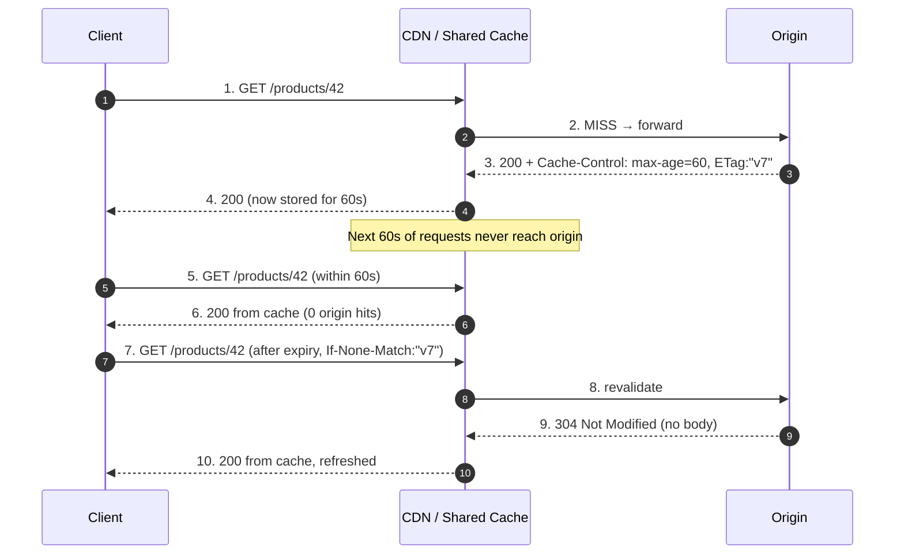
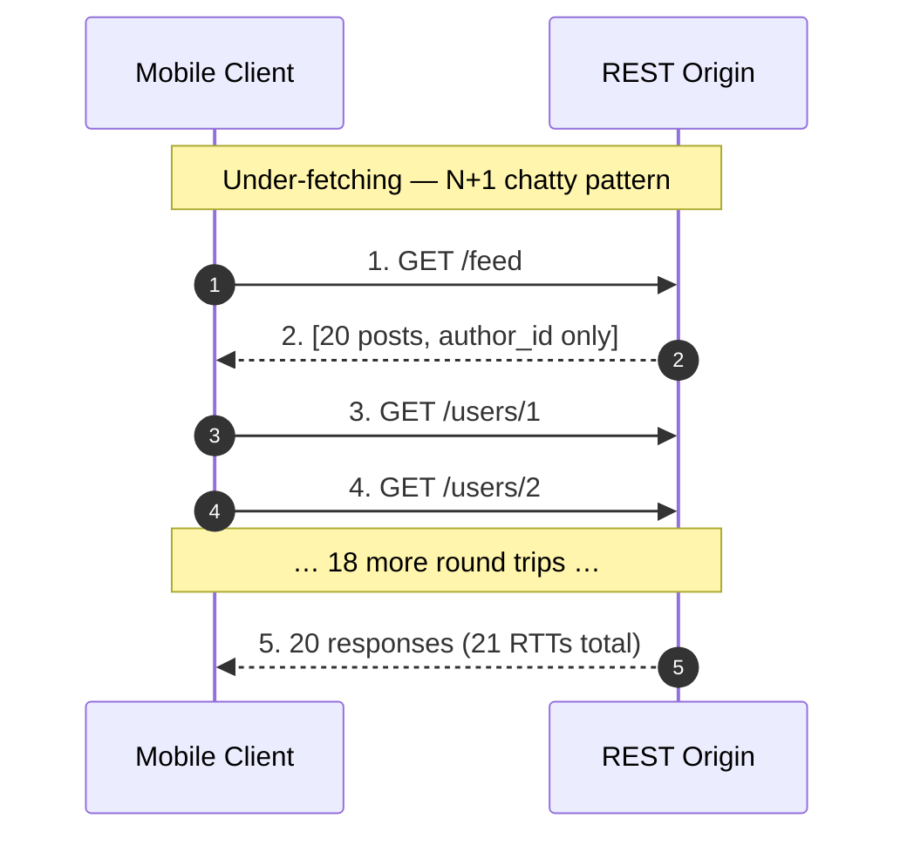
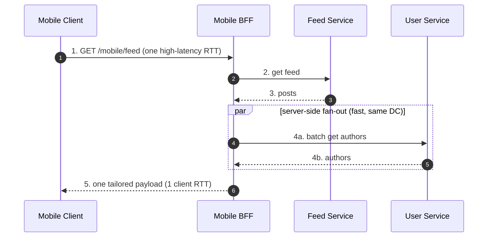

# REST — Senior

<!-- level-focus -->
At senior level, focus on this question:

> Which system invariant is affected by **REST** under failure, load, and change?

Use the smallest realistic scenario that exposes the decision and its failure behavior.
## 1. What Senior Ownership of REST Means

At a junior level REST is "HTTP verbs on nouns." At a senior level REST is a set of **architectural constraints with quantifiable payoffs** — and a contract you are on the hook for over years, across clients you do not control (mobile apps in app-store review, third-party integrators, internal services on their own release trains).

Your job at this level:

- **Choose which REST constraints to honor and which to relax**, and be able to defend the trade-off in numbers (cache hit rate, RPS per box, client round trips).
- **Design the contract for evolution first.** A field you ship is a field you support until every client is dead. The expensive decisions are the ones that are hard to reverse.
- **Own the failure modes** that emerge at scale: chatty clients doing N+1 requests, a "small" breaking change that bricks a shipped mobile version, a non-idempotent endpoint that double-charges on retry.

The through-line of this file: REST's constraints exist to make *intermediaries* (caches, proxies, load balancers, gateways) and *independent evolution* work. When you get the payoff, keep the constraint. When you are paying the cost without the payoff, relax it deliberately — never by accident.

---

## 2. The Constraints Are the Product

Fielding's dissertation (Roy T. Fielding, *Architectural Styles and the Design of Network-based Software Architectures*, 2000, Chapter 5) defines REST as a set of constraints derived by adding them one at a time to the null style. The constraints are not decoration — each one buys a specific systemic property:

| Constraint | Property it buys | What you lose if you drop it |
|---|---|---|
| **Client–Server** | Separation of concerns; independent evolution of UI and storage | UI and data layer become coupled; can't scale independently |
| **Stateless** | Any request → any server; trivial horizontal scaling; visibility for load balancers | Sticky sessions; server memory grows with users; failover loses state |
| **Cacheable** | Responses reusable by intermediaries; fewer origin hits | Every read hits origin; no CDN/proxy leverage |
| **Uniform Interface** | Generic intermediaries (caches, proxies) work without app-specific knowledge | Each cache/proxy must understand your custom protocol |
| **Layered System** | Insert gateways, LBs, CDNs transparently | Client must know full topology |
| **Code-on-Demand** (optional) | Extend client at runtime | (Rarely used; optional) |

The senior insight: **you rarely need all of REST, but you should know exactly which property you are trading away when you skip a constraint.** Dropping statelessness to hold a WebSocket is fine — as long as you have accounted for the loss of trivial failover and per-server scaling.

---

## 3. Statelessness → Horizontal Scaling and Caching

Statelessness means each request carries everything the server needs to process it; the server keeps **no client session state between requests**. This is the constraint with the largest operational payoff.

**Why it enables horizontal scaling:** if request N does not depend on server memory left over from request N−1, then any of your N servers can serve any request. You put a stateless load balancer in front, add boxes linearly, and capacity grows linearly. There is no session affinity to pin a user to a box, so a box dying loses zero user state — the next request just lands elsewhere.

The key move: **push state OUT of the app server** — into the request itself (tokens, request bodies) or into shared stores (Redis, DB). The app tier stays a stateless, interchangeable, auto-scalable fleet. This is the same property that lets you run app servers as ephemeral containers, drain them for deploys, and let auto-scaling kill them without ceremony.

**Statelessness also enables caching**, because a cacheable response is one whose meaning does not depend on hidden server-side context. If a `GET /products/42` means "the product with id 42" regardless of who asks or what happened before, an intermediary can store it and replay it. The moment a response depends on server session state, its cacheability collapses.

The cost you pay: statelessness can mean **larger requests** (auth token + context on every call) and **repeated work** (re-loading state per request). At scale the trade — linear scaling and cacheability — almost always wins, which is why it is a constraint and not a suggestion.

---

## 4. Uniform Interface → Intermediaries That Just Work

The uniform interface (standard methods, resource identification via URIs, self-descriptive messages) is what lets **generic** components sit between client and origin without understanding your application.

A shared HTTP cache can cache *any* well-behaved REST API because it only needs to understand HTTP semantics: `GET` is safe and cacheable, `Cache-Control` says how long, `ETag` identifies a version, `Vary` lists the request headers that change the response. It does not need to know that `/products/42` is a product. Contrast an RPC endpoint `POST /getProduct {"id":42}` — a generic cache cannot cache it, because `POST` is not safe and the semantics are opaque.

The senior takeaway: **the uniform interface is why you can drop a CDN, an API gateway, or an nginx cache in front of a REST service and get value with near-zero application changes.** Every deviation from it (custom verbs tunneled through POST, semantics hidden in bodies, side effects on GET) quietly disables one of these intermediaries. Honoring HTTP method semantics — `GET`/`HEAD` safe, `PUT`/`DELETE`/`GET` idempotent — is not pedantry; it is what makes proxies, retries, and caches correct by default.

---

## 5. Cacheability as a First-Class Design Concern

Cacheability is where REST's payoff is most measurable. Design decisions:

**Freshness vs validation.**
- `Cache-Control: max-age=N` — response is fresh for N seconds; served without touching origin. Best for data that tolerates bounded staleness (catalogs, public content).
- `ETag` + `If-None-Match` (or `Last-Modified` + `If-Modified-Since`) — conditional revalidation; origin returns `304 Not Modified` with no body when unchanged. Cheap even when you *must* revalidate every time.

**Public vs private.** `Cache-Control: private` (or `Authorization`-scoped) keeps per-user responses out of shared caches. Get this wrong and a shared CDN can serve user A's data to user B — a classic and severe bug. `Vary: Authorization, Accept-Encoding` tells the cache which request dimensions change the response.

**Cache-key hygiene.** Anything that changes the response must be in the cache key: path, relevant query params, and `Vary` headers. A response that depends on a header not listed in `Vary` is a cache-poisoning waiting to happen.

**The scaling math.** If reads outnumber writes 100:1 and you achieve a 95% edge cache hit rate, origin read traffic drops ~20×. That is the difference between one region of origin boxes and five. Cacheability is not a nicety — it is a capacity-planning lever.

**What kills cacheability (own these):**
- Side effects on `GET` (a "GET that increments a counter" cannot be safely cached or retried).
- Per-request tokens embedded in URLs (cache key explodes; hit rate → 0).
- Missing or over-conservative `Cache-Control` (defaults vary; be explicit).
- Highly personalized responses at the resource level (push personalization to a thin, uncacheable layer over cacheable base resources).

---

## 6. Strict REST vs Pragmatic "REST-ish"

The **Richardson Maturity Model** grades REST adoption:

- **Level 0** — one URI, one verb (RPC-over-HTTP; the "swamp of POX").
- **Level 1** — resources (many URIs), still mostly one verb.
- **Level 2** — HTTP verbs and status codes used correctly. **This is where the vast majority of production "REST" APIs live, and it captures ~all the scaling/caching payoff.**
- **Level 3** — Hypermedia (HATEOAS): responses embed links that drive the client's next actions; clients discover transitions at runtime rather than hard-coding URIs.

Fielding is explicit that Level 3 (hypermedia as the engine of application state) is required to *call it REST* in the strict sense. In practice, full HATEOAS is rare, and for defensible reasons:

| | Strict REST (Level 3 / HATEOAS) | Pragmatic REST (Level 2) |
|---|---|---|
| **Client coupling** | Client follows links; server can move URIs freely | Client hard-codes URI templates; URI changes break clients |
| **Discoverability** | High — API is self-describing at runtime | Relies on out-of-band docs (OpenAPI) |
| **Client complexity** | Higher — must parse and follow hypermedia | Lower — call known endpoints directly |
| **Payload size** | Larger (links in every response) | Smaller |
| **Real-world fit** | APIs with many independent clients, long lifespans, public evolution | Most internal + first-party mobile/web APIs |
| **Where it pays** | Truly open, evolving hypermedia ecosystems (rare) | Fast-moving product APIs, known clients (common) |

**When strict REST/HATEOAS is impractical:**
- Your clients are first-party apps you ship on the same cadence — runtime link discovery buys little; you already know the endpoints.
- Latency-sensitive paths where the extra hypermedia payload and the "follow links" round trips are pure cost.
- Client teams want a typed contract (OpenAPI/SDK codegen) more than runtime flexibility.

**Where a hypermedia touch still pays even in Level-2 APIs:** paginated collections (`next`/`prev` links so clients never construct cursors), and workflow state (embedding only the *currently allowed* transitions, e.g. an order that exposes a `cancel` link only while cancelable, so business rules live server-side).

The senior position: **aim for a clean Level 2, add hypermedia surgically where it removes real client coupling (pagination cursors, allowed-action links). Do not chase full HATEOAS as a purity goal.** "REST-ish" is not a failure; it is the pragmatic sweet spot where you get statelessness, uniform interface, and cacheability without paying for machinery your clients won't use.

---

## 7. Over-Fetching, Under-Fetching, and the BFF

REST's resource orientation has a structural weakness: the server decides the shape of a resource, but the client decides what it needs. The mismatch produces two symmetric problems.

**Over-fetching** — the endpoint returns more than the client needs. A mobile list view calls `GET /users/42` and gets a 4 KB profile object to render a name and avatar. Wasted bandwidth and battery, especially on mobile.

**Under-fetching (N+1 / chatty client)** — one endpoint isn't enough, so the client fans out. To render a feed of 20 posts with authors, the client does `GET /feed` then 20× `GET /users/{id}`. Twenty-one round trips, each paying full latency; on a high-RTT mobile link this is seconds of stall and a self-inflicted DDoS on your origin.

Two structural fixes:

**Backend-for-Frontend (BFF).** Put a per-client-type aggregation service between the client and your resource services. The mobile BFF exposes one coarse endpoint (`GET /mobile/feed`) that fans out *server-side* (low-latency, same datacenter), composes exactly the fields the mobile UI needs, and returns one payload.

The BFF trades N client round trips (over the slow link) for N server-side calls (over the fast link) plus tailoring. It also becomes the natural place for a **batch endpoint** (`GET /users?ids=1,2,3`) that collapses the N+1 into one call.

**GraphQL.** Let the client specify exactly the fields and relationships it wants in a single query. This directly kills over- and under-fetching at the protocol level — one round trip, precisely the requested shape. The costs (covered next): you lose HTTP-level caching by default (queries are POSTs with variable bodies), you inherit the server-side N+1 problem (needs DataLoader-style batching), and query complexity/depth must be bounded to prevent abuse.

The senior framing: over/under-fetching is not a bug in REST, it is REST's resource granularity meeting many client needs. **BFF keeps REST's caching/statelessness while tailoring per client; GraphQL solves the shape problem at the protocol level but relocates the caching and N+1 problems to your resolvers.** Choose by who your clients are and how much you value HTTP caching.

---

## 8. REST vs RPC vs GraphQL — A Decision Table

| Dimension | REST (Level 2) | RPC (gRPC / JSON-RPC) | GraphQL |
|---|---|---|---|
| **Mental model** | Resources + HTTP verbs | Call a remote function | Query a graph; client picks fields |
| **Coupling** | Loose (uniform interface) | Tight (client knows procedures) | Schema-coupled; client-driven shape |
| **Over/under-fetching** | Structural weakness | N/A (endpoint per call) | Solved by design |
| **HTTP caching** | Native, strong (GET + Cache-Control/ETag) | Weak (POST) | Weak by default (POST body); needs app-layer/persisted-query caching |
| **Intermediary support** | Excellent (any HTTP cache/proxy/gateway) | Limited | Limited (single endpoint, opaque bodies) |
| **Discoverability / typing** | OpenAPI (add-on) | Strong (IDL: `.proto`) | Strong (schema + introspection) |
| **Wire efficiency** | JSON (verbose) | Protobuf (compact, fast) | JSON, but minimal payload |
| **Streaming / bidi** | Awkward (SSE bolt-on) | First-class (HTTP/2 streams) | Subscriptions (extra machinery) |
| **N+1 risk** | Client-side (chatty) | Low | Server-side (resolvers) — needs batching |
| **Best fit** | Public APIs, cacheable reads, CRUD resources, browser/mobile | Internal service-to-service, low-latency, typed | Aggregating many backends for varied UI clients |
| **Worst fit** | Highly relational client queries; chatty mobile | Public/browser clients; cache-heavy reads | Simple CRUD; cache-dependent read scaling |

Rules of thumb:
- **Public, cache-heavy, resource-shaped, many unknown clients → REST.** The uniform interface and native caching are decisive.
- **Internal, latency-critical, typed contracts, high call volume between services → gRPC.** Protobuf + HTTP/2 + code-gen beats JSON/REST on efficiency where no browser is involved.
- **One API serving diverse UIs that each need different data shapes from many backends → GraphQL** (often as the BFF layer), accepting the caching and resolver-N+1 costs.

These are not exclusive. A common mature architecture: **REST/GraphQL at the edge for clients, gRPC between internal services** — REST for its caching and reach, gRPC for internal efficiency.

---

## 9. Evolving a REST API Without Breaking Clients

This is the discipline that separates senior API ownership from endpoint-writing. The governing principle: **you do not control when clients upgrade** (an app in the store, a partner on a quarterly release). A breaking change is one that requires a client to change code to keep working. Your objective is to evolve indefinitely while shipping as few breaking changes as possible.

**Additive, non-breaking changes (do these freely):**
- Add a new optional field to a response.
- Add a new optional request parameter with a safe default.
- Add a new endpoint or resource.
- Add a new value to an *open* enum (only if clients were told to tolerate unknowns).

**Breaking changes (avoid; require a new version):**
- Remove or rename a field.
- Change a field's type or semantics.
- Make a previously optional request field required.
- Change default behavior, status codes, or error shapes clients depend on.
- Tighten validation that previously-valid requests will now fail.

**The tolerant reader pattern (Postel's law applied to clients).** Design *and instruct* clients to ignore fields they don't recognize and not to break on additive changes. A client that deserializes strictly — failing on any unknown field — turns your safe, additive change into a breakage. When you own SDKs, bake tolerant deserialization in. When you don't, document it loudly. Tolerant readers are what make additive evolution actually safe in the wild.

**Versioning strategies:**

| Strategy | Example | Pros | Cons |
|---|---|---|---|
| **URI path** | `/v1/orders`, `/v2/orders` | Explicit, cache-friendly, easy to route | Version leaks into every URI; encourages big-bang v-bumps |
| **Header / media type** | `Accept: application/vnd.acme.v2+json` | Clean URIs; content negotiation | Harder to test in a browser; caches must `Vary` |
| **Query param** | `/orders?version=2` | Simple | Muddies cache keys; easy to omit |

Practical stance: **major version in the URI path** (coarse, visible, cache-friendly) for genuinely incompatible generations; **evolve within a version additively** for everything else. Reserve a new major version for changes you truly cannot make additively — every extra live version is a maintenance and testing tax across all downstream services.

**Deprecation discipline:** announce with a timeline, emit `Deprecation`/`Sunset` response headers, measure per-version and per-client traffic (you cannot retire what you can't see is dead), and keep the old version alive until real usage hits ~zero. Retiring a version blind is how you brick a partner integration.

---

## 10. Consistency and Transaction Limits Across Resources

REST models the world as independent resources addressed by URI. That is a strength for cacheability and independent evolution — and a real limit when an operation must span multiple resources atomically.

**The core tension:** a single HTTP request maps cleanly to a single resource. There is no native REST notion of "atomically update `/accounts/A` and `/accounts/B` in one transaction." Each request is its own unit. Distributed atomicity is *outside* what plain REST gives you.

Approaches, roughly in order of preference:

1. **Model the transaction as a resource.** Instead of two coordinated calls, `POST /transfers {from, to, amount}` — one request, one resource, the server does the atomic work behind a single database transaction. This is the cleanest REST-native answer: when an operation is atomic, give it its own resource. Reserve multi-resource orchestration for cases that truly can't collapse into one.

2. **Sagas for genuinely distributed operations.** When the state lives in different services, use a saga: a sequence of local transactions, each with a compensating action to undo it if a later step fails. You give up atomic isolation for eventual consistency plus explicit compensation. This is a distributed-systems pattern layered *over* REST calls, not a REST feature.

3. **Idempotency + retries as the substitute for transactions.** Since you cannot roll back an HTTP call the way you roll back a DB transaction, make each call **idempotent** (via an `Idempotency-Key`) so a client can safely retry after a timeout without double-applying. This is the practical backbone of reliable REST writes.

4. **Optimistic concurrency for lost-update protection.** Use `ETag` + `If-Match` so a client's update is rejected (`412 Precondition Failed`) if the resource changed since it was read. This gives you compare-and-swap semantics on a single resource without server-side locks or sessions — preserving statelessness.

**What you own here:** be explicit about the consistency guarantee each write path offers. "This endpoint is eventually consistent; downstream projections may lag ~2s" belongs in the contract, not in a client's incident postmortem. The failure mode is implying transactional atomicity across resources that the architecture never actually provides.

---

## 11. Failure Modes You Own

**Chatty clients (N+1 requests).** A screen that needs 20 authors makes 20 calls. Symptoms: mobile latency, origin overload, thundering herds on scroll. Fixes: batch endpoints (`?ids=…`), a BFF that fans out server-side, embedding related data for known access patterns, or GraphQL. Watch: requests-per-screen and requests-per-user as first-class metrics. This is the single most common way a "clean" REST API becomes slow.

**Breaking changes.** A field rename ships; a mobile version in the wild deserializes strictly and crashes on launch. There is no rollback for code already in users' pockets. Fixes: additive-only within a version, tolerant readers, contract tests against real client fixtures in CI, and staged rollout with per-version monitoring. Own the rule: *any* schema change goes through a "is this additive?" gate before merge.

**Non-idempotent design.** `POST /payments` with no idempotency key; the client times out and retries; the customer is charged twice. This is a design flaw, not a client bug — at-least-once network delivery is a fact of life. Fixes: `Idempotency-Key` header, server-side dedup store keyed on it (return the original response on replay), and correct verb semantics (`PUT`/`DELETE` idempotent by definition; keep them that way). Every state-changing endpoint that a client will ever retry needs an idempotency story.

**Cache-scope leaks.** A per-user response served without `Cache-Control: private`/proper `Vary` gets stored by a shared CDN and handed to another user. Severe correctness+security bug. Fix: default private for authenticated responses; audit `Vary`; treat cache keys as a security boundary.

**Silent enum/validation tightening.** Adding a required field or rejecting previously-valid input is a breaking change even though "you only added a rule." Fix: treat validation tightening as breaking; roll out behind a version or a long warn-then-enforce window.

---

## 12. When REST Is the Right Choice

REST is the **default right answer** when most of these hold:

- **Resource-shaped domain** — your entities map naturally to nouns with CRUD-ish lifecycles (users, orders, products).
- **Read-heavy, cacheable traffic** — you want CDN/proxy leverage; REST's native HTTP caching is the biggest lever you have.
- **Diverse, partly-unknown clients** — public API, third-party integrators, browsers. The uniform interface and ubiquitous HTTP tooling maximize reach.
- **Long-lived contract that must evolve** — additive evolution + versioning gives you a decades-long path.
- **You want intermediaries for free** — gateways, LBs, WAFs, caches all speak HTTP.

REST is the **wrong** default when:

- **Internal, latency-critical, high-volume service-to-service** — prefer gRPC (Protobuf + HTTP/2 + typed contracts).
- **Highly relational, client-varying queries across many backends** — prefer GraphQL (or a GraphQL BFF), accepting the caching trade-off.
- **Streaming / bidirectional / real-time** — prefer WebSockets or SSE; REST's request/response model fights you here.
- **The core operation is inherently a multi-resource atomic transaction with strong isolation** — REST gives you no native atomicity; you'll be building sagas or modeling transactions-as-resources anyway.

The senior judgment: **REST wins on reach, caching, and evolvability; it loses on wire efficiency, streaming, precise client-driven shapes, and cross-resource atomicity.** Pick it when its strengths are the properties you actually need — and when they aren't, reach for gRPC, GraphQL, or an event/streaming protocol without treating it as heresy.

---

## 13. Senior Checklist

- [ ] Every state-changing endpoint a client may retry accepts an `Idempotency-Key` and dedups server-side.
- [ ] HTTP method semantics honored: `GET`/`HEAD` safe; `GET`/`PUT`/`DELETE` idempotent; no side effects on `GET`.
- [ ] Cacheability is explicit: `Cache-Control` (max-age or no-store), `ETag`/`Last-Modified` for revalidation, `private` + correct `Vary` on per-user responses.
- [ ] Cache-key/scope audited so no shared cache can leak one user's data to another.
- [ ] Schema changes pass an "additive-only?" gate; breaking changes go to a new major version with a deprecation + `Sunset` plan.
- [ ] Clients are tolerant readers (ignore unknown fields); SDKs enforce it, docs demand it.
- [ ] Requests-per-screen / per-user are monitored; chatty N+1 paths have batch endpoints or a BFF.
- [ ] Multi-resource operations are modeled as a single resource where possible; otherwise sagas + compensations, with the consistency guarantee written into the contract.
- [ ] Optimistic concurrency (`ETag` + `If-Match` → `412`) protects against lost updates on hot resources.
- [ ] REST vs gRPC vs GraphQL chosen per surface with a written trade-off (caching, latency, client shape), not by default habit.

*Next step:* [REST — Professional](professional.md)

---

## Apply it

1. State the system invariant that **REST** must protect.
2. Mark ownership, state, and failure propagation at each boundary.
3. Compare two designs under load, dependency failure, and future change.
4. Define recovery and compatibility behavior before implementation.
5. Test the riskiest assumption with a focused experiment.

## Verify your work

- The experiment supports the design with evidence, not preference.
- Failure injection shows the blast radius and recovery path.
- Compatibility checks cover old and new callers or data.
- Operational signals reveal invariant violations and recovery progress.

## Review questions

- Which invariant must remain true when REST fails?
- Where should recovery responsibility live, and why?
- Which assumption deserves an experiment before implementation?
- How can the design evolve without changing every consumer at once?
