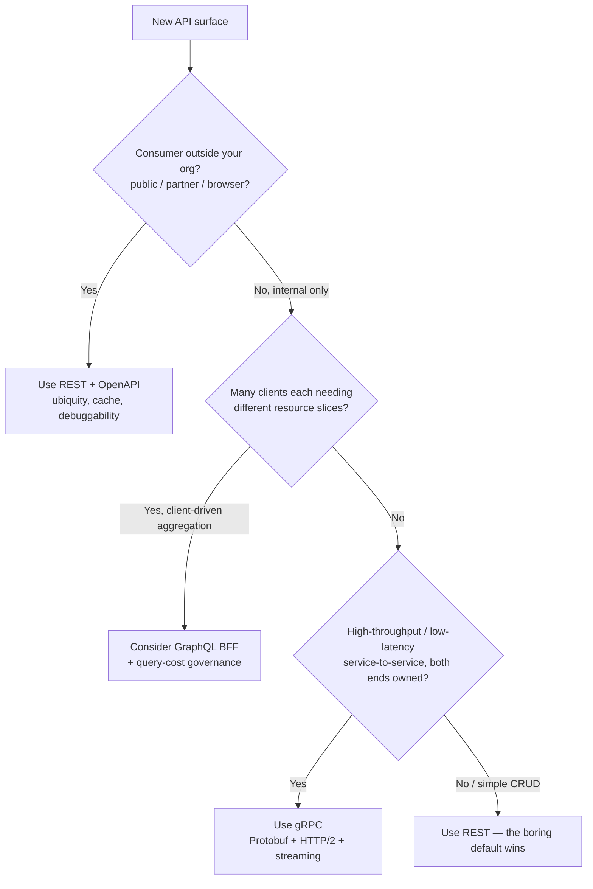

# REST — Staff

> **Axis:** organizational scope & judgment — NOT deeper protocol mechanics (that is `professional.md`).
> This file answers: how does a Staff/Principal engineer make REST the *right* default across
> a hundred teams and thousands of endpoints, over years, under real cost, migration, and
> political constraints — and know precisely when to reach past it for gRPC or GraphQL?

At Staff level, REST stops being "how you shape an HTTP endpoint" and becomes an
**organizational governance problem**. The question is no longer "is this endpoint RESTful?"
but "how do I keep 100 teams shipping HTTP APIs that a partner, an SDK generator, a gateway,
and an on-call engineer three years from now can all reason about — without becoming the
bottleneck who reviews every PR?" That is a problem of *defaults, guardrails, and delegated
judgment*, not of protocol trivia.

---

## Table of Contents
1. [Why REST Is the Correct Organizational Default](#1-why-rest-is-the-correct-organizational-default)
2. [The Cost of Inconsistency at 100 Teams](#2-the-cost-of-inconsistency-at-100-teams)
3. [The API Style Guide as a Governing Artifact](#3-the-api-style-guide-as-a-governing-artifact)
4. [Contract-First vs Code-First](#4-contract-first-vs-code-first)
5. [Automated Governance: Linting the Contract](#5-automated-governance-linting-the-contract)
6. [The Design Review That Scales](#6-the-design-review-that-scales)
7. [Versioning & Deprecation Governance](#7-versioning--deprecation-governance)
8. [When NOT to Use REST: gRPC and GraphQL](#8-when-not-to-use-rest-grpc-and-graphql)
9. [Second-Order Consequences](#9-second-order-consequences)
10. [Staff Checklist](#10-staff-checklist)

---

## 1. Why REST Is the Correct Organizational Default

A Staff engineer chooses defaults, not one-off implementations. The default is the choice that
gets made a thousand times *without you in the room*, so its properties compound. REST wins as
the default for public, partner, and the majority of CRUD APIs not because it is the fastest or
most elegant, but because it is the **lowest-common-denominator that every actor in the ecosystem
already speaks**.

The properties that make REST the right default are all *ecosystem* properties, not protocol properties:

- **Ubiquity of tooling.** Every language has an HTTP client in its standard library. `curl`,
  Postman, browsers, `fetch`, and the network tab all work with zero setup. A partner integrating
  your API needs no generated stub, no `.proto` file, no schema registry — just an HTTP call and
  a token. This is decisive for *external* consumers you do not control.
- **Cacheability.** REST rides HTTP's caching semantics (`Cache-Control`, `ETag`, `If-None-Match`,
  conditional GETs). CDNs, reverse proxies, and browsers cache GETs *for free*. This is
  infrastructure you did not build and do not operate, doing work for you at every hop.
- **Debuggability.** JSON over HTTP is human-readable. An on-call engineer at 3 a.m. can `curl`
  the endpoint, read the response, and understand it without decoding a binary frame or standing
  up a gRPC reflection client. Debuggability is an *operational cost multiplier* across every team.
- **Statelessness and horizontal scale.** REST's stateless-request constraint means any request
  can hit any server behind a load balancer — no session affinity, trivial autoscaling.
- **Uniform interface.** A small, fixed verb set (`GET`, `POST`, `PUT`, `PATCH`, `DELETE`) plus
  resource nouns means a new engineer can predict the shape of an API they have never seen. This
  *transferability of mental model* is the single most underrated organizational property.

The Staff judgment is: **REST is the default precisely because it is boring, universal, and
requires no coordination to consume.** You reach for something else only when a specific,
measured pressure justifies paying the coordination tax. Defaulting to REST is defaulting to
the option with the widest blast radius of compatibility and the smallest onboarding cost.

> 🎞️ **See it animated:** [HTTP request lifecycle (MDN)](https://developer.mozilla.org/en-US/docs/Web/HTTP/Overview)

---

## 2. The Cost of Inconsistency at 100 Teams

The problem REST governance solves is not "bad endpoints." It is **combinatorial inconsistency**.
With 100 teams each making local decisions, you do not get 100 styles — you get a long tail of
subtly incompatible conventions that no single consumer can absorb.

Consider the ways a single decision drifts across teams with no governing guide:

| Decision | Team A | Team B | Team C | Consumer cost |
|----------|--------|--------|--------|---------------|
| Pagination | `?page=2&size=20` | `?offset=40&limit=20` | cursor `?after=xyz` | SDK cannot share pagination code |
| Errors | `{"error": "..."}` | `{"message": "...", "code": 42}` | RFC 9457 `problem+json` | Every client writes bespoke error parsing |
| Timestamps | Unix epoch ms | ISO-8601 UTC | ISO-8601 local | Silent bugs across timezones |
| Naming | `snake_case` | `camelCase` | `PascalCase` | Field mapping per API |
| Not-found | `404` | `200` + `{"found": false}` | `400` | Retry/alerting logic diverges |
| Auth | `Authorization: Bearer` | `X-Api-Key` header | token in query string | Gateway policy can't be uniform |

Each row is individually defensible. Collectively they are a tax paid by **every consumer, every
SDK, every gateway policy, and every integrating team, forever.** The cost is not linear in the
number of APIs; it is closer to the product of (number of APIs) × (number of consumers), because
each consumer must special-case each API's idiosyncrasies.

The Staff insight is that **consistency is worth more than local optimality.** A slightly
suboptimal pagination scheme used by all 100 teams is worth far more than each team choosing its
locally-best scheme, because consistency is what makes tooling, SDKs, gateways, docs, and
onboarding *composable*. The job is to make the consistent path the path of least resistance.

---

## 3. The API Style Guide as a Governing Artifact

The primary leverage instrument of a Staff engineer over an API surface is the **org API style
guide** — a single, versioned, opinionated document that converts a thousand future micro-decisions
into one-time decisions. It is the equivalent of a lint config for *design*, not code.

A style guide that actually holds up at scale is prescriptive about the recurring decisions, not
aspirational about REST philosophy. It must pin down:

- **Resource naming.** Plural nouns (`/orders`, `/orders/{id}`), no verbs in paths, kebab-case
  path segments, `snake_case` or `camelCase` fields (pick ONE — the choice matters less than the
  consistency).
- **Verb semantics.** `GET` safe & idempotent, `PUT` full-replace idempotent, `PATCH` partial,
  `POST` create/non-idempotent (with an idempotency-key convention — see §9.8 idempotency), `DELETE`
  idempotent. No side-effecting GETs, ever.
- **Standard error envelope.** Mandate **RFC 9457 `application/problem+json`** so every error is
  machine-parseable the same way across all APIs.
- **Pagination.** One scheme (cursor-based is the resilient default at scale; offset paging breaks
  under concurrent inserts and is expensive deep in the result set).
- **Filtering, sorting, field selection.** Consistent query-parameter grammar.
- **Timestamps and money.** ISO-8601 UTC for time; integer minor units + currency code for money.
- **Idempotency, rate-limit headers, correlation/trace IDs.** Cross-cutting conventions the gateway
  can rely on uniformly.
- **Compatibility rules.** What counts as a breaking change (see §7).

The style guide only works if it is **enforced by machines, discoverable by default, and owned by a
body with legitimacy** (an API guild / architecture review, not a single gatekeeper). A style guide
that lives in a wiki nobody reads and nobody lints against is theatre. The next two sections make it
real: contract-first authoring and automated linting.

---

## 4. Contract-First vs Code-First

The single highest-leverage governance decision is **where the OpenAPI contract comes from**.
This determines whether the contract is a *source of truth* that governs the implementation, or a
*byproduct* that documents whatever the implementation happens to do.

| Dimension | Contract-First (write OpenAPI, then generate/implement) | Code-First (annotate code, generate OpenAPI) |
|-----------|--------------------------------------------------------|----------------------------------------------|
| Source of truth | The `openapi.yaml` — reviewable before code exists | The code — spec is a reflection of it |
| Design review timing | Before implementation, cheap to change | After implementation, expensive to change |
| Consumer parallelism | Frontend/partner can mock & build against contract day 1 | Consumers wait for the server |
| Linting/governance | Lint the contract in CI as a gate on merge | Spec exists only after build; harder to gate design |
| Drift risk | Server can drift from contract (needs contract tests) | Spec always matches code, but may match *bad* code |
| Onboarding friction | Team must learn OpenAPI authoring | Team writes familiar annotated handlers |
| Best fit | Public/partner APIs, cross-team contracts, SDK generation | Internal APIs, small teams, rapid iteration |

**Staff judgment:** for **public and partner APIs and any contract crossing a team boundary**,
mandate **contract-first**. The contract becomes a negotiated interface reviewed *before* a line of
handler code is written — which is exactly when changes are cheapest and when consumers can start
building against a mock. Code-first is acceptable for internal, single-team APIs where the team
owns both sides and iteration speed dominates. The failure mode to avoid is *code-first masquerading
as governance*: a generated spec that faithfully documents an inconsistent, un-reviewed API is not
governance, it is a nicely-formatted description of the problem.

Whichever you choose, the contract must be **the artifact CI gates on** and the artifact from which
SDKs, mock servers, and docs are generated. If SDKs are hand-written, they drift; if generated from
a linted contract, drift is impossible by construction.

### Contract-First Governance Pipeline

```mermaid
sequenceDiagram
    autonumber
    participant Dev as API Team
    participant Repo as openapi.yaml (PR)
    participant Lint as Spectral Ruleset (CI)
    participant Rev as API Guild Review
    participant Gen as SDK / Mock / Docs Gen
    participant Ver as Contract Tests (CI)
    Dev->>Repo: 1. Author/modify OpenAPI contract
    Repo->>Lint: 2. Lint against org style-guide rules
    Lint-->>Dev: 3. FAIL fast on naming/error/pagination violations
    Note over Lint: machine-enforced style guide — no human bottleneck
    Repo->>Rev: 4. Human review only for genuine design judgment
    Rev-->>Dev: 5. Approve interface before implementation
    Gen->>Gen: 6. Generate client SDKs + mock server + docs from contract
    Dev->>Ver: 7. Implement; contract tests assert server matches spec
    Ver-->>Dev: 8. Block merge on server↔contract drift
    Note over Dev,Ver: consumers built against the mock in parallel since step 6
```

The critical design of this pipeline: **machines enforce the 90% (style, naming, error shape,
required fields) so humans review only the 10% that requires actual judgment** (is this the right
resource model? is this the right boundary?). That division is what makes governance scale to 100
teams without a review board becoming a throughput bottleneck.

---

## 5. Automated Governance: Linting the Contract

A style guide that humans must remember and enforce degrades to entropy the moment the author who
wrote it changes teams. The only durable enforcement is **executable rules that run in CI** — a
linter for the *design*, applied to the OpenAPI document itself.

**Spectral** (or an equivalent OpenAPI linter) lets you encode the style guide as rules that fail
the build. Illustrative rules a Staff engineer would encode:

- Every operation MUST have an `operationId` (SDK generators need it; ambiguous ones produce ugly stubs).
- Every non-2xx response MUST reference the shared `application/problem+json` error schema.
- Path segments MUST be kebab-case; resource collections MUST be plural nouns; no verbs in paths.
- Every `GET` list endpoint MUST declare the standard pagination parameters.
- Every operation MUST declare a security scheme (no accidentally-public endpoints).
- Field names MUST match the org casing convention; `date-time` fields MUST use `format: date-time`.
- Breaking-change detection: diff the new contract against the published one and fail if a required
  field is added, a field is removed, an enum value is dropped, or a type narrows (see §7).

The organizational move is to ship this ruleset as a **shared package** every repo imports, wired
into a **required CI check** (see §35 quality-gates for gate design). Now the style guide is not a
document teams *should* follow — it is a build that *fails* when they do not. This is the
difference between a policy and a guardrail: a policy asks for compliance; a guardrail makes
non-compliance not build.

Two caveats a Staff engineer holds:

1. **Lint the design, not the taste.** Rules that encode genuine interoperability requirements
   (error shape, pagination, security) earn their keep. Rules that encode one architect's aesthetic
   preferences generate resentment and `// nolint` escape hatches. Keep the ruleset lean and justified.
2. **Provide an escape valve with a paper trail.** A rule waiver should be possible but *visible*
   (an explicit exception annotation reviewed by the guild), so that legitimate exceptions do not
   force teams to either fork the ruleset or route around governance entirely.

---

## 6. The Design Review That Scales

Even with linting, some decisions require human judgment: is this the right resource decomposition?
Should this be one endpoint or three? Is this coupling two bounded contexts that should stay
separate? A Staff engineer designs a **review process that catches these without becoming a queue**.

The scaling pattern is a **tiered review**:

- **Tier 0 — automated (linter):** style, naming, error shape, pagination, security. No human.
- **Tier 1 — peer review within the team:** the owning team reviews its own contract PR against the
  checklist. Most APIs stop here.
- **Tier 2 — API guild review:** required only for *new public/partner surfaces*, *breaking changes*,
  or *contracts crossing a team boundary*. A rotating group of senior engineers, not a permanent
  gatekeeper, reviews the *interface* (resource model, versioning, backward compatibility) — never
  the implementation.

The Staff engineer's role here is **legitimacy and consistency of judgment**, not being the reviewer.
You seed the guild, write the review rubric, adjudicate the hard cases, and evolve the style guide
based on patterns you see recurring in reviews. When the same argument shows up in three reviews,
it becomes a lint rule and disappears from human review forever. **Every recurring human decision is a
future automated rule** — that ratchet is what keeps the review queue bounded as the org grows.

---

## 7. Versioning & Deprecation Governance

At one team, versioning is a naming choice. At 100 teams with external consumers, versioning and
deprecation are a **governance regime** — because a breaking change is not an event in your codebase,
it is a coordinated migration across every consumer you may not even be able to identify.

The governing definitions the org must standardize:

- **What is a breaking change?** Removing a field, removing an endpoint, adding a required request
  field, narrowing a type, changing an error code's meaning, tightening validation. These require a
  new version. Additive changes (new optional field, new endpoint, new optional parameter) are
  backward-compatible and do NOT.
- **Versioning scheme.** Pick one org-wide: URL path (`/v2/orders`) is the most operable and
  cache/gateway-friendly and is the pragmatic default; header/media-type versioning is purer but
  harder to route, cache, and debug. Consistency across teams matters more than the choice.
- **Deprecation policy with teeth.** A published, enforced timeline: announce → `Deprecation` and
  `Sunset` response headers → measured migration window (e.g., 6–12 months for external APIs) →
  removal. Deprecation without a *measured* sunset and *tracked* remaining callers is a version that
  lives forever and quietly triples your maintenance surface.
- **Caller telemetry.** You cannot deprecate what you cannot see. Instrument every endpoint with
  per-consumer usage metrics so "who still calls v1?" is a dashboard query, not an archaeology project.

```mermaid
stateDiagram-v2
    [*] --> Active
    Active --> Deprecated: v2 published; Deprecation + Sunset headers set
    Deprecated --> Draining: notify identified callers; track per-consumer usage
    Draining --> Removed: sunset date reached AND traffic ≈ 0
    Draining --> Active: rollback if a critical caller cannot migrate in time
    Removed --> [*]
    note right of Draining
        Never remove blind.
        Gate removal on measured
        caller traffic, not the calendar.
    end note
```

**Staff judgment:** treat every breaking change as a *migration project with a cost*, and design
APIs to minimize how often you must incur it — additive-only evolution, tolerant readers, and
optional fields buy you years without a `/v2`. The most expensive versioning strategy is the one
that makes `/v2` cheap to *create*, because it makes `/v2`, `/v3`, `/v4` proliferate, each an eternal
maintenance liability. The cheapest strategy makes breaking changes *rare*.

---

## 8. When NOT to Use REST: gRPC and GraphQL

REST is the default, not the answer to everything. A Staff engineer earns trust by knowing exactly
which measured pressure justifies paying the coordination tax of an alternative — and by refusing to
adopt one on hype.

| Dimension | **REST** (default) | **gRPC** | **GraphQL** |
|-----------|--------------------|----------|-------------|
| Sweet spot | Public/partner APIs, CRUD, broad ecosystem | Internal service-to-service, high throughput | Client-driven aggregation over many resources |
| Payload | JSON (text, readable) | Protobuf (binary, compact) | JSON, client-specified shape |
| Transport | HTTP/1.1 & HTTP/2 | HTTP/2 (multiplexed, streaming) | Usually HTTP/1.1 POST |
| Contract | OpenAPI | `.proto` (strongly typed, codegen) | SD schema (typed) |
| Streaming | Limited (SSE/chunked) | First-class bidi streaming | Subscriptions |
| Cacheability | Native HTTP caching | Weak (opaque bodies) | Weak (POST, per-query) |
| Browser/partner reach | Universal, zero setup | Needs gRPC-Web + proxy | Good, but needs client lib for full value |
| Debuggability | `curl` + read JSON | Needs reflection/tooling | GraphiQL; but N-resolver behavior opaque |
| Over/under-fetch | Fixed per endpoint | Fixed per method | Client picks exactly its fields |
| Org tax | Lowest | Schema registry, codegen, HTTP/2 infra | Gateway, resolver discipline, N+1/query-cost governance |

**Reach for gRPC when** the traffic is **internal, high-volume, latency-sensitive service-to-service**
and you control both ends. The wins — binary Protobuf, HTTP/2 multiplexing, first-class streaming,
generated strongly-typed stubs — are real and measurable (lower CPU, lower bytes-on-wire, lower tail
latency). The costs — no free HTTP caching, harder debugging, browser needs a proxy, a schema
registry and codegen pipeline to operate — are acceptable *inside* your mesh and unacceptable at a
*public* boundary.

**Reach for GraphQL when** you have **many heterogeneous clients (web, iOS, Android, partners) each
needing different slices of an overlapping graph of resources**, and REST forces either chatty
round-trips (under-fetching) or bloated responses (over-fetching) or a proliferation of
bespoke `/for-mobile-home-screen` endpoints. GraphQL moves shape-selection to the client. But it
imports serious governance cost: N+1 resolver explosions, query-cost/complexity limiting to prevent
abuse, weak HTTP caching, and the operational opacity of a single POST that fans out to dozens of
backends. Adopt it for the *aggregation/BFF* layer, not as a blanket replacement for CRUD.

The anti-patterns a Staff engineer actively blocks:
- **gRPC on a public partner boundary** — you have just told every integrator to install a toolchain.
- **GraphQL for simple CRUD** — you have added a resolver layer and query-cost governance to save
  nobody any round-trips.
- **Three protocols because three teams had preferences** — protocol proliferation multiplies
  gateway, auth, observability, and on-call surface. Each additional protocol is an org-wide tax;
  justify it with load, not taste.

### Selection Decision Flow



---

## 9. Second-Order Consequences

- **Governance becomes a bottleneck if it's human-gated.** If every API PR waits on an architect,
  velocity dies and teams route around you (shadow APIs, "internal-only" endpoints that leak to
  partners). *Watch metric:* median time-in-review for API PRs. Rising → push more rules into the
  linter.
- **A too-strict ruleset breeds circumvention.** Rules that encode taste rather than
  interoperability get waived, forked, or ignored, and the guild loses legitimacy. *Watch metric:*
  count of lint-waivers and `nolint` annotations per quarter.
- **Contract-first without contract tests produces confident lies.** A pristine OpenAPI doc the
  server has drifted from is worse than no doc — consumers trust it and break. *Watch metric:*
  contract-test coverage; server↔spec drift incidents.
- **Deprecation without caller telemetry means versions never die.** Every un-sunsetted version is
  permanent maintenance and security surface. *Watch metric:* number of live API versions per
  service; per-version caller counts trending to zero on schedule.
- **Protocol proliferation multiplies operational surface.** Each of REST/gRPC/GraphQL needs its own
  gateway config, auth integration, tracing, and on-call runbook. *Watch metric:* number of distinct
  API protocols in production; each new one must clear a load-justified bar, not a preference.
- **The style guide is a living artifact or it's dead.** If it doesn't evolve from what reviews keep
  surfacing, it ossifies and teams stop consulting it. *Watch metric:* style-guide changes per
  quarter driven by recurring review findings.

---

## 10. Staff Checklist

- [ ] REST is the documented, tooling-supported **default** for public/partner and CRUD; alternatives
      require a load-justified exception, not a preference.
- [ ] An org **API style guide** exists, is versioned, and pins the recurring decisions (naming,
      errors via RFC 9457, pagination, timestamps, versioning, idempotency).
- [ ] The style guide is **machine-enforced** by a shared OpenAPI linter (Spectral) wired as a
      required CI check — a guardrail, not a wiki page.
- [ ] **Contract-first** mandated for every contract crossing a team boundary; SDKs, mocks, and docs
      are *generated* from the linted contract, and **contract tests** gate server↔spec drift.
- [ ] Design review is **tiered**: linter → team peer → guild (only for public/breaking/cross-team),
      reviewing interface not implementation; recurring human calls become lint rules.
- [ ] **Breaking change** is defined org-wide; a deprecation policy with `Deprecation`/`Sunset`
      headers, a measured window, and **per-consumer caller telemetry** gates removal on traffic.
- [ ] **When NOT to use REST** is written down: gRPC for internal high-throughput both-ends-owned;
      GraphQL for client-driven aggregation with query-cost governance — each with its explicit
      cost, so teams don't cargo-cult the choice.

*Next step:* [REST — Interview](interview.md)
