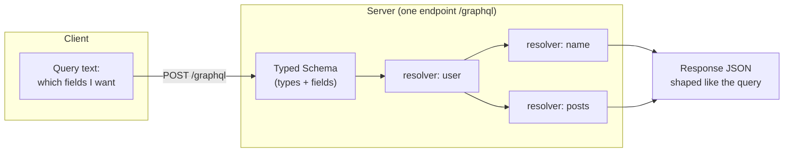
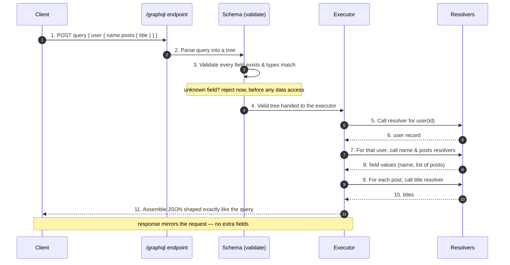

# GraphQL — Junior

<!-- level-focus -->
At junior level, focus on this question:

> How can I apply **GraphQL** in one small example and prove the result?

Use the smallest realistic scenario that exposes the decision and its failure behavior.
## 1. What Is It?

You have used GraphQL without knowing it. When you open the GitHub mobile app, load a Shopify storefront, or scroll a feed, there is a good chance one HTTP request went out carrying a text query that spelled out precisely which fields the screen needed — a user's name, their avatar URL, and the titles of their last five posts — and the response came back matching that request field-for-field.

Contrast that with the world you already know. A traditional REST API is a **collection of URLs**, each returning a **shape the server decided in advance**:

- `GET /users/42` → the whole user object
- `GET /users/42/posts` → all of that user's posts
- `GET /posts/99/comments` → all comments on a post

The shape of each response is baked into the endpoint. If you need only a name and an avatar, you still receive the entire user record. If you need a user *and* their posts, that's two requests.

GraphQL flips the control. There is **one URL** — conventionally `POST /graphql` — and the **client** describes the shape it wants in the request body. The server holds a **schema**: a typed catalogue of every field that can be asked for and how the fields relate. The client's job is to write a query against that schema; the server's job is to **resolve** each requested field and assemble the result into the exact tree the client asked for.

> Working definition: **GraphQL is a specification for a query language plus a runtime that answers those queries against a typed schema.** The client asks for a shape; the server returns that shape.

---

## 2. The Problem It Solves: Over- and Under-Fetching

Two specific pains motivate GraphQL. Both come from the same root cause: in a fixed-response API, the **server** decides the payload, but the **client** decides what it actually needs, and those two rarely match perfectly.

**Over-fetching** — the response is bigger than the screen requires. A mobile profile header needs a name and an avatar. `GET /users/42` returns the name, avatar, email, bio, address, phone, settings, timestamps, and preferences — a few kilobytes to render two fields. On a phone over cellular data, those wasted bytes cost battery, bandwidth, and time.

**Under-fetching** — one response is not enough, so the client makes a chain of follow-up calls. To render a profile page showing a user and the titles of their three latest posts, a REST client might do:

```text
1. GET /users/42            → name, avatar
2. GET /users/42/posts      → list of posts (then take the first 3)
3. GET /posts/99/comments   → to show a comment count per post... (× 3)
```

This is the **N+1 request** problem on the client side: one request to get a list, then N more to enrich each item. Each round trip adds latency. On a high-latency mobile network, five sequential requests can dominate the page's load time even when every individual response is fast.

GraphQL collapses this into **one request describing the whole tree**. The client asks for the user, their three latest posts, and each post's comment count in a single query, and gets back a single JSON object shaped like the request.

---

## 3. The Mental Model: One Endpoint, a Typed Schema

Hold three ideas in your head and the rest follows.

1. **One endpoint.** Every operation — read or write — goes to the same URL, almost always `POST /graphql`. You do not route by URL path; you route by the **content of the query**.

2. **A typed schema is the contract.** The server publishes a schema written in the Schema Definition Language (SDL). It lists every type (`User`, `Post`), every field on each type (`User.name: String`, `User.posts: [Post!]`), and the entry points a client may start from (`Query.user(id: ID!): User`). If a field is not in the schema, it cannot be asked for — the request is rejected before any code runs. The schema is simultaneously documentation, validation, and the source of truth for tooling.

3. **Resolvers fill in the fields.** For each field in the schema, the server has a small function called a **resolver** whose only job is to return that field's value. When a query arrives, the server walks the query tree and calls the resolver for each requested field, then assembles the returned values into a JSON object mirroring the query's structure.



The response shape is **not** the server's choice — it is a mirror of the query. Ask for two fields, get two fields. Ask for a nested tree, get that tree.

---

## 4. A Concrete Query and Its Response

This is the heart of GraphQL. A query is a set of nested field names inside curly braces. It has no values on the left — only the names of the fields you want.

**The query** the client sends in the request body:

```graphql
query {
  user(id: "42") {
    name
    avatarUrl
    posts(last: 3) {
      title
      commentCount
    }
  }
}
```

Read it as a shopping list: *"Give me the user with id 42; from that user I want `name`, `avatarUrl`, and their last 3 `posts`; from each post I want `title` and `commentCount`."*

**The response** the server sends back:

```json
{
  "data": {
    "user": {
      "name": "Ada Lovelace",
      "avatarUrl": "https://cdn.example.com/a/42.png",
      "posts": [
        { "title": "Notes on the Analytical Engine", "commentCount": 12 },
        { "title": "On Bernoulli Numbers",           "commentCount": 4 },
        { "title": "Programming the Difference Engine","commentCount": 27 }
      ]
    }
  }
}
```

Notice the exactness:

- The response mirrors the query **field for field**. The query asked for `name`, `avatarUrl`, `posts`; the response has `name`, `avatarUrl`, `posts` — nothing else. No `email`, no `address`, no `bio`, because none were requested. That is **no over-fetching**.
- The whole page's data — user plus posts plus per-post comment counts — arrived in **one round trip**. That is **no under-fetching**.
- The top-level `data` key is part of the GraphQL response envelope. Errors, when they occur, appear under a sibling `errors` key. A response can carry both partial `data` and `errors` at once.

If a teammate needed the same user's `email` on a different screen, they would add `email` to *their* query. Your query is untouched, and your response never grows. The client controls the payload.

---

## 5. How a Query Turns Into a Response

Walk one request through the server, step by step. This is the whole lifecycle in five stages.



The two stages worth pausing on:

- **Validation (steps 2–3)** happens *before* any database is touched. Because the schema is typed, the server can prove a query is well-formed — every field exists, every argument has the right type — and reject a bad query immediately with a clear error. You cannot ask for a field that isn't in the schema.
- **Execution (steps 5–10)** walks the validated tree top-down, calling one resolver per field. The `user` resolver runs first; its result becomes the "parent" passed to the `name` and `posts` resolvers; each post becomes the parent for the `title` resolver. The executor stitches every resolver's return value into the response tree.

You do not need to write resolvers yet — that is Middle-level material. At this stage, the point is the **shape of the pipeline**: parse → validate against the schema → execute resolvers → assemble a response that mirrors the query.

---

## 6. REST vs GraphQL Side by Side

Both styles are legitimate and widely used; GraphQL is not "better REST," it makes a different trade. This table frames the differences a junior engineer will actually notice first.

| Dimension | REST (fixed endpoints) | GraphQL (typed schema) |
|---|---|---|
| Endpoints | Many URLs, one per resource/shape | One endpoint (`POST /graphql`) |
| Who decides the response shape | Server (baked into the endpoint) | Client (named in the query) |
| Over-fetching | Common — you get the whole object | Eliminated — you get only named fields |
| Under-fetching | Common — chain of follow-up calls | Eliminated — one nested query |
| Round trips for a rich screen | Often several (N+1 on the client) | Usually one |
| Fetching related data | Multiple endpoints or `?include=` hacks | Follow relationships in one query |
| Contract / schema | Optional (OpenAPI, if maintained) | Built-in and enforced by the type system |
| Discoverability | External docs | Self-describing via introspection |
| HTTP verb per operation | GET / POST / PUT / DELETE | Almost always POST (query in body) |
| Caching (HTTP-level) | Simple — cache by URL + method | Harder — most requests are POST to one URL |

The last row matters and is easy to miss: because REST reads are `GET /users/42`, a browser or CDN can cache the response by URL for free. GraphQL's uniform `POST /graphql` defeats that simple caching, so GraphQL systems lean on other caching layers instead. That trade — richer, client-shaped queries in exchange for losing effortless HTTP caching — is the core tension you will study at higher tiers.

---

## 7. The Schema: Fields, Types, and the Contract

Everything a client can ask for lives in the schema, written in SDL. Here is a small schema that supports the query from Section 4:

```graphql
type Query {
  user(id: ID!): User
}

type User {
  id: ID!
  name: String!
  avatarUrl: String
  email: String
  posts(last: Int): [Post!]!
}

type Post {
  id: ID!
  title: String!
  commentCount: Int!
}
```

Read it carefully:

- **`type Query`** is the special entry point. Every query must start from a field defined here — in this schema, the only entry point is `user(id: ID!)`. Think of `Query` as the front door.
- **`User` and `Post`** are object types. Their fields are the only fields a client may request on those objects.
- **The `!` means non-null.** `name: String!` guarantees the server will always return a name (never null). `avatarUrl: String` (no `!`) may be null. `ID!` on an argument means the caller *must* supply it.
- **`[Post!]!`** is a list of posts: the list itself is never null, and no element inside it is ever null.
- **Arguments** like `user(id: ID!)` and `posts(last: Int)` let the client parameterize a field — which user, how many posts.

Because this contract is machine-readable and typed, a client can only ever request fields that exist, and the server can validate any incoming query against it automatically. The schema is the single source of truth for both sides.

---

## 8. Queries, Mutations, and Subscriptions

GraphQL has exactly three operation types. As a junior you will spend almost all your time on the first.

| Operation | Purpose | REST analogy |
|---|---|---|
| `query` | Read data (no side effects) | `GET` |
| `mutation` | Change data (create / update / delete) | `POST` / `PUT` / `DELETE` |
| `subscription` | Receive a stream of updates over time | server push / WebSocket feed |

A **query** reads; it should never change server state. A **mutation** performs a write and can return the updated object in the same response, so the client sees the new state immediately:

```graphql
mutation {
  addComment(postId: "99", body: "Great post!") {
    id
    commentCount
  }
}
```

This creates a comment *and* returns the post's updated `commentCount` in one round trip — write and read-back combined. A **subscription** keeps a connection open and pushes new data as events happen (for example, new chat messages); you will meet it later. For now, remember the split: `query` reads, `mutation` writes, `subscription` streams, and all three travel through the same `/graphql` endpoint against the same schema.

---

## 9. Key Terms

| Term | Definition |
|---|---|
| Schema | The typed catalogue of every type and field a client can request; the contract between client and server |
| SDL | Schema Definition Language — the text syntax used to write a GraphQL schema |
| Type | A named object with a fixed set of fields (e.g., `User`, `Post`) |
| Field | A single named piece of data on a type (e.g., `User.name`); the atoms a query selects |
| Query | An operation that reads data without side effects |
| Mutation | An operation that changes data and may return the result |
| Subscription | An operation that streams updates to the client over time |
| Resolver | A server-side function that produces the value for one field |
| Over-fetching | Receiving more fields than the client needs |
| Under-fetching | Needing extra requests because one response is incomplete |
| Introspection | The ability to query the schema itself to discover its types and fields |
| `data` / `errors` | The two top-level keys of every GraphQL response envelope |

---

## 10. Common Misconceptions at This Level

1. **"GraphQL is a database."** It is not. GraphQL is an API layer. Resolvers fetch from whatever lies behind them — a SQL database, a REST service, a cache, or several at once. GraphQL organizes *how clients ask*, not *where data lives*.

2. **"GraphQL replaces REST everywhere."** It is a different trade, not a strict upgrade. REST's URL-based responses cache trivially over HTTP; GraphQL's single-endpoint POSTs do not. Many systems run both.

3. **"There are many endpoints, one per type."** No — there is **one** endpoint. Routing happens by the query's *content*, not the URL path.

4. **"Asking for more fields is free."** It is not. Each extra field runs a resolver, and a resolver may hit a database. A query can look small but trigger heavy work underneath. Controlling that cost is a real topic at higher tiers.

5. **"A GraphQL error means the whole request failed."** Not necessarily. A response can contain partial `data` *and* an `errors` array — some fields resolved, others did not.

---

## 11. Hands-On Exercise

Take a profile screen you know — say, a user card showing a **display name**, an **avatar**, a **follower count**, and the **titles of their 3 most recent posts**.

1. **Sketch the REST version.** List every endpoint you would call and, for each, circle the fields you receive but do *not* display. Count the total round trips. This is your over-fetching and under-fetching, made concrete.
2. **Write the single GraphQL query** that fetches exactly those four things and nothing else. Nest the posts inside the user. Confirm every field name would need to exist in a schema.
3. **Write the response JSON** you expect — by hand. It must mirror your query field-for-field, wrapped in a top-level `data` key.
4. **Compare.** How many round trips did REST take versus GraphQL? How many wasted fields did REST pull that GraphQL skipped?

Do this on paper. The goal is to *feel* the shift: in REST the server dictates the payload; in GraphQL you, the client, write the shape you want and get precisely that back.

> Canonical reference: the official specification and introduction live at [graphql.org](https://graphql.org).

*Next step:* [GraphQL — Middle](middle.md)

---

## Apply it

1. Choose one small, known input for **GraphQL**.
2. Predict the output or observable behavior.
3. Run the smallest example or probe that exercises the concept.
4. Change one input to trigger a failure or boundary case.
5. Explain the evidence using the guide's vocabulary.

## Verify your work

- Record the exact input, command or code path, and output.
- Repeat the probe and confirm the result is consistent.
- Show one expected success and one expected failure.
- Resolve any difference between the prediction and the evidence.

## Review questions

- What problem does GraphQL solve in the example?
- Which input changes the observed result, and why?
- What is the smallest useful success check?
- Which beginner mistake would your evidence catch?
