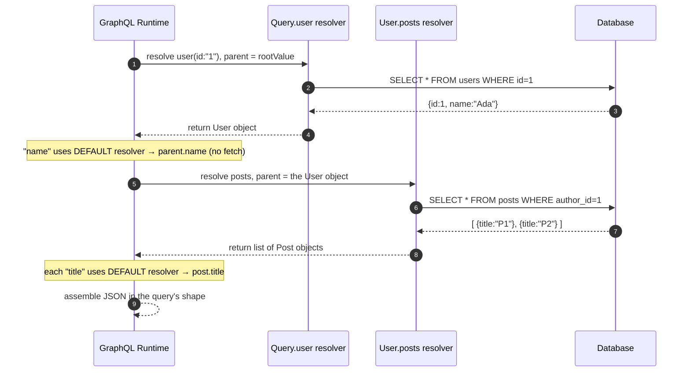
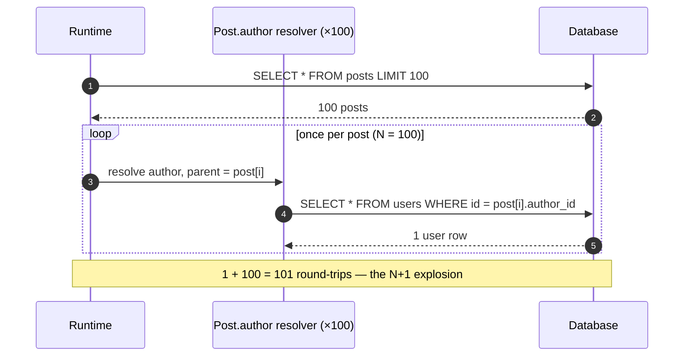
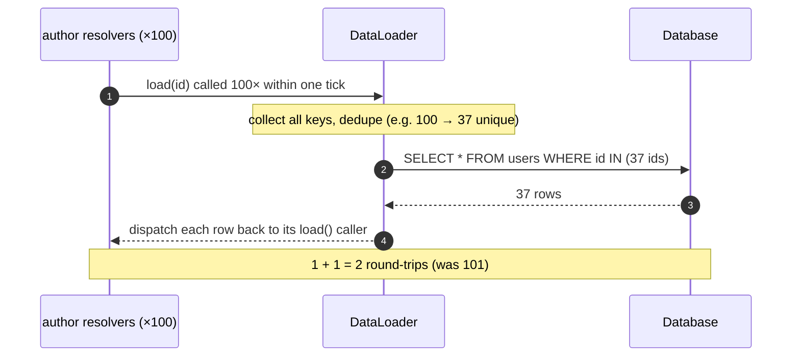

# GraphQL — Middle

<!-- level-focus -->
At middle level, focus on this question:

> Where does **GraphQL** belong in a maintainable component, and which trade-off selects the design?

Use the smallest realistic scenario that exposes the decision and its failure behavior.
## 2. The Schema and Type System (SDL)

GraphQL is **schema-first**. The contract between client and server is a strongly
typed schema written in the **Schema Definition Language (SDL)**. Nothing can be
queried that the schema does not declare, and every field has a known type — this is
what enables validation *before* execution and rich tooling (autocomplete,
introspection).

### The building blocks

| Kind | Purpose | Example |
|------|---------|---------|
| **Scalar** | Leaf values | `Int`, `Float`, `String`, `Boolean`, `ID` (+ custom scalars like `DateTime`) |
| **Object type** | A node with named fields | `type User { id: ID! name: String! }` |
| **Enum** | A fixed set of values | `enum Role { ADMIN MEMBER GUEST }` |
| **Input type** | Structured argument object | `input CreatePostInput { title: String! }` |
| **Interface** | Shared field contract | `interface Node { id: ID! }` |
| **Union** | "one of these object types" | `union SearchResult = User \| Post` |
| **Root types** | Entry points | `Query`, `Mutation`, `Subscription` |

### Type modifiers

Two modifiers wrap any type and are the source of most schema-design decisions:

- **`!` (non-null)** — `String!` means the field can never be `null`. On an argument
  it means the argument is required. **Non-null is a contract with teeth**: if a
  resolver for a non-null field returns `null` or throws, the error propagates *up*
  to the nearest nullable parent (see §8).
- **`[T]` (list)** — `[Post!]!` is a non-null list of non-null `Post`s. Read the
  modifiers outside-in: the list itself is required, and no element may be null.

### A worked schema

```graphql
scalar DateTime

type User {
  id: ID!
  name: String!
  email: String!
  posts: [Post!]!          # a user has many posts
}

type Post {
  id: ID!
  title: String!
  body: String!
  createdAt: DateTime!
  author: User!            # each post has exactly one author
  comments: [Comment!]!
}

type Comment {
  id: ID!
  text: String!
  author: User!
}

type Query {
  user(id: ID!): User
  posts(first: Int = 10, after: ID): [Post!]!
}

type Mutation {
  createPost(input: CreatePostInput!): Post!
}

type Subscription {
  postAdded: Post!
}

input CreatePostInput {
  title: String!
  body: String!
  authorId: ID!
}
```

Notice the **graph** in GraphQL: `User.posts` points at `Post`, and `Post.author`
points back at `User`. The schema is a directed graph of types, and a query is a
path (a subtree) walked through that graph starting from a root type.

---

## 3. The Three Root Operations: Query, Mutation, Subscription

Every GraphQL operation starts at one of three root types. They differ in intent,
side-effects, and execution semantics.

| | **Query** | **Mutation** | **Subscription** |
|---|---|---|---|
| **Intent** | Read data | Write / change data | Stream events over time |
| **Side effects** | None (should be safe/idempotent) | Yes — creates/updates/deletes | None per event; the write happens elsewhere |
| **Top-level execution** | Fields resolved **in parallel** | Fields resolved **serially, in order** | One long-lived stream; resolver fires per event |
| **Transport** | Single HTTP request/response | Single HTTP request/response | Long-lived connection (WebSocket) |
| **Returns** | One JSON response | One JSON response | Many JSON messages over time |
| **Cardinality** | 1 request → 1 response | 1 request → 1 response | 1 request → N responses |

The **serial vs parallel** distinction is a genuine spec guarantee, not an
implementation detail. If a single mutation operation lists three top-level fields,
the runtime resolves them **one after another** so that ordering-dependent writes
(e.g., `deleteAll` then `insert`) behave predictably. Top-level query fields carry no
such ordering promise, so runtimes are free to resolve them concurrently.

A request document can contain multiple named operations; the client then names which
one to run (`operationName`). Anonymous shorthand (`{ user(id: "1") { name } }`) is
only legal when the document holds exactly one query.

---

## 4. Resolvers: How a Query Tree Is Resolved

A **resolver** is a function attached to a single field. Its job: given a *parent*
value, produce the value for *this* field. The runtime walks the query tree
top-down, calling the resolver for each requested field, passing the result down as
the parent of the child resolvers.

Every resolver receives the same four arguments:

```js
function resolver(parent, args, context, info) { /* return a value or a Promise */ }
```

| Argument | What it is |
|----------|-----------|
| `parent` (a.k.a. `root`/`source`) | The value returned by the **parent field's** resolver |
| `args` | The field's arguments (`{ id: "42" }`), already coerced to schema types |
| `context` | Per-request shared object — DB clients, the authenticated user, DataLoaders |
| `info` | The AST/execution info: field name, path, selected subfields, schema |

### Default resolvers

You do **not** write a resolver for every field. If a field has no explicit resolver,
the runtime uses the **default resolver**: it reads `parent[fieldName]`. So once a
`user` resolver returns `{ id, name, email }`, the `name` field resolves for free by
property lookup. You only hand-write resolvers where a value must be *computed* or
*fetched* — typically the root fields and the relationship edges (`posts`, `author`).

### Execution order for one query

Consider:

```graphql
{ user(id: "1") { name posts { title } } }
```



The runtime does **not** know your data model. It only knows the *field graph*, and
it fires one resolver per field, resolving Promises as it goes. This per-field model
is powerful and dangerous in equal measure — which is exactly what §6 is about.

---

## 5. Arguments and Variables

**Arguments** parameterize a field. They are declared in the schema with a type and
optional default:

```graphql
type Query {
  posts(first: Int = 10, after: ID): [Post!]!
}
```

**Variables** are the safe way to pass dynamic values into a query. Instead of string-
interpolating user input into the query text (which breaks caching and invites
injection-like mistakes), you declare typed variables in the operation and supply
them as a separate JSON map:

```graphql
query GetPosts($first: Int!, $after: ID) {
  posts(first: $first, after: $after) {
    id
    title
  }
}
```

```json
// variables sent alongside the query
{ "first": 5, "after": "cursor_abc" }
```

Why variables matter beyond hygiene:

- **The query string stays constant** across requests, so it can be normalized,
  cached, allow-listed (persisted queries), and logged as a single template.
- **Type coercion is enforced at validation time**: `$first: Int!` guarantees the
  server rejects a non-integer before any resolver runs. A required variable
  (`Int!`) with no value supplied is a validation error, not a runtime crash.
- **Defaults and nullability** are explicit: `$after: ID` (nullable) plus `after: ID`
  (nullable arg) means "paginate from the start if omitted."

Inside a resolver, arguments arrive already coerced in the `args` parameter:

```js
posts: (parent, { first, after }, ctx) =>
  ctx.db.posts.page({ limit: first, cursor: after }),
```

Arguments can appear on **any** field, not just root fields — `user(id:"1") { posts(first: 3) { ... } }`
scopes the argument to the `posts` edge of that specific user.

---

## 6. The N+1 Resolver Problem

The per-field execution model has a sharp edge. Consider what looks like a modest
query:

```graphql
{
  posts(first: 100) {
    title
    author { name }
  }
}
```

Here is what a naive implementation does:

1. `Query.posts` runs **1** query: `SELECT * FROM posts LIMIT 100` → 100 posts.
2. For **each** of those 100 posts, the runtime calls the `Post.author` resolver.
3. Each `author` resolver runs **its own** query:
   `SELECT * FROM users WHERE id = ?`.

That is **1 + 100 = 101 database round-trips** to render one screen. This is the
**N+1 problem**: one query for the list, then N queries for the related field. The
resolver graph is walked breadth-first, and nothing in the model coordinates those N
sibling calls — each `author` resolver runs in isolation, unaware that 99 of its
siblings are asking for the same kind of thing (often the same rows).



At list-of-100 it is annoying; at list-of-1000 with three nested relationships each
doing the same thing, it is an outage. The problem scales with the *product* of list
sizes down the tree. The fix is not to abandon resolvers — it is to **batch** the N
sibling calls into one.

| Approach | DB round-trips (100 posts) | Ordering | Notes |
|----------|---------------------------|----------|-------|
| **Naive per-field resolver** | 1 + 100 = **101** | serial per resolver | correct but pathological |
| **DataLoader batching** | 1 + 1 = **2** | one batched `WHERE id IN (…)` | same resolvers, coalesced |
| **Join in the root resolver** | **1** | single SQL join | fast but couples resolver to query shape; loses reuse |

---

## 7. DataLoader: Per-Request Batching and Caching

**DataLoader** (the pattern, originating from Facebook's reference implementation) is
the standard fix. It sits *between* your resolvers and your data source and does two
things:

1. **Batching** — instead of hitting the DB immediately, each `.load(key)` call
   registers the key. DataLoader collects all keys requested within a single **tick
   of the event loop** (one frame of execution), then invokes a **batch function**
   *once* with the full list of keys: `SELECT * FROM users WHERE id IN (…)`.
2. **Caching** — within one request it **memoizes** by key, so if two posts share an
   author, that author is loaded once and returned to both callers.

A batch function must obey one contract: **return an array the same length and order
as the input keys**, mapping missing keys to `null`. The loader unbundles the batched
result back to each individual `.load()` caller.

```js
// created fresh PER REQUEST and put on ctx — never shared across requests
const userLoader = new DataLoader(async (ids) => {
  const rows = await db.query(
    'SELECT * FROM users WHERE id = ANY($1)', [ids]
  );
  const byId = new Map(rows.map((r) => [String(r.id), r]));
  // MUST return one entry per id, in the SAME order:
  return ids.map((id) => byId.get(String(id)) ?? null);
});

// the author resolver now just registers a key:
const resolvers = {
  Post: {
    author: (post, _args, ctx) => ctx.userLoader.load(post.authorId),
  },
};
```



Two rules that trip people up:

- **One loader instance per request.** The cache must not leak data across users or
  serve stale rows to a later request. Instantiate loaders in `context`, which is
  built per request.
- **Batching is scoped to a tick, not the whole query.** DataLoader relies on the
  event-loop deferring: all `.load()` calls that happen before the current frame
  yields get batched together. This is why it composes naturally with the runtime's
  breadth-first resolution — all sibling `author` resolvers fire in the same frame.

DataLoader turns N+1 back into 1+1 *without* changing the resolver graph or coupling
resolvers to specific query shapes — the reusability that made resolvers attractive
in the first place is preserved.

---

## 8. Error Handling: Partial Data and the `errors` Array

GraphQL does **not** use HTTP status codes to signal application errors. A successful
transport (HTTP `200`) can carry a response that is *partly* data and *partly*
errors. The response envelope has two top-level keys:

```json
{
  "data": { "user": { "name": "Ada", "email": null } },
  "errors": [
    {
      "message": "Failed to load email",
      "path": ["user", "email"],
      "locations": [{ "line": 3, "column": 5 }],
      "extensions": { "code": "DOWNSTREAM_TIMEOUT" }
    }
  ]
}
```

Key rules of the model:

- **Partial success is normal.** If one field's resolver throws, the runtime records
  an entry in `errors` (with a `path` locating the failed field) and sets that field
  to `null` — the rest of the query still returns data. A client must be prepared to
  read `data` *and* `errors` together.
- **Null propagation follows non-null-ness.** When a resolver for a field errors, the
  runtime substitutes `null`. If that field is **nullable**, the error is contained
  there. If the field is **non-null** (`String!`), `null` is illegal, so the error
  **bubbles up** to the nearest **nullable** ancestor, nulling the whole subtree. A
  non-null field failing deep in a non-null chain can null an entire top-level field
  — this is the single most surprising GraphQL behavior for newcomers, and it is why
  over-using `!` on fetched fields is risky.
- **`errors` present with `data: null`** means the whole operation failed (e.g., the
  query failed validation, or a top-level non-null field errored and bubbled to the
  root).
- **`extensions`** is the spec-blessed place for machine-readable metadata:
  `code`, `httpStatus`, correlation IDs. Put structured info here, not in the
  human-readable `message`.

The mental model: **HTTP status describes the transport; the `errors` array describes
the query.** A `200` with a populated `errors` array is a normal, expected outcome —
your client code and monitoring must inspect the body, not just the status line.

---

## 9. Subscriptions over WebSocket

A **subscription** is a long-lived operation: the client sends it once, and the
server pushes a message every time a matching event occurs. Because HTTP
request/response cannot stream unbounded events, subscriptions run over a **persistent
connection**, almost always **WebSocket** (using the `graphql-transport-ws` sub-
protocol; Server-Sent Events is an alternative for one-directional streams).

Schema side, a subscription field looks like any other field, but its resolver has an
extra piece — a **`subscribe`** function that returns an **async iterator** (an event
stream), plus an optional **`resolve`** that shapes each emitted payload:

```graphql
type Subscription {
  postAdded: Post!
}
```

```js
const resolvers = {
  Subscription: {
    postAdded: {
      // returns an async iterator over a topic — the event source
      subscribe: (_parent, _args, ctx) =>
        ctx.pubsub.asyncIterator(['POST_ADDED']),
      // optional: transform the published payload into the field's type
      resolve: (payload) => payload.postAdded,
    },
  },
};

// elsewhere, the mutation publishes an event onto the topic:
createPost: async (_p, { input }, ctx) => {
  const post = await ctx.db.posts.insert(input);
  ctx.pubsub.publish('POST_ADDED', { postAdded: post });
  return post;
},
```

The handshake and message flow over the WebSocket:

```mermaid
sequenceDiagram
    autonumber
    participant C as Client
    participant S as GraphQL Server
    participant PS as PubSub / Event Bus
    C->>S: WebSocket open + connection_init
    S-->>C: connection_ack
    C->>S: subscribe (id:1) { postAdded { title } }
    Note over S: call subscribe() → async iterator on topic POST_ADDED
    PS-->>S: event: new post "Hello"
    S-->>C: next (id:1) { data: { postAdded: { title:"Hello" } } }
    PS-->>S: event: new post "World"
    S-->>C: next (id:1) { data: { postAdded: { title:"World" } } }
    C->>S: complete (id:1)
    Note over C,S: server stops iterating; connection may stay open for other ops
```

Operationally, subscriptions are the part of GraphQL that behaves least like the rest:

- **The `pubsub` must be shared across server instances** (Redis, Kafka, NATS) in a
  multi-node deployment — an in-memory pubsub only reaches clients connected to the
  same process. This is a genuine scaling concern owned at the senior tier.
- **Each connection is stateful and long-lived**, so it consumes a socket and memory
  per subscriber; fan-out cost scales with concurrent subscribers, not request rate.
- **Auth is at connection-init and must be re-checked**, because a token can expire
  during a connection that lives for hours.

---

## 10. A Complete Worked Example

Tie it together: a client wants a feed of posts with each author's name, and wants
new posts to appear live.

**Schema (relevant slice):**

```graphql
type Query   { feed(first: Int = 20): [Post!]! }
type Mutation { createPost(input: CreatePostInput!): Post! }
type Subscription { postAdded: Post! }
type Post { id: ID! title: String! author: User! }
type User { id: ID! name: String! }
input CreatePostInput { title: String! authorId: ID! }
```

**Resolvers (batched, so no N+1):**

```js
const resolvers = {
  Query: {
    feed: (_p, { first }, ctx) => ctx.db.posts.recent(first),
  },
  Post: {
    // registers a key; DataLoader coalesces all authors into one IN-query
    author: (post, _a, ctx) => ctx.userLoader.load(post.authorId),
  },
  Mutation: {
    createPost: async (_p, { input }, ctx) => {
      const post = await ctx.db.posts.insert(input);
      ctx.pubsub.publish('POST_ADDED', { postAdded: post });
      return post;
    },
  },
  Subscription: {
    postAdded: {
      subscribe: (_p, _a, ctx) => ctx.pubsub.asyncIterator(['POST_ADDED']),
    },
  },
};

// context built per request — fresh loaders, no cross-request leakage
function context({ req }) {
  return {
    db,
    pubsub,
    user: authenticate(req),
    userLoader: new DataLoader(batchLoadUsers),
  };
}
```

**Client query with variables:**

```graphql
query Feed($first: Int!) {
  feed(first: $first) {
    id
    title
    author { name }
  }
}
```
```json
{ "first": 20 }
```

**What happens on the server:**

1. Validate the query against the schema; coerce `$first` to `Int` — reject early if
   malformed (no resolver runs).
2. `Query.feed` runs **1** query → 20 posts.
3. 20 `Post.author` resolvers each call `userLoader.load(authorId)` within one tick.
4. DataLoader dedupes (say 20 posts → 12 distinct authors) and issues **1** query
   `WHERE id IN (12 ids)`. **Total: 2 round-trips, not 21.**
5. Runtime assembles JSON in the query's shape and returns `{ data, errors? }`.
6. When any client later calls `createPost`, the mutation publishes to `POST_ADDED`;
   every open `postAdded` subscription receives a `next` message over its WebSocket.

That is the whole middle-tier loop: a typed schema, a tree of resolvers, batched
edges to avoid N+1, a partial-data error model, and a live channel for events.

---

## 11. Middle Checklist

You have internalized the middle tier when you can, without notes:

- [ ] Read an SDL schema and name every kind: scalar, object, enum, input, interface,
      union, and the three root types — and read `!`/`[T]` modifiers correctly.
- [ ] Explain why **mutations resolve serially** but **query fields may resolve in
      parallel**, and why that ordering guarantee exists.
- [ ] Trace which resolvers fire, in what order, for a nested query — and identify
      which fields use the **default resolver** (property lookup, no fetch).
- [ ] Name the four resolver arguments (`parent`, `args`, `context`, `info`) and say
      what each carries.
- [ ] Use **variables** instead of string interpolation and explain the caching,
      validation, and safety benefits.
- [ ] Diagnose an **N+1** query from a schema + query pair, count the round-trips, and
      fix it with a **DataLoader** whose batch function returns keys in order.
- [ ] Explain why loaders are **per-request** and why batching is **tick-scoped**.
- [ ] Read a `{ data, errors }` response, explain **partial data**, and predict
      **non-null error propagation** up to the nearest nullable ancestor.
- [ ] Describe the **subscription** flow (subscribe → async iterator → publish → next)
      and why a **shared pubsub** is required across multiple server nodes.

> Reference: the GraphQL specification and guides at
> [graphql.org](https://graphql.org).

---

*Next step:* [GraphQL — Senior](senior.md)

---

## Apply it

1. Find a real component where **GraphQL** affects an interface or dependency.
2. Write two plausible choices and the constraint that favors each one.
3. Make the smallest reversible change at that boundary.
4. Exercise the component alone, then exercise the integrated flow.
5. Keep the decision note with the evidence that selected the option.

## Verify your work

- A focused check proves the local behavior.
- An integrated check proves callers and dependencies still agree.
- Logs, traces, compiler output, or benchmarks expose the boundary.
- Reverting the change restores the previous behavior without unrelated edits.

## Review questions

- Which boundary is most affected by GraphQL?
- What constraint would make you choose the alternative design?
- How would you isolate a local defect from an integration defect?
- What evidence shows that the change remains maintainable?
