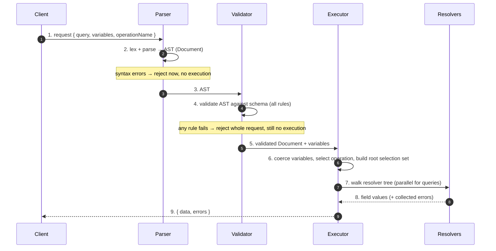
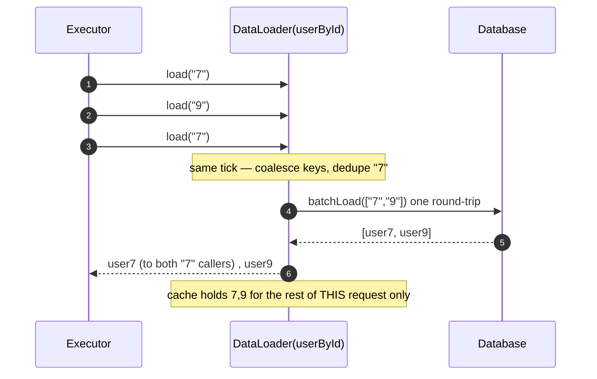

# GraphQL — Professional

<!-- level-focus -->
At professional level, focus on this question:

> How should teams adopt and operate **GraphQL** with measurable outcomes and limited coordination?

Use the smallest realistic scenario that exposes the decision and its failure behavior.
## 1. The Type System, Formally

A GraphQL service exposes exactly one **schema**, and the schema is entirely described by its
**types**. Every value that flows in or out of the server has a type, and the specification defines
a small, closed set of *type kinds*. Getting these kinds exactly right is the whole game: validation,
introspection, and execution are all consequences of them.

There are six **named** type kinds plus two **wrapping** kinds (covered in §2). The named kinds split
into two families: **output types** (what a field can *return*) and **input types** (what an argument
can *accept*). Some kinds are only output, some only input, some both.

| Kind | Family | Has fields? | Definition |
|------|--------|-------------|------------|
| **Scalar** | input + output | no | A leaf: a concrete primitive value. Built-ins: `Int` (32-bit signed), `Float` (double), `String`, `Boolean`, `ID` (serialized as a string but semantically opaque). Custom scalars (`DateTime`, `URL`) define their own coercion. |
| **Object** | output only | yes | A node with named fields, each field having its own type and optional arguments. The workhorse of the graph. Cannot be used as an input. |
| **Interface** | output only | yes | An abstract type: a set of fields that concrete objects **must** implement. An interface-typed field returns *some* implementing object at runtime; the executor must resolve its concrete type. |
| **Union** | output only | no (no own fields) | An abstract type: a set of possible object types with **no** required common fields (e.g. `SearchResult = User \| Post \| Comment`). Callers must use inline fragments (`... on User`) to select fields. |
| **Enum** | input + output | no | A leaf whose value is one of a fixed, named set of symbolic constants. Serialized as its name string, but the *value* is opaque — an enum is not a string. |
| **Input Object** | input only | yes (input fields) | A structured argument type: named input fields, each itself an input type. Enables passing a nested object as a single argument. Cannot appear as a field's return type. |

Two invariants fall directly out of this table and are enforced at schema-build time:

- **Output/input segregation.** A field's return type must be an output type; an argument's type
  must be an input type. `Object`, `Interface`, and `Union` are output-only, so you can never
  accept an object as an argument — that is exactly why **Input Object** exists as a separate kind.
- **Leaf vs composite.** Scalars and Enums are **leaves** — a selection on a leaf field terminates.
  Objects, Interfaces, and Unions are **composite** — a selection on them *must* itself contain a
  sub-selection (you cannot ask for a `User` without asking which of its fields you want). This is a
  validation rule (`ScalarLeafs` / `FieldsOnCorrectType`), not a runtime one.

---

## 2. Wrapping Types: Non-Null and List

Every named type can be *wrapped*. Wrapping types are not new kinds of data — they are modifiers
that constrain **nullability** and **cardinality**. There are exactly two, and they compose.

- **Non-Null** — written `T!`. The value is guaranteed present; `null` is a *type error*. On an
  argument, it means the caller must supply the value. On a field, it means the resolver promises
  a value — and if the resolver nonetheless yields `null` (or errors), the executor **propagates
  the null upward** (see §5).
- **List** — written `[T]`. The value is an ordered sequence of `T`. Lists and Non-Null compose to
  express precise contracts:

| Type expression | Meaning | `null` for the whole list? | `null` for an element? |
|-----------------|---------|----------------------------|------------------------|
| `[Post]` | nullable list of nullable posts | allowed | allowed |
| `[Post!]` | nullable list of non-null posts | allowed | forbidden |
| `[Post]!` | non-null list of nullable posts | forbidden | allowed |
| `[Post!]!` | non-null list of non-null posts | forbidden | forbidden |

The critical, often-missed consequence: **`!` changes error behavior, not just documentation.** If a
`[Post!]!` field produces a list where one element resolves to `null`, that `null` violates the inner
`Post!`; the error propagates to the list, which is `[..]!` and cannot be null, so it propagates to
*that field's parent*, and so on up to the nearest nullable ancestor. Non-null wrappers are therefore
a **blast-radius decision**, not merely a validation nicety — a topic §5 makes precise.

---

## 3. The Schema as a Graph

The schema is literally a directed graph. **Object and interface types are nodes; fields are typed
edges** pointing from a type to the type they return. Two nodes are distinguished as **operation
roots**:

- **Query** — the entry point for reads. Every read traversal starts here.
- **Mutation** — the entry point for writes.
- **Subscription** — the entry point for long-lived event streams (out of scope for this tier).

A GraphQL *query document* is nothing more than a **path selection through this graph starting at a
root**. Because fields can return object types that themselves have fields, the graph has cycles
(`User → posts → Post → author → User → …`), and a query is a *finite tree carved out of a possibly
infinite unrolling* of that graph. This is the source of GraphQL's power **and** its cost problem:
the client, not the server, decides the shape and depth of the traversal.

```mermaid
flowchart LR
    Q[Query root] -->|user(id)| U[User]
    U -->|name: String!| S1((String))
    U -->|posts: Post!| P[Post]
    P -->|title: String!| S2((String))
    P -->|author: User!| U
    P -->|comments: Comment!| C[Comment]
    C -->|text: String!| S3((String))
    C -->|author: User!| U
```

Note the back-edges `Post.author → User` and `Comment.author → User`: the schema graph is cyclic, so
depth is unbounded *a priori*. Only the client's selection set makes any given traversal finite —
which is precisely why the server must impose the bounds we derive in §7.

---

## 4. The Request Pipeline: Parse → Validate → Execute

A GraphQL request is processed in three strictly ordered phases. The specification names these
precisely, and their order is not negotiable: you cannot validate what you have not parsed, and you
must never execute what has not validated.



Three properties of this pipeline matter at principal level:

1. **Validation is total and static.** Every validation rule is decidable from the document + schema
   *alone*, with no data access. `graphql-js` ships ~20 rules (fields exist, arguments have correct
   types, fragments are used, variables are defined, no unbounded recursion via fragment cycles,
   leaf/composite selection correctness, …). A request that fails *any* rule is rejected **entirely**
   — GraphQL has no partial-parse execution. This is why validation results are cacheable by query
   hash: for a fixed schema, a given query string always validates the same way.
2. **The `data`/`errors` shape is invariant.** The response is a map with at most `data`, `errors`,
   and `extensions`. Field-level failures during execution do **not** abort the request; they append
   to `errors` and null the field (subject to non-null propagation, §5). This is unlike REST, where a
   handler exception is typically one HTTP status for the whole call.
3. **Cost analysis slots in between 5 and 7.** Depth limiting and complexity scoring are a *post-
   validation, pre-execution* gate (§7): they run on the validated AST before a single resolver fires,
   which is the only place to stop an abusive query cheaply.

---

## 5. Execution Semantics: The Resolver Tree

Execution is defined by the spec's **`ExecuteSelectionSet`** algorithm, a recursive tree-walk. Each
field in the query corresponds to a **resolver**: a function `resolve(parent, args, context, info) →
value` (or a promise/future thereof). Execution proceeds as follows.

1. Start at the operation's root value with the operation's root selection set.
2. **Collect fields** — merge the selection set, resolving fragment spreads and `@skip`/`@include`
   directives, into an ordered map of *response-key → field group*.
3. For each response key, **execute the field**:
   a. Coerce the field's arguments (using variables).
   b. Call the field's `resolve` function with the *parent's* resolved value.
   c. **Complete the value** against the field's type:
      - **Leaf (scalar/enum):** serialize the value via the type's `serialize` coercion.
      - **Object:** recurse — run `ExecuteSelectionSet` on the sub-selection with this value as the
        new parent.
      - **Interface/Union:** call the abstract type's `resolveType` to pick the concrete object, then
        recurse.
      - **List:** complete each element against the inner type (elements may complete concurrently).
      - **Non-Null:** complete the inner type; if the result is `null`, raise a *field error*.
4. Assemble results into a map keyed by **response key** (the alias if present, else the field name),
   preserving the *query's* field order — GraphQL responses echo the request's field ordering
   exactly, which is why the result map is ordered.

**Null propagation** is the subtle part. A field error (resolver threw, or a non-null field yielded
`null`) does *not* fail the whole request. Instead, the field's value becomes `null` and an entry is
pushed to `errors` with the field's `path`. But if that field was declared **non-null**, `null` is
illegal there, so the error propagates to the **parent** field; if the parent is *also* non-null, it
propagates again, climbing until it reaches the nearest **nullable** field (in the worst case, the
root, nulling all of `data`). This is why over-using `!` on deep object chains is a real availability
hazard: a single failed leaf can null an entire subtree of otherwise-good data.

---

## 6. Why Fields Resolve in Parallel — Except Mutations

The specification makes a deliberate distinction between the two write-vs-read root types, and it is
grounded in *observable side effects*:

- **Query (and any nested selection set) — fields MAY execute in parallel.** The spec permits
  executors to resolve sibling fields concurrently because a *read* is assumed to be **side-effect-
  free**: whether `user` resolves before or after `posts` cannot change the answer. graphql-js,
  Apollo, gqlgen and others exploit this by launching all sibling resolvers at once and awaiting them
  together — the reason a single GraphQL request can fan out into many parallel data fetches.
- **Mutation top-level fields — MUST execute serially, in listed order.** The spec's
  `ExecuteRootSelectionSet` mandates that when the operation is a mutation, the *top-level* selections
  are resolved **one at a time, left to right**, each fully completing before the next begins. The
  reason: mutation fields have observable side effects, and clients rely on a predictable order —
  `{ createUser  logAction  sendEmail }` must run in that sequence, or "log after create" would be a
  lie. Note this seriality is **only at the top level of a mutation**; the *sub-selections* returned
  by each mutation field are still ordinary reads and may parallelize.

| Property | Query fields | Mutation top-level fields |
|----------|-------------|---------------------------|
| Assumed side effects | none | yes |
| Execution order | unspecified (may parallelize) | strictly serial, list order |
| Determinism required | of the *result*, not the *order* | of both result and effect order |
| Typical implementation | `Promise.all` fan-out | sequential `await` loop |

This is the single most important execution-model fact that distinguishes GraphQL from a naive
"resolve everything concurrently" mental model, and it is a common source of production bugs when a
team implements a custom executor and forgets the mutation seriality clause.

---

## 7. Query Complexity Analysis: Bounding the Work

Because the *client* chooses the traversal (§3) and the graph is cyclic, a single small query string
can demand astronomical work — e.g. `user → posts → author → posts → author → …`. Servers therefore
must reject over-expensive queries **before** execution. Two static analyses, run on the validated AST,
provide the bound.

**Depth limiting.** Count the maximum nesting of selection sets. It is the cheapest guard and stops
the pathological cyclic-recursion case. A typical limit is 7–15. Depth alone is insufficient — a
*shallow* but *wide* query (one level, thousands of fields or a `first: 100000` list) is cheap in
depth but expensive in work.

**Complexity (cost) scoring.** Assign each field a numeric cost and sum the tree, *multiplying by the
list multipliers of every ancestor*. The canonical scoring rules:

| Rule | Cost contribution |
|------|-------------------|
| Scalar / enum leaf field | typically `0` or `1` |
| Object field (single) | `1` (one resolver call) |
| List field with `first: N` / `last: N` | multiply the subtree cost by `N` |
| Unbounded list (no pagination arg) | reject, or apply a large default `N` |
| Nested lists | multipliers **compound** (product of all ancestor `N`s) |
| Custom-weighted field (e.g. a search resolver) | explicit `@cost(weight: k)` directive |

The core recurrence for a field `f` with children `c₁..cₙ` and list-multiplier `m_f` (1 if not a
list) is:

```
cost(f) = weight(f) + m_f · Σ cost(cᵢ)
```

The multiplicative rule is the crux: nested paginated lists multiply, so `posts(first:50)` each with
`comments(first:20)` is not `50 + 20` but `50 · (1 + 20) = 1050` resolver-units. A depth-only limiter
would wave this through; a multiplicative cost model catches it. The server rejects the request if
`cost(rootQuery)` exceeds a configured budget — a pure static computation, no data touched.

---

## 8. A Worked Cost Calculation

Take this query against the §3 schema and score it with the rules of §7 (scalars = `0`, object/list
fields = `1` per resolver, list `first: N` multiplies the subtree):

```graphql
query {
  user(id: "42") {          # object, m = 1
    name                    # scalar leaf, 0
    posts(first: 50) {      # list, m = 50
      title                 # scalar leaf, 0
      comments(first: 20) { # list, m = 20
        text                # scalar leaf, 0
        author {            # object, m = 1
          name              # scalar leaf, 0
        }
      }
    }
  }
}
```

Apply the recurrence bottom-up:

- `author` subtree: object field `author` (=1) whose child `name` is a scalar (0). So
  `cost(author) = 1 + 1·(0) = 1`.
- `comments` subtree: list `comments` with `m = 20`. Its children per element are `text` (scalar, 0)
  and `author` (cost 1). So `cost(comments) = 1 + 20·(0 + 1) = 1 + 20 = 21`.
  (The leading `1` is the `comments` resolver call itself; the `20·(…)` is the per-element work.)
- `posts` subtree: list `posts` with `m = 50`. Its children per element are `title` (scalar, 0) and
  `comments` (cost 21). So `cost(posts) = 1 + 50·(0 + 21) = 1 + 1050 = 1051`.
- `user` subtree: object `user` (=1). Its children are `name` (scalar, 0) and `posts` (cost 1051). So
  `cost(user) = 1 + 1·(0 + 1051) = 1052`.

**Total query cost = 1052.** Contrast the metrics a naive guard would report:

| Metric | Value | Verdict under a budget of 1000 |
|--------|-------|-------------------------------|
| Query **depth** | 5 (query → user → posts → comments → author) | passes a depth-15 limit — *false negative* |
| **Field count** (static) | 8 fields in the document | trivially passes — *false negative* |
| **Complexity cost** (multiplicative) | **1052** | **rejected** — the multipliers exposed the real fan-out |

The lesson: only the multiplicative model reflects the true `50 × 20 = 1000+` element expansion. Had
the client asked for `comments(first: 19)`, cost would be `1 + 50·(1 + 19) = 1001` — still over — but
`comments(first: 18)` gives `1 + 50·19 = 951`, under budget. Cost analysis thus gives the client a
*precise, predictable* contract: they can compute exactly how much of the budget any query consumes
before sending it, and the server enforces it without ever touching the database.

---

## 9. DataLoader: Batching and Caching Within a Request

The resolver tree of §5 has a notorious failure mode: the **N+1 problem**. Resolving
`posts(first:50) { author { name } }` calls the `author` resolver 50 times — potentially 50 separate
`SELECT * FROM users WHERE id = ?` round-trips. The type system encourages this: each field resolves
independently, oblivious to its siblings. **DataLoader** is the standard remedy, and its mechanics are
precise.

A DataLoader wraps a user-supplied **batch function** `batchLoad(keys) → values` (values aligned
1:1 with keys). It provides two guarantees, both scoped to a **single request**:

1. **Batching by event-loop tick.** Instead of dispatching each `load(key)` immediately, the loader
   *coalesces* all `.load(key)` calls made within the same synchronous execution frame (in JS, the
   current microtask tick) into **one** call to `batchLoad([k1, k2, …])`. Because sibling resolvers
   run concurrently (§6), all 50 `author.load(id)` calls land in the same tick and collapse into one
   `SELECT * FROM users WHERE id IN (…)`. N+1 becomes 1+1.
2. **Per-request caching (memoization).** The loader memoizes by key *for the life of the request*.
   If `author.load("42")` is requested by three different posts, `batchLoad` sees `"42"` once and the
   other two calls return the cached promise. This deduplication is also what makes non-null
   propagation and referential consistency well-behaved within a response.



Two boundaries a principal engineer must respect:

- **Scope is the request, not the process.** A DataLoader instance is created **per request** (in the
  GraphQL `context`). Sharing one across requests leaks one user's data into another's response and
  serves stale reads — a correctness and security bug, not an optimization detail.
- **DataLoader is a request-batcher, not a cache layer.** Its "cache" is per-request memoization to
  dedupe within one traversal; cross-request caching belongs to a separate layer (Redis, CDN, response
  cache) with its own invalidation. Conflating the two is a classic mistake.

---

## 10. Formal Summary and Pitfalls

The model, compressed to its load-bearing claims:

- **The schema is a typed, cyclic graph.** Six named kinds (scalar, object, interface, union, enum,
  input object) plus two wrappers (non-null, list); output/input segregation and leaf/composite
  distinctions are enforced statically at schema build. (§1–§3)
- **A request is three ordered phases** — parse → validate → execute — and validation is *total and
  static*: any rule failure rejects the entire request before execution. (§4)
- **Execution is a recursive resolver tree-walk** with a fixed value-completion algorithm; field
  errors null the field and **propagate up non-null wrappers** to the nearest nullable ancestor. (§5)
- **Query fields may parallelize; mutation top-level fields must serialize** in list order, because
  writes have observable, order-sensitive side effects. (§6)
- **Cost is bounded statically** by depth + a *multiplicative* complexity score; nested paginated
  lists multiply, which is exactly what depth-only limits miss. (§7–§8)
- **DataLoader collapses N+1** via same-tick batching + per-request memoization, and its scope is one
  request — no wider. (§9)

Pitfalls that separate correct systems from plausible-looking ones:

| Pitfall | Consequence | Fix |
|---------|-------------|-----|
| Over-using `!` on deep object chains | one failed leaf nulls a large subtree via propagation | reserve non-null for genuinely-always-present fields |
| Depth-limit-only guard | wide/paginated queries (`first: 10000`) sail through | add multiplicative complexity scoring |
| Custom executor resolving mutations concurrently | out-of-order side effects, corrupted writes | serialize mutation top-level fields |
| Sharing a DataLoader across requests | cross-request data leaks + stale reads | instantiate per request in `context` |
| Treating DataLoader as the cache | memory growth, stale data across requests | keep a separate, invalidatable cache layer |
| Unbounded list fields (no pagination args) | uncapped fan-out, cost model can't bound them | require `first`/`last` or assign a default max |

Master these and you can reason about a GraphQL request the way you reason about a query plan: a typed
tree with a computable cost, a deterministic execution order, and a precise error algebra.

---


---

## Apply it

1. Define the user or business outcome that **GraphQL** should improve.
2. Assign one owner for code, contracts, operations, and incidents.
3. Split delivery into reversible increments that produce evidence early.
4. Publish responsibilities, escalation paths, and compatibility windows.
5. Stop or expand only when the agreed measures support that decision.

## Verify your work

- Each increment has an owner, rollback path, and observable exit condition.
- Adoption, reliability, delivery time, and coordination cost are measured.
- Incident and migration exercises prove that responsibility is executable.
- The old path is removed only after telemetry proves it is unused.

## Review questions

- Which measurable outcome justifies investing in GraphQL?
- Which team owns the full lifecycle and incident response?
- What reversible increment produces the earliest useful evidence?
- Which exit condition proves that migration or adoption is complete?
