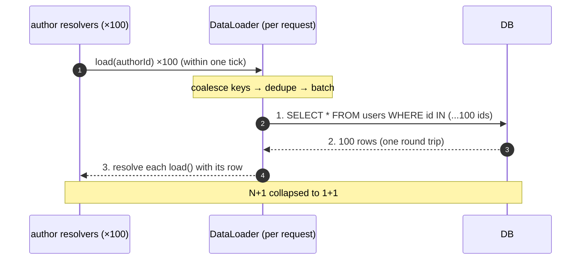
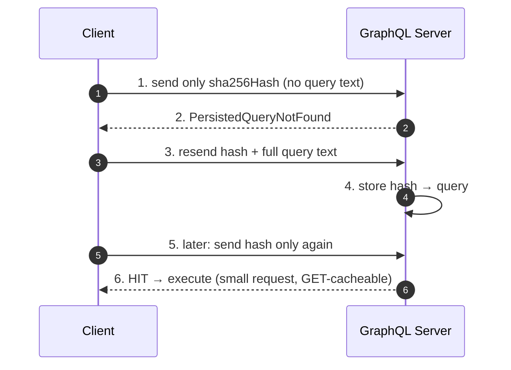
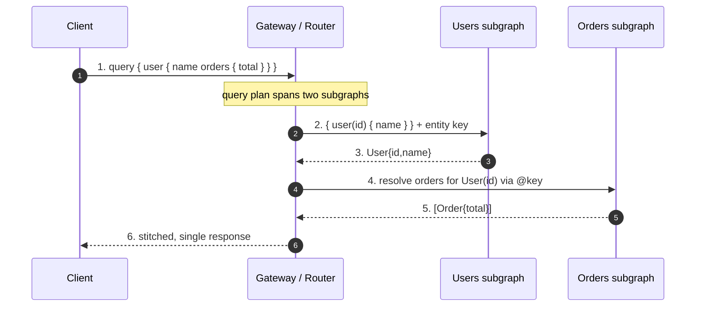

# GraphQL — Senior

<!-- level-focus -->
At senior level, focus on this question:

> Which system invariant is affected by **GraphQL** under failure, load, and change?

Use the smallest realistic scenario that exposes the decision and its failure behavior.
## 1. The Core Trade: Client-Driven Aggregation

In REST, the *server* owns response shape. `GET /users/42` returns whatever the endpoint author decided a user is. If the client wants the user's last three orders too, it either makes a second call (`/users/42/orders?limit=3` — under-fetching, extra round trips) or the server bakes orders into the user endpoint for everyone (over-fetching — mobile clients pay for fields they never render). The tension is structural: one endpoint serves many clients with different needs, so it is either too fat or too thin for most of them.

GraphQL inverts the ownership. The server publishes a **schema** — a typed graph of what *can* be asked — and each client sends a **query** describing exactly the fields it wants for this screen:

```graphql
query ProfileScreen($id: ID!) {
  user(id: $id) {
    name
    avatarUrl
    orders(last: 3) {
      id
      total
      status
    }
  }
}
```

The response mirrors the query shape 1:1. No field the client didn't ask for; no round trip the client didn't need. This is **client-driven aggregation**: the client composes its data requirements, the server's resolvers fan out to whatever backends satisfy them, and the whole tree returns in one request.

The senior framing is that this is not "a better REST." It is a *different distribution of control* with a different cost profile. You have moved response-shaping power to the client, and with it you have moved a set of responsibilities that REST handled implicitly — caching, rate limiting, cost bounding — onto yourself, because the mechanisms that made them free in REST no longer apply. Sections 3–8 are, in effect, the bill.

---

## 2. What GraphQL Gives You

**No over-fetching or under-fetching.** Each client fetches exactly its fields. A watch app requesting `{ name }` and a desktop dashboard requesting fifty fields hit the same endpoint and each pay only for what they render. This is the headline win for **bandwidth-constrained and battery-constrained clients** (mobile, especially on poor networks).

**One round trip for a whole screen.** A screen that in REST would require `/user`, then `/user/orders`, then `/orders/{id}/items` — three sequential dependent round trips, each adding an RTT to time-to-render — becomes a single nested query. The server does the fan-out internally, where latency between services is far lower than a mobile RTT. This collapses the *client-perceived* latency of dependent data.

**The schema is a typed, introspectable contract.** The schema is machine-readable and self-documenting via **introspection** — tooling (GraphiQL, IDE autocomplete, codegen) reads the schema and generates typed client models. There is a single source of truth for what the API can do, and clients get compile-time-ish safety against it. This is a genuine advantage over hand-written REST docs that drift from the implementation.

**Excellent as a BFF / API-aggregation layer.** GraphQL shines as a **Backend-for-Frontend**: a graph layer that stitches together many downstream REST/gRPC services and databases into one client-facing graph. Product teams query the graph; the graph resolvers own the fan-out and joining. This is where GraphQL's leverage is highest — it turns "the frontend orchestrates five services" into "the frontend describes what it wants."

**Evolving the schema without versioning.** You add fields freely (additive changes are non-breaking because clients only get fields they ask for) and **deprecate** old fields with `@deprecated(reason: ...)`, then measure real usage via analytics before removing them. There is no `/v2` fork of the whole surface — evolution is field-granular and driven by observed client usage.

---

## 3. What GraphQL Costs You

Every strength in §2 has a matching liability. A senior must be able to name all of them unprompted, because each is a production incident waiting to happen.

| Cost | Why it appears | Where it bites |
|---|---|---|
| **HTTP caching breaks** | Single POST endpoint, query in body; no cacheable URLs | CDN/proxy caching gone; must rebuild at app layer (§4) |
| **Query complexity / DoS** | Client controls the query; nested and paginated fields multiply | One malicious or naive query fans out to millions of resolver calls (§6) |
| **N+1 explosions** | Naive per-field resolvers each hit a datastore | A list of 100 items → 1 + 100 DB queries without batching (§5) |
| **Per-field authz** | Authorization is no longer per-route | Must enforce access on every field/edge, not one endpoint (§8) |
| **Observability of one endpoint** | Everything is `POST /graphql`; URL tells you nothing | Latency, errors, and rate cannot be attributed by URL; need per-field/operation tracing |
| **Rate limiting is harder** | Requests are heterogeneous; "1 request" means nothing | Count cost/complexity, not requests (§6) |
| **Errors are partial** | A query can succeed for some fields, error for others | 200 OK with a partial `data` + `errors` array; clients must handle mixed results |

Two of these deserve emphasis at the senior level because they are the ones that cause outages rather than annoyances: **the client controls the query** (so the endpoint's worst case is defined by an adversary, not by you — §6), and **caching is now your problem** (§4). The rest are engineering discipline; these two are architecture.

---

## 4. Caching: Why HTTP Caching Breaks and What Replaces It

REST gets caching almost for free. `GET /products/42` is a cacheable URL: browsers cache it, CDNs cache it, reverse proxies cache it, all keyed on the URL plus headers (`ETag`, `Cache-Control`, `Last-Modified`). A huge fraction of read traffic never reaches your origin.

GraphQL forfeits this. Queries are typically sent as **`POST /graphql`** with the query in the request body, because queries can exceed URL length limits and often carry variables. `POST` is not cacheable by default, and even if it were, the *body* varies per screen, so the URL is a useless cache key. **The single most important caching mechanism in the web stack — URL-based HTTP caching — does not apply.** You have to rebuild caching yourself at three layers:

1. **Client-side normalized cache.** Apollo Client / Relay maintain a normalized store keyed by a stable object identity (`__typename` + `id`). When a query returns `User:42`, it's cached by that key; a later query touching the same entity reads from the store instead of the network, and mutations that return the updated entity patch the store in place. This is the primary GraphQL "cache" — and it lives in the client, not the network.
2. **Per-resolver / data-source caching.** Inside the server, resolvers cache the *downstream* fetches (a Redis cache in front of a DB read, HTTP caching of an upstream REST call). This is caching the graph's *inputs*, invisible to the query shape.
3. **Response caching for whole operations.** With **persisted queries** (§7) the operation is identified by a stable hash, which *can* be sent as `GET /graphql?extensions=...&sha256Hash=...`. A known-safe query with a stable hash and no per-user data becomes CDN-cacheable again — this is how you claw back edge caching, but only for the subset of queries that are public and persisted.

The senior point: **do not promise stakeholders "GraphQL will reduce origin load via caching" the way REST does.** By default it *increases* origin load because every read hits your resolvers. You earn caching back deliberately — normalized client cache for UX, data-source caching for the origin, persisted-query GETs for the edge — and each has narrower applicability than a plain cacheable URL.

---

## 5. The N+1 Problem and DataLoader

The N+1 problem is GraphQL's most common performance failure, and it falls directly out of the resolver model. Each field has a resolver; resolvers run independently. Consider:

```graphql
query {
  posts(first: 100) {   # 1 query: fetch 100 posts
    title
    author { name }     # author resolver runs once PER post → 100 queries
  }
}
```

The `posts` resolver runs one query and returns 100 posts. Then the `author` resolver runs **once per post** — 100 separate `SELECT * FROM users WHERE id = ?` calls. Total: **1 + 100 = N+1** queries. At depth, this compounds multiplicatively: 100 posts × their comments × each comment's author is thousands of queries for one request.

The fix is **DataLoader** (Facebook's original pattern, now standard in every GraphQL server). A DataLoader is a per-request batching-and-caching layer around a data source:



DataLoader works by **deferring** each `load(key)` to the end of the current event-loop tick, collecting all keys requested in that tick, deduplicating them, and issuing **one batched query** (`WHERE id IN (...)`). It also memoizes within the request so the same key isn't fetched twice. The 100 author resolvers become one `IN` query. Two rules make DataLoader correct: (1) **one DataLoader instance per request** — never share across requests, or you'll leak one user's data into another's cache and serve stale data; (2) the loader's batch function must **return results in the same order as the input keys** (or map by key), because that ordering is how each `load` call is matched to its row.

DataLoader is not optional at scale — it is the price of the resolver model. A senior reviewing a GraphQL server checks that every field resolving to a backend goes through a batched loader, and treats an un-batched relational resolver as a defect.

---

## 6. Query Cost, Depth, and Complexity: Defending the Endpoint

Because the *client* writes the query, the server's worst-case work is defined by whoever is sending queries — including an attacker. This is categorically different from REST, where each endpoint's cost is bounded by its author. Three attack shapes matter:

**Deep nesting.** If your schema has a cyclic relationship (`author → posts → author → posts → ...`), a query can nest arbitrarily deep, and each level multiplies the work. A dozen levels of a fan-out relationship can request an astronomically large result from a tiny query string — an **amplification attack**.

**Wide/aliased duplication.** GraphQL allows the same field to be requested many times under different aliases. A query with hundreds of aliased copies of an expensive field multiplies cost within a single, shallow query.

**Expensive nested pagination.** `posts(first: 1000) { comments(first: 1000) { author { ... } } }` is a small string that describes a million-node fetch.

The defenses, applied as a pipeline before execution:

- **Depth limiting.** Reject queries deeper than a fixed maximum (e.g. 10–15 levels). Cheap, blunt, catches the cyclic-nesting DoS.
- **Query complexity / cost analysis.** Assign each field a static cost (a scalar = 1, a paginated list = `first × childCost`, an expensive computed field = more). Sum the cost *before executing*; reject anything over a per-request budget. This bounds the *work* a query can request, not just its shape.
- **Rate limiting by cost, not by request count.** "100 requests/minute" is meaningless when one request can be a million-node query. Charge each operation's *computed cost* against a per-client budget (a leaky bucket of "complexity points"), so a client sending cheap queries gets many and a client sending expensive ones gets few.
- **Timeouts and resolver-level circuit breakers.** A hard wall so a query that slips past static analysis still can't run forever.
- **Disable introspection in production (or gate it).** Introspection hands an attacker your full schema, including deprecated and internal fields. Turn it off publicly; keep it for internal tooling.

The senior mental model: **the GraphQL endpoint's rate limit and cost bound are part of its API contract, not an afterthought.** You must be able to answer "what is the most expensive thing a client can ask for, and what stops it?" before the endpoint is public.

---

## 7. Persisted Queries

Persisted queries convert GraphQL's "the client sends arbitrary query text" into "the client sends a hash of a known query." The client registers its queries with the server ahead of time (at build/deploy) and thereafter sends only a **hash** (typically SHA-256 of the query string) plus variables. The server looks up the hash to get the real operation.

The flow, in the **Automatic Persisted Queries (APQ)** variant:



What persisted queries buy you:

- **Smaller requests.** Sending a 64-char hash instead of a multi-kilobyte query reduces upload bytes on every request — meaningful on mobile.
- **Edge cacheability.** A hash is short and stable, so a persisted GET (`GET /graphql?sha256Hash=...&variables=...`) can be cached by a CDN, partially reclaiming the HTTP caching lost in §4.
- **A query allowlist — the strongest DoS defense.** If the server *only* accepts pre-registered operations (reject any unknown hash, no APQ fallback), then clients can no longer author arbitrary queries at runtime. Every executable operation was written and reviewed by your own team at build time. This eliminates the entire class of client-authored deep/expensive/introspection attacks in one move. For a first-party mobile/web app where you control every client, a strict persisted-query allowlist is the single highest-leverage hardening you can apply.

The trade-off: persisted-query allowlisting only works when you control the clients (first-party apps). A public API meant for third parties who write their own queries cannot allowlist, and must fall back on cost analysis (§6).

---

## 8. Authorization Per Field

In REST, authorization is naturally per-route: middleware on `DELETE /orders/42` checks "can this caller delete this order?" once, at the edge. GraphQL dissolves the route. A single query can touch dozens of types and edges, and each may have different access rules. Authorization moves **from the route to the field and the edge.**

Consider `user(id: 42) { email salary manager { salary } }`. `email` might be visible to the user themselves; `salary` only to HR and the person's manager; `manager.salary` is a *different* person's salary reached by traversing an edge. There is no single route to guard — access depends on the field, the object instance, and the traversal path.

Senior guidance:

- **Enforce authz in the business layer, not only in resolvers.** Resolvers should call into a service/domain layer that performs authorization on the actual object, so the same rule holds regardless of which query path reached the object. Putting authz only in the resolver invites gaps when a new query path reaches the same data.
- **Beware object/edge-level access (the graph equivalent of BOLA/IDOR).** Because clients traverse relationships, they can reach objects they'd never request directly (a comment's author's private profile). Every edge that crosses an ownership boundary needs a check; "the parent was authorized" does not imply the child is.
- **Field-level authz and partial results.** A field the caller can't see should error for *that field* (populating the `errors` array) while the rest of `data` returns — GraphQL's partial-result model. Decide deliberately: null-with-error vs. omit vs. reject the whole query.
- **Introspection is an authz surface too.** A hidden/internal field is still discoverable via introspection unless introspection is disabled or the field is filtered from the exposed schema.

The failure mode to internalize: **an authz check that was implicit in a REST route becomes an explicit, per-field obligation you can forget.** The most common real GraphQL security bug is an edge that returns data the caller should never have been able to reach.

---

## 9. Federation and Schema Composition at Org Scale

A single monolithic schema owned by one team does not scale to a large org. Many teams each own part of the graph — the Users team owns `User`, the Orders team owns `Order`, the Reviews team owns `Review` — and they must not all edit one giant schema file or deploy in lockstep. **Federation** composes independently owned, independently deployed **subgraphs** into one client-facing **supergraph**, served by a **gateway/router**.

Each subgraph owns its types and can **extend** types owned by others via a shared key. The Orders subgraph declares that an `Order` has a `User`, referencing `User` by its key (`id`) without owning it; the Users subgraph resolves the rest of `User`. The gateway plans a query that spans both, calls each subgraph for its part, and stitches the result:



Two composition approaches, and why one won:

| | **Schema stitching** (older) | **Apollo Federation** |
|---|---|---|
| How types combine | Gateway config manually merges/renames types | Subgraphs declare ownership via directives (`@key`, `@external`, `@requires`) |
| Ownership | Centralized in gateway config | Distributed to the owning team, in their schema |
| Cross-service refs | Manual delegation resolvers in the gateway | Entity resolution by key, planned by the router |
| Scaling to many teams | Brittle — gateway becomes a bottleneck and merge-conflict hotspot | Designed for it — teams deploy subgraphs independently |

Apollo Federation is the de-facto standard because it puts ownership where the work is: each team's subgraph is the single source of truth for its types, the router computes the query plan, and teams ship independently. Stitching still exists but has largely lost to federation for exactly the org-scale reasons that motivate splitting the graph in the first place.

Senior caveats federation adds: the **gateway is a new single point of failure and a latency-and-cost aggregator** (it must be sized and cached carefully); **query planning across subgraphs is itself work** (and can produce surprising fan-out); **cross-subgraph N+1** appears when the router resolves entities one at a time (federation supports batched entity resolution — verify it's on); and **schema composition must be validated in CI** (a subgraph change that breaks composition should fail the pipeline, not production). Federation solves an *organizational* problem (independent ownership) at the cost of *operational* complexity (a distributed query planner).

> See the canonical model at [Apollo Federation](https://www.apollographql.com/docs/federation/) and the language/spec at [graphql.org](https://graphql.org/).

---

## 10. When GraphQL Fits vs REST vs gRPC

There is no universally correct choice; there is a fit between the traffic pattern and the protocol's cost profile.

| Dimension | GraphQL | REST | gRPC |
|---|---|---|---|
| Response shape control | **Client** (per-query) | Server (per-endpoint) | Server (fixed proto) |
| Over/under-fetch | Eliminated by design | Common; needs many endpoints | Fixed message; batch RPCs |
| HTTP caching | **Lost** (POST); rebuild in-app/edge | Native, free (cacheable URLs) | N/A (binary/HTTP2); app-level |
| Best fit | Many heterogeneous clients aggregating many sources | Public APIs, resources, CDN-friendly reads | Internal service-to-service, low latency, streaming |
| Cost/DoS bounding | **Your job** (depth+complexity+persisted) | Per-endpoint, implicit | Per-method, implicit |
| Rate limiting unit | Query cost/complexity | Requests per endpoint | Requests per method |
| Tooling / typing | Introspection, codegen, one endpoint | OpenAPI, ubiquitous, HTTP-native | Proto/IDL, strong typing, HTTP/2 |
| Human/browser-friendliness | Good (JSON, GraphiQL) | Excellent (cURL, URLs, caches) | Poor (binary; needs tooling) |

Decision heuristics a senior applies:

- **Choose GraphQL** when you have **many diverse clients** (web, iOS, Android, partners) whose data needs differ, or a **BFF/aggregation layer** stitching several backends, and the win of "client fetches exactly its screen in one round trip" outweighs rebuilding caching and cost-bounding. It is strongest where client diversity and aggregation are the dominant costs.
- **Choose REST** when your surface is **resource-oriented**, **read-heavy and cacheable** (you want CDNs and browser caches doing the heavy lifting), or a **public API** whose consumers you don't control (you can't rely on persisted-query allowlists). REST's free HTTP caching is a genuine, hard-to-replicate advantage.
- **Choose gRPC** for **internal service-to-service** calls where you control both ends and want low latency, strong typing, code-gen, and streaming. gRPC is a poor public/browser-facing API but an excellent internal transport — and GraphQL resolvers frequently call gRPC services underneath.

These are not exclusive. A very common architecture is **GraphQL at the edge (BFF) over gRPC/REST internally**: GraphQL gives clients the aggregation and shape control; gRPC gives the internal fan-out speed and typing; REST/CDN serves the cacheable public reads. Owning the boundary means picking the right protocol *per hop*, not per system.

---

## 11. Failure Catalog and Senior Checklist

| Failure mode | Root cause | Mitigation |
|---|---|---|
| Endpoint DoS via deep/expensive query | Client controls the query; no cost bound | Depth limit + complexity budget + cost-based rate limit + timeouts (§6) |
| N+1 query blowup | Per-field resolvers each hit the datastore | DataLoader (one per request, batched `IN` fetch) on every backend edge (§5) |
| Origin overload / "why no caching?" | HTTP URL caching lost with POST endpoint | Normalized client cache + data-source cache + persisted-query GETs at edge (§4) |
| Schema handed to attacker | Introspection enabled in prod | Disable/gate introspection publicly (§6) |
| Broken object/edge authorization | Authz was per-route, now per-field/edge | Enforce in business layer on the object; check every ownership-crossing edge (§8) |
| Arbitrary client queries in a first-party app | Accepting free-form query text | Strict persisted-query allowlist (§7) |
| Cross-subgraph fan-out / N+1 in federation | Router resolves entities one by one | Batched entity resolution; size and cache the gateway (§9) |
| Silent partial failures | Field errors returned as 200 + `errors` array | Clients must handle mixed `data`/`errors`; monitor error rate per field |
| Blind observability | One `POST /graphql` hides everything | Trace per operation and per resolver; alert on cost, not request count |

**Senior checklist — before a GraphQL endpoint is production-facing:**

- [ ] Every resolver reaching a datastore goes through a **per-request DataLoader**; no un-batched relational resolvers.
- [ ] **Depth limit** and **complexity/cost budget** are enforced *before* execution, with a hard timeout backstop.
- [ ] **Rate limiting charges query cost**, not request count.
- [ ] **Introspection is disabled or gated** in production.
- [ ] Caching strategy is explicit at all three layers (client normalized store, data-source cache, edge/persisted-query GETs) — nobody assumes free HTTP caching.
- [ ] **Authorization is enforced in the business/domain layer** on real objects, and every ownership-crossing edge is checked.
- [ ] First-party clients use **persisted queries**, ideally as a strict allowlist.
- [ ] Per-operation and per-resolver **tracing/metrics** exist; you can attribute latency and errors without a URL.
- [ ] If federated: **composition is validated in CI**, the gateway is sized/cached as a critical path, and entity resolution is batched.
- [ ] The team can answer, on the whiteboard, **"what is the most expensive query a client can send, and what stops it?"**

*Next step:* [GraphQL — Professional](professional.md)

---

## Apply it

1. State the system invariant that **GraphQL** must protect.
2. Mark ownership, state, and failure propagation at each boundary.
3. Compare two designs under load, dependency failure, and future change.
4. Define recovery and compatibility behavior before implementation.
5. Test the riskiest assumption with a focused experiment.

## Verify your work

- The experiment supports the design with evidence, not preference.
- Failure injection shows the blast radius and recovery path.
- Compatibility checks cover old and new callers or data.
- Operational signals reveal invariant violations and recovery progress.

## Review questions

- Which invariant must remain true when GraphQL fails?
- Where should recovery responsibility live, and why?
- Which assumption deserves an experiment before implementation?
- How can the design evolve without changing every consumer at once?
