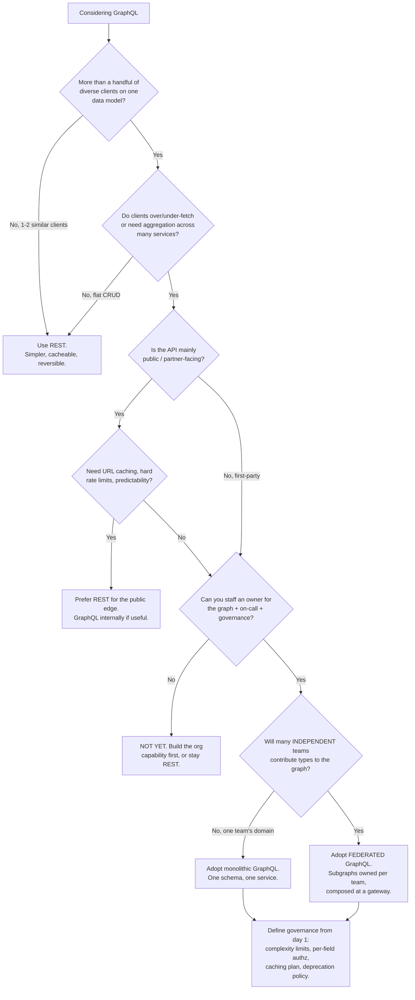
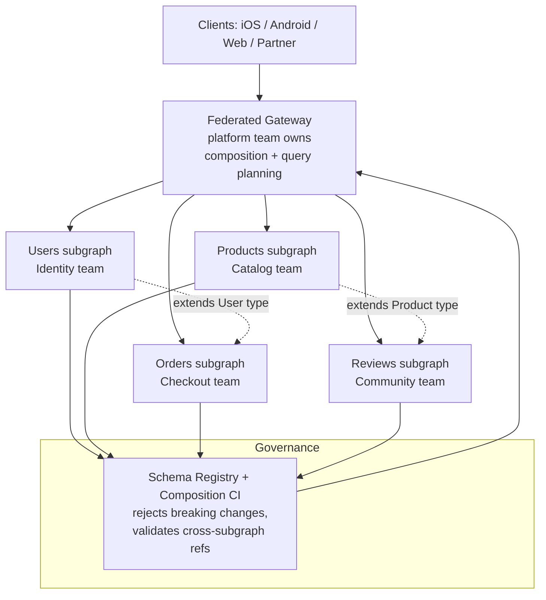

# GraphQL — Staff

> **Axis:** organizational scope & judgment — NOT deeper mechanism (that is `professional.md`).
> This file answers: should the organization adopt GraphQL *at all*, who pays the standing tax
> once it does, and how a Staff/Principal engineer keeps a single graph from becoming a
> single chokepoint owned by one overloaded team. The mechanism (schema, resolvers, DataLoader,
> persisted queries) is settled by senior/professional. The question here is a sociotechnical
> one: GraphQL relocates cost from the client to a shared server layer, and someone in your
> org now owns that layer forever. The decision is *who*, *how much*, and *is it worth it*.

---

## Table of Contents

1. [The Real Decision: Who Pays the Aggregation Cost](#1-the-real-decision-who-pays-the-aggregation-cost)
2. [When GraphQL Earns Its Keep — and When It's Overkill](#2-when-graphql-earns-its-keep--and-when-its-overkill)
3. [The Adoption Decision Tree](#3-the-adoption-decision-tree)
4. [GraphQL vs REST at Org Scale](#4-graphql-vs-rest-at-org-scale)
5. [The Standing Tax: What You Now Own Forever](#5-the-standing-tax-what-you-now-own-forever)
6. [The Single-Graph Chokepoint and Federation](#6-the-single-graph-chokepoint-and-federation)
7. [Governance: Schema, Authz, and Rate-Limiting Across Teams](#7-governance-schema-authz-and-rate-limiting-across-teams)
8. [Build vs Buy: Self-Hosted vs Managed](#8-build-vs-buy-self-hosted-vs-managed)
9. [Cost, ROI, and the Total Ledger](#9-cost-roi-and-the-total-ledger)
10. [Rollout, Migration, and Reversibility](#10-rollout-migration-and-reversibility)
11. [When NOT to Reach for GraphQL](#11-when-not-to-reach-for-graphql)
12. [Second-Order Consequences & Signals to Watch](#12-second-order-consequences--signals-to-watch)
13. [Staff Checklist](#13-staff-checklist)

---

## 1. The Real Decision: Who Pays the Aggregation Cost

Every product with more than one screen faces the same friction: a mobile home feed needs
user profile + recent posts + notification count + feature flags, and those live behind four
different services. *Someone* must fan those calls out, join the results, and shape them for
the client. GraphQL does not eliminate that work. It **relocates** it — from N client teams
each hand-rolling aggregation, to one shared server-side graph.

That relocation is the entire Staff-level thesis, and it cuts both ways:

```text
Before GraphQL:  cost of aggregation is DISTRIBUTED to every client.
                 Each iOS/Android/web/partner team writes its own BFF-ish glue.
                 Duplicated, drifting, but independently owned and independently shippable.

After GraphQL:   cost of aggregation is CENTRALIZED into the graph + gateway.
                 Written once, consistent, self-documenting, introspectable.
                 But now a shared component sits on the critical path of every client,
                 and a team must own it, staff on-call for it, and gate every schema change.
```

The junior framing is "GraphQL lets clients ask for exactly the fields they need." True, and
almost irrelevant to whether you should adopt it. The Staff framing is: **you are trading N
teams' worth of duplicated-but-decoupled aggregation for one team's worth of consolidated-but-
coupled aggregation.** That trade is *good* when N is large and the clients are diverse and
bandwidth-constrained. It is *a net loss* when N is small, because you have manufactured a
shared dependency, an operational surface, and a governance process to solve a problem two
REST endpoints already handled.

The correct sentence to say in an architecture review is never "GraphQL is more flexible." It
is: *"We have enough distinct clients pulling overlapping-but-different slices of the same
underlying data that centralizing the aggregation pays for the standing cost of owning a
shared graph — and here is who will own it."* If you cannot name the owner, you are not ready
to adopt.

---

## 2. When GraphQL Earns Its Keep — and When It's Overkill

GraphQL is a **client-diversity amplifier and a bandwidth optimizer**, purchased with a
**shared-server-layer liability**. It wins precisely when the amplifier and optimizer are
worth more than the liability. Concretely:

**Earns its keep when:**

- **Many diverse clients over one data model.** iOS, Android, web, watch, TV, partner APIs
  each want a different projection of the same graph. Every new client is nearly free on the
  server; under REST each client either fights over one bloated endpoint or forces a new
  bespoke one. This is the original Facebook motivation — a news feed rendered by radically
  different device generations. Client count and *heterogeneity* are the signal, not raw scale.
- **Mobile / bandwidth-constrained clients.** Under-fetching (N round-trips to assemble a
  screen) and over-fetching (pulling a 40-field object to render 3 fields) both cost battery,
  latency, and cellular data. GraphQL collapses a screen into one round-trip returning exactly
  the requested fields. On a flaky 3G link this is a measurable product win, not an aesthetic one.
- **BFF-style aggregation across many services.** The client-facing shape spans 5+ backend
  services and the join logic is genuinely shared across clients. GraphQL is a formalized,
  typed, introspectable BFF — better than each team reinventing an ad-hoc aggregation gateway.
- **Rapidly evolving product surface with independent client teams.** When product wants to
  add fields weekly and you'd rather not version an endpoint each time, additive schema
  evolution (add fields, deprecate, never break) lets clients pull new fields without a server
  release cycle per client.

**Overkill when:**

- **Simple CRUD with few clients.** One web app talking to one service. REST with 6 endpoints
  is less code, less infrastructure, no resolver layer, cacheable by any HTTP proxy for free.
  GraphQL here is pure overhead: you pay the full tax for none of the amplifier's benefit.
- **A single first-party client.** If iOS is your only consumer and always will be, you do not
  need a query language to serve one query shape. Ship the endpoint that client needs.
- **Public/partner APIs where predictability and cacheability dominate.** GraphQL's dynamic
  queries defeat URL-based HTTP caching and make abuse-limiting hard (see §7). A public REST
  API with stable, individually-cacheable, rate-limitable endpoints is often the more mature
  choice for third parties you don't control. (GitHub and Shopify offer both and route
  deliberately.)
- **When the org lacks the operational maturity.** GraphQL demands query-complexity limiting,
  per-field authorization, a caching strategy you now build yourself, schema governance, and
  observability that attributes cost per field. A team that cannot yet run a REST service with
  SLOs will drown running a graph.

> The tell for overkill: you are reaching for GraphQL to feel modern, or because a senior
> engineer likes it, and you cannot fill in "the specific client heterogeneity that justifies
> the shared layer." Absent that, REST is the simpler, cheaper, more reversible default.

---

## 3. The Adoption Decision Tree



The two load-bearing gates are **F** (can you name and staff an owner) and **G** (one domain
vs many teams). Skipping F produces an orphaned graph nobody maintains. Getting G wrong in the
"many teams" direction — adopting a single monolithic schema owned by one team while a dozen
teams need to add types — produces the chokepoint that §6 exists to prevent.

---

## 4. GraphQL vs REST at Org Scale

This is the table to bring to the architecture review. It is deliberately about *organizational*
consequences, not wire-level ergonomics.

| Dimension | REST wins when… | GraphQL wins when… |
|---|---|---|
| **Client diversity** | 1–2 homogeneous clients | Many heterogeneous clients, each a different projection |
| **Aggregation** | Data lives in 1–2 services; little joining | Screen spans 5+ services; join logic shared across clients |
| **Bandwidth** | Clients are on fast, cheap networks | Mobile / metered / high-latency clients over/under-fetching |
| **Caching** | You want free HTTP/CDN caching by URL | You'll build response/field caching yourself (or use APQ + edge) |
| **Rate limiting / abuse** | Per-endpoint limits suffice; public API | You must implement query-cost analysis and complexity budgets |
| **Schema evolution** | Versioning endpoints is acceptable | Additive, deprecation-based evolution across many clients |
| **Team ownership** | Each team owns its endpoints independently | Federation lets teams own subgraphs of one composed graph |
| **Operational maturity needed** | Baseline REST + SLOs | High: complexity limits, per-field authz, tracing, governance |
| **Reversibility** | Trivially cacheable, swappable | Sticky — clients couple to the graph; exit is a migration |
| **Public / partner surface** | Predictable, individually cacheable, rate-limitable | Rarely the right public default; strong for internal/first-party |

And the orthogonal build-vs-buy axis for *running* GraphQL once chosen:

| Option | When it wins | Hidden cost |
|---|---|---|
| **Self-host open-source** (Apollo Server, GraphQL Yoga, gqlgen, Hot Chocolate) | You have the ops muscle; want full control; cost-sensitive at scale | You build/operate the gateway, schema registry, composition CI, caching, metrics on-call |
| **Managed / SaaS** (Apollo GraphOS, AWS AppSync, Hasura Cloud, StepZero-style gateways) | Speed to market; small platform team; want governance tooling out of the box | Per-operation/seat pricing, vendor lock-in on the registry + gateway, egress, less control over composition internals |
| **Hybrid** (open-source runtime + managed registry/observability) | Want OSS runtime economics but managed schema governance | Two vendors' failure modes; still own the runtime on-call |

---

## 5. The Standing Tax: What You Now Own Forever

The single most common Staff-level mistake is treating GraphQL adoption as a one-time
integration cost. It is a **standing tax** — a set of capabilities you must now build and
operate *because GraphQL removed the guardrails REST gave you for free*. Budget for all of these
before adoption, not after the first incident:

```text
1. CACHING you now build yourself.
   REST gave you HTTP/CDN caching by URL for free. A single POST /graphql with a dynamic body
   is uncacheable by any generic proxy. You must add: persisted/automatic persisted queries
   (APQ) to get GET-able cache keys, response caching, and DataLoader-style per-request batching
   to kill N+1. None of this existed as your problem under REST.

2. QUERY-COST / COMPLEXITY LIMITING.
   A malicious or naive client can send a deeply nested query that fans out to millions of
   resolver calls (the classic `posts { author { posts { author { ... } } } }` bomb). You must
   implement depth limits, complexity scoring, and cost budgets. This is a security requirement,
   not an optimization — GraphQL ships an amplification vector by default.

3. PER-FIELD AUTHORIZATION.
   REST authorizes at the endpoint. GraphQL lets a client compose any fields into one query, so
   authz must move to the FIELD/resolver level. Getting this wrong leaks data laterally. It is
   now a cross-cutting concern every resolver author must respect, enforced by tooling.

4. RATE LIMITING that understands cost, not request count.
   "100 requests/minute" is meaningless when one request can be 10,000x more expensive than
   another. You need cost-based throttling tied to the complexity score above.

5. OBSERVABILITY at field granularity.
   To find the slow resolver, attribute cost, and deprecate unused fields, you need per-field
   tracing and usage analytics. Standard HTTP metrics tell you almost nothing.

6. SCHEMA GOVERNANCE process (people, not just tools).
   A shared schema is a shared contract. You need CI schema-change checks, a deprecation policy,
   backward-compatibility gates, and a review body. This is org overhead that scales with team
   count (see §7).
```

If your adoption proposal does not have a line item for each of these six, it is under-costed by
roughly an order of magnitude, and the gap will surface as a production incident (a query bomb,
a data-leak via unauthorized field, or a cache-less latency cliff) within the first two quarters.

---

## 6. The Single-Graph Chokepoint and Federation

The elegant promise of GraphQL is "one graph for the whole company." The organizational failure
mode is that **one graph implies one owner, and one owner implies one chokepoint.** Every team
that needs a new type or field must queue behind the graph team. Schema review becomes a
bottleneck; the graph team becomes a dependency on everyone's roadmap; and the team burns out
policing a schema they don't have the domain knowledge to review.

This is Conway's Law asserting itself: a single schema owned by a single team is only viable if
the *domain* is genuinely owned by that team. The moment many independent teams must contribute,
your communication structure (many teams) mismatches your architecture (one schema, one owner) —
and mismatches always resolve painfully.

**Federation** is the structural fix: partition the graph into **subgraphs**, each owned by the
team that owns the underlying domain, composed into one supergraph at a gateway. Ownership tracks
the org chart; teams evolve their subgraphs independently; the gateway (thin, ideally
platform-owned) does composition and query planning. The graph team shrinks to owning the
*composition contract and gateway*, not everyone's types.



The Staff judgment call is **when to federate vs stay monolithic.** Federation is not free — it
adds a gateway hop, query-planning complexity, composition CI, and a harder debugging story
(a single query now touches four services and four teams). Adopt it only when the *ownership*
problem is real: many teams, distinct domains, independent release cadences. A single team's
domain served monolithically is simpler and faster; federating it prematurely buys you
distributed-systems pain for no organizational gain. The trigger is org shape, not query volume.

---

## 7. Governance: Schema, Authz, and Rate-Limiting Across Teams

Governance is where GraphQL adoptions quietly succeed or rot. The schema is a shared, long-lived,
public-within-the-company contract; without process it drifts, accretes dead fields, and leaks
data. The Staff engineer's job is to install governance that scales sublinearly with team count.

- **Schema-change CI as the enforcement point.** Every proposed schema change runs through a
  composition/compatibility check (Apollo `rover subgraph check`, GraphQL Inspector, or
  equivalent) that (a) rejects breaking changes against real client usage data, (b) validates
  cross-subgraph type references compose, and (c) flags newly added fields for a deprecation
  owner. Make the machine say no so humans don't have to be the bottleneck.
- **Deprecation, never deletion, as policy.** Additive evolution is GraphQL's superpower;
  destroy it with a hard delete and you break clients you can't see. Mark `@deprecated`, watch
  usage analytics until it hits zero, then remove. This requires field-level usage tracking —
  another line item in the standing tax.
- **Per-field authorization owned by domain teams, verified by tooling.** Push authz to resolver
  boundaries, but do not trust each author to remember it. Enforce with schema directives
  (`@auth`, `@requiresScope`) and CI that fails when a field returning sensitive types has no
  authz annotation. Data-leak-via-lateral-field-composition is the signature GraphQL breach.
- **Cost-based rate limiting as a platform primitive.** Complexity scoring, depth limits, and
  cost budgets belong at the gateway, configured centrally, not reimplemented per subgraph.
  Subgraph teams annotate expensive fields with cost estimates; the gateway enforces budgets
  per client/token.
- **A schema working group, not a schema dictatorship.** Federated schemas need naming
  conventions, shared scalar types, pagination conventions (Relay connections or your standard),
  and error conventions. A lightweight cross-team review body sets these; the graph team
  *stewards* rather than *approves* every change.

The governance goal is explicit: keep the graph a coherent, safe, evolvable asset **without**
making one team a gate on everyone else. When governance is manual and centralized, the graph
team becomes the chokepoint you federated to avoid. When it's automated and delegated, the graph
scales with the org.

---

## 8. Build vs Buy: Self-Hosted vs Managed

Two distinct build-vs-buy questions hide inside "adopt GraphQL," and conflating them is a
common error.

1. **The runtime** (server/gateway that executes queries): almost always adopt open-source
   (Apollo Server, GraphQL Yoga, gqlgen for Go, Hot Chocolate for .NET, Strawberry/Ariadne for
   Python). Writing your own GraphQL engine is a non-differentiating expense; the OSS libraries
   are mature. The only "build" here is your resolvers and schema, which are your product.

2. **The governance/observability plane** (schema registry, composition CI, field usage
   analytics, federated gateway ops): this is the genuine build-vs-buy decision, and it is
   where managed offerings (Apollo GraphOS, AWS AppSync, Hasura, WunderGraph/Cosmo) earn or
   lose their price.

| Consideration | Lean self-hosted | Lean managed |
|---|---|---|
| Platform team size | You have ≥1 engineer to own the graph plane | Small team; want governance out of the box |
| Federation complexity | Few subgraphs; simple composition | Many subgraphs, need registry + composition checks + safe rollouts |
| Cost profile | High operation volume where per-op pricing hurts | Moderate volume; ops-team salary dominates the bill |
| Lock-in tolerance | Want portable OSS spec compliance | Accept registry/gateway lock-in for velocity |
| Compliance/control | Need data-plane fully in your VPC | Comfortable with vendor handling metadata/traces |

The break-even usually pivots on **team size vs operation volume**: at low volume with a tiny
platform team, a managed plane's per-operation or per-seat pricing is cheaper than a salaried
owner and buys governance tooling you'd otherwise build. At high volume with an existing
platform org, per-operation pricing crosses over and self-hosting the OSS runtime plus a
home-grown or hybrid registry wins on unit economics. Model it with real numbers (§9); do not
decide by preference. Critically, note the **lock-in asymmetry**: the *runtime* is portable
(the spec is a standard), but the *federation/registry* layer is where vendors differentiate and
where switching cost accrues — so buy the runtime never, and buy the governance plane only with
eyes open about exit cost.

---

## 9. Cost, ROI, and the Total Ledger

Model the *total* ledger, not the license fee. GraphQL's costs are mostly people and operational
surface, which spreadsheets systematically undercount.

```text
COSTS (the standing tax made concrete)
  People:
    - Graph/gateway owner(s) + on-call rotation ............ salaried, ongoing
    - Every resolver author's authz + cost-annotation burden .. distributed, ongoing
    - Schema working-group review time .................... N teams × review cadence
  Infra / tooling:
    - Gateway + subgraph compute (extra hop, query planning) . cloud bill
    - Managed governance plane (if bought) ................ per-op / per-seat
    - Caching layer you had free under REST ............... build + operate
    - Field-level observability / tracing ................ storage + tooling
  Risk / opportunity:
    - Incident cost of a query bomb / field-authz leak ..... tail risk, high severity
    - Slower cross-team debugging (one query, many teams) .. velocity drag

BENEFITS (the amplifier + optimizer made concrete)
    - Aggregation written ONCE, not per client ............ engineering hours saved × client count
    - Reduced client round-trips → lower mobile latency ... product/retention metric
    - Additive schema evolution → fewer versioned releases . coordination cost avoided
    - Self-documenting introspectable API → faster onboarding

ROI ≈ (aggregation-duplication avoided across N clients + mobile-latency value + evolution savings)
       −  (graph owner + standing tax + extra hop + governance overhead)

BREAK-EVEN heuristic:
  GraphQL turns positive as CLIENT DIVERSITY (N distinct projections) and BANDWIDTH SENSITIVITY
  rise, and as the number of BACKEND SERVICES a screen must aggregate rises.
  With 1–2 similar clients and 1–2 services, the numerator is tiny and the standing tax dominates
  → REST wins. The curve crosses over precisely where "every client hand-rolls the same fan-out."
```

The unit-economics question to answer explicitly: *what is the cost per operation once you
include the gateway hop and governance plane, and does the aggregation-savings-per-client exceed
the graph-team's fully-loaded cost divided across those clients?* If you cannot show the
numerator scaling with client count, you are buying the tax without the amplifier.

---

## 10. Rollout, Migration, and Reversibility

GraphQL is **stickier than most communication choices** because clients couple directly to the
graph shape — the query *is* the contract. Plan the entrance so the exit is not a rewrite.

- **Reversibility: a partly one-way door.** The runtime is swappable, but every client query
  written against your schema is a coupling point. Ripping GraphQL out means rewriting every
  client's data layer. Treat adoption as a decision you'll live with for years and capture it
  as an ADR with explicit reversal criteria.
- **Strangler-fig entry, never big-bang.** Stand up GraphQL as a facade *over* existing REST
  services first (resolvers call your current endpoints). This delivers the client-facing
  aggregation win immediately, with zero backend rewrite, and lets you validate the amplifier
  thesis on one product surface before committing the org. Only later, and only where measured
  need justifies it, do resolvers talk to services directly.
- **Federate incrementally.** Start monolithic if one team owns the domain; introduce a
  federated gateway and carve out subgraphs only as more teams need to contribute. Do not
  stand up federation infrastructure for a graph one team can own.
- **Persisted queries from day one at the edge.** They convert dynamic POST bodies into
  cacheable, allow-listed operations — recovering HTTP caching *and* closing the arbitrary-query
  attack surface. Retrofitting them onto a live client fleet is painful; make them table stakes.
- **Deprecation discipline as the migration engine.** Because you never break, you migrate by
  deprecating + measuring usage → zero → remove. This *is* your ongoing migration mechanism;
  budget the usage-analytics tooling that makes it possible.

---

## 11. When NOT to Reach for GraphQL

The failure modes where GraphQL is the *wrong* answer, so juniors don't cargo-cult it:

- **Simple CRUD, one or two similar clients.** REST is less code, cacheable for free,
  reversible. GraphQL is all tax, no amplifier.
- **Public/partner APIs where you need URL caching, hard per-endpoint rate limits, and
  predictability.** Dynamic queries defeat generic caching and complicate abuse-limiting against
  clients you don't control.
- **Before the org has the operational maturity.** No cost-limiting, no per-field authz, no
  field observability, no schema governance → you are shipping an amplification vector and a
  data-leak surface. Build the capability first.
- **When a single team can own the whole domain and there's one client.** You don't need a query
  language to serve one query shape; ship that endpoint.
- **As a fix for a slow backend.** GraphQL relocates aggregation; it does not make the underlying
  services faster. An N+1 problem in resolvers is *worse* than the REST version if you skip
  DataLoader. Fix the data layer, don't paper over it with a graph.
- **File uploads/downloads, streaming binaries, and simple webhooks.** These fit HTTP semantics
  natively; forcing them through GraphQL is friction for no gain.

---

## 12. Second-Order Consequences & Signals to Watch

Effects that surface 6–12 months after adoption, and the metric that tells you it's going wrong:

- **The graph team becomes everyone's dependency.** *Signal:* schema-change lead time climbs;
  teams complain the graph team is a blocker. *Response:* federate; automate governance; shrink
  the central team to gateway + composition contract.
- **Uncontrolled query cost hits production.** *Signal:* a resolver's p99 fans out
  unpredictably; a client ships a nested query that spikes DB load. *Response:* complexity
  budgets and cost-based rate limits become mandatory, not optional.
- **Schema rot and field graveyard.** *Signal:* dozens of `@deprecated` fields nobody removes;
  new engineers can't tell live fields from dead ones. *Response:* usage-analytics-driven
  deprecation with an owner and a removal SLA.
- **Lateral data leaks.** *Signal:* a security review finds a sensitive field reachable via an
  unexpected query path with no authz. *Response:* directive-enforced per-field authz with CI
  that fails un-annotated sensitive fields.
- **Caching regression / latency cliff.** *Signal:* p50 latency worse than the REST it replaced
  because you never built response/APQ caching. *Response:* persisted queries + edge/response
  caching; treat as a launch blocker next time.
- **Debugging gets harder across teams.** *Signal:* incident triage for one query pulls in four
  teams. *Response:* distributed tracing per field/subgraph, clear subgraph SLOs, gateway-level
  error attribution.

**The single metric to watch as the leading indicator of regret:** *schema-change lead time*
(idea → field live in prod). If it trends up as teams grow, your governance is centralized and
your graph is becoming the chokepoint — the exact failure federation and automated governance
exist to prevent.

---

## 13. Staff Checklist

- [ ] Adoption justified by *named* client heterogeneity / bandwidth need / cross-service
      aggregation — not "it's more flexible." If you can't name it, default to REST.
- [ ] Graph/gateway **owner and on-call** identified before adoption; no orphaned graph.
- [ ] The six standing-tax items budgeted: caching, complexity limiting, per-field authz,
      cost-based rate limiting, field observability, schema governance.
- [ ] Monolith-vs-federation decided by **org shape** (one domain vs many contributing teams),
      not query volume.
- [ ] Schema governance automated in CI (breaking-change checks, deprecation policy,
      authz-annotation enforcement) so no team is a manual gate on others.
- [ ] Build-vs-buy separated: adopt OSS runtime; decide the governance/registry plane on
      modeled cost (team size vs op volume) with lock-in cost understood.
- [ ] Total ROI modeled — aggregation savings × client count vs graph-team + tax; break-even
      identified.
- [ ] Rollout is strangler-fig over existing services; persisted queries from day one;
      reversibility captured in an ADR with reversal criteria.
- [ ] "When NOT to use GraphQL" written down so others don't cargo-cult it onto simple CRUD.
- [ ] Leading regret-metric (schema-change lead time) instrumented and watched.

*Next step:* [GraphQL — Interview](interview.md)
