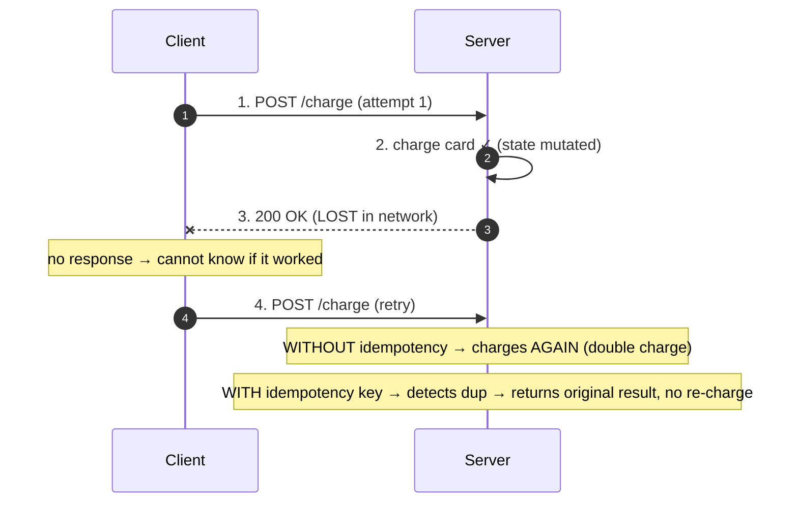
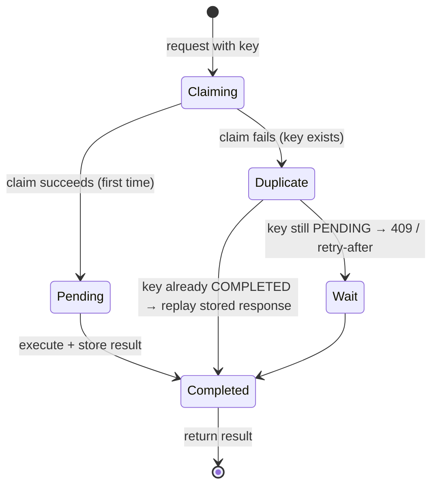
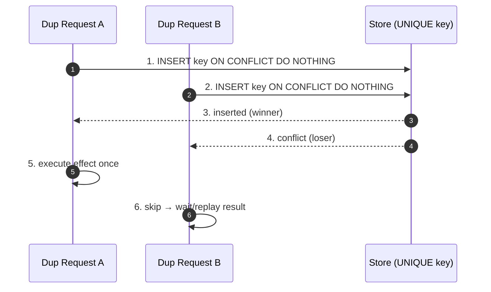
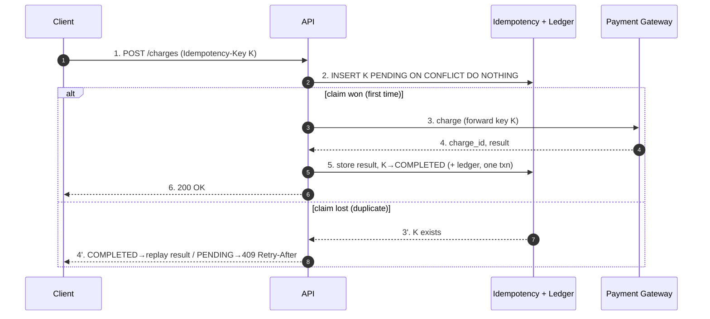

# Idempotent Operations — Interview

A focused question bank for idempotency in distributed communication: the property, why
retries force it on you, HTTP semantics, idempotency keys and dedup stores, natural
idempotency, the "effectively-once" identity, concurrency races, and an end-to-end
payment/consumer design. Answers are written to be said out loud in an interview.

## Table of Contents
1. [Q1: Define idempotency formally](#q1-define-idempotency-formally)
2. [Q2: Why does idempotency matter at all?](#q2-why-does-idempotency-matter-at-all)
3. [Q3: Which HTTP methods are idempotent, and safe?](#q3-which-http-methods-are-idempotent-and-safe)
4. [Q4: Is POST ever idempotent? How do you make it so?](#q4-is-post-ever-idempotent-how-do-you-make-it-so)
5. [Q5: How does an idempotency key + dedup store work?](#q5-how-does-an-idempotency-key--dedup-store-work)
6. [Q6: What is natural idempotency? Give examples.](#q6-what-is-natural-idempotency-give-examples)
7. [Q7: Effectively-once vs exactly-once — what is really possible?](#q7-effectively-once-vs-exactly-once--what-is-really-possible)
8. [Q8: Business idempotency vs HTTP idempotency](#q8-business-idempotency-vs-http-idempotency)
9. [Q9: How do concurrent duplicates race, and how do you make dedup atomic?](#q9-how-do-concurrent-duplicates-race-and-how-do-you-make-dedup-atomic)
10. [Q10: How do you handle the in-flight / pending case?](#q10-how-do-you-handle-the-in-flight--pending-case)
11. [Q11: TTL / dedup-window trade-offs — how long do you keep keys?](#q11-ttl--dedup-window-trade-offs--how-long-do-you-keep-keys)
12. [Q12: Who generates the key, and what should it cover?](#q12-who-generates-the-key-and-what-should-it-cover)
13. [Q13: Idempotency vs commutativity vs associativity](#q13-idempotency-vs-commutativity-vs-associativity)
14. [Q14: Design an idempotent payment endpoint](#q14-design-an-idempotent-payment-endpoint)
15. [Q15: Design an idempotent message consumer (Kafka)](#q15-design-an-idempotent-message-consumer-kafka)
16. [Q16: Rapid-fire / red flags](#q16-rapid-fire--red-flags)

---

## Q1: Define idempotency formally

> An operation `f` is **idempotent** if applying it more than once has the same effect on
> system state as applying it exactly once: `f(f(x)) = f(x)`, and more generally
> `fⁿ(x) = f(x)` for all `n ≥ 1`. The *response* may differ (a retry may see "already
> done"), but the *observable state* after the second call equals the state after the first.
>
> The distinction that trips people up: idempotency is about **state convergence**, not
> about returning the identical bytes. `SET x = 5` is idempotent (state is 5 no matter how
> many times you run it); `x = x + 5` is **not** (state grows). `DELETE /user/42` is
> idempotent (after the first call the user is gone; further calls keep it gone) even though
> the first returns `200` and the rest return `404`.

---

## Q2: Why does idempotency matter at all?

> Because in any real network you cannot achieve reliable delivery without retries, and
> retries mean duplicates. A client sends a request; the server processes it; the ACK is
> lost in the network. The client cannot tell "my request never arrived" from "my request
> arrived but the reply was lost" — this is the **two generals** reality. Its only safe move
> is to retry. So every at-least-once channel (TCP retransmit, HTTP client retry, message
> broker redelivery, at-least-once queue) will occasionally deliver the same logical
> operation twice or more.
>
> Idempotency is what makes those unavoidable duplicates **harmless**. If processing a
> message twice charges a card twice or ships two orders, the system is incorrect under
> normal, expected failure. If processing is idempotent, duplicates collapse to a single
> effect and you can retry aggressively and sleep at night.



---

## Q3: Which HTTP methods are idempotent, and safe?

> Per the HTTP semantics spec (RFC 9110 §9.2), a method is **idempotent** if the intended
> effect of multiple identical requests is the same as a single one, and **safe** if it is
> essentially read-only.

| Method | Safe | Idempotent | Note |
|--------|------|-----------|------|
| GET | ✅ | ✅ | read-only; no state change |
| HEAD | ✅ | ✅ | GET without body |
| OPTIONS | ✅ | ✅ | metadata |
| PUT | ❌ | ✅ | full replace → same final state on repeat |
| DELETE | ❌ | ✅ | resource gone after first; repeats keep it gone |
| POST | ❌ | ❌ | "process this" — may create N resources on N calls |
| PATCH | ❌ | ❌ | not guaranteed (e.g. `qty += 1`); can be made idempotent |

> Key nuances an interviewer probes: (1) *safe* implies idempotent, but not vice versa —
> PUT/DELETE mutate yet are idempotent. (2) Idempotency is a **contract**, not something the
> protocol enforces: a badly written `PUT` handler that does `count++` violates the contract.
> (3) It's about the *effect on the resource*, not the status code — DELETE returning `404`
> on the second call is still idempotent because the resource state is unchanged.

---

## Q4: Is POST ever idempotent? How do you make it so?

> By definition POST is *not* idempotent — its semantics are "the server decides how to
> process this," and the canonical case is "create a new resource each time," so two POSTs
> create two resources. But POST is exactly the method you most need to make retry-safe
> (payments, orders, sign-ups).
>
> You make POST **effectively idempotent** with an **idempotency key**: the client attaches
> a unique key (`Idempotency-Key` header) that identifies the *logical operation*. The server
> records processed keys; a retry with the same key returns the original result instead of
> re-executing. This is exactly how Stripe's payments API works. The alternative is to
> redesign the operation as a `PUT` to a client-chosen ID (`PUT /orders/{client_uuid}`),
> which gets natural idempotency for free — but that only works when the client can own the
> resource identity.

---

## Q5: How does an idempotency key + dedup store work?

> The client generates a unique key per logical operation and sends it (usually a header).
> The server keeps a **dedup store** keyed by that value and follows a claim-then-execute
> protocol:
>
> 1. **Atomically claim** the key (insert `PENDING`, or `SET NX`). If the claim fails, this
>    is a duplicate — go to step 5.
> 2. **Execute** the operation (charge, write, publish).
> 3. **Persist the result** against the key and mark it `COMPLETED`.
> 4. Return the result to the caller.
> 5. On a duplicate: if the stored state is `COMPLETED`, replay the stored response; if it's
>    still `PENDING`, the first request is in flight — wait/retry or return `409 Conflict`.
>
> The load-bearing detail is step 1: the claim must be **atomic** with respect to the
> execute+store, otherwise two concurrent duplicates both pass the "have I seen this?" check
> (see Q9). The dedup store is typically Redis (`SET NX PX`) for speed or a DB table with a
> `UNIQUE(idempotency_key)` constraint for durability — often both.



---

## Q6: What is natural idempotency? Give examples.

> **Natural (or intrinsic) idempotency** is when the operation is idempotent because of how
> it's *shaped*, so you need no separate key or dedup store. You lean on the data model to
> collapse duplicates for you.
>
> - **Upsert / SET semantics** — `INSERT ... ON CONFLICT DO UPDATE` or `PUT` with the full
>   desired state. Applying the same desired state twice yields the same row.
> - **Unique constraint** — `UNIQUE(order_ref)` in the DB. The second insert of the same
>   business key fails on the constraint; you catch it and treat it as "already done."
> - **Absorbing/idempotent updates** — `UPDATE ... SET status='shipped' WHERE id=?` (setting,
>   not incrementing); `SADD` to a set; `bitmap.set(userId)`. Re-applying changes nothing.
> - **Conditional writes / CAS** — `UPDATE ... WHERE version = expected` (optimistic
>   concurrency); the second attempt no-ops because the version already moved.
> - **Content-addressed writes** — store under `hash(content)`; the same content maps to the
>   same location, so re-writing is a no-op.
>
> Prefer natural idempotency when you can: it removes an entire moving part (the key store)
> and its TTL/eviction concerns. Reach for explicit idempotency keys only when the operation
> has no natural business identity or has external side effects (a real card charge) that a
> unique constraint alone can't guard.

---

## Q7: Effectively-once vs exactly-once — what is really possible?

> **Exactly-once *delivery* is impossible** over an unreliable network. The sender can never
> distinguish a lost message from a lost ACK, so it must either risk losing the message
> (at-most-once) or risk sending it again (at-least-once). There is no third channel-level
> option — this is the two-generals result.
>
> What you *can* achieve is **effectively-once (a.k.a. exactly-once *processing* /
> *semantics*)**:
>
> ```
> effectively-once = at-least-once delivery + idempotent processing (dedup on the receiver)
> ```
>
> You accept that the network delivers duplicates, then you make the *effect* singular on the
> consumer side using a dedup key or natural idempotency. So-called "exactly-once" features
> (Kafka transactions + idempotent producer, Flink checkpointed sinks) don't repeal physics —
> they implement this same recipe: dedup by producer sequence number and atomically commit
> offsets with output. The interview-winning framing: *don't chase exactly-once delivery;
> engineer at-least-once + idempotent processing.*

| Guarantee | What it means | Failure behavior | Requires |
|-----------|---------------|------------------|----------|
| At-most-once | deliver ≤ 1 time | may **lose** messages | fire-and-forget; ACK before process |
| At-least-once | deliver ≥ 1 time | may **duplicate** | retry until ACKed; process before commit |
| Exactly-once *delivery* | deliver == 1 | — | **impossible** over unreliable network |
| Effectively-once | effect applied once | correct | at-least-once **+** idempotent consumer |

---

## Q8: Business idempotency vs HTTP idempotency

> **HTTP idempotency** is a protocol-level property of a *method* on a *resource* over a
> single request. **Business idempotency** is about the *domain effect*: "this customer's
> order #123 is placed at most once," regardless of transport, retries, or how many services
> touch it.
>
> They diverge in practice:
>
> - A method can be HTTP-idempotent yet business-wrong: two `PUT`s with different bodies to
>   the same URL each "succeed" per HTTP, but semantically last-writer-wins may clobber a
>   legitimate concurrent change.
> - A method can be non-idempotent in HTTP (`POST /charges`) yet business-idempotent because
>   you added an idempotency key mapping to a business operation.
> - Business idempotency often spans **multiple services and a whole workflow** (order →
>   payment → fulfillment), which no single HTTP method can express. You enforce it with a
>   stable **business key** (order reference, request id) carried end-to-end and checked at
>   each side-effecting step.
>
> Rule of thumb: HTTP idempotency is necessary hygiene for retry-safe APIs; business
> idempotency is the actual correctness requirement, and it's usually enforced with a unique
> business key + dedup, not by the HTTP verb alone.

---

## Q9: How do concurrent duplicates race, and how do you make dedup atomic?

> The classic bug is a **check-then-act** (TOCTOU) race. Two duplicate requests with the same
> key arrive nearly simultaneously:
>
> ```
> Req A: SELECT key → not found   ┐ both read "not found"
> Req B: SELECT key → not found   ┘
> Req A: charge card; INSERT key
> Req B: charge card; INSERT key   → DOUBLE CHARGE
> ```
>
> The read and the write aren't atomic, so both pass the guard. Fixes, in order of preference:
>
> - **Atomic claim primitive** — `INSERT ... ON CONFLICT DO NOTHING` / rely on
>   `UNIQUE(key)`, or Redis `SET key val NX PX ttl`. Exactly one caller wins the insert; the
>   loser gets a conflict and takes the duplicate path. The DB/Redis does the mutual exclusion.
> - **Serialize on the key** — a row lock (`SELECT ... FOR UPDATE` on the key row) or a
>   distributed lock per key, so duplicates queue instead of interleave.
> - **Transactionally couple claim + effect** — put the `INSERT key` and the state change in
>   one DB transaction so either both land or neither does. If the effect is external (a real
>   charge), you can't put it in the DB transaction, so use claim-first: insert `PENDING`
>   *before* calling the payment gateway, and reconcile if you crash between.
>
> The unifying rule: **let the datastore's atomic operation be the arbiter** — never a
> read-then-write in application code.



---

## Q10: How do you handle the in-flight / pending case?

> This is the subtle part beyond "have I seen this key." When a duplicate arrives while the
> first request is still executing (status `PENDING`), you must not re-execute and must not
> return a wrong answer. Options:
>
> - **Return `409 Conflict` / `425 Too Early`** with a `Retry-After` — tell the client "your
>   operation is being processed, try again shortly." Simple and honest.
> - **Block on the lock** — the duplicate waits on the same per-key lock and, once the first
>   completes, reads and replays the stored result. Cleaner UX, but ties up a request slot.
> - **Fingerprint the request body** — store a hash of the original payload with the key. If a
>   retry arrives with the *same* key but a *different* body, that's a client bug: reject with
>   `422`. This prevents a reused key from silently returning the wrong resource.
>
> You also need a **crash-recovery / lease** story: if the process holding a `PENDING` claim
> dies, the key must not stay poisoned forever. Give `PENDING` a lease/TTL and a reconciliation
> job that checks the downstream (e.g. queries the payment gateway by the idempotency key) to
> decide whether the effect actually happened before releasing or completing the key.

---

## Q11: TTL / dedup-window trade-offs — how long do you keep keys?

> Keys can't live forever — that's an unbounded, ever-growing store. The **dedup window** is a
> classic durability-vs-cost trade-off:
>
> | Window too **short** | Window too **long** |
> |----------------------|---------------------|
> | A late retry (client backoff, offline mobile, DLQ replay) arrives after the key expired → treated as new → **duplicate effect** | Store grows large; higher memory/storage and lookup cost |
> | Cheap, small store | Retains PII/business data longer than needed |
>
> Sizing rules:
> - The window must exceed your **maximum realistic retry horizon**: client retry budget +
>   broker redelivery window + max time a message can sit in a queue/DLQ before replay. For a
>   payment API, 24h–72h is common; for a message consumer, at least the broker's retention +
>   redelivery ceiling.
> - Prefer a **bounded store**: Redis with per-key `PX` TTL, or a DB table with a TTL/partition
>   drop job. Cassandra TTL columns work well for high-volume dedup logs.
> - Trade the window against the **dedup granularity**: for exactly-once stream processing you
>   only need to dedup within the *replay window* (offset range that can be re-consumed), which
>   is often far smaller than a business-level 72h.
>
> A pragmatic answer: pick the window from the *slowest legitimate duplicate* you must absorb,
> add margin, and put a hard TTL so the store stays bounded.

---

## Q12: Who generates the key, and what should it cover?

> The **client generates** the idempotency key — because only the client knows that "this
> retry is the same logical operation as the previous attempt." If the server generated it,
> every retry would get a fresh key and dedup would be impossible. A UUIDv4 (or ULID) is
> typical; it must be globally unique and stable across retries of the *same* intent, and
> *new* for a genuinely new operation.
>
> What the key should be scoped to:
> - **Per logical operation, per actor** — scope keys to the authenticated principal so one
>   tenant can't collide with (or probe) another's keys.
> - **Bound to the request content** — store a hash of the payload alongside the key so a
>   reused key with a different body is caught (Q10), preventing a stale key from returning a
>   mismatched result.
> - For **server-to-server / event pipelines**, the key is often a **natural business
>   identity** (order id, event id, `producer_id + sequence_number`) rather than a random UUID,
>   which also gives you natural idempotency at the sink.

---

## Q13: Idempotency vs commutativity vs associativity

> Interviewers use this to test depth. These are related algebraic properties often needed
> together in distributed systems (they're the backbone of CRDTs):
>
> - **Idempotent**: `f(f(x)) = f(x)` — re-applying the *same* operation doesn't change state.
>   Defends against **duplicates**.
> - **Commutative**: `a ∘ b = b ∘ a` — order of two *different* operations doesn't matter.
>   Defends against **reordering** (messages arriving out of order).
> - **Associative**: `(a ∘ b) ∘ c = a ∘ (b ∘ c)` — grouping doesn't matter; lets you merge in
>   any batching.
>
> A merge operation that is idempotent + commutative + associative (a semilattice join) gives
> you eventual consistency regardless of duplication, reordering, or batching — which is
> exactly why **G-Set / OR-Set / LWW CRDTs** rely on all three. Idempotency alone buys you
> duplicate-safety; you often need commutativity too when the transport can also reorder.

---

## Q14: Design an idempotent payment endpoint

> **Endpoint:** `POST /v1/charges` with header `Idempotency-Key: <client-uuid>` and body
> `{ amount, currency, source, customer_id }`.
>
> **Flow:**
> 1. **Validate & fingerprint** — reject if key missing; compute `payload_hash`.
> 2. **Atomic claim** — `INSERT INTO idempotency (key, scope, payload_hash, status)
>    VALUES (?, customer_id, ?, 'PENDING') ON CONFLICT DO NOTHING`. Scope key by `customer_id`.
> 3. **If claim lost (row already exists):**
>    - `payload_hash` differs → `422` (key reuse with different body).
>    - status `COMPLETED` → **replay** the stored response (same status code + body).
>    - status `PENDING` → `409` + `Retry-After` (first attempt in flight).
> 4. **If claim won:** call the payment gateway, **passing the same idempotency key downstream**
>    so the gateway itself dedups (defense in depth). Persist the gateway result against the key
>    and flip status to `COMPLETED`, ideally in one transaction with the ledger write.
> 5. **Crash between charge and store:** a `PENDING` lease expires; a reconciler queries the
>    gateway *by the idempotency key* to learn whether the charge happened, then completes or
>    releases the record. Never re-charge blindly.
>
> **Why it's correct:** the DB `UNIQUE(key)` constraint is the atomic arbiter (Q9); the same
> key is propagated to the external system so the *whole chain* is idempotent; the ledger uses a
> unique `charge_id` for natural idempotency; the dedup window (say 72h) exceeds the client's
> retry horizon (Q11).



---

## Q15: Design an idempotent message consumer (Kafka)

> **Setup:** at-least-once delivery (consumer commits offsets *after* processing), so on
> rebalance/crash a batch can be redelivered. Goal = effectively-once processing (Q7).
>
> **Strategies (pick per side-effect):**
> - **Natural idempotency at the sink** — if the output is an upsert keyed by a business id
>   (`INSERT ... ON CONFLICT DO UPDATE` on `event_id`), duplicates just re-write the same row.
>   This is the cheapest and most robust; prefer it.
> - **Dedup table** — maintain `processed(event_id PRIMARY KEY, ...)`. Wrap "insert into
>   processed" and "apply the effect" in **one DB transaction**; if the insert conflicts, the
>   event was already handled → skip. The transaction couples the dedup marker to the effect so
>   you can't mark-then-crash-before-effect or vice versa.
> - **Kafka transactions / EOS** — idempotent producer (`enable.idempotence=true`) dedups by
>   `producer_id + sequence` on the broker; transactional `sendOffsetsToTransaction` atomically
>   commits *output records + consumer offsets*. This is the same at-least-once + dedup recipe,
>   just built into the platform, and only works within Kafka (read-process-write to Kafka).
>
> **Key details:** use a **stable event id** carried in the message (or `topic-partition-offset`
> as a last resort); bound the dedup table with a TTL matching the retention/replay window
> (Q11); make handlers side-effect-idempotent for external calls (forward an idempotency key to
> downstream services). The interview trap to avoid: committing the offset *before* processing
> (that's at-most-once and drops messages on crash) — always process, then commit.

```mermaid
sequenceDiagram
    autonumber
    participant K as Kafka
    participant Cons as Consumer
    participant DB as DB (processed + effect, 1 txn)
    K-->>Cons: 1. deliver event (event_id E) [maybe again]
    Cons->>DB: 2. BEGIN; INSERT E INTO processed
    alt E new
        DB-->>Cons: 3. inserted
        Cons->>DB: 4. apply effect; COMMIT
    else E seen before
        DB-->>Cons: 3'. conflict → ROLLBACK, skip effect
    end
    Cons->>K: 5. commit offset (only after processing)
```

---

## Q16: Rapid-fire / red flags

> - **"We'll use exactly-once delivery."** Red flag — it doesn't exist over an unreliable
>   network. Say effectively-once = at-least-once + idempotent processing.
> - **"POST is idempotent."** No — POST is neither safe nor idempotent by default; you add an
>   idempotency key.
> - **"We check if the key exists, then insert it."** Read-then-write TOCTOU race → double
>   effect under concurrency. Use an atomic claim (`SET NX` / `UNIQUE`).
> - **"Server generates the idempotency key."** Then retries get new keys and dedup can't
>   work — the client must own the key.
> - **"Idempotency = returning the same response."** No — it's the same *state*; the response
>   for a duplicate can legitimately differ (`409`, replayed result).
> - **"Keys live forever."** Unbounded store; set a TTL sized to the max retry/replay window.
> - **"Commit the Kafka offset first for speed."** That's at-most-once; you'll drop messages
>   on crash. Process, then commit.
> - **DELETE returning 404 on the second call means it's not idempotent.** Wrong — state is
>   unchanged; idempotency is about effect, not status code.

*Next step:* [Microservices — Junior](../../10-application-layer/01-microservices/junior.md)
