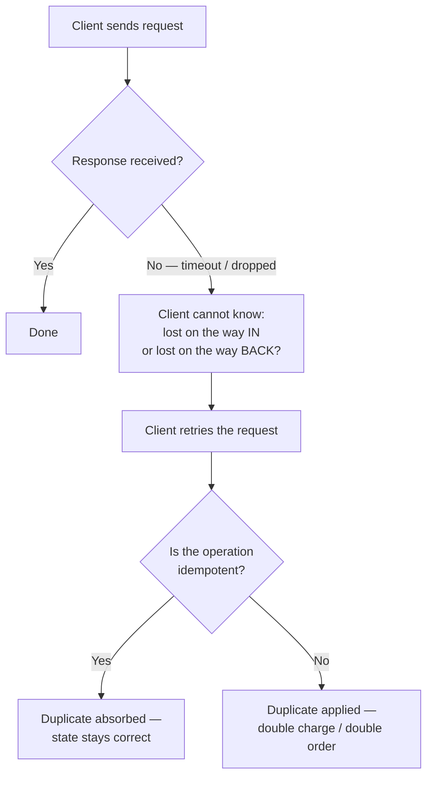
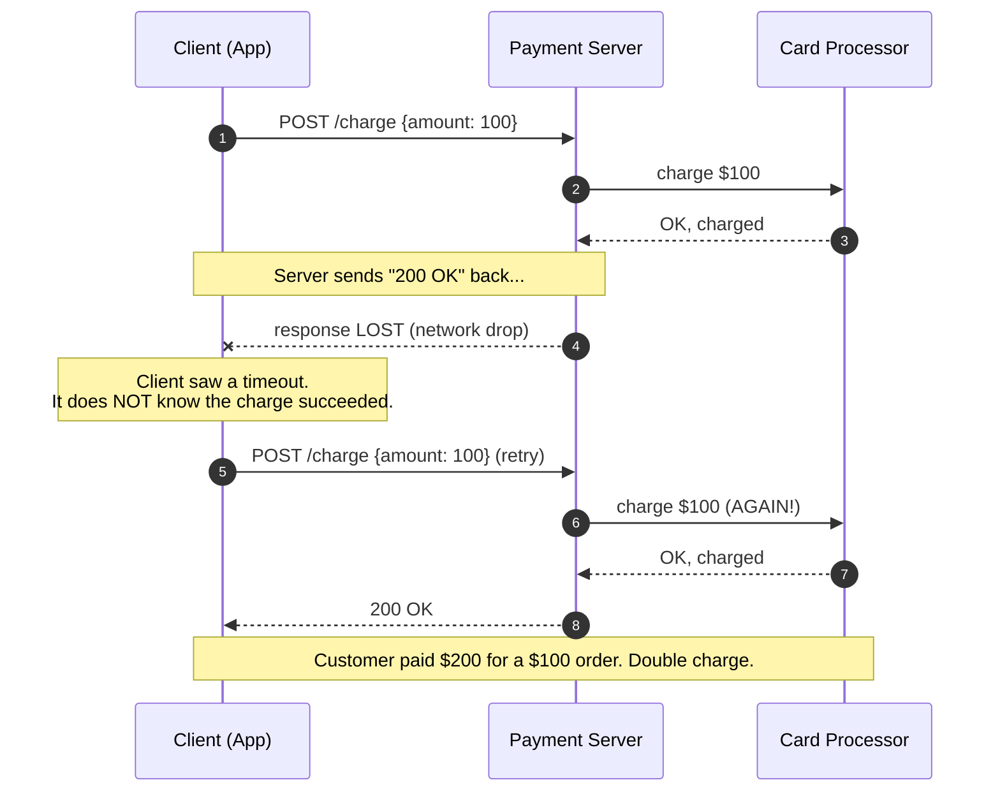
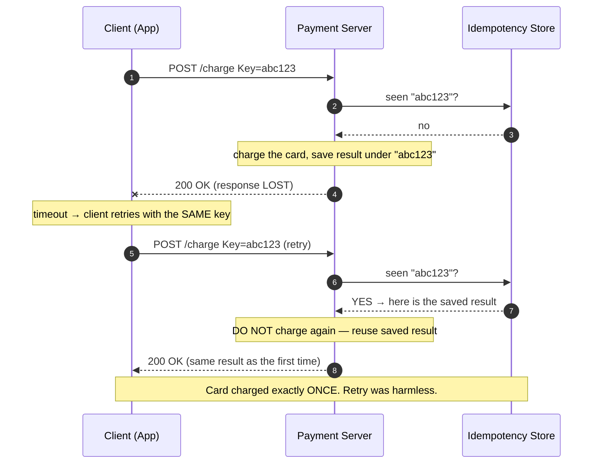

# Idempotent Operations — Junior

<!-- level-focus -->
At junior level, focus on this question:

> How can I apply **Idempotent Operations** in one small example and prove the result?

Use the smallest realistic scenario that exposes the decision and its failure behavior.
---

## 1. The One-Sentence Definition

An operation is **idempotent** if applying it any number of times (once, twice, a
hundred times) leaves the system in the same final state as applying it exactly once.

The word comes from mathematics: a function `f` is idempotent when `f(f(x)) = f(x)`.
Rounding a number is idempotent — round it, then round the result, and nothing new
happens. Taking the absolute value is idempotent: `abs(abs(x)) = abs(x)`.

Translated to systems, "applying the operation again does not change anything the
first application already did." A few everyday examples make the shape clear:

```text
Idempotent (repeat is harmless):
  "Set the account's email to alice@example.com."      → after 1x or 5x, email is the same value
  "Delete order #42."                                  → after 1x it's gone; deleting a gone order is a no-op
  "Set the light switch to OFF."                       → OFF is OFF, however many times you flip it

NOT idempotent (repeat changes the outcome):
  "Add $100 to the balance."                           → 1x = +100, 3x = +300. Different!
  "Charge the customer's card $100."                   → 1x = one charge, 3x = three charges
  "Append a row to the log."                           → each call adds another row
```

The key word is **effect**, not *response*. An idempotent operation may return a
different message the second time ("already deleted") — what must not change is the
*state of the world*.

---

## 2. Why This Matters: Networks Force Retries

Here is the chain of reasoning that makes idempotency one of the most important
ideas in backend engineering. Follow it step by step:

1. **Networks are unreliable.** Packets get dropped, connections time out, a server
   restarts mid-request, a load balancer kills a slow connection. This is normal, not
   exotic — it happens millions of times a day at any real service.
2. **When a request fails, the client cannot tell *how* it failed.** Did the request
   never arrive? Or did it arrive, get processed, and only the *response* got lost on
   the way back? From the client's point of view, both look identical: "I sent it and
   heard nothing."
3. **A robust client retries.** The only sane response to "I heard nothing" is to send
   the request again. Retrying is not a bug or a workaround — it is the *correct*
   behavior. Every serious HTTP library, message queue, and mobile app retries.
4. **Therefore the server WILL receive some requests more than once.** Not maybe.
   Will. This is called **at-least-once delivery**, and it is the default reality of
   distributed systems. Getting *exactly-once* is famously hard.
5. **So the question becomes:** when a duplicate arrives, does it cause harm?
   - If the operation is idempotent → the duplicate is absorbed harmlessly.
   - If it is not → you get a double charge, a double order, a double email.

That is the whole point. Idempotency is what makes retries *safe*, and retries are
what make a system *reliable* on top of an unreliable network. You cannot remove the
retries; you can only make sure they do no damage.



---

## 3. The Lost-Response Problem (Worked Example)

Let's make the danger concrete with the classic case: a payment. The customer clicks
"Pay $100." The request reaches the server, the server charges the card successfully —
and then the *response* is lost on the way back (the customer's phone dropped off
Wi-Fi at that exact moment).

The customer's app sees a timeout, assumes the payment failed, and retries.



The server did nothing "wrong" in the naive sense — it faithfully processed both
requests it received. The bug is in the *design*: a non-idempotent operation was
exposed to a network that guarantees duplicates. The customer is now out $100 and
your support queue has a very unhappy ticket.

Notice the crucial detail at step 5: the retry is **indistinguishable** from a
brand-new, legitimate second purchase. The server has no way, from the request alone,
to tell "this is the same payment I already made" from "the customer genuinely wants
to pay again." That ambiguity is exactly what an idempotency key resolves (Section 5).

---

## 4. GET vs POST: The Retry That Was Safe All Along

Now contrast that disaster with a request that is *safe* to retry as many times as
you like: reading data.

Suppose the same network glitch hits a **GET** request — "fetch order #42":

```text
GET /orders/42          → returns the order
GET /orders/42          → returns the SAME order
GET /orders/42          → still the same order
```

Retrying a `GET` a thousand times changes nothing on the server. Reading data is
naturally idempotent: it observes state, it does not mutate it. This is why your
browser silently retries failed page loads and nobody worries — a page load is a read.

The difference between the payment and the read is the difference between **write** and
**read**, and more precisely, between an operation whose effect *accumulates* and one
whose effect *does not*:

| Aspect | `GET /orders/42` (read) | `POST /charge` (naive write) |
|--------|-------------------------|------------------------------|
| Changes server state? | No | Yes |
| Effect of 1 call | Returns the order | Charges $100 |
| Effect of 3 calls | Returns the order (3×) | Charges $300 |
| Safe to retry blindly? | **Yes** | **No** |
| Idempotent? | Yes | No |

The lesson is not "avoid writes" — you obviously must charge cards and create orders.
The lesson is: **writes are where retries become dangerous, so writes are where you
must deliberately design in idempotency.** Reads mostly take care of themselves.

---

## 5. The Fix in One Idea: The Idempotency Key

How do you make "charge the card" safe to retry? You give each *logical operation* a
unique name, decided by the **client**, and send it along with the request. The server
then promises: "For any given key, I will do the work at most once. If I see that key
again, I return the result I already computed — I do not repeat the work."

That unique name is called an **idempotency key** (often a random UUID).

```text
POST /charge
Idempotency-Key: 7f8a9b12-4c3d-4e5f-8d2e-1a2b3c4d5e6f
Body: { "amount": 100, "currency": "USD" }
```

The server logic becomes:

```text
1. Read the Idempotency-Key from the request.
2. Look it up in a store (a database table, Redis, etc.):
     - SEEN before?  → return the SAVED result. Do NOT charge again.
     - NEW?          → do the charge, save (key → result), then return it.
3. Return the result.
```

Now replay the disaster from Section 3, but with a key attached:



The two magic properties that make this work:

- **The client generates the key**, once, and reuses it across retries of the *same*
  logical action. A genuinely new purchase gets a genuinely new key. This is what lets
  the server tell "retry of the old thing" apart from "a brand-new thing."
- **The server remembers keys** it has processed. The store turns a naturally
  non-idempotent operation ("charge") into an idempotent *endpoint* ("charge under
  this key").

You don't need to implement this yet — just hold the mental model. Real payment APIs
like Stripe are built exactly this way, and the middle-level material builds on it.

---

## 6. Idempotent vs Non-Idempotent: A Reference Table

A gallery of operations, sorted by whether repeating them is harmless. Train your eye
to classify any operation on sight — it is the single most useful reflex here.

| Operation | Idempotent? | Why |
|-----------|-------------|-----|
| Read a record (`GET`) | Yes | Observes state; changes nothing |
| Set a field to a fixed value (`x = 5`) | Yes | The value is 5 no matter how many times you set it |
| Delete a specific record by ID | Yes | Gone after the first call; later calls are no-ops |
| Set a user's status to "active" | Yes | Assigning the same value repeatedly is a no-op |
| Add a value (`balance += 100`) | **No** | Each call accumulates; total keeps growing |
| Charge a card / create a payment | **No** | Each call is a separate charge |
| Create a new order (no dedup key) | **No** | Each call creates a distinct order |
| Append to a list / log | **No** | Each call adds another entry |
| Send an email / SMS | **No** | Each call sends another message |
| `POST` with an idempotency key | **Yes** | The key lets the server dedupe repeats |

The pattern to internalize: operations that **set an absolute value** or **remove a
named thing** tend to be idempotent; operations that **accumulate, append, or emit a
side effect** tend not to be — until you wrap them with a key.

---

## 7. HTTP Methods and Their Idempotency Contract

HTTP defines an *intended* idempotency contract for each method. This is a
specification (RFC 9110, "HTTP Semantics") telling clients which methods they may
safely retry. Servers are expected to honor these contracts.

| Method | Idempotent (by spec)? | Typical use | Retry-safe? |
|--------|------------------------|-------------|-------------|
| `GET` | Yes | Read a resource | Yes |
| `HEAD` | Yes | Read headers only | Yes |
| `PUT` | Yes | Replace a resource with a full new value | Yes |
| `DELETE` | Yes | Remove a resource | Yes |
| `POST` | **No** | Create / trigger an action | **No** (unless you add an idempotency key) |
| `PATCH` | **No** (not guaranteed) | Partially modify a resource | Depends on the patch |

Two subtle points worth carrying with you:

- **`PUT` is idempotent because it replaces with an absolute value.** "Set order #42's
  status to `shipped`" leaves the same result whether sent once or five times. Compare
  with `POST /orders` ("create a new order"), which makes a new order every call.
- **`PATCH` "increment quantity by 1" is NOT idempotent**, while `PATCH` "set quantity
  to 3" *is*. So `PATCH` depends on what the patch says — which is exactly why the spec
  refuses to guarantee it. When in doubt, treat `PATCH` as non-idempotent.

The everyday takeaway: **`GET`/`PUT`/`DELETE` can be retried by default; `POST` needs
an idempotency key before you dare retry it.**

---

## 8. Common Confusions to Avoid

1. **"Idempotent" is not "returns the same response."** It means "has the same
   *effect* on state." Deleting order #42 twice may return `200 OK` then `404 Not
   Found` — different responses, but the *effect* (order gone) is identical. Still
   idempotent.
2. **Idempotent is not the same as "safe" / read-only.** A `GET` is both safe and
   idempotent. But `DELETE` is idempotent *and* it changes state — it is not "safe."
   Idempotency is specifically about repetition, not about avoiding change.
3. **Idempotent is not "commutative."** Order can still matter. `PUT status=shipped`
   then `PUT status=cancelled` gives a different result than the reverse. Each *is*
   idempotent on its own; that doesn't make their sequence order-independent.
4. **You cannot skip idempotency by "just retrying carefully."** There is no client
   trick that tells a lost request from a lost response. The ambiguity is fundamental;
   the server-side key is the only real fix.
5. **Not every write needs a key — but every retried non-idempotent write does.** If an
   operation genuinely can be repeated with no harm (setting a value), it already is
   idempotent and needs nothing extra.

---

## 9. Hands-On Exercise

Take a simple online store and classify every operation without running any code —
just reason about "what happens if this request is delivered twice?"

**Given these endpoints, mark each idempotent or not, and say why:**

```text
1. GET  /products/99                      → view a product
2. PUT  /cart/items/99  {qty: 2}          → set item 99's quantity to 2
3. POST /cart/items     {product: 99}     → add item 99 to the cart
4. POST /checkout       {amount: 4999}    → charge the card and place the order
5. DELETE /cart/items/99                  → remove item 99 from the cart
6. PATCH /cart/items/99 {qty_delta: +1}   → increase item 99's quantity by 1
```

**Then answer:**

- Which two operations are the *most dangerous* to retry, and what goes wrong on a
  duplicate? (Hint: look for accumulation and side effects.)
- For the dangerous ones, describe in one sentence how an idempotency key fixes them.
- Which operations are already safe to retry with no extra work, and why?

**Expected reasoning:** 1 is a read (idempotent). 2 and 5 set/remove absolute state
(idempotent). 3, 4, and 6 accumulate or trigger a side effect (not idempotent) — #4 is
the worst because a duplicate double-charges a real customer, and #3/#6 quietly inflate
the cart. Wrapping #3 and #4 with a client-generated idempotency key makes the server
dedupe retries, so the card is charged and the item added *exactly once*.

If you can do this classification on sight, you have the junior mental model. The
middle level shows how to actually build the dedup store, choose good keys, set their
expiry, and handle the race where two retries arrive at the same instant.

*Next step:* [Idempotent Operations — Middle](middle.md)

---

## Apply it

1. Choose one small, known input for **Idempotent Operations**.
2. Predict the output or observable behavior.
3. Run the smallest example or probe that exercises the concept.
4. Change one input to trigger a failure or boundary case.
5. Explain the evidence using the guide's vocabulary.

## Verify your work

- Record the exact input, command or code path, and output.
- Repeat the probe and confirm the result is consistent.
- Show one expected success and one expected failure.
- Resolve any difference between the prediction and the evidence.

## Review questions

- What problem does Idempotent Operations solve in the example?
- Which input changes the observed result, and why?
- What is the smallest useful success check?
- Which beginner mistake would your evidence catch?
