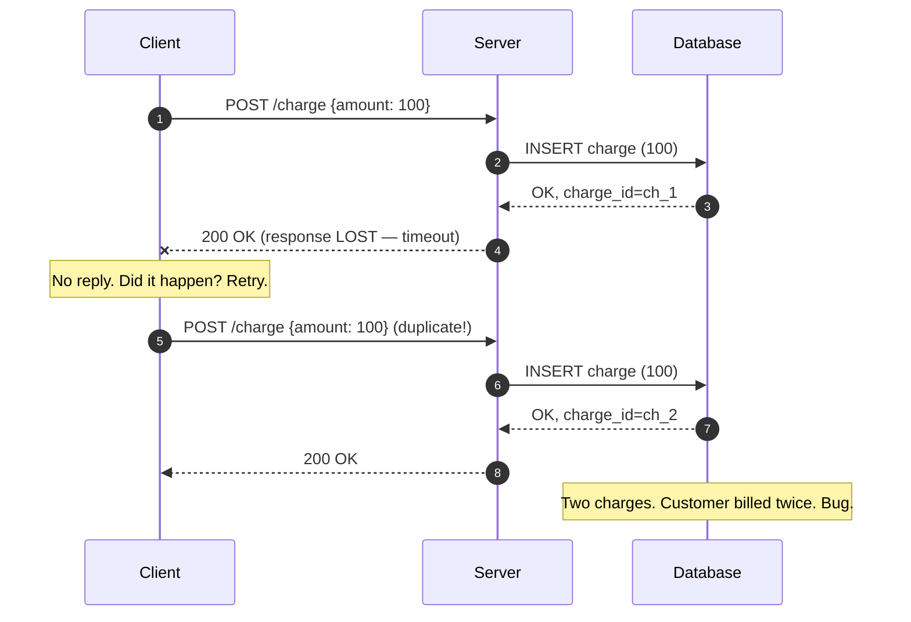
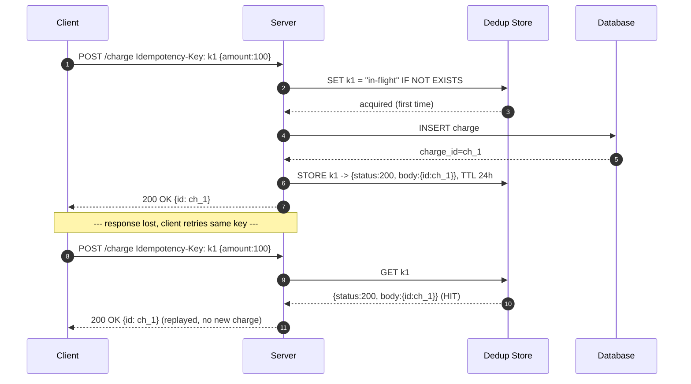
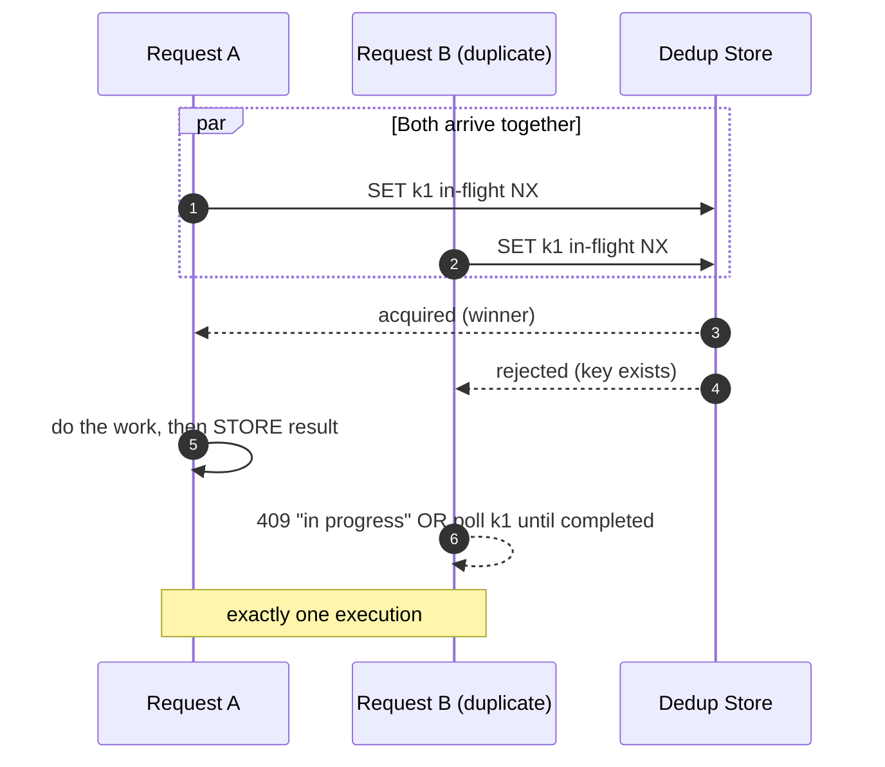

# Idempotent Operations — Middle

<!-- level-focus -->
At middle level, focus on this question:

> Where does **Idempotent Operations** belong in a maintainable component, and which trade-off selects the design?

Use the smallest realistic scenario that exposes the decision and its failure behavior.
## 2. Why Retries Make Idempotency Non-Optional

Consider the single most dangerous sequence in distributed systems: the client sends a
write, the server processes it successfully, and then the response is lost — the socket
resets, the load balancer times out, the mobile client changes networks. The client
has no way to distinguish "the server never saw it" from "the server did the work but I
lost the reply." Its only safe move is to **retry**.



Without idempotency, the retry produces a **second, independent effect**: a double
charge, a duplicate order, two "welcome" emails. The failure is not the retry — retries
are correct and unavoidable. The failure is that the endpoint treated the retry as a
fresh intent. Idempotency closes exactly this gap: it lets the server recognize "I have
seen this exact intent before" and return the *original* result instead of doing the
work again.

The scope of the problem is wide. It appears in:

- **HTTP APIs** behind proxies and load balancers that retry on 5xx or timeout.
- **Message consumers** reading from Kafka/SQS with at-least-once delivery.
- **Client SDKs** with built-in retry-with-backoff (which most modern SDKs have).
- **Webhook receivers**, where the *sender* retries until it gets a 2xx.

Everywhere a message can be delivered twice, the receiver must be idempotent — or must
be able to *make itself* idempotent — or it is buggy.

---

## 3. The Idempotency-Key Protocol, End to End

The core mechanism is a contract between client and server:

1. The **client generates a unique key** for a logical operation (typically a UUID v4)
   and attaches it — canonically in a header, e.g. `Idempotency-Key: <uuid>`.
2. The client **reuses the same key for every retry** of that same operation, and uses
   a **fresh key** for a genuinely new operation.
3. The **server** treats the key as the identity of the intent: first time it sees a
   key it does the work and stores the result under that key; every subsequent time it
   sees the key it returns the stored result *without* re-executing.

The client owning the key is essential. Only the client knows whether "another charge
for $100" is a retry of the previous one or a legitimately new second charge. The
server cannot infer this from the payload alone — two identical bodies can be two
distinct intents.



The replay path never touches the database's write logic. The stored response is
returned byte-for-byte (or close to it — see §10 on what to store). The customer is
charged exactly once no matter how many times the client retries.

---

## 4. The Dedup Store: Key → Result, with TTL

The heart of the pattern is a store mapping **idempotency key → recorded outcome**. Its
job is to answer, atomically, "have I processed this key, and if so, what did I return?"

**What each record holds:**

| Field | Purpose |
|-------|---------|
| `key` | The client-supplied idempotency key (primary key / unique index). |
| `status` | `in-flight` while processing, `completed` once the result is stored. |
| `response_code` | The HTTP status (or RPC status) to replay. |
| `response_body` | The serialized response to replay. |
| `request_fingerprint` | Hash of the request body, to detect key reuse with a *different* payload (§9). |
| `resource_id` | Optional: the ID of the entity created, for correlation. |
| `created_at` / `expires_at` | For TTL-based cleanup. |

**Why a TTL.** Idempotency keys are not kept forever. A key is only useful for the
window during which a client might retry — after that the record is dead weight. A TTL
of **24 hours is the common default** (Stripe uses 24 hours); it comfortably exceeds any
realistic retry horizon while bounding storage growth. After expiry, the same key would
be treated as new, but by then no legitimate retry is in flight.

**Storage choices:**

- **Redis** — natural fit for the fast path. `SET key value EX 86400 NX` gives you
  atomic first-writer-wins and TTL in one command. Downside: it is a cache; if you need
  the dedup record to be as durable as the money it guards, back it with the primary
  database or accept the (small) risk.
- **The primary relational database** — a dedicated `idempotency_keys` table with a
  unique index on `key`. Durable and transactional; you can store the key insert *in the
  same transaction* as the business write, which is the strongest guarantee. Downside:
  more load on the primary; you must run a cleanup job (or partition by day) to enforce
  the TTL, since SQL has no native row TTL.
- **A hybrid** — Redis as a fast admission gate for the common case, the database's
  unique constraint as the ground-truth backstop. This is what most production payment
  systems converge on.

The store must support one atomic operation above all: **"insert this key if it does not
already exist, and tell me which case happened."** That single atomic step is what
prevents the concurrency bugs in §8.

---

## 5. Designing Idempotent Endpoints

There are two families of idempotency, and good API design reaches for the first before
the second:

**(a) Semantically idempotent by construction.** The operation's meaning is
"set state to X," so repeating it changes nothing after the first time.

- `PUT /users/42 {name:"Ada"}` — full replacement. Applying it twice leaves the user in
  the identical state. Naturally idempotent.
- `DELETE /users/42` — after the first delete the user is gone; a second delete finds
  nothing to do. Idempotent in *effect* (the state "user 42 does not exist" is stable),
  even if the second call returns `404`.
- Counter *set*: `set balance = 100` is idempotent; counter *increment*:
  `balance += 100` is **not** — that is the trap.

**(b) Idempotent via an explicit key.** The operation is inherently a "do something new"
— create a charge, place an order, send a message — so there is no natural way to
recognize a repeat from the payload. Here you *engineer* idempotency with the key
protocol from §3. `POST /charges` with an `Idempotency-Key` header is the canonical
example.

**The design rule:** model state-changing writes as "set to a desired state" (PUT-like,
naturally idempotent) whenever the domain allows; when the operation is genuinely a
non-idempotent "create/append/increment," add an idempotency key. Never leave a
money-moving or resource-creating `POST` without one.

A subtle point: idempotency is about **observable effects**, not internal bookkeeping.
A replayed request may legitimately increment a "duplicate requests seen" metric or
write an audit log line — that is fine, because it does not change the *result the
client observes* or the *business state*. What must be identical is the response and the
domain state (one charge, one order).

---

## 6. Natural Idempotency: Unique Constraints and Upserts

Often the cleanest idempotency mechanism is not a separate dedup store at all — it is a
**unique constraint in the database on a business-meaningful key**, so the database
itself refuses the duplicate.

If every order carries a client-generated `client_order_id`, put a unique index on it:

```sql
CREATE UNIQUE INDEX uq_orders_client_id ON orders (client_order_id);

-- First request: succeeds
INSERT INTO orders (client_order_id, amount) VALUES ('ord_abc', 100);

-- Duplicate request with same client_order_id:
INSERT INTO orders (client_order_id, amount) VALUES ('ord_abc', 100)
ON CONFLICT (client_order_id) DO NOTHING
RETURNING id;
```

On the retry, `ON CONFLICT DO NOTHING` makes the second insert a no-op; a follow-up
`SELECT` by `client_order_id` returns the *original* row, which you serialize back to
the client. The database's unique index is the deduplication — atomic, durable, and free
of race conditions because uniqueness is enforced by the storage engine.

**Upsert** (`INSERT ... ON CONFLICT DO UPDATE`) gives you PUT-like idempotency for
"create or replace" semantics:

```sql
INSERT INTO user_settings (user_id, theme) VALUES (42, 'dark')
ON CONFLICT (user_id) DO UPDATE SET theme = EXCLUDED.theme;
```

Running this twice leaves the row identical — naturally idempotent, no key needed.

**When to prefer this over an idempotency-key store:** when there is a natural business
identifier you can index (order id, invoice number, message id), the unique-constraint
approach is simpler and stronger — the guarantee lives in the same transaction as the
data. The explicit idempotency-key store shines when the operation touches *multiple*
resources or external systems, where a single unique constraint cannot express "this
whole operation ran once."

---

## 7. HTTP Method Idempotency Semantics

HTTP method semantics (RFC 9110, §9.2.2) classify methods by whether repeating a request
is *supposed* to be safe or idempotent. This is a **contract the method advertises to
intermediaries** (proxies, caches, retrying clients) — it tells them "it is acceptable to
replay this request." It does **not** magically make your handler idempotent; you still
have to honor the contract.

| Method | Safe? | Idempotent (per spec)? | Meaning / typical use | Notes |
|--------|:-----:|:----------------------:|-----------------------|-------|
| `GET` | Yes | Yes | Read a resource | No side effects expected; freely retriable/cacheable |
| `HEAD` | Yes | Yes | Read headers only | Like GET without a body |
| `OPTIONS` | Yes | Yes | Describe capabilities | No effect |
| `PUT` | No | Yes | Replace resource at a known URI | Repeating sets the same state |
| `DELETE` | No | Yes | Remove a resource | Repeating leaves it absent (2nd call may 404) |
| `POST` | No | **No** | Create / process; server chooses URI | Retries can duplicate — add an idempotency key |
| `PATCH` | No | **No** (not guaranteed) | Partial modification | Idempotent only if the patch is absolute, not relative |

Key readings:

- **Safe** implies **idempotent** (a read with no effect trivially repeats safely), but
  not the reverse: `PUT` and `DELETE` are idempotent but not safe (they change state).
- **`POST` is deliberately non-idempotent** because it means "process this / create
  something new," and the server assigns the identity. This is *exactly* why the
  idempotency-key pattern exists: it retrofits idempotency onto `POST`.
- **`PATCH` is a trap.** `PATCH {balance: 100}` (set) is idempotent; `PATCH {balance: {increment: 100}}`
  (relative) is not. The method does not tell you which — the payload does.

Because middleboxes may automatically retry idempotent methods, do **not** implement a
non-idempotent effect behind `GET`, `PUT`, or `DELETE`. A `GET` that mutates state
(e.g., "GET /increment") violates the contract and will be double-executed by any
retrying proxy or prefetcher.

---

## 8. Handling Concurrent Duplicate Requests

The nastiest case is not the *sequential* retry (first request finishes, then the retry
arrives — easily caught by a `GET` on the key). It is the **concurrent** case: two copies
of the request arrive so close together that the second one starts *before* the first has
recorded its result. A naive "check then act" has a race:

```
Request A: GET key -> miss
Request B: GET key -> miss   (A hasn't written yet)
Request A: do the work (charge!)
Request B: do the work (charge again!)   -- both saw a miss
```

The fix is to make the "claim the key" step **atomic** and let exactly one requester win.

**Approach 1 — atomic insert / SET NX (first-writer-wins).**
Replace "check then act" with a single atomic operation that both inserts the key *and*
tells you whether you were first:

- Redis: `SET key "in-flight" EX 86400 NX` — returns success only to the first caller.
- SQL: `INSERT INTO idempotency_keys (key, status) VALUES (?, 'in-flight')` guarded by a
  unique index — the second insert throws a uniqueness violation.

The winner proceeds to do the work; the loser now knows a request with this key is
already in flight.

**Approach 2 — what the loser does.**
The concurrent loser cannot just return — the first request may not have finished, so
there is no stored result yet. Two reasonable strategies:

- **Return `409 Conflict`** with a "request already in progress" body, letting the client
  back off and retry (at which point it will hit the completed result). Simple; Stripe
  returns a similar `409` for a key that is still being processed.
- **Wait-and-poll**: block briefly, re-read the key until it flips from `in-flight` to
  `completed`, then return the stored result. Better client experience, more server
  complexity, and you must bound the wait to avoid holding connections.



**Approach 3 — lean on the database's unique constraint.** If you use the natural-key
approach from §6, the concurrent second `INSERT` simply fails the unique constraint
inside its transaction and rolls back — the storage engine serializes the two writers for
you. This is often the least code and the strongest guarantee.

The unifying principle: **never gate a duplicate check on a non-atomic read-then-write.**
Push the mutual exclusion down to an atomic primitive — `SET NX`, a unique index, or a
row lock — so that exactly one of the racing requests can win the claim.

---

## 9. Request Fingerprinting and Key Reuse Errors

A robust idempotent endpoint defends against a client *misusing* keys: reusing the same
idempotency key for a **different** request body. Consider a client bug that sends
`Idempotency-Key: k1` for a $100 charge, then reuses `k1` for a $500 charge. If you blindly
replay, the $500 charge silently returns the $100 result — a confusing, dangerous outcome.

The guard is a **request fingerprint**: when you first store a key, also store a hash of
the canonicalized request (method, path, and body). On replay, recompute the fingerprint
and compare:

- **Same key, same fingerprint** → legitimate retry → replay the stored result.
- **Same key, different fingerprint** → key reuse error → reject with `422 Unprocessable
  Entity` (Stripe's behavior) or `400`, with a body explaining the key was already used
  for a different request. Do **not** silently execute or silently replay.

This turns a subtle client bug into a loud, debuggable error instead of a silent money
mismatch. Canonicalize carefully — sort JSON keys, normalize whitespace — so that a
byte-different-but-semantically-identical retry (e.g., re-serialized JSON) is not falsely
flagged as reuse.

---

## 10. A Complete Worked Example: A Payments Endpoint

Putting it all together — a Stripe-style idempotent `POST /charges`:

**Client side:**

```
POST /v1/charges
Idempotency-Key: 5f2b8a1c-9d4e-4f6a-b3c1-7e8d9a0b1c2d
Content-Type: application/json

{ "amount": 2000, "currency": "usd", "customer": "cus_123" }
```

The client generates the UUID once, stores it with the pending operation, and resends the
identical header + body on every retry until it gets a definitive response.

**Server handler (pseudocode):**

```text
handle POST /charges(key = header["Idempotency-Key"], body):
  if key is missing: return 400  # require a key for money-moving writes
  fingerprint = hash(canonical(method, path, body))

  # 1. Atomically claim the key (first-writer-wins)
  claimed = store.insert_if_absent(key, status="in-flight", fingerprint=fingerprint)
  if not claimed:
      record = store.get(key)
      if record.fingerprint != fingerprint:
          return 422  # key reused with a different request
      if record.status == "completed":
          return record.response_code, record.response_body   # replay
      else:
          return 409  # a concurrent request with this key is still in flight

  # 2. We are the sole executor — do the real work in a transaction
  try:
      charge = charge_processor.create(body)          # external effect, exactly once
      response = (200, { "id": charge.id, "status": "succeeded" })
      store.complete(key, response)                    # persist result under the key
      return response
  except Error as e:
      store.mark_failed_or_release(key)                # so the client can safely retry
      raise
```

**Notes that separate a correct implementation from a broken one:**

- **What you store as the result** should be the *final* client-facing response, so a
  replay is indistinguishable from the original. Store the status code and the body.
- **Failures need a policy.** If the operation *failed* (e.g., card declined), you often
  *do* want to store and replay that deterministic result — a retry should not re-run a
  declined card and get a different answer. But if it failed *transiently* (DB timeout,
  the external call's outcome is unknown), you must release/expire the key so the client's
  retry can genuinely re-attempt. This "did the external effect actually happen?"
  ambiguity is the hardest part; the senior tier goes deeper.
- **The external effect must be inside the guarded region.** The whole point is that
  `charge_processor.create` runs at most once per key. If you can, make the downstream
  itself idempotent too (pass the same key through) so even a mid-flight crash is safe.

---

## 11. Comparison of Idempotency Approaches

| Approach | How duplicate is caught | Durability | Best for | Watch out for |
|----------|-------------------------|------------|----------|---------------|
| **Idempotency-key + dedup store** | Client key looked up in store | Depends on store (Redis vs DB) | `POST` create/charge across multiple resources or external calls | The "did the effect happen?" window on crash; needs fingerprint check |
| **Unique constraint / `ON CONFLICT`** | DB rejects duplicate business key | Fully durable, transactional | Creates with a natural client-supplied id | Only guards a single-table effect; needs a follow-up SELECT to return original |
| **Upsert (`INSERT ... DO UPDATE`)** | Second write overwrites to same state | Fully durable | "Create or replace" (PUT-like) | Only idempotent if the update is absolute, not additive |
| **Naturally idempotent `PUT`/set** | Repeated write sets identical state | N/A (stateless of retries) | Setting a known resource to a known value | Any *relative* update (increment/append) breaks it |
| **Consumer-side dedup (message id)** | Processed-id set checked before applying | Depends on store | At-least-once queues (Kafka/SQS) | The check-then-apply race; make apply atomic |

Rule of thumb: reach for a **unique constraint** when a natural business key exists;
reach for an **explicit idempotency key + dedup store** when the operation spans multiple
resources or external systems; prefer **naturally idempotent `PUT`/upsert** whenever the
domain lets you model the write as "set to a desired state."

---

## 12. Middle Checklist

- [ ] Every money-moving or resource-creating `POST` requires a client-supplied
      `Idempotency-Key` (reject with `400` if missing).
- [ ] The dedup store's "claim the key" step is **atomic** (`SET NX` / unique index),
      never a non-atomic check-then-act.
- [ ] The stored record holds the final response (code + body) so a replay is
      indistinguishable from the original call.
- [ ] Dedup records carry a **TTL** (24h is a sane default) with a cleanup path.
- [ ] A **request fingerprint** is stored and compared, so key reuse with a different
      body is rejected (`422`), not silently replayed.
- [ ] Concurrent duplicates have a defined loser behavior (`409` or bounded wait-and-poll).
- [ ] Naturally idempotent operations are modeled as `PUT`/upsert; no relative
      increment hides behind an "idempotent" method.
- [ ] `GET`/`PUT`/`DELETE` handlers have **no** non-idempotent side effects, since
      intermediaries may auto-retry them.

*Next step:* [Idempotent Operations — Senior](senior.md)

---

## Apply it

1. Find a real component where **Idempotent Operations** affects an interface or dependency.
2. Write two plausible choices and the constraint that favors each one.
3. Make the smallest reversible change at that boundary.
4. Exercise the component alone, then exercise the integrated flow.
5. Keep the decision note with the evidence that selected the option.

## Verify your work

- A focused check proves the local behavior.
- An integrated check proves callers and dependencies still agree.
- Logs, traces, compiler output, or benchmarks expose the boundary.
- Reverting the change restores the previous behavior without unrelated edits.

## Review questions

- Which boundary is most affected by Idempotent Operations?
- What constraint would make you choose the alternative design?
- How would you isolate a local defect from an integration defect?
- What evidence shows that the change remains maintainable?
