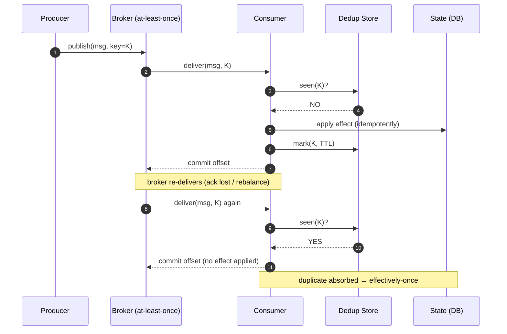
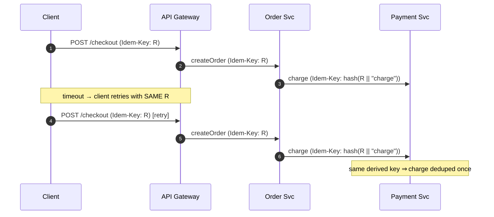
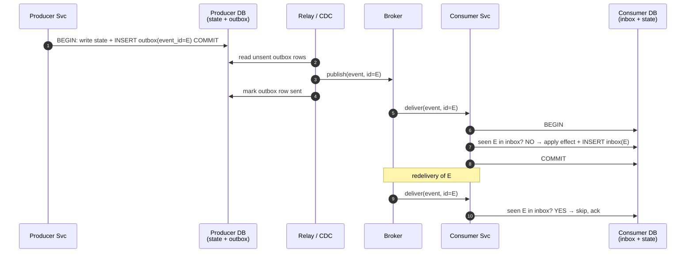

# Idempotent Operations — Senior

<!-- level-focus -->
At senior level, focus on this question:

> Which system invariant is affected by **Idempotent Operations** under failure, load, and change?

Use the smallest realistic scenario that exposes the decision and its failure behavior.
## 1. The Core Equation: Effectively-Once = At-Least-Once + Idempotent Processing

Exactly-once *delivery* over an unreliable network is impossible in the general case — this is
a direct consequence of the Two Generals problem. The sender cannot distinguish "message lost"
from "ack lost," so any protocol that retries can deliver duplicates, and any protocol that does
not retry can lose messages. You choose one failure mode:

- **At-most-once** — send, never retry. Simple, but silently drops work on failure.
- **At-least-once** — retry until acked. Never loses, but delivers duplicates.

At-least-once is the pragmatic default for anything that must not lose work (payments, orders,
state changes). But at-least-once alone is *not* correct — a duplicate that runs its side effect
twice corrupts state. The fix is to make **processing** idempotent so duplicates are harmless:

```text
effectively-once = at-least-once delivery + idempotent processing
```

This is the single most important idea in the topic. Exactly-once *delivery* is a myth you
should refuse to design around; exactly-once *effect* (a.k.a. effectively-once) is achievable and
is what Kafka's "exactly-once semantics" actually gives you — idempotent producers plus
transactional, dedup-aware consumers, not a magic network guarantee.



The critical ordering detail: **the offset/ack is committed only after the effect and the dedup
mark are durable.** If you commit the offset first and crash, the message is lost (you silently
degraded to at-most-once). At-least-once requires "process, then ack" — and that is exactly what
makes duplicates possible, which is why idempotency is not optional.

---

## 2. HTTP Idempotence vs Business-Level Idempotence

A frequent and expensive confusion: **HTTP method idempotence is a property of the protocol
semantics, not of your business logic.**

RFC 9110 §9.2.2 defines an idempotent method as one where "the intended effect on the server of
multiple identical requests is the same as the effect for a single such request." `GET`, `PUT`,
and `DELETE` are defined as idempotent; `POST` is not. But this is a *contract about intent*, and
it says nothing about whether your handler actually enforces it. Two failure directions:

- **`PUT` that isn't really idempotent.** `PUT /account/123/balance` with a body that says
  `{"delta": +100}` is a `PUT` in name but is a non-idempotent *increment*. Replaying it double-
  applies. The method verb lied.
- **`POST` that must be idempotent anyway.** `POST /transfers {"amount": 100}` is correctly a
  `POST` (not idempotent by spec), yet retrying it must **not** double-transfer. The spec gives
  you no help here — you must add business-level idempotency yourself.

The load-bearing distinction is **request identity vs operation identity**:

- HTTP replay-safety reasons about *identical requests*. But a retry after a network timeout may
  not be byte-identical (new timestamp header, new trace ID, different connection), and two
  *genuinely different* "transfer $100" requests are byte-different yet each legitimate.
- Business idempotency reasons about *operation identity* — a client-supplied key that says
  "these two requests are the same intent" or "these are distinct intents," independent of bytes.

| Dimension | HTTP method idempotence | Business-level idempotence |
|---|---|---|
| Defined by | RFC 9110 method semantics | Your domain + an idempotency key |
| Unit of identity | The request (method + target) | The *operation* (client-supplied key) |
| "Transfer $100" twice | Ambiguous — depends on handler | Two keys = two transfers; one key = one |
| Retry with different bytes | May not be recognized as same | Same key ⇒ same operation |
| Enforcement | Automatic? No — you still must build it | Explicit dedup store keyed by idem key |
| What breaks it | Non-idempotent handler behind `PUT` | Missing/duplicated/reused keys |

**Takeaway you own as a senior:** never rely on the verb. Design `PUT`/`DELETE` handlers to be
genuinely idempotent (set absolute state, not deltas; make delete of an absent resource a no-op
returning success), and add an explicit **idempotency key** for any state-changing `POST`.

---

## 3. Idempotency Keys: Ownership, Scope, and Propagation

An idempotency key is the operation's identity. Getting its lifecycle right is most of the work.

**Who generates it.** The **client** generates the key (Stripe's API works this way: an
`Idempotency-Key` header carrying a client-chosen, e.g. UUIDv4, value). This is essential: only
the client knows whether a retry is "the same operation I already tried" versus "a new operation."
If the server minted the key on receipt, every retry would look new and dedup would be impossible.

**Scope.** A key is scoped to a *logical operation and account*, not global. Store it as a tuple
`(tenant/account_id, endpoint, idempotency_key)` so one tenant's UUID collision can never affect
another, and so the same key on `/refunds` and `/charges` are distinct.

**What you store with it.** Not just "seen." Store the *fingerprint* of the request (a hash of the
canonical parameters) and the *saved response*. On replay you can then:

1. Same key **and** same fingerprint ⇒ return the stored response verbatim (true retry).
2. Same key **but** different fingerprint ⇒ `409 Conflict` — the client reused a key for a
   different payload, which is a client bug you must surface, not silently accept.

**Propagation across hops.** A single client operation often fans out across services. If each
hop invents its own dedup identity, a retry at the edge produces *new* downstream identities and
dedup collapses. The discipline: **derive downstream keys deterministically from the root key** —
e.g. `downstream_key = hash(root_idem_key || step_name)`. The root key propagates through headers
and message metadata so every hop dedups against a stable identity even when the edge retried.



The alternative — dedup *at each hop independently* with locally generated keys — only works if
the edge never retries, which defeats the purpose. Propagate the root identity.

---

## 4. Designing Idempotency Across a Distributed Flow

Idempotency is not a single check; it is a property you must preserve at **every hop where a
retry can be injected**: client → gateway, gateway → service, service → message broker, broker →
consumer, consumer → database, consumer → third-party API. A retry can appear at any of these,
so you dedup where duplicates can enter.

The strongest tool is **the natural idempotency of the datastore**, used instead of an external
"have I seen this?" lookup wherever possible:

- **Unique constraint as dedup.** Insert a row keyed by the idempotency key inside the same
  transaction as the effect. A duplicate hits a unique-violation and rolls back cleanly. This
  makes the dedup decision and the effect *atomic* — no window where one succeeds and the other
  does not. This is dramatically more robust than "check store, then act," which has a TOCTOU race
  (see §6).
- **Conditional / upsert writes.** `INSERT ... ON CONFLICT DO NOTHING`, `UPDATE ... WHERE
  status = 'PENDING'`, DynamoDB `ConditionExpression: attribute_not_exists(pk)`, or a
  compare-and-set on a version column. The database enforces "apply at most once" as an invariant,
  not as application logic.
- **Deterministic derived state.** Where the effect is `SET x = f(input)` rather than
  `x = x + delta`, replay is inherently harmless — no dedup store needed at all. Reformulating
  deltas into absolute assignments is often the cheapest fix.

Order dedup relative to the effect correctly: **the dedup marker and the side effect must commit
together** (one transaction) or the marker must be written *after* the effect is durable. Marking
"seen" before the effect commits lets a crash-in-between drop the operation permanently — you
recorded that you did work you never did.

For side effects you cannot make transactional with the dedup store (calling an external payment
provider), push idempotency *into the external call*: forward the derived idempotency key to the
provider so the provider itself dedups. Idempotency composes only when it is preserved end-to-end;
one non-idempotent hop poisons the whole flow.

---

## 5. Outbox and Inbox Patterns

The hardest sub-problem in a distributed flow is the **dual-write**: a service must both change
its database and emit a message, and these are two different systems. If it writes the DB then
crashes before publishing, the message is lost; if it publishes then crashes before committing the
DB, the message describes state that never existed. Neither at-least-once nor idempotency alone
fixes this — you need atomicity between the state change and the intent to publish.

**Outbox (reliable publish).** Write the outgoing event into an `outbox` table *in the same local
transaction* as the state change. A separate relay process (polling the table, or tailing the DB's
change log via CDC, e.g. Debezium) reads the outbox and publishes to the broker, marking rows sent.
The relay is at-least-once — it may publish a row twice if it crashes after publish but before
marking — so **every event carries a stable event ID for downstream dedup.**

**Inbox (reliable consume / dedup).** On the consuming side, record each processed message's ID in
an `inbox` (a.k.a. processed-messages) table *in the same transaction* as applying its effect. A
redelivered message finds its ID already present and is skipped atomically. Inbox is the durable,
transactional realization of the dedup store from §1 — and because the mark and the effect share a
transaction, it has no TOCTOU race.



Outbox guarantees the message is *published at least once*; inbox guarantees it is *applied
exactly once*. Together they give effectively-once across the dual-write boundary — this is the
canonical production pattern and what you should reach for by default.

---

## 6. Concurrency: Two Retries in Flight

The subtlest failure is **concurrent duplicates**: a client times out and retries while the first
request is *still executing*. Now two requests with the same idempotency key run simultaneously.
The naive "check-then-act" is a textbook TOCTOU race:

```text
  Request A: read dedup store → key absent → (about to process)
  Request B: read dedup store → key absent → (about to process)   ← both saw "absent"
  Request A: process, write result
  Request B: process, write result   ← effect applied TWICE despite the dedup check
```

The check passed for both because neither had written the marker yet. Fixes, strongest first:

- **Atomic insert-first (preferred).** Make the *first action* an atomic insert of the
  idempotency key with a `PENDING` status (unique constraint / `INSERT ... ON CONFLICT` /
  conditional put). Exactly one of A/B wins the insert; the loser gets a conflict and either waits
  for the winner's result or returns "in progress." The dedup decision is the write, so there is no
  gap between check and act.
- **Row/key lock or lease.** Acquire a lock on the idempotency key (`SELECT ... FOR UPDATE`, or a
  distributed lock with a lease/TTL) so the second request blocks until the first commits, then
  observes the completed marker. Locks add a liveness dependency — a crashed holder must have its
  lease expire — so bound the lease and design for it expiring mid-operation.
- **State machine on the marker.** Model the key's lifecycle as `PENDING → COMPLETED`/`FAILED`. A
  duplicate that finds `PENDING` returns `409`/retry-after; finding `COMPLETED` returns the stored
  response. This also handles the case where the first request *failed* — you decide whether the
  key is now reusable.

Never implement dedup as `if not store.contains(key): process(); store.add(key)` across two round
trips. Under concurrency and retries this *will* double-apply; the compound operation must be
atomic at the storage layer.

---

## 7. The Dedup Window: TTL vs Storage

A dedup store cannot remember every key forever — that is unbounded storage growth. So keys expire
after a **dedup window (TTL)**, and choosing it is a direct correctness-vs-cost trade-off.

```text
  window too SHORT → a delayed retry / redelivery arrives after the key expired
                     → treated as new → duplicate side effect (silent double-apply)
  window too LONG  → dedup store grows large and hot; higher cost, slower lookups
```

Size the window to the **maximum plausible duplicate delay**, not the typical one:

- Client/library retry budget (how long will the client keep retrying? often minutes).
- Broker retention and redelivery: an at-least-once broker can redeliver hours later after a
  consumer-group rebalance or a replay of a partition. Your inbox window must cover the broker's
  redelivery horizon, or a legitimate redelivery slips past dedup.
- Human/ops replays: reprocessing a day of events for recovery can resurface week-old IDs.

Practical guidance: a 24-hour window covers most request-response retries (Stripe uses ~24h); an
inbox tied to a Kafka topic should cover the topic's retention or your worst-case replay window,
which may be days. If you cannot bound the window (unlimited replay), you cannot rely on TTL-based
dedup and must instead use the **natural idempotency of the datastore** (§4) — a unique constraint
never "expires," so replay from any point stays safe.

**Storage sizing** is a back-of-envelope: `keys_stored ≈ write_QPS × window_seconds`. At 5,000
writes/s with a 24 h window that is `5000 × 86400 ≈ 4.3×10⁸` keys retained; at ~100 bytes/key
(key + fingerprint + small status) that is tens of GB of hot state that must survive restarts.
This is why dedup state is often the inbox table itself (durable, partitioned with the data) rather
than a separate cache.

---

## 8. Failure Modes and Anti-Patterns

| Failure mode | How it manifests | Mitigation |
|---|---|---|
| **Dedup store is a SPOF** | Redis/dedup cache down ⇒ every request looks new ⇒ duplicates, or requests blocked ⇒ outage | Put dedup in the same durable, replicated store as the effect (unique constraint / inbox); if separate, replicate it and decide fail-open (allow dup) vs fail-closed (reject) explicitly |
| **TTL too short** | Delayed retry after expiry double-applies; silent, only visible as data drift | Size window to worst-case redelivery/replay horizon; prefer datastore-native idempotency where the window is unbounded |
| **Non-deterministic side effects** | Replay produces a *different* result (uses `now()`, `rand()`, an auto-increment ID, or an external call with new state) so the stored response can't be reused and effects diverge | Capture generated values (timestamps, IDs) at first execution and persist them with the key; replay reuses the captured values, never recomputes |
| **Check-then-act race** (§6) | Two concurrent retries both pass the "seen?" check | Atomic insert-first / unique constraint / lock — make the dedup decision the write |
| **Mark-before-effect** | Marker committed before effect; crash in between ⇒ operation permanently dropped | Commit marker and effect in one transaction, or mark only after effect is durable |
| **Ack/commit-before-process** | Offset committed before processing ⇒ message lost on crash (silently at-most-once) | Process, then ack — even though this is what creates the duplicates idempotency handles |
| **Non-idempotent verb** | `PUT`/`DELETE` handler applies a delta or has replay-visible effects | Set absolute state; make delete-of-absent a success no-op |
| **Key reuse for different payload** | Same idem key, different body ⇒ second op silently swallowed (returns first op's result) | Store request fingerprint; same key + different fingerprint ⇒ `409 Conflict` |
| **Dedup not propagated across hops** | Edge retry spawns new downstream identities; downstream double-applies | Derive downstream keys deterministically from the root key; forward the root key in headers/metadata |

The recurring theme: idempotency bugs are **silent**. A double-charge or a dropped order does not
throw an exception — it produces wrong state that surfaces days later in reconciliation. This is
why the guarantee must be structural (enforced by constraints and transactions), not a hopeful
`if` statement.

---

## 9. Where and When to Enforce Idempotency

Idempotency is not free — it costs a durable write, storage, and design complexity at every
enforcing hop. Apply it where the cost of a duplicate exceeds that overhead:

- **Enforce at the write boundary of every non-idempotent state change** — payments, order
  creation, inventory decrement, sending user-visible notifications, provisioning resources. Any
  effect that is expensive, irreversible, or externally visible when doubled.
- **Enforce at every consumer of an at-least-once queue** — this is non-negotiable; the broker
  *will* redeliver. The inbox pattern is the default here.
- **Push it to the outermost point a retry can enter, plus every internal fan-out hop** — the
  gateway for client retries, and each service-to-service call, using propagated derived keys.

You can *skip* explicit idempotency when:

- The operation is **naturally idempotent** — pure reads (`GET`), absolute-state writes
  (`SET status = 'shipped'`), or effects reformulated to be replay-safe. Prefer designing effects
  this way; it is cheaper than any dedup machinery.
- The effect is **already guarded by a datastore invariant** you control (a unique business key on
  the order, a version-based CAS) — the constraint *is* the idempotency, no separate store needed.
- Duplicates are **genuinely harmless and cheap** (an idempotent analytics counter that is
  approximate anyway, a cache warm). Do not add a dedup store to protect against a no-op.

The senior judgment call: **first try to make the operation naturally idempotent (absolute state,
unique constraints); only add an explicit idempotency-key + dedup store where you cannot.** Reach
for the outbox/inbox pattern as the default at any dual-write or queue boundary, and treat the
choice of dedup window as a documented capacity and correctness decision, not a config default
someone copy-pasted.

---

## 10. Senior Checklist

- [ ] System's delivery semantics are explicit: at-least-once + idempotent processing =
      effectively-once. No one on the team believes in exactly-once *delivery*.
- [ ] Every non-idempotent state change accepts a **client-generated** idempotency key; the key is
      scoped `(account, endpoint, key)` and stored with a request fingerprint + saved response.
- [ ] Same key + different fingerprint returns `409`, not a silent swallow.
- [ ] Dedup is enforced by a **datastore invariant** (unique constraint / conditional write /
      inbox row in the same transaction as the effect) — not by check-then-act across two round trips.
- [ ] Concurrent duplicates handled: first action is an atomic insert/lock, with a
      `PENDING → COMPLETED` state on the key.
- [ ] Dual-write boundaries use **outbox** (produce) and **inbox** (consume); every event carries a
      stable event ID.
- [ ] Dedup **window (TTL)** is sized to the worst-case redelivery/replay horizon, storage cost is
      estimated (`QPS × window`), and the window is documented — not a default.
- [ ] Non-deterministic values (timestamps, generated IDs) are captured at first execution and
      reused on replay.
- [ ] Dedup store is **not a SPOF**: co-located with durable state, or replicated with an explicit
      fail-open/fail-closed decision.
- [ ] Idempotency keys **propagate across hops** via deterministic derivation from the root key.

---

*Next step:* [Idempotent Operations — Professional](professional.md)

---

## Apply it

1. State the system invariant that **Idempotent Operations** must protect.
2. Mark ownership, state, and failure propagation at each boundary.
3. Compare two designs under load, dependency failure, and future change.
4. Define recovery and compatibility behavior before implementation.
5. Test the riskiest assumption with a focused experiment.

## Verify your work

- The experiment supports the design with evidence, not preference.
- Failure injection shows the blast radius and recovery path.
- Compatibility checks cover old and new callers or data.
- Operational signals reveal invariant violations and recovery progress.

## Review questions

- Which invariant must remain true when Idempotent Operations fails?
- Where should recovery responsibility live, and why?
- Which assumption deserves an experiment before implementation?
- How can the design evolve without changing every consumer at once?
