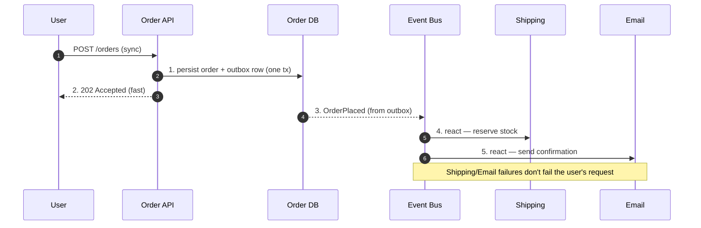
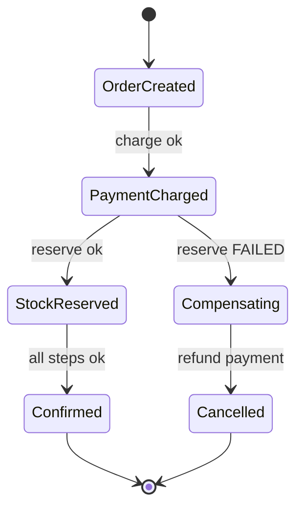
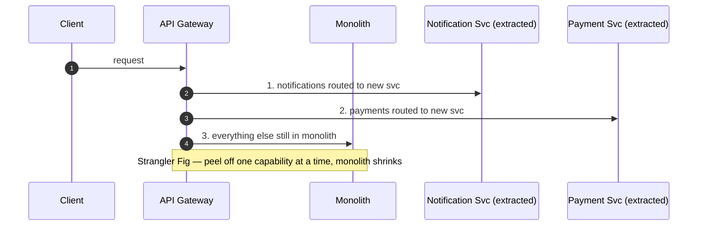

# Microservices — Interview

Fifteen questions that separate people who *say* "microservices" from people who have *operated* them. Answers are crisp, opinionated, and grounded in the failure modes that actually bite: distributed monoliths, dual-write inconsistency, and multiplied unavailability. If you remember one thing: **microservices are an organizational scaling strategy with a technical bill attached** — you pay it in network calls, eventual consistency, and observability.

## Table of Contents

1. [Q1: What is a microservice, and what problem does the style actually solve?](#q1-what-is-a-microservice-and-what-problem-does-the-style-actually-solve)
2. [Q2: How do you decide service boundaries?](#q2-how-do-you-decide-service-boundaries)
3. [Q3: What is "database per service" and why is it non-negotiable?](#q3-what-is-database-per-service-and-why-is-it-non-negotiable)
4. [Q4: When do you pick synchronous vs asynchronous communication?](#q4-when-do-you-pick-synchronous-vs-asynchronous-communication)
5. [Q5: What is a distributed monolith and how do you detect one?](#q5-what-is-a-distributed-monolith-and-how-do-you-detect-one)
6. [Q6: How do you handle a transaction that spans multiple services?](#q6-how-do-you-handle-a-transaction-that-spans-multiple-services)
7. [Q7: What is the dual-write problem and how does the outbox pattern fix it?](#q7-what-is-the-dual-write-problem-and-how-does-the-outbox-pattern-fix-it)
8. [Q8: A request touches 5 services each at 99.9% uptime — what's the availability?](#q8-a-request-touches-5-services-each-at-999-uptime--whats-the-availability)
9. [Q9: How do you keep a chain of calls from cascading into a full outage?](#q9-how-do-you-keep-a-chain-of-calls-from-cascading-into-a-full-outage)
10. [Q10: How is observability different in microservices?](#q10-how-is-observability-different-in-microservices)
11. [Q11: How do you test microservices without a full end-to-end environment?](#q11-how-do-you-test-microservices-without-a-full-end-to-end-environment)
12. [Q12: Should a new product start with microservices? Defend "monolith-first."](#q12-should-a-new-product-start-with-microservices-defend-monolith-first)
13. [Q13: How does Conway's Law shape (and sabotage) a microservice architecture?](#q13-how-does-conways-law-shape-and-sabotage-a-microservice-architecture)
14. [Q14: Scenario — would you use microservices for a 3-person startup's MVP?](#q14-scenario--would-you-use-microservices-for-a-3-person-startups-mvp)
15. [Q15: Scenario — decompose this e-commerce monolith. Walk me through it.](#q15-scenario--decompose-this-e-commerce-monolith-walk-me-through-it)

---

## Q1: What is a microservice, and what problem does the style actually solve?

A microservice is an independently **deployable** unit owned by one team, aligned to a business capability, with its **own datastore** and communicating with peers only over the network (never a shared DB or in-process call). "Small" is a red herring — the load-bearing word is **independent**.

The real problem it solves is *not* performance and *not* code cleanliness — it's **organizational and delivery scaling**:

- **Independent deploy** — team A ships payments without coordinating a release train with team B's catalog. Deploy frequency stops being bottlenecked by the slowest module.
- **Team autonomy** — teams choose their own stack, cadence, and on-call, decoupling human throughput from a shared codebase's lock contention.
- **Independent scaling** — scale the checkout service to 50 replicas while search stays at 4; you scale the hot path, not the whole binary.
- **Fault isolation** — a memory leak in recommendations shouldn't OOM the login flow.

If your pain is CPU or a slow query, microservices are the wrong tool — you want a profiler or an index. Microservices are the answer when *"we can't ship because 40 engineers are stepping on each other in one repo/release."*

## Q2: How do you decide service boundaries?

Boundaries are the entire ballgame — get them wrong and every other decision compounds the mistake. The primary lens is **Domain-Driven Design's bounded context**: a boundary within which a term (e.g., "Order") has one unambiguous meaning and one model. "Customer" in Billing (an invoice target) and "Customer" in Support (a ticket author) are *different bounded contexts* even though they share a word.

Practical heuristics, in priority order:

| Signal | Boundary rule | Anti-signal (you split wrong) |
|---|---|---|
| **Bounded context** | One consistent model & ubiquitous language per service | The same entity is edited by two services |
| **Conway's Law** | Boundary follows a team that can own it end-to-end | Every feature needs 3 teams to ship |
| **Rate of change** | Things that change together live together | Two services always deploy in lockstep |
| **Data cohesion** | A service owns the data it mutates | A service reads another's tables to work |
| **Transactional need** | Data needing one ACID transaction stays in one service | You reach for a distributed transaction |

The strongest test: **can this service be deployed, scaled, and reasoned about without coordinating with another team's release?** If not, the boundary is wrong. Prefer coarse boundaries early — merging is cheap in-process, splitting a bad boundary later means a data migration and a distributed transaction you never wanted.

## Q3: What is "database per service" and why is it non-negotiable?

Each service owns its schema; **no other service reads or writes those tables directly** — access is only through the owning service's API/events. It is the defining constraint of the style.

Why it's non-negotiable: a **shared database is a shared coupling point** that silently re-couples everything you split. If two services read the same table, you can't change that schema without a synchronized deploy — you've built a distributed monolith with extra network hops. Ownership of data is what makes independent deploy real.

The cost you accept in return:
- **No cross-service JOINs** — you compose data via API calls (API composition) or keep a read-optimized copy (CQRS/materialized view fed by events).
- **No cross-service ACID** — a single business operation spanning services can't be one transaction (see Q6).
- **Data duplication is normal** — Orders keeps a *copy* of the product name/price it needs, updated by events, rather than joining to Catalog on every read.

The rule "the API is the only door" is what buys you schema freedom. The moment someone opens a read-replica of another team's DB "just for reporting," the architecture starts rotting.

## Q4: When do you pick synchronous vs asynchronous communication?

Sync (request/response — REST, gRPC) when the **caller needs the answer now to proceed** and the operation is naturally a query or a strongly-consistent command: "get user profile," "authorize this payment." Async (events/messages — Kafka, RabbitMQ, SQS) when you want to **decouple in time and reduce runtime coupling**: "order was placed" → let shipping, email, and analytics react independently.

| Dimension | Synchronous (REST/gRPC) | Asynchronous (events/queue) |
|---|---|---|
| Coupling | Temporal — callee must be up *now* | Decoupled — broker buffers |
| Latency | Adds to caller's latency budget | Removed from caller's path |
| Failure blast radius | Propagates up the chain | Absorbed by ret/DLQ |
| Consistency | Read-your-write possible | Eventual |
| Debuggability | Easy (one trace, one stack) | Harder (async, out-of-order) |
| Backpressure | Caller must handle timeouts | Queue depth is the signal |

Rule of thumb: **use sync for queries, async for commands that trigger side effects across services.** Every sync hop you add to a request chain multiplies latency *and* the probability of failure (Q8). A common mature pattern is a **sync entry point (API gateway) that fans out to async internally** — the user gets a fast "accepted," the work happens on events.

## Q5: What is a distributed monolith and how do you detect one?

A distributed monolith has all the **costs** of microservices (network, ops, eventual consistency) and none of the **benefits** (independent deploy, autonomy). It's the worst quadrant — you paid the bill and got nothing.

Detection checklist (any one is a strong smell; several = you're there):

- **Lockstep deploys** — you can't release service A without simultaneously releasing B and C. Independent deploy is dead.
- **Shared database / shared tables** across services.
- **Synchronous call chains 4+ deep** for a single user request — everything is `A→B→C→D` blocking.
- **A shared library that, when bumped, forces every service to redeploy** (a shared domain model masquerading as reuse).
- **Change to one service's API breaks three others** with no contract/versioning cushion.
- **You need an end-to-end environment with *all* services up** to test anything.

The root cause is almost always **bad boundaries + shared data**. The fix is rarely "more services" — it's often *fewer, better-bounded* services, async decoupling of the chains, and killing shared datastores/libraries. Sometimes the right fix is to **merge two chatty services back together** — recoupling in-process is a valid, senior move, not a retreat.

## Q6: How do you handle a transaction that spans multiple services?

You **don't** — there is no cross-service ACID. Two-phase commit (2PC/XA) exists but is avoided: it's a synchronous blocking protocol that couples availability (a slow participant stalls everyone) and doesn't scale. Instead you decompose the business transaction into **local transactions coordinated by a Saga**, and accept **eventual consistency with compensating actions** instead of rollback.

Two saga styles:

- **Choreography** — each service does its local step and emits an event; the next service reacts. No central coordinator. Simple for short flows; becomes an untraceable web of events past ~4 steps.
- **Orchestration** — a central orchestrator (a saga state machine) tells each service what to do and drives compensations on failure. More moving parts, but the flow is explicit and debuggable. Preferred for complex flows.

Because there's no rollback, each step needs a **compensating transaction** (Payment succeeded but Inventory failed → *refund* the payment; you can't "un-commit"). Steps must be **idempotent** (retries are guaranteed) and the system exposes **intermediate states** users may observe ("order pending"). Semantic locks (e.g., an `INVENTORY_RESERVED` status) prevent other sagas from acting on in-flight data.

## Q7: What is the dual-write problem and how does the outbox pattern fix it?

The **dual-write problem**: a service must both (a) commit to its DB and (b) publish an event to a broker. These are two systems with no shared transaction. If the process crashes between them, you get either a DB row with no event (lost update — shipping never hears about the order) or an event with no row (phantom). "Save then publish" is a race that *will* corrupt state at scale.

The **Transactional Outbox** fixes it by making the event part of the *same local transaction* as the state change:

1. In one DB transaction, write the business row **and** insert the event into an `outbox` table.
2. A separate relay reads the outbox and publishes to the broker (polling, or better, **Change Data Capture** tailing the DB log with Debezium).
3. The relay marks rows sent; delivery is **at-least-once**, so consumers must be **idempotent** (dedupe on event ID).

This converts "two writes, no atomicity" into "one atomic write + reliable async relay." The inverse — reading events to update state — is **Inbox/idempotent consumer**: store processed event IDs to swallow duplicates. Together, outbox + idempotent inbox give you reliable eventing without distributed transactions.

## Q8: A request touches 5 services each at 99.9% uptime — what's the availability?

For a **serial** chain where all five must succeed, availabilities **multiply**:

`0.999^5 ≈ 0.99501` → about **99.5%**.

That's roughly **43.8 hours** of downtime a year, versus **8.76 hours** for a single 99.9% service. **Each synchronous dependency you add to the critical path drags availability down and stacks its latency (and tail latency) onto yours.** This is the quantitative reason deep sync call chains are dangerous — the math is unforgiving and gets worse fast (`0.999^10 ≈ 99.0%`).

Mitigations, in order of impact:
- **Shorten the chain** — the cheapest fix is fewer hops. Question every dependency on the hot path.
- **Make dependencies non-critical** — move them off the request path (async), or degrade gracefully (serve cached/default data when recommendations is down instead of failing checkout).
- **Redundancy** — replicate each service so *its* 99.9% is a floor, not a ceiling; parallel calls instead of serial where possible.
- **Circuit breakers + timeouts + fallbacks** (Q9) so a sick dependency returns fast instead of hanging the chain.

The senior framing: availability is a *budget* you spend on every dependency — architect the critical path to have as few required dependencies as possible.

## Q9: How do you keep a chain of calls from cascading into a full outage?

The failure mode: service D slows down → C's threads block waiting on D → C's thread pool exhausts → B blocks on C → the whole chain is down because one leaf is sick. **One slow dependency takes out everything upstream.** The defenses (resilience patterns, usually via a mesh or a library):

- **Timeouts** — never wait indefinitely. A missing timeout is the #1 cause of cascade. Set them tighter than the caller's own budget.
- **Circuit breaker** — after N failures, "open" the circuit and fail fast (return a fallback) instead of hammering a dead service; probe periodically to recover.
- **Bulkheads** — isolate resources (separate thread pools/connection pools per dependency) so one saturated dependency can't consume all threads.
- **Retries with backoff + jitter** — for transient blips *only*, and **only if the op is idempotent**; naive retries amplify load and cause **retry storms** that turn a brownout into an outage.
- **Load shedding / rate limiting** — drop excess load at the edge to protect the core.
- **Graceful degradation** — a fallback (cached data, default, partial response) beats an error.

The mental model: **fail fast, fail isolated, degrade gracefully.** A request should either succeed, or fail quickly with a sensible fallback — never hang and take the ship down with it.

## Q10: How is observability different in microservices?

In a monolith, one stack trace and one log file tell the story. In microservices a single request crosses many processes, so you need the **three pillars stitched by correlation**:

- **Distributed tracing** — a **trace/correlation ID** propagated across every hop (via headers, per OpenTelemetry/W3C Trace Context) so you can reconstruct the full path and see *which hop* added the latency. This is the single most valuable investment; without it, "why is checkout slow?" is unanswerable.
- **Centralized, structured logging** — logs from all services aggregated and searchable, each tagged with the correlation ID. Grepping 40 pods by hand doesn't scale.
- **Metrics per service** — the RED method (Rate, Errors, Duration) per service, plus **dependency-aware SLOs** and dashboards showing the call graph's health.

New failure classes to watch that monoliths don't have: **partial failures** (service half-up), **tail latency amplification** (a request touching 20 services is as slow as the *slowest* of the 20 → p99 of the whole is dominated by p99 of any dependency), and **error budgets that must account for downstream dependencies**. The discipline: you can't operate what you can't correlate — tracing is table stakes, not a nice-to-have.

## Q11: How do you test microservices without a full end-to-end environment?

Spinning up *all* services for every test is slow, flaky, and a distributed-monolith smell. The strategy is a **shifted testing pyramid** that pushes confidence down to fast, isolated layers:

- **Unit + component tests** — bulk of coverage; test a service in isolation with in-memory/faked dependencies. Fast and deterministic.
- **Contract tests (the key layer)** — **consumer-driven contracts** (e.g., Pact) verify that a consumer's expectations of a provider's API and the provider's actual behavior match — *without running both together*. This catches integration breakage in CI, replacing most brittle E2E tests. Each side tests against the shared contract independently.
- **Integration tests** — a service against real infra it owns (its DB, its broker) via **Testcontainers**, not against other teams' live services.
- **A thin layer of E2E** — a handful of critical user-journey smoke tests, and increasingly **testing in production**: canary/shadow traffic, synthetic monitoring, feature flags.

The rule: **contracts replace most end-to-end tests.** If you need every service running to gain confidence, you've coupled them (Q5) — the test pain is diagnosing the architecture.

## Q12: Should a new product start with microservices? Defend "monolith-first."

**No — start with a monolith** (a well-modularized one), and this is a mainstream, defensible position (Fowler's "MonolithFirst," Newman's guidance in *Building Microservices*). Reasons:

1. **You don't know the boundaries yet.** Boundaries are the hardest, most expensive-to-fix decision, and early on the domain is still shifting. Getting them wrong distributed is catastrophic; getting them wrong in-process is a refactor.
2. **Microservices tax is real and constant** — network, service discovery, distributed tracing, eventual consistency, CI/CD per service, on-call. A 3-person team pays that tax with no benefit (there's no team-coordination problem to solve yet).
3. **In-process iteration is faster** — refactoring a boundary is a function-move, not a data migration + distributed transaction.

The disciplined path is a **modular monolith**: clean module boundaries, no cross-module DB access, dependencies pointing inward — so the *seams* are microservice-ready. Extract a service only when a **concrete forcing function** appears: a module needs independent scaling, a team needs independent deploy cadence, or a module's reliability/compliance needs isolation. **Extract based on pain, not prophecy.** ("Microservices are a solution to a scaling-the-organization problem you may never have.")

## Q13: How does Conway's Law shape (and sabotage) a microservice architecture?

Conway's Law: *"organizations design systems that mirror their communication structure."* Your service boundaries will end up matching your team boundaries whether you plan it or not — so you should plan it. This is the **Inverse Conway Maneuver**: deliberately structure teams around the *desired* architecture (small, autonomous, capability-aligned teams — "you build it, you run it"), and the software follows.

Where it sabotages you:
- **Boundaries that cut across teams** create constant cross-team coordination — every feature needs three teams, killing the autonomy that justified microservices in the first place.
- **A shared "platform" or "integration" team** that owns cross-cutting concerns becomes a **deployment bottleneck** every service must queue behind.
- **Team org and service org drifting apart** over reorgs leaves services with no clear owner — orphaned, un-maintained, and quietly rotting.

Practical takeaway: **a microservice should map to a team that can own it end-to-end.** If a service can't be owned by one team, or if a feature routinely spans many services owned by many teams, the boundaries fight the org chart — and the org chart always wins. Design the teams and the services together.

## Q14: Scenario — would you use microservices for a 3-person startup's MVP?

**No.** Three engineers have zero organizational-scaling problem — the one thing microservices solve — and they'd drown in the tax: infra for N services, distributed tracing, eventual-consistency bugs, per-service CI/CD, and on-call spread thin. Every hour on Kubernetes and sagas is an hour not spent finding product-market fit, which the startup may never reach.

I'd ship a **modular monolith**: one deployable, one database, but with clean internal module boundaries (orders, users, billing as separate packages with no cross-module DB access, dependencies pointing inward). This gives fast iteration *now* and microservice-ready seams *later*. I'd carve out a separate service only for a genuine, immediate forcing function — e.g., a CPU-heavy video-transcoding job that must scale independently and would otherwise starve the web tier, or a PCI-scope payment component I want isolated for compliance.

The framing I'd give the interviewer: **microservices are an investment that pays off at organizational scale; paying that cost before you have the problem is premature optimization of the most expensive kind.** Start with the monolith, keep it modular, and let real pain — not architecture fashion — trigger extraction.

## Q15: Scenario — decompose this e-commerce monolith. Walk me through it.

Say the monolith handles catalog, cart, orders, payments, inventory, shipping, notifications. My process:

**1. Find boundaries by bounded context, not by noun.** Group by capability and consistent model: *Catalog*, *Cart*, *Order*, *Payment*, *Inventory*, *Shipping*, *Notification*. Note that "Product" means different things to Catalog (rich descriptions, images) vs Order (a snapshot of name/price at purchase time) — Order keeps its *own copy*, it doesn't call Catalog on every read.

**2. Don't split all at once — Strangler Fig.** Keep the monolith running behind a facade/gateway and peel off one service at a time, routing that capability's traffic to the new service while everything else stays put. This de-risks the migration and avoids a big-bang rewrite.

**3. Extract by pain, highest-value first.** Notifications (async, leaf, low coupling) is a safe first extraction — teaches the team the tooling cheaply. Then a high-scale, high-blast-radius piece like Payment (isolate for compliance) or Catalog (read-heavy, scales differently from writes).

**4. Design the data.** Each service gets its own DB. Cross-service reads become API composition or event-fed read models. Split the shared schema carefully — this is the riskiest step.

**5. Design the write flows.** "Place order" spans Order → Payment → Inventory → Shipping. That's a **Saga** (orchestrated — the flow is complex enough to want an explicit coordinator), with **outbox** for reliable events and **compensations** for failures (charge succeeded, stock unavailable → refund).

**6. Add the connective tissue up front:** an API gateway, distributed tracing, consumer-driven contracts, and circuit breakers on every sync hop — otherwise the first outage is undebuggable.

Throughout, the honest caveat I'd voice: **decomposition trades a code problem for a distributed-systems problem** — eventual consistency, saga complexity, multiplied failure surface. It's worth it only where independent deploy/scale/compliance genuinely pays for that cost; where it doesn't, that capability stays in the (now modular) monolith.

---

*Next step:* [Monolith vs Microservices — Junior](../02-monolith-vs-microservices/junior.md)
