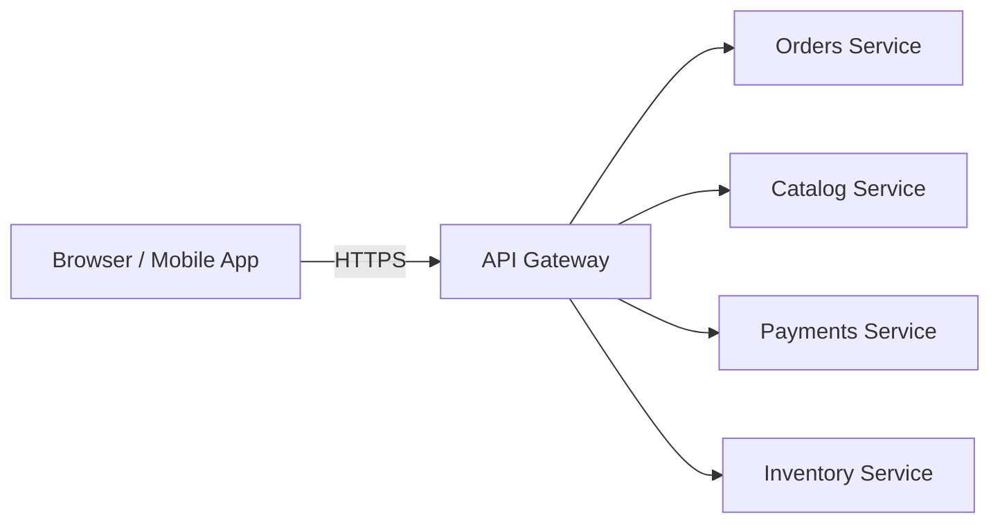
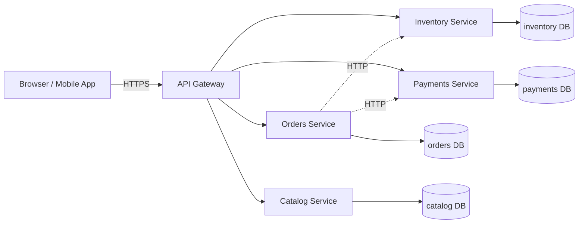
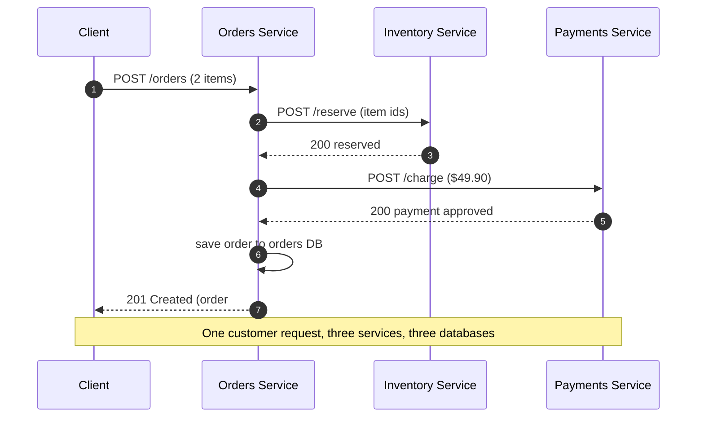

# Microservices — Junior

<!-- level-focus -->
At junior level, focus on this question:

> How can I apply **Microservices** in one small example and prove the result?

Use the smallest realistic scenario that exposes the decision and its failure behavior.
## 1. What Is It?

A **microservices architecture** is a way of building one product out of many small,
separately-running programs instead of a single large one. Each small program — a
**service** — owns exactly one part of the business (placing orders, taking payments,
tracking stock), runs as its own deployable application, keeps its own database, and
talks to the other services over the network using HTTP or RPC.

You have already used systems built this way without noticing. When you check out on
Amazon, one service reserves the item, a different service charges your card, and a
third schedules the shipment — three independent programs, possibly written by three
different teams, cooperating over the network to complete a single purchase. From the
outside it looks like one website. Inside, it is a fleet.

The word "micro" is misleading: a service is not sized by lines of code but by
**responsibility**. A good service does one business job well and can be understood,
deployed, and scaled on its own.

---

## 2. First Principles: From One Big Program to Many Small Ones

Start with the thing you already know — a **monolith**. A monolith is one program.
All the code for orders, payments, and inventory lives in the same codebase, compiles
into one artifact, runs in one process, and reads and writes one shared database.
Calling from the order code into the payment code is just a normal function call: fast,
in-memory, guaranteed to happen.

```text
MONOLITH — one process, one database
┌─────────────────────────────────────┐
│  E-Commerce App (one deployable)     │
│                                      │
│   orders  →  payments  →  inventory  │   ← plain function calls
│                                      │
└───────────────────┬──────────────────┘
                    │
              ┌─────▼─────┐
              │ one shared │
              │  database  │
              └───────────┘
```

Now split it. Cut along the **business capabilities** — order handling, payment
handling, stock handling — and turn each into its own program with its own database.
The old in-memory function call `payments.charge(...)` becomes a **network call**: the
Orders service sends an HTTP request to the Payments service and waits for a reply.

```text
MICROSERVICES — many processes, many databases
┌──────────┐   HTTP    ┌──────────┐   HTTP    ┌────────────┐
│  Orders  │ ────────► │ Payments │           │ Inventory  │
│ service  │           │ service  │           │  service   │
└────┬─────┘           └────┬─────┘           └─────┬──────┘
    │                      │                       │
┌───▼────┐            ┌────▼────┐            ┌──────▼─────┐
│orders DB│            │payment DB│            │inventory DB│
└────────┘            └─────────┘            └────────────┘
```

That single change — a function call becoming a network call — is the whole story.
Everything microservices give you (independent deployment, independent scaling, team
autonomy) and everything they cost you (network failures, latency, distributed data)
flows from crossing a network boundary between the pieces.

**Why do it at all?** Because independent programs can be:

- **Deployed independently** — ship a fix to Payments without redeploying Orders.
- **Scaled independently** — run 20 copies of the busy Inventory service and only 3 of Payments.
- **Owned independently** — one team fully owns a service, its database, and its on-call.
- **Failure-isolated** — if the recommendation service crashes, checkout still works.

---

## 3. A Concrete Example: Splitting an E-Commerce App

Take a shopping site and identify its distinct business jobs. Each becomes a service
that owns its data and exposes a small API.

| Service | Owns (the business capability) | Its own data | Example API |
|---------|-------------------------------|--------------|-------------|
| **Catalog** | Products, prices, descriptions | `products` | `GET /products/{id}` |
| **Inventory** | How many units are in stock | `stock_levels` | `POST /reserve` |
| **Orders** | Creating and tracking orders | `orders`, `order_items` | `POST /orders` |
| **Payments** | Charging the customer's card | `transactions` | `POST /charge` |
| **Shipping** | Scheduling and tracking delivery | `shipments` | `POST /shipments` |

The dividing line to look for is: *"who is the single owner of this data and these
rules?"* Stock counts belong to Inventory and nobody else writes to `stock_levels`.
If Orders needs to know whether an item is in stock, it does **not** reach into
Inventory's database — it **asks** Inventory over its API. This is the discipline that
keeps services independent: data is private, and the API is the only door in.

Placing an order becomes a short conversation between services:

1. **Orders** receives `POST /orders` from the customer.
2. **Orders** asks **Inventory** to reserve the items (`POST /reserve`).
3. **Orders** asks **Payments** to charge the card (`POST /charge`).
4. If both succeed, **Orders** records the order and returns success to the customer.

Each step is a network request to a separate program, each of which updates only its
own database.

---

## 4. Service Topology

Real clients do not call individual services directly. A single front door — an **API
gateway** — receives every request from browsers and mobile apps and routes it to the
right internal service. The gateway also handles cross-cutting concerns (authentication,
rate limiting) so each service does not have to.

The diagram below builds up in three stages so you can see each layer's job.

**Stage 1 — the client only ever sees the gateway:**


**Stage 2 — the gateway fans out to the business services:**



**Stage 3 — each service owns its own private database:**



The dashed arrows show services calling each other directly (Orders → Inventory,
Orders → Payments). The solid lines to the cylinders show the rule that never bends:
**each service reads and writes only its own database.**

---

## 5. How a Request Flows Across Services

Here is a single "place an order" request touching three services. Read it top to
bottom — the numbers are the order in which things happen.



Notice what changed compared to a monolith. In a monolith, steps 2–5 were instant
in-memory function calls that could not "fail to arrive." Here, each arrow is a real
network request that can be slow, or time out, or reach a service that is temporarily
down. Handling those cases is the main new skill microservices demand — but at the
junior level, the key realization is simply that **these are now network calls, not
function calls**, and the network is not guaranteed.

---

## 6. The Two Non-Negotiable Rules

Almost everything that goes wrong with early microservices comes from breaking one of
these two rules. Learn them now.

**Rule 1 — A service owns its data; no one else touches its database.**
If Orders needs stock data, it calls Inventory's API. It must never connect directly to
Inventory's database. The moment two services share a database table, they are no
longer independent: you cannot change that table, deploy, or scale either service
without coordinating with the other. You have rebuilt a monolith with extra network
hops — the worst of both worlds.

**Rule 2 — Services communicate only through published APIs.**
The API is the contract. As long as a service keeps its API stable, its team is free
to rewrite everything behind it — change the language, change the schema, change the
database — without asking anyone. The API is the boundary that makes independence real.

---

## 7. Monolith vs Microservices

Neither is "better." They trade simplicity for independence. A junior engineer should
be able to name these trade-offs plainly.

| Dimension | Monolith | Microservices |
|-----------|----------|---------------|
| **Deployable units** | One | Many (one per service) |
| **Databases** | One shared | One private database per service |
| **Calls between features** | In-memory function call | Network call (HTTP / RPC) |
| **Deploy a small fix** | Redeploy the whole app | Redeploy only the affected service |
| **Scaling** | Scale the whole app together | Scale each service independently |
| **A component crashes** | Can take down the whole app | Isolated; other services keep serving |
| **Team ownership** | Shared codebase, coordinated releases | One team owns a service end-to-end |
| **Local development** | Run one program | Run/mock several programs |
| **Debugging a request** | Single stack trace | Trace spans across several services |
| **Data consistency** | Easy — one database, one transaction | Hard — data spread across databases |
| **Operational cost** | Low | High (many deploys, monitors, networks) |

The honest summary: a monolith is **simpler**, microservices are **more independent**.
You pay for independence with operational and distributed-systems complexity. Small
teams and new products usually start with a monolith and split later, once specific
parts genuinely need to scale or ship on their own schedule.

---

## 8. Key Terms

| Term | Definition |
|------|-----------|
| Service | A small, independently-deployable program owning one business capability |
| Business capability | One coherent job the business does (e.g., "take payments") |
| API | The published contract other services call; the only way in |
| API gateway | The single front door that routes external requests to services |
| Independent deployment | Shipping one service without redeploying the others |
| Database-per-service | Each service owns a private database; no shared tables |
| Synchronous call | Caller sends a request and waits for the reply (typical HTTP) |
| Service-to-service call | One service calling another over the network |
| Monolith | The opposite model: one program, one database, one deploy |

---

## 9. Common Misconceptions at This Level

1. **"Microservices means lots of tiny services."** No — it means services sized to a
   business capability. Ten well-bounded services beat a hundred fragments that cannot
   do anything without calling five neighbors.
2. **"Split the database is optional."** It is the whole point. Shared databases are the
   single most common way teams accidentally rebuild a monolith.
3. **"Microservices are automatically faster."** They are usually *slower per request*:
   a network hop costs far more than a function call. You adopt them for independence
   and scaling, not raw speed.
4. **"Start every new project with microservices."** Rarely wise. The complexity is real
   from day one, while the benefits only appear at scale and with multiple teams.
5. **"The network is reliable, so calls always succeed."** Any service-to-service call
   can be slow, time out, or hit a down service. Designing for that is the next level up.

---

## 10. Hands-On Exercise

Take a **food-delivery app** (like Uber Eats). On paper:

1. List the distinct business capabilities (e.g., Restaurants, Menu, Cart, Ordering,
   Payments, Driver-Dispatch, Delivery-Tracking).
2. Turn each into a service and name the **one** database it owns.
3. Draw the topology: client → API gateway → services → their databases.
4. Trace one "place a delivery order" request as a numbered sequence, showing which
   services it touches and in what order.
5. For each service-to-service call, write one sentence on what should happen if the
   callee is **down** — this is your first taste of the failure-handling that the
   Middle level covers in depth.

Compare your split against the two non-negotiable rules: does every service own its own
data, and does every cross-service interaction go through an API rather than a shared
database?

> Canonical reference: Martin Fowler, "Microservices"
> (https://martinfowler.com/articles/microservices.html).

*Next step:* [Microservices — Middle](middle.md)

---

## Apply it

1. Choose one small, known input for **Microservices**.
2. Predict the output or observable behavior.
3. Run the smallest example or probe that exercises the concept.
4. Change one input to trigger a failure or boundary case.
5. Explain the evidence using the guide's vocabulary.

## Verify your work

- Record the exact input, command or code path, and output.
- Repeat the probe and confirm the result is consistent.
- Show one expected success and one expected failure.
- Resolve any difference between the prediction and the evidence.

## Review questions

- What problem does Microservices solve in the example?
- Which input changes the observed result, and why?
- What is the smallest useful success check?
- Which beginner mistake would your evidence catch?
