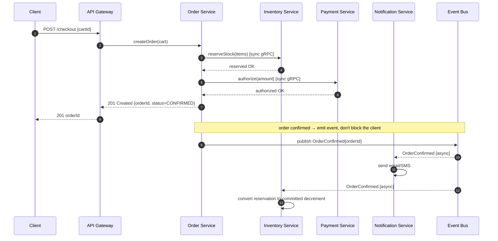
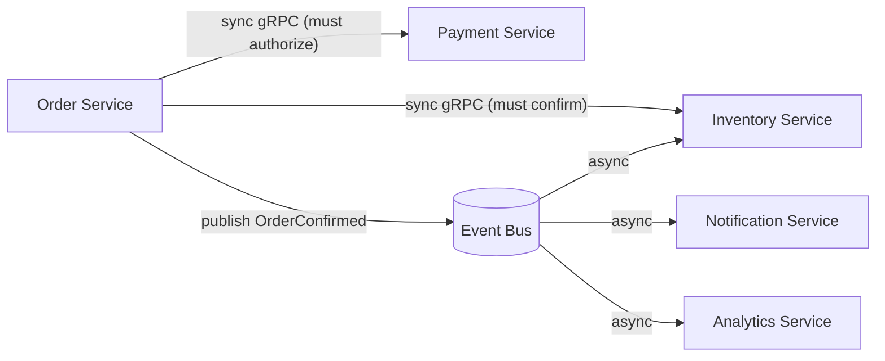
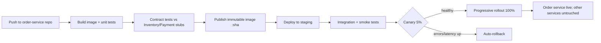

# Microservices — Middle

<!-- level-focus -->
At middle level, focus on this question:

> Where does **Microservices** belong in a maintainable component, and which trade-off selects the design?

Use the smallest realistic scenario that exposes the decision and its failure behavior.
---

## 2. Finding Service Boundaries: Business Capabilities and Bounded Contexts

The single most common failure in microservices is cutting services by **technical layer** (a "controllers service", a "database service", a "utils service") or by **noun** (an "Order object service" that every other team reaches into). Both produce services that cannot change independently — which defeats the entire point.

Two complementary heuristics get you good boundaries:

### 2.1 Business capabilities (Amazon / team-topology angle)

A **business capability** is something the business *does*, phrased as a verb-noun the business would recognize: "accept payments", "manage inventory", "ship orders", "recommend products". Each capability is owned end to end by one team, including its data and its on-call. This aligns with Conway's Law: your service graph will mirror your org chart whether you plan it or not, so plan it.

Test for a good capability boundary:
- Could one team own this without weekly cross-team coordination to ship a feature?
- Does the capability have a stable, meaningful name that predates the software?
- Does it have its own lifecycle (it changes for its own reasons, not because another capability changed)?

### 2.2 Bounded contexts (Domain-Driven Design angle)

A **bounded context** (Evans, DDD) is a boundary within which a domain term has one precise, consistent meaning. The word "Customer" means different things in different contexts, and that is the *signal* for a boundary — not a problem to normalize away.

- In **Sales**, a Customer is a lead with a pipeline stage and a contact history.
- In **Billing**, a Customer is a legal entity with a tax ID, a payment method, and an invoice address.
- In **Support**, a Customer is a set of tickets and an entitlement tier.

Forcing one shared `customers` table to serve all three couples the three teams forever: a column Billing needs is a migration Sales and Support must review and deploy around. Instead, each context keeps its **own model of Customer**, keyed by a shared `customer_id`, and they exchange only the fields they need. See Martin Fowler's canonical write-ups: [Bounded Context](https://martinfowler.com/bliki/BoundedContext.html) and the [Microservices](https://martinfowler.com/articles/microservices.html) article.

### 2.3 The two heuristics agree

Business capabilities tell you *what* the services are; bounded contexts tell you *where the model seams are* and thus where the network boundary should fall. When a capability and a context coincide, you have found a strong boundary. When they conflict, dig deeper — usually one capability actually hides two contexts.

> Rule of thumb: **draw the boundary where the language changes.** If the same word means two things on either side of a line, that line is a service boundary.

---

## 3. Worked Decomposition: An E-Commerce Domain

Take a monolithic shop with a single `shop` database and these tables jammed together: `users`, `products`, `inventory`, `carts`, `orders`, `order_items`, `payments`, `shipments`, `notifications`. The monolith has one deploy, and the payments team cannot ship a refund fix without a full regression of the catalog code.

Apply the heuristics. The verbs the business recognizes: *browse the catalog, hold stock, check out, take payment, ship, notify.* Map each to a bounded context with its own model and store:

| Service | Business capability | Owns (its data) | Does NOT own |
|---------|--------------------|-----------------|--------------|
| **Catalog** | Present products | products, categories, descriptions, prices | stock counts, orders |
| **Inventory** | Track available stock | SKU quantities, reservations | product descriptions |
| **Cart** | Hold a pending selection | cart lines, keyed by session/user | prices at checkout, orders |
| **Order** | Record a purchase | orders, order_items (snapshot of price+qty) | live stock, payment auth |
| **Payment** | Move money | payment intents, transactions, refunds | order line detail |
| **Shipping** | Deliver goods | shipments, carriers, tracking | payment, catalog |
| **Notification** | Tell the customer | templates, delivery log, channel prefs | any business entity |

Notice the deliberate duplication: **Order stores a price snapshot** rather than joining to Catalog at read time. Prices change; an order must remember what the customer actually paid. This is not a normalization bug — it is a context boundary. Catalog owns *current* price; Order owns *price-at-purchase*. They are different facts.

The checkout flow now spans several services. Here is the happy path, showing both synchronous request/response and asynchronous events:

Read the diagram as a boundary decision, not just a call graph. Steps 3–7 (reserve stock, authorize payment) are **synchronous** because the client is waiting and the answer changes what we tell them — you cannot confirm an order you could not pay for. Steps 9–12 (notify the customer, finalize the stock decrement) are **asynchronous** because they must happen but the client does not need to wait for them, and they must survive the Notification service being briefly down.

---

## 4. Database-per-Service and Why Shared DBs Are an Anti-Pattern

**The rule: each service owns its data privately, and the only way in is through that service's API or its published events.** No other service connects to its database. This is the load-bearing constraint of microservices — break it and you have a distributed monolith with all the network cost and none of the independence.

### 4.1 Why a shared database couples everything

Suppose Order and Payment both read and write the same `payments` table in a shared DB.

- **Schema coupling.** Payment wants to add a `refund_reason` column and split `status` into two fields. That is now a coordinated migration: both teams must review it, both deploys must be sequenced, and a rollback of one drags the other. The independent-deploy property is gone.
- **Hidden write paths.** Order "just quickly" updates `payments.status` directly during a fix. Now Payment's invariants (a refund cannot exceed the captured amount) live in *two* codebases, and one of them will drift. Bugs become un-ownable.
- **Blast radius.** A runaway query or lock from one service degrades every service on that database. There is no isolation.
- **Scaling lock-in.** Order is read-heavy and wants read replicas; Payment is write-heavy and consistency-critical. On a shared DB you cannot tune them independently — you get one storage engine, one instance class, one backup policy for incompatible workloads.

### 4.2 Comparison

| Dimension | Database-per-service | Shared database |
|-----------|--------------------|-----------------|
| Schema changes | Local; deploy independently | Coordinated migration across teams |
| Encapsulation | Data hidden behind API/events | Any service can read/write any table |
| Failure isolation | One DB down ≠ all services down | One bad query degrades everyone |
| Storage choice | Per service (SQL, KV, search, ...) | One engine for all workloads |
| Independent scaling | Yes (per service) | No (shared instance) |
| Cross-service query | Hard — must call APIs / join in code | Easy — a single SQL JOIN |
| Cross-service transaction | No 2PC; use sagas | Trivial ACID transaction |
| **Verdict** | **Enables independence** | **Distributed monolith** |

### 4.3 The costs you take on (and how to pay them)

Database-per-service is not free — the shared-DB row above is genuinely easier for *those two rows*. You are trading query convenience for independence. Two costs dominate:

- **No cross-service JOINs.** You cannot `JOIN orders ON products` across service boundaries. Options: (a) **API composition** — the caller fetches from each service and joins in memory (fine for small result sets, an N+1 trap for large ones); (b) **data duplication via events** — Order keeps the product fields it needs (name, price snapshot), kept fresh by consuming Catalog's `ProductUpdated` events. Duplication is the standard, correct answer at scale.
- **No cross-service ACID transaction.** "Reserve stock AND charge card AND create order" cannot be one database transaction because it spans three databases. You use a **saga**: a sequence of local transactions, each with a compensating action (release the reservation, void the authorization) if a later step fails. Sagas are covered in depth in `senior.md`; at this tier, know that the atomic-transaction guarantee is gone and eventual consistency plus compensation is the replacement.

> Golden test for a boundary violation: if a code review adds a connection string for service B's database into service A, reject it. The fix is an API call or an event subscription.

---

## 5. Inter-Service Communication: Sync vs Async

Two families, and mature systems use both. The choice per interaction is driven by one question: **does the caller need the answer to continue, right now?**

### 5.1 Synchronous request/response (REST, gRPC)

The caller blocks until the callee replies. Use it when the result changes what happens next: validating stock before confirming an order, authorizing a payment, fetching data to render a page.

- **REST/JSON over HTTP** — universal, human-readable, easy to debug with `curl`, great at the public edge. Cost: verbose payloads, no built-in contract, one round trip per call.
- **gRPC/Protobuf over HTTP/2** — binary, schema-first (`.proto` is an enforced contract), multiplexed streams, code-generated clients. Roughly 3–10× more efficient than JSON for chatty internal traffic. Cost: not browser-native, harder to eyeball on the wire. This is the default for **internal** service-to-service calls at scale.

The danger of sync calls is **temporal coupling and failure propagation**: if Order calls Inventory calls Pricing synchronously and Pricing is slow, the latency and the failure ripple back up the whole chain. Every synchronous call must therefore carry a **timeout**, and a chain of them needs circuit breakers and retries with backoff (see `senior.md` for resilience patterns). A synchronous call is a small piece of your availability rented from another team.

### 5.2 Asynchronous messaging (events, queues)

The caller publishes a message and moves on; one or more consumers process it later. Use it when the work must happen but the caller does not need to wait, or when several services must react to the same fact.

- **Event-driven / pub-sub** (Kafka, SNS+SQS, RabbitMQ): the producer emits a fact like `OrderConfirmed` and does not know or care who consumes it. Notification, Inventory finalization, and Analytics all subscribe independently. Adding a fourth consumer requires **zero change** to the producer — this is the property that makes async so good for decoupling.
- **Point-to-point queues**: one producer, one logical consumer group, used for work distribution.

Async buys you **temporal decoupling** (the consumer can be down and catch up later — messages buffer in the broker) and **fan-out** (many reactions to one event). It costs you **eventual consistency** (the effect is not immediate), **harder debugging** (no single stack trace across the flow — you need correlation IDs and tracing), and the need for **idempotent consumers**, because brokers deliver at-least-once and will occasionally redeliver.

### 5.3 Comparison

| Aspect | Synchronous (REST / gRPC) | Asynchronous (events / queues) |
|--------|--------------------------|-------------------------------|
| Caller waits? | Yes — blocks for the reply | No — fire and continue |
| Coupling | Temporal: both must be up now | Decoupled: consumer can lag/recover |
| Result available | Immediately | Eventually |
| Failure behavior | Propagates up the call chain | Buffered in broker; retried |
| Best for | Read a value, validate, must-know-now | Notify, fan-out, background work |
| Consistency | Read-your-write easy | Eventual; needs idempotency |
| Debuggability | One request → one trace | Needs correlation IDs + tracing |
| Add a new consumer | Change the caller | Zero change to producer |
| Typical tech | HTTP+JSON (edge), gRPC (internal) | Kafka, SNS/SQS, RabbitMQ |

> Heuristic: **use sync for queries and must-succeed-now commands; use async for facts that have already happened.** "Get the price" is sync. "The order was confirmed" is async.

---

## 6. The API Gateway Edge

Clients (browser, mobile) must not call twenty internal services directly. That would leak your topology, force every client to know service addresses, and duplicate cross-cutting concerns (auth, rate limiting, TLS) in every client. The **API gateway** is a single entry point that sits at the edge and fronts the service mesh.

Responsibilities of the gateway:

- **Routing** — map external paths (`/api/orders/*`) to internal services (Order service), so clients see one stable API surface while services move and split behind it.
- **Authentication / authorization** — validate the JWT/session once at the edge; pass a trusted, verified identity inward. Internal services then trust the network boundary instead of re-implementing login.
- **TLS termination** — one place to manage certificates.
- **Rate limiting and throttling** — protect the fleet from abusive clients centrally.
- **Aggregation / composition** — for a mobile home screen, one gateway call can fan out to Catalog, Cart, and Recommendations and stitch the responses, saving the client N round trips. When this aggregation gets client-specific, teams adopt the **Backend-for-Frontend (BFF)** variant: a dedicated gateway per client type (web BFF, mobile BFF), each shaping responses for its client.
- **Cross-cutting concerns** — request logging, tracing header injection (the correlation ID that ties an async flow together), response caching, protocol translation (accept REST from clients, speak gRPC internally).

What the gateway is **not**: it is not where business logic lives. Keep it thin. A gateway that starts making pricing decisions has quietly become a new monolith that every team must change to ship. Its job is edge concerns and routing, nothing more.

---

## 7. Service Discovery and Configuration

Once services scale horizontally and get rescheduled by an orchestrator, their instances come and go and their IPs are not stable. Two supporting systems make the fleet workable.

### 7.1 Service discovery

Order needs to reach *an* instance of Inventory, but instances are ephemeral — an orchestrator kills and restarts them, autoscaling adds and removes them. Hard-coding IPs is impossible. **Service discovery** answers "where is a healthy Inventory instance right now?"

- **Client-side discovery**: the caller queries a registry (Consul, Eureka, etcd) for the list of healthy Inventory instances and load-balances across them itself.
- **Server-side discovery**: the caller hits a stable virtual address; a load balancer or the platform (Kubernetes `Service` + kube-dns, a service mesh sidecar) resolves it to a live instance. This is the common case today — the caller just resolves `inventory.svc.cluster.local` and the platform handles the rest.

Discovery is tied to **health checks**: only instances passing their health probe are eligible targets, so a crashed instance is removed from rotation automatically. Without discovery + health checks, every deploy or crash would break callers holding stale addresses.

### 7.2 Configuration

Each service needs environment-specific settings (feature flags, timeouts, downstream endpoints) and secrets (DB credentials, API keys). The rules that matter at this tier:

- **Config is not baked into the image.** The same immutable artifact runs in dev, staging, and prod, configured by environment (12-factor style). This is what lets you promote *the exact bytes you tested* to production.
- **Secrets live in a secret manager** (Vault, AWS Secrets Manager, sealed K8s secrets), never in the repo, never in the image, injected at runtime.
- **Centralized config** (Consul KV, Spring Cloud Config, K8s ConfigMaps) lets you change a timeout or flip a flag without a redeploy — but audit and version it, because a bad config push is now a fleet-wide incident with no code diff to blame.

---

## 8. Independent Deploy: CI/CD per Service

The payoff of all the above: **each service has its own repository (or its own path in a monorepo), its own pipeline, and its own release cadence.** The Payment team ships a refund fix at 2pm without touching, testing, or coordinating with Catalog. This is the property that a shared database or a fat gateway silently destroys — which is why the earlier constraints exist.

A per-service pipeline for our Order service:

Key properties of a mature per-service pipeline:

- **Independently triggered.** Only a change in `order-service` runs the Order pipeline. Nothing else rebuilds or redeploys.
- **Immutable, versioned artifacts.** The pipeline builds an image tagged by commit SHA and *promotes that same image* through staging to prod. You never rebuild for prod — that would test a different artifact than you deployed.
- **Contract tests, not just integration.** Because services deploy independently, you cannot rely on integration testing the whole system on every commit. Consumer-driven contract tests (Pact-style) verify that Order still honors the request/response shape Payment and Inventory expect, *without* deploying them together. This is how you catch breaking changes before they reach a live consumer.
- **Backward-compatible releases.** During a rollout, old and new versions of a service run simultaneously behind the load balancer. API and event schema changes must be additive (expand/contract): add the new field, deploy, migrate consumers, then remove the old — never break the wire in a single deploy.
- **Safe rollout strategy.** Canary or blue-green, with automated health/latency gates and **automatic rollback**. Because only one service changed, blast radius and rollback are scoped to that service.
- **Independent database migrations.** Each service migrates its own schema as part of its own pipeline, using expand/contract so a mid-rollout mixed-version fleet stays correct.

The organizational result is the whole point of microservices: **many small, fast, independent release trains instead of one big coordinated release.** If your "microservices" still require a coordinated release across services to ship a feature, revisit sections 2 and 4 — your boundaries or your data ownership are wrong.

---

## 9. Middle Checklist

- [ ] Boundaries drawn by business capability / bounded context, not by technical layer or shared noun.
- [ ] "Draw the line where the language changes" applied — duplicated models (e.g., price snapshot) are intentional, not bugs.
- [ ] Every service owns its data privately; no service holds another service's connection string.
- [ ] Cross-service reads solved by API composition or event-driven duplication — no cross-service JOINs.
- [ ] Cross-service writes use sagas + compensation, not distributed transactions.
- [ ] Each interaction consciously chosen sync (must-know-now) vs async (already-happened fact).
- [ ] Every synchronous call has a timeout; every async consumer is idempotent (at-least-once delivery assumed).
- [ ] API gateway handles routing/auth/TLS/rate-limiting at the edge and stays thin (no business logic).
- [ ] Service discovery + health checks route only to healthy instances; addresses are never hard-coded.
- [ ] Config externalized from the image; secrets in a secret manager, never in the repo.
- [ ] Each service has its own pipeline: independently triggered, immutable SHA-tagged artifact, contract tests, canary + auto-rollback, self-owned migrations.
- [ ] Test: can one team ship a feature without a coordinated cross-service release? If no, the boundaries are wrong.

*Next step:* [Microservices — Senior](senior.md)

---

## Apply it

1. Find a real component where **Microservices** affects an interface or dependency.
2. Write two plausible choices and the constraint that favors each one.
3. Make the smallest reversible change at that boundary.
4. Exercise the component alone, then exercise the integrated flow.
5. Keep the decision note with the evidence that selected the option.

## Verify your work

- A focused check proves the local behavior.
- An integrated check proves callers and dependencies still agree.
- Logs, traces, compiler output, or benchmarks expose the boundary.
- Reverting the change restores the previous behavior without unrelated edits.

## Review questions

- Which boundary is most affected by Microservices?
- What constraint would make you choose the alternative design?
- How would you isolate a local defect from an integration defect?
- What evidence shows that the change remains maintainable?
