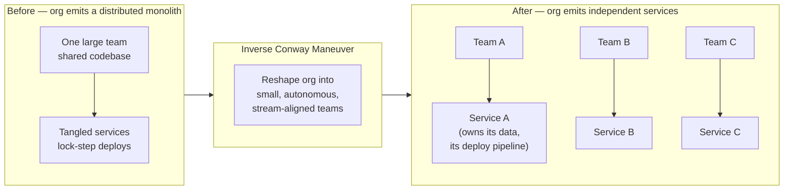
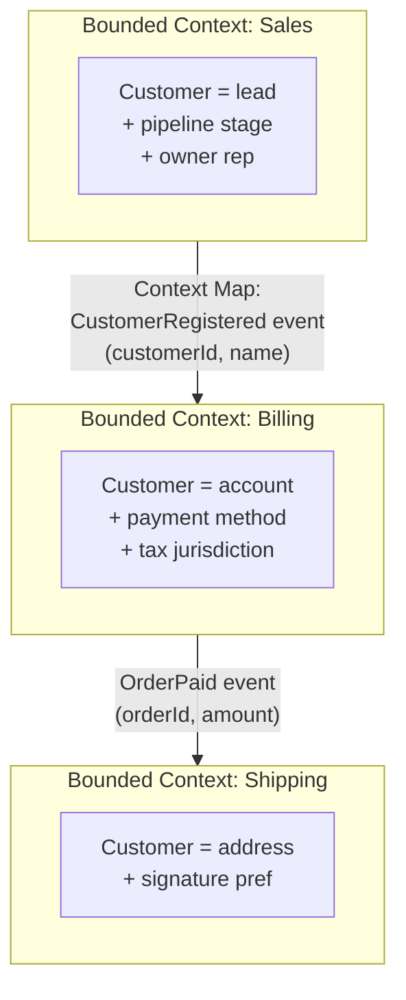
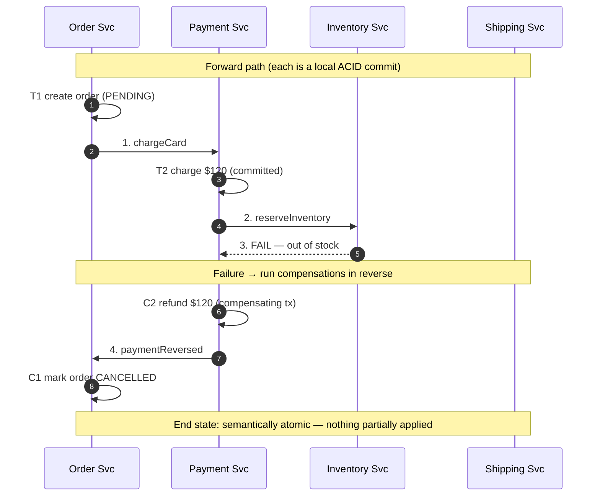
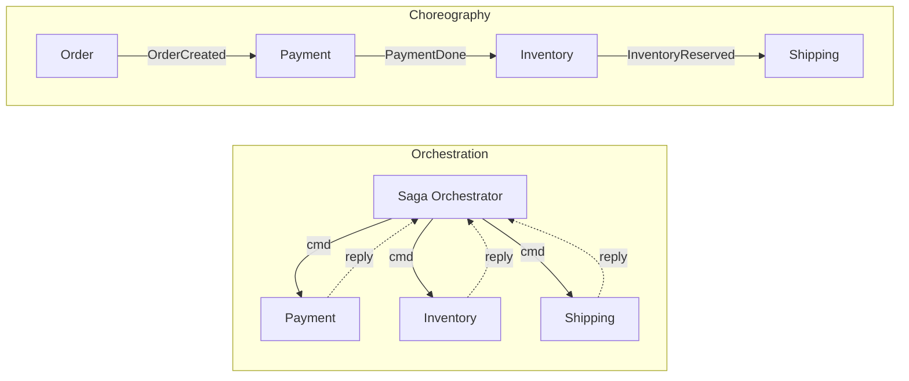
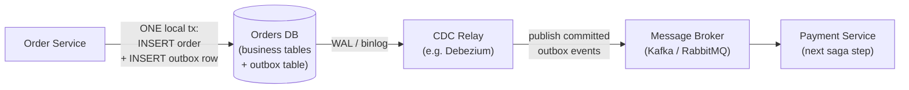

# Microservices — Professional

<!-- level-focus -->
At professional level, focus on this question:

> How should teams adopt and operate **Microservices** with measurable outcomes and limited coordination?

Use the smallest realistic scenario that exposes the decision and its failure behavior.
## 1. Conway's Law and the Inverse Conway Maneuver

Melvin Conway's 1968 paper *How Do Committees Invent?* states the observation now known as **Conway's Law**:

> "Any organization that designs a system (defined broadly) will produce a design whose structure is a copy of the organization's communication structure." — Conway, 1968

The mechanism is not mystical. An interface between two software modules is also a **negotiation** between the two groups that own them. Negotiation is expensive, so groups minimize it: they harden the interface, batch changes, and route around each other. The communication *bandwidth* between teams therefore caps the *coupling* they can sustain between their modules. Two components maintained by one team can share a database, a deploy, and a mental model for free; two components split across two teams that talk once a sprint will inevitably develop a coarse, versioned, defensive boundary between them — a service boundary — whether or not anyone drew one on a diagram.

The consequence for microservices is direct and unforgiving:

```text
If your org has  N teams that rarely coordinate,
you will get     N services (roughly), no matter what architecture you "chose".

If you draw M service boundaries but staff them with K << M teams,
the services will silently re-merge: shared libraries, shared databases,
lock-step deploys — a "distributed monolith" that has all the operational
cost of microservices and none of the independence.
```

**The Inverse Conway Maneuver** (coined by Thoughtworks; popularized in Skelton & Pais, *Team Topologies*, 2019) turns the law from a diagnosis into a design tool. Instead of accepting the architecture your current org emits, you **restructure the org first** to the communication pattern you *want* the architecture to have, then let Conway's Law produce that architecture as a side effect:



The practical rule that falls out: **a service should be ownable by exactly one team**, and that team's cognitive-load budget (again, *Team Topologies*) sets the service's maximum size. A service too big for one team will fracture along its internal fault lines the moment two sub-groups form; a service too small starves a team and generates cross-service chatter that reintroduces the coordination you were trying to remove. Sizing is an org question first.


---

## 2. Bounded Contexts as the Principled Service Boundary

Conway's Law tells you boundaries will exist and roughly where teams push them. It does **not** tell you *where the boundaries should be*. That criterion comes from Eric Evans, *Domain-Driven Design* (2003): the **bounded context**.

A bounded context is the scope within which a particular **domain model** — and the **ubiquitous language** that names it — is internally consistent and unambiguous. The word `Customer` means one precise thing inside the Sales context (a lead with a pipeline stage) and a *different* precise thing inside the Billing context (an account with a payment method and a tax jurisdiction) and a *third* thing inside Shipping (a delivery address and a signature preference). Trying to build one universal `Customer` model that satisfies all three produces a bloated, contradiction-riddled schema that every team fears to change. DDD's answer is to **stop** — let each context keep its own model, and define explicit translation (an *anti-corruption layer*) at the seams.

The critical insight for microservices:

> A microservice boundary should coincide with a **bounded context** boundary. The context boundary is where the *language changes meaning* — and that is exactly where you want an explicit, versioned interface rather than an implicit, leaky one.



Two heuristics sharpen this:

- **The language test.** Get domain experts in a room. Wherever a single term forces the qualifier "well, it depends which team you ask," you have found a context boundary — cut there.
- **The transaction test.** Data that must change together within one ACID transaction almost always belongs in **one** bounded context (one service, one database). If your proposed boundary would split a required atomic invariant across two services, either the boundary is wrong or you have accepted the saga tax of Section 5. Choose deliberately, not by accident.

A boundary drawn on a *technical* seam ("all the caching code," "the utils service") rather than a *domain* seam guarantees pain: technical seams cut across bounded contexts, so a single business change touches many services — the worst of both worlds. **Boundaries follow the domain; the domain follows the language; the language reveals the contexts.**


---

## 3. Why There Is No Distributed ACID at Scale

In a monolith, a business operation that touches five tables is one database transaction. **Atomicity**, **Consistency**, **Isolation**, and **Durability** come free from the single database. Split those five tables across five services with five databases, and that guarantee evaporates. The naive fix — wrap the five services in a distributed transaction — is where the theory bites.

The classical protocol for distributed atomicity is **Two-Phase Commit (2PC)**:

```text
2PC (Gray, 1978):
  Phase 1 (prepare): coordinator asks every participant "can you commit?"
                     each participant locks resources, writes a prepare record, votes YES/NO.
  Phase 2 (commit):  if all voted YES, coordinator says COMMIT; else ABORT.
```

Why 2PC does not scale for online microservices:

1. **It is a blocking protocol.** Between voting YES and hearing the decision, a participant holds locks and **cannot** unilaterally proceed. If the coordinator crashes at that instant, participants are stuck holding locks indefinitely — the *blocking* problem. Locks held across service-to-service network round-trips destroy throughput.
2. **It sacrifices availability under partition (CAP).** 2PC is a **CP** protocol: if the coordinator or any participant is partitioned during the prepare window, the transaction cannot make progress. For a high-availability user-facing system, refusing to serve because one downstream is unreachable is unacceptable.
3. **Latency compounds.** Two synchronous round-trips to *every* participant, gated on the slowest one, add tail latency directly to the user request.
4. **Not all resources support it.** Many datastores, queues, and third-party APIs simply do not expose a prepare/commit handle. You cannot enlist a payment gateway in your XA transaction.

The design conclusion, forced by CAP: at scale you **give up distributed ACID** and choose availability + partition tolerance, accepting **eventual consistency** as the price. Correctness is no longer a property the database hands you; it is a property **you must construct** out of eventually-consistent parts — with sagas and idempotency. That is the pivot to BASE.


---

## 4. ACID vs BASE

**BASE** — *Basically Available, Soft state, Eventual consistency* — is the deliberate opposite of ACID, coined by Pritchett (2008) to name what large-scale systems actually do.

| Dimension | ACID (single-node / monolith) | BASE (distributed microservices) |
|---|---|---|
| Consistency model | **Strong** — every read sees the latest committed write | **Eventual** — reads may be stale; replicas converge over time |
| Availability under partition | Sacrificed (CP) — refuse rather than diverge | Prioritized (AP) — always answer, reconcile later |
| Atomicity across the operation | Guaranteed by the DB, all-or-nothing | **Constructed** by the application via sagas + compensations |
| Isolation | Serializable / snapshot; no partial states visible | **None across services** — intermediate states are observable |
| Latency | Higher — coordination on the write path | Lower — commit locally, propagate asynchronously |
| Failure model | Transaction rolls back cleanly | Forward-recovery: compensate the steps already done |
| Reasoning burden | On the database | **On the engineer** — must design invariants explicitly |
| Typical fit | One bounded context, one datastore | Multi-service business workflows |

The trade is stark and worth internalizing: **ACID moves the hard reasoning into the database; BASE moves it into your code.** Microservices do not eliminate the consistency problem — they relocate it from the storage engine (where it was solved for you) into the application (where you now own it). Sagas are the primary tool for that ownership.


---

## 5. Sagas: Long-Lived Transactions with Compensating Actions

The **saga** pattern (Garcia-Molina & Salem, 1987; adapted for microservices at microservices.io) replaces one distributed ACID transaction with a **sequence of local ACID transactions**, one per service. Each local transaction commits independently and publishes an event or sends a command that triggers the next step. If any step fails, the saga does **not** roll back (you cannot roll back an already-committed local transaction); instead it runs **compensating transactions** — semantic inverses — for every step that already succeeded, in reverse order.

The formal properties differ from a database transaction:

- **Atomicity is *semantic*, not physical.** The saga guarantees either "all steps completed" *or* "all completed steps were compensated." It does **not** guarantee isolation — intermediate states are visible to concurrent readers (a soft-state window).
- **Compensations must be *semantic inverses*, not undos.** You cannot un-charge a card by deleting a row; you issue a **refund**. You cannot un-send an email; you send a **cancellation notice**. The compensation is itself a real business action with its own audit trail.
- **Every step must be *idempotent*.** Retries are inevitable in an at-least-once world, so `reserveInventory` and its compensation `releaseInventory` must both tolerate being applied twice with no additional effect (guard with an idempotency key).
- **Compensations may need to be *retriable forever* (or escalate).** A compensation that itself fails cannot simply give up — that would leave the system in an inconsistent state. It retries with backoff and, on exhaustion, raises an operator alert.

Worked example — an e-commerce checkout saga (Order → Payment → Inventory → Shipping), showing the **happy path** and a **compensation cascade** when Inventory fails:



If Inventory had **succeeded**, the saga would have continued: `4. createShipment` → `T4 shipment scheduled` → `5. orderConfirmed` → `T1' mark order CONFIRMED`. The distinguishing feature is that at no point does any service hold a lock waiting on another service — each commits locally and moves on, which is precisely why sagas scale where 2PC does not.

A pivotal step deserves a name: the **pivot transaction** is the point after which the saga can no longer be compensated and must go forward to completion (e.g., once the physical package is handed to the carrier, there is no compensation — only a separate returns process). Steps before the pivot are *compensatable*; steps after are *retriable*. Identifying the pivot is part of designing the saga.


---

## 6. Orchestration vs Choreography

Sagas come in two coordination styles. In **orchestration**, a central *saga orchestrator* (a dedicated service or workflow engine) issues commands to participants and decides the next step. In **choreography**, there is no central brain — each service reacts to events emitted by the previous service and emits its own, and the saga *emerges* from the chain of subscriptions.



| Dimension | Orchestration | Choreography |
|---|---|---|
| Control flow | Centralized in the orchestrator | Distributed across event subscriptions |
| Where the logic lives | One place — the workflow is explicit and readable | Spread across N services — the workflow is emergent |
| Coupling | Services coupled to the orchestrator (commands) | Services coupled to event *contracts*, not to each other |
| Adding a step | Edit the orchestrator | Add a subscriber; other services unchanged |
| Cyclic-dependency risk | Low — hub-and-spoke topology | **High** — event chains can loop; hard to see |
| Observability of the saga | Easy — orchestrator holds full state, easy to trace | Hard — no single place shows "where is this saga now?" |
| Single point of failure | Orchestrator (mitigate with a durable workflow engine) | None central, but harder to reason about globally |
| Best for | Complex flows, many steps, strong audit/compliance needs | Simple flows, ≤3–4 steps, maximally decoupled teams |

Rule of thumb: **choreography for a handful of loosely-coupled steps; orchestration once the flow has branches, timeouts, and compensation logic that a human needs to read.** Beyond a few services, the "where is this saga?" question makes choreography's lack of a central state machine a genuine operational liability — which is why durable orchestrators (Temporal, AWS Step Functions, Camunda) exist.


---

## 7. The Dual-Write Problem and the Transactional Outbox

Every saga step needs to do **two** things atomically: **(a)** commit a local database change, and **(b)** publish an event/message so the next step runs. The trap is that these are **two different systems** — your database and your message broker — and there is no transaction that spans both. This is the **dual-write problem**:

```text
// BROKEN — two writes, no shared transaction:
db.save(order)                 // (a) succeeds
broker.publish(OrderCreated)   // (b) crashes here

Result: order committed, event never sent → the saga stalls forever.
Reverse ordering is equally broken:
broker.publish(OrderCreated)   // (b) succeeds
db.save(order)                 // (a) crashes → downstream acts on an order that does not exist.
```

No ordering of two non-transactional writes is safe: whichever you do first can be the one that survives a crash while the second is lost. You **cannot** solve this with retries or careful ordering alone.

The **Transactional Outbox** pattern (microservices.io) fixes it by making the two writes into **one** local ACID transaction. Instead of publishing to the broker, the service writes the event into an **`outbox` table in the same database** as the business data, inside the same transaction. A separate **message relay** — typically driven by **Change Data Capture (CDC)** tailing the database's write-ahead log (e.g., Debezium reading the WAL/binlog) — reads committed outbox rows and publishes them to the broker, then marks them dispatched.



Why this is correct:

- **Atomicity restored.** The business row and the outbox row commit together or not at all — a single-database ACID transaction. There is no window where one exists without the other.
- **Guaranteed at-least-once delivery.** The relay only reads *committed* outbox rows and retries publishing until the broker acknowledges. A crash mid-publish just re-reads the un-dispatched row — the event is never lost.
- **At-least-once ⇒ consumers must be idempotent.** The relay may publish a row twice (crash after publish, before marking dispatched). Every consumer therefore deduplicates on the event's idempotency key. Exactly-once *effect* is achieved by at-least-once delivery **plus** idempotent consumption — not by the broker.
- **Ordering.** CDC preserves commit order per key, so per-aggregate event order is maintained without a distributed lock.

The **polling-publisher** variant (a job `SELECT`s undispatched outbox rows on an interval) avoids CDC infrastructure but adds latency and DB load; CDC via log-tailing is preferred at scale because it imposes near-zero read overhead on the primary. The dual counterpart on the read side is the **idempotent consumer** / **inbox** pattern: consumers record processed message IDs in an inbox table, inside the same transaction as their state change, so a redelivered message is a no-op.


---

## 8. The Availability Chain: Why 0.999^N Hurts

The most under-appreciated tax of microservices is **serial availability multiplication**. If a single user request must call `N` services **in series**, and each service is independently available with probability `a`, then — assuming independent failures — the availability of the *whole request* is the **product**:

```text
A_chain = a₁ · a₂ · … · a_N
        = a^N        (when all N services share availability a)
```

This is just the probability that *every* link in the chain is up simultaneously. Each dependency you add can only **lower** the product (multiplying by a number ≤ 1). Work the arithmetic with the common "three nines" target, `a = 0.999`:

```text
Per-service availability a = 0.999  (0.1% failure ⇒ ~8.77 h/yr downtime each)

N =  1:  0.999^1  = 0.999000   → 99.9000%   ≈  8.77  h/yr down
N =  2:  0.999^2  = 0.998001   → 99.8001%   ≈ 17.51  h/yr down
N =  3:  0.999^3  = 0.997003   → 99.7003%   ≈ 26.25  h/yr down
N =  5:  0.999^5  = 0.995010   → 99.5010%   ≈ 43.71  h/yr down
N = 10:  0.999^10 = 0.990045   → 99.0045%   ≈ 87.24  h/yr down  (3.6 days!)
N = 20:  0.999^20 = 0.980190   → 98.0190%   ≈ 173.6  h/yr down
N = 50:  0.999^50 = 0.951207   → 95.1207%   ≈ 427.4  h/yr down
```

A useful **first-order approximation**: for small failure probability `p = 1 − a`, the chain's failure probability is approximately `N·p` (since `(1−p)^N ≈ 1 − Np` when `Np ≪ 1`). So **each service you add in series adds roughly `p` to the total failure budget** — with `p = 0.001`, ten services means ~1% failure, i.e., **you drop from three nines to two nines just by chaining ten "three-nines" services.** Your fan-out has quietly *ten-times-worsened* your effective downtime, and no individual team's dashboard shows a problem — each service is meeting its own 99.9% SLO.

The lesson is not "avoid microservices" but "**count your synchronous serial hops and budget for the product.**" A request that fans out to 30 downstreams on its critical path cannot be more available than `0.999^30 ≈ 0.970` — 97%, or ~11 days of downtime a year — no matter how heroic each team is. The math forces architectural choices, covered next.


---

## 9. Countermeasures to the Availability Multiplication

The `a^N` result assumes **serial, synchronous, mandatory** dependencies. Each of those three words is a lever:

1. **Reduce N on the critical path.** Fewer synchronous hops per request is the single biggest win. Merge chatty co-changing services (they were probably one bounded context), and move non-essential work off the request path.

2. **Make calls parallel, not serial, where independent.** Parallel fan-out does not change the *product* for "all must succeed," but it collapses **latency** from the *sum* of hops to the *max* of hops, shrinking the tail that causes timeout-induced failures.

3. **Make dependencies optional via graceful degradation.** If a service is *optional* (a recommendation panel), a failure there should degrade the response, not fail it. An optional dependency **drops out of the availability product entirely** — that is the highest-leverage move. Turn "AND" dependencies into "best-effort" ones wherever the product allows.

4. **Add redundancy so per-hop `a` rises.** Replacing one instance with a pool behind a load balancer raises each service's own availability. If a single instance is `0.99` and you run two independent instances, the *pair* is `1 − (1−0.99)² = 0.9999` — availability that **compounds up** with redundancy exactly as it **compounds down** with chaining. Push `a` toward `0.9999` and the `a^N` penalty softens dramatically.

5. **Break the failure-propagation with resilience patterns.** Timeouts, retries with backoff and jitter, **circuit breakers** (stop calling a known-dead dependency, fail fast to a fallback), and **bulkheads** (isolate thread/connection pools so one slow dependency cannot exhaust the caller). These convert a downstream outage from a *cascading* failure into a *contained, degraded* response — effectively raising the availability the caller *experiences* above the raw product.

6. **Prefer asynchrony for non-urgent steps.** A step done via a durable queue (outbox → broker) instead of a synchronous call removes that hop from the request-time availability product altogether: the work is guaranteed to happen *eventually*, decoupled from whether the downstream is up *right now*.

The unifying principle: **the availability of a request is the product over its *synchronous, mandatory, serial* dependencies — so shrink that set.** Every dependency you can make redundant, optional, parallel, or asynchronous is one you remove from the exponent.


---

## 10. Practitioner's Summary

- **Conway's Law is a constraint, not a slogan.** Architecture mirrors org communication structure; the **inverse Conway maneuver** reshapes the org to *emit* the architecture you want. A service should fit exactly one team's cognitive-load budget — sizing is an org decision before it is a technical one.
- **Cut boundaries at bounded contexts.** A DDD bounded context is where the ubiquitous language changes meaning; that seam is exactly where an explicit, versioned interface belongs. Boundaries on technical seams (a "utils service") guarantee cross-service changes and the worst of both worlds.
- **There is no distributed ACID at scale.** 2PC blocks, is CP (sacrifices availability under partition), and adds tail latency — unfit for user-facing fan-out. You choose availability and inherit **BASE**: eventual consistency, soft state, and correctness you must build yourself.
- **ACID vs BASE relocates the hard reasoning** from the database into your application code. Sagas are the primary tool for owning it.
- **Sagas** replace one distributed transaction with a sequence of local ACID transactions plus **compensating actions** (semantic inverses — refund, not delete). Atomicity is semantic, isolation is gone, every step is idempotent, and the **pivot transaction** separates compensatable from retriable steps.
- **Orchestration vs choreography**: centralize the flow (readable, observable, single point to harden) versus emergent event chains (maximally decoupled, but "where is this saga?" gets hard). Orchestrate once the flow branches and compensates.
- **The dual-write problem is unavoidable and unfixable by ordering.** The **transactional outbox** writes business row + event in one local transaction; a **CDC relay** tails the WAL/binlog and publishes at-least-once; **consumers must be idempotent** to get exactly-once *effect*.
- **The availability chain multiplies down:** `A_chain = a^N`. Three-nines services chained ten deep give `0.999^10 ≈ 0.990` — two nines, ~87 h/yr down, with every team's own dashboard still green. Rule of thumb: each serial hop adds ~`p` to the failure budget.
- **Fight the exponent by shrinking the set of synchronous, mandatory, serial dependencies** — via fewer hops, parallel fan-out, optional/degradable dependencies, per-hop redundancy, circuit breakers/bulkheads, and asynchrony through queues.

The through-line: microservices do not remove the problems of transactions, consistency, and availability — they **redistribute** them from the database and the single process out into the org chart, the network, and your application code. Mastery is knowing exactly which guarantee you gave up at each cut, and having a named pattern to reconstruct it.


---

## Apply it

1. Define the user or business outcome that **Microservices** should improve.
2. Assign one owner for code, contracts, operations, and incidents.
3. Split delivery into reversible increments that produce evidence early.
4. Publish responsibilities, escalation paths, and compatibility windows.
5. Stop or expand only when the agreed measures support that decision.

## Verify your work

- Each increment has an owner, rollback path, and observable exit condition.
- Adoption, reliability, delivery time, and coordination cost are measured.
- Incident and migration exercises prove that responsibility is executable.
- The old path is removed only after telemetry proves it is unused.

## Review questions

- Which measurable outcome justifies investing in Microservices?
- Which team owns the full lifecycle and incident response?
- What reversible increment produces the earliest useful evidence?
- Which exit condition proves that migration or adoption is complete?
