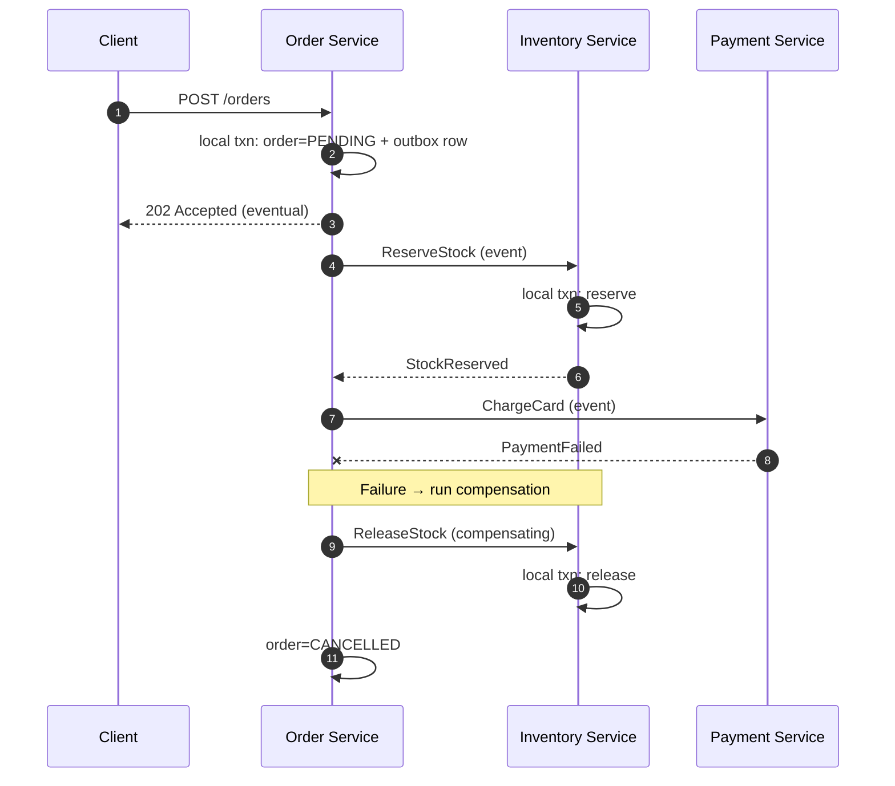
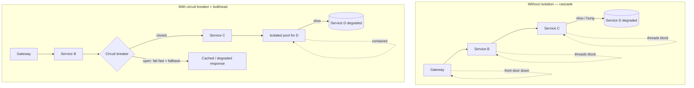

# Microservices — Senior

<!-- level-focus -->
At senior level, focus on this question:

> Which system invariant is affected by **Microservices** under failure, load, and change?

Use the smallest realistic scenario that exposes the decision and its failure behavior.
---

## 1. The Real Reason to Adopt Microservices

The defining property of a microservice is **independent deployability**. Everything else — small codebases, polyglot stacks, separate databases — is a means to that end. Fowler's litmus test is blunt: if you cannot deploy one service to production without lock-step releasing others, you do not have microservices, you have a distributed monolith.

Independent deployability buys three things, and only these three are load-bearing:

- **Team autonomy.** A team owns a service end-to-end — code, data, deploy, on-call — and can release on its own cadence without a cross-team release train. This is the direct organizational payoff, and it is why microservices scale *teams*, not requests. It is Conway's Law used deliberately: shape the software boundaries to match the team boundaries you want.
- **Independent scaling.** A checkout service under Black-Friday load can scale to 200 instances while the account-settings service stays at 2. In a monolith you scale the whole process, paying for the hottest path across every replica.
- **Independent fault + technology isolation.** A memory leak or a bad deploy in the recommendations service does not take down payments; a team can adopt a new runtime or datastore without a fleet-wide migration.

The critical framing: **microservices are a response to an organizational bottleneck, not a technical one.** The trigger is "our teams keep blocking each other on a shared deploy pipeline," not "our code is slow." If you have 8 engineers on one team, you almost certainly have neither the coordination cost that microservices relieve nor the operational maturity to pay their price. Newman's guidance is to reach for them when the *coordination cost of the monolith* — merge conflicts, release-train scheduling, blast-radius fear — exceeds the *coordination cost of the network* you're about to introduce.

---

## 2. The Costs You Pay Forever

Crossing a process boundary converts a function call — nanoseconds, in-process, transactional, type-checked at compile time — into a network call: milliseconds, partial-failure-prone, eventually consistent, and versioned at runtime. That conversion is irreversible complexity, and it applies to *every* interaction you split. The costs:

- **Network is unreliable and slow.** Every call can be slow, drop, duplicate, or arrive out of order. The eight fallacies of distributed computing now govern your correctness, not just your latency. A local method that never failed becomes an operation that must handle timeouts, retries, and idempotency.
- **No distributed ACID.** You lose cross-entity transactions the moment two entities live in two services with two databases. Atomic invariants that were a single `BEGIN…COMMIT` become sagas, compensating actions, and windows of visible inconsistency (see §4).
- **Eventual consistency becomes a product concern.** "The user updated their address but the shipping service still shows the old one for 400ms" is now a UX decision, not a bug. Product, not just engineering, has to reason about staleness.
- **Observability is mandatory, not optional.** A single user request fans out across N services. Without distributed tracing (correlation IDs propagated end-to-end), a p99 latency spike or an error is undebuggable — you cannot even locate which hop failed.
- **Testing gets harder and slower.** Unit tests are unchanged, but integration and end-to-end tests now require standing up a graph of services or maintaining contract tests / consumer-driven contracts to catch interface drift before it hits production.
- **Operational surface explodes.** N services × (deploy pipeline + monitoring + on-call + secrets + service discovery + network policy). Without CI/CD automation, containerization, and platform tooling already in place, the operational load alone will sink the effort.

Senior heuristic: **you must be "this tall" to ride.** Newman's prerequisites — automated deployment, monitoring you trust, rapid provisioning, and a culture that can handle production ownership — are not nice-to-haves. Attempting microservices without them yields all the costs and none of the autonomy.

---

## 3. Comparison: Monolith vs Modular Monolith vs Microservices

The most under-used option is the **modular monolith**: enforced module boundaries inside a single deployable. It captures much of the design discipline of microservices (clear ownership, explicit interfaces, low coupling) while deferring the network tax. Most systems should start here and extract services only where an independent-deployability or independent-scaling need is *proven*.

| Axis | Monolith (big ball of mud) | Modular Monolith | Microservices |
|---|---|---|---|
| Unit of deploy | Whole app | Whole app | Per service |
| Independent deployability | No | No | **Yes** (the whole point) |
| Team autonomy | Low — shared codebase & release | Medium — module ownership, shared pipeline | **High** — end-to-end ownership |
| Independent scaling | No (scale the whole process) | No | **Yes** (per service) |
| Cross-entity transactions | Local ACID | Local ACID | **Sagas / eventual consistency** |
| Refactoring across boundaries | Compiler-checked, cheap | Compiler-checked, cheap | Runtime-versioned, expensive |
| Latency of internal calls | ns (in-process) | ns (in-process) | ms (network) + partial failure |
| Operational surface | 1 pipeline, 1 runtime | 1 pipeline, 1 runtime | N × everything |
| Fault isolation | Low — one bug can crash all | Low–medium | **High** — blast radius per service |
| Debuggability | Single stack trace | Single stack trace | Requires distributed tracing |
| Team size where it fits | 1–2 teams | ~2–4 teams / clear modules | Many teams needing independence |
| Reversibility | — | **Easy** to extract a module later | **Hard** to merge services back |

The costs-vs-benefits ledger for adopting microservices:

| Benefit (only if prerequisites met) | Direct cost paid |
|---|---|
| Teams ship independently, no release train | Distributed-systems complexity in every interaction |
| Scale hot paths independently | No cross-service ACID → sagas, compensation, reconciliation |
| Fault isolation, per-service tech choice | Mandatory tracing, contract testing, service discovery |
| Smaller cognitive load per service | Larger cognitive load per *system* (emergent behavior) |
| Faster onboarding to one service | Harder to reason about end-to-end correctness |

**Rule of thumb:** benefits accrue to the *organization*; costs are paid by *engineering*. If the org isn't large enough to feel the benefit, engineering just eats the cost.

---

## 4. Data Consistency Across Services

The hardest, most permanent consequence of splitting a system is that **each service owns its own data and no one else touches that database directly.** A shared database across services is the single most common way a microservices effort collapses back into a distributed monolith (see §5): it re-couples deploy (a schema change breaks multiple services) and hides the coupling from every architecture diagram.

Once data is partitioned, a business operation that spans services — "place order" touching Order, Inventory, and Payment — can no longer be a single transaction. Two patterns carry the load:

**Saga** — a sequence of local transactions, each publishing an event that triggers the next; on failure, run **compensating transactions** to semantically undo prior steps (you cannot roll back a committed local transaction, only counteract it). Choreography (services react to events) is decentralized but the workflow is implicit and hard to trace; orchestration (a coordinator drives steps) centralizes the logic and is easier to reason about and monitor.

**Transactional outbox** — solves the dual-write problem: you cannot atomically write to your DB *and* publish to a broker. Instead, write the business row and an outbox row in the *same local transaction*; a relay reads the outbox and publishes to the broker (at-least-once). This makes "state changed" and "event emitted" atomic, and forces every downstream consumer to be **idempotent** because duplicates are guaranteed.

The senior takeaway: **eventual consistency is not a bug to be fixed but a property to be designed for.** The client gets `202 Accepted`, the UI reflects a pending state, and correctness is achieved over time via events and compensation — not instantly via a lock.

---

## 5. The Distributed-Monolith Anti-Pattern

A distributed monolith is the **worst of both worlds**: the operational cost and network fragility of microservices, plus the lock-step coupling of a monolith. You get the bill for distribution but none of the autonomy you bought it for. Fowler and Newman both single it out as the dominant failure mode of migrations. Tell-tale signs:

- **Lock-step deploys.** Service A's new release requires Service B to deploy at the same time. Independent deployability — the entire justification — is gone.
- **Shared database.** Multiple services read/write the same tables, so a schema change ripples across service boundaries and teams must coordinate migrations.
- **Chatty synchronous chains.** A single request cascades A→B→C→D synchronously; a bad boundary turned one in-process call into four network hops, multiplying latency and failure probability.
- **Shared client libraries with business logic.** A "common" library that every service must upgrade together re-introduces the coordinated release the migration was meant to kill.

Root cause is almost always **boundaries drawn along technical layers rather than business capabilities.** Splitting into "controller service," "logic service," "data service" guarantees every request traverses all three and every change touches all three. Correct boundaries follow business capabilities / bounded contexts (Order, Payment, Inventory), so that most changes and most requests stay inside one service. A high ratio of cross-service calls per request is the metric that exposes bad boundaries.

---

## 6. Failure Modes and Resilience Patterns

In a monolith, a slow dependency slows one thread. In microservices, a slow dependency can **exhaust the thread/connection pool of every service that calls it**, and the failure propagates upstream — a **cascading failure**. The classic sequence: Service D degrades → callers to D block waiting on timeouts → their threads pile up → they stop responding to *their* callers → the outage climbs the call graph until the front door is down. The root harm is usually **synchronous coupling plus unbounded waiting.**

Two patterns break the chain:

- **Circuit breaker** — after a threshold of failures/timeouts to a dependency, "open" the circuit and fail fast (return a fallback or cached response) instead of piling up blocked threads. Periodically half-open to test recovery. This stops a slow dependency from consuming the caller's resources.
- **Bulkhead** — isolate resources (separate thread pools / connection pools per dependency) so that saturation on one downstream cannot drain the pool serving the others. Named after ship compartments: one flooded section doesn't sink the vessel.

Supporting practices: **timeouts on every network call** (an infinite wait is a resource leak), **retries with exponential backoff and jitter** (naive retries create retry storms that hammer a recovering service), **idempotency** so retries and at-least-once delivery are safe, and **graceful degradation** so the checkout page still renders when recommendations are down. The senior instinct: design for the dependency being *slow*, not just *down* — a hung dependency is more dangerous than a cleanly failed one, because a clean failure returns the thread immediately.

Two more structural failure modes to name explicitly:

- **Chatty inter-service calls** — an N+1 pattern across the network. Fetching a list then calling a service once per item turns one request into hundreds of round trips. Fix by redesigning the boundary or the API (batch endpoints, denormalized reads), not by adding retries.
- **Shared-DB coupling** — as in §5, a shared datastore silently couples deploy and schema; it is a resilience problem too, because one service's runaway query degrades everyone sharing the database.

---

## 7. Cross-Cutting Concerns

Every concern that was a single decision in a monolith must now be solved *consistently across N services* — and inconsistency is itself a failure mode.

- **Authentication / authorization.** Validate identity at the edge (gateway) and propagate a signed token/context; each service enforces its own authorization. Don't re-authenticate on every hop, but don't trust the network either — assume zero trust between services (mTLS via a service mesh is the common answer).
- **Distributed tracing & correlation IDs.** A request ID generated at the edge and propagated through every call is the single non-negotiable investment; without it, nothing downstream is debuggable.
- **Centralized, structured logging.** Logs from N services must be aggregated and correlatable by trace ID; a log line without a trace context is nearly useless.
- **Configuration & secrets.** Managed centrally (config service / secrets manager), not baked into images.
- **Service discovery & routing.** Services find each other dynamically (registry or DNS + mesh), because instances come and go with scaling and deploys.
- **API versioning & contracts.** Since services deploy independently, interfaces evolve independently. Consumer-driven contract tests and backward-compatible schema evolution (tolerant readers, additive changes) prevent a deploy from breaking a consumer.

The recurring senior point: these are the reasons microservices demand *platform investment*. A team without a service mesh, a tracing backend, centralized logging, and a CI/CD platform will re-solve each of these badly, per service, and drown.

---

## 8. When Microservices Are NOT Worth It

Refusing microservices is often the more senior decision. They are the wrong choice when:

- **The org is small.** A handful of engineers on one team has no coordination bottleneck to relieve. You'd add network complexity to solve a team-scaling problem you don't have.
- **The domain is not yet understood.** Boundaries drawn early are almost always wrong, and moving a boundary between two services is far more expensive than moving a boundary between two modules. Start monolith-first (Fowler's explicit advice), find the seams empirically, then extract.
- **Operational maturity is absent.** No CI/CD, no observability, no on-call culture → the operational tax will exceed any benefit. Build the platform first, or don't split.
- **The workload doesn't need independent scaling.** If every part of the system scales together, per-service scaling buys nothing but overhead.
- **A modular monolith would do.** If the pain is code organization and coupling — not deploy contention or scaling — enforce module boundaries in one deployable. You get most of the design discipline at none of the network cost, and you keep the option to extract later.

The **monolith-first** strategy is the default recommendation for greenfield systems: build a well-modularized monolith, let the natural fracture lines reveal themselves under real load and real team growth, and carve out services surgically where an independent-deployability or scaling need is demonstrated. Premature decomposition locks in wrong boundaries you'll pay to move for years.

---

## 9. Senior Judgement Checklist

- Am I solving a **team-coordination / independent-deployability** problem, or reaching for microservices because they're fashionable?
- Can each proposed service be **deployed without lock-step** releasing others? If not, it's a distributed monolith — stop.
- Are boundaries drawn along **business capabilities / bounded contexts**, not technical layers?
- Does any pair of services **share a database**? If yes, the coupling is hidden — fix before proceeding.
- What's the **cross-service calls per request** ratio? A high number signals bad boundaries and chattiness.
- For every cross-service invariant, is there a **saga + compensation** design and an **outbox + idempotent consumers** path — not an imagined distributed transaction?
- Does every network call have a **timeout, retry-with-backoff-and-jitter, circuit breaker, and bulkhead**?
- Do we have **distributed tracing, centralized logging, service discovery, and CI/CD** *before* the first split?
- Would a **modular monolith** meet the need? If yes, prefer it and keep extraction as an option.
- Is the org actually **large enough** to reap autonomy, or will engineering just eat the distribution tax?

---

*Next step:* [Microservices — Professional](professional.md)

---

## Apply it

1. State the system invariant that **Microservices** must protect.
2. Mark ownership, state, and failure propagation at each boundary.
3. Compare two designs under load, dependency failure, and future change.
4. Define recovery and compatibility behavior before implementation.
5. Test the riskiest assumption with a focused experiment.

## Verify your work

- The experiment supports the design with evidence, not preference.
- Failure injection shows the blast radius and recovery path.
- Compatibility checks cover old and new callers or data.
- Operational signals reveal invariant violations and recovery progress.

## Review questions

- Which invariant must remain true when Microservices fails?
- Where should recovery responsibility live, and why?
- Which assumption deserves an experiment before implementation?
- How can the design evolve without changing every consumer at once?
