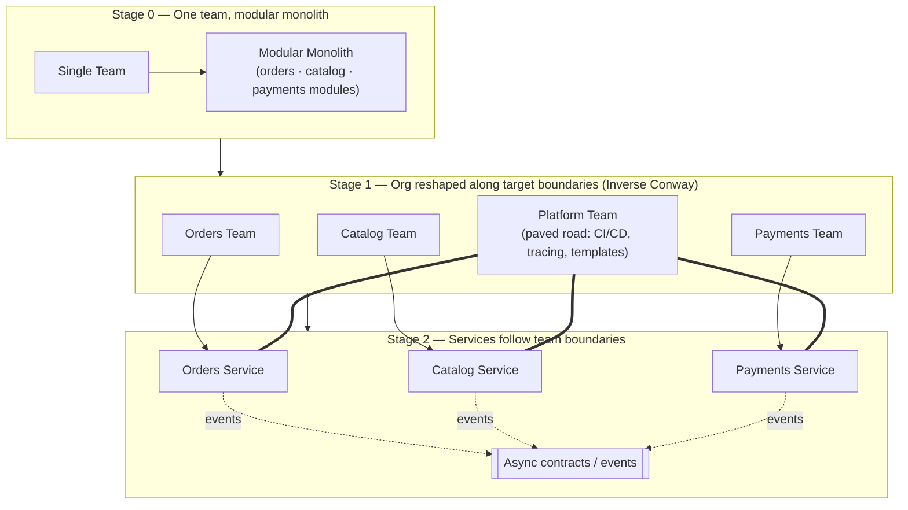

# Microservices — Staff

At staff level, microservices stop being an architecture question and become an *organizational* one. The moment you split a service you are not primarily buying a technical property — you are buying the ability for two teams to deploy on two schedules without a meeting. Everything else that microservices give you (independent scaling, fault isolation, polyglot freedom) is real but secondary; the load-bearing benefit is *decoupled release cadence for independent teams*. That reframe is the whole of this document. It follows that the decision is governed by Conway's Law, not by a technology preference, and that the correct default for a single team is a well-structured monolith. The classic caution — "you're not Netflix" — is not snark; it is the observation that most teams adopt the operational cost of a fifty-service estate to solve a coordination problem they do not have.

## Table of Contents

1. [The strategic reframe: microservices are an org decision, not a tech decision](#1-the-strategic-reframe-microservices-are-an-org-decision-not-a-tech-decision)
2. [Conway's Law and the Inverse Maneuver](#2-conways-law-and-the-inverse-maneuver)
3. [The platform investment you must make first](#3-the-platform-investment-you-must-make-first)
4. [Monolith-first and the split decision](#4-monolith-first-and-the-split-decision)
5. [Staged diagram: from team topology to service topology](#5-staged-diagram-from-team-topology-to-service-topology)
6. [When microservices pay off vs when they don't](#6-when-microservices-pay-off-vs-when-they-dont)
7. [The ongoing tax: the microservices premium](#7-the-ongoing-tax-the-microservices-premium)
8. [Governing service proliferation](#8-governing-service-proliferation)
9. [Second-order consequences and the metrics that reveal them](#9-second-order-consequences-and-the-metrics-that-reveal-them)
10. [Staff checklist](#10-staff-checklist)

---

## 1. The strategic reframe: microservices are an org decision, not a tech decision

The unit of value in software delivery is a team that can ship a change to production without waiting on anyone else. A monolith with ten teams committing to one repository and one deploy pipeline creates a serialized release train: every change queues behind every other change, a broken commit blocks everyone, and the merge/integration surface grows with the square of the team count. This is a *coordination* cost, and it dominates once an organization crosses roughly a few autonomous teams working on one codebase.

Microservices attack exactly this cost. By carving the system along team boundaries and giving each team its own deployable artifact, pipeline, datastore, and on-call rotation, you convert cross-team synchronous coordination into asynchronous contract negotiation. Team A ships when Team A is ready. That is the prize.

Notice what is *not* on that list. You do not adopt microservices to make code cleaner — modular monoliths achieve modularity with far less operational cost. You do not adopt them for performance — an in-process function call is nanoseconds; the same call over the network is milliseconds and can fail. You do not adopt them because they are modern. The single question a staff engineer must answer honestly is: **do we have a team-coordination bottleneck that independent deployability would relieve?** If the answer is no — if you are one team, or three teams that rarely touch the same code — the microservices tax buys you nothing and costs you a great deal.

This is the substance behind "you're not Netflix." Netflix runs hundreds of services because it has hundreds of teams and a decade of platform investment to make that estate operable. A ten-engineer startup copying that topology inherits all of Netflix's operational complexity and none of its organizational problem. The architecture solved a problem the startup does not have.

## 2. Conway's Law and the Inverse Maneuver

> "Any organization that designs a system will produce a design whose structure is a copy of the organization's communication structure." — Melvin Conway (1968)

Conway's Law is not a warning; it is a law in the descriptive sense — it *will* happen whether you plan for it or not. If four teams build a system, you get four subsystems with the seams falling on the org chart, because the interfaces between components mirror the interfaces between the people who build them. A team will not design a fine-grained API surface to a component it owns end to end, and it cannot avoid a coarse, negotiated contract to a component another team owns.

The staff-level move is the **Inverse Conway Maneuver**: instead of letting the org chart accidentally shape the architecture, you deliberately shape the org chart to produce the architecture you want. If you want a payments service, a catalog service, and a search service with clean boundaries, you create a payments team, a catalog team, and a search team, each owning its service end to end. The service boundaries then fall where you want them because the teams push them there.

This is why *Team Topologies* (Skelton & Pais, 2019) is a systems-architecture book disguised as a management book. Its central claim maps directly onto microservices governance:

- **Stream-aligned teams** own a slice of business capability end to end — these are your microservice owners.
- **Platform teams** provide the paved road (§3) so stream-aligned teams do not each reinvent CI/CD, observability, and service scaffolding.
- **Cognitive load** is the real constraint on how many services a team can own. A team that owns too many services, or one service too tangled with others, is over its cognitive-load budget and will ship slower, not faster — the exact opposite of why you split.

The design implication is blunt: **you cannot draw the service map before you draw the team map.** A proposed decomposition into services that does not correspond to a viable, staffable team structure is a fantasy. If you have one team and you split into eight services, you have not created eight independent teams — you have created one team that now maintains eight deploy pipelines, eight on-call surfaces, and seven network boundaries that used to be function calls. You paid the full tax and got no organizational benefit.

## 3. The platform investment you must make first

Microservices multiply the number of things you operate. If operating one service requires manual steps, then operating fifty services requires fifty times the manual steps — which is to say it is impossible. The prerequisite for a microservices estate is a **platform / paved road** that makes the common path automatic, so that spinning up service number fifty-one costs a team an afternoon, not a quarter. Adopting microservices *before* this platform exists is the most common and most expensive staff-level mistake: every team reinvents deployment, every team invents its own logging format, every team debugs distributed calls with print statements, and the promised velocity never materializes because the per-service overhead was never amortized.

The non-negotiable platform prerequisites, roughly in order of pain-if-absent:

| Prerequisite | What it provides | Failure mode if missing |
|---|---|---|
| **CI/CD per service** | One-click, automated build → test → deploy for every service independently | Deploys serialize again; you have a distributed monolith with none of the upside |
| **Observability (logs, metrics, distributed tracing)** | A single pane where a request can be traced across service hops | Debugging a cross-service failure means SSH-ing into ten boxes and correlating timestamps by hand |
| **Service templates / scaffolding** | `new-service` generates a service with health checks, metrics, tracing, auth, and CI already wired | Every team reinvents the wheel; no two services are operable the same way |
| **Centralized config & secrets** | Consistent configuration and credential rotation across the fleet | Secrets sprawl into env files and repos; rotation is impossible |
| **Service discovery & routing** | Services find each other without hardcoded endpoints | Deploys break callers; no safe way to move a service |
| **Standardized inter-service contracts** | Shared conventions for API versioning, error semantics, retries, timeouts | Every integration is bespoke; a change ripples unpredictably |
| **On-call & incident tooling** | Paging, runbooks, and ownership metadata per service | Nobody knows who owns service X at 3 a.m. |

The paved road is a product, and it needs a platform team that owns it. Its success metric is **time-to-first-deploy for a new service** and the fraction of services on the golden path versus off it. When a team routinely goes off the paved road, that is a signal the platform is inadequate — not that the team is undisciplined.

A useful staff heuristic: **the platform is the ante.** You do not get to sit at the microservices table until you have paid it. If leadership wants microservices but will not fund the platform team, the honest staff recommendation is to stay a monolith, because unfunded microservices are strictly worse than a monolith on every axis.

## 4. Monolith-first and the split decision

Martin Fowler's **MonolithFirst** guidance is the default a staff engineer should hold: *almost all successful microservice stories started with a monolith that grew and was split; almost all systems built as microservices from scratch ran into serious trouble.* The reasoning is about knowledge, not laziness. Getting service boundaries right requires knowing the domain — knowing which pieces change together, which data is transactional, where the natural seams are. Early on you do not know this, and the network boundary you draw is expensive to move. A boundary inside a monolith is a module boundary you can refactor in an afternoon; a boundary between services is a versioned API, a data-ownership split, and a cross-team negotiation you may never be able to undo.

So the sequence is:

1. **Start as a monolith** — but a *modular* one. Enforce internal module boundaries (packages, clear interfaces, no reaching into another module's data). This is where you learn the domain and where the seams actually are.
2. **Let boundaries prove themselves.** A seam is real when the modules on either side change on different schedules, scale differently, or are owned by teams that keep colliding.
3. **Split along proven seams, one at a time.** Extract the module that is causing the most coordination pain first (often the one everyone touches, or the one with the noisiest neighbor scaling profile). Measure whether the split reduced coordination cost before extracting the next.

The **split triggers** — the signals that a specific module has earned its own service:

- Two or more teams keep serializing behind each other on the same module.
- A module has a radically different scaling profile (e.g., a CPU-heavy image processor starved of resources inside a memory-bound web app).
- A module has a different availability or blast-radius requirement (you want the payments path isolated from an experimental recommendations feature).
- A module has a different rate of change — a stable core dragged into every deploy by a fast-churning feature.
- A module needs a different technology stack for a legitimate reason (not novelty).

If none of these hold, the module stays in the monolith. "It would be cleaner as a service" is not a trigger — cleanliness is what module boundaries buy, and they are far cheaper than services.

The dangerous middle state to avoid is the **distributed monolith**: services that were split but still deploy together, share a database, or call each other synchronously in a fan-out that must all be up for any request to succeed. This has the operational cost of microservices and the coupling of a monolith — the worst of both. A split that produces a distributed monolith should be reverted; it split along a false seam.

## 5. Staged diagram: from team topology to service topology

The Inverse Conway Maneuver, staged: you decide the target service map, then reorganize teams to produce it, then let the architecture follow. Read top to bottom as three points in time.

The ordering is the whole point: **team topology and the platform come before service extraction.** A team that reverses this — extracting services first, hoping teams will organize around them later — produces services no one clearly owns and a platform improvised under fire.

## 6. When microservices pay off vs when they don't

The decision is not binary "monolith vs microservices"; it is a judgment about whether your organizational situation clears the bar. This table is the one to bring to a design review.

| Dimension | Microservices pay off when… | Microservices do NOT pay off when… |
|---|---|---|
| **Team structure** | Many (5+) autonomous teams colliding on one codebase | One team, or few teams that rarely touch the same code |
| **Deploy coordination** | Release train is serialized; deploys blocked on other teams | Deploys are already independent enough; low merge contention |
| **Platform maturity** | Paved road exists: CI/CD, tracing, templates, on-call tooling | No platform team; each team would reinvent operations |
| **Scaling profile** | Components have genuinely divergent scaling / cost profiles | Uniform load; the whole app scales together fine |
| **Domain knowledge** | Boundaries are proven by observed change/ownership patterns | Domain still fluid; you'd be guessing at seams |
| **Blast-radius needs** | Some paths (payments) need isolation from others | One coherent product; a single failure domain is acceptable |
| **Org size trajectory** | Growing headcount will soon exceed one-codebase coordination | Small, stable team with no near-term growth |
| **Operational appetite** | Org can staff on-call, incident response, distributed debugging | No 24/7 coverage; splitting multiplies the pager surface |

**Prerequisites checklist — do not split until all of these are true:**

- [ ] There is a real, observed team-coordination bottleneck (not an anticipated one).
- [ ] A platform / paved road exists so new services cost hours, not quarters.
- [ ] Teams are (or will be) reorganized to *own* the target services end to end.
- [ ] The seam is proven — the two sides change on different schedules or scale differently.
- [ ] The split will not create a distributed monolith (no shared DB, no synchronous fan-out-all-must-be-up).
- [ ] On-call, observability, and incident tooling can absorb one more service.
- [ ] The decision is captured as an ADR with explicit reversal criteria.

If any box is unchecked, the staff recommendation is to stay put and fix the missing prerequisite first.

## 7. The ongoing tax: the microservices premium

Every service you run levies a permanent, recurring tax that a monolith does not. Fowler calls this the **microservices premium** — a fixed productivity cost you pay for the estate whether or not you are using its benefits that quarter. The premium is worth paying when it is smaller than the coordination cost it removes, and a net loss otherwise. The staff engineer's job is to keep this ledger honest.

The premium, itemized:

- **Operational surface.** Each service is a thing to deploy, monitor, patch, secure, scale, and back up. Fifty services is fifty of everything. Undifferentiated operational toil grows roughly linearly with service count.
- **On-call load.** More services means more pagers, more runbooks, more "who owns this?" at 3 a.m. Splitting a service splits the pager surface; a small org can drown in rotations before it drowns in traffic.
- **Distributed debugging.** A bug that was a stack trace in a monolith becomes a forensic exercise across service logs, spans, and clock-skewed timestamps. Without distributed tracing (§3) this is nearly impossible; even with it, mean-time-to-diagnosis rises.
- **Network as failure surface.** In-process calls do not partition, time out, or retry-storm. Inter-service calls do all three. You inherit partial failure, cascading failure, and the need for timeouts, retries with backoff, circuit breakers, and idempotency on every hop — none of which a monolith needs.
- **Distributed data.** A single ACID transaction across modules becomes a saga across services, with compensating actions and eventual consistency the application must reason about. Cross-service joins become API calls. This is often the single largest hidden cost of a split.
- **Contract & versioning overhead.** Every inter-service boundary is a versioned API that must evolve without breaking callers. Coordinating a breaking change across teams is exactly the coordination cost you were trying to escape — reappearing at the API layer if boundaries were drawn badly.
- **Cognitive load.** Each team must hold its services' operational reality in its head. Past a budget, this load *reduces* velocity, inverting the reason for the split.

The staff discipline is to state this premium out loud in the design doc, estimate it (roughly: services × per-service operational cost), and compare it against the coordination cost being removed. A split that does not clear its own premium is a net loss even if each service is individually well built.

## 8. Governing service proliferation

Left ungoverned, service count grows without bound. Every new feature spawns a service; every engineer's preference becomes a new datastore; over a few years you have a graph no one understands, with services that have no clear owner and dependencies no one can trace. Proliferation is a failure mode in its own right — it reintroduces coordination cost through the back door (now you coordinate across a tangle of runtime dependencies instead of across a codebase) and quietly bankrupts the platform team.

Governance levers a staff engineer should install:

- **A minimum bar to create a service.** New services should require a lightweight justification against the split-trigger criteria (§4) — ideally an ADR. The default answer to "should this be a new service?" is *no; put it in an existing service or module*. Make the easy path the monolith/module, and the service the deliberate exception.
- **Ownership metadata as a hard requirement.** Every service must have a registered owning team, an on-call rotation, and a runbook before it goes to production. An unowned service is an incident waiting to happen; the platform should refuse to deploy one.
- **Right-sizing, not nano-sizing.** "Micro" is misleading. A service should be as large as a team can own comfortably and no larger — usually one service per team per bounded context, not a service per class. Nanoservices (a service that does one trivial thing) multiply the premium (§7) with none of the isolation benefit. When in doubt, fewer, larger services.
- **Periodic decomposition review.** Review the service map on a cadence. Retire dead services, merge services that always deploy together (a false split — the distributed monolith of §4), and flag teams over their cognitive-load budget.
- **A deprecation path.** Splitting is celebrated; *merging back* must be equally legitimate. A service extracted along a false seam should be re-absorbed without stigma. The org that cannot un-split cannot correct its mistakes.

The governing metric is not "number of services" (more is neither good nor bad in itself) but **services-per-team** and **fraction of services with a clear owner on the paved road.** Rising services-per-team with flat headcount is the leading indicator of a proliferation problem.

## 9. Second-order consequences and the metrics that reveal them

The costs that sink microservices adoptions are rarely the ones visible on day one; they surface six to twelve months later, after the org has committed.

- **Velocity dips before it rises — and may never rise.** Splitting imposes the premium (§7) immediately; the coordination benefit accrues only if the split matched a real bottleneck and teams truly own their services. If either condition fails, velocity falls and stays down. *Watch:* deployment frequency and lead-time-for-change (DORA) per team before and after. If they do not improve within a quarter or two, the split was wrong.
- **The platform team becomes the bottleneck.** If service growth outruns platform investment, every team's velocity now depends on an under-resourced platform team. *Watch:* time-to-first-deploy for a new service, and platform-team ticket backlog. Rising numbers mean the ante is no longer being paid.
- **Cognitive-load overload masquerades as "the team is slow."** A team quietly owning too many services will miss commitments; the naive fix (pressure the team) makes it worse. *Watch:* services-per-team and incident load per team.
- **The distributed monolith emerges silently.** Services that were split but still deploy together or share data recouple over time. *Watch:* co-deployment frequency (services that always ship together) and cross-service synchronous call fan-out on the critical path.
- **On-call attrition.** Multiplied pager surface burns people out; your best engineers leave, taking system knowledge with them. *Watch:* pages-per-engineer-per-week and on-call satisfaction.

The single most useful signal that a microservices decision is going wrong: **team deployment frequency and lead time did not improve after the split.** If you paid the premium and delivery did not get faster, you bought operational complexity and nothing else — reverse course.

## 10. Staff checklist

- [ ] The split is justified by a real, observed *team-coordination* bottleneck — not by architecture aesthetics, performance, or fashion.
- [ ] Team topology is decided *before* the service map; teams will own their services end to end (Inverse Conway Maneuver).
- [ ] The platform ante is paid: CI/CD per service, distributed tracing, service templates, service discovery, on-call tooling all exist before extraction.
- [ ] Monolith-first respected: started modular, boundaries proven by observed change/ownership patterns before being split.
- [ ] Each split extracts one proven seam at a time, and is verified not to create a distributed monolith (no shared DB, no synchronous all-must-be-up fan-out).
- [ ] The microservices premium is estimated in the design doc and shown to be smaller than the coordination cost it removes.
- [ ] Governance installed: a bar to create services, mandatory ownership metadata, right-sizing toward fewer/larger services, and a legitimate merge-back path.
- [ ] Decision captured as an ADR with explicit reversal criteria and the DORA metric that would prove it wrong.
- [ ] A "when NOT to split" note is written so smaller teams don't cargo-cult the topology ("you're not Netflix").

*Next step:* [Microservices — Interview](interview.md)
