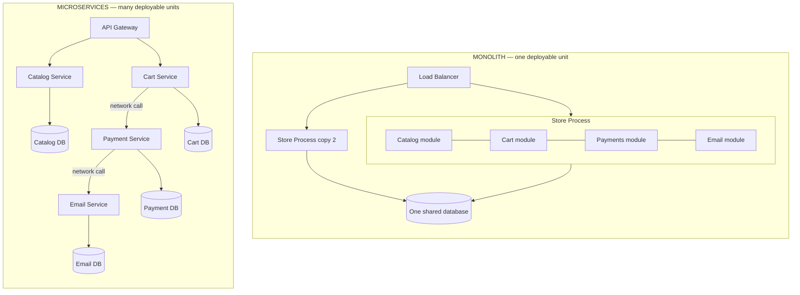
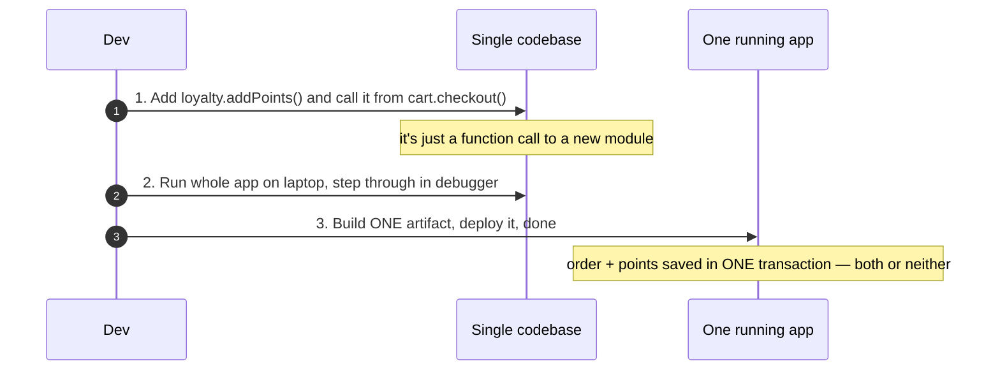
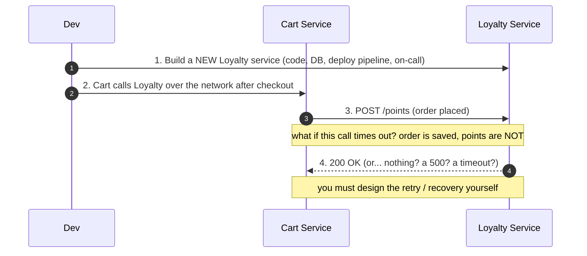
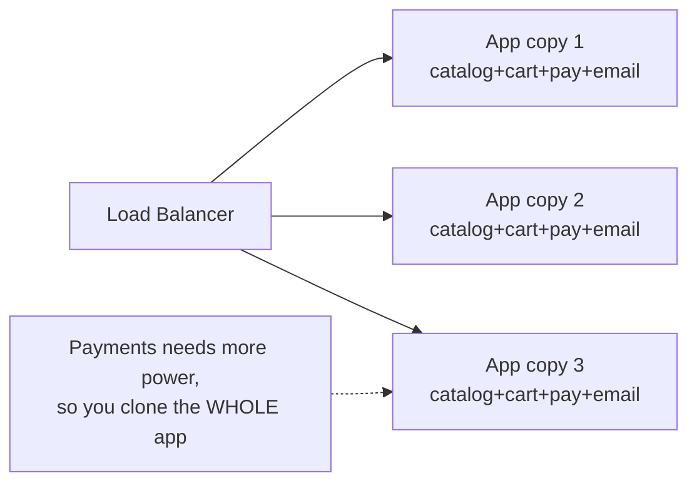
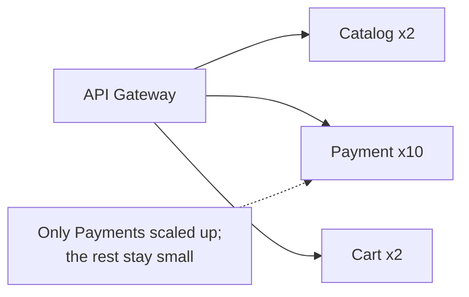

# Monolith vs Microservices — Junior

<!-- level-focus -->
At junior level, focus on this question:

> How can I apply **Monolith vs Microservices** in one small example and prove the result?

Use the smallest realistic scenario that exposes the decision and its failure behavior.
---

## 1. The One Question

Imagine an online store. It has to do four things: show a product catalog, hold a shopping cart, take payments, and email order confirmations. Those are the *capabilities*. They exist no matter how you build the software.

The architecture question is not "what capabilities do we need" — that is fixed by the product. The question is: **when we package this store as software and put it on servers, is it one program or several programs that talk to each other?**

- **Monolith** = one program. Catalog, cart, payments, and email are all modules (folders, packages, classes) inside a *single* codebase that compiles/builds into *one* deployable artifact and runs as *one* process (usually many identical copies of that one process).
- **Microservices** = several programs. Catalog is its own service on its own servers with its own database; cart is a separate service; payments another; email another. Each is built, deployed, and run independently. They coordinate over the network.

That is the entire distinction. Not "big vs small." Not "old vs modern." Not "bad vs good." Just: **one deployable unit, or many.** Hold onto that, because almost every difference you will read about is a *consequence* of this one choice, not a separate fact to memorize.

---

## 2. What "One Deployable Unit" Actually Means

"Deployable unit" is the load-bearing phrase, so let's make it concrete.

A **deployable unit** is the thing you ship to production as a whole. You build it, you version it, you deploy *that whole thing* at once, and it runs as one running program (a process). When you fix a typo in one corner of it, you rebuild and redeploy the entire unit — even the 99% you did not touch.

In a **monolith**, catalog + cart + payments + email are all in that one unit. Consequences that fall out immediately, for free:

- **They call each other as normal function calls.** `cart.checkout()` calls `payment.charge()` the same way any two functions in your code call each other. Nanoseconds. No network. It either returns or throws — no "the request timed out" third outcome.
- **They share one database and one transaction.** "Deduct stock AND record the order" can be a single database transaction: both happen or neither does. No half-states.
- **You run and debug the whole thing on your laptop** with one `run` command. One log stream. One stack trace crosses the whole request.

In **microservices**, each service is its *own* deployable unit. The same consequences invert:

- **They call each other over the network** (HTTP, gRPC). Milliseconds, not nanoseconds. And a network call has a *third* outcome besides success and failure: **no answer at all** (timeout) — you genuinely don't know if it worked.
- **Each service owns its own database.** "Deduct stock AND record the order" now spans two services and two databases — there is no single transaction that covers both. Keeping them consistent becomes real, deliberate work.
- **Running the whole app locally means running many services at once**, each with its own database and config. Debugging one request means stitching logs from several programs.

Nothing here is about size or fashion. It is purely: are these parts *inside one unit* (in-process, one database) or *split across units* (over the network, separate databases)?

---

## 3. The Same App, Built Two Ways

Here is the exact same store — same four capabilities — drawn as a monolith and as microservices, side by side. Look at where the boundaries fall.

Read the two boxes as answers to the same question:

- **Left (monolith):** the four capabilities are *modules inside one process*. There is one database. To scale, you run more identical copies of the whole process (copy 1, copy 2, ...). The lines between modules are just function calls — invisible, instant, reliable.
- **Right (microservices):** each capability is *its own service, its own database*. The lines between them are network calls — visible, slower, and able to fail on their own. Each box can be deployed and scaled by itself.

Notice what did **not** change: it is the same store with the same features. The *capabilities* are identical. Only the *packaging* — one unit vs many — is different. That is the whole comparison in one picture.

---

## 4. A Single Feature Change, Traced Through Both

Abstractions blur; a concrete change makes the difference sharp. Task: **"When an order is placed, also add loyalty points to the customer."** Let's trace it through both architectures, step by step.

### In the monolith

The checkout code gains one more line: `loyalty.addPoints(customer, order)`. It is an ordinary in-process call. The order write and the points write sit in the *same database transaction*, so they succeed together or fail together — you can never end up with an order but no points. You test the whole flow locally in a debugger, ship one artifact, and you are done. Simple, and correctly consistent, almost by default.

### In microservices

Now the same feature is a project. You stand up a *new service* — its own repository, database, deployment pipeline, dashboards, and on-call rotation. Cart calls Loyalty *over the network*. And here is the crux: the order lives in Cart's database, the points live in Loyalty's database, and **there is no single transaction across both**. If the network call to Loyalty times out after the order is already saved, you have an order with no points and no automatic rollback. You now have to *design* the recovery — retries, a message queue, a way to reconcile later. None of that was needed in the monolith.

**The lesson is not "microservices are bad."** It is that *the same feature costs radically different amounts depending on the shape*, and the cost is driven entirely by that one boundary: in-process-and-one-database vs over-the-network-and-separate-databases.

---

## 5. The Comparison Table

Now the tradeoff laid out along the dimensions you will actually be judged on. Read each row as "which is easier here, and *why*" — the "why" always traces back to one-unit vs many-units.

| Dimension | Monolith | Microservices |
|---|---|---|
| **Build / codebase** | One codebase, one build. Easy to navigate; jump-to-definition works everywhere. | Many codebases, many builds. Logic is spread across repos; harder to see the whole. |
| **Deploy** | Deploy the *whole thing* at once. Simple, but every change reships everything. | Deploy each service independently. One team ships without waiting on others — but you now run many pipelines. |
| **Calls between parts** | In-process function calls: nanoseconds, reliable, no timeouts. | Network calls: milliseconds, and can fail *or hang* on their own. |
| **Data & consistency** | One database, real transactions. "Both or neither" is easy. | Database per service. No cross-service transaction; consistency is manual work. |
| **Scaling** | Scale by running more copies of the *whole* app — even parts under no load. | Scale each service independently; give the busy one more machines, leave the rest alone. |
| **Fault isolation** | A bad module can crash the whole process — one blast radius. | One service can fail while others keep serving (if you designed for it). |
| **Team independence** | Many teams share one codebase and one release; they must coordinate. | Each team owns a service end-to-end; they move on their own schedule. |
| **Operational complexity** | Low. One thing to run, log, and monitor. | High. Networking, service discovery, distributed tracing, many dashboards. |
| **Local development** | `run` once and the whole app is up. | Must run many services + their databases to see the full app. |
| **Best when** | The team is small, the domain is still shifting, you want to ship fast. | Parts have genuinely different scaling/ownership needs and the team is large enough to run many units. |

Two patterns jump out of this table. **The monolith trades independence for simplicity** — everything is coupled, but everything is also easy. **Microservices trade simplicity for independence** — every part can move, scale, and fail on its own, but you pay in operational complexity and the loss of easy transactions. There is no free lunch; you are choosing *which* problem you would rather have.

---

## 6. Why the In-Process Call Is the Whole Story

If you remember one thing, remember this: **the difference between a monolith and microservices is the difference between a function call and a network call.**

A function call inside one process:
- takes **nanoseconds**,
- **always** returns or throws — there is no "I don't know if it happened,"
- cannot be "partially" completed,
- needs no serialization, no retries, no timeout tuning.

A network call between two services:
- takes **milliseconds to seconds** (thousands of times slower),
- has **three** outcomes: success, failure, *and no response at all* (timeout) — where you genuinely cannot tell whether the other side did the work,
- can leave the system in a half-done state (order saved, points not),
- needs serialization, retries, timeouts, and error handling *every single time*.

Every "microservices are hard" story — distributed transactions, eventual consistency, cascading failures, debugging across services — is ultimately a story about turning cheap, reliable function calls into expensive, fallible network calls. Martin Fowler calls choosing to pay this cost only when you must the "[Monolith First](https://martinfowler.com/bliki/MonolithFirst.html)" principle: start as one unit, split out a service only when a *concrete* pressure (a part that must scale differently, or a team that must ship independently) makes the network cost worth it.

---

## 7. Scaling: One Knob vs Many Knobs

Scaling is where the tradeoff becomes physical, so it is worth its own look. Suppose the payment step is CPU-heavy and gets hammered on Black Friday, while the catalog is light.

**Monolith — one knob.** Payments is a module inside the one process. To give payments more capacity, you run more copies of the *entire* store process. Each new copy carries catalog, cart, and email along for the ride, even though they did not need more resources. It works, and it is simple — one dial, "how many copies of the app" — but you pay for capacity you do not use.

**Microservices — many knobs.** Payments is its own service, so you scale *only* payments: run ten copies of the Payment Service and leave Catalog at two. You spend machines exactly where the load is.

This targeted scaling is a genuine, real advantage of microservices — *when you actually have parts with very different load profiles.* If your parts all scale together (as most small apps do), the monolith's single knob is simpler and just as good. The advantage only cashes in when the *needs* actually diverge.

---

## 8. Which One Should You Reach For?

For almost everything you will build early in your career, **start with the monolith.** This is not a training-wheels recommendation you outgrow — it is the mainstream, experienced default, because at the start you get the monolith's simplicity for free while the "independence" microservices offer is a benefit you cannot yet use.

Reach for a monolith when:
- the team is small (say, one to a few developers);
- the domain is still changing and boundaries are unclear (you don't yet *know* where to draw the service lines — and a wrong network boundary is painful to move);
- you want to ship features quickly with low operational overhead.

Consider splitting a piece into its own service only when you hit a **concrete, present pressure**, such as:
- one part must scale very differently from the rest (like Payments above), and cloning the whole app to feed it has become genuinely wasteful;
- separate teams keep colliding in one codebase and one release train, and independent deployment would actually unblock them;
- one part has fundamentally different requirements (different language, different database, stricter compliance) that don't fit inside the shared unit.

The healthy mindset: **microservices solve organizational and scaling problems, not "the app is big" problems.** A large, well-organized monolith is a perfectly good place to be. Splitting into services because it sounds advanced — with no team-independence or scaling pressure forcing your hand — just buys you the network-call tax and the distributed-consistency headache with none of the payoff. Split when a real pressure makes the cost worth paying, and not one service sooner.

---

## 9. Common Misconceptions at This Level

1. **"Microservices are the grown-up version of a monolith."** No — they are a *different tradeoff*, not a *better* one. Many large, successful companies run big monoliths on purpose. Choose by pressure, not by prestige.
2. **"A monolith can't scale."** It can. You scale it by running more copies behind a load balancer, exactly like any service. What it *can't* do is scale one part independently of the rest — that is a different limitation, and it only bites when parts have different needs.
3. **"Microservices means many small pieces, so each piece is simpler."** Each *piece* is smaller, but the *system* is more complex: you added networks, timeouts, service discovery, and distributed data. Complexity moved from *inside a service* to *between services* — it did not disappear.
4. **"Splitting into services makes things faster."** Usually the opposite for a single request: you replaced instant function calls with slower network calls. Microservices help *throughput and independent scaling*, not the latency of one call.
5. **"You must pick one forever on day one."** You don't. The common path is *monolith first*, then carve out a service when a concrete pressure appears — a well-structured monolith with clean module boundaries makes that carving-out far easier later.

---

## 10. Hands-On Exercise

Take a small app you understand — a blog, a to-do app, a simple shop — and do this on paper (no code):

1. **List the capabilities.** For a blog: write posts, show posts, handle comments, send notification emails. These are fixed by the product.
2. **Draw it as a monolith.** One box (the app process), with the capabilities as modules inside it, and one database underneath. This is your baseline.
3. **Draw it as microservices.** Split each capability into its own box with its own database, and draw the lines between them as *network calls*. Label each line "network call — can time out."
4. **Trace one feature both ways.** Pick "when a comment is posted, email the post's author." In the monolith version, it's one function call in one transaction. In the microservices version, the Comment service must call the Email service over the network — write down what happens if that call *times out* after the comment is already saved. Who retries? Where does the order-vs-points half-state live?
5. **Answer the one question.** For *this* app, at *this* size, what would you actually *gain* by making it many pieces instead of one? If your honest answer is "nothing concrete yet" — that is exactly why the monolith is the right first choice.

Do this once and the tradeoff stops being abstract. You will have felt, on a real example, why the same feature is trivial in one shape and a project in the other — and that feeling is the whole point of this tier.

---

*Next step:* [Monolith vs Microservices — Middle](middle.md)

---

## Apply it

1. Choose one small, known input for **Monolith vs Microservices**.
2. Predict the output or observable behavior.
3. Run the smallest example or probe that exercises the concept.
4. Change one input to trigger a failure or boundary case.
5. Explain the evidence using the guide's vocabulary.

## Verify your work

- Record the exact input, command or code path, and output.
- Repeat the probe and confirm the result is consistent.
- Show one expected success and one expected failure.
- Resolve any difference between the prediction and the evidence.

## Review questions

- What problem does Monolith vs Microservices solve in the example?
- Which input changes the observed result, and why?
- What is the smallest useful success check?
- Which beginner mistake would your evidence catch?
