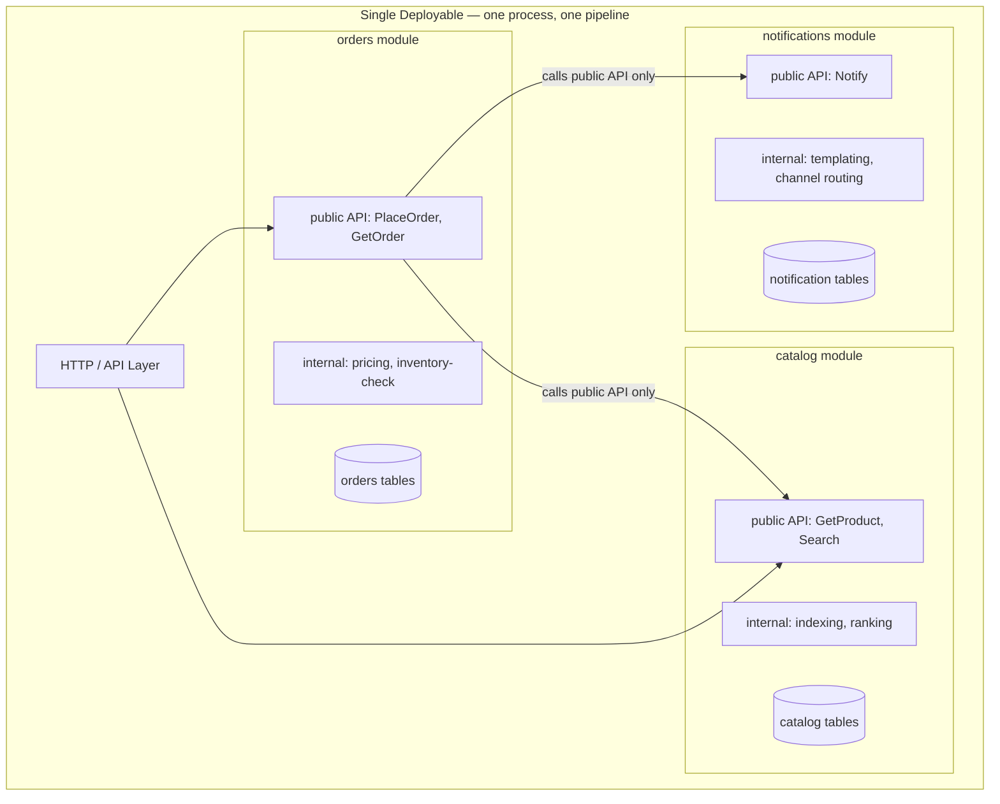
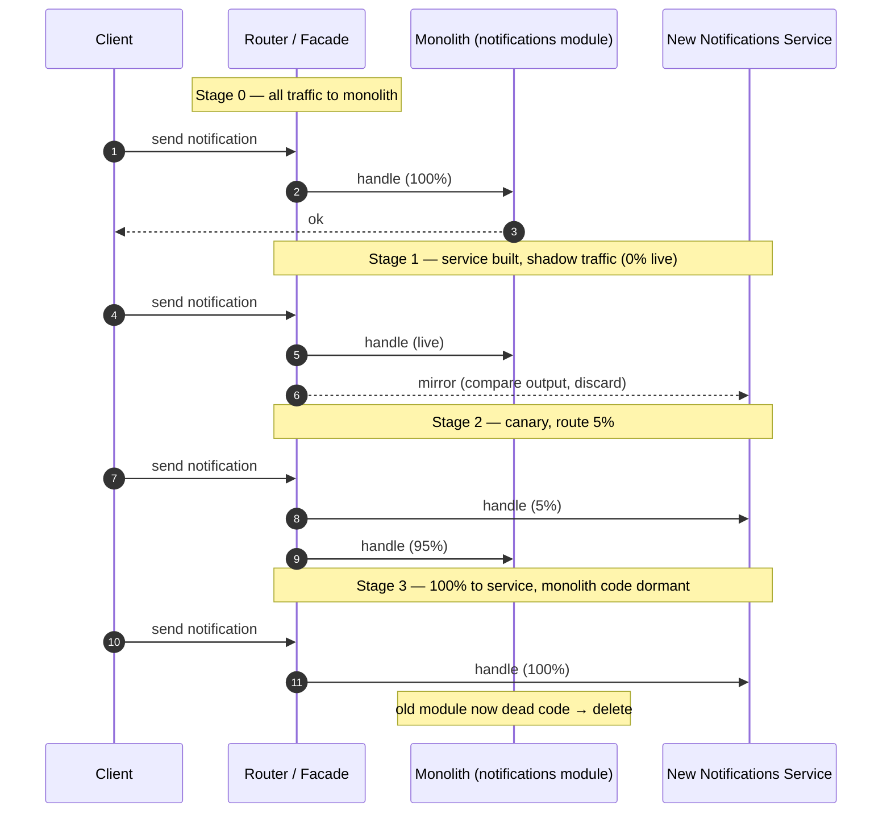
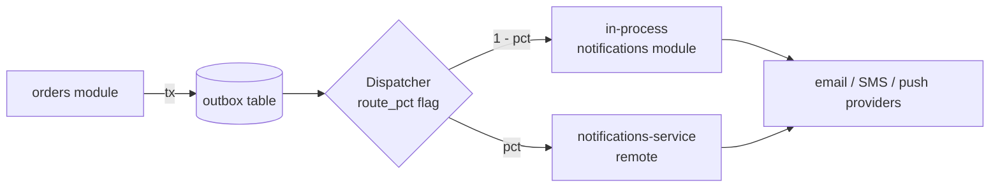

# Monolith vs Microservices — Middle

<!-- level-focus -->
At middle level, focus on this question:

> Where does **Monolith vs Microservices** belong in a maintainable component, and which trade-off selects the design?

Use the smallest realistic scenario that exposes the decision and its failure behavior.
## 1. The third option: the modular monolith

Most teams are told they must choose between a monolith (simple, but "doesn't scale") and microservices (scalable, but operationally brutal). This is a false dichotomy. The modular monolith is a real, first-class third option, and for most teams under ~30 engineers it is the correct default.

A modular monolith is a **single deployable unit** (one process, one CI pipeline, one release, one database connection pool) that is internally partitioned into **modules with strong, enforced boundaries**. Each module owns its data, exposes a narrow internal API, and may not reach into another module's internals. It looks like microservices from the inside and like a monolith from the outside.

What you keep from the monolith:

- **One deploy.** No distributed transactions, no service-discovery layer, no network hop between modules, no versioned inter-service contracts to coordinate.
- **In-process calls.** A cross-module call is a function call: nanoseconds, type-checked at compile time, refactorable by your IDE, debuggable in a single stack trace.
- **One transaction boundary.** A request that touches three modules can still commit atomically against one database. This is the single biggest thing you lose when you go to microservices, and the modular monolith keeps it for free.

What you buy that a big ball of mud never had:

- **Independent reasoning.** Each module can be understood, tested, and changed without loading the whole system into your head.
- **A pre-drawn seam.** When a module genuinely needs to become a service, the boundary already exists — extraction is mechanical, not archaeological.

Martin Fowler's guidance is explicit here: **[MonolithFirst](https://martinfowler.com/bliki/MonolithFirst.html)** — start with a monolith, discover the real boundaries through use, and extract services only when you have evidence for where the seams are. You cannot draw good service boundaries on day one because you do not yet know how the domain decomposes. The modular monolith is how you start monolith-first *without* accumulating the mess that makes later extraction impossible.



The arrows that matter are the ones that are *not* there: `orders` never touches `catalog`'s tables or internal functions — only its published API. Enforce that, and you have a modular monolith. Fail to enforce it, and you have a monolith that will become a big ball of mud.

## 2. Module boundaries and internal APIs

A module is not a folder. A folder is a suggestion; a module is a contract. Four properties turn a folder into a module:

1. **A public surface.** The module exposes a small set of functions/types that other modules may call. Everything else is private. In Go this is package-level exported vs unexported identifiers; in Java, `public` types in an API package vs package-private implementation; in .NET, `internal` access modifiers plus separate assemblies.

2. **Owned data.** The module owns its tables. No other module reads or writes them directly. Cross-module data access goes through the public API, which returns DTOs — never the module's own entities. This is the rule people break first and regret most.

3. **No back-channels.** Module A may depend on module B's public API. It may not depend on B's internals, and (ideally) the dependency graph is acyclic. Cyclic dependencies between modules are the single clearest early symptom of rot.

4. **Its own tests.** A module has a test suite that runs against its public API without spinning up the other modules. If you cannot test `orders` without also constructing a real `catalog`, the boundary is fictional.

Structure it concretely. A well-organized modular monolith groups by **domain module**, then by layer *inside* the module — never the reverse:

```text
GOOD — package by module (boundaries are visible and enforceable):
  /orders
    api.go          ← public: PlaceOrder(ctx, req) (*OrderDTO, error)
    order.go        ← private domain entity, not exported
    pricing.go      ← private
    repository.go   ← private, only orders touches orders tables
    orders_test.go
  /catalog
    api.go          ← public: GetProduct(ctx, id) (*ProductDTO, error)
    ...
  /notifications
    api.go
    ...

BAD — package by layer (boundaries dissolved; every layer sees everything):
  /controllers     ← OrderController, ProductController, NotifController together
  /services        ← all services in one bag, free to call each other
  /repositories    ← every repo visible to every service — no data ownership
  /models          ← all entities exposed globally
```

The layered layout feels tidy but is the express lane to a big ball of mud: because every service sits in one package and every repository in another, *any* service can call *any* repository, and within a year they all do. There is no wall left to enforce. Package-by-module puts the wall back: `orders/repository.go` is unexported, so nothing outside `orders` can even name it.

The **internal API** between modules should be treated with the same discipline you would give a public network API — just cheaper to change because it is in-process:

```text
// orders module's public API — the ONLY way in
package orders

func PlaceOrder(ctx context.Context, req PlaceOrderRequest) (*OrderDTO, error)
func GetOrder(ctx context.Context, id OrderID) (*OrderDTO, error)

// PlaceOrderRequest / OrderDTO are plain data — they do NOT expose
// the internal `order` entity, its DB tags, or its invariants.
```

Returning DTOs rather than entities is what keeps the boundary a boundary. If `orders` handed out its live `order` struct, other modules would couple to its schema, and any change to that schema would ripple across the codebase — exactly the coupling the module was supposed to prevent.

## 3. How a monolith rots into a big ball of mud

The "big ball of mud" (Foote & Yoder's term for a system with no discernible architecture) is not a starting state — it is an *ending* state reached one reasonable-looking shortcut at a time. Understanding the mechanism is how you prevent it.

The rot is always the same story:

```text
Week 1:   orders needs a product's price.
          Clean move: call catalog.GetProduct(id).price
          Shortcut:   query the products table directly from orders — "it's right there."

Week 8:   The shortcut works. Three more places copy it.
          Now four call sites in orders read catalog's tables.

Month 6:  Someone renames a column in products.
          Four hidden readers break. Nobody knew they existed —
          the coupling was invisible because it never went through an API.

Month 12: Every module reads every other module's tables.
          The database schema is now the de facto integration contract,
          shared and un-owned. No module can change its own tables safely.
          Extraction is impossible: there are no seams left to cut along.
```

The four horsemen of monolith rot, in the order they usually arrive:

1. **Shared database tables.** The first and most fatal. Once module B reads module A's tables, A can never safely change its schema, and the "boundary" is gone. Data ownership is the boundary; lose it and you have lost everything.
2. **Reaching into internals.** Module B calls A's non-public functions or constructs A's entities directly, coupling to A's implementation rather than its contract.
3. **Cyclic dependencies.** A calls B, B calls A. Now neither can be understood, tested, or extracted independently. Cycles are the point of no return.
4. **God modules / shared "utils".** A `common` or `shared` package that everything depends on and everything mutates, becoming a second, informal global namespace where boundaries go to die.

None of these are microservices problems that the monolith "has by nature." They are discipline failures, and every one is preventable with tooling (next section). The important insight for the middle engineer: **microservices do not solve these problems — they make them expensive to create.** You *can* still share a database across microservices (and teams do, to their ruin), but the network boundary at least makes reaching into internals physically awkward. A modular monolith gets the same protection at zero network cost by using the compiler and CI to make the shortcuts *fail the build*.

## 4. Enforcing boundaries so they hold

A boundary that relies on developers "being disciplined" will be violated within a quarter, because the shortcut is always locally easier under deadline pressure. Boundaries must be enforced by machines. Three layers of enforcement, cheapest first:

**1. Language-level access control (free, instant).**
Make internals unnameable from outside the module. Go: keep implementation identifiers unexported; only `api.go` exports. Java: put the public API in one package and mark everything else package-private; or use the Java Platform Module System (`module-info.java`) to `exports` only the API package. .NET: `internal` access modifier plus one assembly per module. This alone stops horseman #2.

**2. Dependency / architecture tests (cheap, catches the rest).**
Add a test that asserts the module dependency graph. If someone imports across a forbidden edge, the build goes red. Tools: ArchUnit (Java/Kotlin), `go-arch-lint` or a custom `go/packages` check (Go), NetArchTest (.NET), import-linter (Python).

```text
// ArchUnit-style rule expressing the intended architecture
noModule("orders").shouldDependOnClassesThat().resideInAPackage("catalog.internal..")
modules().should().beFreeOfCycles()   // kills horseman #3

// Custom Go check, run in CI:
//   for each import in package orders:
//     if import targets an unexported-only path of another module → fail
```

**3. Database ownership enforcement (the one people skip).**
The most important boundary — data — is the hardest to enforce with the compiler, because SQL strings are opaque. Options, strongest first:

```text
- Schema-per-module + per-module DB user with GRANTs only on its own schema.
  orders_user can SELECT/INSERT on orders.* and NOTHING else.
  A stray cross-module query fails at the database with a permission error.
- One migration owner per schema; migrations for orders live in /orders/migrations
  and are the only thing allowed to alter orders tables.
- A CI grep/lint that fails if a module's source references another module's table names.
```

Enforce all three and the rot cannot start: the shortcut in the "Week 1" story above would not compile, would not pass CI, or would be denied by the database. That is the entire difference between a modular monolith that stays healthy for a decade and one that curdles in eighteen months.

## 5. The three architectures compared

Treat this as the decision table. The modular monolith is not a compromise — for most teams it strictly dominates until specific signals appear (next section).

| Dimension | Monolith (unstructured) | Modular Monolith | Microservices |
|---|---|---|---|
| Deployable units | 1 | 1 | N (one per service) |
| Internal boundaries | None / eroded | Strong, enforced in code | Strong, enforced by network |
| Cross-module call | Function call | Function call (via public API) | Network RPC (latency, failure) |
| Transaction across modules | Single DB transaction | Single DB transaction | Distributed (saga / outbox) — hard |
| Refactor across boundary | Trivial (compiler-checked) | Trivial (compiler-checked) | Expensive (versioned contract, coordination) |
| Independent scaling | No — scale whole app | No — scale whole app | Yes — scale per service |
| Independent deploy | No | No | Yes |
| Tech-stack diversity | No | No (one runtime) | Yes — polyglot per service |
| Fault isolation | Poor — one bug can crash all | Poor — shared process | Strong — bulkheaded per service |
| Operational overhead | Low | Low | High (discovery, mesh, tracing, on-call ×N) |
| Debugging | One stack trace | One stack trace | Distributed tracing required |
| Team autonomy | Low (deploy contention) | Low–Medium (shared deploy) | High (own service, own release) |
| Right for | Prototypes, legacy | **Most teams < ~30 eng** | Large orgs with independent-scaling / autonomy needs |

The row that drives most real migrations is **independent deploy** and **independent scaling** — not any of the "cleaner code" arguments, which the modular monolith already satisfies. If your only complaint is "the codebase is a mess," microservices are the wrong fix: you will get a *distributed* mess, which is strictly worse. Fix the boundaries in-process first.

## 6. The concrete signals that justify a split

Do not split on vibes ("microservices are more modern") or on code-quality complaints (a modular monolith fixes those in-process). Split when you have a **measurable, structural** reason that a single deployable genuinely cannot satisfy. There are exactly three that consistently justify the operational tax:

**Signal 1 — Divergent scaling profiles.**
One module needs radically more (or different) hardware than the rest, and coupling it to the shared deploy wastes money or caps throughput.

```text
Measure: per-module resource attribution.
Trigger: image-processing consumes 70% of CPU but is 5% of request volume;
         scaling it means scaling the whole monolith 10× → 90% of that
         capacity is idle for the other modules.
Split lets you run 40 CPU-heavy image workers and 4 API pods independently.
```

**Signal 2 — Team contention on deploys.**
Independent teams are serializing on a shared release train; one team's risky change blocks another team's ship.

```text
Measure: deploy frequency, rollback rate, and cross-team blocking incidents.
Trigger: 6 teams share one pipeline; a bad deploy from team A rolls back
         team B's unrelated release; the release train is the bottleneck,
         not the code. This is Conway's Law biting: the org wants
         independent delivery the architecture won't allow.
Split gives each team its own deploy cadence and blast radius.
```

**Signal 3 — Genuinely different technology needs.**
A module is a poor fit for the shared runtime for hard technical reasons, not preference.

```text
Measure: is the mismatch fundamental or cosmetic?
Trigger: the fraud-detection module needs a Python ML stack; the search
         module needs a JVM library with no port; a module needs GPUs.
         "I prefer Rust" is NOT this signal — polyglot has a real cost.
Split lets that one module run its own stack behind a stable API.
```

Notice what is **not** on the list: "the code is messy," "the file is too big," "microservices are best practice," "we want clean architecture." All of those are satisfied by module boundaries inside the monolith. If none of the three signals is present and measurable, extracting a service adds network latency, partial-failure handling, distributed transactions, and an on-call rotation in exchange for nothing. The default answer to "should we split?" is **not yet** — keep the seam drawn (as a module) and split the day a real signal appears.

## 7. Splitting incrementally: the strangler fig

When a signal does justify a split, **do not rewrite**. The big-bang rewrite — build the new service, cut over on a flag day — is the classic way to lose a year and a lot of trust. Use Fowler's **[Strangler Fig](https://martinfowler.com/bliki/StranglerFigApplication.html)** pattern: grow the new service *around* the old code path until the old path carries no traffic and can be deleted, exactly as a strangler fig grows around and eventually replaces its host tree.

The mechanism is an **interception point** — usually a facade, proxy, or routing layer in front of the functionality — that lets you redirect a slice of traffic to the new service while everything else keeps hitting the monolith. You migrate one capability, one endpoint, or one percentage of traffic at a time, and every step is independently shippable and reversible.



Why each stage matters:

- **Stage 1 (shadow / mirror).** Send real traffic to the new service in parallel, discard its output, and diff it against the monolith's. This validates correctness under production load *before* any user depends on it. Bugs found here are free.
- **Stage 2 (canary).** Route a small percentage of live traffic to the new service. Watch error rate and latency. If it regresses, flip the percentage back to zero instantly — the monolith path never left. This is why strangler-fig migrations are low-risk: rollback is a config change, not a redeploy.
- **Stage 3 (cutover + delete).** Once at 100% with a healthy soak period, the old module is dead code. **Delete it** — an incomplete strangler that leaves the old path around is a common failure; you carry two implementations forever.

The precondition that makes all of this possible: **the module must already be a clean module.** If `notifications` was tangled into `orders`' tables and internals, there is no seam to intercept and you are back to a rewrite. This is the payoff of Section 4's discipline — the modular monolith is the thing that makes the strangler fig *easy*.

## 8. Worked example: extracting the notifications module

Concrete end-to-end. Suppose `notifications` hits **Signal 1**: it fans out to email/SMS/push providers, its latency and retry load are spiky, and coupling it to the API deploy means a provider outage backs up the whole app's thread pool. We extract it.

**Precondition check.** Is `notifications` a real module? Its public API is `Notify(ctx, NotifyRequest) error`; it owns the `notifications` schema; nothing else reads those tables; `orders` calls it only via `notifications.Notify(...)`. Yes — there is a seam.

**Step 1 — Make the boundary async and durable (still in the monolith).** Before touching the network, convert the in-process call into a message. `orders` writes a row to an `outbox` table in the *same* transaction as the order, and a dispatcher reads the outbox and calls `notifications.Notify`. This is the **transactional outbox** pattern, and it is the crucial pre-work: it removes the distributed-transaction problem *before* the split, so the eventual network hop cannot lose a notification.

```text
BEFORE (synchronous, in-process):
  tx { save(order); notifications.Notify(...) }   // one transaction, easy

AFTER (outbox, still monolith):
  tx { save(order); outbox.insert(NotifyEvent) }  // one transaction, still atomic
  dispatcher: for each outbox row → notifications.Notify(...) → mark sent
```

**Step 2 — Stand up the service behind the same interface.** Build the standalone `notifications-service` exposing the identical contract over HTTP/gRPC. The dispatcher can now call either the in-process module or the remote service — the interface is the same, so the switch is a one-line change behind a flag.

**Step 3 — Insert the interception point.** The dispatcher is the facade. Add a routing flag: `route_notifications_pct`.



**Step 4 — Shadow, canary, cut over.** Run the four stages from Section 7: mirror-and-diff at 0%, then 5%, 50%, 100%, watching delivery success and latency at each step, rolling `route_pct` back on any regression. Because delivery is idempotent (each `NotifyEvent` carries a unique id and providers dedupe on it), a message double-sent during a percentage transition is harmless.

**Step 5 — Delete the dead module.** At a stable 100%, remove `notifications` from the monolith build, drop its dispatcher branch, and hand the `notifications` schema to the new service (the service now owns and migrates it). The monolith no longer has a notifications module — the strangler is complete.

Total risk at every step: reversible with a flag, validated against production before cutover, no flag day, no distributed transaction, no lost notifications. That is the entire value of doing it incrementally instead of rewriting.

## 9. Middle checklist

- [ ] The codebase is packaged **by module, then by layer** — not by layer globally.
- [ ] Every module has a **narrow public API** returning DTOs; implementation types are unexported/internal.
- [ ] Each module **owns its tables**; no module reads another's tables directly (enforced by schema GRANTs or a CI check).
- [ ] An **architecture test** fails the build on forbidden cross-module imports and on dependency cycles.
- [ ] There is **no `shared`/`common` god-module** that everything mutates.
- [ ] A proposed split is backed by a **measured signal** (scaling profile, deploy contention, or genuine tech mismatch) — not code-quality complaints, which are fixed in-process.
- [ ] Extraction is planned as a **strangler fig** (interception point → shadow → canary → cutover → delete), never a big-bang rewrite.
- [ ] Cross-module calls that will cross the network are made **async + durable (outbox)** *before* the split, to eliminate distributed transactions.
- [ ] Every migration stage is **reversible with a config flag**, and the old code path is **deleted** once traffic is fully cut over.

---

## Apply it

1. Find a real component where **Monolith vs Microservices** affects an interface or dependency.
2. Write two plausible choices and the constraint that favors each one.
3. Make the smallest reversible change at that boundary.
4. Exercise the component alone, then exercise the integrated flow.
5. Keep the decision note with the evidence that selected the option.

## Verify your work

- A focused check proves the local behavior.
- An integrated check proves callers and dependencies still agree.
- Logs, traces, compiler output, or benchmarks expose the boundary.
- Reverting the change restores the previous behavior without unrelated edits.

## Review questions

- Which boundary is most affected by Monolith vs Microservices?
- What constraint would make you choose the alternative design?
- How would you isolate a local defect from an integration defect?
- What evidence shows that the change remains maintainable?
