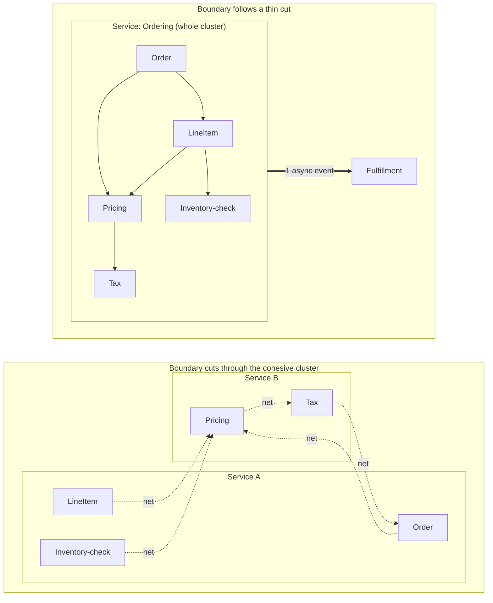

# Monolith vs Microservices — Professional

<!-- level-focus -->
At professional level, focus on this question:

> How should teams adopt and operate **Monolith vs Microservices** with measurable outcomes and limited coordination?

Use the smallest realistic scenario that exposes the decision and its failure behavior.
---

## 1. The cost model: fixed vs marginal

Model the **total engineering cost** of running an architecture as a function of the number of independently deployed services `N` and the engineering headcount `T`.

For a microservices architecture:

```
Cost_micro(N) = F_platform + N × c_service
```

- **`F_platform`** — the *fixed platform cost*. It is paid once, before the first service split earns anything. It includes: a CI/CD pipeline capable of building and deploying N artifacts, a service mesh or equivalent (mutual TLS, retries, timeouts, circuit breaking), centralized structured logging, distributed tracing, per-service metrics and dashboards, a service catalog/registry, secrets distribution, and — the expensive one — the *operational knowledge* to run all of it. `F_platform` is large and mostly step-shaped: you cannot buy half a tracing stack.

- **`c_service`** — the *marginal per-service cost*. Each additional service adds: its own deploy pipeline config, its own on-call ownership, its own database or schema, its own alerting, its own capacity headroom (you cannot bin-pack a fractional service into another's idle CPU as freely as in-process), and its own share of the cross-service integration/versioning surface. In the limit, `c_service` also carries a term for the *edges* it adds to the call graph; a naive split can make integration cost grow faster than `N` (see §4), but a well-cut split keeps the graph sparse and `c_service` roughly constant.

For a monolith:

```
Cost_mono(T) = f_platform + g(T)
```

- **`f_platform`** — a *much smaller* fixed cost: one artifact, one pipeline, one deploy, one database, one dashboard. `f_platform ≪ F_platform`.
- **`g(T)`** — the *coordination cost*, a function of team size `T`, developed in §2. This is the term that pushes teams off the monolith.

The strategic content of the whole debate lives in three inequalities:

| Quantity | Monolith | Microservices | Consequence |
|---|---|---|---|
| Fixed cost | `f_platform` (small) | `F_platform` (large) | Small teams should not pay `F_platform`. |
| Marginal cost of a new capability | ~0 extra infra (add a package) | `+ c_service` if it becomes a service | Splitting has a per-unit price; packaging does not. |
| Scaling variable | headcount `T` via `g(T)` | service count `N` (linear) | Monolith cost is superlinear in people; micro cost is linear in services. |

The microservices bet is precisely: **trade a superlinear-in-people term for a linear-in-services term, and pay a large fixed cost up front for the privilege.** That bet only pays when `g(T)` is large enough to dominate `F_platform + N × c_service`.

---

## 2. Coordination cost and the crossover point

Why is `g(T)` superlinear? Because coordination happens *between* people, and the number of pairwise channels in a team of `T` engineers is:

```
channels = T(T − 1) / 2   ≈   T² / 2
```

In a single deployable artifact, a change by one engineer can conflict with, block, or require review from any other engineer touching the same release. The *shared release train* is the coupling surface: merge conflicts, "please don't deploy, my change isn't ready," coordinated migrations, and a single red build that stops everyone. Empirically the coordination cost does not reach the full `T²/2` (people cluster around modules), but it grows **faster than linearly** in `T`. Model it as:

```
g(T) = k × T^α ,   with   α > 1   (α ≈ 1.5–2 in practice)
```

Now set the two costs equal to find the crossover team size `T*` at which splitting into `N` services becomes cheaper:

```
f_platform + k × T*^α  =  F_platform + N × c_service

                         F_platform + N × c_service − f_platform
        T*  =  (  ───────────────────────────────────────────────  ) ^ (1/α)
                                      k
```

Read the levers off this formula directly:

- **Larger `F_platform` ⇒ larger `T*`.** If your platform investment is heavy (no shared tracing, no mesh, hand-rolled deploys), you must wait for a bigger team before the split pays.
- **Smaller `α` or `k` ⇒ larger `T*`.** A team with strong internal module boundaries *inside* the monolith (a modular monolith) reduces `k` and `α`, pushing `T*` out. This is the technical justification for "modular monolith first": it is a legitimate way to lower `g(T)` **without** paying `F_platform`.
- **`c_service` matters more as `N` grows.** For large `N`, the `N × c_service` term dominates `F_platform`, and a sloppy split (high `c_service`, see §4) can raise the crossover so far that microservices *never* win.

The monolith line starts *low* (small fixed cost) and curves up superlinearly. The microservices line starts *high* (large `F_platform`) and rises only gently (linear in `N`, and `N` grows slowly with `T`). They cross at `T*`. **To the left of `T*`, choosing microservices means paying `F_platform` to solve a coordination problem you do not yet have.** To the right, staying monolithic means paying an ever-growing `g(T)` to avoid a fixed cost you can afford.

---

## 3. Coupling and cohesion theory applied to boundaries

A service boundary is a place where you convert an in-process call into a network call. §6 shows that conversion costs ~5–6 orders of magnitude in latency and adds a whole class of failure modes. Therefore the **only** boundaries worth drawing are ones the call graph rarely crosses. This is a statement about coupling and cohesion, and we can make it precise with the classic structural metrics (Robert C. Martin, *Agile Software Development*):

- **Afferent coupling `Ca`** of a module — the number of other modules that depend *on* it (incoming edges). High `Ca` ⇒ many callers ⇒ the module is a shared dependency.
- **Efferent coupling `Ce`** of a module — the number of modules it depends *on* (outgoing edges). High `Ce` ⇒ it reaches into many others ⇒ it is chatty by nature.
- **Instability `I = Ce / (Ca + Ce)`**, in `[0, 1]`. `I = 0` is maximally stable (only depended upon); `I = 1` is maximally unstable (only depends on others).
- **Cohesion** — the degree to which the elements *inside* a module change together and reference each other. High cohesion means the internal call/reference density is high relative to the external density.

Define, for a candidate partition of the system into service `S` and the rest `R`:

```
internal_density(S) = number of call-graph edges with both endpoints in S
cross_density(S)    = number of call-graph edges with exactly one endpoint in S
```

A good boundary maximizes internal density and minimizes cross density — this is exactly the **min-cut / max-cohesion** criterion. The chattiness of a boundary is, to first order, proportional to `cross_density` weighted by call frequency:

```
network_calls_per_request  ≈  Σ (frequency of each cut edge on the request's hot path)
```

The design rule follows immediately: **cut where the call graph is already thin.** A boundary drawn between two clusters that barely reference each other adds ~0–1 network hops per request. A boundary drawn *through* a dense cluster adds one network hop per intra-cluster edge — which is the failure mode of §4.

Instability gives a second rule. You want dependencies to flow from unstable to stable modules (`I` should decrease along dependency edges). A boundary that puts a high-`Ca` (heavily depended-upon) module behind a network is expensive precisely because *many* callers now pay the network tax — the cut edge's frequency is high because its `Ca` is high.

---

## 4. Why cutting a high-cohesion cluster creates chatty coupling

Take a cohesive cluster of five modules — say `Order`, `LineItem`, `Pricing`, `Inventory-check`, `Tax` — that collaborate to place one order. Internally they reference each other densely: pricing reads line items, tax reads pricing, inventory-check reads line items, and so on. High internal density is *the definition of high cohesion*, and it is exactly why they belong together.

Now suppose an org chart (Conway's Law running backwards) or a premature split draws a service boundary straight through this cluster, putting `Pricing` and `Tax` in service B and the rest in service A. Every internal edge that the cut crosses was an in-process call; it is now a network round-trip.



In the `BAD` partition, placing one order now costs **five** network calls (the five cut edges) instead of five in-process calls. Using the numbers from §6, that swaps ~5 × (tens of ns) for ~5 × (hundreds of µs to low ms) — a per-request latency blow-up of ~10,000×, plus five new independent failure points, five places retries can duplicate work, and a distributed-consistency problem where there was a single transaction. This is **chatty coupling**: the cross-density of the boundary is high because the boundary was drawn where the graph is dense.

The `GOOD` partition keeps the whole cohesive cluster in one service (all intra-cluster edges stay in-process) and cuts only the single *thin* edge to `Fulfillment`, crossing it once, asynchronously. One cut edge, one hop, and it can be an event rather than a blocking call.

The general law: **the network cost of a partition is (roughly) the frequency-weighted cross-density of the cut.** Minimizing it is minimizing the cut through a graph whose edge weights are call frequencies. Boundaries should be discovered by *watching the call graph*, not asserted from the org chart.

---

## 5. The deployment-independence formula

The word "microservice" earns nothing unless the services deploy independently. Here is the falsifiable test.

> **Two services are deployment-independent iff either can be released to production without a coordinated release of the other.**

Equivalently, in the negative:

```
share_a_release(A, B)  ⟹  NOT independent(A, B)
```

If deploying a change to `A` *requires* deploying a matching change to `B` in the same release window — a "lockstep" or "big-bang" deploy — then `A` and `B` are a *distributed monolith*: you have paid `F_platform` and the network tax of §6 but kept `g(T)` because the release train is still shared. This is strictly the worst quadrant: microservices costs, monolith coupling.

The concrete criterion for independence is **backward/forward compatibility across a version window.** For any change to the interface between `A` (caller) and `B` (provider):

```
independent(A, B)  ⟺  ∃ a nonempty overlap window in which
                       B_new  serves  A_old   (backward compatible provider)
                 AND   A_new  tolerates B_old  (forward compatible caller)
```

If that window exists, either side can deploy first and roll back independently. If it does not — if `A_new` only works against `B_new` and vice versa — then the only safe deploy is simultaneous, and you have a shared release.

This turns "are we really microservices?" into an audit you can run:

- **Contract versioning present?** Additive-only schema changes (new optional fields, never remove/rename in place) create the overlap window. A required-field addition destroys it.
- **Expand/contract migrations?** Split every breaking change into *expand* (add the new path, both work), *migrate* (move traffic), *contract* (remove the old path) — three independently deployable steps instead of one lockstep.
- **Consumer-driven contract tests?** They prove the overlap window exists *before* deploy, not after an incident.
- **Shared database?** Two services writing the same tables share a schema-migration release. A shared mutable schema is a shared release in disguise — it fails the formula even if the code is split.

The metric to track: the fraction of deploys that were *coordinated* (required another service to deploy in the same window). Independent architecture drives this toward zero. If it stays high, your `N` services are one release train wearing `N` hats.

---

## 6. In-process call vs network call: the ns-vs-ms contrast worked

Every service boundary replaces a function call with a network call. Here is the price, worked from first principles using canonical latency figures (Jeff Dean / Peter Norvig, "Latency Numbers Every Programmer Should Know").

**In-process call** — a virtual method dispatch and stack-frame push:
- Order of magnitude: **~1–10 ns**. An L1 cache reference is ~0.5–1 ns; a branch mispredict ~5 ns; a main-memory reference ~100 ns. A normal (cache-warm) function call sits around a few ns.
- Failure model: it does not fail independently. If the callee throws, it throws *in your stack*, synchronously, with a stack trace. There is no partial-failure, no timeout, no retry ambiguity.
- Consistency: the caller and callee share the same address space, the same transaction, and the same clock. State they touch is trivially consistent.

**Network call** — even a same-datacenter, same-rack RPC:
- A round trip within one datacenter is **~0.5 ms = 500,000 ns** (Dean's "round trip within same datacenter ≈ 500 µs"). Add serialization/deserialization, TLS, connection-pool acquisition, and the callee's own processing, and a realistic same-region RPC is **~1 ms and up**. Cross-region adds the speed-of-light tax: a US-coast-to-coast round trip is **~40–70 ms**, dominated by physics you cannot optimize away (~150,000 km/s in fiber).
- Failure model: it fails **independently and ambiguously**. A timeout means *unknown* — the request may have succeeded, failed, or be in flight. This forces idempotency, retries with backoff and jitter, circuit breakers, and timeout budgets. None of these exist for an in-process call.
- Consistency: separate address spaces, separate transactions, separate clocks. Anything spanning the call is now a *distributed* consistency problem (§7).

The contrast, worked:

```
in-process call   ≈ 10 ns
same-DC RPC       ≈ 500,000 ns   →  50,000× slower  (~4.7 orders of magnitude)
realistic RPC     ≈ 1,000,000 ns →  100,000× slower (~5 orders of magnitude)
cross-region RPC  ≈ 50,000,000 ns → 5,000,000× slower (~6.7 orders of magnitude)
```

| Dimension | In-process call | Network call (same DC) | Ratio / consequence |
|---|---|---|---|
| Latency | ~10 ns | ~0.5–1 ms | ~50,000–100,000× (≈5 orders of magnitude) |
| Cross-region latency | (n/a — same address space) | ~40–70 ms | speed-of-light bound, not tunable |
| Failure independence | None (shared fate, synchronous throw) | Full (timeout = *unknown* outcome) | Requires retries, idempotency, circuit breakers |
| Consistency scope | Same transaction, same clock | Separate transactions & clocks | In-process ACID → distributed consistency problem |
| Payload cost | Reference passed by pointer | Serialize + deserialize (bytes on the wire) | Adds CPU + encoding/versioning surface |
| Observability | One stack trace | Needs distributed tracing to correlate | Part of `F_platform` |

Concrete worked example — a request that makes 20 collaborator calls on its hot path:

```
Monolith:  20 × ~10 ns          = ~200 ns          (well under 1 µs; invisible)
Micro (in-DC, serial): 20 × ~1 ms = ~20 ms          (100,000× worse; now user-visible)
Micro (cross-region, serial): 20 × ~50 ms = ~1,000 ms (a full second — unacceptable)
```

This is why a chatty boundary (§4) is catastrophic and a thin one is fine: multiply the per-hop cost by the number of hops on the critical path. The mitigations — batching, parallel fan-out, caching, async events — all reduce the *number of serial hops*, i.e. they reduce the frequency-weighted cross-density you should have minimized when drawing the boundary in the first place.

---

## 7. The consistency cost of a network boundary

An in-process call inside a single database transaction gives you **atomicity for free**: `Order`, `Inventory`, and `Payment` either all commit or all roll back, enforced by one transaction manager. A network boundary destroys this. Once two services own separate databases, no distributed ACID transaction spans them without a two-phase commit — and 2PC couples availability (a blocked coordinator stalls all participants) and reintroduces the shared-fate you split to avoid.

The professional consequence is that **splitting a boundary that a transaction crossed converts an ACID invariant into a saga.** Instead of one atomic commit you now have:

- A sequence of local transactions, each committing independently.
- **Compensating actions** to undo earlier steps when a later step fails (you cannot roll back a committed transaction in another service; you can only issue a semantic reversal — refund, restock, cancel).
- A window of **eventual consistency** during which the system is observably inconsistent (payment taken, order not yet confirmed) that the UX and downstream consumers must tolerate.
- **Idempotency keys** on every step, because the network's ambiguous failure (§6) means any step may be retried.

Quantify the trade in the cost model's terms: crossing a transactional boundary adds a term to `c_service` for the saga orchestration, the compensation logic, the idempotency infrastructure, and the reconciliation jobs that detect and repair stuck sagas. That term is often *larger* than the raw network-latency term. The design rule from §3 and §4 therefore has a consistency corollary:

> **Never draw a service boundary through a transactional invariant unless you are prepared to pay for the saga.** A cluster that must commit atomically is, by that fact, one service.

This is the deepest reason cohesion predicts good boundaries: modules that share a transaction share the *tightest* possible coupling — atomic fate — and cutting them is the most expensive cut of all, buying you a distributed-consistency problem on top of the latency and failure taxes.

---

## 8. Putting it together: a decision procedure

The professional does not argue about monoliths and microservices; they compute. The procedure:

1. **Estimate the crossover `T*`** (§2). Plug in your real `F_platform` (be honest about how much observability, mesh, and operational maturity you actually have), your `c_service`, and your team's coordination exponent `α`. If `T < T*`, the arithmetic says: **modular monolith** — get the module boundaries right, lower `k` and `α`, defer `F_platform`.
2. **Draw candidate boundaries by min-cut on the call graph** (§3–§4), not by the org chart. Instrument the running system, weight edges by frequency, and only cut where the frequency-weighted cross-density is low. Keep cohesive clusters — especially transactional ones — whole.
3. **Audit each proposed cut against the independence formula** (§5). If a cut cannot yield a backward/forward-compatible version window, it is a shared release; either don't cut there or invest in expand/contract + contract tests first.
4. **Budget the latency** (§6). Count serial hops on the hot path × ~1 ms and check it against your latency SLO. If a boundary blows the budget, it is chatty — go back to step 2.
5. **Price the consistency** (§7). For every boundary that crosses a former transaction, add the saga/compensation/idempotency cost to `c_service` and re-check the crossover in step 1.

The output is not "monolith" or "microservices." It is a *specific* value of `N`, a *specific* set of boundaries justified by the call graph, and a *specific* claim that `Cost_micro(N) < Cost_mono(T)` for your `T`. If you cannot produce those numbers, you are not choosing an architecture — you are adopting a fashion, and the crossover formula will collect the difference from you as `g(T)` on one side or `F_platform + N × c_service` on the other.

---


---

## Apply it

1. Define the user or business outcome that **Monolith vs Microservices** should improve.
2. Assign one owner for code, contracts, operations, and incidents.
3. Split delivery into reversible increments that produce evidence early.
4. Publish responsibilities, escalation paths, and compatibility windows.
5. Stop or expand only when the agreed measures support that decision.

## Verify your work

- Each increment has an owner, rollback path, and observable exit condition.
- Adoption, reliability, delivery time, and coordination cost are measured.
- Incident and migration exercises prove that responsibility is executable.
- The old path is removed only after telemetry proves it is unused.

## Review questions

- Which measurable outcome justifies investing in Monolith vs Microservices?
- Which team owns the full lifecycle and incident response?
- What reversible increment produces the earliest useful evidence?
- Which exit condition proves that migration or adoption is complete?
