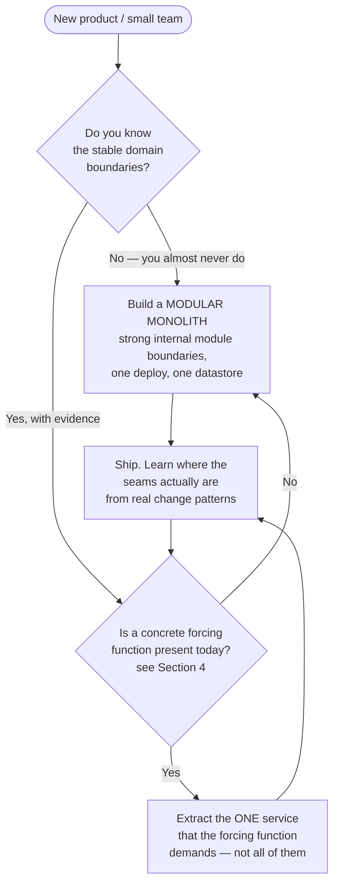
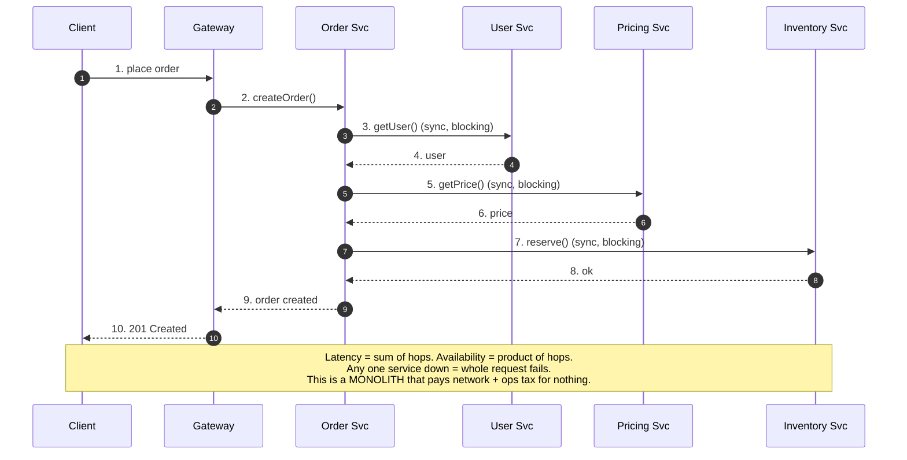
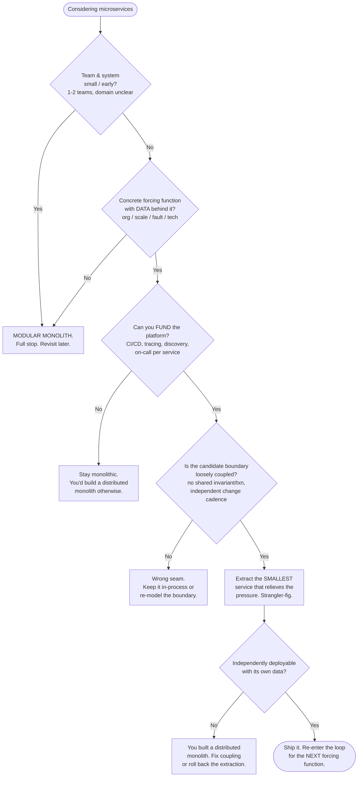

# Monolith vs Microservices — Senior

<!-- level-focus -->
At senior level, focus on this question:

> Which system invariant is affected by **Monolith vs Microservices** under failure, load, and change?

Use the smallest realistic scenario that exposes the decision and its failure behavior.
---

## 1. The Central Claim: Monolith First

The default recommendation for a new product or a small team is **start with a monolith** — a single deployable unit, one codebase, one datastore, in-process function calls between modules. This is Martin Fowler's *MonolithFirst* position, and it is not conservatism: it is a claim about **information availability**.

You do not yet know the boundaries of your system. The whole value of microservices is that each service is aligned to a stable business capability with a well-defined interface. But at the start of a product, you do not know which capabilities are stable, which will fuse, which will split, and where the high-traffic seams are. **Microservices force you to commit to boundaries at the moment you have the least information to place them well.**

A monolith lets you defer that commitment. Inside one process, moving a boundary is a refactor — rename, move a package, change a function signature — done in a single atomic commit, verified by the compiler and the test suite, deployed as one artifact. The same boundary move across a service split is a **cross-service migration**: a network API change, versioned and backward-compatible, coordinated across two deploy pipelines and two on-call rotations, with data that must be dual-written or migrated live. The refactor is minutes; the migration is quarters.



The subtlety seniors add: **"monolith first" does not mean "big ball of mud first."** The correct starting point is a **modular monolith** — clear internal module boundaries, dependencies pointing inward, no shared mutable state across modules, ideally separate schemas or at least separate table ownership per module. A modular monolith is a microservices architecture with the network removed. When a forcing function later demands a split, you extract a module that already has a clean interface. When you skipped modularity, extraction means first untangling a mud ball across the network — the worst of both worlds.

---

## 2. Why Premature Splits Fail: The Boundary Problem

A boundary in the wrong place is expensive in direct proportion to how *chatty* it is. If two components that change together and call each other constantly are separated by a network, every one of those interactions becomes a serialization, a round trip, a retry policy, a timeout, a failure mode, and a place for partial failure to hide.

Consider a concrete misplacement. An early team splits `Orders` and `Inventory` into separate services because they "feel" different. In reality, every order placement must check-and-decrement inventory transactionally. What was one ACID transaction inside a monolith becomes a distributed transaction across two services and two databases:

```text
MONOLITH (correct boundary not yet needed):
  BEGIN;
    SELECT stock FROM inventory WHERE sku = ? FOR UPDATE;   -- one lock, one DB
    INSERT INTO orders (...);
    UPDATE inventory SET stock = stock - 1 WHERE sku = ?;
  COMMIT;                                                    -- atomic, done

PREMATURE SPLIT (wrong boundary, now permanent):
  Order Service  --RPC-->  Inventory Service
    - No cross-service transaction. You now need a SAGA:
        1. reserve inventory (compensatable)
        2. create order
        3. confirm reservation  (or compensate: release on failure)
    - Handle: timeouts, duplicate reserves (idempotency keys),
      orphaned reservations (TTL + reaper), partial failure, retries.
    - A 3-line transaction became a stateful, eventually-consistent workflow.
```

The premature split did not add value — it added a saga, an idempotency layer, a reconciliation job, and a new class of "reserved-but-never-confirmed" bugs. The boundary was *wrong* because `Orders` and `Inventory` are tightly coupled by an invariant (you cannot oversell stock). Coupled-by-invariant things belong on the same side of a transaction boundary, which usually means the same service.

**The rule seniors internalize:** put service boundaries where **coupling is low** — few calls, no shared invariants, independent change cadence, independent data. You discover where that is by watching how the monolith actually changes over months. Boundaries drawn from a whiteboard on day one encode your *guesses* about the domain; boundaries drawn from six months of commit history encode the *domain itself*. This is why the split, when it comes, should follow evidence, not aesthetics.

---

## 3. The Cost Curve: Productivity vs Complexity Crossover

The single most important mental model at this level is Fowler's **microservice premium** curve. Microservices carry a large **fixed cost** — the tax you pay before writing a line of business logic — but a favorable **marginal cost** as complexity and team count grow. Monoliths are the reverse: near-zero fixed cost, but a marginal cost that rises as the codebase and the number of contributors grow, because everyone contends over one artifact, one deploy, one test suite, one blast radius.

The two cost profiles cross. Below the crossover, the monolith delivers more feature throughput per unit effort. Above it, microservices do. The entire debate reduces to a single question: **which side of the crossover is your system on, and which way is it moving?**

Read the crossover honestly:

- **Left of crossover (small system, 1–2 teams):** the monolith wins decisively. Microservices here spend most of their energy on infrastructure that a monolith gets for free — in-process calls instead of RPC, one transaction instead of a saga, one deploy instead of orchestration, one log stream instead of distributed tracing. Choosing microservices here is buying a fleet-management system to drive to the grocery store.
- **The crossover region (medium):** genuinely ambiguous. This is where judgment, not dogma, decides — and where the answer is often "extract the two or three services that hurt, keep the rest as a monolith." Architecture is not binary.
- **Right of crossover (large system, many teams):** microservices win because the monolith's marginal cost has gone superlinear — merge conflicts, coupled deploys, one team's bug freezing everyone's release, a test suite that takes an hour, and a codebase no single person understands. The independence microservices buy is now worth its fixed cost.

The fixed cost you are buying with microservices is concrete and must be *staffed*, not wished for: service templates and scaffolding, CI/CD per service, a container platform, service discovery, centralized config, distributed tracing, log aggregation, a metrics stack, an API gateway, contract testing, and an on-call structure per service. If you cannot fund that platform, you are not choosing microservices — you are choosing a distributed monolith (Section 5) by accident.

---

## 4. What Actually Forces a Split

Do not split for reasons of taste, résumé, or "modern architecture." Split when a **concrete forcing function** appears that a monolith cannot answer. There are essentially four, and a valid reason to split is nearly always one of them:

| Forcing function | The pain in the monolith | What extraction buys |
|---|---|---|
| **Organizational scaling** | Many teams contending over one codebase/deploy; merge hell; coupled release trains; a team blocked waiting to ship | Independent deployability — each team owns a service, ships on its own cadence (Conway's Law made deliberate) |
| **Independent scaling** | One hot path (e.g., image processing, search) needs 50× the CPU of the rest; you must scale the whole monolith to scale one function, wasting money | Scale the hungry component alone; right-size everything else |
| **Fault isolation** | One module's memory leak / runaway query / bad deploy takes down the entire application | A blast-radius boundary — the failing service degrades, the rest stays up (with bulkheads/circuit breakers) |
| **Technology heterogeneity** | A workload needs a different language/runtime/datastore (ML in Python, low-latency in Go/Rust, a graph DB) that does not fit the monolith's stack | Each service picks the right tool; polyglot where it pays |

Two disciplines separate a senior from a mid-level engineer here:

1. **Extract the smallest thing that relieves the pressure.** If the forcing function is "search needs to scale independently," extract *search* — one service — not "let's decompose everything into microservices." The monolith continues to exist and continues to be fine for everything not under pressure. This is the **strangler fig** approach: services bud off the monolith one at a time, each justified by its own forcing function, and the monolith shrinks gradually rather than being detonated in a big-bang rewrite (which is the single most reliable way to kill a product).

2. **Verify the forcing function is real, with data.** "We might need to scale independently someday" is not a forcing function; it is speculation, and speculation is exactly the wrong input for an expensive, hard-to-reverse decision. A real forcing function has a metric attached: *this team has been blocked on the shared deploy for N of the last M sprints*; *this endpoint consumes 60% of cluster CPU and its traffic grows 15% month-over-month*; *this module has caused 4 of the last 5 full outages.*

---

## 5. The Distributed Monolith: The Failure Mode of a Bad Split

The distributed monolith is the architecture you get when you pay the **full fixed cost of microservices** and receive **none of the marginal benefit**. It is microservices in deployment topology and a monolith in coupling — the strictly worst quadrant, and by far the most common way microservices migrations fail.

You have a distributed monolith when:

- Services **must be deployed together** in lockstep — you cannot ship service A without simultaneously shipping B and C, so you have not actually gained independent deployability.
- A single user request **fans out synchronously** through five services, so latency is additive and availability is multiplicative (five 99.9% services in a synchronous chain yield ≈ 99.5% end-to-end — worse than one monolith).
- Services **share a database** (or share tables), so a schema change breaks other teams and you have not gained independent data ownership.
- Services are **chatty** — dozens of RPCs where the monolith had function calls — so you have converted cheap, reliable in-process calls into expensive, failure-prone network calls for no gain.



The diagnosis and the cure are both about **coupling**, not topology:

- **Deployment coupling** → the split followed technical layers (a "user-data service," a "business-logic service") instead of business capabilities. Redraw boundaries around capabilities that change independently.
- **Temporal coupling** (everything is synchronous request/response) → replace synchronous fan-out with **asynchronous events** where the semantics allow. If the order does not truly need pricing *inline*, publish an `OrderPlaced` event and let pricing react. Async decoupling is what makes availability additive-forgiving instead of multiplicative-fragile.
- **Data coupling** (shared database) → give each service its own datastore; integrate through APIs and events, never through the database.

**The senior's litmus test:** *Can each service be deployed to production independently, at any time, without coordinating with another team?* If the answer is no, you have a distributed monolith, and you would have been better off with an actual monolith — it is simpler, faster, and cheaper. Independent deployability is not a nice-to-have of microservices; it **is** the definition. Without it, you have the costs and none of the point.

---

## 6. Reversibility: Splitting Is Cheaper Than Merging Back

Architectural decisions have a direction of cost asymmetry, and this one is stark: **splitting a monolith is a two-way-ish door; un-splitting microservices back into a monolith is a demolition.** This asymmetry is the strongest argument for defaulting to the monolith and splitting later rather than the reverse.

Why the asymmetry:

- **Monolith → services (extraction):** you carve a module out along a seam, put an API in front of it, migrate its data, and cut traffic over. Painful, but *incremental and well-trodden* — the strangler fig pattern exists precisely for this, and you can do it one service at a time, pausing or reversing an individual extraction if it goes wrong.
- **Services → monolith (consolidation):** you must merge multiple codebases (often in different languages), reconcile independently-evolved data models into a shared schema, collapse separate deploy pipelines, and unify ownership across teams who each built their own conventions. There is no "consolidate one service at a time" pattern that is remotely as clean. Teams that over-split rarely merge back; they instead limp along with the operational tax forever, because merging costs more than living with the pain.

The practical consequence for how you make the decision: because splitting later is comparatively cheap and merging later is brutally expensive, **the burden of proof is on the split, not on the monolith.** When uncertain, stay monolithic — you preserve optionality. Splitting prematurely spends optionality you cannot easily buy back. "Start monolithic, extract under pressure" is not merely a common practice; it is the strategy that keeps the cheaper reversal on the table.

---

## 7. A Decision Framework

Put the pieces together into a decision you can defend in a design review. The framework runs top to bottom; you split only when a gate genuinely opens.



The framework's five gates, stated plainly:

1. **Scale/maturity gate** — small and early defaults to monolith, always.
2. **Forcing-function gate** — no data-backed forcing function, no split. Speculation does not open the gate.
3. **Platform-funding gate** — if you cannot pay the microservices fixed cost (the operational platform), you must not choose microservices; you will get the distributed-monolith failure mode.
4. **Boundary gate** — split only along seams of low coupling. Coupled-by-invariant stays together.
5. **Independence gate** — the extracted service must be independently deployable with its own data, or it is not a microservice and you have lost the plot.

---

## 8. When Each Wins — The Comparison Matrix

Cost and benefit are not properties of the architecture in the abstract; they are functions of **team count and scale.** The same choice that is obviously right at 100 engineers is obviously wrong at 5.

| Dimension | Monolith | Microservices |
|---|---|---|
| **Fixed (upfront) cost** | Very low — one repo, one deploy, one datastore | High — platform, CI/CD ×N, discovery, tracing, gateway, per-service on-call |
| **Marginal cost as it grows** | Rises (contention over one artifact, coupled deploys, huge test suite) | Flatter (teams deploy independently) |
| **Deploy independence** | None — everyone ships together | Full — per service, any time (if done right) |
| **Cross-cutting transaction** | Easy — one ACID transaction | Hard — sagas, eventual consistency, compensation |
| **Debugging a request** | Easy — one stack trace, one log | Hard — distributed tracing across services |
| **Fault isolation** | Weak — one module can crash all | Strong — bulkheaded per service |
| **Independent scaling** | No — scale the whole app | Yes — scale hot services alone |
| **Tech heterogeneity** | No — one stack | Yes — polyglot |
| **Refactoring a boundary** | Cheap — compiler-checked refactor | Expensive — versioned API + data migration |
| **Onboarding a new engineer** | Easy early, hard once it's huge | Hard globally, easy per-service scope |

**When the monolith wins:**

- Early-stage products and startups where the domain is still being discovered.
- Small teams (roughly 1–3 teams / < ~15–20 engineers) — below the crossover, the coordination overhead of services exceeds their benefit.
- Systems with **strong transactional coupling** across most operations (e.g., core banking ledgers) where sagas would add more risk than services remove.
- Any organization that cannot staff the operational platform microservices require.

**When microservices win:**

- Many autonomous teams (dozens of engineers and up) whose primary bottleneck is **coordination on a shared codebase and deploy**.
- Clear, stable, low-coupling domain boundaries validated by real change history.
- Components with **radically different scaling profiles** (a CPU-hungry recommender vs a light CRUD path) or **different runtime needs** (ML in Python, hot path in Go).
- Hard **fault-isolation** requirements where one subsystem must never be able to take down another.

The honest middle ground — where most successful large systems actually live — is neither pole: a **modular monolith with a handful of extracted services**, each service justified by its own forcing function, everything else still in-process. Architecture is a dial, not a switch.

---

## 9. Owning the Decision: SLOs, Reviews, Runbooks

Choosing an architecture is not the end of ownership; it is the start. As the owner you are accountable for the operational and organizational consequences of the shape you picked.

```text
If you chose MONOLITH, own these risks:
  - Deploy-time blast radius: one bad deploy affects everything.
    → Feature flags, canary/blue-green deploys, fast rollback, thorough CI gate.
  - Module erosion: internal boundaries decay into a mud ball without enforcement.
    → Architecture tests (e.g., dependency-direction rules) fail the build on violations.
  - Test-suite time growth: an hour-long suite kills velocity.
    → Test tiering, parallelization, per-module test scoping.

If you chose MICROSERVICES, own these risks:
  - Availability is multiplicative on synchronous chains.
    → Prefer async events; add timeouts, retries with jitter, circuit breakers, bulkheads.
  - Distributed debugging is hard.
    → Distributed tracing (correlation IDs across every hop) is not optional.
  - Data consistency is now the application's problem.
    → Sagas with compensation, idempotency keys, outbox pattern, reconciliation jobs.
  - Ops multiplies by service count.
    → Per-service SLOs + error budgets; a service template so N services don't drift.
```

**In design reviews**, the senior contribution is to surface the *unstated* assumption in a microservices proposal. The three questions that expose most bad splits:

1. *What is the concrete forcing function, and what data supports it?* (Flushes out résumé-driven and speculative splits.)
2. *Can these services be deployed independently, or must they ship together?* (Flushes out the distributed monolith.)
3. *Where is the transactional boundary, and does this split cut through an invariant?* (Flushes out the `Orders`/`Inventory` class of mistake.)

If a proposal cannot answer those three, the review outcome is "stay monolithic, or extract less" — and that is the senior call, even when it is the unpopular one.

---

## 10. Senior Checklist

- [ ] Default is a **modular monolith**; a split requires a documented, data-backed forcing function — not taste or speculation.
- [ ] The starting monolith has **enforced internal module boundaries** (dependency rules in the build) so future extraction is cheap.
- [ ] Each proposed service split maps to **one** of the four forcing functions: org scaling, independent scaling, fault isolation, or tech heterogeneity.
- [ ] Splits follow **low-coupling seams**; nothing coupled by a shared invariant/transaction is split across the network.
- [ ] Extractions are **incremental (strangler fig)** — smallest service that relieves the pressure — never a big-bang rewrite.
- [ ] Every service is **independently deployable with its own data store**; the "must deploy together?" test is answered "no."
- [ ] Synchronous fan-out is minimized; **async events** used where semantics allow, to keep availability from going multiplicative.
- [ ] The **microservices platform is funded** (CI/CD, discovery, tracing, gateway, per-service on-call) before the first split, or the split is deferred.
- [ ] The decision is captured as an ADR recording the forcing function, the boundary rationale, and the reversal criteria — because the cheaper reversal (staying/going monolithic) must stay on the table.

> 📚 **Canonical references:** Martin Fowler, *MonolithFirst* (2015) and *MicroservicePremium* (2015); Sam Newman, *Building Microservices* (strangler fig, independent deployability).

*Next step:* [Monolith vs Microservices — Professional](professional.md)

---

## Apply it

1. State the system invariant that **Monolith vs Microservices** must protect.
2. Mark ownership, state, and failure propagation at each boundary.
3. Compare two designs under load, dependency failure, and future change.
4. Define recovery and compatibility behavior before implementation.
5. Test the riskiest assumption with a focused experiment.

## Verify your work

- The experiment supports the design with evidence, not preference.
- Failure injection shows the blast radius and recovery path.
- Compatibility checks cover old and new callers or data.
- Operational signals reveal invariant violations and recovery progress.

## Review questions

- Which invariant must remain true when Monolith vs Microservices fails?
- Where should recovery responsibility live, and why?
- Which assumption deserves an experiment before implementation?
- How can the design evolve without changing every consumer at once?
