# Monolith vs Microservices — Staff

At Staff and Principal scope, "monolith vs microservices" is not an architecture question — it is an *organizational* one wearing an architecture costume. The service topology you bless becomes the shape of your org chart, your deploy cadence, your on-call rotation, and your hiring plan for the next three years. The question is never "which is better." It is: *what is currently the binding constraint on delivery, and does changing the service boundary relieve it or merely relocate it?* This page is about that judgment call — resisting both cargo-cult microservices and dogmatic monolithism, demanding evidence before a split, governing the reverse when someone over-split, and framing the whole thing for leadership as a business decision with a cost, a break-even, and a reversal criterion.

## Table of Contents

1. [The framing: architecture as a delivery-throughput decision](#1-the-framing-architecture-as-a-delivery-throughput-decision)
2. [The two failure modes: cargo-cult microservices and dogmatic monolith](#2-the-two-failure-modes-cargo-cult-microservices-and-dogmatic-monolith)
3. [Architecture choice by organizational stage](#3-architecture-choice-by-organizational-stage)
4. [The evidence bar for a split](#4-the-evidence-bar-for-a-split)
5. [The evidence-driven split decision (staged)](#5-the-evidence-driven-split-decision-staged)
6. [Governing the reverse: consolidating an over-split fleet](#6-governing-the-reverse-consolidating-an-over-split-fleet)
7. [The migration decision and its true cost](#7-the-migration-decision-and-its-true-cost)
8. [Communicating the tradeoff to leadership](#8-communicating-the-tradeoff-to-leadership)
9. [Symptom-to-action table](#9-symptom-to-action-table)
10. [Second-order consequences and the metrics you watch](#10-second-order-consequences-and-the-metrics-you-watch)
11. [Staff checklist](#11-staff-checklist)

---

## 1. The framing: architecture as a delivery-throughput decision

A monolith and a microservice fleet can serve the identical product at the identical scale. What differs is the *coordination cost per change*. A monolith minimizes the cost of a change that touches many parts (one repo, one refactor, one deploy, one transaction) and maximizes the cost of many teams changing independently (shared deploy pipeline, shared blast radius, merge contention). Microservices invert that: cheap independent change per team, expensive cross-cutting change.

So the real axis is not availability, latency, or scale — a well-built monolith scales horizontally behind a load balancer just fine, and a badly-split fleet has *worse* tail latency because it turned in-process calls into network calls. The axis is **who is blocked on whom, and how often.** Conway's Law is the load-bearing observation: your system's module boundaries will come to mirror your communication boundaries whether you plan it or not. Splitting a service is therefore an act of *org design* — you are declaring a team boundary and giving it an API contract. If the team boundary isn't real, the service boundary is a fiction that generates distributed-systems tax for no delivery benefit.

The Staff mistake is to run this as a technology debate ("microservices are modern, monoliths are legacy"). The Principal reframe is: *a service split is justified only when the coordination cost of the monolith is demonstrably the binding constraint on delivery, and a split is the cheapest thing that relieves it.* Everything else in this page is instrumentation for that one sentence.

## 2. The two failure modes: cargo-cult microservices and dogmatic monolith

Both dogmas are resume-driven or fear-driven, not evidence-driven. Naming them helps you catch yourself.

**Cargo-cult microservices.** A 12-person startup with one product and no delivery bottleneck splits into 30 services because "that's how Netflix does it." The result is a *distributed monolith*: services that must deploy together, share a database, and fail together — you paid the full distributed-systems tax (network partitions, partial failure, eventual consistency, distributed tracing, service discovery, a platform team you don't have) and bought none of the benefit (independent deploy, independent scale, team autonomy) because the teams don't exist to use it. The tell: a "microservice" change routinely requires coordinated releases across three repos. That is a monolith with network calls in the middle — strictly worse than a monolith.

**Dogmatic monolith.** A 300-engineer org with a single deploy pipeline where 40 teams queue behind one release train, every deploy risks everyone's blast radius, and the codebase's build takes 40 minutes so nobody refactors. Here the coordination cost is real and measured, but leadership treats "we've always shipped the monolith" as an identity rather than a choice. The tell: engineers routinely wait hours for a merge slot, roll back each other's changes, and the phrase "we couldn't ship because another team's change broke the build" appears in retrospectives monthly.

The Staff job is to occupy the empirical middle: neither dogma survives contact with the delivery metrics. You split when the metrics say the monolith is the bottleneck; you *don't* split — and you consolidate — when they say it isn't.

## 3. Architecture choice by organizational stage

The single strongest predictor of the right topology is not scale or traffic — it is **team count and growth trajectory.** Architecture should lag org growth by one step: build the monolith you can afford to split later, split when the teams that will own the pieces actually exist.

| Org stage | Team count | Right default | Why | Failure if you skip a stage |
|---|---|---|---|---|
| Startup / single product | 1–2 teams (≤ ~15 eng) | **Modular monolith** | One deploy, one transaction, zero platform tax; iterate on product-market fit, not infra | Premature split → distributed monolith, platform team you can't staff |
| Scale-up | 3–8 teams (~15–60 eng) | **Monolith with enforced module boundaries; extract 1–2 services where boundaries are proven** | Coordination cost rising but not yet dominant; extract only the pieces with distinct scaling or team ownership | Big-bang rewrite to microservices → 12-month stall, no feature velocity |
| Growth | 8–25 teams (~60–200 eng) | **Service-per-bounded-context; a platform team now exists** | Deploy contention is now the measured bottleneck; team autonomy pays for the tax | Staying monolith → release-train gridlock, engineers idle on merge queues |
| Large org | 25+ teams (200+ eng) | **Microservices as the norm, with a paved road** | Independent deploy is non-negotiable at this coordination volume | Under-investment in platform → every team reinvents infra, sprawl |

Two caveats that keep this from being a rule you apply blindly. First, **trajectory matters more than the snapshot**: a 10-engineer team that will be 80 in a year should build the *modular* monolith with clean seams so the future split is cheap — not the microservices they can't yet operate. Second, **the stages are not a ladder you must climb**; a large org can and should keep a monolith for the stable core and only peel off the parts under active, contended change. The topology can be heterogeneous. Amazon, Google, and Shopify all run large, deliberate monoliths alongside services.

## 4. The evidence bar for a split

"It feels big and slow" is not evidence. Before you sanction a split, you demand data that the *monolith's coordination cost*, specifically, is the binding constraint. Ranked from strongest to weakest:

- **Deploy contention.** Number of releases blocked or delayed waiting on another team's change per week; time engineers spend in the merge/release queue; frequency of "someone else's change broke the shared build/deploy" in retros. This is the *primary* signal — it directly measures coordination cost. If teams deploy independently and rarely block each other, the monolith is not your bottleneck and a split will not help.
- **Blast radius / change-failure coupling.** Fraction of incidents where one team's change degraded an unrelated team's feature. High coupling means a shared deploy is a shared risk — a real, quantifiable reason to isolate.
- **Divergent scaling needs.** A subsystem whose resource profile (CPU-heavy image processing, memory-heavy search, spiky async jobs) forces the *whole* monolith to be provisioned for its peak. Here a split lets you scale one axis independently — a cost argument, and one of the few *technical* justifications that stands alone.
- **Divergent release cadence / risk profile.** A payments core that must ship monthly with heavy review sitting in the same deploy unit as a marketing surface that wants to ship hourly. The mismatch is a coordination cost.
- **Team ownership clarity.** A bounded context with a stable, distinct owning team and a clean API is *ready* to be a service. Absence of a clear owner is a strong signal *not* to split — you'd create an orphan service.

Note what is *not* on the list: "the codebase is large," "microservices are best practice," "a senior engineer wants to try Kubernetes." Codebase size is addressed by modularization *inside* the monolith first — enforced module boundaries, build isolation, and internal APIs deliver most of the "independent development" benefit at none of the operational cost. Reach for a network boundary only when the in-process boundary provably isn't enough.

## 5. The evidence-driven split decision (staged)

This is the decision flow a Staff engineer runs — and defends in an ADR — before any split is approved. Notice how many paths end in "don't split."

```mermaid
stateDiagram-v2
    [*] --> Symptom: Team reports "we're blocked / it's too slow to ship"
    Symptom --> Measure: Instrument the claim
    Measure --> DeployMetrics: Pull deploy-contention data
    DeployMetrics --> Contended: Merge-queue wait + cross-team deploy blocks?

    Contended --> Modularize: NO — coordination cost is low
    Modularize --> [*]: Fix in-process (module boundaries, build speed). Do NOT split.

    Contended --> OwnerCheck: YES — coordination cost is the bottleneck
    OwnerCheck --> NoOwner: Is there a stable team + clean bounded context?
    NoOwner --> Modularize: NO — no owner → split creates an orphan
    NoOwner --> CostCheck: YES — owner + boundary exist
    CostCheck --> BreakEven: Model the split cost vs. the delivery gain
    BreakEven --> Reject: Gain < distributed-systems tax
    Reject --> [*]: Don't split; revisit at next 2x of team count
    BreakEven --> Approve: Gain > tax, break-even < ~2-3 quarters
    Approve --> Extract: Strangler-fig extraction, one seam at a time
    Extract --> Verify: Did merge-queue wait + blast radius actually drop?
    Verify --> Consolidate: NO — regret path
    Consolidate --> [*]: Fold it back (see §6)
    Verify --> [*]: YES — boundary was real
```

The discipline the diagram encodes: **every split is a hypothesis with a measurable prediction** (merge-queue wait will drop, cross-team deploy blocks will fall) and a *verification* step that can send you to the consolidation path. A split you can't measure the payoff of is a split you shouldn't have approved. Extraction is always incremental — strangler-fig, one seam at a time, never a big-bang rewrite, because a big-bang rewrite freezes feature delivery for the exact quarters your competitors are shipping.

## 6. Governing the reverse: consolidating an over-split fleet

Splitting gets celebrated; consolidating gets treated as an admission of failure. That asymmetry is why over-split fleets persist for years. A Staff engineer must make *un-splitting* a normal, respectable governance action — a right-sizing, not a retreat. Amazon Prime Video's 2023 move of a monitoring pipeline from serverless microservices back to a monolith (a 90% cost reduction, by their account) is the canonical public example that consolidation is a legitimate engineering result, not a regression.

You consolidate when the split failed to pay off or was never justified. Symptoms of an over-split fleet:

- **Chatty synchronous call chains** where a single user request fans out through 6+ services, each an added network hop, each a new tail-latency and partial-failure source — the split turned reliable in-process calls into a distributed transaction nobody designed.
- **Services that always deploy together.** If A, B, and C must ship in lockstep, they are one deploy unit pretending to be three — a distributed monolith. Merge them.
- **A service per developer** — more services than teams, so the "team autonomy" benefit is fictional and every engineer context-switches across five repos to make one change.
- **Shared database across "separate" services**, so the boundary is an illusion and every schema change is a coordinated cross-service release — worst of both worlds.
- **Operational cost per service** (CI/CD, observability, on-call, infra) that dwarfs the service's actual complexity — you're paying fleet overhead for a 200-line service.

The consolidation move is the inverse strangler: merge services that share a team, a deploy cadence, and a data model back into a module inside a modular monolith, preserving the *logical* boundary in code while removing the *network* boundary. You keep the seam; you delete the RPC.

## 7. The migration decision and its true cost

The most expensive mistake in this whole topic is the **big-bang rewrite** — pausing feature work to re-platform monolith-to-microservices (or the reverse) as a project with an end date. It nearly always overruns, and during the overrun your delivery throughput — the very thing you were trying to improve — goes to zero. The correct posture is *incremental, always-shippable, reversible*: strangler-fig extraction where the monolith keeps serving while you peel off one bounded context at a time behind a routing facade, each step independently valuable and independently abandonable.

Budget the true cost honestly, because leadership will only hear the headline "we'll move faster." The tax of a microservices topology, per service, roughly:

| Cost dimension | Monolith | Microservices fleet |
|---|---|---|
| Deploy pipeline | 1 shared | 1 per service (paved road amortizes this) |
| Observability | In-process traces | Distributed tracing, correlation IDs, service maps — mandatory, not optional |
| Data consistency | ACID transactions | Sagas / eventual consistency / outbox — you rewrite your consistency model |
| Failure model | Process up or down | Partial failure is the *normal* case; every call needs timeout + retry + circuit breaker |
| Platform staffing | ~none | A platform team (service discovery, mesh, CI/CD, on-call tooling) |
| Local dev | Run one thing | Run N things or mock them — developer experience tax |
| Latency | In-process ns | Network hops, ms each, compounding across the call chain |

The break-even question you must answer *before* approving: **when does the cumulative delivery gain (measured in unblocked engineer-weeks) exceed the cumulative tax (platform build-out + per-service overhead × time)?** If break-even is beyond ~2–3 quarters, or you can't articulate it at all, don't do it yet. And every migration ADR states its reversal criterion: the metric that, if it doesn't move, means you fold the service back (§6). One-way doors demand more evidence than two-way doors; keep as much of this decision two-way as you can.

## 8. Communicating the tradeoff to leadership

Leadership does not fund "microservices." They fund *outcomes*: faster time-to-market, higher availability, lower cost, or reduced key-person risk. Translate the architecture decision into that vocabulary or it will be misjudged as either a rubber-stamp modernization or a boondoggle.

The framing that works:

- **Lead with the constraint, not the solution.** "Six teams are losing a combined ~30 engineer-days per month to deploy contention on the monolith; here is the data" beats "we should adopt microservices." You are asking to relieve a measured business cost.
- **Name the cost and the break-even out loud.** "This split costs roughly two quarters of platform investment and adds $X/month of infra; it pays back in unblocked delivery by Q3. Here is the metric we'll watch to confirm." Leadership trusts the engineer who volunteers the downside.
- **State the reversal criterion.** "If merge-queue wait doesn't drop by 50% within a quarter, we consolidate and I'll own that call." This turns a scary irreversible-sounding bet into a monitored experiment.
- **Reject resume-driven framing explicitly.** When a proposal's justification is "it's modern" or "everyone uses microservices," your job is to say — in the room — that the delivery data doesn't support it *yet*, and to keep the monolith. That "no" is often the highest-leverage thing a Staff engineer does all quarter, and it protects the org from paying a tax it can't afford.
- **Make heterogeneity acceptable.** "We keep the stable core as a monolith and split only the two contended contexts" is a more credible plan than "we're going microservices," and it costs a fraction as much.

## 9. Symptom-to-action table

The diagnostic a Staff engineer keeps in their head: a symptom does not imply a topology — it implies an *investigation*, and often the right action is neither split nor consolidate but "fix it in place."

| Symptom | Weak (dogmatic) reaction | Staff action |
|---|---|---|
| "The codebase is huge and slow to build" | Split into microservices | Modularize in-process; fix build isolation & caching first — split is not a build-speed tool |
| Teams wait hours in the merge/release queue | "That's just how it is" | Measure deploy contention; if high and owners exist → split the contended context |
| One team's change keeps breaking another's feature | Blame the team | High change-failure coupling = candidate for isolation; split along the coupling seam |
| A single request fans out through 6+ services | Add more caching | Over-split; consolidate the chatty chain back into one deploy unit |
| Services A/B/C always ship together | Add release orchestration | Distributed monolith; merge them — the boundary is fiction |
| One subsystem forces over-provisioning the whole app | Buy bigger boxes | Divergent scaling need — extract *that* subsystem only |
| "We should use microservices, it's best practice" | Approve the rewrite | Ask for the delivery-bottleneck evidence; absent it, keep the monolith |
| More services than engineers | Celebrate the architecture | Fictional autonomy; consolidate to services-per-team |
| Payments (monthly, high-review) shares a deploy with marketing (hourly) | Slow marketing down | Divergent cadence/risk — split by release profile |

## 10. Second-order consequences and the metrics you watch

Every topology decision has effects that surface 6–12 months later, long after the celebration.

- **A premature split** manifests as a *stalled roadmap*: the quarters spent building platform plumbing were quarters not spent on product, and the distributed-systems tax slows every subsequent change. The metric that reveals it: feature lead time went *up*, not down, after the split — and cross-service incidents (partial failures, saga inconsistencies) now dominate the on-call load.
- **A premature consolidation** (folding services back too aggressively) manifests as *renewed deploy contention* — the merge queue you thought you fixed reappears as the org grows past the point the monolith could absorb. Metric: merge-queue wait climbing again with headcount.
- **A correct split** shows up as *decoupled deploy frequency*: each team's deploy rate rises independently, cross-team deploy blocks fall toward zero, and blast radius per incident shrinks. These are the DORA-adjacent signals worth putting on a dashboard.
- **Conway's Law backlash**: if you split the system but not the org (or vice versa), the boundary fights the communication structure and you get constant boundary-renegotiation churn — services whose API contracts change every sprint because the "owning" team isn't really autonomous.

The one dashboard a Staff engineer maintains through all of this: **deploy frequency and merge-queue wait *per team*, plus cross-team deploy-block count.** That triad tells you, continuously, whether coordination cost is your binding constraint — which is the only question that should drive the split-or-consolidate decision. When those numbers are healthy, resist every proposal to change the topology; when they degrade, you already have the evidence to act.

## 11. Staff checklist

- [ ] The decision is captured as an ADR (§35.1) whose justification is *delivery-bottleneck evidence*, not "best practice" or "modernization."
- [ ] Deploy-contention data (merge-queue wait, cross-team deploy blocks) was pulled and is the primary input — the split hypothesis has a measurable prediction.
- [ ] A stable owning team and a clean bounded context exist for each proposed service; no orphan services are being created.
- [ ] The distributed-systems tax (observability, consistency model, partial-failure handling, platform staffing) is budgeted, not hand-waved; a break-even is stated.
- [ ] Migration is incremental and always-shippable (strangler-fig), never a big-bang rewrite that freezes feature delivery.
- [ ] A reversal criterion is written: the metric that, if unmoved, triggers consolidation — and consolidation is framed as legitimate right-sizing, not failure.
- [ ] Heterogeneity is on the table: keep the stable core monolithic, split only the contended contexts.
- [ ] The tradeoff was communicated to leadership in outcome terms (time-to-market, cost, unblocked engineer-weeks), and resume-driven proposals were rejected on the record.

*Next step:* [Monolith vs Microservices — Interview](interview.md)
