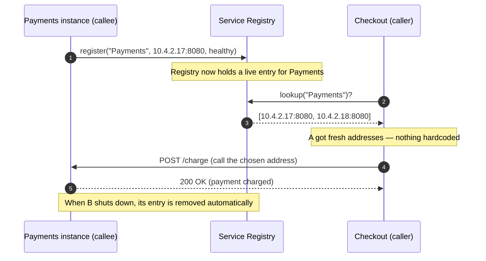
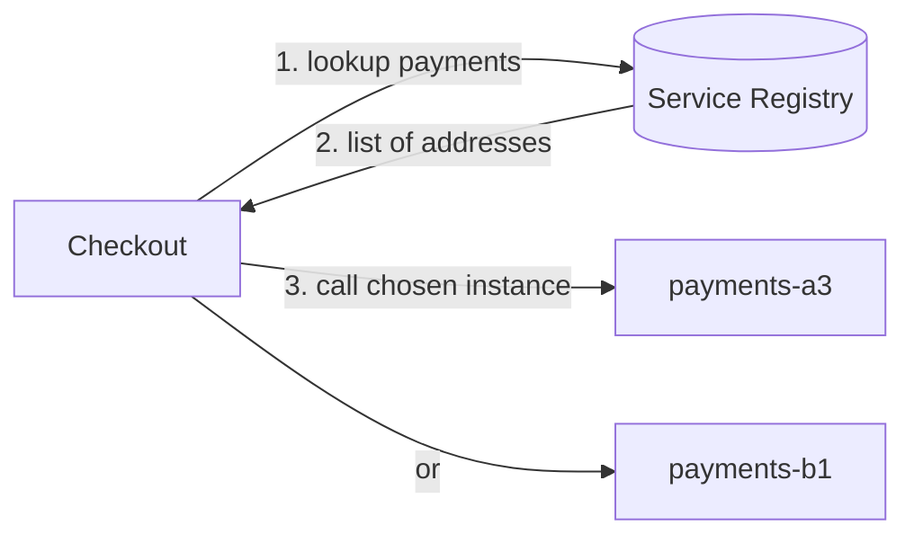
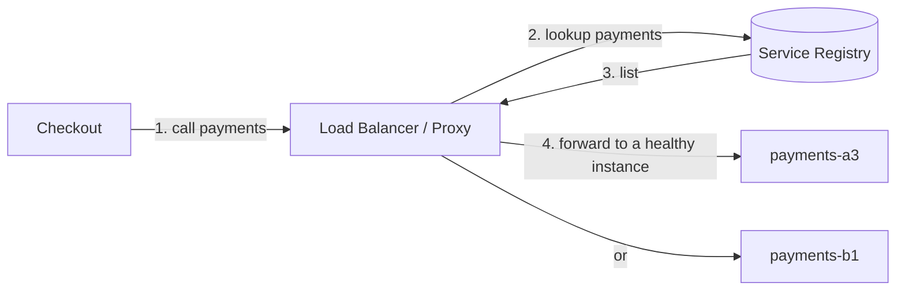
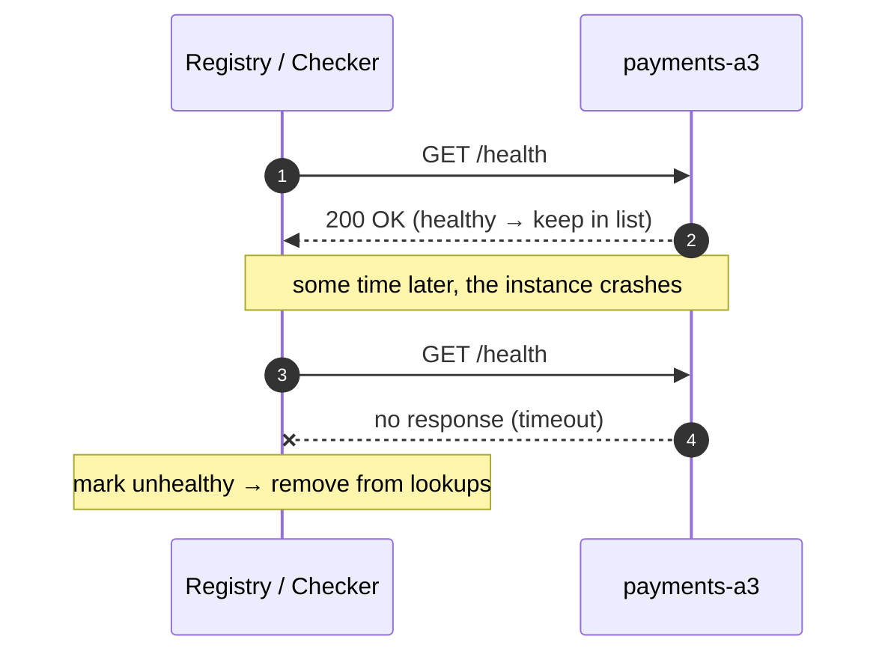

# Service Discovery — Junior

<!-- level-focus -->
At junior level, focus on this question:

> How can I apply **Service Discovery** in one small example and prove the result?

Use the smallest realistic scenario that exposes the decision and its failure behavior.
## 1. The Problem: Addresses That Won't Sit Still

Imagine an online store. The **Checkout** service (call it service **A**) needs to ask the
**Payments** service (service **B**) to charge a card. To send that request over the network,
A needs B's *address* — an IP and port, like `10.4.2.17:8080`. Simple enough on one laptop.

Now put it in a real cloud environment, and that address becomes a moving target:

- **Autoscaling.** Traffic spikes, so the platform launches three more copies of Payments.
  Each new copy gets a *fresh* IP the moment it boots. Traffic falls, and two copies are shut
  down — their IPs vanish.
- **Restarts and crashes.** A Payments instance crashes and is replaced by a healthy one on a
  different machine, with a different IP.
- **Deploys.** You ship a new version. The orchestrator kills the old instances and starts new
  ones — again, new IPs.
- **Rescheduling.** The platform moves a container from a busy host to an idle one to balance
  load. Same service, brand-new address.

The uncomfortable truth: **in the cloud, a service instance's network location is temporary.**
The *service* "Payments" is stable and permanent; any particular *instance* of it is ephemeral.
Service A cares about the stable name "Payments," but the network only understands the ephemeral
address. Something has to bridge that gap. That something is **service discovery**.

> Definition, in one sentence: **service discovery is the mechanism by which a service finds the
> current network location(s) of another service, without anyone hardcoding those locations.**

---

## 2. Why Hardcoding Breaks

The naïve fix is to write B's address directly into A's code or config:

```text
# Checkout service config  (the WRONG way)
PAYMENTS_URL = "http://10.4.2.17:8080"
```

This works for exactly as long as `10.4.2.17` stays alive and stays Payments. In a dynamic
environment, that is often minutes. Here is what goes wrong:

- **The instance disappears.** Payments at `10.4.2.17` gets rescheduled to `10.4.9.3`. A keeps
  dialing `10.4.2.17`, gets connection-refused, and every checkout fails — even though Payments
  is perfectly healthy at its new address.
- **You can't scale reads across copies.** Even if you list several IPs by hand, the list is a
  snapshot frozen at deploy time. When autoscaling adds a fourth copy, A never learns about it,
  so that copy sits idle while the other three are overloaded.
- **Config changes require redeploys.** Every IP change means editing config and restarting A.
  Multiply that by dozens of services calling dozens of others and it becomes unmanageable.
- **It couples A to B's deployment.** A now "knows" where B lives. B can't move, scale, or
  restart freely without breaking A. Services should depend on each other's *name*, not on each
  other's current *placement*.

The lesson: **hardcoding an address bakes a temporary fact into a permanent place.** We need a
level of indirection — ask by name, resolve to an address *at the moment of the call*.

---

## 3. The Core Idea: A Live Registry

The solution introduces one new component: a **service registry** (also called a service catalog).
Think of it as a constantly-updated phone book for services.

Two roles interact with it:

1. **Registration (the callee's job).** When a Payments instance starts up and is ready to serve
   traffic, it announces itself: *"I am Payments, I'm at `10.4.2.17:8080`, and I'm healthy."* This
   entry goes into the registry. When the instance shuts down (or dies), its entry is removed.
2. **Discovery / lookup (the caller's job).** When Checkout wants to call Payments, it does **not**
   use a hardcoded IP. It asks the registry: *"What are the current healthy addresses for
   Payments?"* The registry answers with the live list. Checkout picks one and sends its request.



The key shift: **A no longer stores B's address. A stores B's *name* and looks up the address
fresh, right before calling.** If Payments moved five minutes ago, the registry already knows,
and A gets the new address without a single line of code changing.

---

## 4. What's Inside the Registry

A registry entry ties a stable **service name** to the **live details** of one instance. A single
service usually has many entries — one per running instance. Conceptually:

| Field | Example | Why it's there |
|-------|---------|----------------|
| Service name | `payments` | The stable name callers ask for |
| Instance ID | `payments-7f9c-a3` | Distinguishes one copy from another |
| Address (IP:port) | `10.4.2.17:8080` | Where to actually send the request |
| Health status | `healthy` / `unhealthy` | So callers skip broken instances |
| Metadata (optional) | `version=2.3, zone=us-east-1a` | Helps pick the *right* instance |

So the registry for a scaled-out Payments service might look like:

| Service | Instance | Address | Health |
|---------|----------|---------|--------|
| payments | payments-7f9c-a3 | 10.4.2.17:8080 | healthy |
| payments | payments-7f9c-b1 | 10.4.2.18:8080 | healthy |
| payments | payments-7f9c-c4 | 10.4.9.3:8080 | unhealthy |

When Checkout looks up `payments`, a good registry returns only the **healthy** rows —
`10.4.2.17` and `10.4.2.18` — and hides the sick one. Checkout picks one (often at random or
round-robin, which is a simple form of load balancing) and sends its request there.

This table is *live*: instances add and remove their own rows as they come and go. The registry
is the single source of truth for "who is up and where."

---

## 5. A Concrete Walkthrough: A Finds B

Let's trace one checkout end to end, in a system with two Payments instances running.

**Setup — instances register themselves.**

1. `payments-a3` boots on host `10.4.2.17`, becomes ready, and registers:
   `payments → 10.4.2.17:8080, healthy`.
2. `payments-b1` boots on host `10.4.2.18`, becomes ready, and registers:
   `payments → 10.4.2.18:8080, healthy`.

The registry now holds two healthy Payments entries.

**The call — Checkout needs to charge a card.**

3. A customer clicks "Pay." The Checkout service needs Payments.
4. Checkout asks the registry: *"Give me healthy addresses for `payments`."*
5. Registry replies: `[10.4.2.17:8080, 10.4.2.18:8080]`.
6. Checkout picks the first one, `10.4.2.17:8080`, and sends `POST /charge`.
7. `payments-a3` charges the card and returns `200 OK`. Checkout completes the order.

**The twist — an instance dies mid-day.**

8. `payments-a3` crashes. Its health check starts failing (see §7), so the registry marks it
   unhealthy and drops its row. The registry now returns only `[10.4.2.18:8080]`.
9. The next checkout looks up `payments`, gets `10.4.2.18:8080`, and succeeds — **with no code
   change, no redeploy, no human paged.** Checkout never even knew `a3` was gone.

That last point is the whole payoff. The failure of one instance is invisible to callers because
callers never depended on that instance — they depended on the *name* `payments`, resolved fresh.

---

## 6. Client-Side vs Server-Side Lookup

There are two common shapes for "where does the lookup happen." A junior should recognize both;
you'll go deeper in later tiers.

**Client-side discovery.** The caller (Checkout) talks to the registry directly, gets the list,
and chooses an instance itself.



**Server-side discovery.** The caller doesn't talk to the registry at all. It just sends its
request to a fixed **proxy / load balancer**, and *that* component does the lookup and forwards
the request. To Checkout, "Payments" is a single stable address — the proxy hides the churn.



Both solve the same problem — the caller never hardcodes an instance address. The difference is
*who* asks the registry: the client itself, or a proxy in front of the callee. A very common
real-world version of server-side discovery is plain **DNS**: the caller looks up
`payments.internal`, and DNS returns a current healthy address. Either way, the caller asks by
name and gets a live answer.

---

## 7. Health Checks: Keeping the List Honest

A registry is only useful if its list is *true*. An entry that points to a dead instance is worse
than no entry — it sends real traffic into a black hole. So the registry (or the platform around
it) continuously verifies that each registered instance is actually alive and ready. This is a
**health check**.

Two common styles:

- **Heartbeat (push).** Each instance periodically pings the registry: *"still alive."* If the
  registry hasn't heard from an instance within a timeout, it assumes the instance is gone and
  removes it. A crashed instance stops sending heartbeats, so it naturally ages out.
- **Probe (pull).** The registry (or a load balancer) periodically calls a small endpoint on the
  instance, conventionally `GET /health`, and expects a `200 OK`. If it gets errors or timeouts a
  few times in a row, it marks the instance unhealthy and stops routing to it.



The result: lookups return only instances that recently proved they're alive. Health checking is
what lets §5's crash recovery happen automatically — the registry notices the death and heals the
list before the next caller ever sees the failure.

---

## 8. Hardcoded vs Discovery — The Comparison

| Aspect | Hardcoded addresses | Service discovery |
|--------|--------------------|--------------------|
| What the caller stores | An IP:port | A service *name* |
| When an instance moves | Caller breaks until config edit + redeploy | Caller adapts automatically |
| Autoscaling new copies | Ignored; new copies sit idle | Picked up automatically; traffic spreads |
| An instance crashes | Requests fail into a dead address | Registry removes it; traffic reroutes |
| Deploys (new version) | Requires updating callers' config | Transparent to callers |
| Coupling | Caller tied to callee's placement | Caller tied only to callee's name |
| Human effort | Manual edits on every change | None for routine churn |
| Right for | A fixed, never-moving endpoint | Dynamic, elastic, cloud environments |

The trade-off isn't subtle: hardcoding is simpler to *start* but breaks constantly in a dynamic
system; discovery adds one moving part (the registry) but makes the whole system resilient to the
churn that clouds create by design.

---

## 9. Key Terms

| Term | Definition |
|------|-----------|
| Service | A stable, named capability (e.g., "Payments"), independent of where it runs |
| Instance | One running copy of a service, with its own ephemeral address |
| Service registry | The live directory mapping service names → current healthy instance addresses |
| Registration | An instance announcing its address (and health) to the registry when it starts |
| Discovery / lookup | A caller asking the registry for a service's current addresses |
| Health check | A periodic test (heartbeat or probe) confirming an instance is alive and ready |
| Heartbeat | Instance-initiated "I'm alive" signal sent to the registry on a timer |
| Client-side discovery | The caller queries the registry and chooses an instance itself |
| Server-side discovery | A proxy/load balancer does the lookup and forwards the request |

---

## 10. Common Mistakes at This Level

1. **Confusing a service with an instance.** "Payments" is one service; the three copies serving
   it are instances. You look up the *service* by name; you call an *instance* by address. Blurring
   the two is the root of most confusion here.
2. **Thinking discovery replaces load balancing.** Discovery finds *which* instances exist;
   something still has to *choose one* per request. Often they live together (a proxy does both),
   but they're distinct jobs.
3. **Trusting the registry blindly.** A registry entry can be stale (the instance died a moment
   ago). Callers still need timeouts and retries — discovery reduces failures, it doesn't abolish
   them.
4. **Forgetting deregistration.** An instance that registers on startup but never removes itself on
   shutdown leaves a "ghost" entry pointing at a dead address. Health checks are the safety net
   that eventually clears such ghosts.
5. **Reaching for a registry when you don't need one.** If an endpoint truly never moves (a fixed
   third-party API, a single database with a stable DNS name), a stable address or DNS name is
   fine. Discovery earns its cost when instances actually churn.

---

## 11. Hands-On Exercise

You have a `web` service that calls an `orders` service. `orders` runs as **three** instances
behind autoscaling, so their IPs change throughout the day.

On paper, work through the following:

1. **Draw the registry table** for `orders` with three healthy instances (invent plausible
   IP:port values and an instance ID for each).
2. **Trace one call:** show the exact sequence — `web` asks the registry for `orders`, gets the
   list, picks one, and calls it. Number the steps like the diagram in §3.
3. **Kill an instance:** cross out one instance's row and explain, in one sentence each, (a) how
   the registry learns it died and (b) what the *next* call from `web` sees.
4. **Add capacity:** autoscaling starts a fourth `orders` instance. Show how it appears in the
   registry and why `web` starts sending it traffic *without any change to `web`'s code or config*.

If you can explain step 3(b) — that the caller reroutes automatically because it depended on the
*name*, not the address — you've internalized the core of service discovery.

---

*Next step:* [Service Discovery — Middle](middle.md)

---

## Apply it

1. Choose one small, known input for **Service Discovery**.
2. Predict the output or observable behavior.
3. Run the smallest example or probe that exercises the concept.
4. Change one input to trigger a failure or boundary case.
5. Explain the evidence using the guide's vocabulary.

## Verify your work

- Record the exact input, command or code path, and output.
- Repeat the probe and confirm the result is consistent.
- Show one expected success and one expected failure.
- Resolve any difference between the prediction and the evidence.

## Review questions

- What problem does Service Discovery solve in the example?
- Which input changes the observed result, and why?
- What is the smallest useful success check?
- Which beginner mistake would your evidence catch?
