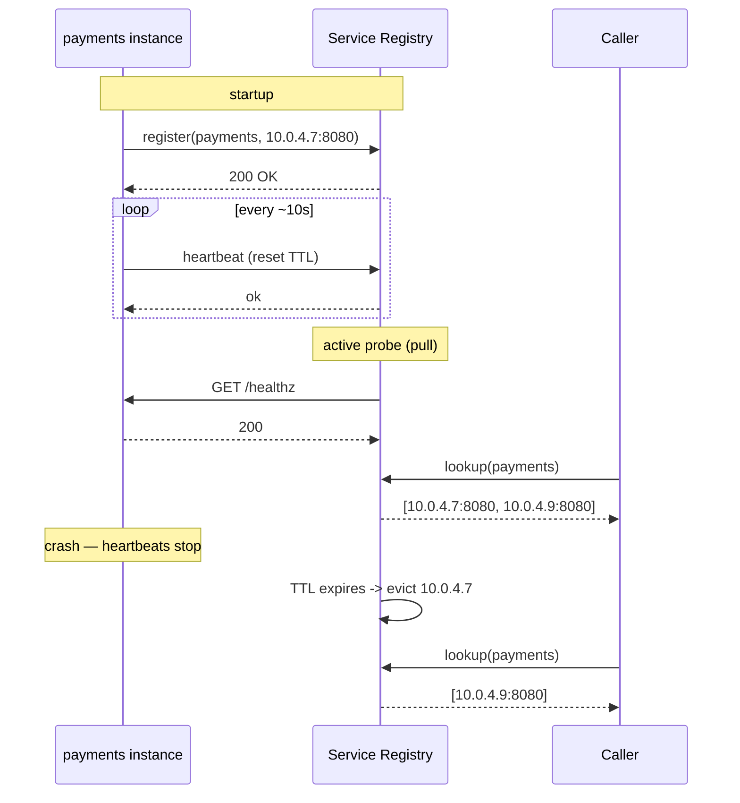
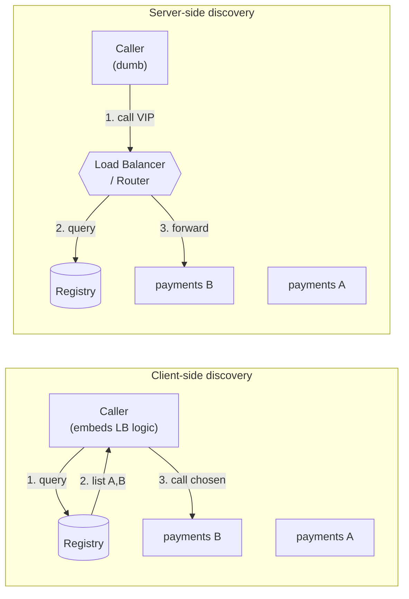

# Service Discovery — Middle

<!-- level-focus -->
At middle level, focus on this question:

> Where does **Service Discovery** belong in a maintainable component, and which trade-off selects the design?

Use the smallest realistic scenario that exposes the decision and its failure behavior.
## 1. The problem, precisely

Split the concern into three sub-problems, because different systems solve them at different layers:

1. **Registration** — a new instance of `payments` starts and must announce "I exist at `10.0.4.7:8080` and I serve the `payments` service." When it stops (gracefully or by crashing) that entry must disappear.
2. **Health tracking** — the registry must distinguish a *registered* instance from a *serving* instance. A process can be registered but wedged (GC pause, deadlock, disk full). Only healthy instances should be returned to callers.
3. **Lookup + load balancing** — a caller asks "give me a healthy `payments`" and, given several answers, must pick one. Discovery answers *which instances exist*; load balancing answers *which one to use for this call*.

The two topologies (client-side, server-side) differ mainly in **where step 3 runs** — inside the caller's process, or inside a dedicated hop.

## 2. The service registry

The **service registry** is a database of the live topology: for each service name, the set of instances and their metadata. It is the single source of truth every other component reads.

A typical registry entry:

```json
{
  "service": "payments",
  "id": "payments-7f3a",
  "address": "10.0.4.7",
  "port": 8080,
  "tags": ["v2", "us-east-1a"],
  "meta": { "protocol": "grpc", "version": "2.14.1" },
  "health": "passing"
}
```

Registries fall into two families:

- **Purpose-built discovery services** — **HashiCorp Consul**, **Netflix Eureka**. They ship health checking, an HTTP/DNS query API, and a UI. Consul additionally offers a strongly-consistent KV store (Raft) and, in newer versions, a service mesh.
- **General-purpose strongly-consistent key-value stores** — **etcd**, **Apache ZooKeeper**. These give you a consistent, watchable KV tree; you (or your orchestrator) build the discovery semantics on top. Kubernetes stores *all* cluster state, including Endpoints, in etcd.

The key architectural axis is **consistency vs availability** (CAP). etcd/ZooKeeper/Consul-server are **CP**: on a partition the minority side stops serving writes to preserve a single consistent view. Eureka is deliberately **AP**: on a partition each node keeps serving its last-known registry (possibly stale) rather than refuse answers — Netflix's stance is that returning a slightly stale instance list beats returning nothing, because callers can retry a dead instance far more cheaply than they can survive a discovery outage.

## 3. Health checks, TTL, and heartbeats

Registration without liveness detection is worse than useless — it confidently hands callers addresses of dead processes. Two mechanisms, often combined:

- **TTL / heartbeat (push model)** — the instance periodically calls the registry: "still alive." Each heartbeat resets a TTL. Miss enough heartbeats and the TTL expires and the entry is evicted (or marked critical). Eureka works this way (default renew every 30s); Consul supports TTL checks where the *application* must `PUT .../check/pass` before the TTL elapses.
- **Active health check (pull model)** — the registry (or an agent) probes the instance: HTTP `GET /healthz` expecting `200`, a TCP connect, a gRPC health RPC, or a script exit code. Consul agents run these locally against co-located services and gossip the results.

The **eviction timing** trade-off is the crux. Too aggressive → a transient GC pause or slow health endpoint evicts a healthy node, shrinking capacity and possibly cascading. Too lax → dead nodes linger and callers eat timeouts. Eureka's **self-preservation mode** illustrates the AP bias: if it suddenly loses heartbeats from *many* instances at once, it assumes a network problem (not a mass death) and *stops* expiring registrations, keeping stale entries rather than emptying the registry.



## 4. Self-registration vs third-party registration

**Who writes the entry into the registry?**

- **Self-registration** — the instance registers *itself* on boot (via a client library or SDK) and deregisters on graceful shutdown. Simple, no extra moving parts; the instance knows its own address and readiness first-hand. Cost: every service must embed the registration client and language-specific SDK, coupling application code to the discovery system, and a *crashed* process cannot deregister itself — you rely on TTL expiry to clean up. This is the classic **Eureka** model (the `eureka-client` library).
- **Third-party registration** — a separate component, the **registrar**, watches for instances appearing/disappearing (via the orchestrator's API, Docker events, or cloud APIs) and writes to the registry on their behalf. Instances stay ignorant of discovery entirely. Cost: another component to run and keep highly available; the registrar's view can lag reality. This is how **Kubernetes** works — the control plane (endpoints/EndpointSlice controllers) registers Pods into Endpoints objects; the Pod code does nothing.

Rule of thumb: greenfield polyglot fleets on an orchestrator lean **third-party** (the platform already tracks lifecycle); simpler homogeneous deployments often start **self-registration** for its low operational surface.

## 5. Client-side discovery

The caller talks to the registry directly, receives the full healthy instance list, and **load-balances itself** — it holds the list, applies a policy (round-robin, least-connections, weighted, zone-aware), and opens the connection straight to a chosen instance. No intermediary data-plane hop.

Flow: caller → (query) registry → gets `[A, B, C]` → caller picks `B` → caller → `B`.

- **Pros:** one fewer network hop and one fewer thing to run/scale; the client has full context (latency history, connection counts, locality) to make smart per-request choices; naturally supports sophisticated policies like outlier ejection.
- **Cons:** discovery logic lives *in every client, in every language* — a fat client library you must build, version, and roll out across the fleet. A change to the balancing algorithm means redeploying callers. This is the classic **Netflix OSS** stack: **Eureka** (registry) + **Ribbon** (client-side load balancer) inside each service.

## 6. Server-side discovery

The caller sends the request to a stable, well-known endpoint — a **load balancer / router**. *That* component queries the registry and forwards to a healthy instance. The caller never sees the registry or the instance list; it only knows the LB's address.

Flow: caller → LB (stable VIP/DNS) → LB queries registry → LB → chosen instance.

- **Pros:** clients are dumb — just point at one address; discovery + balancing logic is centralized in one place, upgraded independently of every service; trivially polyglot (a Python and a Go caller behave identically).
- **Cons:** an extra hop (latency + a component that must itself be highly available and scaled); the LB is a potential bottleneck/SPOF if under-provisioned. Examples: an **AWS ALB/NLB** in front of a target group (the cloud registers targets for you), **NGINX/Envoy** reading upstreams from Consul, or **Kubernetes `Service` + kube-proxy**, where the virtual Service IP is the stable endpoint and kube-proxy (iptables/IPVS) load-balances to Pods.



## 7. Client-side vs server-side: the trade-off table

| Dimension | Client-side | Server-side |
|---|---|---|
| Who load-balances | The caller's process | The LB/router |
| Network hops | 1 (direct to instance) | 2 (via LB) |
| Client complexity | High — fat, language-specific library | Low — point at one address |
| Polyglot fleets | Painful (a lib per language) | Easy (LB is language-agnostic) |
| Where balancing logic upgrades | Redeploy every caller | Upgrade the LB only |
| Extra infra to run | Just the registry | Registry **+** highly-available LB tier |
| Per-request smartness | Rich (client sees local latency/conns) | Limited to LB's view |
| Failure surface | No shared data-plane SPOF | LB is a scaling/availability concern |
| Canonical example | Eureka + Ribbon | AWS ALB; k8s Service + kube-proxy |

There is no universal winner. Client-side shines when you own the clients and want maximum per-request control with minimum hops; server-side shines for polyglot fleets and operational centralization. Modern **service meshes** (next tier) deliberately take a third path — a *sidecar* proxy per instance gives client-side smartness while keeping application code dumb.

## 8. DNS-based discovery and Kubernetes

DNS is the oldest discovery mechanism and still the most widely deployed, because *every* language already speaks it — no library required.

- **A/AAAA records** map a name to one or more IPs; returning multiple records gives crude round-robin balancing.
- **SRV records** additionally carry **port and weight/priority**, so a single lookup yields `host:port` — richer than A records alone. Consul exposes services as both A and SRV records via its built-in DNS interface.

**DNS's cardinal weakness is caching / TTL.** Resolvers, JVMs, and OS stubs cache answers; a low TTL (say 5s) still leaves a window where a caller uses an evicted instance, and some clients ignore TTLs entirely. Plain DNS also can't express health richly or push updates — it is pull-with-staleness. For fast-changing fleets, registry-native APIs (Consul HTTP, watches) react faster than DNS.

**Kubernetes** is the dominant DNS-based system and layers a stable indirection on top to sidestep the caching problem:

1. Each `Service` gets a **stable virtual IP (ClusterIP)** that never changes for the Service's lifetime — so callers can cache the DNS answer safely.
2. **CoreDNS** (formerly kube-dns) resolves `payments.default.svc.cluster.local` to that ClusterIP.
3. The Endpoints / **EndpointSlice** controller tracks which Pods are ready (via readiness probes) and are backing the Service — this is the *actual* registry, stored in etcd.
4. **kube-proxy** (iptables or IPVS mode) programs each node so traffic to the ClusterIP is DNAT'd and load-balanced across the ready Pod IPs.

So Kubernetes is fundamentally **server-side, third-party registration, with a stable DNS name in front**: application code just resolves `payments` and connects; readiness probes gate membership; the churn happens behind the unchanging ClusterIP. **Headless Services** (`clusterIP: None`) opt out of the VIP and return Pod IPs directly via DNS — used when the client wants to do its own client-side balancing (e.g. stateful sets, gRPC).

## 9. Registry options compared

| Registry | Consistency (CAP) | Health checking | Query interfaces | Typical role |
|---|---|---|---|---|
| **Consul** | CP (Raft servers) | Rich: HTTP/TCP/gRPC/script/TTL, agent-run | HTTP API + DNS (A/SRV) | Standalone discovery + KV + mesh, VM & container |
| **Eureka** | AP (self-preservation) | Heartbeat/TTL renewals | REST | Netflix-style client-side (with Ribbon) |
| **etcd** | CP (Raft) | None built-in (lease TTL only) | gRPC/HTTP KV + watch | KV backing store; powers Kubernetes state |
| **ZooKeeper** | CP (ZAB) | Ephemeral nodes tied to session | KV tree + watch | Legacy discovery/coordination (Kafka, Hadoop) |
| **CoreDNS + Endpoints** (k8s) | CP (state in etcd) | Pod readiness probes | DNS + Kubernetes API | In-cluster DNS-based discovery |

Reading the table: **etcd/ZooKeeper** give you a consistent, watchable primitive but you build discovery semantics yourself (leases, ephemeral nodes). **Consul/Eureka** are turnkey discovery. The AP/CP choice should follow your failure preference: would you rather a partition make discovery *refuse* answers (CP) or serve *stale* ones (AP)?

## 10. Pitfalls a middle engineer must avoid

- **Registered ≠ healthy.** Always gate the returned list on a real readiness signal (readiness probe, health endpoint), not merely on "the process registered."
- **Trusting DNS TTL.** Some clients cache forever (older JVMs cached DNS indefinitely by default). If you rely on DNS, verify your runtime honors TTLs, or use a stable-VIP indirection like ClusterIP.
- **No graceful deregistration.** On shutdown, deregister *and* stop accepting new work before dropping in-flight requests; otherwise TTL expiry leaves a window of connection-refused errors. Pair this with client-side **retries** to a different instance.
- **Thundering-herd re-registration.** After a registry restart or partition heal, thousands of instances re-registering at once can overwhelm it — jitter your heartbeat/registration intervals.
- **Ignoring the CAP posture.** Deploying a CP registry (etcd/Consul) without enough voting members means a single-AZ outage can freeze *all* discovery writes. Size quorum across failure domains.
- **Stale-read blindness in AP registries.** With Eureka, always assume the list may contain a just-died instance and make callers resilient (fast timeout + retry) rather than assuming the registry is perfectly current.

*Next step:* [Service Discovery — Senior](senior.md)

---

## Apply it

1. Find a real component where **Service Discovery** affects an interface or dependency.
2. Write two plausible choices and the constraint that favors each one.
3. Make the smallest reversible change at that boundary.
4. Exercise the component alone, then exercise the integrated flow.
5. Keep the decision note with the evidence that selected the option.

## Verify your work

- A focused check proves the local behavior.
- An integrated check proves callers and dependencies still agree.
- Logs, traces, compiler output, or benchmarks expose the boundary.
- Reverting the change restores the previous behavior without unrelated edits.

## Review questions

- Which boundary is most affected by Service Discovery?
- What constraint would make you choose the alternative design?
- How would you isolate a local defect from an integration defect?
- What evidence shows that the change remains maintainable?
